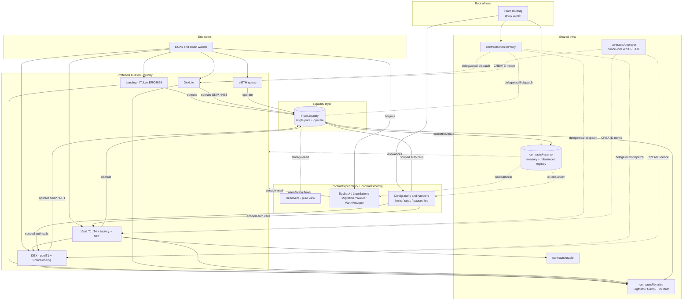

# Fluid Contracts — SPEC (repository root)

## 1. Overview

**Fluid** is a unified DeFi stack in which every protocol shares the same liquidity pool and the same rate / limit / exchange-price accounting. A single core contract — **Liquidity** — custodies every supplied token and exposes one `operate(token, ±supply, ±borrow, …)` surface to the protocols built on top. Every protocol in this repository (Lending / fToken, DEX, DexLite, Vault T1–T4, stETH queue, Flashloan, SmartLending) is, from Liquidity's perspective, *another user* that maintains a per-token supply and/or borrow position inside Liquidity's books.

The architecture is intentionally centralized at the liquidity layer:

- **Single source of truth for token supply / borrow.** There is no per-protocol token pool. Deposits from an fToken and deposits from a Vault against the same token share one balance, earn the same rate curve, and cross-amortize utilization.
- **Centralized rate, limit, and exchange-price accounting.** `LiquidityCalcs` + the packed `_exchangePricesAndConfig` / `_rateData` / `_userSupplyData` / `_userBorrowData` words define the canonical state; every higher-layer protocol reads and applies the same functions.
- **Protocol-agnostic accounting shared across Lending / DEX / Vault.** Withdrawal limits, debt ceilings, fee-on-interest, and auto-expansion curves are all implemented once in Liquidity and reused by every protocol.
- **Packed-bit storage with BigMath coefficient/exponent encoding** keeps hot paths to one or two SLOADs.
- **Four-decimal percentages (`1e4 == 100%`) everywhere** — rates, fees, expand percents, ratios.
- **Infinite proxy dispatch by selector** (not by facet struct) across every upgradeable protocol entry point (Liquidity, DEX, DexLite, Vault factory, DEX factory, etc.). Storage is owned by the proxy; logic is hot-swappable by governance.
- **Governance = team multisig**, rate-limited and scoped through narrow **auth contracts** in `contracts/config/`. Funds only leave the system via the multisig-gated **Reserve** contract.

End users never talk to Liquidity directly. They interact with the **protocol on top** (mint an fToken, open a Vault position NFT, swap through a DEX pool, queue a stETH withdrawal, …), which then translates their action into a single `operate` call against Liquidity.

For the narrative / architecture-overview companion doc, see [docs/docs.md](./docs/docs.md) and the architecture diagram [docs/architecture.jpg](./docs/architecture.jpg).

## 2. High-level architecture

**Reading the diagram:**

- All value flows through **Liquidity**. Every arrow into `Liquidity` is an `operate` / `operateOnBehalfOf` call.
- **Factories** (`VaultFactory`, `FluidLendingFactory`, `FluidDexFactory`, DexLite's internal registry) deploy protocol instances; those instances are themselves configured as "users" on Liquidity by auth contracts.
- **Resolvers** and the `FluidBuybackDSA` / `FluidWallet` clone contracts are read-oriented or user-facing wrappers; they sit beside the protocol layer, not in the critical path.
- **Config auths + handlers** are the day-to-day governance surface. They are registered as `isAuth` on Liquidity / DEX / Vault and call narrow, rate-limited setters on behalf of the multisig or the reserve rebalancer set.
- **Reserve** is the only on-chain place funds are held outside Liquidity / protocol instances; it doles out ERC-20 allowances to protocols that need to pull funds and it maintains the shared `isRebalancer` allowlist used by every config handler and every rewards contract.

## 3. Module index

Every folder under `contracts/` that ships a `SPEC.md` is listed below. The "Spec" column links directly to the sub-spec; the "Summary" column is a one-line pointer to the content of that sub-spec (it is *not* a re-statement of it).

### 3.1 Core liquidity layer

| Path | Summary | Spec |
| --- | --- | --- |
| `contracts/liquidity/` | Core pool, `operate` / `operateOnBehalfOf`, rate curves, withdrawal-limit + decay, debt ceiling, Zircuit rehypothecation hook, per-token packed state. | [liquidity/SPEC.md](./contracts/liquidity/SPEC.md) |

### 3.2 Protocols

| Path | Summary | Spec |
| --- | --- | --- |
| `contracts/protocols/lending/` | Lending protocol umbrella: factory, fToken ERC-4626 wrapper, native-token / vault variants. | [protocols/lending/SPEC.md](./contracts/protocols/lending/SPEC.md) |
| `contracts/protocols/lending/fToken/` | fToken runtime: ERC-4626 shares, exchange price, admin rewards magnifier. | [protocols/lending/fToken/SPEC.md](./contracts/protocols/lending/fToken/SPEC.md) |
| `contracts/protocols/dex/` | DEX protocol umbrella: factory, T1 pools, smart lending wrapper. | [protocols/dex/SPEC.md](./contracts/protocols/dex/SPEC.md) |
| `contracts/protocols/dex/poolT1/` | Two-token concentrated-range DEX pool with dual supply / borrow share accounting and range + threshold shifts. | [protocols/dex/poolT1/SPEC.md](./contracts/protocols/dex/poolT1/SPEC.md) |
| `contracts/protocols/dex/smartLending/` | ERC-4626-shaped share token over a DEX T1 "smart collateral" position. | [protocols/dex/smartLending/SPEC.md](./contracts/protocols/dex/smartLending/SPEC.md) |
| `contracts/protocols/dexLite/` | Lightweight single-contract DEX variant (no factory, packed per-pool in one contract). | [protocols/dexLite/SPEC.md](./contracts/protocols/dexLite/SPEC.md) |
| `contracts/protocols/vault/` | Vault protocol cross-cutting: type matrix (T1–T4), rewards magnifiers, shared errors / interfaces. | [protocols/vault/SPEC.md](./contracts/protocols/vault/SPEC.md) |
| `contracts/protocols/vault/vaultTypesCommon/` | Shared tick / branch engine, packed position storage, operate / liquidate / absorb / rebalance machinery. | [protocols/vault/vaultTypesCommon/SPEC.md](./contracts/protocols/vault/vaultTypesCommon/SPEC.md) |
| `contracts/protocols/vault/vaultT1/` | T1 runtime — ERC-20 collateral + ERC-20 debt. | [protocols/vault/vaultT1/SPEC.md](./contracts/protocols/vault/vaultT1/SPEC.md) |
| `contracts/protocols/vault/vaultT2/` | T2 runtime — DEX smart collateral + ERC-20 debt. | [protocols/vault/vaultT2/SPEC.md](./contracts/protocols/vault/vaultT2/SPEC.md) |
| `contracts/protocols/vault/vaultT3/` | T3 runtime — ERC-20 collateral + DEX smart debt. | [protocols/vault/vaultT3/SPEC.md](./contracts/protocols/vault/vaultT3/SPEC.md) |
| `contracts/protocols/vault/vaultT4/` | T4 runtime — DEX smart collateral + DEX smart debt. | [protocols/vault/vaultT4/SPEC.md](./contracts/protocols/vault/vaultT4/SPEC.md) |
| `contracts/protocols/vault/factory/` | Vault factory, ERC-721 position NFT, deployment logic whitelist, owner wrapper, rewards oracle. | [protocols/vault/factory/SPEC.md](./contracts/protocols/vault/factory/SPEC.md) |
| `contracts/protocols/steth/` | stETH queue: native ETH in → stETH claim out, with a queued-withdrawal flow. | [protocols/steth/SPEC.md](./contracts/protocols/steth/SPEC.md) |

> Not separately spec'd: `contracts/protocols/vault/vaultT1_not_for_prod/` (research / non-production copy), `contracts/protocols/vault/rewards/`, `contracts/protocols/vault/borrowRewards/` — thin magnifiers covered inline in the top-level vault spec.

### 3.3 Shared infrastructure

| Path | Summary | Spec |
| --- | --- | --- |
| `contracts/libraries/` | Shared math + safe-transfer + slot-link libraries (BigMath, LiquidityCalcs, DexCalcs, TickMath, SafeTransfer, …). | [libraries/SPEC.md](./contracts/libraries/SPEC.md) |
| `contracts/libraries/` — heavy | BigMath packed-int encoding. | [libraries/SPEC-bigMath.md](./contracts/libraries/SPEC-bigMath.md) |
| `contracts/libraries/` — heavy | Liquidity exchange-price / rate / limit calculators. | [libraries/SPEC-liquidityCalcs.md](./contracts/libraries/SPEC-liquidityCalcs.md) |
| `contracts/libraries/` — heavy | DEX exchange-price / reserve calculators. | [libraries/SPEC-dexCalcs.md](./contracts/libraries/SPEC-dexCalcs.md) |
| `contracts/libraries/` — heavy | Uniswap-v3-style tick / price math used by Vault and DEX. | [libraries/SPEC-tickMath.md](./contracts/libraries/SPEC-tickMath.md) |
| `contracts/infiniteProxy/` | Selector-dispatch proxy (Instadapp infinite proxy) + rollback module; substrate under every upgradeable protocol. | [infiniteProxy/SPEC.md](./contracts/infiniteProxy/SPEC.md) |
| `contracts/deployer/` | `FluidContractFactory` — deterministic CREATE-by-nonce deployer so protocols store a 30-bit nonce instead of a 160-bit address. | [deployer/SPEC.md](./contracts/deployer/SPEC.md) |
| `contracts/reserve/` | `FluidReserveContract` — treasury, ERC-20 allowance hub, shared rebalancer allowlist. | [reserve/SPEC.md](./contracts/reserve/SPEC.md) |
| `contracts/oracleV2/` | Current price layer: USD oracle, vault oracles, capped rates, center prices, stock oracles. | [usdOracle/SPEC.md](./contracts/oracleV2/usdOracle/SPEC.md), [vaultOracle/SPEC.md](./contracts/oracleV2/vaultOracle/SPEC.md), [stocks/SPEC.md](./contracts/oracleV2/stocks/SPEC.md) |
| `contracts/oracleV1_DEPRECATED/` | Legacy price layer — do not extend. Chainlink / Redstone / UniV3 + LST ratio adapters, L1 and L2. | [oracleV1_DEPRECATED/SPEC.md](./contracts/oracleV1_DEPRECATED/SPEC.md) |

### 3.4 Governance / config

| Path | Summary | Spec |
| --- | --- | --- |
| `contracts/config/` | Index + shared conventions (config handlers vs auth contracts, error ranges, multisig constants) for all governance helpers. | [config/SPEC.md](./contracts/config/SPEC.md) |
| `contracts/config/pauseAuth/` | Pause / unpause surface for Liquidity, DEX, DexLite. | [config/pauseAuth/SPEC.md](./contracts/config/pauseAuth/SPEC.md) |
| `contracts/config/dexFeeHandler/` | Permissionless rebalancer that moves DEX pool fee toward a target. | [config/dexFeeHandler/SPEC.md](./contracts/config/dexFeeHandler/SPEC.md) |
| `contracts/config/limitsAuth/` | Bounded supply / borrow limit changes on Liquidity. | [config/limitsAuth/SPEC.md](./contracts/config/limitsAuth/SPEC.md) |
| `contracts/config/limitsAuthDex/` | Bounded supply / borrow share-limit changes on DEX. | [config/limitsAuthDex/SPEC.md](./contracts/config/limitsAuthDex/SPEC.md) |
| `contracts/config/withdrawLimitAuth/` | Rate-limited withdraw-limit adjustment on Liquidity. | [config/withdrawLimitAuth/SPEC.md](./contracts/config/withdrawLimitAuth/SPEC.md) |
| `contracts/config/withdrawLimitAuthDex/` | Rate-limited withdraw-limit adjustment on DEX. | [config/withdrawLimitAuthDex/SPEC.md](./contracts/config/withdrawLimitAuthDex/SPEC.md) |
| `contracts/config/rangeAuthDex/` | Rate-limited upper / lower range shifts on DEX pools. | [config/rangeAuthDex/SPEC.md](./contracts/config/rangeAuthDex/SPEC.md) |
| `contracts/config/ratesAuth/` | Bounded update of Liquidity rate-data curve points. | [config/ratesAuth/SPEC.md](./contracts/config/ratesAuth/SPEC.md) |
| `contracts/config/liquidityTokenAuth/` | Two-step governance to list + configure a new token on Liquidity. | [config/liquidityTokenAuth/SPEC.md](./contracts/config/liquidityTokenAuth/SPEC.md) |
| `contracts/config/vaultFeeRewardsAuth/` | Team-multisig nudges to vault supply / borrow rate magnifiers. | [config/vaultFeeRewardsAuth/SPEC.md](./contracts/config/vaultFeeRewardsAuth/SPEC.md) |
| `contracts/config/collectRevenueAuth/` | One-method gate to call `Liquidity.collectRevenue`. Covered inline in [config/SPEC.md](./contracts/config/SPEC.md). |
| `contracts/config/dexFeeAuth/` | Team-multisig instant fee / revenue-cut setter on DEX. Covered inline in [config/SPEC.md](./contracts/config/SPEC.md). |
| `contracts/config/paybackOnBehalfAuth/` | Team-multisig-only wrapper around `operateOnBehalfOf` for debt repayment. Covered inline in [config/SPEC.md](./contracts/config/SPEC.md). |

> Out of scope for this spec pass (documented inline in [config/SPEC.md](./contracts/config/SPEC.md) as skipped): `bufferRateHandler/`, `ethenaRateHandler/`, `expandPercentHandler/`, `maxBorrowHandler/`.

### 3.5 Periphery

| Path | Summary | Spec |
| --- | --- | --- |
| `contracts/periphery/` | Index of user-facing helpers and read-only resolvers. | [periphery/SPEC.md](./contracts/periphery/SPEC.md) |
| `contracts/periphery/buyback/` | Rebalancer-driven FLUID buyback via an owned DSA; swaps protocol revenue → FLUID → treasury. | [periphery/buyback/SPEC.md](./contracts/periphery/buyback/SPEC.md) |
| `contracts/periphery/liquidation/` | Flashloan-backed vault liquidator for T1–T4 (standalone + proxy + implementation registry). | [periphery/liquidation/SPEC.md](./contracts/periphery/liquidation/SPEC.md) |
| `contracts/periphery/migration/` | One-tx Vault T1 NFT migrator between old and new factories. | [periphery/migration/SPEC.md](./contracts/periphery/migration/SPEC.md) |
| `contracts/periphery/wallet/` | Per-user smart-wallet factory + clone for composing multi-action Vault T1 strategies via NFT transfer. | [periphery/wallet/SPEC.md](./contracts/periphery/wallet/SPEC.md) |
| `contracts/periphery/wethWrapper/` | Aave-shaped wrapper so a Vault T1 with native-ETH collateral can be used via WETH. | [periphery/wethWrapper/SPEC.md](./contracts/periphery/wethWrapper/SPEC.md) |
| `contracts/periphery/resolvers/` | Index of all read-only resolvers (below). | [periphery/resolvers/SPEC.md](./contracts/periphery/resolvers/SPEC.md) |
| `contracts/periphery/resolvers/liquidity/` | Liquidity resolver: applies `LiquidityCalcs` on top of packed state. | [periphery/resolvers/liquidity/SPEC.md](./contracts/periphery/resolvers/liquidity/SPEC.md) |
| `contracts/periphery/resolvers/lending/` | fToken resolver aggregates. | [periphery/resolvers/lending/SPEC.md](./contracts/periphery/resolvers/lending/SPEC.md) |
| `contracts/periphery/resolvers/dex/` | DEX T1 pool resolver. | [periphery/resolvers/dex/SPEC.md](./contracts/periphery/resolvers/dex/SPEC.md) |
| `contracts/periphery/resolvers/dexLite/` | DexLite resolver. | [periphery/resolvers/dexLite/SPEC.md](./contracts/periphery/resolvers/dexLite/SPEC.md) |
| `contracts/periphery/resolvers/dexReserves/` | Reserve-side DEX read aggregates. | [periphery/resolvers/dexReserves/SPEC.md](./contracts/periphery/resolvers/dexReserves/SPEC.md) |
| `contracts/periphery/resolvers/smartLending/` | SmartLending wrapper resolver. | [periphery/resolvers/smartLending/SPEC.md](./contracts/periphery/resolvers/smartLending/SPEC.md) |
| `contracts/periphery/resolvers/vault/` | Generic vault resolver (T1–T4). | [periphery/resolvers/vault/SPEC.md](./contracts/periphery/resolvers/vault/SPEC.md) |
| `contracts/periphery/resolvers/vaultT1/` | T1-specific vault resolver (legacy). | [periphery/resolvers/vaultT1/SPEC.md](./contracts/periphery/resolvers/vaultT1/SPEC.md) |
| `contracts/periphery/resolvers/vaultPositions/` | Per-position NFT view with debt / collateral / health. | [periphery/resolvers/vaultPositions/SPEC.md](./contracts/periphery/resolvers/vaultPositions/SPEC.md) |
| `contracts/periphery/resolvers/vaultTicksBranches/` | Tick + branch view for the liquidation engine. | [periphery/resolvers/vaultTicksBranches/SPEC.md](./contracts/periphery/resolvers/vaultTicksBranches/SPEC.md) |
| `contracts/periphery/resolvers/vaultLiquidation/` | Liquidation-simulation resolver. | [periphery/resolvers/vaultLiquidation/SPEC.md](./contracts/periphery/resolvers/vaultLiquidation/SPEC.md) |
| `contracts/periphery/resolvers/revenue/` | Revenue projection across tokens. | [periphery/resolvers/revenue/SPEC.md](./contracts/periphery/resolvers/revenue/SPEC.md) |
| `contracts/periphery/resolvers/steth/` | stETH queue resolver. | [periphery/resolvers/steth/SPEC.md](./contracts/periphery/resolvers/steth/SPEC.md) |
| `contracts/periphery/resolvers/stakingRewards/` | StakingRewards resolver. | [periphery/resolvers/stakingRewards/SPEC.md](./contracts/periphery/resolvers/stakingRewards/SPEC.md) |
| `contracts/periphery/resolvers/stakingMerkle/` | Merkle-distribution staking resolver. | [periphery/resolvers/stakingMerkle/SPEC.md](./contracts/periphery/resolvers/stakingMerkle/SPEC.md) |

> Not independently spec'd: `contracts/periphery/resolvers/common/` (shared resolver base) — see [periphery/resolvers/SPEC.md](./contracts/periphery/resolvers/SPEC.md).

### 3.6 Mocks

`contracts/mocks/` is test-only scaffolding (mock callback, mock center price, empty implementations, mock ERC-721). Not spec'd.

## 4. Cross-cutting conventions

These conventions are implemented the same way across every module. A sub-spec restates them only when it has module-specific deviations.

### 4.1 BigMath packed storage

- Numeric state in hot paths is stored as **`coefficient | exponent`** (e.g. 56|8, 18|8, 10|8). See [libraries/SPEC-bigMath.md](./contracts/libraries/SPEC-bigMath.md).
- Encoding is precision-bounded (~`7.2×10^16` at a 56-bit coefficient) but deterministic — storage overflow checks are not required because `toBigNumber` always fits the expected bit size.
- `BigMathUnsafe` exists in `contracts/libraries/` but is **not used in production vault / DEX paths**.

### 4.2 Rounding semantics

- **Supply side rounds down.** User supply amounts, total supply, withdrawal limits, supply exchange price.
- **Borrow side rounds up.** User borrow amounts, total borrow, borrow exchange price.
- One deliberate exception: `calcWithdrawalLimitAfter` rounds the new withdrawal-limit floor **down** — rounding up there can induce revert-only precision edges, and the sub-dust effect on the limit floor is not security-relevant.

### 4.3 Four-decimal percentages

`FOUR_DECIMALS = 1e4 == 100%`. Any percent in this codebase — rate curve points, fee, revenue cut, expand percent, supply ratio, borrow ratio, collateral factor, liquidation threshold, max utilization — is a 4-decimal integer. `100 == 1%`, `10 000 == 100%`, `1 == 0.01%`.

### 4.4 Native-token sentinel

`NATIVE_TOKEN_ADDRESS = 0xEeeeeEeeeEeEeeEeEeEeeEEEeeeeEeeeeeeeEEeE`. Used wherever an ERC-20 address is expected. Transfers use `SafeTransfer.safeTransferNative` with a deliberate 50 000-gas stipend.

### 4.5 Error ID ranges

All contracts revert with `<Namespace>Error(uint256 errorId_)` rather than named custom errors. Per-protocol ranges in use:

| Range | Owner |
| ---: | --- |
| `10001–10030` | `FluidLiquidityError` — AdminModule |
| `11001–11023` | `FluidLiquidityError` — UserModule |
| `12001` | `FluidLiquidityError` — LiquidityHelpers (reentrancy) |
| `3xxxx` | `FluidVaultError`, `FluidVaultFactoryError` |
| `5xxxx–6xxxx` | `FluidDexError`, `FluidDexLiteError` |
| `7xxxx–8xxxx` | `LibsErrorTypes` (libraries) |
| `100001–100152` | `FluidConfigError` (see [config/SPEC.md §3.4](./contracts/config/SPEC.md)) |
| `501001–501999` | `FluidPermissionGateError` — permission gate |
| `502001–502999` | `FluidPermissionedError` — permissioned protocol wrappers |
| local enums | periphery helpers (`Fluid<Helper>__<Reason>`) |

Exact codes per contract are defined in the corresponding `errorTypes.sol` file next to each `error.sol`. The project-wide convention for decoding errors at runtime is documented in [docs/errors.md](./docs/errors.md).

### 4.6 Storage read convention

Every public Fluid contract inherits `contracts/libraries/storageRead.sol` (`StorageRead.readFromStorage(bytes32 slot)`). Resolvers and integrators read packed words directly via that slot and decode with the `liquiditySlotsLink` / `dexSlotsLink` / `dexLiteSlotsLink` constants — **never** via per-field getters.

### 4.7 Infinite-proxy upgradeability

Every core protocol entry point (Liquidity, DEX, DexLite, Vault factory, DEX factory, Smart Lending, Flashloan, stETH) sits behind an **infinite proxy** that dispatches calls by `msg.sig`. Logic contracts boot their reentrancy flag to `ENTERED` in their constructor so **direct calls revert** — they can only be reached through the proxy's `delegatecall`. See [infiniteProxy/SPEC.md](./contracts/infiniteProxy/SPEC.md) for dispatch internals and the 7-day rollback module.

Periphery helpers use **OpenZeppelin UUPS** behind `ERC1967Proxy` instead of the infinite proxy (`buyback`, `wallet/factory`, `wethWrapper`, reserve). Non-upgradeable helpers (`liquidation`, `migration`) ship an owner-gated `spell(targets[], calldatas[])` delegate-call escape hatch.

### 4.8 Deterministic sub-contract deployment

Small leaf contracts (center prices, hooks, rebalancer helpers) are deployed through `contracts/deployer/FluidContractFactory`. The referencing protocol stores only a 30-bit nonce and recomputes the address with `AddressCalcs.addressCalc(DEPLOYER, nonce)`. See [deployer/SPEC.md](./contracts/deployer/SPEC.md).

### 4.9 Reentrancy

- **Liquidity / Vault / older protocols** use a storage-bit reentrancy guard (`_status`, 1 / 2) that doubles as the global pause flag.
- **DexLite and newer protocols** use `ReentrancyLock` at a transient-storage slot (Cancun `tstore` / `tload`).
- **Periphery helpers** that move funds across an external call boundary ship their own `nonReentrant` storage lock.

### 4.10 Revenue collection

Liquidity has no per-source revenue ledger. `collectRevenue(tokens[])` sweeps whatever untracked balance exists (actual balance + rehypothecated balance − tracked user supply / borrow) into the governance-configured `_revenueCollector`, which in production points at `FluidReserveContract`. Revenue runs **rarely** (typically monthly+); temporary sweep blockers (e.g. Zircuit stuck for weETH) are tolerated. See [reserve/SPEC.md](./contracts/reserve/SPEC.md).

## 5. Upgradeability & governance

**The team multisig is the single root of trust.** Every upgradeable contract's admin, every protocol's `governance`, every `onlyOwner` helper, and every `TEAM_MULTISIG` / `TEAM_MULTISIG2` constant resolve — directly or by one hop — back to the multisig.

Delegation shape:

1. **Multisig → Infinite proxy `setImplementation` / UUPS `upgradeTo`** — logic upgrades for every core protocol + upgradeable periphery contract. 7-day rollback available via `InfiniteProxyRollbackModule`.
2. **Multisig → `updateAuths` on Liquidity / DEX / DexLite / Vault factory** — registers **narrow auth contracts** from `contracts/config/` as `isAuth`. Each auth exposes one or a few setters with input bounds, rate limits, and allowlists baked in. The auth's code *is* the delegation contract: rotating operators means replacing the auth, not editing storage.
3. **Multisig → `updateGuardians`** — grants pause-only power. Guardians cannot reconfigure rates / limits / rewards and cannot move funds anywhere except out of Zircuit rehypothecation (emergency unwind).
4. **Multisig → `FluidReserveContract`** — sets `isRebalancer` addresses (bots, keeper scripts). Rebalancers can trigger config handler `rebalance()`, vault rewards `rebalance()`, `collectRevenueAuth`, liquidation runs, and buyback swaps — but never move funds out of the reserve (only the multisig can, and only to `TREASURY_ADDRESS` / `BUYBACK_CONTRACT_ADDRESS`).
5. **Rate-limited knobs inside auth contracts** — `limitsAuth`, `withdrawLimitAuth`, `rangeAuthDex`, `ratesAuth`, etc. cap both the magnitude and cadence of day-to-day parameter changes so an operator key compromise cannot immediately drain or unsafely open the system. See individual config sub-specs for each knob's ceiling.
6. **Pause system**: three layers. Global `Liquidity._status = 2` (full stop on user operations), per-token pause bit (bit 255 of `_exchangePricesAndConfig`), per-user-per-token pause bit (bit 255 of `_userSupplyData` / `_userBorrowData`). Each higher-layer protocol (Vault, DEX, DexLite, fToken, …) has its own independent pause surface — there is **no** auto-propagation of pause state.

A compromised multisig can upgrade implementations, grant itself new auths, seize the Reserve (via `withdrawFunds` to `TREASURY_ADDRESS`), and reconfigure rate / limit parameters. Treat the multisig as equivalent to full control of the protocol.

## 6. Trust model

**Trusted on-chain:**

- **Team multisig.** Proxy admin for every core protocol. Can upgrade, add / remove auths + guardians, change revenue collector, reconfigure Zircuit hooks.
- **Auth contracts registered as `isAuth`.** Their source code is the scope of the delegation; rewriting their logic requires a new deploy + multisig re-registration.
- **Guardians registered as `isGuardian`.** Pause-only authority.
- **Reserve rebalancers** (`FluidReserveContract.isRebalancer`). Can trigger revenue collection, vault rewards rebalancing, liquidations, buybacks, and permissionless-ish config handler calls. Cannot move funds out of the reserve.
- **`FluidLiquidity` itself.** Every upper-layer protocol trusts Liquidity's `LiquidityCalcs` math and its `liquidityCallback` ordering.
- **`FluidContractFactory`.** Protocols trust its CREATE-nonce determinism (`AddressCalcs`) for resolving center-price / hook addresses.
- **Vault oracle implementations in `contracts/oracleV2/` (and `contracts/oracleV1_DEPRECATED/` for live legacy oracles).** Vault collateralization and liquidation depend on these oracles returning sane prices within the `1e45` rounding envelope. Oracle correctness is part of the per-listing review, not a live on-chain guarantee.

**Trusted off-chain:**

- **Team multisig signers** (currently `TEAM_MULTISIG = 0x4F6F…D49e`, `TEAM_MULTISIG2 = 0x1e2e…4219`).
- **Rebalancer operators** — whichever addresses the multisig adds to the reserve's `isRebalancer` set. They can steer parameters and collect revenue but cannot exfiltrate.
- **Oracle feed operators** — for each listed collateral, the upstream oracle (Chainlink, Chronicle, Pyth, redstone, etc.) is trusted to publish prices; the oracle adapter's job is only to reshape and sanity-check.
- **Zircuit Ztaking Pool** (mainnet weETH / weETHs only). Liquidity grants `type(uint256).max` allowance at deposit time and relies on Zircuit's liveness / correctness for `withdrawZircuitWeETH(s)` to release funds. A compromised or stuck Zircuit blocks revenue sweeps and withdrawal of the rehypothecated portion; guardians retain the emergency-unstake path.

**Not trusted:**

- **End users.** Every user-facing entry point validates inputs and balances. A malicious user cannot meaningfully affect another user's Liquidity position; the closest surface is oracle manipulation against a vault, which is gated by per-asset oracle review.
- **Permissionless callers of `updateExchangePrices` / flash-callback paths.** They can only trigger benign storage refreshes; no fund impact.

## 7. Docs

**Public architecture doc** — [docs/docs.md](./docs/docs.md) (narrative overview, BigMath, raw-vs-normal amounts, token listing flow, worked examples), [docs/architecture.jpg](./docs/architecture.jpg), [docs/errors.md](./docs/errors.md), [docs/contracts/](./docs/contracts/) (per-contract deployment addresses).

## 8. How AI agents should use these specs

**Start at this file (`SPEC.md`)** to orient yourself: read §2 for the architecture, §3 for the module index, §4 for conventions that apply to the whole monorepo. Then **drill into the relevant sub-spec** (`contracts/<module>/SPEC.md`) for the specific protocol, auth, or library you're touching — every sub-spec covers purpose, external interactions, roles / access control, storage layout, methods, events, errors, invariants, and trust model. **Only open specific contract sources (`.sol`) when a sub-spec's detail is insufficient** — typically to confirm an exact bit layout, a specific selector signature, or to pattern-match a new feature against existing code. Cross-cutting questions (rounding, BigMath, pause semantics, governance delegation) are answered here and in [docs/docs.md](./docs/docs.md); do not re-derive them from source.
