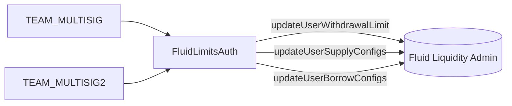

# Config / limitsAuth — SPEC

## 1. Purpose

`FluidLimitsAuth` is a narrow, team‑multisig‑gated **auth** on Fluid Liquidity that lets operations nudge a *single user’s* per‑token supply / borrow limits without running a full governance transaction. It wraps three Liquidity admin calls:

- `updateUserWithdrawalLimit` — directly rewrite the live withdrawal‑limit accumulator for a `(user, token)` pair (used to immediately unblock or cap a withdraw).
- `updateUserSupplyConfigs` — set the **base withdrawal limit** of a user supply config.
- `updateUserBorrowConfigs` — set the **base debt ceiling** and/or **max debt ceiling** of a user borrow config.

The contract exists so that routine, bounded limit bumps on already‑onboarded protocol users (vaults, DEXes, integrators) are possible without handing the multisig raw `updateUser*Configs` access on Liquidity. Bounds are enforced as a **±20 % percentage cap** and, for borrow, a **4‑day cooldown**.

See [`../SPEC.md`](../SPEC.md) for config‑folder conventions (hard‑coded multisigs, `FluidConfigError`, error‑id ranges).

## 2. Architecture

Single contract, single layer:



- Deployed once against a Liquidity instance (`LIQUIDITY` immutable).
- Registered as an **auth** on Liquidity so that its calls pass Liquidity's `onlyAuths` modifier on `updateUserWithdrawalLimit`, `updateUserSupplyConfigs`, and `updateUserBorrowConfigs`.
- Stateless apart from a per‑`(user, token)` `lastUpdateTime` map used for the borrow cooldown.
- No per‑protocol allowlists, no role tiers, no admin setters: the allowed percentage (20 %) and cooldown (4 days) are compile‑time constants, and the only callers are the two hard‑coded team multisigs.

## 3. External Interactions

- Reads Liquidity storage directly via `IFluidLiquidity.readFromStorage` at the user‑supply / user‑borrow double‑mapping slots, then decodes the packed config with `BigMathMinified` (8‑bit exponent, 8‑bit‑mask). Decoded shape matches `AdminModuleStructs.UserSupplyConfig` / `UserBorrowConfig`.
- Writes through `IFluidLiquidity` admin methods:
  - `updateUserWithdrawalLimit(user, token, newLimit)`
  - `updateUserSupplyConfigs(UserSupplyConfig[])`
  - `updateUserBorrowConfigs(UserBorrowConfig[])`
- No ETH / ERC‑20 custody, no callbacks, no reentrancy surface.

## 4. Roles & Access Control

| Modifier | Who passes |
| --- | --- |
| `onlyMultisig` | `TEAM_MULTISIG` **or** `TEAM_MULTISIG2` |
| `validAddress(value_)` | `value_ != address(0)` (used only on constructor `liquidity_`) |

All three state‑changing methods are `onlyMultisig`. There is **no operator tier, no per‑protocol allowlist, and no way to delegate**: every limit change must be signed by one of the two multisigs.

Hard‑coded constants:

```33:38:contracts/config/limitsAuth/main.sol
    IFluidLiquidity public immutable LIQUIDITY;
    /// @notice Team multisigs allowed to trigger methods
    address public constant TEAM_MULTISIG = 0x4F6F977aCDD1177DCD81aB83074855EcB9C2D49e;
    address public constant TEAM_MULTISIG2 = 0x1e2e1aeD876f67Fe4Fd54090FD7B8F57Ce234219;

    uint256 internal constant COOLDOWN_PERIOD = 4 days;
```

`MAX_PERCENT_CHANGE = 20` (meaning ±20 % of the existing value) is also hard‑coded.

## 5. Storage Layout

| Symbol | Type | Purpose |
| --- | --- | --- |
| `LIQUIDITY` | `IFluidLiquidity` (immutable) | Target Liquidity instance. |
| `lastUpdateTime` | `mapping(address user => mapping(address token => uint256))` | Unix timestamp of the last `setUserBorrowLimits` call for the pair; drives the 4‑day cooldown. |

No other persistent storage. `setWithdrawalLimit` and `setUserWithdrawLimit` **do not write** `lastUpdateTime` — the cooldown applies only to borrow limit changes.

Bit‑layout constants used to decode packed Liquidity storage:

```22:32:contracts/config/limitsAuth/main.sol
    uint256 internal constant X14 = 0x3fff;
    uint256 internal constant X18 = 0x3ffff;
    uint256 internal constant X24 = 0xffffff;

    uint256 internal constant DEFAULT_EXPONENT_SIZE = 8;
    uint256 internal constant DEFAULT_EXPONENT_MASK = 0xFF;

    /// @dev This represents 20%.
    uint256 internal constant MAX_PERCENT_CHANGE = 20;
```

## 6. Public Methods

All state‑changing methods are `onlyMultisig`. Views are unrestricted.

### State‑changing

| Method | Forwards to | Cooldown | % cap | Writes `lastUpdateTime` |
| --- | --- | --- | --- | --- |
| `setWithdrawalLimit(user, token, newLimit)` | `Liquidity.updateUserWithdrawalLimit` | — | — | No |
| `setUserWithdrawLimit(user, token, baseLimit, skipMaxPercentChangeCheck)` | `Liquidity.updateUserSupplyConfigs` (single entry) | — | ±20 % on `baseWithdrawalLimit` unless `skipMaxPercentChangeCheck == true` | No |
| `setUserBorrowLimits(user, token, baseLimit, maxLimit)` | `Liquidity.updateUserBorrowConfigs` (single entry) | 4 days per `(user, token)` | ±20 % on each non‑zero field | Yes |

#### `setWithdrawalLimit(user, token, newLimit)`

- Pushes `newLimit` straight into Liquidity's live per‑user withdrawal‑limit accumulator (not a config field). Typical use: temporarily release or clamp a stuck withdraw limit that would otherwise need to expand over time.
- **No validation of `newLimit`** beyond whatever Liquidity itself enforces: `0` is a legal input (it lets the user withdraw down to the base limit on next recalculation), and arbitrarily large values are accepted at this layer. The ±20 % cap does **not** apply here.
- **Side effects:** the Liquidity admin call, `LogSetWithdrawalLimit(user, token, newLimit)` event.

#### `setUserWithdrawLimit(user, token, baseLimit, skipMaxPercentChangeCheck)`

- Updates only `baseWithdrawalLimit` on the user's supply config; all other fields (`mode`, `expandPercent`, `expandDuration`) are read back from Liquidity and re‑submitted unchanged.
- **`baseLimit == 0`** reverts with `LimitsAuth__InvalidParams` (100101). The "set to 0 to keep current value" behaviour mentioned in the NatSpec is *not* implemented — 0 is rejected.
- If the `(user, token)` slot is empty (user never configured at Liquidity), `getUserSupplyConfig` returns the zero struct and the method reverts with `LimitsAuth__UserNotDefinedYet` (100103).
- Unless `skipMaxPercentChangeCheck == true`, the new base must differ from the old one by at most `oldLimit * 20 / 100`; otherwise `LimitsAuth__ExceedAllowedPercentageChange` (100104). Boundary: a diff of exactly `maxDelta` passes; `maxDelta + 1` reverts. When `oldLimit == 0` the cap reduces to `0` — only the skip flag can push a non‑zero value, which is the intended escape hatch for first‑time enablement after the user row is created by governance.
- **Side effects:** `Liquidity.updateUserSupplyConfigs([config])`, `LogSetUserWithdrawLimit(user, token, baseLimit)`.

#### `setUserBorrowLimits(user, token, baseLimit, maxLimit)`

- Updates `baseDebtCeiling` and/or `maxDebtCeiling` on the user's borrow config. A field set to `0` is **skipped** (keeps the current value); both zero reverts with `LimitsAuth__InvalidParams` (100101).
- If the `(user, token)` borrow slot is empty, reverts with `LimitsAuth__UserNotDefinedYet` (100103).
- Enforces the ±20 % cap on **each non‑zero field independently** against its current on‑chain value; either violation reverts with `LimitsAuth__ExceedAllowedPercentageChange` (100104). There is no `skip` flag here — the cap is mandatory.
- Enforces a **4‑day cooldown per `(user, token)`**: if `block.timestamp - lastUpdateTime[user][token] < 4 days`, reverts with `LimitsAuth__CoolDownPending` (100105). First call for a pair passes (initial `lastUpdateTime == 0`).
- On success, writes `lastUpdateTime[user][token] = block.timestamp` **before** the Liquidity call.
- **Side effects:** `Liquidity.updateUserBorrowConfigs([config])`, `LogSetUserBorrowLimits(user, token, baseDebtCeiling, maxDebtCeiling)`.

### Views

| View | Returns |
| --- | --- |
| `getUserSupplyConfig(user, token)` | `AdminModuleStructs.UserSupplyConfig` decoded from Liquidity storage. Returns zero struct if the user row is empty. |
| `getUserBorrowConfig(user, token)` | `AdminModuleStructs.UserBorrowConfig`, likewise. |
| `lastUpdateTime(user, token)` | Auto‑generated getter on the mapping; timestamp of last `setUserBorrowLimits` success. |
| `LIQUIDITY` / `TEAM_MULTISIG` / `TEAM_MULTISIG2` | Public constants/immutables. |

Both decode helpers use `BigMathMinified.fromBigNumber` with `DEFAULT_EXPONENT_SIZE = 8`, `DEFAULT_EXPONENT_MASK = 0xFF`, matching how the admin module writes these fields.

## 7. Admin Methods

**None.** The contract exposes no setters for the cooldown period, percentage cap, multisig addresses, or operator allowlists — all of those are compile‑time constants. The upgrade path is redeploy + re‑register as an auth on Liquidity (see `../SPEC.md` §3.2).

## 8. Events

- `LogSetWithdrawalLimit(address user, address token, uint256 newLimit)` — emitted by `setWithdrawalLimit`.
- `LogSetUserWithdrawLimit(address user, address token, uint256 baseLimit)` — emitted by `setUserWithdrawLimit` with the final `baseLimit` actually written.
- `LogSetUserBorrowLimits(address user, address token, uint256 baseLimit, uint256 maxLimit)` — emitted by `setUserBorrowLimits` with the final ceilings actually written (either the new value or the preserved old value when the corresponding input was 0).

No events on Liquidity storage reads, no events on reverts.

## 9. Errors

All errors are raised as `FluidConfigError(errorId_)` from `contracts/config/error.sol`.

| Code | Name | Raised when |
| --- | --- | --- |
| 100101 | `LimitsAuth__InvalidParams` | Constructor `liquidity_ == 0`; `setUserWithdrawLimit` with `baseLimit == 0`; `setUserBorrowLimits` with both `baseLimit == 0 && maxLimit == 0`. |
| 100102 | `LimitsAuth__Unauthorized` | Caller is neither `TEAM_MULTISIG` nor `TEAM_MULTISIG2`. |
| 100103 | `LimitsAuth__UserNotDefinedYet` | The `(user, token)` row at Liquidity is empty — the user has never been onboarded for that token's supply/borrow side. Must be initialised by governance first. |
| 100104 | `LimitsAuth__ExceedAllowedPercentageChange` | A proposed new limit differs from the current on‑chain limit by more than ±20 %. |
| 100105 | `LimitsAuth__CoolDownPending` | `setUserBorrowLimits` called less than 4 days after the previous successful call for the same `(user, token)`. |

## 10. Invariants & Safety Notes

- **Scope is per `(user, token)`**: the contract cannot touch token‑level configs, protocol‑wide limits, rates, pause bits, or any other Liquidity admin surface. Liquidity still fully owns those.
- **±20 % cap is enforced symmetrically** around the current value: `|new − old| ≤ old * 20 / 100`. With `old == 0` the cap collapses to 0, so a user whose current field is zero cannot be moved by this contract unless the caller passes `skipMaxPercentChangeCheck == true` (only available on `setUserWithdrawLimit`).
- **Cooldown applies only to borrow** and only per `(user, token)` — a single multisig tx can modify many *different* pairs without interference. `setUserWithdrawLimit` and `setWithdrawalLimit` have no cooldown at all.
- **`setWithdrawalLimit` bypasses the cap**: it is a raw pass‑through to Liquidity. This is intentional (it writes the live limit accumulator, not a config), but it means the multisig retains one unconstrained withdraw‑side lever through this auth.
- **`skipMaxPercentChangeCheck` on `setUserWithdrawLimit` is also an unconstrained lever**, guarded only by the multisig. It is meant for legitimate non‑percentage‑bounded adjustments (first write after governance onboarding, emergency rewrite) and not for routine use.
- **`lastUpdateTime` is written before the Liquidity call** inside `setUserBorrowLimits`. If Liquidity reverts, the cooldown state reverts with it; there is no risk of a "burned" cooldown on failure.
- **No reentrancy guard**: Liquidity admin methods do not call back into arbitrary code, and this contract holds no balances, so none is needed.
- **Token / user arrays are length‑1**: each state‑changing method constructs a one‑entry `UserSupplyConfig[]` / `UserBorrowConfig[]` before calling Liquidity — batch updates are not exposed.

## 11. Trust Model & Accepted Trade‑offs

- **Root of trust: either team multisig.** Compromise of `TEAM_MULTISIG` or `TEAM_MULTISIG2` lets an attacker move any onboarded user's limits by up to ±20 % at a time (plus one 4‑day wait between borrow changes), push arbitrary `newLimit` into the live withdrawal‑limit accumulator, and — by setting `skipMaxPercentChangeCheck == true` — set any supply `baseWithdrawalLimit`. They cannot onboard new users, touch token‑level configs, change rates, pause markets, or otherwise escape the three Liquidity admin calls listed above.
- **Rate limits replace, rather than eliminate, per‑change governance review**: the 20 % bound keeps each step within a blast radius that the Liquidity‑layer expand/withdraw limits and oracle risk parameters can absorb. Larger moves must still be done by removing/replacing this auth or via direct governance on Liquidity.
- **Hard‑coded multisigs** trade rotatability for storage‑governance safety (no settable admin, so no "governance‑change bug" here). Rotating either multisig requires redeploying and re‑registering this auth.
- **The skip‑flag and `setWithdrawalLimit` are accepted high‑trust escape hatches** used specifically by the team multisig for bootstrap and emergency flows. Day‑to‑day limit nudges use the capped path.

## 12. Audit Notes (absorbed)

- The NatSpec on `setUserWithdrawLimit` says *"Set to 0 to keep current value"* for `baseLimit_`, but the implementation rejects `baseLimit_ == 0` with `LimitsAuth__InvalidParams`. Only `setUserBorrowLimits` actually implements the "zero means keep" semantics (for each field individually). Callers relying on the NatSpec would get a revert, not a no‑op; this is a documentation mismatch, not a safety bug.
- The ±20 % check becomes a no‑op cap when the existing value is 0 (since `maxDelta` computes to 0 and the `if` branches compare against it). This is why `skipMaxPercentChangeCheck` exists on the supply path; the borrow path does not have a skip flag and is therefore unable to set a first non‑zero ceiling if it was previously 0. That case requires governance to seed the initial ceilings on Liquidity directly.
- `lastUpdateTime` is only ever updated by `setUserBorrowLimits`. A multisig operator running `setUserWithdrawLimit` and `setWithdrawalLimit` in a tight loop is by design not cooldown‑gated.
