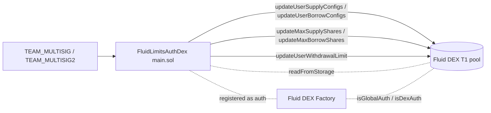

# Config / limitsAuthDex — SPEC

## 1. Purpose

Team-multisig-gated, bounded adjustment of **per-user (vault) supply / borrow limits** and **DEX-level max supply / borrow shares** on Fluid DEX T1 pools. The DEX-layer counterpart to [`limitsAuth`](../limitsAuth/) (which targets Liquidity): instead of token-amount limits at Liquidity, this contract nudges **share-denominated** limits on individual DEXes.

Single contract: `FluidLimitsAuthDex` (`main.sol`). It is deployed as a **DEX auth** (global or dex-specific) on the Fluid DEX Factory and calls `IFluidDexT1Admin` methods on the target pool. All operational methods are restricted to `TEAM_MULTISIG` / `TEAM_MULTISIG2` and bounded by a hard-coded `MAX_PERCENT_CHANGE = 20%` delta check plus a `4 day` cooldown on the riskier paths.

For repo-wide config conventions (auth contract pattern, error convention, hardcoded multisigs) see [../SPEC.md](../SPEC.md).

## 2. Architecture & Data Flow

Every operational call: `multisig → FluidLimitsAuthDex` (auth + bounds + cooldown check) → DEX pool `fallback` (factory auth check) → `FluidDexT1Admin` (delegatecalled). Pre-call reads use `IFluidDexT1.readFromStorage` via `DexSlotsLink` to fetch the current on-chain config before computing / validating the new value.

## 3. External Interactions

- Calls `IFluidDexT1Admin` (the DEX admin module, reached via the pool's `fallback`):
  - `updateUserSupplyConfigs(UserSupplyConfig[])` — writes `baseWithdrawalLimit` for a user on a DEX.
  - `updateUserBorrowConfigs(UserBorrowConfig[])` — writes `baseDebtCeiling` / `maxDebtCeiling` for a user on a DEX.
  - `updateMaxSupplyShares(uint256)` / `updateMaxBorrowShares(uint256)` — pool-level share caps.
  - `updateUserWithdrawalLimit(address,uint256)` — sets the current withdrawal limit for a user.
- Reads pool storage via `IFluidDexT1.readFromStorage` at slots from `DexSlotsLink`:
  - `DEX_USER_SUPPLY_MAPPING_SLOT` (per-user supply packed word).
  - `DEX_USER_BORROW_MAPPING_SLOT` (per-user borrow packed word).
  - `DEX_TOTAL_SUPPLY_SHARES_SLOT` / `DEX_TOTAL_BORROW_SHARES_SLOT` (current max shares are the upper 128 bits).
- Decodes `baseWithdrawalLimit` / `baseDebtCeiling` / `maxDebtCeiling` from BigMath via `BigMathMinified.fromBigNumber`.
- **Does not** interact with Liquidity, the DEX factory, or any oracle directly. The name pair (Liquidity vs DEX) is reflected by the two sibling contracts `limitsAuth` / `limitsAuthDex`.

## 4. Roles & Access Control

| Modifier | Who passes | Error |
| --- | --- | --- |
| `onlyMultisig` | `TEAM_MULTISIG` or `TEAM_MULTISIG2` | `100102 LimitsAuth__Unauthorized` |
| `validAddress(a)` | `a != address(0)` | `100101 LimitsAuth__InvalidParams` |

All operational entry points are `onlyMultisig`. There is no delegation tier, no rebalancer role, no allow-list. The two multisig addresses are hard-coded constants (see [../SPEC.md §3.3](../SPEC.md#33-common-constants)); rotating them requires redeploying this contract and re-registering it at the DEX factory.

## 5. Storage Layout

### Variables

| Mapping | Type | Key semantics | Meaning |
| --- | --- | --- | --- |
| `lastUpdateTime` | `mapping(address => mapping(address => uint256))` | `dex => user => timestamp` | Cooldown tracker. For DEX-level share updates the "user" key is re-used as the DEX address itself (`lastUpdateTime[dex][dex]`). |

### Constants / immutables

- `TEAM_MULTISIG = 0x4F6F977aCDD1177DCD81aB83074855EcB9C2D49e`
- `TEAM_MULTISIG2 = 0x1e2e1aeD876f67Fe4Fd54090FD7B8F57Ce234219`
- `MAX_PERCENT_CHANGE = 20` (percent, i.e. ±20% per call)
- `COOLDOWN_PERIOD = 4 days`
- BigMath helpers: `DEFAULT_EXPONENT_SIZE = 8`, `DEFAULT_EXPONENT_MASK = 0xFF`; bit masks `X14`, `X18`, `X24`.

No constructor parameters, no immutable state — the contract is stateless at deploy time and keyed entirely off the DEX addresses passed per call.

## 6. Method Summary

All operational methods `onlyMultisig`. `dex_` is the target DEX pool address (a `FluidDexT1`).

### User-level limits

| Method | Side | Cooldown | ±20% check | Behaviour |
| --- | --- | --- | --- | --- |
| `setWithdrawalLimit(dex, user, newLimit)` | Supply (current limit) | — | — | Pass-through to `updateUserWithdrawalLimit`. Raw value semantics documented inline: `0` ⇒ instant full expansion; `type(uint256).max` ⇒ sets current supply as limit. Emits `LogSetWithdrawalLimit`. |
| `setUserWithdrawLimit(dex, user, baseLimit, skipMaxPercentChangeCheck)` | Supply (base) | — | Optional (off when flag true) | Reverts on `baseLimit == 0` (`InvalidParams`) and on `user` not yet defined on DEX (`UserNotDefinedYet`). Reads existing config via `getUserSupplyConfig`, updates only `baseWithdrawalLimit`, calls `updateUserSupplyConfigs`. Emits `LogSetUserWithdrawLimit`. |
| `setUserBorrowLimits(dex, user, baseLimit, maxLimit)` | Borrow (base + max) | Yes, `lastUpdateTime[dex][user]` | Per-field, always on | Reverts if both limits are zero (`InvalidParams`) or user undefined (`UserNotDefinedYet`). For each non-zero input validates ±20% against current and applies. Stamps cooldown before admin call. Emits `LogSetUserBorrowLimits`. |

### DEX-level share caps

| Method | Cooldown | ±20% check | Behaviour |
| --- | --- | --- | --- |
| `setMaxBorrowShares(dex, maxBorrowShares, confirmLiquidityLimitsCoverCap)` | Yes, `lastUpdateTime[dex][dex]` | Yes, against `getMaxBorrowShares(dex)` | Reverts unless `confirm == true` (human sanity gate for the "limits at Liquidity cover this cap" check). Calls `updateMaxBorrowShares`. Emits `LogSetMaxBorrowShares`. |
| `setMaxSupplyShares(dex, maxSupplyShares, confirmLiquidityLimitsCoverCap)` | Yes, `lastUpdateTime[dex][dex]` | Yes, against `getMaxSupplyShares(dex)` | Symmetric to above. Emits `LogSetMaxSupplyShares`. |
| `setMaxShares(dex, maxSupplyShares, maxBorrowShares, confirmLiquidityLimitsCoverCap)` | Yes, single stamp for both | Per-field | Convenience path: both caps in one call under a single cooldown. Emits `LogSetMaxSupplyShares` + `LogSetMaxBorrowShares`. |

Cooldown is stamped **before** the admin call (via `_validateSetDexShares` / the borrow-limits path) so a revert inside the admin module does not free up a "retry for free" window within 4 days — a deliberate asymmetry that favours conservative operations.

### Getters

| Method | Returns | Notes |
| --- | --- | --- |
| `getMaxSupplyShares(dex)` | `uint256` | Upper 128 bits of `DEX_TOTAL_SUPPLY_SHARES_SLOT`. |
| `getMaxBorrowShares(dex)` | `uint256` | Upper 128 bits of `DEX_TOTAL_BORROW_SHARES_SLOT`. |
| `getUserSupplyConfig(dex, user)` | `UserSupplyConfig` | Decodes packed word at `DEX_USER_SUPPLY_MAPPING_SLOT[user]`. Returns zeroed struct if user has no supply set (flagged downstream as "user not defined"). |
| `getUserBorrowConfig(dex, user)` | `UserBorrowConfig` | Decodes packed word at `DEX_USER_BORROW_MAPPING_SLOT[user]`. Returns zeroed struct if user has no borrow set. |

Note: DEX `UserSupplyConfig` / `UserBorrowConfig` have **no `token` field** (unlike the Liquidity variants used by `limitsAuth`) because a DEX user is identified by `(dex, user)` and limits are share-denominated — not per-token.

## 7. Internal Helpers

- `_validateWithinMaxPercentChange(oldLimit, newLimit)` — pure. Reverts `LimitsAuth__ExceedAllowedPercentageChange` when `|newLimit − oldLimit| > oldLimit * 20 / 100`. Note: if `oldLimit == 0` the allowed delta is `0`, so any non-zero `newLimit` reverts; the `setUserWithdrawLimit` path offers `skipMaxPercentChangeCheck_` as the escape hatch for bootstrapping.
- `_validateLastUpdateTime(lastTs)` — view. Reverts `LimitsAuth__CoolDownPending` when `block.timestamp - lastTs < 4 days`. Works against default `0` (first call always passes).
- `_validateSetDexShares(dex, confirm)` — requires `confirm == true` (else `InvalidParams`), asserts the 4-day cooldown, then stamps `lastUpdateTime[dex][dex] = block.timestamp` before the admin call.
- `_setMaxSupplyShares` / `_setMaxBorrowShares` — read current cap via getter, run ±20% check, admin-call, emit.

## 8. Events

| Event | Fields | Emitted from |
| --- | --- | --- |
| `LogSetWithdrawalLimit(address dex, address user, uint256 newLimit)` | dex, user, raw new limit | `setWithdrawalLimit` |
| `LogSetUserWithdrawLimit(address dex, address user, uint256 baseLimit)` | dex, user, new `baseWithdrawalLimit` | `setUserWithdrawLimit` |
| `LogSetUserBorrowLimits(address dex, address user, uint256 baseLimit, uint256 maxLimit)` | dex, user, post-update base / max debt ceiling | `setUserBorrowLimits` |
| `LogSetMaxSupplyShares(address dex, uint256 maxSupplyShares)` | dex, new max supply shares | `setMaxSupplyShares`, `setMaxShares` |
| `LogSetMaxBorrowShares(address dex, uint256 maxBorrowShares)` | dex, new max borrow shares | `setMaxBorrowShares`, `setMaxShares` |

All fields are indexed on-chain as non-indexed (plain) event params — resolvers keyed by `dex` should scan by signature + filter client-side.

## 9. Errors

All errors raised as `FluidConfigError(errorId_)` from the shared [`contracts/config/error.sol`](../error.sol). Error IDs are **shared with `limitsAuth`** (both contracts emit the same `LimitsAuth__*` codes):

| Code | Name | When |
| --- | --- | --- |
| 100101 | `LimitsAuth__InvalidParams` | Zero address, both supply/borrow fields zero, `baseLimit == 0` on `setUserWithdrawLimit`, or `confirmLiquidityLimitsCoverCap == false` on share setters. |
| 100102 | `LimitsAuth__Unauthorized` | Caller is not `TEAM_MULTISIG` nor `TEAM_MULTISIG2`. |
| 100103 | `LimitsAuth__UserNotDefinedYet` | `getUserSupplyConfig` / `getUserBorrowConfig` returned `user == address(0)` — the user has no supply / borrow slot yet on the DEX. |
| 100104 | `LimitsAuth__ExceedAllowedPercentageChange` | Requested delta exceeds ±20% of the current value. |
| 100105 | `LimitsAuth__CoolDownPending` | Less than 4 days since the last borrow-limit or share-cap update for this key. |

Full table in [`contracts/config/errorTypes.sol`](../errorTypes.sol) (block 100101–100105) and indexed in [../SPEC.md §3.4](../SPEC.md#34-error-convention).

## 10. Deployment Checklist

1. Deploy `FluidLimitsAuthDex` (no constructor args).
2. From the DEX Factory owner: register the deployed address as a **global auth** (`isGlobalAuth = true`) if it must operate on every DEX, **or** as a **dex-specific auth** (`isDexAuth` per pool) if scoped per DEX.
3. Verify from each target pool that the `fallback` auth check passes for `FluidLimitsAuthDex` (reading `DEX_FACTORY.isGlobalAuth(addr)` / `isDexAuth(pool, addr)`).
4. No per-contract initialization; there is no `initialize` / `setX` step on this contract itself.
5. Decommission = remove the auth registration at the factory. The contract holds no balances.

## 11. Invariants & Safety Notes

- **±20% bound is hard-coded.** No setter exists; the only bypass is `setUserWithdrawLimit(..., skipMaxPercentChangeCheck_ = true)`, which is intentionally scoped to the withdraw-base-limit path (e.g. bootstrapping a freshly-listed user whose current `baseWithdrawalLimit == 0`).
- **4-day cooldown applies to the risky paths**: `setUserBorrowLimits` (per `(dex,user)`), and all `setMax*Shares` (per `dex`, keyed as `lastUpdateTime[dex][dex]`). The supply withdraw-limit paths have no cooldown.
- **Cooldown is stamped pre-call.** If the admin call reverts downstream, the cooldown is already consumed — by design, to prevent retry abuse within a single 4-day window.
- **Share vs amount semantics.** Unlike `limitsAuth`, inputs here are in **shares** (DEX share units), not token amounts. The `confirmLiquidityLimitsCoverCap_` flag is an operator-readable reminder that DEX share caps must be covered by per-token limits at the Liquidity layer — this contract cannot verify that relation and relies on operator discipline.
- **`user == address(0)` sentinel.** `getUserSupplyConfig` / `getUserBorrowConfig` return the struct's zero-value when no storage slot exists for the user; the calling methods treat that as "not yet defined" and revert with `UserNotDefinedYet`. Callers cannot use this contract to initialise a user — that path lives in the DEX admin module directly.
- **No native ETH / ERC-20 balances** are ever held; there is no `receive`, no payable method, no `rescueTokens`. Nothing to grief.
- **Shared error IDs with `limitsAuth`** (100101–100105) means off-chain decoders key by the thrown `errorId_` alone cannot tell Liquidity-side from DEX-side failures — disambiguate by contract address in the revert trace.

## 12. Trust Model & Audit Notes

- **Root of trust**: `TEAM_MULTISIG` or `TEAM_MULTISIG2`. Either multisig alone can execute every path. Compromise of either implies the full ±20% / 4-day-bounded set of operations on every DEX where this auth is registered.
- **The ±20% + 4-day envelope is the actual safety surface**, not the multisig identity. Even with the multisig, no single day can move a user's `baseDebtCeiling` by more than 20%, and no DEX max-shares cap can move faster than 20% / 4 days (~45% / month upper bound).
- **Setting a DEX share cap downward is only lightly rate-limited** (20% step, 4 days). This is deliberate: the intended use is cautious loosening, but emergency *tightening* does not need a faster path because [`pauseAuth`](../pauseAuth/SPEC.md) already exists for hard stops.
- **Global auth vs dex auth.** Governance choses the registration scope. Global auth minimises redeploys when new DEXes launch; dex auth minimises blast radius per registration. Audit dispositions: the contract's method signatures all take `dex_` explicitly, so a narrower dex-auth registration is safe and recommended when the multisig only operates on a known set of pools.
- **`limitsAuth` / `limitsAuthDex` share error codes on purpose** — the two contracts are siblings targeting different layers and the operator playbook reuses the same vocabulary.
- **Upgrade path**: redeploy + re-register at the DEX factory, remove the old auth. No storage migration needed: the `lastUpdateTime` mapping resets with the new contract, which is acceptable because the cooldown is a hygiene mechanism and not a protocol invariant.
