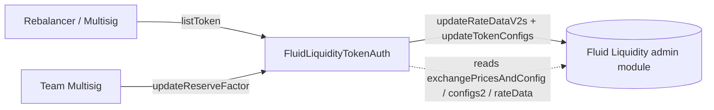

# Config / liquidityTokenAuth — SPEC

## 1. Purpose

Narrow governance entry point for **listing a new token on Fluid Liquidity** and for **updating its reserve factor (fee on interest)** afterwards. Replaces raw `updateRateDataV2s` / `updateTokenConfigs` admin access with two fixed-shape methods so operators can onboard tokens without a full governance transaction.

Single contract: [`FluidLiquidityTokenAuth`](./main.sol). Deployed as an **auth** on Fluid Liquidity. See top-level [`../SPEC.md`](../SPEC.md) for how it fits among the other auth contracts.

## 2. Architecture & Data Flow

Two paths:

- **`listToken(token)`** — one-shot token onboarding. Reads Liquidity storage to confirm the token is not already initialised, then pushes a **hard-coded default** rate-data curve and a **hard-coded default** token config.
- **`updateReserveFactor(token, newReserveFactor)`** — updates only the `fee` field of an existing token's config, preserving the current `threshold` and `maxUtilization` (both read from Liquidity storage).

Both paths call Liquidity admin methods synchronously in the same transaction.

## 3. External Interactions

- Deployed as an **auth** on Fluid Liquidity. Without that registration, `updateRateDataV2s` / `updateTokenConfigs` revert at the Liquidity admin module.
- Reads from Liquidity via `readFromStorage`:
  - `LIQUIDITY_RATE_DATA_MAPPING_SLOT[token]` — to detect already-initialised rate data.
  - `LIQUIDITY_EXCHANGE_PRICES_MAPPING_SLOT[token]` — bit layout gives current `fee` (bits 16–29), `updateThreshold` (bits 44–57), and the `usesConfigs2` flag (bit 249).
  - `LIQUIDITY_CONFIGS2_MAPPING_SLOT[token]` — bits 0–13 carry `maxUtilization` when `usesConfigs2 == 1`; otherwise `updateReserveFactor` defaults `maxUtilization = 10_000` (100%).
- Writes to Liquidity via `IFluidLiquidity`:
  - `updateRateDataV2s(RateDataV2Params[])` — one entry per call.
  - `updateTokenConfigs(TokenConfig[])` — one entry per call.
- Reads `IFluidReserveContract.isRebalancer(sender)` for auth on `listToken`.

## 4. Roles & Access Control

| Modifier | Who passes |
| --- | --- |
| `onlyRebalancerOrMultisig` | `RESERVE_CONTRACT.isRebalancer(sender)` **or** `TEAM_MULTISIG` **or** `TEAM_MULTISIG2` |
| `onlyMultisig` | `TEAM_MULTISIG` **or** `TEAM_MULTISIG2` |

Permission matrix:

| Role | `listToken` | `updateReserveFactor` |
| --- | --- | --- |
| Reserve rebalancer | ✓ | ✗ |
| `TEAM_MULTISIG` / `TEAM_MULTISIG2` | ✓ | ✓ |
| Anyone else | ✗ | ✗ |

Scoping: the auth is **global across all tokens** — there is no per-token allowlist, no per-rebalancer token scoping, and no distinction between rebalancer identities. Token-level gating is implicit: `listToken` refuses re-listing (already-initialised revert), `updateReserveFactor` refuses uninitialised tokens.

Both multisig addresses are hard-coded; rotating either requires redeploy. See [`../SPEC.md §3.3`](../SPEC.md).

## 5. Storage Layout

No contract-level mutable storage. Everything is immutable or hard-coded.

| Name | Kind | Value / source |
| --- | --- | --- |
| `LIQUIDITY` | `immutable IFluidLiquidity` | constructor arg |
| `RESERVE_CONTRACT` | `immutable IFluidReserveContract` | constructor arg |
| `TEAM_MULTISIG` | `constant address` | `0x4F6F...D49e` |
| `TEAM_MULTISIG2` | `constant address` | `0x1e2e...4219` |
| `FOUR_DECIMALS` | `constant uint256` | `10_000` |
| `X14` | `constant uint256` | `0x3fff` (14-bit mask) |

Authoritative state lives entirely on Liquidity; this contract is stateless.

## 6. Methods

### 6.1 `listToken(address token_)` — `onlyRebalancerOrMultisig`

Two internal steps, both one-shot:

1. **`_initializeRateDataV2`** — reverts `LiquidityTokenAuth_AlreadyInitialized` (100052) if `rateData[token] > 0`. Otherwise calls `LIQUIDITY.updateRateDataV2s([{token, kink1, kink2, rate0, rateKink1, rateKink2, rateMax}])` with the defaults below. Emits `LogInitiateRateDateV2Params(token)`.
2. **`_initializeTokenConfig`** — reverts `LiquidityTokenAuth_AlreadyInitialized` (100052) if `exchangePricesAndConfig[token] > 0`. Otherwise calls `LIQUIDITY.updateTokenConfigs([{token, fee, threshold, maxUtilization}])` with the defaults below. Emits `LogInitiateTokenConfig(token)`.

**Hard-coded default rate curve (`RateDataV2Params`):**

| Field | Value | Meaning (1e2 scale) |
| --- | --- | --- |
| `kink1` | 5000 | 50% utilization |
| `kink2` | 8000 | 80% utilization |
| `rateAtUtilizationZero` | 0 | 0% APR |
| `rateAtUtilizationKink1` | 2000 | 20% APR |
| `rateAtUtilizationKink2` | 4000 | 40% APR |
| `rateAtUtilizationMax` | 10000 | 100% APR |

**Hard-coded default `TokenConfig`:**

| Field | Value | Meaning |
| --- | --- | --- |
| `fee` | 1000 | 10% reserve factor on interest |
| `threshold` | 30 | 0.3% storage-update threshold |
| `maxUtilization` | 10000 | 100% (no cap) |

There is no token whitelist — any ERC-20 / native-token address an authorised caller supplies will be listed.

### 6.2 `updateReserveFactor(address token_, uint256 newReserveFactor_)` — `onlyMultisig`

Updates only the `fee` (a.k.a. reserve factor) of an existing token's config.

Flow:

1. Read `exchangePricesAndConfig[token]`. Revert `LiquidityTokenAuth__InvalidParams` (100053) if zero (token not listed).
2. Extract current `threshold` from bits 44–57 (14-bit field).
3. Extract current `oldReserveFactor` from bits 16–29 (for the event).
4. If bit 249 (`usesConfigs2`) is set, read `configs2[token]` and use bits 0–13 as `maxUtilization`; otherwise default `maxUtilization = 10_000` (100%).
5. Call `LIQUIDITY.updateTokenConfigs([{token, fee: newReserveFactor_, threshold, maxUtilization}])`.
6. Emit `LogUpdateReserveFactor(token, oldReserveFactor, newReserveFactor_)`.

**Mutable parameter scope on Liquidity:** `fee` only. `threshold` and `maxUtilization` are echoed back at their current on-chain values; `userSupply` / `userBorrow` limits and rate-curve points are untouched (this contract does not call `updateRateDataV2s` in the update path).

## 7. Rate Limits, Bounds, Cooldowns

**None.** This contract imposes no bounded-percentage-change guard, no cooldown, and no maximum `newReserveFactor_` on `updateReserveFactor`. The Liquidity admin module's own `updateTokenConfigs` validation is the only upper bound (which caps `fee` at its 14-bit max of 16_383 / 163.83%; 10_000 == 100%).

Contrast with peer auths in `../SPEC.md` (`limitsAuth`, `ratesAuth`, `withdrawLimitAuth`, `rangeAuthDex`) which **do** implement delta caps + cooldowns. `liquidityTokenAuth` is deliberately the loose end: listing is idempotent (one-shot per token) and reserve-factor updates are behind the multisig — so no operator-tier rate limit is needed.

## 8. Events

| Event | Emitted by | Fields |
| --- | --- | --- |
| `LogInitiateRateDateV2Params(address token)` | `listToken` | token address |
| `LogInitiateTokenConfig(address token)` | `listToken` | token address |
| `LogUpdateReserveFactor(address token, uint256 oldReserveFactor, uint256 newReserveFactor)` | `updateReserveFactor` | both values in 1e2 scale |

No events are emitted for reverts or for admin actions beyond the two methods above (the contract has no setters of its own).

## 9. Errors

All raised as `FluidConfigError(errorId_)` from [`../error.sol`](../error.sol). IDs from [`../errorTypes.sol`](../errorTypes.sol):

| Code | Constant | When |
| --- | --- | --- |
| 100051 | `LiquidityTokenAuth__Unauthorized` | Caller is not rebalancer / multisig (both modifiers). |
| 100052 | `LiquidityTokenAuth_AlreadyInitialized` | `listToken` called on a token whose `rateData` or `exchangePricesAndConfig` is already non-zero. (Note: single underscore in the constant name — matches source.) |
| 100053 | `LiquidityTokenAuth__InvalidParams` | Constructor: zero address for `liquidity_` or `reserveContract_`. `updateReserveFactor`: `exchangePricesAndConfig[token] == 0`. |

## 10. Deployment Checklist

1. Deploy `FluidLiquidityTokenAuth(liquidity, reserveContract)` with both non-zero.
2. Governance registers the contract as an **auth** on Fluid Liquidity (otherwise `updateRateDataV2s` / `updateTokenConfigs` revert).
3. Configure rebalancers on the target `FluidReserveContract` so non-multisig operators can call `listToken`.
4. Verify `LIQUIDITY` and `RESERVE_CONTRACT` point to the intended addresses — both are immutable and cannot be changed post-deploy.

## 11. Invariants & Safety Notes

- **Stateless.** No mutable contract storage; no `rescueTokens` path (none needed).
- **Idempotent listing.** `listToken` reverts on any re-entry for an already-initialised token, so it cannot clobber existing rate data or token config. A token already listed by any other auth (e.g. historical direct governance tx) is likewise protected — the check is against Liquidity's own storage, not a local flag.
- **Default listing values are fixed at source level.** Changing the default curve or the default fee / threshold / maxUtilization requires a redeploy. This is intentional: operators cannot pick a curve for a new token.
- **`updateReserveFactor` only moves `fee`.** `threshold`, `maxUtilization`, and all rate-curve parameters are preserved at their current stored values. This limits blast radius of a compromised multisig to the reserve-factor field only.
- **No bounds / cooldown** (see §7). The reserve factor is multisig-only, which is the safety boundary; unlike per-token operator auths in this folder, there is no rebalancer tier on this method.
- **No native / token balance** ever held. All value flow is inside Liquidity's own accounting.

## 12. Trust Model & Audit Notes

- **Root of trust for listing**: `TEAM_MULTISIG`, `TEAM_MULTISIG2`, and any `RESERVE_CONTRACT.isRebalancer()` → all can introduce new tokens with the fixed default curve. Risk surface is the default curve itself (kink points + max APR hard-coded); if that curve is unsuitable for a token, governance must follow up with a proper rate-data update through a higher-privileged path.
- **Root of trust for reserve factor**: the two team multisigs only. Rebalancers cannot change fees.
- **`listToken` cannot grief an already-initialised token** — the `AlreadyInitialized` guard ensures no silent overwrite. The single-underscore `LiquidityTokenAuth_AlreadyInitialized` constant name is preserved verbatim from source; this is a cosmetic inconsistency, not a correctness issue.
- **Replacement is the upgrade path** (see [`../SPEC.md §8`](../SPEC.md)). To change default listing params or add bounded operator access to `updateReserveFactor`, deploy a new version and re-register it as an auth on Liquidity.
- **Interactions with other auths:**
  - [`ratesAuth`](../ratesAuth/SPEC.md) is the rate-curve mutator once a token is listed.
  - [`limitsAuth`](../limitsAuth/SPEC.md) governs supply / borrow limit changes (user-class-level, not token-level).
  - [`collectRevenueAuth`](../SPEC.md#5-collectrevenueauth) harvests the reserve factor this contract sets.
