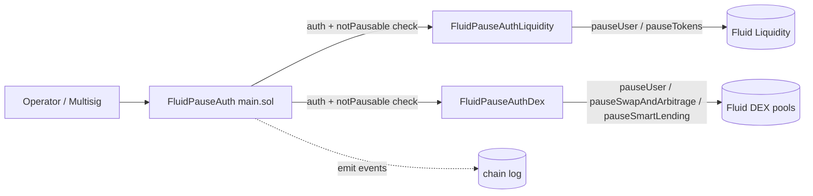

# Config / pauseAuth — SPEC

## 1. Purpose

Emergency pause system for the Fluid protocol. Provides a single, unified operator entry point to pause / unpause **vaults, DEXes, tokens, users, swap & arbitrage, and smart lending** across both the Liquidity and DEX layers, with pre-read filtering so batch calls never revert on already-in-desired-state items.

Implemented as three contracts:

| Contract | File | Role |
| --- | --- | --- |
| `FluidPauseAuth` | `main.sol` | Entry point. Auth, routing, event emission. |
| `FluidPauseAuthLiquidity` | `pauseAuthLiquidity.sol` | Liquidity-layer executor. Returns data, emits no operational events. |
| `FluidPauseAuthDex` | `pauseAuthDex.sol` | DEX-layer executor. Returns data, emits no operational events. |

`FluidPauseAuth` is the only contract operators interact with. The executors are narrow helpers that perform the actual Liquidity / DEX calls and return structured bools; `FluidPauseAuth` consumes those bools and emits the user-facing events from a single place.

## 2. Architecture & Data Flow

Each operational call: `caller → FluidPauseAuth` (auth + `notPausable*` checks) → executor (execute + return structured bools) → `FluidPauseAuth` (emit events).

## 3. External Interactions

- `FluidPauseAuthLiquidity` is registered as a **guardian** on Fluid Liquidity (so it can call `pauseUser` / `unpauseUser` / `pauseTokens` / `unpauseTokens`).
- `FluidPauseAuthDex` is registered as a **global auth** on the Fluid DEX Factory (so it can call the DEX admin module's `pauseUser` / `pauseSwapAndArbitrage` / `pauseSmartLending` paths).
- `FluidPauseAuth` itself needs no on-chain privilege — all privileged calls go through the two executors.
- Reads `exchangePricesAndConfig` (bit 255) per token and `dexVariables2` (bit 255) per DEX for the pre-filter logic.
- Reads vault / DEX constants to determine which side goes through Liquidity vs DEX (T1 vault shape vs newer shapes).

## 4. Roles & Access Control

### On `FluidPauseAuth`

| Modifier | Who passes |
| --- | --- |
| `onlyMultisig` | `TEAM_MULTISIG` only |
| `onlyPauseAuth` | `TEAM_MULTISIG` or `pauseAuths[sender] >= 1` |
| `onlyUnpauseAuth` | `TEAM_MULTISIG` or `pauseAuths[sender] == 2` |

`pauseAuths[addr]` classes:

- `0` — not an auth (default).
- `1` — **pause-only**: can call any pause-side method, cannot unpause.
- `2` — **pause + unpause + remove-class1**: full pause/unpause, plus can demote class 1 auths.

The multisig **always bypasses** the `notPausable*` allow-lists; class 1/2 auths respect them.

### Permission matrix

| Role | Can Pause | Can Unpause | Can Admin |
| --- | --- | --- | --- |
| Team multisig | Everything (bypasses notPausable) | Everything | `setPauseAuth`, `setNotPausable*`, `removeClass1`, user-pause |
| Class 1 auth | Vaults, DEXes, tokens, smart lending, swap | — | — |
| Class 2 auth | Same as class 1 | Same | `removeClass1PauseAuth` |

User-level pause (`pauseUserLiquidity`, `pauseUserDex`) is **multisig-only**.

### On executors

Each executor accepts operational calls only from `pauseAuthContract`, a single-immutable-after-set pointer:

- `setPauseAuthContract(addr)` — `TEAM_MULTISIG` only, **set-once, permanently locked**. Reverts if already set (non-zero) or `addr == 0` (`PauseAuth/Dex__InvalidParams`).

## 5. Storage Layout

### `FluidPauseAuth`

| Mapping | Type | Meaning |
| --- | --- | --- |
| `pauseAuths` | `address => uint256` | 0 = none, 1 = pause, 2 = pause + unpause + remove-class1 |
| `notPausableVaultIds` | `uint256 => bool` | true ⇒ vault exempt from pause auth pausing |
| `notPausableDexIds` | `uint256 => bool` | true ⇒ DEX exempt |
| `notPausableTokens` | `address => bool` | true ⇒ token exempt |

Immutables: `LIQUIDITY`, `VAULT_FACTORY`, `DEX_FACTORY`, `PAUSE_AUTH_LIQUIDITY`, `PAUSE_AUTH_DEX`; hardcoded `TEAM_MULTISIG = 0x4F6F977aCDD1177DCD81aB83074855EcB9C2D49e`.

### Executors

Single storage slot each: `pauseAuthContract` (address, set-once).

## 6. Admin / Routing Methods (`FluidPauseAuth`)

### Multisig-only admin

| Method | Behaviour |
| --- | --- |
| `setPauseAuth(addr, class)` | Set auth class (0/1/2). Reverts on `class > 2` or `addr == 0` with `PauseAuth__InvalidParams`. |
| `setNotPausableVaultId(id, bool)` | Toggle vault pausability. Reverts if vault not deployed. |
| `setNotPausableDexId(id, bool)` | Toggle DEX pausability. Reverts if DEX not deployed. |
| `setNotPausableToken(addr, bool)` | Toggle token pausability. Reverts on `addr == 0`. |

### Class-2 only

| Method | Behaviour |
| --- | --- |
| `removeClass1PauseAuth(addr)` | Demote a class 1 auth to 0. Reverts if target is not class 1. |

### Vault pause / unpause

| Method | Auth | Routes to |
| --- | --- | --- |
| `pauseVault(id, supply, borrow)` | `onlyPauseAuth` | Liquidity side + DEX side |
| `unpauseVault(id, supply, borrow)` | `onlyUnpauseAuth` | Both |
| `pauseVaults(ids[], supply[], borrow[])` | `onlyPauseAuth` | Batch; arrays same length |
| `unpauseVaults(ids[], supply[], borrow[])` | `onlyUnpauseAuth` | Batch |

Internal flow per id:

1. Revert if neither `supply` nor `borrow` requested (`InvalidParams`).
2. Revert if `notPausableVaultIds[id]` and caller is not multisig.
3. Call `PAUSE_AUTH_LIQUIDITY.pauseVault / unpauseVault` → emit `LogPauseVault` / `LogUnpauseVault` / `LogSkipVaultAlreadySet` / `LogSkipVaultUserClass1` based on returned bools.
4. Call `PAUSE_AUTH_DEX.pauseVault / unpauseVault` → emit same family of events.

### DEX pause / unpause

| Method | Auth | Behaviour |
| --- | --- | --- |
| `pauseDex(id, supply, borrow, swapArb)` | `onlyPauseAuth` | Combines Liquidity supply/borrow pause + DEX `swapAndArbitrage` toggle. |
| `unpauseDex(...)` | `onlyUnpauseAuth` | As above. |
| `pauseDexes(ids[], ...)` / `unpauseDexes(...)` | as above | Batch forms. |

Internal flow: revert if no flag set; respect `notPausableDexIds` (multisig bypass); dispatch supply/borrow to `PAUSE_AUTH_LIQUIDITY.pauseDex`, and `swapAndArbitrage` flag to `PAUSE_AUTH_DEX.pauseSwapAndArbitrage`.

### Smart lending

| Method | Auth | Behaviour |
| --- | --- | --- |
| `pauseSmartLending(dexId)` | `onlyPauseAuth` | Respects `notPausableDexIds`. |
| `unpauseSmartLending(dexId)` | `onlyUnpauseAuth` | Same. |

### Tokens

| Method | Auth | Behaviour |
| --- | --- | --- |
| `pauseTokens(tokens[])` | `onlyPauseAuth` | Multisig bypasses notPausable. Others filter first, emit `LogSkipTokenNotPausable` per skip. |
| `unpauseTokens(tokens[])` | `onlyUnpauseAuth` | Same filtering logic. |

Flow: filter non-multisig callers via `notPausableTokens`; call `PAUSE_AUTH_LIQUIDITY.pauseTokens` / `unpauseTokens` on the remainder, which itself pre-filters tokens already in the desired pause bit state (emits `LogPauseToken` / `LogUnpauseToken` for actioned, `LogSkipTokenAlreadySet` for already-set).

### User pause / unpause (multisig-only)

| Method | Layer |
| --- | --- |
| `pauseUserLiquidity(user, supply[], borrow[])` | Liquidity pass-through |
| `unpauseUserLiquidity(user, supply[], borrow[])` | Liquidity |
| `pauseUserDex(dexId, user, supply, borrow)` | DEX pass-through |
| `unpauseUserDex(dexId, user, supply, borrow)` | DEX |

## 7. Executor Method Summary

### `FluidPauseAuthLiquidity`

All methods `onlyPauseAuthContract`. No operational events.

- `pauseVault / unpauseVault(vaultId, supply, borrow)` → returns `(vault, actedSupply, actedBorrow, skippedUserClass1, supplyAlreadySet, borrowAlreadySet)`. Resolves vault via factory. Uses `_getVaultTokens` to distinguish Liquidity-backed vs DEX-backed sides (T1 has single supply + single borrow token; newer vaults consult `constantsView()` and exclude DEX sides, which `FluidPauseAuthDex` handles). Pre-filters tokens by current Liquidity pause state.
- `pauseDex / unpauseDex(dexId, supply, borrow)` → same return shape, using `_getDexTokens` (reads `dexVariables2` for enable bits).
- `pauseTokens / unpauseTokens(tokens[])` → returns `(filteredTokens[], skippedTokens[])`. Reads `exchangePricesAndConfig` bit 255 per token.
- `pauseUser / unpauseUser(user, supply[], borrow[])` → pass-through to Liquidity.

### `FluidPauseAuthDex`

All methods `onlyPauseAuthContract`. No operational events.

- `pauseVault / unpauseVault(vaultId, supply, borrow)` → returns `(vault, actedSupply, actedBorrow, supplySkipped, borrowSkipped)`. Looks up supply/borrow DEX per side via `_getVaultDexes`. T1 vaults have no DEX side. Same-DEX optimisation: if both sides resolve to the same DEX, a single `pauseUser(vault, true, true)` call is made. Per-side pre-filter via `_dexUserNeedsToggle` (user defined and not already in desired state).
- `pauseSwapAndArbitrage / unpauseSwapAndArbitrage(dexId)` → returns `(dex, alreadySet)`. Reads bit 255 of `dexVariables2`.
- `pauseSmartLending / unpauseSmartLending(dexId)` → returns `(dex, smartLending, alreadySet)`. Resolves via `SMART_LENDING_FACTORY`; reverts if zero. Uses `_dexUserNeedsToggle` on supply side.
- `pauseUser / unpauseUser(dexId, user, supply, borrow)` → pass-through to DEX admin module.

## 8. Events (emitted on `FluidPauseAuth` only)

- **Vault**: `LogPauseVault`, `LogUnpauseVault`, `LogSkipVaultAlreadySet`, `LogSkipVaultUserClass1`.
- **DEX Liquidity-side**: `LogPauseDex`, `LogUnpauseDex`, `LogSkipDexAlreadySet`, `LogSkipDexUserClass1`.
- **DEX swap & arbitrage**: `LogPauseSwapAndArbitrage`, `LogUnpauseSwapAndArbitrage`, `LogSkipSwapAndArbitrageAlreadySet`.
- **Smart lending**: `LogPauseSmartLending`, `LogUnpauseSmartLending`, `LogSkipSmartLendingAlreadySet`.
- **User**: `LogPauseUser`, `LogUnpauseUser`, `LogPauseDexUser`, `LogUnpauseDexUser`.
- **Token**: `LogPauseToken`, `LogUnpauseToken`, `LogSkipTokenAlreadySet`, `LogSkipTokenNotPausable`.
- **Config**: `LogSetPauseAuth`, `LogSetNotPausableVaultId`, `LogSetNotPausableDexId`, `LogSetNotPausableToken`.

Executors only emit `LogSetPauseAuthContract` (their own one-time admin event).

Vault / DEX events use **boolean** parameters (`pausedSupply`, `pausedBorrow`), not token arrays — consistent format regardless of which layer actioned.

## 9. Errors

| Code | Name | When |
| --- | --- | --- |
| 100131 | `PauseAuth__Unauthorized` | Caller lacks required auth class. |
| 100132 | `PauseAuth__InvalidParams` | Zero address, `class > 2`, no sides selected, vault/DEX not deployed, or `setPauseAuthContract` already set. |
| 100141 | `PauseAuthDex__Unauthorized` | Caller is not pause-auth-contract (or not multisig for admin). |
| 100142 | `PauseAuthDex__InvalidParams` | DEX-side variants of above. |

All raised as `FluidConfigError(errorId)` from the shared `contracts/config/error.sol`.

## 10. Deployment Checklist

1. Deploy `FluidPauseAuthLiquidity(liquidity, vaultFactory, dexFactory)`.
2. Deploy `FluidPauseAuthDex(liquidity, vaultFactory, dexFactory, smartLendingFactory)`.
3. Deploy `FluidPauseAuth(liquidity, vaultFactory, dexFactory, pauseAuthLiquidity, pauseAuthDex)`.
4. Set `FluidPauseAuthLiquidity` as **guardian** on Fluid Liquidity.
5. Set `FluidPauseAuthDex` as **global auth** on Fluid DEX Factory.
6. From multisig: `pauseAuthLiquidity.setPauseAuthContract(pauseAuth)` — locks forever.
7. From multisig: `pauseAuthDex.setPauseAuthContract(pauseAuth)` — locks forever.
8. Configure pause auths with `pauseAuth.setPauseAuth(addr, class)`.

## 11. Invariants & Safety Notes

- **Single entry point.** Operators only ever call `FluidPauseAuth`. The executors refuse all other callers once their `pauseAuthContract` is set.
- **Multisig bypass** of `notPausable*` is intentional — enables emergency pause even of otherwise-protected items.
- **Class-1 vaults / users are not pause-able by non-multisig auths**: the executors emit `LogSkipVaultUserClass1` / `LogSkipDexUserClass1` when skipping. Unpause is always permitted (class 2 auths + multisig).
- **Pre-read filtering means batch calls never revert** on already-in-desired-state items; they emit the appropriate `LogSkip*AlreadySet` events instead.
- **Same-DEX optimisation** in `FluidPauseAuthDex.pauseVault` collapses two `pauseUser` calls into one when both sides of a vault share a DEX.
- **Executors emit no operational events**; all observability flows through `FluidPauseAuth`.
- **`setPauseAuthContract` is one-shot.** Once set the executors cannot be re-pointed. To replace the system, redeploy all three and re-register as guardian / global-auth.
- **No native ETH / token balances** are ever held by these contracts; they are pure permissioning routers. There is no `rescueTokens` path and none is needed.

## 12. Trust Model & Audit Notes

- **Root of trust**: `TEAM_MULTISIG` (hard-coded). Compromise implies full emergency-pause power (which is, by design, the point of the system).
- **Class 1** is the day-to-day operator tier: low friction, pause-only. Class 2 is recovery-grade (can unpause and demote class 1). Multisig owns both class setters.
- **Liquidity class 1 users** (established protocols) are intentionally shielded from guardian pauses — this matches the Liquidity-layer invariant that class 1 users may only be unpaused by governance. Audit dispositions confirm this is the desired trust boundary.
- **`notPausable*` lists** exist specifically so governance can pin markets / vaults / tokens as "must not be paused by operators" even while leaving class 1 / 2 auths in place.
- **Replacing a compromised executor** requires a new deploy + re-registration with Liquidity as guardian and DEX factory as global auth; the set-once `pauseAuthContract` prevents silent pivoting of an existing executor to a malicious `FluidPauseAuth`.
