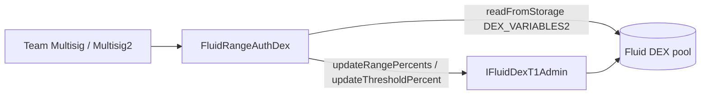

# Config / rangeAuthDex — SPEC

## 1. Purpose

Narrow, rate-limited multisig path for adjusting a Fluid DEX pool's **center-price range** (the upper / lower percentage boundaries of the concentrated-liquidity curve) and its **threshold config** (the inner percentage boundaries that trigger range rebalancing, plus the threshold shift time).

Exposes three setters that forward to the DEX admin module (`IFluidDexT1Admin.updateRangePercents` / `updateThresholdPercent`). Every call is:

- Gated to **team multisig only** (two hardcoded signers),
- Capped at **±20% change per call** vs. the current stored value,
- Subject to a **4-day cooldown per (dex, update-type)** pair,
- Subject to a **shift-time sanity window** (2–12 days, with a mainnet carve-out for the wstETH/ETH and weETH/ETH DEXes which must use instant shift).

Single contract: `FluidRangeAuthDex` in `main.sol`. See also [`../SPEC.md`](../SPEC.md).

## 2. Architecture & Data Flow

Per call: `multisig → FluidRangeAuthDex` (auth + cooldown + shift-time + per-change cap checks, reading `dexVariables2` for the current config) → `IFluidDexT1Admin` on the target DEX → event emission.

## 3. External Interactions

- Must be registered as an **auth on each target DEX** (`IFluidDexT1Admin` calls revert otherwise).
- Reads a single slot per call: `DexSlotsLink.DEX_VARIABLES2_SLOT` via `IFluidDexT1.readFromStorage`, for the current range / threshold bits.
- Forwards to two DEX admin methods:
  - `updateRangePercents(upperPercent, lowerPercent, shiftTime)`
  - `updateThresholdPercent(upperThresholdPercent, lowerThresholdPercent, thresholdShiftTime, shiftTime)`
- Does not touch Liquidity, Vault factory, Smart lending, or Reserve.
- Holds no tokens, no native ETH, no callback surface.

## 4. Roles & Access Control

Single role: **multisig**. Operator / rebalancer tiers are **not** used by this contract.

| Modifier | Who passes | Errors |
| --- | --- | --- |
| `onlyMultisig` | `TEAM_MULTISIG` or `TEAM_MULTISIG2` | `100093 RangeAuthDex__Unauthorized` |
| `validAddress(value_)` | `value_ != 0` | `100091 RangeAuthDex__InvalidParams` |

Constants:

| Name | Value |
| --- | --- |
| `TEAM_MULTISIG` | `0x4F6F977aCDD1177DCD81aB83074855EcB9C2D49e` |
| `TEAM_MULTISIG2` | `0x1e2e1aeD876f67Fe4Fd54090FD7B8F57Ce234219` |

Both multisigs have identical power; there is no second-tier "unpause only" distinction.

## 5. Storage Layout

### Immutables (per-deploy)

| Name | Meaning |
| --- | --- |
| `WSTETH_ETH_DEX` | wstETH/ETH DEX on mainnet, forced to `shiftTime_ == 0`. |
| `WEETH_ETH_DEX` | weETH/ETH DEX on mainnet, forced to `shiftTime_ == 0`. |

Constructor reverts `100091` if `block.chainid == 1` and either address is zero; on non-mainnet deploys zero is permitted.

### Constants

| Name | Value | Purpose |
| --- | --- | --- |
| `COOLDOWN` | `4 days` | Minimum wait between updates of the same type on the same DEX. |
| `MAX_PERCENT_RANGE_CHANGE_ALLOWED` | `20 * 1e4` (= `200_000`) | Maximum per-call percent delta in the internal 1e6-scaled space (≈ 20%). |
| `MIN_SHIFT_TIME` / `MAX_SHIFT_TIME` | `2 days` / `12 days` | Bounds for `shiftTime_` outside the wstETH/weETH carve-out. |
| `THREE_DECIMALS` | `1e3` | Threshold-percent scale multiplier (see §6.3). |
| `X10` / `X20` / `X24` | `0x3ff` / `0xfffff` / `0xffffff` | Bit masks for threshold / range / shift-time fields in `dexVariables2`. |

### Mappings

| Mapping | Type | Meaning |
| --- | --- | --- |
| `dexLastUpdateTimestamp` | `mapping(address => mapping(UpdateType => uint256))` | Last successful update timestamp per `(dex, RANGES \| THRESHOLD)`. Written before the external DEX call. |

`UpdateType` is an `enum { RANGES, THRESHOLD }`. The two types have **independent cooldown clocks** — a ranges update does not block a threshold update on the same DEX and vice versa.

## 6. Method Summary

### 6.1 Views

| Method | Returns | Source |
| --- | --- | --- |
| `getRanges(dex)` | `(upperRangePercent, lowerRangePercent)` in 4-decimal scale (`10_000 == 1%`) | `dexVariables2` bits `27..46` (upper) and `47..66` (lower), 20 bits each. |
| `getThresholdConfig(dex)` | `(upperThresholdPercent, lowerThresholdPercent, thresholdShiftTime)` | `dexVariables2` bits `68..77` (upper) and `78..87` (lower), 10 bits each, multiplied by `1e3` to restore 4-decimal scale; `thresholdShiftTime` from bits `88..111` (24 bits, seconds). |
| `dexLastUpdateTimestamp(dex, UpdateType)` | `uint256` | Cooldown bookkeeping. |

### 6.2 `setRanges(dex_, upperRangePercent_, lowerRangePercent_, shiftTime_)`

Multisig-only. Forwards to `IFluidDexT1Admin.updateRangePercents(upper, lower, shiftTime)` after:

1. `_validateLastUpdateTime(dex_, RANGES)` — revert `100092` if < 4 days since last ranges update.
2. `_validateShiftTime(dex_, shiftTime_)` — revert `100095` if out of bounds (see §6.5).
3. Read `(currentUpper, currentLower)` via `getRanges`.
4. `_validateChange(currentUpper, upperRangePercent_)` — revert `100094` if percent diff > 20% (see §6.4).
5. `_validateChange(currentLower, lowerRangePercent_)` — same.
6. Write `dexLastUpdateTimestamp[dex_][RANGES] = block.timestamp`.
7. Emit `LogSetRanges(dex, upperRangePercent, lowerRangePercent, shiftTime)`.

Values are passed straight through in 4-decimal scale.

### 6.3 `setRangesByPercentage(dex_, newUpperRangePercentage_, newLowerRangePercentage_, shiftTime_)`

Multisig-only, relative form. Accepts **signed** deltas (`10_000 == 1%`, positive = increase, negative = decrease) and computes the absolute targets from the current on-chain values.

1. Cooldown + shift-time checks (as §6.2).
2. `_validatePercentChange(|newUpperRangePercentage_|)` — revert `100094` if `|Δ|` > `20 * 1e4` in the 1e6-scaled space (i.e. > 20%).
3. Same for the lower delta.
4. `newUpper = _getNewRange(currentUpper, newUpperRangePercentage_)` → `current ± current * |Δ| / 1e6`.
5. Same for lower.
6. Persist cooldown, call `updateRangePercents(newUpper, newLower, shiftTime_)`, emit `LogSetRanges` with the computed absolute values.

Note: this path caps the **relative** change directly and skips `_validateChange` on the absolute values (redundant, since the relative cap subsumes it).

### 6.4 `setThresholdConfig(dex_, upperThresholdPercent_, lowerThresholdPercent_, thresholdShiftTime_, shiftTime_)`

Multisig-only. Forwards to `IFluidDexT1Admin.updateThresholdPercent(upper, lower, thresholdShift, shiftTime)` after:

1. `_validateLastUpdateTime(dex_, THRESHOLD)` — 4-day cooldown on the THRESHOLD track.
2. `_validateShiftTime(dex_, shiftTime_)`.
3. Read `(currentUpperT, currentLowerT, currentThresholdShiftTime)` via `getThresholdConfig`.
4. `_validateChange` against **each of the three** (upper threshold, lower threshold, threshold shift time) — any >20% move reverts `100094`.
5. Persist cooldown, call the admin method, emit `LogSetThresholdConfig(dex, upper, lower, thresholdShift, shiftTime)`.

Threshold percents are stored on the DEX in a reduced 10-bit / 3-decimal form; this contract exposes and accepts them in the full 4-decimal scale (`10_000 == 1%`) and relies on the DEX admin module for the downcast.

### 6.5 `_validateShiftTime`

| Chain & DEX | Allowed `shiftTime_` | Error |
| --- | --- | --- |
| `chainid == 1` and `dex_ ∈ {WSTETH_ETH_DEX, WEETH_ETH_DEX}` | `0` only (instant shift) | `100095 RangeAuthDex__InvalidShiftTime` |
| Otherwise | `MIN_SHIFT_TIME ≤ shiftTime_ ≤ MAX_SHIFT_TIME` (2–12 days) | `100095` |

## 7. Caps, Cooldowns & Math

### Per-call cap

`_percentDiffForValue(oldValue, newValue)` computes the *symmetric* magnitude:

- Decrease: `(old - new) * 1e6 / old` (% by which `new` is smaller than `old`).
- Increase: `(new - old) * 1e6 / old` (% by which `new` is bigger than `old`, using the **old** value as the denominator — so a 10→8 move is 20% while an 8→10 move is 25%).
- `old == 0 || old == new` → returns `0` (skips the cap entirely when the current stored value is zero; see §8).

`_validatePercentChange` then rejects anything `> MAX_PERCENT_RANGE_CHANGE_ALLOWED` (`200_000` in the 1e6 space, i.e. 20%).

`setRangesByPercentage` uses the same threshold but on the caller-supplied relative delta directly (`_validatePercentChange(|delta|)` pre-apply), and computes the absolute target with the same 1e6 denominator (`_getNewRange`).

### Cooldown

| Update type | Tracked in | Duration |
| --- | --- | --- |
| `RANGES` (setRanges / setRangesByPercentage) | `dexLastUpdateTimestamp[dex][RANGES]` | `4 days` |
| `THRESHOLD` (setThresholdConfig) | `dexLastUpdateTimestamp[dex][THRESHOLD]` | `4 days` |

Cooldown is enforced via `block.timestamp - last < COOLDOWN` → revert `100092`. First-ever update on a given DEX/type has `last == 0`, so it passes immediately.

The cooldown timestamp is written **before** the DEX admin call. If the admin call reverts, the cooldown write is rolled back with it (tx revert).

## 8. Events & Errors

### Events

| Event | Emitted by | Params |
| --- | --- | --- |
| `LogSetRanges` | `setRanges`, `setRangesByPercentage` | `(dex, upperPercent, lowerPercent, shiftTime)` — absolute target values. |
| `LogSetThresholdConfig` | `setThresholdConfig` | `(dex, upperPercent, lowerPercent, thresholdShiftTime, shiftTime)`. |

No skip / no-op events: every call that reaches the external admin call succeeded.

### Errors (all `FluidConfigError(errorId_)`)

| ID | Name | When |
| --- | --- | --- |
| 100091 | `RangeAuthDex__InvalidParams` | Constructor: mainnet with zero wstETH/weETH dex address. |
| 100092 | `RangeAuthDex__CooldownLeft` | < 4 days since last update of the same type on this DEX. |
| 100093 | `RangeAuthDex__Unauthorized` | Caller is neither `TEAM_MULTISIG` nor `TEAM_MULTISIG2`. |
| 100094 | `RangeAuthDex__ExceedAllowedPercentageChange` | Any single field moves by > 20% vs. current (or the caller-supplied relative delta exceeds 20%). |
| 100095 | `RangeAuthDex__InvalidShiftTime` | `shiftTime_` outside 2–12 days, or non-zero on the mainnet wstETH/weETH dexes. |

## 9. DEX Admin Forwarding (cheatsheet)

| This contract | Forwards to | Signature |
| --- | --- | --- |
| `setRanges` / `setRangesByPercentage` | `IFluidDexT1Admin.updateRangePercents` | `(uint upperPercent, uint lowerPercent, uint shiftTime)` — all in 4-decimal scale except `shiftTime` (seconds). |
| `setThresholdConfig` | `IFluidDexT1Admin.updateThresholdPercent` | `(uint upperThresholdPercent, uint lowerThresholdPercent, uint thresholdShiftTime, uint shiftTime)` — first two in 4-decimal scale; both times in seconds. |

`upperPercent` / `lowerPercent` are the outer range of the concentrated-liquidity curve; the threshold percents are the inner margin inside which the pool does not re-centre. `thresholdShiftTime` controls how quickly the pool walks its ranges toward the new threshold when triggered; the `shiftTime` argument on `updateThresholdPercent` governs how quickly the *threshold percent change itself* phases in.

## 10. Deployment Checklist

1. Deploy `FluidRangeAuthDex(wstethEthDex_, weethEthDex_)`.
   - On mainnet: both addresses must be non-zero (must point to the real wstETH/ETH and weETH/ETH DEXes).
   - On other chains: pass `address(0), address(0)` (permitted).
2. Register the deployed contract as an **auth** on each target DEX's admin module. Without this, every `updateRangePercents` / `updateThresholdPercent` call reverts at the DEX.
3. No further configuration is required; there is no allowlist mapping, no rebalancer list, no ownership transfer.

## 11. Invariants & Safety Notes

- **Multisig-only.** There is no operator / rebalancer tier — ranges and thresholds are considered high-impact and go exclusively through `TEAM_MULTISIG` / `TEAM_MULTISIG2`.
- **Per-call 20% cap + 4-day cooldown** together bound the parameter drift reachable without governance intervention.
- **Cooldown is per (dex, type).** A compromised multisig cannot, within one tx, both move ranges 20% and thresholds 20% on the same DEX more than once per 4 days, but the two tracks are independent and can both be touched in the same 4-day window.
- **Zero-value edge case.** `_percentDiffForValue` returns `0` when `oldValue_ == 0`, which bypasses the per-call cap. This is intentional for bootstrapping a field that has never been set (e.g. first-ever threshold config where the stored value is zero), but it means the very first write on such a field is uncapped in magnitude. Subsequent writes re-engage the cap. Audit note: fields that are guaranteed non-zero by DEX initialisation (ranges) are not affected in practice.
- **Signed-delta safety.** `setRangesByPercentage` takes `int256` and calls `_abs` before capping. `int256.min` would overflow `-value_` in Solidity 0.8, reverting; any value that passes `_abs` and the 20%-cap check is safe for the subsequent `_getNewRange` arithmetic, which uses `uint256(newRangePercentage_)` / `uint256(-newRangePercentage_)` explicitly. Negative deltas of magnitude ≥ 100% are implicitly rejected by the 20% cap.
- **No inversion check.** The contract does not enforce `upper > lower` or `upperThreshold < upperRange` etc. — those structural invariants are the DEX admin module's responsibility. This contract only checks *magnitude-of-change* vs. current.
- **Shift-time carve-out is mainnet-only.** The `block.chainid == 1 && dex ∈ {wstETH/ETH, weETH/ETH}` branch forces instant shifts for those two correlated-asset pairs; on testnets or other L2 deployments of the same DEXes the 2–12 day window applies.
- **Cooldown write precedes the admin call.** If the DEX admin call reverts, the whole tx reverts and the cooldown is rolled back; the multisig can retry in the same block after fixing params.
- **No funds / no reentrancy surface.** No token balances, no callbacks, no `rescueTokens` needed.

## 12. Trust Model & Audit Notes

- **Root of trust**: `TEAM_MULTISIG` and `TEAM_MULTISIG2` (both hard-coded, either can act unilaterally). A compromise of *either* multisig allows full use of every method on this contract, bounded by the 20%-per-call cap and 4-day cooldown.
- **Intentional bounds.** The 20% cap and 4-day cooldown are explicitly calibrated so that, even in the worst case of a compromised multisig, ranges and thresholds cannot drift faster than governance can react. Removing or weakening these constants would require a redeploy; there is no setter.
- **`setRangesByPercentage` vs. `setRanges`.** Relative-form is a convenience and uses the **same** 20% cap (just applied pre-apply rather than on the absolute target), so neither path is more permissive than the other.
- **No revert path for "already-set"** — unlike pauseAuth, this contract does not pre-filter no-op writes. Re-submitting the same config consumes a cooldown slot. Callers should read `getRanges` / `getThresholdConfig` before calling.
- **Zero-old-value audit item** (see §11) is intentionally accepted: it exists only to permit bootstrapping from an uninitialised field, and only the multisig can trigger it.
- **Replacement path.** To rotate multisigs or adjust caps / cooldowns, deploy a new `FluidRangeAuthDex`, register it as auth on each DEX, and remove the old one. There is no in-place upgrade.
- Cross-reference: see [`../SPEC.md`](../SPEC.md) §2 (index) and §3.2 (auth-contract pattern).
