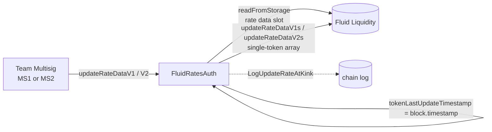

# Config / ratesAuth — SPEC

## 1. Purpose

Bounded team-multisig path to nudge the **borrow rate curve** of a token on Fluid Liquidity without opening the raw `updateRateDataV1s` / `updateRateDataV2s` admin surface. Operators can only shift the **rate-at-kink** point(s); every other curve parameter (kink utilization, rate-at-zero, rate-at-max) is read from Liquidity storage and echoed back unchanged. A single global percent cap and a per-token cooldown bound how far and how often any curve can move.

Single contract, deployed per Liquidity instance:

| Contract | File | Role |
| --- | --- | --- |
| `FluidRatesAuth` | `main.sol` | Team-multisig-gated wrapper around Liquidity `updateRateDataV{1,2}s`. Enforces per-rate percent cap + per-token cooldown. |

Cross-ref: [`../SPEC.md`](../SPEC.md) (config index, error convention, multisig constants).

## 2. Architecture & Data Flow



Per call the contract: (1) locates the token's packed rate-data slot via `LiquiditySlotsLink`, (2) decodes the stored curve, (3) verifies the stored version matches the called method, (4) checks cooldown, (5) checks each user-supplied rate-at-kink against the global percent cap relative to its stored value, (6) assembles a `RateDataV{1,2}Params` that reuses the stored kink utilization, rate-at-zero and rate-at-max, and forwards it as a 1-element array to Liquidity.

## 3. External Interactions

- Registered as an **auth on Fluid Liquidity** — required for `updateRateDataV1s` / `updateRateDataV2s` (both `onlyAuths`).
- Reads the token's rate-data slot via `LIQUIDITY.readFromStorage(keccak256(token, LIQUIDITY_RATE_DATA_MAPPING_SLOT))` to learn the current curve and version.
- Does not read oracles, does not hold any balances, has no callbacks, emits no events on Liquidity beyond what Liquidity itself emits (`LogUpdateRateDataV1s` / `LogUpdateRateDataV2s`).
- Downstream Liquidity admin validates the final packed struct (rate ≤ `2^16-1`, `kink ∈ (0, 1e4)`, `kink1 < kink2 < 1e4`, `rateAtUtilizationKink{_,2} ≤ rateAtUtilizationMax`). Those revert at the Liquidity layer with `FluidLiquidityError(AdminModule__*)` — see §9.

## 4. Roles & Access Control

| Modifier | Who passes |
| --- | --- |
| `onlyMultisig` | `TEAM_MULTISIG` **or** `TEAM_MULTISIG2` |

There are **no per-operator roles, no allowlist, no class tiers, no per-token permission map**. Both hardcoded multisigs have identical, unrestricted rights over every token's curve (subject to the cap + cooldown). All setters revert with `RatesAuth__Unauthorized` (`100042`) for any other caller.

Hardcoded constants (from `Constants`):

- `TEAM_MULTISIG  = 0x4F6F977aCDD1177DCD81aB83074855EcB9C2D49e`
- `TEAM_MULTISIG2 = 0x1e2e1aeD876f67Fe4Fd54090FD7B8F57Ce234219`

## 5. Storage Layout

| Storage | Type | Meaning |
| --- | --- | --- |
| `tokenLastUpdateTimestamp` | `mapping(address => uint256)` | `block.timestamp` of the last successful `updateRateDataV{1,2}` for that token. Used for the cooldown check. |

Immutables (constructor):

| Immutable | Type | Constraint |
| --- | --- | --- |
| `LIQUIDITY` | `IFluidLiquidity` | `!= address(0)` else `RatesAuth__InvalidParams` (`100043`). |
| `PERCENT_RATE_CHANGE_ALLOWED` | `uint256` | `> 0` and `<= 1e4` (i.e. ≤ 100%, 4-decimal scale: `100 == 1%`, `1 == 0.01%`). |
| `COOLDOWN` | `uint256` | `> 0` seconds. |

Internal constants: `X16 = 0xffff` (16-bit mask used everywhere Liquidity packs a rate point).

## 6. Input Shape

### V1 input (`RateAtKinkV1`)

```solidity
struct RateAtKinkV1 {
    address token;
    uint256 rateAtUtilizationKink; // 4-decimal scale, ≤ 1e4 (enforced by Liquidity as ≤ 2^16-1)
}
```

### V2 input (`RateAtKinkV2`)

```solidity
struct RateAtKinkV2 {
    address token;
    uint256 rateAtUtilizationKink1;
    uint256 rateAtUtilizationKink2;
}
```

Rates are in 4-decimal scale (`10_000 == 100%`, `100 == 1%`). Note: Liquidity packs each rate point into 16 bits and will revert `AdminModule__ValueOverflow__RATE_AT_UTIL_KINK*` if `> 0xffff` (~655%), but `FluidRatesAuth` itself does **not** range-check the inputs — it relies on the percent cap and downstream packing.

**What the caller does NOT pass** (and therefore cannot change via this auth):

- `kink` / `kink1` / `kink2` — utilization points.
- `rateAtUtilizationZero`.
- `rateAtUtilizationMax`.

All three are decoded from the existing Liquidity slot and re-emitted unchanged. If governance needs to change any of them, it must go through raw Liquidity admin, not this auth.

## 7. Methods

### 7.1 `updateRateDataV1(RateAtKinkV1 calldata rateStruct_) external onlyMultisig`

Forwards to `LIQUIDITY.updateRateDataV1s(_)` for the single token.

Flow:

1. Read packed rate-data slot for `rateStruct_.token`.
2. Assert `rateConfig_ & 0xF == 1` (V1 curve). Else `RatesAuth__InvalidVersion` (`100045`).
3. Assert `block.timestamp - tokenLastUpdateTimestamp[token] >= COOLDOWN`. Else `RatesAuth__CooldownLeft` (`100044`).
4. Decode `oldRateKink1_ = (rateConfig_ >> BITS_RATE_DATA_V1_RATE_AT_UTILIZATION_KINK) & X16`.
5. Compute percent diff (see §8) and assert `<= PERCENT_RATE_CHANGE_ALLOWED`. Else `RatesAuth__NoUpdate` (`100041`).
6. Build `RateDataV1Params`:
   - `token              = rateStruct_.token`
   - `kink                = (rateConfig_ >> BITS_RATE_DATA_V1_UTILIZATION_AT_KINK) & X16`
   - `rateAtUtilizationZero = (rateConfig_ >> BITS_RATE_DATA_V1_RATE_AT_UTILIZATION_ZERO) & X16`
   - `rateAtUtilizationKink = rateStruct_.rateAtUtilizationKink`  ← the only updated field
   - `rateAtUtilizationMax  = (rateConfig_ >> BITS_RATE_DATA_V1_RATE_AT_UTILIZATION_MAX) & X16`
7. `LIQUIDITY.updateRateDataV1s([rateData])`.
8. `tokenLastUpdateTimestamp[token] = block.timestamp`.
9. Emit `LogUpdateRateAtKink(token, oldRateKink1_, newKink, 0, 0)`.

### 7.2 `updateRateDataV2(RateAtKinkV2 calldata rateStruct_) external onlyMultisig`

Same flow, but two rate points. Forwards to `LIQUIDITY.updateRateDataV2s(_)`.

Differences vs V1:

- Version gate asserts `rateConfig_ & 0xF == 2`.
- Both `rateAtUtilizationKink1` and `rateAtUtilizationKink2` are checked independently against `PERCENT_RATE_CHANGE_ALLOWED` (same cap, applied per-rate). A single out-of-cap value reverts the whole call.
- Struct rebuild also carries `kink2`, `rateAtUtilizationKink2` over; `rateAtUtilizationKink{1,2}` are replaced.
- Event carries both pairs: `LogUpdateRateAtKink(token, oldK1, newK1, oldK2, newK2)`.

### 7.3 Bit layout (reference)

| Field | V1 shift | V2 shift |
| --- | --- | --- |
| version (low nibble) | `0..3` | `0..3` |
| `rateAtUtilizationZero` | `4..19` | `4..19` |
| `kink` / `kink1` | `20..35` | `20..35` |
| `rateAtUtilizationKink` / `Kink1` | `36..51` | `36..51` |
| `rateAtUtilizationMax` / `kink2` | `52..67` | `52..67` |
| `rateAtUtilizationKink2` | — | `68..83` |
| `rateAtUtilizationMax` (V2) | — | `84..99` |

(From `LiquiditySlotsLink`. The V2 `kink2` intentionally reuses the V1 `rateAtUtilizationMax` position; that is why the version gate matters.)

## 8. Change Cap — `_percentDiffForValue`

```solidity
function _percentDiffForValue(uint256 oldValue_, uint256 newValue_) internal pure returns (uint256) {
    if (oldValue_ == newValue_) return 0;
    uint256 abs = oldValue_ > newValue_ ? oldValue_ - newValue_ : newValue_ - oldValue_;
    return (abs * 1e4) / oldValue_; // asymmetric: always divides by old
}
```

Semantics:

- Percent is always computed **relative to the old value**, regardless of direction. A 10→8 move (20% down) and a 10→12.5 move (25% up) are treated with different magnitudes — increases are penalised more than decreases of the same absolute size.
- `PERCENT_RATE_CHANGE_ALLOWED` is compared strictly `>`: a diff exactly equal to the cap is allowed; one `1e-4 %` over the cap is rejected as `RatesAuth__NoUpdate` (`100041`).
- Equal values (no-op) pass the cap trivially but still: consume the cooldown, still forward to Liquidity, still emit the event.

Edge cases:

- **`oldValue_ == 0, newValue_ != 0`** — division by zero in `(abs * 1e4) / oldValue_` reverts with Solidity `Panic(0x12)`. A token whose current `rateAtUtilizationKink*` is packed as 0 therefore **cannot** be unstuck through this auth; governance must call Liquidity directly. (In practice this should not occur: Liquidity admin packs whatever is supplied, but operationally all configured tokens have non-zero rate-at-kink.)
- **`oldValue_ == 0, newValue_ == 0`** — early-returns 0, passes.
- **`newValue_ == 0`** with non-zero old — diff is `oldValue_ * 1e4 / oldValue_ = 1e4` (100%). Passes only if `PERCENT_RATE_CHANGE_ALLOWED == 1e4`.

## 9. Errors

All raised as `FluidConfigError(errorId)` from `contracts/config/error.sol`.

| Code | Name | When |
| --- | --- | --- |
| 100041 | `RatesAuth__NoUpdate` | Any requested rate-at-kink moves the stored rate by more than `PERCENT_RATE_CHANGE_ALLOWED`. |
| 100042 | `RatesAuth__Unauthorized` | Caller is neither `TEAM_MULTISIG` nor `TEAM_MULTISIG2`. |
| 100043 | `RatesAuth__InvalidParams` | Constructor only: `liquidity_ == 0`, `percentRateChangeAllowed_ == 0`, `percentRateChangeAllowed_ > 1e4`, or `cooldown_ == 0`. |
| 100044 | `RatesAuth__CooldownLeft` | `block.timestamp - tokenLastUpdateTimestamp[token] < COOLDOWN`. |
| 100045 | `RatesAuth__InvalidVersion` | V1 method called on a V2 token, or vice versa. |

Downstream (from Liquidity `AdminModule`, not rewritten by this auth):

- `AdminModule__ValueOverflow__RATE_AT_UTIL_KINK{,1,2}` — supplied rate > `0xffff`.
- `AdminModule__InvalidParams` — implied monotonicity broken: V1 `rateAtUtilizationKink > rateAtUtilizationMax`; V2 `rateAtUtilizationKink2 > rateAtUtilizationMax`. These are reachable because the stored `rateAtUtilizationMax` is not refreshed by this auth, so raising a kink rate above the stored max is caught by Liquidity.

See `../SPEC.md` §3.4 for the error ID allocation table (`ratesAuth` range is `100041–100045`).

## 10. Deployment Checklist

1. Deploy `FluidRatesAuth(liquidity, percentRateChangeAllowed, cooldown)`.
   - `percentRateChangeAllowed` in 4-decimal scale (`500 == 5%`, `1_000 == 10%`, max `10_000 == 100%`).
   - `cooldown` in seconds (e.g. `86_400` for one day).
2. Governance registers the deployed address as an **auth** on Fluid Liquidity (otherwise `updateRateDataV1s` / `updateRateDataV2s` will revert on `onlyAuths`).
3. Sanity-call `updateRateDataV1` / `updateRateDataV2` from the multisig on a known token to verify the registration.
4. There is no migration path for `tokenLastUpdateTimestamp`: a fresh deploy resets all per-token cooldowns to 0, which effectively allows an immediate first update per token.

To replace: deploy a new `FluidRatesAuth`, register as auth, deregister the old one. The old contract's `tokenLastUpdateTimestamp` is not portable.

## 11. Invariants & Safety Notes

- **Multisig-only; no permissionless path.** No rebalancer hook, no open method, no callback surface. Compromise scope is bounded to the two hardcoded multisigs.
- **Curve shape is preserved.** Kink utilization points and rate-at-zero / rate-at-max are always read-and-echoed. Operators cannot pivot a V1 curve to V2 (or reshape the x-axis) via this auth — version mismatch reverts; kink utilizations are not user-supplied.
- **Per-rate cap, not per-struct cap.** In V2, `rateAtUtilizationKink1` and `rateAtUtilizationKink2` are each independently capped at `PERCENT_RATE_CHANGE_ALLOWED`; a call that moves both by exactly the cap is allowed in a single tx (per-token cooldown then blocks the next move for `COOLDOWN` seconds). The cap is **not** applied to the combined/weighted delta.
- **Cap is asymmetric.** Increases of `X` on a base of `B` are measured as `X/B`; decreases of `X` are also `X/B`. Because the absolute numerator is split on direction but the denominator is always the old value, a 50% cap allows `10 → 15` and `10 → 5` but not `10 → 16` or `10 → 4`. Larger downward moves relative to the new value are therefore allowed than symmetric geometric moves.
- **Increasing vs decreasing curves are both supported.** Liquidity's curve math admits a flat or declining pre-kink segment; the only monotonicity Liquidity enforces is `rateAtUtilizationKink{,2} ≤ rateAtUtilizationMax`. `FluidRatesAuth` adds no further shape constraint.
- **Zero-rate trap.** A rate point of exactly `0` in storage cannot be moved to non-zero via this auth (division-by-zero in `_percentDiffForValue`). Combined with the V2 two-point check, if *either* stored kink rate is `0`, V2 updates are blocked entirely until raw Liquidity admin lifts it.
- **V1 vs V2 separation.** The version is gated on the stored slot's low nibble, not the method name — switching a token from V1 to V2 (or vice versa) requires raw Liquidity admin; after such a switch, operators must call the corresponding method here.
- **Cooldown is per-token, not per-rate-point.** A V2 call that updates only `kink1` still refreshes `tokenLastUpdateTimestamp`, blocking a subsequent `kink2`-only update for `COOLDOWN`.
- **No reentrancy surface.** State write (`tokenLastUpdateTimestamp`) happens **after** the Liquidity call; no untrusted hooks are invoked (the only external callee is Liquidity itself). If Liquidity reverts, the timestamp is not bumped — cooldown is not consumed by failed updates.
- **No token balances held.** No `rescueTokens`; none needed.

## 12. Trust Model & Audit Notes

- **Root of trust**: `TEAM_MULTISIG` ∪ `TEAM_MULTISIG2`. Equivalent to the two multisigs described in [`../SPEC.md`](../SPEC.md) §3.3. Compromise of either grants full cap-and-cooldown-bounded rate control across every token.
- **Narrowing vs raw admin.** Without `FluidRatesAuth`, the multisig would need to be registered as a raw Liquidity auth and call `updateRateDataV{1,2}s` directly — which exposes the **entire** curve (kink positions, rate-at-zero/max) to every operator call. `FluidRatesAuth` is the "day-to-day" safe-rail wrapper; raw admin remains for curve redesigns.
- **Constructor bounds the blast radius.** `PERCENT_RATE_CHANGE_ALLOWED` and `COOLDOWN` are immutable — to tighten or loosen them, governance must redeploy + re-register.
- **Asymmetric-cap consequence.** Audit: the asymmetric percent formula is consistent with other `config/*Auth` contracts (same helper shape). It is intentional that the cap measures divergence-from-current, so that successive maximum-sized moves compound multiplicatively rather than additively: e.g. with a 10% cap and `100 → 110 → 121 → …`, each step is 10% of the *previous* step, not of the initial value. Coupled with `COOLDOWN`, this bounds the achievable rate drift over any window.
- **No per-operator accountability.** Both multisigs emit the same `LogUpdateRateAtKink`; distinguishing which multisig triggered requires inspecting the tx origin / signers. If per-operator attribution is required, it must be added at a higher layer.
- **V1/V2 input-shape risk.** An operator intending a V2 update but calling `updateRateDataV1` on a V2 token is caught by `RatesAuth__InvalidVersion`; the reverse is also caught. There is no silent path where the wrong fields get written. Audit-confirmed.
- **Zero-rate audit disposition.** The division-by-zero on `oldValue_ == 0` is a known limitation; it is accepted because production tokens always configure non-zero rate-at-kink values, and the failure mode is a revert (not a silent misupdate).
