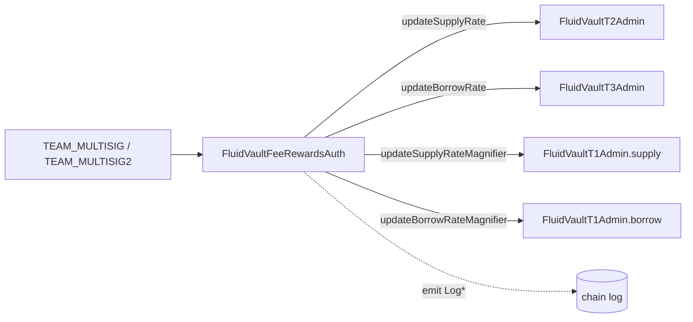

# Config / vaultFeeRewardsAuth — SPEC

## 1. Purpose

Team-multisig-only auth for **nudging per-vault interest-rate / reward parameters** on Fluid Vaults without exposing the full `FluidVault*Admin` surface. Forwards four narrow setters (two for "normal" vault sides, two for "smart" DEX-backed sides) to the relevant vault admin module, reading the current on-chain value first so that changes are fully logged with `(old, new)` before / after values.

Implemented as a single contract:

| Contract | File | Role |
| --- | --- | --- |
| `FluidVaultFeeRewardsAuth` | `main.sol` | Single entry point. Auth, vault-type checks, event emission. |

Contrast with the broader [`pauseAuth/`](../pauseAuth/SPEC.md), [`limitsAuth*`](../SPEC.md#2-index), and [`ratesAuth/`](../ratesAuth/SPEC.md) — this auth is intentionally the simplest shape in `contracts/config/`: no operator tier, no cooldown, no per-call cap beyond what the vault admin module itself enforces.

## 2. Architecture & Data Flow

Each call: `multisig → FluidVaultFeeRewardsAuth` (auth + vault-type check + old-value read) → `FluidVault{T1,T2,T3}Admin` (value clamp + storage write) → back to auth (emit `Log*` with old + new). No storage of pending / target values, no rate-limiting state.

## 3. External Interactions

- Must be **registered as an auth on every vault** it is expected to operate on. The vault `_verifyCaller` modifier on the admin module rejects any other caller, so governance registers this contract on each vault's admin module.
- Reads `IFluidVault(vault).TYPE()` to branch between T1 (no `TYPE()` — caught in try/catch), T2 (smart-col), T3 (smart-debt), T4 (smart-col + smart-debt).
- Reads vault storage slot 1 (`vaultVariables2`) directly via `IFluidVault.readFromStorage(bytes32(1))` to recover the current supply/borrow rate magnifier (16 bits × 2) for emission of the "old" value.
- Calls the vault admin modules' `updateSupplyRate` / `updateBorrowRate` / `updateSupplyRateMagnifier` / `updateBorrowRateMagnifier`, which internally clamp to 16-bit unsigned (`X16`) or 15-bit signed (`X15`) and revert with `VaultAdmin__ValueAboveLimit` on overflow.
- Does **not** touch Liquidity, DEX, or the Vault Factory directly — it is a pure vault-admin-module router.
- Holds no balances and has no rescue path.

## 4. Roles & Access Control

| Modifier | Who passes |
| --- | --- |
| `onlyMultisig` | `TEAM_MULTISIG` **or** `TEAM_MULTISIG2` |

All four mutating methods (`updateSupplyRate`, `updateBorrowRate`, `updateSupplyRateMagnifier`, `updateBorrowRateMagnifier`) require `onlyMultisig`.

| Role | Can call |
| --- | --- |
| `TEAM_MULTISIG` (`0x4F6F...D49e`) | All four setters. |
| `TEAM_MULTISIG2` (`0x1e2e...4219`) | All four setters. |
| Anyone else | Nothing mutating. View functions are public. |

There is **no operator / rebalancer tier** and **no per-address allowlist stored on this contract**. Upgrading the set of callers means redeploying with a different constants block and re-registering the new contract as vault auth (see [../SPEC.md §3.2](../SPEC.md#32-auth-contract-pattern) and §8 below).

## 5. Storage Layout

`FluidVaultFeeRewardsAuth` has **no mutable storage**. It exposes only constants:

| Constant | Value | Source |
| --- | --- | --- |
| `TEAM_MULTISIG` | `0x4F6F977aCDD1177DCD81aB83074855EcB9C2D49e` | `Constants` |
| `TEAM_MULTISIG2` | `0x1e2e1aeD876f67Fe4Fd54090FD7B8F57Ce234219` | `Constants` |
| `X15` | `0x7fff` (`2^15 - 1`) | signed-rate magnitude mask |
| `X16` | `0xffff` (`2^16 - 1`) | magnifier mask |

The addresses it operates on are passed in per call; it does not maintain its own vault registry.

## 6. Admin / Setter Methods

Forwarded to the vault admin module selected by vault type. All take `onlyMultisig`. No cooldown, no cap, no per-call rate limit beyond the vault admin module's own 16-/15-bit clamp.

### 6.1 Normal-side parameters (non-smart vaults)

"Normal" here means a vault side that is **not** DEX-smart: the supply/borrow side is a single Liquidity token. For T1 both sides are normal; for T2 the borrow side is normal; for T3 the supply side is normal; T4 has no normal side.

| Method | Forwards to | Semantics |
| --- | --- | --- |
| `updateSupplyRateMagnifier(normalColVault_, newMagnifier_)` | `FluidVaultT1Admin.updateSupplyRateMagnifier(uint)` | Scales supply rate for the vault's **normal collateral** side. Unsigned uint16; `10_000 == 1×`. Vault admin reverts `VaultAdmin__ValueAboveLimit` if `newMagnifier_ > X16`. |
| `updateBorrowRateMagnifier(normalDebtVault_, newMagnifier_)` | `FluidVaultT1Admin.updateBorrowRateMagnifier(uint)` | Scales borrow rate for the vault's **normal debt** side. Same clamp. |

The auth routes both methods through `FluidVaultT1Admin` regardless of whether the target is a T1, T2, or T3 vault, because the magnifier setter shape is identical across those admin modules (T2/T3 inherit it unchanged). Caller is responsible for selecting a vault that has a normal side on the requested direction.

`currentSupplyRateMagnifier(vault)` and `currentBorrowRateMagnifier(vault)` are public views that read bits `0..15` and `16..31` of `vaultVariables2` respectively, and **revert `VaultFeeRewardsAuth__InvalidVaultType`** if the side being queried is actually smart (`isSmartCol` for supply, `isSmartDebt` for borrow). This revert is only triggered by the view paths; the setters do **not** pre-check vault type, so calling `updateSupplyRateMagnifier` on a smart-col vault will either revert inside the `emit LogUpdate...` old-value read (via `currentSupplyRateMagnifier`) **or** at the vault admin module's own type check — see §11.

### 6.2 Smart-side parameters (DEX-backed vaults, T2 / T3 / T4)

"Smart" means the vault side is backed by a DEX pool (shared pool rewards / incentives). For smart sides the rate can be **negative** (protocol incentivises users) or **positive** (protocol charges users). The value is encoded into the magnifier 16-bit slot as `(|rate| << 1) | signBit`, where `signBit = 1` ⇒ positive.

| Method | Forwards to | Semantics |
| --- | --- | --- |
| `updateSupplyRate(smartColVault_, newSupplyRate_)` | `FluidVaultT2Admin.updateSupplyRate(int)` | Sets smart-collateral supply rate in 1e2 scale (100 = 1%, 10_000 = 100%). Positive ⇒ incentivising suppliers, negative ⇒ charging them. Vault admin reverts `VaultAdmin__ValueAboveLimit` if `|newSupplyRate_| > X15`. |
| `updateBorrowRate(smartDebtVault_, newBorrowRate_)` | `FluidVaultT3Admin.updateBorrowRate(int)` | Sets smart-debt borrow rate in 1e2 scale. Positive ⇒ charging borrowers (extra fee), negative ⇒ incentivising borrowers. Same `|rate| ≤ X15` clamp. |

For T4 (smart-col + smart-debt) both methods are valid against the same vault address; the T4 admin module exposes both `updateSupplyRate` and `updateBorrowRate` with identical signatures.

`currentSupplyRate(smartColVault_)` and `currentBorrowRate(smartDebtVault_)` are public views that:

1. Call `getVaultType(vault_)` (wrapping `IFluidVault.TYPE()` in a try/catch — absent `TYPE()` ⇒ T1 ⇒ `(false, false)`).
2. Revert `VaultFeeRewardsAuth__InvalidVaultType` if the requested side is **not** smart.
3. Decode `int256((magnifier >> 1) & X15)` and flip sign based on `magnifier & 1`.

### 6.3 Cross-vault routing summary

| Target vault type | `updateSupplyRateMagnifier` | `updateBorrowRateMagnifier` | `updateSupplyRate` | `updateBorrowRate` |
| --- | --- | --- | --- | --- |
| T1 (normal col, normal debt) | ✅ T1Admin | ✅ T1Admin | — | — |
| T2 (smart col, normal debt) | — (view reverts `InvalidVaultType`) | ✅ T1Admin (= T2Admin inherited) | ✅ T2Admin | — |
| T3 (normal col, smart debt) | ✅ T1Admin (= T3Admin inherited) | — (view reverts `InvalidVaultType`) | — | ✅ T3Admin |
| T4 (smart col, smart debt) | — | — | ✅ T4Admin (same as T2) | ✅ T4Admin (same as T3) |

"—" rows indicate the method is semantically invalid for that vault side; the view path reverts `VaultFeeRewardsAuth__InvalidVaultType`. The setter path itself has no type guard, so misuse either reverts on the preceding view read (when the setter's old-value path goes through `currentSupplyRate` / `currentBorrowRate` / `currentSupplyRateMagnifier` / `currentBorrowRateMagnifier`) or at the vault admin module's own bound / type check.

## 7. Events

| Event | Emitted by | Fields |
| --- | --- | --- |
| `LogUpdateSupplyRateMagnifier(address vault, uint256 oldSupplyRateMagnifier, uint256 newSupplyRateMagnifier)` | `updateSupplyRateMagnifier` | Normal-col magnifier update. |
| `LogUpdateBorrowRateMagnifier(address vault, uint256 oldBorrowRateMagnifier, uint256 newBorrowRateMagnifier)` | `updateBorrowRateMagnifier` | Normal-debt magnifier update. |
| `LogUpdateSupplyRate(address vault, int256 oldSupplyRate, int256 newSupplyRate)` | `updateSupplyRate` | Smart-col signed rate update. |
| `LogUpdateBorrowRate(address vault, int256 oldBorrowRate, int256 newBorrowRate)` | `updateBorrowRate` | Smart-debt signed rate update. |

The underlying vault admin modules also emit their own `LogUpdate*` event (without an `oldValue` field). Both events fire for every successful call.

## 8. Errors

| Code | Name | When |
| --- | --- | --- |
| `100121` | `VaultFeeRewardsAuth__Unauthorized` | `msg.sender` is neither `TEAM_MULTISIG` nor `TEAM_MULTISIG2`. |
| `100122` | `VaultFeeRewardsAuth__InvalidVaultType` | View method invoked for the wrong side (`currentSupplyRateMagnifier` on a smart-col vault, `currentBorrowRateMagnifier` on a smart-debt vault, `currentSupplyRate` on a non-smart-col vault, `currentBorrowRate` on a non-smart-debt vault). |

Both raised as `FluidConfigError(errorId)` from the shared [`contracts/config/error.sol`](../error.sol) (see [`../SPEC.md §3.4`](../SPEC.md#34-error-convention)).

Additional reverts bubble up from the target vault admin module:

- `VaultAdmin__ValueAboveLimit` — magnifier > `X16` or `|rate| > X15`.
- Vault-admin `_verifyCaller` revert — if `FluidVaultFeeRewardsAuth` is not registered as auth on the target vault.

## 9. Deployment Checklist

1. Deploy `FluidVaultFeeRewardsAuth` (no constructor arguments; constants are hard-coded).
2. For every vault (T1 / T2 / T3 / T4) whose rate or magnifier should be adjustable by the multisig, register the auth on that vault's admin module (standard `setAuth(auth, true)` from vault governance).
3. (Optional) Deregister any older `vaultFeeRewardsAuth` deployment from the same vault.
4. No post-deploy configuration is required — there is no mapping to seed, no pause flag, no operator list.

## 10. Invariants & Safety Notes

- **No on-chain rate limit or cooldown.** Every call applies immediately; the only quantitative bound is the vault admin module's own 16-bit / 15-bit clamp. This auth is intended for **governance-grade operators** (team multisigs), not low-friction bots. See §12.
- **Stateless.** The contract has no storage mutation paths, so it cannot be "drifted out of sync" with vault state, and replacement is a clean pure-code swap.
- **No balance.** The contract never receives or forwards ETH / tokens; there is no `rescueTokens`, and none is needed.
- **Smart-side sign encoding is part of the wire format.** Callers must pass the **signed** rate in 1e2 scale; the T2 / T3 / T4 admin modules re-encode it into the `(magnitude, signBit)` form stored in `vaultVariables2` bits `0..15` (supply) / `16..31` (borrow).
- **`getVaultType` is best-effort.** A non-Fluid or malformed vault will fall through the switch and return `(false, false)` (treated as T1). Callers must pass only legitimate Fluid vault addresses; there is no factory cross-check.
- **Setters do not pre-validate vault type.** The four setters read the *current* value before forwarding. For `updateSupplyRateMagnifier` / `updateBorrowRateMagnifier` the `current*Magnifier` helpers will revert `InvalidVaultType` on the wrong side. For `updateSupplyRate` / `updateBorrowRate` the `current*Rate` helpers do the same. The net effect is that mis-routing fails loudly before touching the admin module.
- **Single-tx observability.** Every successful call emits exactly one `Log*` event with `(old, new)`; consumers can reconstruct the full rate/magnifier history by indexing this auth alone without also following the vault admin modules.

## 11. Trust Model & Audit Notes

- **Root of trust** = `TEAM_MULTISIG` ∪ `TEAM_MULTISIG2`. Either multisig can set any of the four parameters on any vault the auth is registered against. Both addresses are hard-coded as constants; rotating either multisig requires a redeploy (standard for `contracts/config/` — see [`../SPEC.md §9`](../SPEC.md#9-audit-notes-absorbed)).
- **Narrow attack surface.** A compromised multisig can only move rate / magnifier parameters within their 16-/15-bit range. It cannot pause, delist, liquidate, or change any other vault configuration through this auth — those routes live in `pauseAuth`, the vault factory admin, or the vault admin module directly. Rate / magnifier moves are reversible and continuously audited via the emitted events.
- **No per-parameter governance cap.** Unlike `ratesAuth` or `limitsAuth`, `vaultFeeRewardsAuth` exposes the vault admin module's full legal range with no additional ceiling. Governance accepts that a legitimate multisig might need to drive a magnifier to the extremes of `[0, X16]` or a smart-side rate to `[-X15, +X15]`; the lack of a secondary cap is intentional and documented.
- **No cooldown.** Rationale: the multisig itself is already slow (N-of-M human approval); stacking an on-chain cooldown would just block legitimate emergency fee / reward adjustments without meaningfully reducing abuse risk.
- **`TYPE()` try/catch is deliberate.** Legacy T1 vaults don't expose `TYPE()` and must default to "normal-col, normal-debt". Any future vault type that doesn't advertise `TYPE()` will be mis-routed as T1; add a `TYPE()` override on new vaults before registering this auth.
- **Cross-link:** see [`../SPEC.md`](../SPEC.md) for the config-folder-wide trust model and the error-ID map; see [`../pauseAuth/SPEC.md`](../pauseAuth/SPEC.md) for the richer multi-tier auth shape that this contract explicitly does *not* implement.

## 12. Operational Playbook

Typical use cases covered by this auth (all via team multisig):

- Adjust a T1 market's rate **magnifier** after a governance vote changes spread policy (e.g. bump supply magnifier from `1.0×` to `1.1×` to tighten supplier yield).
- Switch a T2 / T4 smart-col vault between "charging" and "incentivising" modes by flipping the sign of `newSupplyRate_`.
- Launch a new T3 / T4 smart-debt incentive by calling `updateBorrowRate(vault, -rate)`.
- Zero-out a deprecated incentive by calling the corresponding setter with `0`.

Use the companion [`limitsAuth`](../SPEC.md#2-index) family for **supply / borrow limit** changes, and [`pauseAuth`](../pauseAuth/SPEC.md) for emergency pause — those are orthogonal concerns.
