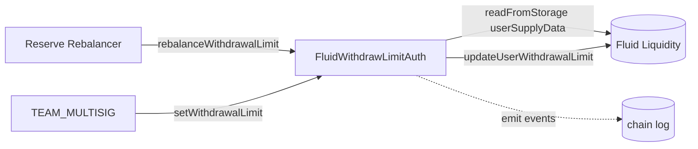

# Config / withdrawLimitAuth — SPEC

## 1. Purpose

Rate-limited operator path to nudge a single user's **withdrawal limit** on Fluid Liquidity (`Liquidity.updateUserWithdrawalLimit(user, token, newLimit)`) without handing raw admin power to rebalancers.

Two call paths:

- `rebalanceWithdrawalLimit(user, token, newLimit)` — reserve rebalancers. Gated by a percent-delta cap against the currently-stored withdraw limit and by per-(user,token) hourly / daily counters on *tightening* updates.
- `setWithdrawalLimit(user, token, newLimit)` — `TEAM_MULTISIG` only. Unbounded pass-through for emergency / one-off corrections.

One contract: `FluidWithdrawLimitAuth` (`main.sol`). See [`../SPEC.md`](../SPEC.md) for top-level conventions.

## 2. Architecture & Data Flow

Per rebalancer call:

1. Read the target `(user, token)` user-supply slot from Liquidity (`LiquiditySlotsLink.calculateDoubleMappingStorageSlot`).
2. Decode `initialUserSupply` (`BigMathMinified.fromBigNumber`, 64-bit payload, 8-bit exponent) and derive `initialWithdrawLimit` via `LiquidityCalcs.calcWithdrawalLimitBeforeOperate`.
3. Validate: user has non-zero supply; `newLimit` stays within 5% below the current withdraw limit.
4. Update per-(user,token) counters / cooldowns (`userData[user][token]` of type `UserSupplyHistory`).
5. Push `updateUserWithdrawalLimit(user, token, newLimit)` to Liquidity and emit `LogRebalanceWithdrawalLimit`.

The multisig path skips steps 1–4 entirely.

## 3. External Interactions

- Must be registered as an **auth** on Fluid Liquidity so `updateUserWithdrawalLimit` succeeds.
- Calls `IFluidReserveContract.isRebalancer(addr)` on `RESERVE_CONTRACT` for the rebalancer check.
- Reads the Liquidity user-supply mapping via `readFromStorage` (slot = `keccak256(token || keccak256(user || LIQUIDITY_USER_SUPPLY_DOUBLE_MAPPING_SLOT))`); decodes bits `[BITS_USER_SUPPLY_AMOUNT .. +64)` as a 64-bit BigMath number.
- Holds no tokens, no native ETH, no reentrancy guard — every external call is a single admin write to Liquidity.

## 4. Roles & Access Control

| Modifier | Who passes | Used on |
| --- | --- | --- |
| `onlyRebalancer` | `RESERVE_CONTRACT.isRebalancer(msg.sender) == true` | `rebalanceWithdrawalLimit` |
| `onlyMultisig` | `msg.sender == TEAM_MULTISIG` | `setWithdrawalLimit` |
| `validAddress` | constructor arg `!= address(0)` | constructor |

| Role | Can rate-limited rebalance | Can set arbitrary limit | Notes |
| --- | --- | --- | --- |
| Reserve rebalancer | Yes | No | Subject to 5% delta cap + hourly/daily counters |
| `TEAM_MULTISIG` | No (not a rebalancer by default) | Yes | Emergency override, no caps |
| Anyone else | No | No | Reverts `WithdrawLimitAuth__Unauthorized` |

There is **no on-contract per-operator grant mapping** here; the rebalancer set is delegated entirely to `RESERVE_CONTRACT`. The multisig is hard-pinned at construction to the constructor-supplied `multisig_` argument (not hardcoded like `pauseAuth`).

## 5. Storage Layout

### Immutables

| Name | Type | Source |
| --- | --- | --- |
| `TEAM_MULTISIG` | `address` | constructor `multisig_` (non-zero) |
| `RESERVE_CONTRACT` | `IFluidReserveContract` | constructor `reserveContract_` (non-zero) |
| `LIQUIDITY` | `IFluidLiquidity` | constructor `liquidity_` (non-zero) |

### Constants

- `MAX_PERCENT_CHANGE = 5` — allowed downside delta (percent) between `newLimit` and `initialWithdrawLimit`.
- `X64 = 0xffffffffffffffff` — 64-bit mask for BigMath payload.
- `DEFAULT_EXPONENT_SIZE = 8`, `DEFAULT_EXPONENT_MASK = 0xFF` — BigMath decoder params.

### Mutable state

| Mapping | Type | Meaning |
| --- | --- | --- |
| `userData[user][token]` | `UserSupplyHistory` | Per-(user,token) rate-limit bookkeeping for the rebalancer path |

`UserSupplyHistory` (packed):

| Field | Type | Meaning |
| --- | --- | --- |
| `initialDailyTimestamp` | `uint40` | Start of the current 24 h window |
| `initialHourlyTimestamp` | `uint40` | Start of the current 1 h window (within the day) |
| `rebalancesIn1Hour` | `uint8` | Tightening rebalances in the current hour window |
| `rebalancesIn24Hours` | `uint8` | Tightening rebalances in the current day window |
| `leastDailyUserSupply` | `uint160` | Lowest `newLimit` observed in the current day window |

Field is named `leastDailyUserSupply` but is populated with `newLimit_` (not `initialUserSupply_`).

## 6. Methods

### Write methods

| Method | Auth | Purpose |
| --- | --- | --- |
| `rebalanceWithdrawalLimit(user, token, newLimit)` | `onlyRebalancer` | Rate-limited update; enforces 5% cap + counters. |
| `setWithdrawalLimit(user, token, newLimit)` | `onlyMultisig` | Unbounded override. |

### View methods

| Method | Returns |
| --- | --- |
| `userData(user, token) view` | `UserSupplyHistory` struct (auto-generated getter) |
| `getUsersData(users[], tokens[]) view` | `(initialUsersSupply[], initialWithdrawLimit[])` per index |
| `TEAM_MULTISIG() / RESERVE_CONTRACT() / LIQUIDITY()` | Immutable getters |

`getUsersData` reverts `WithdrawLimitAuth__InvalidParams` if `users_.length != tokens_.length`. It loops without any auth check and is safe for off-chain inspection.

### `rebalanceWithdrawalLimit` — detailed flow

Let `H = userData[user][token]` (loaded once into memory), `now = block.timestamp`:

1. Load `userSupplyData` from Liquidity storage for `(user, token)`.
2. Decode `initialUserSupply = BigMath.fromBigNumber(userSupplyData >> BITS_USER_SUPPLY_AMOUNT & X64, 8, 0xFF)`.
3. Compute `initialWithdrawLimit = LiquidityCalcs.calcWithdrawalLimitBeforeOperate(userSupplyData, initialUserSupply)`.
4. If `initialUserSupply == 0` → revert `WithdrawLimitAuth__NoUserSupply`.
5. If `newLimit < initialWithdrawLimit * 95 / 100` → revert `WithdrawLimitAuth__ExcessPercentageDifference`. (The check is one-sided: raising `newLimit` is not capped here.)
6. Window / counter bookkeeping:
   - **New day**: if `now - H.initialDailyTimestamp > 1 days`, reset: `leastDailyUserSupply = newLimit`, `rebalancesIn24Hours = 1`, `rebalancesIn1Hour = 1`, both timestamps = `now`. No further counter checks this call.
   - **Same day**: only act if `newLimit < H.leastDailyUserSupply` (tightening).
     - If `H.rebalancesIn24Hours == 4` → revert `WithdrawLimitAuth__DailyLimitReached` (i.e. the 5th tightening in 24 h is blocked; max 4 per day).
     - If `now - H.initialHourlyTimestamp > 1 hours`: start new hour — `rebalancesIn1Hour = 1`, `rebalancesIn24Hours += 1`, `initialHourlyTimestamp = now`.
     - Else (same hour): if `H.rebalancesIn1Hour == 2` → revert `WithdrawLimitAuth__HourlyLimitReached` (max 2 per hour); otherwise `rebalancesIn1Hour += 1`, `rebalancesIn24Hours += 1`.
     - Update `leastDailyUserSupply = newLimit`.
   - If `newLimit >= H.leastDailyUserSupply` (loosening within the same day) → no counter increment, no cooldown consumed.
7. Persist `userData[user][token] = H`.
8. Call `LIQUIDITY.updateUserWithdrawalLimit(user, token, newLimit)`.
9. Emit `LogRebalanceWithdrawalLimit(user, token, newLimit)`.

Effective caps for the rebalancer path:

| Window | Max *tightening* calls |
| --- | --- |
| 1 hour | 2 |
| 24 hours | 4 |

Loosening updates (≥ current `leastDailyUserSupply`) are unlimited *as long as* they still satisfy the 5%-below-current-limit rule.

### `setWithdrawalLimit` — detailed flow

1. `LIQUIDITY.updateUserWithdrawalLimit(user, token, newLimit)`.
2. Emit `LogSetWithdrawalLimit(user, token, newLimit)`.

Does **not** touch `userData`, does not read `userSupplyData`, does not enforce the 5% cap, and does not check `user`/`token` for zero. Liquidity itself will revert on invalid inputs.

## 7. Events

- `LogRebalanceWithdrawalLimit(address user, address token, uint256 newLimit)` — emitted by the rebalancer path on success.
- `LogSetWithdrawalLimit(address user, address token, uint256 newLimit)` — emitted by the multisig override.

No events are emitted for skipped / no-op branches (there is no batch mode, so "skip" does not apply).

## 8. Errors

All raised as `FluidConfigError(errorId_)` from `contracts/config/error.sol`.

| Code | Name | When |
| --- | --- | --- |
| 100071 | `WithdrawLimitAuth__NoUserSupply` | `rebalanceWithdrawalLimit` and the decoded `initialUserSupply == 0` (user has never supplied this token, or has fully withdrawn). |
| 100072 | `WithdrawLimitAuth__Unauthorized` | Caller failed `onlyRebalancer` (not a reserve rebalancer) on `rebalanceWithdrawalLimit`, or failed `onlyMultisig` (not `TEAM_MULTISIG`) on `setWithdrawalLimit`. |
| 100073 | `WithdrawLimitAuth__InvalidParams` | Constructor received a zero address for any of `reserveContract_`, `liquidity_`, `multisig_`; **or** `getUsersData` called with `users_.length != tokens_.length`. |
| 100074 | `WithdrawLimitAuth__DailyLimitReached` | In the rebalancer path, on a tightening call, within the same 24 h window, `rebalancesIn24Hours == 4` before the increment. |
| 100075 | `WithdrawLimitAuth__HourlyLimitReached` | In the rebalancer path, on a tightening call, within the same hourly sub-window, `rebalancesIn1Hour == 2` before the increment. |
| 100076 | `WithdrawLimitAuth__ExcessPercentageDifference` | In the rebalancer path, `newLimit_ < initialWithdrawLimit_ * 95 / 100` (i.e. the requested new limit is more than 5% below the current one). |

Note: `WithdrawLimitAuth__InvalidParams` is **not** raised for zero `user_` / `token_` on either write method — those route straight to Liquidity, which enforces its own input validation.

## 9. Deployment Checklist

1. Deploy `FluidWithdrawLimitAuth(reserveContract, liquidity, multisig)` with all three addresses non-zero.
2. Register the contract as an **auth** on Fluid Liquidity (required so `updateUserWithdrawalLimit` does not revert inside Liquidity's auth check).
3. Ensure `reserveContract` is live and returns `isRebalancer(addr) == true` for every operator that should be able to call `rebalanceWithdrawalLimit`.
4. Confirm `multisig_` constructor argument matches the intended governance key — it is immutable and cannot be rotated without redeploy.
5. No additional per-user state seeding is needed: `userData[user][token]` entries lazy-initialise on first rebalance.

## 10. Invariants & Safety Notes

- **Rate limits are per-(user,token), not global.** A rebalancer can still hit many users in one block; the cap only throttles repeated tightening of the same position.
- **Only tightening consumes counters.** A `newLimit >= leastDailyUserSupply` call within the same day is free (it still emits the event and writes Liquidity, but does not touch counters). This is by design so loosening can always proceed.
- **The 5% cap is against `initialWithdrawLimit`, not `initialUserSupply`.** It is a one-sided floor: `newLimit_ < limit * 0.95` reverts. There is no explicit upper cap — the multisig is expected to handle large upward moves via `setWithdrawalLimit`, but the rebalancer can also raise the limit arbitrarily through this path since the upper side is unchecked.
- **`leastDailyUserSupply` tracks `newLimit`, not user supply** (despite the name). Its `uint160` field comfortably accepts any realistic `uint256 newLimit_`, but the code casts via `uint128(newLimit_)` on write — values above `2**128 - 1` would silently truncate. In practice withdraw limits are bounded far below that.
- **Hourly counter reset semantics.** When a tightening call crosses the hour boundary (`now - initialHourlyTimestamp > 1 hours`) inside the same day, `rebalancesIn1Hour` resets to `1` *and* `rebalancesIn24Hours` still increments. When it does not cross, both counters increment together. So the daily counter is the sum of all tightening calls that day; the hourly counter is the count within the current sub-hour.
- **Day boundary hard reset** overwrites `leastDailyUserSupply` to the current `newLimit` regardless of direction; the very first call after the 24 h window opens does not see the 5% downside cap relative to the previous day (still sees the 5% cap relative to the *current on-chain* withdraw limit in Liquidity, which is what actually matters).
- **Multisig override bypasses everything.** `setWithdrawalLimit` is an emergency valve and does not touch `userData`, so counters remain frozen across override writes — the next rebalancer call still sees the pre-override `leastDailyUserSupply` and window timestamps.
- **No reentrancy guard.** Safe because there is exactly one external state-changing call per function (`updateUserWithdrawalLimit`) made *after* all local state is finalised, and Liquidity does not re-enter here.
- **No ETH / token handling.** No `receive`, no `rescueTokens`, no callbacks — the contract is a pure auth wrapper.
- **No batch write mode.** Each rebalance is a single `(user, token)` pair. Batching is expected at the caller level (multicaller / EOA batch).

## 11. Edge Cases

- **Zero `newLimit_` via rebalancer**: accepted by the auth only if `0 >= initialWithdrawLimit * 95 / 100`, i.e. when `initialWithdrawLimit == 0` (rounding to zero after integer division for `initialWithdrawLimit <= 20 / 95 ≈ 0`). For any realistic non-zero current limit the 5% check fires → `WithdrawLimitAuth__ExcessPercentageDifference`.
- **`newLimit_ == initialWithdrawLimit` (no-op)**: permitted. Counters untouched (not tightening relative to `leastDailyUserSupply`). Still emits the event and re-writes Liquidity storage.
- **Extremely large `newLimit_`**: passes the 5% check trivially. If `newLimit_ > 2**128 - 1`, the cast `uint128(newLimit_)` truncates the stored `leastDailyUserSupply`, which affects only the *next* tightening comparison on this user/token. The value actually pushed to Liquidity is untruncated.
- **First-ever rebalance for a user/token** (`userData[user][token]` all zeroes): `now - 0 > 1 days` is true, so the "new day" branch runs: counters initialise to `1`, timestamps to `now`, `leastDailyUserSupply = newLimit`. Correct behaviour.
- **Rebalance right at window boundaries**: the comparisons are strict `>` (`> 1 days`, `> 1 hours`). A call exactly `1 days`/`1 hours` after the previous is treated as *inside* the window (same day/hour).
- **User with non-zero supply but zero current withdraw limit** (e.g. freshly-expanded position): passes the `NoUserSupply` check. The 5% cap becomes `newLimit_ < 0` which is never true for unsigned `newLimit_`, so any value (including `0`) is accepted. First-day logic then initialises counters.
- **`user_` or `token_ == address(0)` on write paths**: not rejected by this contract; rejected downstream by Liquidity. `getUsersData` also accepts zero entries and just returns zero rows.
- **`getUsersData` with empty arrays**: both lengths `0` — passes the length check, returns two empty arrays. No-op.
- **`rebalancer == TEAM_MULTISIG`**: only possible if the reserve contract also lists the multisig as a rebalancer. In that case the multisig can use either path; the rebalancer path still enforces the 5% cap and counters.

## 12. Trust Model & Audit Notes

- **Root of trust**: the constructor-supplied `multisig_` (for overrides) and `RESERVE_CONTRACT`'s rebalancer set (for rate-limited adjustments). See [`../SPEC.md`](../SPEC.md#3-architectural-conventions) and [`../../reserve/SPEC.md`](../../reserve/SPEC.md).
- **Attack surface**: a compromised rebalancer can push a user's withdraw limit 5% lower per call, up to 2× per hour and 4× per day per position — i.e. the worst-case compounded pressure is bounded. It cannot raise the limit unboundedly in practice because no sane rebalancer script would, but the contract itself does not cap upward moves; governance relies on rebalancer code, not on this contract, to refuse that.
- **Compromised multisig**: fully bypasses all checks. Mitigated by the multisig itself being a threshold signer set; not by this contract.
- **Why the 5% cap is one-sided**: tightening a withdraw limit below the user's actual supply can force liquidation-like conditions for large positions; loosening is benign. The rate limit's job is to prevent a compromised rebalancer from repeatedly tightening. Upward nudges are unrestricted by design, since they cannot harm the user.
- **Why the counters track `leastDailyUserSupply` instead of "last newLimit"**: it allows an operator to temporarily loosen and re-tighten within a day without consuming extra counter slots, as long as the tighter value does not go below the day's running minimum. This is the intended shape per the rebalancer playbook.
- **Upgrade path**: replace the contract. Deploy a new one, register as auth on Liquidity, remove the old one. `userData` history is not migrated; the new deployment starts counters fresh, which is acceptable because the on-chain withdraw limit at Liquidity is authoritative.
- **No events for rejected state**: every revert path surfaces `FluidConfigError(code)`; there is no "skipped" log. Batch callers must check each sub-call.
