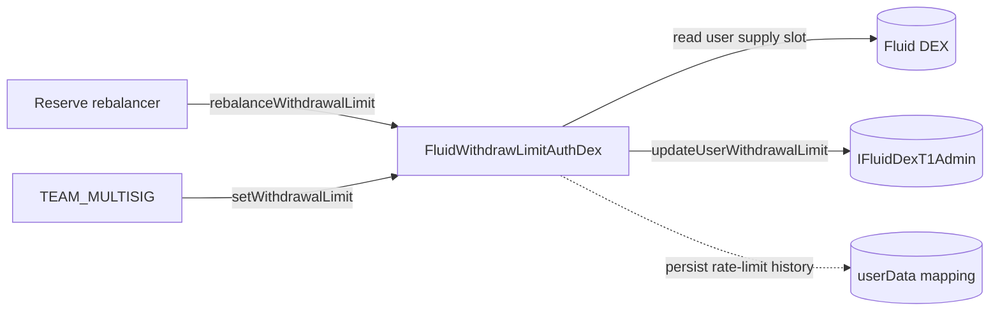

# Config / withdrawLimitAuthDex — SPEC

## 1. Purpose

Narrow, rate-limited setter for **per-user withdrawal limits on a Fluid DEX**. A rebalancer (via the [Reserve](../../reserve/SPEC.md) allow-list) can nudge a user's DEX-side withdrawal limit downward with a hard 5 % per-call cap and hourly / daily frequency caps; the team multisig retains an unrestricted escape hatch.

DEX-layer counterpart to [`withdrawLimitAuth/`](../withdrawLimitAuth/) — same rate-limiting philosophy, but the target is the DEX admin module (`IFluidDexT1Admin.updateUserWithdrawalLimit`) rather than Liquidity, and the limit is denominated in **DEX supply shares**, not tokens.

Single contract: `FluidWithdrawLimitAuthDex` (`main.sol`).

## 2. Architecture & Data Flow

Per `rebalanceWithdrawalLimit` call:

1. Read the DEX user-supply slot and decompress with `BigMathMinified.fromBigNumber`.
2. Derive the current pre-operate withdrawal limit via `DexCalcs.calcWithdrawalLimitBeforeOperate`.
3. Enforce the 5 % floor (`newLimit_ ≥ 95 % × currentLimit`).
4. Update per-user rate-limit history (hourly / daily counters).
5. Push the new limit through `IFluidDexT1Admin.updateUserWithdrawalLimit(user, newLimit)`.
6. Emit `LogRebalanceWithdrawalLimit(dex, user, newLimit)`.

`setWithdrawalLimit` is a plain forwarder — no rate accounting, no history touch.

## 3. External Interactions

- Must be registered as an **auth** at each DEX whose user limits it will rewrite (otherwise `IFluidDexT1Admin.updateUserWithdrawalLimit` reverts at the DEX admin-auth check).
- Reads `RESERVE_CONTRACT.isRebalancer(msg.sender)` to gate the permissionless-ish rebalancer path.
- Reads from the DEX via `IFluidDexT1.readFromStorage` at `DexSlotsLink.calculateMappingStorageSlot(DEX_USER_SUPPLY_MAPPING_SLOT, user)` — a single mapping (DEX-specific storage per deployment).
- Uses `DexCalcs.calcWithdrawalLimitBeforeOperate` (mirror of `LiquidityCalcs` but against the DEX user-supply packing) to translate stored shrink-limit + exponent into an absolute share floor.
- No token transfers; no ETH handling.

## 4. Roles & Access Control

| Modifier | Who passes | Guard |
| --- | --- | --- |
| `onlyRebalancer` | `RESERVE_CONTRACT.isRebalancer(msg.sender) == true` | `WithdrawLimitAuth__Unauthorized` |
| `onlyMultisig` | `msg.sender == TEAM_MULTISIG` | `WithdrawLimitAuth__Unauthorized` |
| `validAddress` | `addr != 0` (constructor only) | `WithdrawLimitAuth__InvalidParams` |

### Permission matrix

| Role | `rebalanceWithdrawalLimit` | `setWithdrawalLimit` |
| --- | --- | --- |
| Reserve rebalancer | Yes — subject to 5 % cap + hourly / daily caps | No |
| Team multisig | No (would revert — not registered as rebalancer unless separately listed) | Yes — unrestricted |

No self-managed allow-list is kept on this contract; rebalancer identity is fully delegated to `RESERVE_CONTRACT`.

## 5. Storage Layout

| Storage | Type | Meaning |
| --- | --- | --- |
| `userData` | `mapping(address user => UserSupplyHistory)` | Rolling rebalance history, keyed **by user only** (see §11). |

`UserSupplyHistory` packed struct:

| Field | Bits | Meaning |
| --- | --- | --- |
| `initialDailyTimestamp` | 40 | Start of the current 24 h window. |
| `initialHourlyTimestamp` | 40 | Start of the current 1 h window. |
| `rebalancesIn1Hour` | 8 | Rebalances recorded inside the current hour. |
| `rebalancesIn24Hours` | 8 | Rebalances recorded inside the current day. |
| `leastDailyUserSupply` | 160 | Lowest `newLimit_` observed inside the day (tracked for the "only count as a rebalance if we are lowering further" rule; stored via `uint128` cast in the assignment). |

Immutables: `TEAM_MULTISIG`, `RESERVE_CONTRACT`.

Internal constants: `X64 = 0xffffffffffffffff`, `DEFAULT_EXPONENT_SIZE = 8`, `DEFAULT_EXPONENT_MASK = 0xFF`, `MAX_PERCENT_CHANGE = 5`.

Unlike `withdrawLimitAuth/` (which keys its history by `(user, token)`), the DEX variant keys by `user` **alone**: there is no `dex` or `token` component on the mapping.

## 6. Public Methods

### Rebalancer-gated

| Method | Auth | Behaviour |
| --- | --- | --- |
| `rebalanceWithdrawalLimit(dex, user, newLimit)` | `onlyRebalancer` | Reads user supply on `dex`, enforces 5 % cap + hourly / daily limits, calls `IFluidDexT1Admin(dex).updateUserWithdrawalLimit(user, newLimit)`, emits `LogRebalanceWithdrawalLimit`. |

Revert order inside `rebalanceWithdrawalLimit`:

1. `WithdrawLimitAuth__NoUserSupply` (100071) — if decompressed `initialUserSupply_ == 0`.
2. `WithdrawLimitAuth__ExcessPercentageDifference` (100076) — if `newLimit_ < 95 % × initialWithdrawLimit_`.
3. `WithdrawLimitAuth__DailyLimitReached` (100074) — if attempting a 5th lowering rebalance inside the same 24 h window.
4. `WithdrawLimitAuth__HourlyLimitReached` (100075) — if attempting a 3rd lowering rebalance inside the same 1 h window.

`newLimit_` is a **DEX share amount**, interpreted in raw terms by the DEX admin module. Any value below the DEX's own `maxExpansion`-derived floor or above `currentUserSupply` is internally clamped by `updateUserWithdrawalLimit`; `0` asks the DEX for maximum withdrawable, `type(uint256).max` asks for zero withdrawable.

### Multisig-only

| Method | Auth | Behaviour |
| --- | --- | --- |
| `setWithdrawalLimit(dex, user, newLimit)` | `onlyMultisig` | Direct pass-through to `IFluidDexT1Admin.updateUserWithdrawalLimit`; bypasses all rate-limit accounting and emits `LogSetWithdrawalLimit`. |

### View

| Method | Returns |
| --- | --- |
| `getUsersData(dex, users[])` | `(initialUsersSupply[], initialWithdrawLimit[])` — decompressed user supply and pre-operate withdrawal limit for each `user` on `dex`. No length check on `users_` (no pairing array to compare against). |
| `userData(user)` | Auto-generated mapping getter returning the full `UserSupplyHistory` tuple. |

## 7. Rate-Limit Accounting

Evaluated on every `rebalanceWithdrawalLimit` call, against the cached `userData[user]`:

- **Day rollover.** `block.timestamp - initialDailyTimestamp > 1 days`:
  - Reset both counters to `1`.
  - Set `leastDailyUserSupply = newLimit_`.
  - Reset both timestamps to `block.timestamp`.
  - No further checks — the call always proceeds.
- **Same day.** Check only fires when `newLimit_ < leastDailyUserSupply` (i.e. we are pushing the floor down further — flat / upward nudges within the day are free):
  - Daily cap: `rebalancesIn24Hours == 4` ⇒ revert (100074). Effective limit: **4 downward rebalances per 24 h window**.
  - Hour rollover: `block.timestamp - initialHourlyTimestamp > 1 hours` ⇒ reset `rebalancesIn1Hour = 1`, increment `rebalancesIn24Hours`, refresh hourly timestamp.
  - Same hour: `rebalancesIn1Hour == 2` ⇒ revert (100075). Effective limit: **2 downward rebalances per 1 h window**. Otherwise increment both counters.
  - On success, overwrite `leastDailyUserSupply` with `newLimit_`.

5 % cap is orthogonal and applies on every rebalancer call regardless of history: `newLimit_ ≥ initialWithdrawLimit_ × 95 / 100`.

`setWithdrawalLimit` does **not** write `userData` — after a multisig reset, the next rebalancer call still sees the prior history window (potentially stale timestamps / counters) until a day rollover naturally clears it.

## 8. Events

| Event | Fields | When |
| --- | --- | --- |
| `LogRebalanceWithdrawalLimit` | `(address dex, address user, uint256 newLimit)` | End of successful `rebalanceWithdrawalLimit`. |
| `LogSetWithdrawalLimit` | `(address dex, address user, uint256 newLimit)` | End of successful `setWithdrawalLimit`. |

Both events lead with the `dex` address — distinct from the Liquidity variant, which emits `(user, token, newLimit)`.

## 9. Errors

All raised as `FluidConfigError(errorId_)` from the shared `contracts/config/error.sol`. IDs are **shared with `withdrawLimitAuth/`** (both contracts use the same `WithdrawLimitAuth__*` constants from `errorTypes.sol`):

| Code | Name | When |
| --- | --- | --- |
| 100071 | `WithdrawLimitAuth__NoUserSupply` | `initialUserSupply_ == 0` after decompression. |
| 100072 | `WithdrawLimitAuth__Unauthorized` | Caller is neither reserve rebalancer nor team multisig (context-dependent). |
| 100073 | `WithdrawLimitAuth__InvalidParams` | Constructor zero-address check. |
| 100074 | `WithdrawLimitAuth__DailyLimitReached` | 5th downward rebalance inside a 24 h window. |
| 100075 | `WithdrawLimitAuth__HourlyLimitReached` | 3rd downward rebalance inside a 1 h window. |
| 100076 | `WithdrawLimitAuth__ExcessPercentageDifference` | `newLimit_ < 95 % × currentWithdrawLimit_`. |

See [`../SPEC.md` §3.4](../SPEC.md) for the global error-code table.

## 10. Deployment Checklist

1. Deploy `FluidWithdrawLimitAuthDex(reserveContract, teamMultisig)` — both addresses must be non-zero.
2. For every DEX whose user withdrawal limits this auth will rewrite: register the contract as an **auth** on that DEX (via the DEX factory / admin path).
3. Register the intended rebalancer operator(s) on `RESERVE_CONTRACT` (`isRebalancer(operator) → true`) — no local allow-list to configure on this auth.
4. (Optional) Verify the 5 % / 2-per-hour / 4-per-day policy against the DEX's own `maxExpansion` to confirm operator cadence is compatible.

No initialisation transaction is required after construction; all state starts at defaults.

## 11. Invariants & Safety Notes

- **Shares, not tokens.** `newLimit_` is a DEX supply share amount and must match the DEX's raw storage convention. The contract does no exchange-price conversion — callers (rebalancer UI / multisig) are responsible for converting from token intent into share terms before calling.
- **History is keyed by user only.** `userData[user]` is shared across every DEX this auth operates on. A user with supply on multiple DEXes has one combined rate-limit budget: four downward rebalances per day *total* across DEXes, not per-(user, dex). This is the main observable behavioural difference vs the Liquidity variant (which scopes per `(user, token)`).
- **Only downward rebalances consume budget.** If `newLimit_ ≥ leastDailyUserSupply`, the hourly / daily counters are not incremented — operators can "raise" (loosen) a user's limit inside a day without burning rate budget.
- **Multisig escape hatch is unrestricted.** `setWithdrawalLimit` has no 5 % cap, no rate-limit accounting, and does not update `userData`. It is a direct forwarder to the DEX admin.
- **Day-rollover branch skips the 5 %-reset relationship.** When the 24 h window rolls over, `leastDailyUserSupply` is overwritten unconditionally with `newLimit_`, and no further per-window checks fire. The 5 % cap above the day-rollover branch is the only guardrail in that path.
- **No token / ETH custody.** No balances to rescue; no `rescueTokens` is present, and none is needed.
- **No reentrancy risk.** The DEX admin call is the last statement (state has already been persisted). No callbacks are registered with the DEX.
- **Replacement is the upgrade path.** The contract is not upgradeable and holds no storage that would need migration beyond `userData`; governance deploys a new version, re-registers it as DEX auth, and de-registers the old one.

## 12. Trust Model & Audit Notes

- **Roots of trust.** `TEAM_MULTISIG` (hard-coded at construction) and whichever set of addresses `RESERVE_CONTRACT` currently classifies as rebalancers. The multisig implicitly trusts the reserve contract's rebalancer list — if that list is compromised, the 5 % / hourly / daily caps are the only remaining shield.
- **Rate-limit caps are the safety budget.** Worst-case rebalancer-side damage per 24 h window per user: four 5 % downward nudges. Compounded: `0.95^4 ≈ 0.8145`, i.e. an ~18.5 % floor drop per day. This is the intended operator ceiling.
- **Shared history is a deliberate trade-off** (vs per-(user, dex)): simpler storage, one budget to reason about, but means a user active on multiple DEXes gets tighter effective per-DEX cadence. Kept consistent with the contract's share-based, DEX-agnostic operator model.
- **Shared error IDs with Liquidity variant** (100071–100076) reflect their parallel behaviour and let periphery resolvers treat both auths uniformly.
- **Must be DEX auth to function.** Without DEX-side auth registration, every `updateUserWithdrawalLimit` call reverts at the DEX admin check — a silent-failure path is not possible.
- **No on-chain way to retire rate-limit history.** There is no clear-history or migrate path; operators must wait for the 24 h rollover or accept current counters after a multisig override.

See also: [`../SPEC.md`](../SPEC.md) (conventions, multisig constants, shared error layout) and the Liquidity-layer twin `../withdrawLimitAuth/`.
