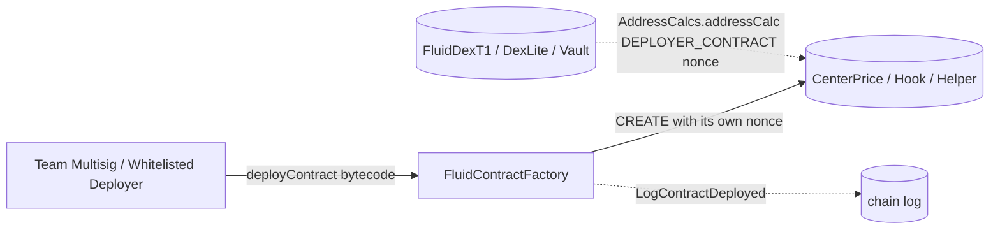

# Deployer (`FluidContractFactory`) — SPEC

## 0. Gas-optimisation tier

**Cold path.** Sub-contract deployment is a one-time / governance-window action. Extra `require`s on deploy parameters are welcome; clarity wins.

Security always wins.

## 1. Purpose

A minimal, deterministic **sub-contract deployer** used to deploy small "configurable" helper contracts — primarily **center-price contracts** (DEX pools, DEX Lite, smart lending) and **hook / rebalancer helpers** (vaults) — so that the referencing protocol only needs to store a **30-bit nonce** instead of a 160-bit address.

The referencing protocol recomputes the real address on demand with `AddressCalcs.addressCalc(DEPLOYER, nonce)` (standard CREATE-RLP formula over `(deployer, nonce)`). This saves ~130 bits of packed storage per reference slot on the hot path of DEX and vault reads.

Implemented as one thin contract plus its interface:

| Contract | File | Role |
| --- | --- | --- |
| `FluidContractFactory` | `main.sol` | Single owner + whitelisted deployers; emits `create`-based deterministic sub-contracts. |
| `IFluidContractFactory` | `interface.sol` | External interface used by scripts / tooling. |

This is **not** the factory that deploys DEX pools / vaults / fTokens — those are separate (`FluidDexFactory`, `FluidVaultFactory`, `FluidLendingFactory`). `FluidContractFactory` is orthogonal: it is a **storage-compression aid** for the configurable leaf contracts those protocols point to.

## 2. Architecture & Data Flow

Flow:

1. A privileged off-chain caller (multisig or an allowanced bot) submits a creation bytecode blob to `deployContract(bytes)`.
2. The factory post-increments its own `totalContracts` nonce, computes the expected CREATE address with `AddressCalcs.addressCalc(address(this), nonce)`, performs the CREATE in inline assembly, and reverts if the actual deployment address does not match the predicted one.
3. Protocol contracts (DEX / Vault / DexLite / SmartLending / DexFeeHandler / Oracle) store only the **nonce** in packed state (e.g. bits 92–121 of `vaultVariables2`, bits of `dexVariables2`, etc.) and reconstruct the address on every read using `AddressCalcs` and the immutable `DEPLOYER_CONTRACT` pointer.

## 3. External Interactions

- **Inbound** — called only by privileged deployers (see §4). No protocol contract ever calls `FluidContractFactory` at runtime.
- **Outbound** — performs raw `CREATE` of arbitrary bytecode. The factory itself does not call any other Fluid contract.
- **Referenced (read-only) by** — the following protocol contracts hold `FluidContractFactory` as an **immutable** and resolve sub-contract addresses from it via `AddressCalcs`:
  - DEX T1 — `contracts/protocols/dex/poolT1/coreModule/{core/main.sol,core/shift.sol,helpers/coreHelpers.sol,adminModule/main.sol,immutableVariables.sol}` (center price).
  - DEX Lite — `contracts/protocols/dexLite/{core/main.sol,core/helpers.sol,adminModule/main.sol,adminModule/helpers.sol,other/immutableVariables.sol}` (center price).
  - Vault T1/T2/T3/T4 — `contracts/protocols/vault/vaultTypesCommon/coreModule/{main.sol,mainOperate.sol,constantVariables.sol}`, `vault/factory/ownerWrapper.sol` (rebalancer / oracle hook).
  - DEX Fee Handler — `contracts/config/dexFeeHandler/main.sol` (center price).
  - Periphery — `contracts/periphery/resolvers/dex/{variables.sol,main.sol}`, `contracts/periphery/resolvers/dexLite/{helpers.sol,main.sol,immutableVariables.sol}`.
  - Deployment logic (not for prod) — `contracts/protocols/vault/factory/deploymentLogics/vaultT1Logic_not_for_prod.sol`.
- **Not whitelisted** as a deployer on `FluidDexFactory` / `FluidVaultFactory` / `FluidLendingFactory` — those have their own independent `updateDeployer(addr, bool)` allow-lists (`isDeployer`). `FluidContractFactory` is an unrelated system and is never granted those roles.

## 4. Roles & Access Control

`FluidContractFactory` uses Solmate `Owned` (single-owner) plus a per-address **allowance counter**.

| Role | How set | Can call |
| --- | --- | --- |
| **Owner** | `Owned.owner` — constructor param, mutable via `transferOwnership`. On mainnet this is the team multisig (`0x4F6F977aCDD1177DCD81aB83074855EcB9C2D49e`). | `updateDeployer`, `transferOwnership`, **unlimited** `deployContract` (does not consume allowance). |
| **Whitelisted deployer** | `deployer[addr] = count_` set by owner via `updateDeployer`. | `deployContract` — **one deployment consumes one unit of allowance**. When allowance reaches zero, the next call reverts via `uint16` underflow in `deployer[msg.sender] -= 1`. |
| Anyone else | — | Nothing. `deployContract` reverts with a `uint16` underflow as above. |

Notes:

- Allowance is a plain **`uint16` counter** (max 65_535 per deployer), set by overwrite — `updateDeployer(addr, newCount)` **replaces** the prior count rather than incrementing it.
- The underflow check is **by design** (no explicit allow/deny flag; zero count == not allowed).
- There is no "pause" or "emergency stop" — owner can revoke by `updateDeployer(addr, 0)`.

## 5. Storage Layout

| Slot | Variable | Type | Meaning |
| --- | --- | --- | --- |
| 0 | `owner` | `address` | Solmate `Owned` owner. |
| 1 | `deployer` | `mapping(address => uint16)` | Remaining deployment allowance per caller. Owner is not tracked here. |
| 2 | `totalContracts` | `uint256` | Monotonically increasing nonce. **Equal to the nonce of the most recent deployment** after a successful call. First successful deployment has nonce `1`. |

No immutables. No re-initialisation hook. No proxy — this is a non-upgradeable contract.

## 6. Capabilities

`FluidContractFactory` exposes one primary capability:

### 6.1 `deployContract(bytes calldata contractCode_) → address contractAddress_`

Deploys arbitrary creation bytecode via `CREATE` and returns the deterministic address.

Flow:

1. If caller is not owner: `deployer[caller] -= 1` (reverts via `uint16` underflow if zero / not whitelisted).
2. `nonce_ = ++totalContracts` (first ever deployment → nonce `1`; nonce `0` is reserved as "unset").
3. Predict address: `contractAddress_ = AddressCalcs.addressCalc(address(this), nonce_)`.
4. Deploy: `address_ := create(0, data, len)` (no ETH forwarded).
5. Reverts with `FluidContractFactory__InvalidOperation()` if:
   - bytecode is empty, **or**
   - CREATE returned `address(0)` (bytecode reverted in constructor), **or**
   - predicted address ≠ actual deployment address (e.g. the factory's actual transaction nonce diverged from `totalContracts`, which must never happen under normal operation; see §10).
6. Emits `LogContractDeployed(addr, nonce)`.

### 6.2 `getContractAddress(uint256 nonce_) → address` (view)

Pure-ish helper: returns `AddressCalcs.addressCalc(address(this), nonce_)`. Used both on-chain (by DEX/Vault/etc.) and off-chain (scripts, resolvers, tooling) to recover the address of a previously-deployed sub-contract from only the stored nonce.

Nonce semantics:

- `nonce == 0` → returns `address(0)` (used by protocols as the "no center price / no hook configured" sentinel).
- `nonce > 0` → corresponds to the `nonce`-th contract ever deployed by this factory.

## 7. Admin Methods

### Owner-only

| Method | Behaviour |
| --- | --- |
| `updateDeployer(address deployer_, uint16 count_)` | Overwrites remaining allowance for `deployer_` to `count_`. Emits `LogUpdateDeployer`. Pass `0` to revoke. |
| `transferOwnership(address newOwner)` (Solmate) | Transfers ownership. Emits `OwnershipTransferred`. Reverts with `"UNAUTHORIZED"` if caller is not current owner. |

No setter for `totalContracts`, no way to skip / rewind the nonce, no batch admin.

## 8. Events

| Event | Emitted when |
| --- | --- |
| `LogContractDeployed(address indexed addr, uint256 indexed nonce)` | Successful `deployContract`. |
| `LogUpdateDeployer(address indexed deployer, uint16 indexed count)` | Owner adjusts a deployer's allowance. |
| `OwnershipTransferred(address indexed user, address indexed newOwner)` (Solmate) | Constructor and `transferOwnership`. |

## 9. Errors

| Error | When |
| --- | --- |
| `FluidContractFactory__InvalidOperation()` | Empty creation bytecode, CREATE returned `address(0)`, or actual deployment address ≠ predicted. |
| `"UNAUTHORIZED"` (Solmate `Owned`) | Non-owner calls `updateDeployer` or `transferOwnership`. |
| Arithmetic underflow (Solidity 0.8 default) | Non-owner calls `deployContract` with zero remaining allowance. Surfaces as `Panic(0x11)`. |

There is no custom error for insufficient allowance — the underflow is the gate.

## 10. Invariants & Safety Notes

- **Deterministic address mapping.** For any `n ∈ [1, totalContracts]`, `getContractAddress(n)` returns the address deployed at step `n`. The CREATE-address formula depends only on `(factory address, transaction nonce)`, so the factory's account nonce must always equal `totalContracts` after every successful call. This holds because:
  - the factory performs exactly one `CREATE` per successful `deployContract`,
  - it performs no other contract-creating operations,
  - and the mismatch check in step 5 of §6.1 aborts the transaction if invariants ever diverge.
- **Nonce never resets, never skips.** `totalContracts` is `uint256` and monotone; revoking / re-whitelisting a deployer does not affect it. A failed deployment reverts and does **not** consume a nonce.
- **Nonce `0` is reserved** as the "unset" sentinel in protocol storage. `AddressCalcs` explicitly short-circuits `nonce == 0` to `address(0)`.
- **Owner is unrate-limited.** The owner can deploy unbounded sub-contracts without consuming an allowance; this is intentional for emergency redeploys.
- **Whitelist is by overwrite, not increment.** `updateDeployer(addr, 10)` sets allowance to 10 — it does not add 10 to the existing balance. Raise this carefully when topping up operators.
- **No ETH / tokens held.** `deployContract` forwards `0` ETH into CREATE. The contract has no receive/fallback and holds no balances; it therefore needs no `rescueTokens` path.
- **Bytecode is not validated.** The factory will deploy any bytecode the caller submits. Constructor-reverting bytecode is caught (address == 0), but logically-malicious bytecode is not. Trust is pushed entirely onto the **allowance list**: only governance should whitelist deployers, and only for narrow purposes (e.g. a bot that deploys a pre-audited center-price template).
- **Deployment cost cap.** A single deployer is capped at `type(uint16).max = 65_535` deployments between top-ups. Global deployments are bounded by `uint256` (effectively unbounded).
- **Storage savings rationale.** A nonce of ≤ 30 bits covers `2^30 ≈ 1.07 B` deployments, well beyond any realistic protocol lifetime. That is why DEX and vault state pack the pointer as 19–30 bits instead of a full 160-bit address.

## 11. Trust Model

- **Root of trust:** the owner (team multisig on production deployments). Compromise of the owner ⇒ ability to (a) deploy arbitrary bytecode and (b) whitelist arbitrary deployers. This does **not** directly compromise protocol state, because protocols pin specific nonces in their own governed storage — a malicious new deployment at nonce `N+1` is only dangerous if a protocol admin subsequently points at it.
- **Whitelisted deployers** are trusted for **liveness, not safety**: they can only deploy at the *next* nonce, but nothing they deploy affects existing protocol references. An operator bot with a large allowance cannot rewrite a center-price contract that is already pointed to by a live DEX; it can only create new ones.
- **No atomic link** between a `deployContract` call and a protocol accepting the result. The typical flow is: (1) deployer deploys the helper, (2) multisig calls the protocol's admin to `updateCenterPriceAddress(nonce)` / equivalent. Step 2 is where the real authorisation lives.
- **Owner transfer is single-tx.** There is no two-step accept pattern in Solmate `Owned`. Governance change procedures should therefore include a confirmation read of `owner()` after transfer.

## 12. Deployment / Audit Notes

- **Deployed address (mainnet v1.0.0):** `0x4EC7b668BAF70d4A4b0FC7941a7708A07b6d45Be`, deployed via CREATE2 from the canonical deterministic deployer `0x4e59…956C`, constructor arg `owner_ = 0x4F6F977aCDD1177DCD81aB83074855EcB9C2D49e` (team multisig). See `deployments/mainnet/v1_0_0/DeployerFactory.json`.
- **Per-chain deployments** live under `deployments/<chain>/DeployerFactory.json` (and the `v1_0_0` subfolder); each chain maintains its own independent `totalContracts` counter, so nonces are **not** cross-chain consistent even if factory addresses are.
- **Post-deploy steps:**
  1. Verify `owner() == team multisig`.
  2. From multisig, `updateDeployer(operatorBot, N)` for each operator / script that needs to deploy center prices or hooks.
  3. Wire the factory address into every protocol that needs to resolve nonces — it is constructor-immutable in those protocols, so getting this wrong requires a full redeploy of the consumer.
- **Upgrade path:** none in-place. A new `FluidContractFactory` means protocols that need sub-contracts from it must be redeployed with the new immutable pointer — existing nonces from the old factory remain valid under their original pointer.
- **Audit focus:**
  - The predicted-vs-actual address check (`contractAddress_ != _deploy(contractCode_)`) is the linchpin of the storage-compression scheme; any code path that lets the factory's account nonce drift from `totalContracts` would silently poison future reads. Currently the only CREATE path is inside `deployContract` itself — no external `new X(...)` calls, no `delegatecall` that could emit CREATEs from this address.
  - `AddressCalcs` correctness up through nonce ranges 0x00–0xffffffff is unit-testable and has been stable since v1.0.0 (library frozen, see `contracts/libraries/addressCalcs.sol`).
  - Solmate `Owned` is used directly — any audit concerns about single-step ownership transfer apply here equally.
