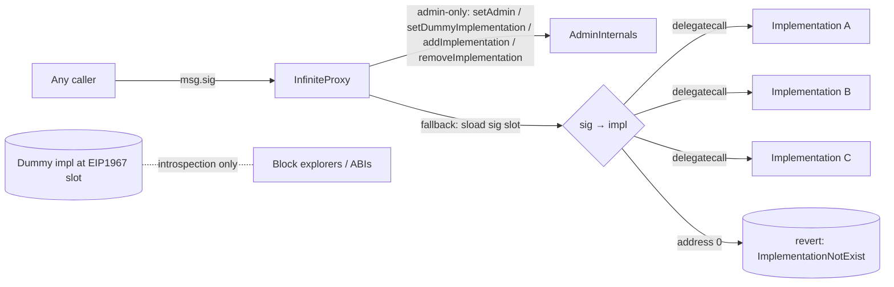

# InfiniteProxy — SPEC

## 0. Gas-optimisation tier

**Hot path (dispatch only).** The `fallback` selector → implementation lookup is on every single call into every Fluid protocol. Do not add branches or checks to the dispatch path.

**Cold path (admin + rollback module).** Upgrade / replace / rollback governance methods are called once per governance window. Extra `require`s + events welcome.

Security always wins.

## 1. Purpose

Fluid's upgrade substrate: a single proxy contract that routes every incoming call to one of many implementation contracts based on the 4-byte function selector. Functions the same way as an EIP-2535 "Diamond" but with a smaller, custom storage layout and no per-implementation facet struct — this is the Instadapp [infinite-proxy](https://github.com/Instadapp/infinite-proxy) pattern.

Every protocol-layer entry point in Fluid — **Liquidity**, **DEX**, **DexLite**, **Vault factory**, **DEX factory**, **Smart Lending**, **Flashloan**, **stETH protocol**, etc. — sits behind an infinite proxy. Governance (the admin) can add / remove / replace implementation contracts and their bound selectors without ever migrating storage.

An accompanying **rollback module** gives the team multisig a bounded (7-day) safety net to revert a freshly upgraded implementation back to its previous one.

Contents of `contracts/infiniteProxy/`:

| File | Role |
| --- | --- |
| `proxy.sol` | `CoreInternals`, `AdminInternals`, `Proxy` — the base abstract proxy. |
| `events.sol` | Upgrade events (`LogSetAdmin`, `LogSetDummyImplementation`, `LogSetImplementation`, `LogRemoveImplementation`). |
| `error.sol` | `FluidInfiniteProxyError(uint256)`. |
| `errorTypes.sol` | Error-ID constants for proxy + rollback. |
| `interfaces/iProxy.sol` | External interface (`IProxy`). |
| `rollbackModule/main.sol` | `InfiniteProxyRollbackModule` — optional governance-plugged module implementing rollback of implementation(s) and dummy impl within a 7-day window. |

## 2. Architecture

Dispatch is **pure delegatecall**. For every external call:

1. `msg.sig` is combined with `_SIG_SLOT_BASE` to yield a storage slot.
2. That slot is `sload`-ed to get the implementation address.
3. If non-zero, the call is `delegatecall`-ed in assembly with the full calldata; the return data of the delegatee is returned as-is.
4. If zero, the proxy reverts with `FluidInfiniteProxyError(InfiniteProxy__ImplementationNotExist)`.

Admin entry points (`setAdmin`, `setDummyImplementation`, `addImplementation`, `removeImplementation`) are defined **directly on the proxy contract** (inherited from `AdminInternals`). They short-circuit the fallback because Solidity's selector table matches them before the fallback is reached. This is why there is no "admin module" behind the proxy — admin authority lives at the proxy level itself.

The **rollback module** is deployed as a plain implementation and wired in by governance with `addImplementation(rollbackModule, [selectors])`, giving the team multisig the ability to call `rollbackImplementation` / `rollbackDummyImplementation` on the same proxy address.

## 3. External Interactions

- **Outbound.** The proxy only `delegatecall`s into mapped implementation contracts in its fallback. It holds all mutable state in its own storage; implementations access that state by executing in the proxy's context.
- **Inbound.** Anyone can call any mapped selector. Authorization for each selector is the implementation's job. The proxy itself gates only its own four admin functions with `onlyAdmin`.
- **ETH receive.** A `receive()` function accepts raw ETH with no logic (EVM guarantees no calldata on plain transfers). Calldata-bearing value transfers route through the fallback like any other call.
- **Storage introspection.** `readFromStorage(bytes32)` (inherited from `libraries/StorageRead`) allows off-chain readers to directly `sload` arbitrary slots — heavily used by Fluid resolvers.

## 4. Roles & Access Control

Two roles exist at the proxy level:

| Role | Set by | Powers |
| --- | --- | --- |
| **Admin** | `constructor` → subsequently `setAdmin` | `setAdmin`, `setDummyImplementation`, `addImplementation`, `removeImplementation`. Full upgrade authority. |
| **Team multisig** (rollback module only) | Hard-coded `0x4F6F977aCDD1177DCD81aB83074855EcB9C2D49e` | `rollbackImplementation`, `rollbackDummyImplementation` (if rollback module is wired in). |

Admin-only in `AdminInternals`:

- `onlyAdmin` guard: `require(msg.sender == _getAdmin(), "only-admin")`.
- `setAdmin` uses the same guard, so admin rotation is admin-only.

No ownership renunciation or timelock is built into the proxy itself. Governance timelocks are applied by placing a timelock / multisig as the admin.

The rollback module adds an `onlyMultisig` modifier (hard-coded `TEAM_MULTISIG`). Registration of a rollback candidate is `onlyAdmin`; triggering the rollback is `onlyMultisig`.

## 5. Storage Layout

All state lives at deterministic slots to avoid any struct-layout collisions with implementations.

### Core slots (`proxy.sol`)

| Slot | Content |
| --- | --- |
| `_ADMIN_SLOT = keccak256("eip1967.proxy.admin") - 1` (`0xb531…6103`) | Admin address (EIP-1967 compliant). |
| `_DUMMY_IMPLEMENTATION_SLOT = keccak256("eip1967.proxy.implementation") - 1` (`0x3608…2bbc`) | Dummy implementation address (EIP-1967 compliant) — used only for block-explorer / tooling ABI introspection, **not** for dispatch. |
| `_SIG_SLOT_BASE = 0x0000_0000_3ba1…2bbc` | Base for `sig → implementation` map: the EIP-1967 implementation slot with its first 4 bytes zeroed. `slot = _SIG_SLOT_BASE \| sig` yields a unique per-selector slot whose collision with the dummy-impl slot is impossible (dummy slot's top 4 bytes `0x3608_94a1…` are non-zero, selectors occupy the same 4 bytes). |
| `keccak256(abi.encode("eip1967.proxy.implementation", impl))` | `bytes4[]` of selectors bound to `impl` (reverse map, stored as a `SigsSlot` struct). |

### Rollback slots (`rollbackModule/main.sol`)

| Slot | Content |
| --- | --- |
| `_ROLLBACK_DUMMY_IMPLEMENTATION_SLOT = keccak256("eip1967.proxy.rollback") - 1` (`0x4910…9143`) | Packed: lower 20 bytes = previous dummy impl, upper 5 bytes = registration timestamp (`uint40`). |
| `_ROLLBACK_SIG_SLOT_BASE` | Sibling base: same slot with first 4 bytes zeroed, used for rollback `sig → impl` map. |
| `keccak256(abi.encode("eip1967.proxy.rollback", impl))` | `RollbackSigsSlot { uint40 rollbackRegisterTimestamp; address replacesImplementation; bytes4[] sigs; }`. |

Constants: `TEAM_MULTISIG = 0x4F6F977aCDD1177DCD81aB83074855EcB9C2D49e`, `ROLLBACK_PERIOD = 7 days`.

### Invariant: selector and implementation maps are kept in lock-step

`_setImplementationSigs(impl, sigs)` writes:

1. The reverse map `impl → sigs[]`, requiring `sigs.length > 0` and `sigs[impl]` previously empty ("implementation-already-exist").
2. For each sig: `sig → impl`, requiring the sig slot to be currently zero ("sig-already-exist").

`_removeImplementationSigs(impl)` undoes both in one call: clears every `sig → impl` slot for `sigs[impl]`, then deletes the `impl → sigs[]` array.

Selectors are therefore **one-to-one** with implementations: a given selector is bound to at most one implementation at any moment, and replacing a binding requires `removeImplementation(old)` then `addImplementation(new, sigs)`.

## 6. Admin Capabilities

Admin surface (on the proxy itself, from `AdminInternals` + `Proxy`):

| Capability | Method | Notes |
| --- | --- | --- |
| Rotate admin | `setAdmin(newAdmin)` | Reverts on zero address. |
| Update tooling-facing ABI pointer | `setDummyImplementation(newDummy)` | Reverts on zero address. Does **not** affect dispatch. |
| Register an implementation | `addImplementation(impl, sigs[])` | Fails if the impl already has sigs registered, if any sig is already bound, or if `sigs` is empty. |
| Deregister an implementation | `removeImplementation(impl)` | Fails if impl has no sigs registered. Clears all sig bindings. |
| Inspect admin / dummy | `getAdmin()`, `getDummyImplementation()` | |
| Inspect selector map | `getImplementationSigs(impl) → bytes4[]`, `getSigsImplementation(sig) → address` | |
| Raw storage read | `readFromStorage(bytes32)` | `public view`, inherited. |

**"Replace an implementation" is a two-step operation**: the admin calls `removeImplementation(old)` then `addImplementation(new, sigs)`. There is no atomic swap.

Rollback module (additional admin & multisig capabilities, once wired in):

| Capability | Method | Caller |
| --- | --- | --- |
| Snapshot the current dummy impl as a rollback candidate | `registerRollbackDummyImplementation()` | Admin |
| Restore the snapshotted dummy impl | `rollbackDummyImplementation()` | Multisig, within 7 days |
| Snapshot an implementation+sigs before replacing it | `registerRollbackImplementation(oldImpl, newImpl)` | Admin, call **before** `addImplementation(newImpl, …)` |
| Swap the currently-active `newImpl` back to `oldImpl` | `rollbackImplementation(oldImpl, newImpl)` | Multisig, within 7 days |
| Reap expired rollback storage | `cleanupExpiredRollbackImplementation(impl)` | Anyone, after 7-day window |
| Read rollback state | `getRollbackForImplementation(impl)`, `getRollbackDummyImplementation()` | Anyone |

## 7. User-Facing Behaviour

- **Mapped selector.** Arbitrary calldata flows through the fallback into `delegatecall(implementation, calldata)`. Return data is forwarded verbatim; revert data is bubbled up verbatim.
- **Unmapped selector.** Revert with `FluidInfiniteProxyError(50001)` (`InfiniteProxy__ImplementationNotExist`). No silent fallback to the dummy implementation.
- **Plain ETH transfer** (`receive()`). Accepted without logic. Users of protocols that require ETH routing should always use a `payable` selector, not raw `send`.
- **Admin selectors colliding with module selectors.** The four admin selectors (`setAdmin`, `setDummyImplementation`, `addImplementation`, `removeImplementation`) and the five view selectors (`getAdmin`, `getDummyImplementation`, `getImplementationSigs`, `getSigsImplementation`, `readFromStorage`) are defined on the proxy itself and therefore **cannot be overridden** by any implementation — the proxy's own dispatch table matches first. Implementation authors MUST NOT define a function with any of these selectors.

The **dummy implementation** exists solely so that Etherscan, wallets, and generic EIP-1967-aware tooling can fetch "the ABI of this proxy" by reading the EIP-1967 implementation slot. In practice each Fluid proxy is paired with a `*DummyImpl.sol` file that declares every function signature exposed by the active implementations. It is not part of the runtime dispatch path.

## 8. Events

Upgrade / admin:

- `LogSetAdmin(oldAdmin, newAdmin)` — on `setAdmin` (and in the constructor).
- `LogSetDummyImplementation(oldDummy, newDummy)` — on `setDummyImplementation` (and in the constructor).
- `LogSetImplementation(implementation, sigs[])` — on `addImplementation`.
- `LogRemoveImplementation(implementation)` — on `removeImplementation`.

Rollback module:

- `LogRegisterRollbackDummyImplementation(rollbackDummy, timestamp)`
- `LogRollbackDummyImplementation(restoredDummy)`
- `LogRegisterRollbackImplementation(rollbackImpl, newImpl, sigs[])`
- `LogRollbackImplementation(rollbackImpl, replacedImpl, sigs[])`
- `LogCleanupExpiredRollbackImplementation(impl)`

No event is emitted on fallback dispatch.

## 9. Errors

Raised as `FluidInfiniteProxyError(errorId)` (see `error.sol` + `errorTypes.sol`):

| ID | Name | When |
| --- | --- | --- |
| 50001 | `InfiniteProxy__ImplementationNotExist` | Fallback invoked with a selector that is not mapped. |
| 50010 | `InfiniteProxyRollback__Unauthorized` | Rollback method called by non-admin / non-multisig. |
| 50011 | `InfiniteProxyRollback__Expired` | Rollback attempted outside the 7-day window. |
| 50012 | `InfiniteProxyRollback__NotRegistered` | Rollback data missing, or `newImplementation` arg does not match registered pairing. |
| 50013 | `InfiniteProxyRollback__NoRollbackSigs` | Implementation has no sigs to register as rollback. |
| 50014 | `InfiniteProxyRollback__AlreadyExists` | Rollback snapshot already registered and still active. |
| 50015 | `InfiniteProxyRollback__SigAlreadyExists` | Rollback sig slot already populated (stale data). |
| 50016 | `InfiniteProxyRollback__SigSlotCollision` | A selector collides with the rollback dummy-impl slot literal. |
| 50017 | `InfiniteProxyRollback__NotExpired` | Cleanup attempted before the 7-day window elapsed. |
| 50018 | `InfiniteProxyRollback__ZeroDummyImplementation` | Registering rollback dummy while the active dummy is zero. |
| 50019 | `InfiniteProxyRollback__NotAllowed` | `getRollbackForImplementation` queried with the rollback dummy impl address. |

Legacy `require` strings (from base `proxy.sol`): `"only-admin"`, `"no-sigs"`, `"implementation-already-exist"`, `"sig-already-exist"`, `"implementation-not-exist"`, `"ERC1967: new admin is the zero address"`, `"ERC1967: new implementation is the zero address"`.

## 10. Invariants & Safety Notes

- **Admin is root.** The admin of each infinite proxy can arbitrarily add, remove, and replace any implementation + selectors. Users must trust the admin exactly as much as they trust governance of the wrapping protocol (Liquidity, DEX, …).
- **Selector bijection.** A selector maps to at most one implementation; an implementation can own many selectors. Re-binding requires an explicit remove + add. The `require` checks in `_setImplementationSigs` prevent silent overwrites.
- **Empty selector reverts, never silently falls through.** There is no implicit delegation to the dummy implementation — unmapped calls revert. This is intentional: it prevents accidental "phantom" selectors from being routed anywhere.
- **Selector-slot collision with EIP-1967 slots.** Safe by construction: `_SIG_SLOT_BASE` zeroes the first 4 bytes of the EIP-1967 implementation slot, while the real EIP-1967 slots have non-zero top 4 bytes. The `_ADMIN_SLOT` has a different base entirely. No selector `sig` can therefore map to the admin / dummy-impl / rollback-dummy slots. The rollback module additionally explicitly checks `sigSlot == _ROLLBACK_DUMMY_IMPLEMENTATION_SLOT` for defence-in-depth.
- **Selector collision with proxy's own admin selectors.** The proxy defines `setAdmin`, `setDummyImplementation`, `addImplementation`, `removeImplementation`, `getAdmin`, `getDummyImplementation`, `getImplementationSigs`, `getSigsImplementation`, `readFromStorage`. These always match before the fallback and can never be delegated. Implementations that shadow these selectors will be silently shadowed by the proxy.
- **Delegatecall context.** Every implementation runs in the proxy's storage context. Implementations must therefore share a compatible storage layout and must never collide with the four fixed slots above or with the sig/impl derivation scheme.
- **No pause / kill switch.** The proxy has no way to freeze dispatch short of removing every implementation via `removeImplementation`. Emergency pause is implemented at the **module** level (e.g. `FluidPauseAuth`) — not here.
- **Constructor wiring is mandatory.** The constructor calls `_setAdmin` and `_setDummyImplementation`, both of which revert on zero address. A proxy cannot be deployed with a null admin or null dummy impl.
- **Rollback is one-upgrade-at-a-time.** The rollback storage for a given implementation is a single slot-struct. Performing a second upgrade while a prior rollback window is still active is out of scope — in practice upgrades occur every few months, far outside the 7-day window.
- **Rollback does not revert storage mutations** made by the newer implementation during its active window. It only re-points selectors back to the prior code. Governance must design implementations accordingly.

## 11. Trust Model

- **Proxy admin = governance.** For all live Fluid proxies the admin is the Fluid governance timelock / team multisig. A compromised admin has full power to brick the protocol, drain funds by installing a malicious implementation, or rotate governance. This is the same trust surface as any upgradable Fluid contract — the infinite proxy does not widen it beyond a standard upgradable proxy; it merely gives governance finer granularity over selector-level routing.
- **Rollback module = time-bounded multisig safety lever.** The team multisig cannot initiate an upgrade, but **can** revert an upgrade that the admin registered for rollback, within 7 days. This separates emergency-response authority (multisig, fast, narrow) from upgrade authority (admin/timelock, deliberate, broad).
- **Dummy implementation is non-privileged.** It is off the dispatch path; pointing it at a malicious contract has no on-chain effect — only off-chain tooling is affected.
- **Implementations self-authorize.** The proxy does no auth on the delegated call. Each implementation enforces its own role checks (e.g. Liquidity's `AuthModule`, DEX's `_check`…). Missing auth in an implementation is not something the proxy can catch.

## 12. Deployment & Audit Notes

### Deployment

1. Deploy a `DummyImpl` contract declaring every selector the new proxy will eventually expose (for Etherscan / ABI introspection).
2. Deploy each logic implementation contract (e.g. `FluidLiquidityUserModule`, `FluidLiquidityAdminModule`, …).
3. Deploy the concrete proxy contract (e.g. `FluidLiquidityProxy(admin, dummyImpl)`) — a one-line subclass of `Proxy` such as `contracts/liquidity/proxy.sol`.
4. From `admin`, call `addImplementation(impl, sigs[])` once per logic contract, passing the exhaustive selector list for each.
5. (Optional) Deploy `InfiniteProxyRollbackModule` and `addImplementation` it with its five rollback selectors, granting the team multisig its rollback path.
6. (Optional) Rotate `admin` to a timelock / governance multisig via `setAdmin`.

### Operational upgrade flow

1. Build the new implementation. Ensure storage compatibility with the active proxy.
2. (Optional, if rollback is wired) From admin: `registerRollbackImplementation(oldImpl, newImpl)` **before** the swap.
3. From admin: `removeImplementation(oldImpl)`.
4. From admin: `addImplementation(newImpl, sigs[])`.
5. Within 7 days, if the new impl is faulty, multisig calls `rollbackImplementation(oldImpl, newImpl)` to restore the previous binding.
6. After 7 days, anyone MAY call `cleanupExpiredRollbackImplementation(oldImpl)` to reap rollback storage.

### Audit focus

- Verify new implementations do **not** define selectors colliding with proxy-level selectors (`setAdmin`, `setDummyImplementation`, `addImplementation`, `removeImplementation`, `getAdmin`, `getDummyImplementation`, `getImplementationSigs`, `getSigsImplementation`, `readFromStorage`).
- Verify no two implementations registered on the same proxy share any selector.
- Verify the implementation's storage layout is compatible with every prior implementation that has ever run on the same proxy (no removed/reordered state variables that alter downstream slot positions).
- Verify that auth checks in each implementation are complete — the proxy provides no default auth.
- Verify that when `registerRollbackImplementation` is used, the caller's `newImplementation_` argument matches the implementation subsequently registered via `addImplementation`; a mismatch silently disarms rollback.
- For multi-chain deploys, verify the admin on each chain matches the intended governance address; the proxy has no cross-chain enforcement.
