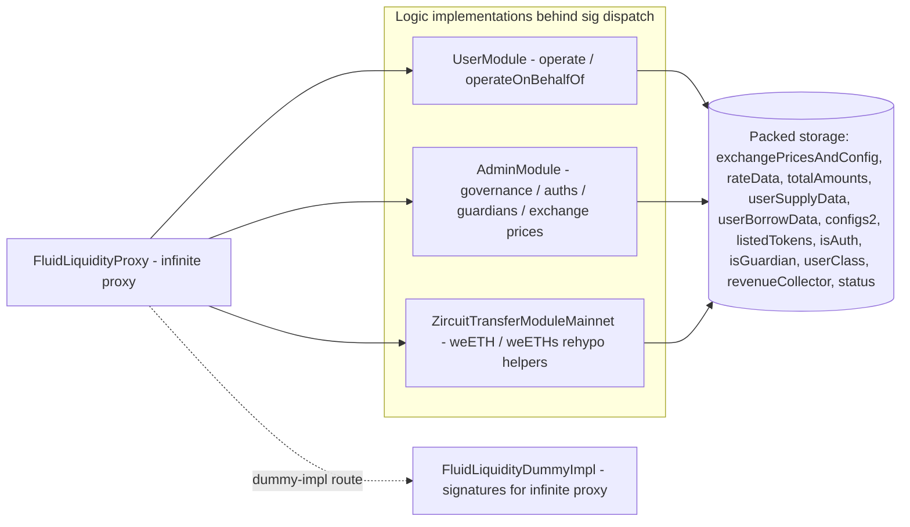

# Liquidity Layer — SPEC

## 0. Gas-optimisation tier

**Hot path.** Liquidity is the single custody + bookkeeping core hit on _every_ user-protocol interaction (vault operate, DEX swap/deposit/withdraw, lending mint/redeem, stETH queue). Every `_operate` path must stay gas-tight: prefer bit-packed storage, cache storage reads into memory, avoid redundant SLOADs, and do not add runtime checks unless they block a reachable safety hole. The admin-module surface (`AdminModule`, `ZircuitTransferModule`) is a separate **cold path** — extra defensive `require`s / events are welcome there.

Security always wins: if a check costs gas but closes a reachable hole in Liquidity's trust model, add it.

## 1. Purpose

Fluid Liquidity is the single core contract that custodies all supplied funds and exposes a unified deposit / withdraw / borrow / payback surface (`operate`) to the allow-listed protocols built on top (Lending / fToken, Vault, DEX, DexLite, stETH queue, Flashloan, etc.). End users never talk to Liquidity directly: a "user" in this contract is always another Fluid protocol address.

Liquidity also owns all global bookkeeping that the protocols read back through `LiquidityCalcs` / resolver paths: per-token rate curves, exchange prices, utilization, supply/borrow ratios, per-user supply/borrow positions and per-user withdrawal / debt-ceiling limits.

See [docs/docs.md](../../docs/docs.md) for the companion technical overview (raw vs normal amounts, BigMath, native-token sentinel, token listing flow, worked-through examples of withdrawal and borrow limits).

## 2. Architecture

Key contracts (co-located in `contracts/liquidity/`):

- `proxy.sol` — [FluidLiquidityProxy](./proxy.sol), the Instadapp infinite proxy. All state lives here. See [contracts/infiniteProxy/SPEC.md](../infiniteProxy/SPEC.md).
- `dummyImpl.sol` — [FluidLiquidityDummyImpl](./dummyImpl.sol), empty function stubs enabling `IFluidLiquidityLogic` selectors on the proxy so wallets / tooling can introspect.
- `userModule/main.sol` — `FluidLiquidityUserModule`: `operate` + `operateOnBehalfOf` core user surface.
- `adminModule/main.sol` — `FluidLiquidityAdminModule` (compositionally `GovernanceModule` + `AuthModule` + `GuardianModule`): all config / role / rate-data / pause / revenue surface.
- `adminModule/mainMainnet.sol`, `adminModule/mainOthers.sol` — thin subclasses that wire `CommonHelpersMainnet` (Zircuit rehypothecation hooks) vs `CommonHelpersOthers` (no-op hooks) into the admin module on mainnet vs other chains.
- `userModule/mainMainnet.sol`, `userModule/mainOthers.sol` — same pattern for the user module.
- `common/variables.sol` — full storage layout (`ConstantVariables` + `Variables`).
- `common/helpers.sol` — `ReentrancyGuard`, governance address loader, and abstract `_afterTransferIn` / `_preTransferOut` / `_getExternalBalances` hooks.
- `common/helpersMainnet.sol` — mainnet rehypothecation hook implementation (weETH + weETHs into Zircuit Ztaking Pool).
- `common/helpersOthers.sol` — no-op hook implementation for non-mainnet chains.
- `zircuitTransferModuleMainnet/main.sol` — `FluidLiquidityZircuitTransferModuleMainnet`: governance / guardian delegatecall helpers to bulk-deposit / bulk-withdraw weETH + weETHs into / out of Zircuit and toggle the approvals.
- `interfaces/iLiquidity.sol` — `IFluidLiquidityAdmin`, `IFluidLiquidityLogic`, `IFluidLiquidity`.
- `error.sol` / `errorTypes.sol` — `FluidLiquidityError(uint256)` with numeric error codes (see §10).
- `adminModule/structs.sol` — public config structs (`RateDataV1Params`, `RateDataV2Params`, `TokenConfig`, `UserSupplyConfig`, `UserBorrowConfig`, plus `AddressBool`, `AddressUint256`).
- `adminModule/events.sol`, `userModule/events.sol` — event definitions (see §9).

The infinite proxy dispatches each selector to the appropriate implementation address; logic contracts themselves boot `_status = REENTRANCY_ENTERED` in their constructor so direct calls revert — everything must come via `delegatecall` from the proxy.

## 3. External Interactions

- **Callers into Liquidity** (the "users" in this contract's mental model):
  - fToken contracts (see [contracts/protocols/lending/fToken/SPEC.md](../protocols/lending/fToken/SPEC.md)) call `operate(token, ±amount, 0, …)`.
  - Vault contracts (see [contracts/protocols/vault/SPEC.md](../protocols/vault/SPEC.md)) call `operate(token, ±supply, ±borrow, …)` to move collateral + debt atomically.
  - DEX / DexLite pool contracts (see [contracts/protocols/dex/SPEC.md](../protocols/dex/SPEC.md), [contracts/protocols/dexLite/SPEC.md](../protocols/dexLite/SPEC.md)) call `operate` with `SKIP_TRANSFERS` / `NET_TRANSFERS` sentinels when a single tx has both-sided flow.
  - stETH queue (see [contracts/protocols/steth/SPEC.md](../protocols/steth/SPEC.md)) calls `operate` via its own path (ETH in / stETH queued out).
  - `operateOnBehalfOf` is restricted to auths / governance and is used by config handlers (e.g. `PaybackOnBehalfAuth`, see [contracts/config/SPEC.md](../config/SPEC.md)).
- **Callbacks from Liquidity into the calling protocol**:
  - Whenever ERC-20 tokens must be pulled in, `operate` invokes `msg.sender.liquidityCallback(token, amount, callbackData)` (interface `IProtocol`). The protocol is responsible for pushing exactly `amount` tokens to Liquidity during this callback.
  - `msg.value` covers the native-token case (no callback is used to pull native).
- **External non-protocol integrations**:
  - Rehypothecation into Zircuit Ztaking Pool on mainnet (weETH, weETHs only) through `CommonHelpersMainnet._afterTransferIn` / `_preTransferOut` / `_getExternalBalances`.
  - Revenue is swept to a governance-configured `_revenueCollector` contract (see [contracts/reserve/SPEC.md](../reserve/SPEC.md)).
- **Views & resolvers**:
  - No in-module view methods. Integrators and off-chain consumers must read through [contracts/periphery/resolvers/liquidity/SPEC.md](../periphery/resolvers/liquidity/SPEC.md), which applies `LiquidityCalcs` (see [contracts/libraries/SPEC-liquidityCalcs.md](../libraries/SPEC-liquidityCalcs.md)) on top of the packed storage words to produce fresh values.

## 4. Capabilities & Responsibilities

Liquidity does:

- Hold all ERC-20 and native-token liquidity for every Fluid protocol in one shared pool.
- Expose a single packed `operate(token, supplyAmount, borrowAmount, withdrawTo, borrowTo, callbackData)` that performs supply / withdraw and borrow / payback atomically for one token and one user (protocol) position.
- Maintain per-token dual accounting: `with interest` (raw amounts that scale by exchange price) and `interest free` (normal amounts) for both supply and borrow. User config selects one of the two modes per side.
- Derive per-token supply exchange price and borrow exchange price from elapsed time, stored utilization, rate curve (v1 one-kink or v2 two-kink), and configured fee, and write them back only when gas-thresholds demand it.
- Enforce a **withdrawal limit** (for each user/token pair, a floor below which user supply cannot drop in one `operate`) and a **debt ceiling / borrow limit** (a ceiling above which user borrow cannot rise), both with automated expansion / shrinkage and a decay bucket (see §7 `operate` and §11).
- Accept three optimized transfer patterns via `callbackData`: normal (callback pulls tokens in, Liquidity pushes tokens out), `SKIP_TRANSFERS` (no transfers, Liquidity is on the winning side of in/out), `NET_TRANSFERS` (only the net delta moves). These are the DEX-style dual-sided optimizations.
- Provide a privileged `operateOnBehalfOf(onBehalf, …)` for auths / governance that supports deposit and payback **only** (safe-direction operations; see §8).
- Track listed tokens (`_listedTokens`), per-user class (0 = pausable / 1 = not pausable), per-address auth status, per-address guardian status, paused / running global status, token-level pause bit, and user-level pause bits (per side per token).
- Permissionlessly allow anyone to refresh `_exchangePricesAndConfig` for any token via `updateExchangePrices`.
- Sweep the untracked balance (actual contract balance + rehypothecated external balance, minus tracked user supply / borrow) to `_revenueCollector` via `collectRevenue`.

Liquidity does not:

- Know about user accounts, EOAs, or any end-user concept. The only identity it recognizes is the caller (a protocol contract or governance).
- Provide its own view API. Use resolvers.
- Implement its own oracle, collateral factor, or liquidation logic — those live in the Vault protocol on top.
- Auto-propagate pause across protocols. Pause is per-token and per-user (protocol) only. Whole-protocol pause on Liquidity is the global `_status` toggle. Upper-layer proxies (Vault, DEX, …) each have their own independent pause surface.
- Forward non-raw metadata (no per-source revenue ledger; `collectRevenue` sweeps whatever untracked balance exists by design).

## 5. Roles & Access Control

Governance is the proxy admin loaded from the EIP-1967-style `GOVERNANCE_SLOT`. Everything below stacks on top of it.

- **Governance** (single address, proxy admin):
  - Can call every admin-module method (it is implicitly also Auth and Guardian).
  - Can add / remove auths (`updateAuths`), add / remove guardians (`updateGuardians`), set `_revenueCollector` (`updateRevenueCollector`).
  - Can perform the governance-only Zircuit bulk hooks in `zircuitTransferModuleMainnet/main.sol` (`depositZircuitWeETH` / `depositZircuitWeETHs`). Guardians are allowed the **withdraw** side of these (for emergency un-stake).
- **Auths** (`mapping(address => uint256) _isAuth`):
  - Governance is Auth by default. Typical real auths are config-handler contracts in [contracts/config/SPEC.md](../config/SPEC.md) (rate / limits / listing / pause / dex-fee handlers).
  - Can call: `changeStatus`, `updateRateDataV1s`, `updateRateDataV2s`, `updateTokenConfigs`, `updateUserClasses`, `updateUserSupplyConfigs`, `updateUserWithdrawalLimit`, `updateUserBorrowConfigs`, `collectRevenue`, and `operateOnBehalfOf`.
- **Guardians** (`mapping(address => uint256) _isGuardian`):
  - Governance is Guardian by default.
  - Can call: `pauseUser`, `unpauseUser`, `pauseTokens`, `unpauseTokens`, and `withdrawZircuitWeETH` / `withdrawZircuitWeETHs` (emergency unwind of Zircuit rehypothecation).
  - Cannot pause a user whose class is 1. Class 1 is reserved for maximally-trusted protocols. Current deployments keep all protocols at class 0 (pausable by guardians); class 1 is available but not used.
- **User classes** (`_userClass`):
  - Class 0 (default) — guardians can pause via `pauseUser`.
  - Class 1 — guardians cannot pause via `pauseUser` (`pauseTokens` still works and is not class-gated; class 1 is a future promotion path for extremely trusted protocols).
- **Protocol ("user")** (any contract whose address has a configured `_userSupplyData[user][token]` or `_userBorrowData[user][token]`):
  - Can call `operate` to act on its own position (`msg.sender == user`).
  - Cannot call `operateOnBehalfOf`.
- **Permissionless**:
  - `updateExchangePrices(tokens)` — any caller may trigger a storage refresh of exchange prices + rates for any listed token. It is a keeper-friendly entry point and is guarded only by `_checkIsContractOrNativeAddress(token)`.

## 6. Storage Layout

All state lives on the proxy. Numbers below reference slot indices as laid out in [common/variables.sol](./common/variables.sol).

- **Slot 0** — `_revenueCollector` (address; 12 upper bytes empty on purpose).
- **Slot 1** — `_status` (1 = running, 2 = paused; also doubles as the reentrancy guard flag via `REENTRANCY_NOT_ENTERED` / `REENTRANCY_ENTERED`).
- **Slot 2** — `_isAuth` (`mapping(address => uint256)`; only low bit matters).
- **Slot 3** — `_isGuardian` (`mapping(address => uint256)`; only low bit matters).
- **Slot 4** — `_userClass` (`mapping(address => uint256)`; 0 or 1).
- **Slot 5** — `_exchangePricesAndConfig[token]` (packed uint256 per token):
  - bits 0–15 borrow rate (1e2)
  - bits 16–29 fee on interest (1e2)
  - bits 30–43 last stored utilization (1e2; may be >100% due to rounding or revenue cut)
  - bits 44–57 update-on-storage threshold (1e2; max 500 = 5%)
  - bits 58–90 last update timestamp
  - bits 91–154 supply exchange price (1e12)
  - bits 155–218 borrow exchange price (1e12)
  - bit 219 supply ratio inverse flag; bits 220–233 supply ratio (1e2)
  - bit 234 borrow ratio inverse flag; bits 235–248 borrow ratio (1e2)
  - bit 249 `usesConfigs2` flag (signals a second SLOAD is needed for `_configs2`)
  - bits 250–254 reserved
  - bit 255 token-pause flag
- **Slot 6** — `_rateData[token]`: 4-bit version + parameter blob for rate v1 (kink, rates at 0% / kink / max) or v2 (kink1, kink2, rates at 0% / kink1 / kink2 / max). Rates are 16-bit each; `X16` = 65535 (655%).
- **Slot 7** — `_totalAmounts[token]` (4 × 64-bit BigMath 56|8 subfields):
  - supplyRawInterest (raw; multiply by supply exchange price for normal)
  - supplyInterestFree (normal)
  - borrowRawInterest (raw)
  - borrowInterestFree (normal)
- **Slot 8** — `_userSupplyData[user][token]`:
  - bit 0 mode (0 = interest free, 1 = with interest)
  - bits 1–64 user supply (BigMath 56|8; raw if mode=1 else normal)
  - bits 65–128 previous user withdrawal limit (same units)
  - bits 129–161 last triggered timestamp
  - bits 162–175 `expandPercent` (1e2)
  - bits 176–199 `expandDuration` (seconds; max 24 bits)
  - bits 200–217 `baseWithdrawalLimit` (BigMath 10|8)
  - bits 218–243 decay amount (BigMath 18|8)
  - bits 244–253 decay duration in checkpoints (max 1023; each checkpoint ≈ 3.6 s)
  - bit 254 reserved
  - bit 255 user-supply-paused flag
- **Slot 9** — `_userBorrowData[user][token]`:
  - bit 0 mode
  - bits 1–64 user borrow (BigMath 56|8)
  - bits 65–128 previous user debt ceiling
  - bits 129–161 last triggered timestamp
  - bits 162–175 `expandPercent` (1e2)
  - bits 176–199 `expandDuration`
  - bits 200–217 `baseDebtCeiling` (BigMath 10|8)
  - bits 218–235 `maxDebtCeiling` (BigMath 10|8)
  - bits 236–254 reserved
  - bit 255 user-borrow-paused flag
- **Slot 10** — `_listedTokens` (`address[]`; append-only).
- **Slot 11** — `_configs2[token]`:
  - bits 0–13 max utilization (1e2; 10000 = 100% and signals unused/default)
  - bits 14–255 reserved

BigMath encoding: a raw `uint256` is stored as `coefficient | exponent`. `toBigNumber(coefficientSize, exponentSize, roundDir)` packs; `fromBigNumber(bigNum, exponentSize, exponentMask)` unpacks. See [contracts/libraries/SPEC-bigMath.md](../libraries/SPEC-bigMath.md) and [docs/docs.md §BigMath](../../docs/docs.md#bigmath). Rounding conventions used here:

- Supply amounts, base withdrawal / debt limits, withdrawal limit, supply exchange price — round **down**.
- User borrow amount and total borrow amount — round **up**.

## 7. User / Public Methods

### `operate(token, supplyAmount, borrowAmount, withdrawTo, borrowTo, callbackData) → (supplyExchangePrice, borrowExchangePrice)`

- **Caller:** any address `u` for which `_userSupplyData[u][token] != 0` or `_userBorrowData[u][token] != 0` (i.e. a configured protocol for this token). Acts on the caller's own position.
- **Inputs:**
  - `token` — token address; `0xEee…EEeE` sentinel for native token.
  - `supplyAmount` — `int256` (but must fit in `int128`). `> 0` = deposit (pulls tokens in), `< 0` = withdraw, `0` = no supply-side change. `supplyAmount` and `borrowAmount` cannot both be 0.
  - `borrowAmount` — `int256` / `int128` range. `> 0` = borrow, `< 0` = payback, `0` = no borrow-side change.
  - `withdrawTo` — recipient if `supplyAmount < 0`. Must be `!= address(0)` whenever `supplyAmount < 0`.
  - `borrowTo` — recipient if `borrowAmount > 0`. Must be `!= address(0)` whenever `borrowAmount > 0`.
  - `callbackData` — free-form bytes forwarded to `msg.sender.liquidityCallback(token, amountIn, callbackData)` when tokens must be pulled in. Also the transport for the two optimizations below.
- **Edge-case semantics:**
  - `supplyAmount == borrowAmount == 0` → reverts `UserModule__OperateAmountsZero`.
  - `|supplyAmount| > type(int128).max` or same for borrow → reverts `UserModule__OperateAmountOutOfBounds`.
  - `supplyAmount < 0 && withdrawTo == 0` or `borrowAmount > 0 && borrowTo == 0` → reverts `UserModule__ReceiverNotDefined`.
  - `token != native && msg.value > 0` → reverts `UserModule__MsgValueForNonNativeToken`.
  - Operate amount so small (after BigMath rounding) that neither user nor total amount changes → reverts `UserModule__OperateAmountInsufficient`.
  - Operate amount excessive relative to existing total amount (`>10 000×` existing for deposit / borrow, or `>50%` of existing for withdraw / payback) and `> 2^80` → reverts `UserModule__OperateAmountRatioExcess`. This is a per-operate sanity check, not a cross-block rate limit; splitting into many small calls is by design possible. The check only fires for absolute amounts above ~1.2 × 10^24.
  - Withdrawal below current withdrawal limit → reverts `UserModule__WithdrawalLimitReached` (even if decay amount would otherwise cover it; protocols expect "max expanded limit" to be the advertised max in a single call).
  - Borrow above current debt ceiling → reverts `UserModule__BorrowLimitReached`.
  - Borrow that pushes system utilization above the per-token `maxUtilization` → reverts `UserModule__MaxUtilizationReached`. Deposits / withdrawals / paybacks never hit this.
  - `totalSupplyInterestFree` or `supplyWithInterest` (raw × price) hitting `MAX_TOKEN_AMOUNT_CAP` (≈1.7 × 10^38) → further deposits revert `UserModule__ValueOverflow__TOTAL_SUPPLY`; withdrawals still work. Same pattern for borrow / `TOTAL_BORROW`.
  - Token paused (bit 255 of `_exchangePricesAndConfig`) → reverts `UserModule__TokenPaused` (only checked on the self-path, not on `operateOnBehalfOf`).
  - User-side paused (bit 255 of `_userSupplyData[u][token]` or `_userBorrowData[u][token]`) → reverts `UserModule__UserPaused` (only on self-path).
  - `_userSupplyData[u][token] == 0` or `_userBorrowData[u][token] == 0` on the relevant side → reverts `UserModule__UserNotDefined`.
- **Transfer optimizations (DEX / DexLite callers):** See §12 "DEX callback integrators".
- **Native token specifics:**
  - `msg.value` must cover the total inbound amount (deposit + payback) within a +1% tolerance (`MAX_INPUT_AMOUNT_EXCESS` = 100 bps). Excess beyond that reverts `UserModule__TransferAmountOutOfBounds`; undershoot reverts too. No `liquidityCallback` is invoked for native in flows.
- **ERC-20 specifics:**
  - Liquidity calls `liquidityCallback(token, amountIn, callbackData)` on the caller, then verifies `balance delta ∈ [amountIn, amountIn × (1 + 1%)]` (plus an additional 1000× widening on net-transfer-in paths to cover DEX revenue cut). Any under- or over-delivery reverts `TransferAmountOutOfBounds`.
  - `_checkEnforceTotalInputAmount` inspects the first word of `callbackData` for DexV1 (raw uint amount) / DexV2 (`DEXV2_IDENTIFIER` keccak followed by action + amount) patterns to enforce the exact-with-fee send amount; see §12.
- **Side effects (all within a single `reentrancy`-guarded call):**
  - Triggers `liquidityCallback` on `msg.sender` (iff ERC-20 inbound transfer is needed).
  - Triggers the mainnet `_afterTransferIn` / `_preTransferOut` hooks for weETH / weETHs (Zircuit deposit / withdraw as needed).
  - Reads and recomputes `_userSupplyData[user][token]` and/or `_userBorrowData[user][token]` and writes them back packed.
  - Recomputes withdrawal / debt ceiling limits via [contracts/libraries/SPEC-liquidityCalcs.md](../libraries/SPEC-liquidityCalcs.md) (`calcWithdrawalLimitBeforeOperate`, `calcWithdrawalLimitAfterOperate`, `calcBorrowLimitBeforeOperate`, `calcBorrowLimitAfterOperate`) and stores the new limit + timestamp.
  - Runs the decay-limit bookkeeping for the supply side (see §11 "Withdrawal limit + decay").
  - Updates `_totalAmounts[token]` for the changed leg(s) in BigMath form.
  - Updates `_exchangePricesAndConfig[token]` with new exchange prices (always merged into memory), but writes the full updated word to storage only when `block.timestamp > lastTimestamp + 1 day` **or** utilization delta > `updateThreshold` **or** supply-ratio delta > `updateThreshold` (with inverse bit change forcing a write) **or** borrow-ratio delta > `updateThreshold`. This is a deliberate gas trade-off — full SSTOREs happen at most daily per-token at a floor, and also on meaningful ratio / utilization moves. See §11 for why integrators must compute via `LiquidityCalcs` rather than raw SLOAD.
  - For ERC-20 withdrawals / borrows, calls `_preTransferOut` then `SafeTransfer.safeTransfer`. For native, calls `SafeTransfer.safeTransferNative`. When `withdrawTo == borrowTo` and both legs are outbound, bundles them into a single transfer.
  - Emits `LogOperate`.
- **Returns:** the updated supply and borrow exchange prices for the token (1e12-precision).

### `operateOnBehalfOf(onBehalf, token, supplyAmount, borrowAmount, callbackData) → (supplyExchangePrice, borrowExchangePrice)`

- **Caller:** auths or governance (`_isAuth[msg.sender] == 1` or `msg.sender == governance`). Else → `UserModule__OperateOnBehalfUnauthorized`.
- **Inputs:**
  - `onBehalf` — the protocol / user whose position is operated on. Must be `!= address(0)` and must have a configured position on the relevant side → else `UserModule__OperateOnBehalfAddressZero` / `UserNotDefined`.
  - `supplyAmount` — must be `>= 0` (deposit or zero). `< 0` → `UserModule__OperateOnBehalfDepositOrPaybackOnly`.
  - `borrowAmount` — must be `<= 0` (payback or zero). `> 0` → same error. At least one of the two must be non-zero (else `OperateAmountsZero`).
  - `callbackData` — must be empty (length 0). Non-empty → `UserModule__OperateOnBehalfCallbackDataNotEmpty`. `SKIP_TRANSFERS` / `NET_TRANSFERS` optimizations are not supported on this privileged path.
  - No `withdrawTo` / `borrowTo` (both are forced to `address(0)` internally).
- **Pause bypass (intentional):** deposit and payback are strictly risk-reducing operations (add collateral / reduce debt). They are allowed even when `onBehalf`'s user-supply / user-borrow paused bit is set. Token-pause (`_exchangePricesAndConfig` bit 255) is **also bypassed** on this path — the privileged `operateOnBehalfOf` path intentionally treats governance / auth as a superuser. Withdrawal and borrow remain forbidden so no value can be extracted out of the paused position on this path.
- **Token transfers:**
  - For ERC-20, the inbound tokens are still pulled from `msg.sender` via `liquidityCallback(token, amount, "")`. Since `callbackData` must be empty, `_checkEnforceTotalInputAmount` always falls through to the default (verify by balance delta).
  - For native, `msg.value` on `msg.sender` covers the total in.
- **Returns:** updated supply + borrow exchange prices.
- **Emits:** `LogOperateOnBehalfOf` and the usual `LogOperate`.

## 8. Admin / Governance Methods

Unless stated otherwise, all list-based admin calls iterate the input array and apply per-element checks; partial success is possible in the sense that a later element reverts after earlier state mutations in memory but not storage (each element is written immediately in the loop — if element `i+1` reverts, elements `0..i` were already SSTORE'd, which is the standard expectation).

### Governance-only (onlyGovernance)

- `updateAuths(AddressBool[] authsStatus)` — set / clear auth flag per address. Rejects `address(0)`. Emits `LogUpdateAuths`.
- `updateGuardians(AddressBool[] guardiansStatus)` — set / clear guardian flag. Rejects `address(0)`. Emits `LogUpdateGuardians`.
- `updateRevenueCollector(address revenueCollector)` — set the contract that receives `collectRevenue` output. Rejects `address(0)`. Emits `LogUpdateRevenueCollector`.

### Auth-only (onlyAuths; governance is also auth)

- `changeStatus(uint256 newStatus)` — global pause toggle for user operations. Valid values: `1` (normal) and `2` (paused). `0` or `> 2` → `InvalidParams`. Note: this sets `_status`, which also doubles as the reentrancy guard — setting `_status = 2` via this method is the product's pause mechanism; `1` resumes. Emits `LogChangeStatus`. Operator guidance: this is a coarse-grained global pause of all user operations. Prefer `pauseUser` / `pauseTokens` for targeted incidents; reserve `changeStatus(2)` for full-stop scenarios.
- `updateRateDataV1s(RateDataV1Params[] tokensRateData)` — set v1 one-kink rate curve per token. Per element:
  - `token` is checked to be a contract or the native sentinel.
  - Token decimals must be in `[6, 18]` (`_checkTokenDecimalsRange`). Setting rate data is the **first** listing step; this check blocks unsupported-decimal tokens from ever being listed.
  - `rateAtUtilizationZero`, `rateAtUtilizationKink`, `rateAtUtilizationMax` each must fit 16 bits (`X16 = 65535`, i.e. 655.35%).
  - `kink` must be `> 0` and `< 10000` (strictly between 0% and 100%).
  - `rateAtUtilizationKink` may be `<=` `rateAtUtilizationMax` (declining before kink is allowed; from kink to 100% the rate may be flat or increasing but not strictly decreasing).
  - If rate data was already set, exchange prices are first recomputed with the old curve before the new curve is stored, and then exchange prices + rates are recomputed with the new curve.
  - Emits `LogUpdateRateDataV1s`.
- `updateRateDataV2s(RateDataV2Params[] tokensRateData)` — set v2 two-kink rate curve. Same decimals / contract checks as v1. Additional constraints: `kink1 > 0`, `kink1 < kink2 < 10000`, `rateAtUtilizationKink2 <= rateAtUtilizationMax`.
- `updateTokenConfigs(TokenConfig[] tokenConfigs)` — **second** listing step. Per element:
  - `_rateData[token] != 0` (rate data must be configured first), else `InvalidConfigOrder`.
  - `fee <= 10000` (≤100%); `maxUtilization <= 10000`; `threshold <= 500` (update-on-storage threshold capped at 5% — higher would update borrow rate too rarely).
  - `maxUtilization == 10000` means "default 100%"; in that case the `_configs2` slot is not marked as used (saves one SLOAD on every `operate`). Any other value sets the `usesConfigs2` flag and writes `_configs2[token]`.
  - First-ever configuration of a token initializes `supplyExchangePrice = borrowExchangePrice = 1e12` and appends to `_listedTokens`. Subsequent calls recompute exchange prices with the existing config first, then apply the new fee / threshold / maxUtilization.
  - Emits `LogUpdateTokenConfigs`.
- `updateUserClasses(AddressUint256[] userClasses)` — set class per address. `value` must be 0 or 1; address must be a contract. Emits `LogUpdateUserClasses`.
- `updateUserSupplyConfigs(UserSupplyConfig[] userSupplyConfigs)` — **third** listing step (or any time afterwards). Per element:
  - `user` must be a contract; `token` must be a contract or native; `_exchangePricesAndConfig[token] != 0`.
  - `mode ∈ {0, 1}`, `expandPercent <= 10000` (0 allowed for "no expansion"), `expandDuration > 0` (`0` → `InvalidParams`; to model "no expansion" set `expandPercent = 0` and `expandDuration = 1` rather than 0), `expandDuration <= X24`, `baseWithdrawalLimit > 0` (`0` → `LimitZero`).
  - If the user's existing config has the **same mode**, only expand params + base limit are updated (supply amount, previous limit, timestamp stay unchanged). Decay amount / decay duration are **reset to 0** (documented side-effect of reconfiguration).
  - If the mode switches, supply amount and previous withdrawal limit are converted (normal↔raw) via the current supply exchange price first; total supply interest-free and total supply-raw-with-interest are re-accounted; decay is reset. `_updateExchangePricesAndRates` is triggered so downstream consumers see the new ratios.
  - Operator guidance: base withdrawal limit is in the mode's native unit — raw (multiply by supply exchange price for display) if `mode == 1`, else normal. When mode changes, the stored value is automatically converted at the current exchange price, so follow-up users see consistent semantics.
  - Emits `LogUpdateUserSupplyConfigs`.
- `updateUserWithdrawalLimit(user, token, newLimit)` — manually move the current withdrawal limit for an existing user config. `user` must be a contract, `token` must be a contract or native, `_userSupplyData[user][token]` must be non-zero.
  - `newLimit` is in raw if `mode == 1`, else normal.
  - `newLimit == 0` is a special sentinel: "make maximum possible instantly withdrawable" — the stored limit snaps down to the max-expansion value (`userSupply × (1 - expandPercent / 10000)`). If that is below `baseWithdrawalLimit`, the stored limit drops to 0 (full withdraw to 0).
  - `newLimit == type(uint256).max` is the opposite sentinel: it clamps to `userSupply`, i.e. current withdrawable becomes 0.
  - Intermediate values are clamped into `[maxExpansionLimit, userSupply]`; attempts to push the limit below max expansion or above current supply silently clamp.
  - If `userSupply < baseWithdrawalLimit` after the call, the final stored limit is forced to 0 (the "below base limit → full withdrawable" semantics are preserved).
  - Decay amount / decay duration are **reset to 0**.
  - Emits `LogUpdateUserWithdrawalLimit`.
- `updateUserBorrowConfigs(UserBorrowConfig[] userBorrowConfigs)` — same listing-third-step role for the borrow side. Per element:
  - Same address / listing-order checks as supply.
  - `mode ∈ {0, 1}`, `baseDebtCeiling > 0`, `maxDebtCeiling > 0`, `maxDebtCeiling >= baseDebtCeiling`, `expandPercent <= X14` (16383), `expandDuration > 0` and `<= X24`.
  - `maxDebtCeiling` is additionally capped at `10 × IERC20(token).totalSupply()` (or the immutable `NATIVE_TOKEN_MAX_BORROW_LIMIT_CAP` for native). This is a listing-time sanity check against typos and decimal mistakes, not a live invariant — for rebasing or supply-changing tokens the ratio-vs-live-supply can drift later by design.
  - Same-mode vs mode-switch branches behave analogously to the supply side (round **up** for borrow amounts into BigMath).
  - Operator guidance: the 14-bit `expandPercent` space allows up to ~163.83% which is deliberately larger than the 100% cap on the supply side — borrow limits model a ceiling that can grow faster than supplied collateral; auths still cap absolute exposure via `maxDebtCeiling`.
  - Emits `LogUpdateUserBorrowConfigs`.
- `collectRevenue(address[] tokens)` — sweeps untracked balance per token to `_revenueCollector`. Per element:
  - `_revenueCollector != 0` required.
  - Revenue amount is computed by [contracts/libraries/SPEC-liquidityCalcs.md](../libraries/SPEC-liquidityCalcs.md) `calcRevenue(totalAmounts, exchangePricesAndConfig, liquidityBalance)` using `IERC20.balanceOf(liquidity) + externalBalances(token)` (Zircuit-staked weETH / weETHs on mainnet). It subtracts the computed tracked-owed-to-users from the balance.
  - Transfers via `safeTransferNative` or `_preTransferOut` + `safeTransfer`.
  - Emits `LogCollectRevenue(token, amount)`.
  - Operator guidance: this sweeps whatever is left after accounting for tracked user + protocol state, so it can pick up surplus from interest fee, DEX swap revenue accrued in Liquidity, donations, and rounding dust. The pool is single-bucket by design — no per-source ledger. Revenue collection can and will run rarely (monthly+); short windows where it's blocked (e.g. Zircuit stuck for weETH) are tolerated.

### Guardian-only (onlyGuardians; governance is also guardian)

- `pauseUser(user, supplyTokens[], borrowTokens[])` — sets user-side pause bit (bit 255) in `_userSupplyData[user][supplyTokens[i]]` and `_userBorrowData[user][borrowTokens[i]]`. Class-1 users cannot be paused via this method (`UserNotPausable`). User+token pair must already be configured (`UserNotDefined`). Emits `LogPauseUser`.
- `unpauseUser(user, supplyTokens[], borrowTokens[])` — clears the bit. Reverts if the bit was not set (`UserNotPaused`). Emits `LogUnpauseUser`. Not class-gated: a class-1 user whose bits were somehow set (e.g. class promotion after pause) can still be unpaused. The class-0→class-1 / unpause asymmetry is intentional.
- `pauseTokens(address[] tokens)` — sets `_exchangePricesAndConfig[token]` bit 255 for each token. Token must be configured (`TokenNotDefined`). Not class-gated at the user-class level — this is a token-wide emergency freeze that applies to all users (including class-1 protocols). Emits `LogPauseToken`.
- `unpauseTokens(address[] tokens)` — clears bit 255. Reverts if token was not paused (`TokenNotPaused`). Emits `LogUnpauseToken`.

### Permissionless

- `updateExchangePrices(address[] tokens) → (supplyExchangePrices[], borrowExchangePrices[])` — any caller. For each token, `_updateExchangePricesAndRates` recomputes utilization, supply / borrow ratios, and borrow rate, and writes the full `_exchangePricesAndConfig` word. Useful as a keeper when a token's ratios need refreshing without triggering an `operate`.

### Delegatecall-only helper (`zircuitTransferModuleMainnet/main.sol`, mainnet only)

Called via `infiniteProxy` dispatch; the body self-checks that `address(this) == LIQUIDITY` so it only ever runs inside the Liquidity proxy context.

- `depositZircuitWeETH()`, `depositZircuitWeETHs()` — governance only. Grants a `type(uint256).max` allowance to Zircuit Ztaking Pool and stakes the full current weETH / weETHs balance. The infinite allowance is an intentional gas / ops choice; trust in Zircuit liveness is an accepted externalization.
- `withdrawZircuitWeETH()`, `withdrawZircuitWeETHs()` — governance or guardians. Withdraws everything currently staked and resets the allowance to 0. Guardians are intentionally authorized here for emergency un-stake even when Zircuit misbehaves.

## 9. Events

User module events (in [userModule/events.sol](./userModule/events.sol)):

- `LogOperate(user, token, supplyAmount, borrowAmount, withdrawTo, borrowTo, totalAmounts, exchangePricesAndConfig)` — emitted on every successful `operate` / `operateOnBehalfOf`. Packed `totalAmounts` and `exchangePricesAndConfig` match the storage layouts in §6. Note ordering: `liquidityCallback` (and any `Transfer` events inside it) run **before** `LogOperate` in a successful tx; off-chain indexers must not assume `LogOperate` is the first effect of the flow.
- `LogOperateOnBehalfOf(operator, onBehalf, token, supplyAmount, borrowAmount, supplyExchangePrice, borrowExchangePrice)` — emitted alongside `LogOperate` when `operateOnBehalfOf` is used; `operator` is the auth / governance address that initiated the privileged call.

Admin module events (in [adminModule/events.sol](./adminModule/events.sol)): `LogUpdateAuths`, `LogUpdateGuardians`, `LogUpdateRevenueCollector`, `LogChangeStatus`, `LogUpdateUserClasses`, `LogUpdateTokenConfigs`, `LogUpdateUserSupplyConfigs`, `LogUpdateUserBorrowConfigs`, `LogPauseUser`, `LogUnpauseUser`, `LogPauseToken`, `LogUnpauseToken`, `LogUpdateRateDataV1s`, `LogUpdateRateDataV2s`, `LogCollectRevenue`, `LogUpdateExchangePrices`, `LogUpdateUserWithdrawalLimit`.

The Zircuit transfer module does not emit its own Fluid events — the underlying `approve` / Ztaking Pool deposit / withdraw events from the ERC-20 and Zircuit contracts are the audit trail.

## 10. Errors

Thrown via `revert FluidLiquidityError(uint256 code)`. Codes and meanings are defined in [errorTypes.sol](./errorTypes.sol); they fall into three ranges:

- **AdminModule__ (10001–10030)** — governance / auth / guardian input validation (`OnlyGovernance`, `OnlyAuths`, `OnlyGuardians`, `AddressZero`, `AddressNotAContract`, `LimitZero`, `InvalidParams`, `UserNotPausable`, `UserNotPaused`, `UserNotDefined`, `InvalidConfigOrder`, `RevenueCollectorNotSet`, `TokenInvalidDecimalsRange`, `TokenNotDefined`, `TokenNotPaused`, and a family of `ValueOverflow__*` codes for rate / fee / threshold / expand-percent / expand-duration / exchange-prices / utilization / max-utilization).
- **UserModule__ (11001–11023)** — `operate` input / flow errors (`UserNotDefined`, `UserPaused`, `WithdrawalLimitReached`, `BorrowLimitReached`, `OperateAmountsZero`, `OperateAmountOutOfBounds`, `OperateAmountInsufficient`, `ReceiverNotDefined`, `TransferAmountOutOfBounds`, `MsgValueForNonNativeToken`, `MaxUtilizationReached`, `ValueOverflow__EXCHANGE_PRICES / UTILIZATION / TOTAL_SUPPLY / TOTAL_BORROW`, `SkipTransfersInvalid`, `OperateAmountRatioExcess`, `NetTransfersInvalid`, `OperateOnBehalfUnauthorized / DepositOrPaybackOnly / AddressZero / CallbackDataNotEmpty`, `TokenPaused`).
- **LiquidityHelpers__ (12001)** — `Reentrancy` (fires on reentry into `operate` / `operateOnBehalfOf`, and on any direct call to the logic contracts since their constructors pre-set `_status = REENTRANCY_ENTERED`).

## 11. Invariants & Safety Notes

- **`LiquidityCalcs` is the API, not raw storage.** `_exchangePricesAndConfig[token]` is **not** re-written on every `operate` — only when the daily timer fires, utilization moves beyond the storage-update threshold, or either ratio's inverse bit or magnitude crosses the threshold. All integrating protocols must compute supply / borrow exchange prices, utilization, and limits via `LiquidityCalcs.calcExchangePrices` / `calcBorrowRateFromUtilization` / `calcWithdrawalLimitBeforeOperate` / `calcBorrowLimitBeforeOperate` on top of the packed word + elapsed time. A naïve `SLOAD` can lag within a day. The Vault protocol core already does this via `readFromStorage` + `calcExchangePrices`. See [contracts/libraries/SPEC-liquidityCalcs.md](../libraries/SPEC-liquidityCalcs.md).
- **`liquidityCallback` sees pre-`operate` storage.** The callback fires before Liquidity reads `_exchangePricesAndConfig` and before pause / limit checks on the supply or borrow path. Integrator code inside a callback must not branch on raw Liquidity storage as if this `operate` had been applied. It has not. Reentrancy into `operate` is blocked by `_status`, so a faulty callback cannot mutate Liquidity ledger mid-flight — at worst the tx reverts and no state is committed. Log ordering is similarly pre-`LogOperate`; indexers reconstructing state from logs must follow the same discipline.
- **Callback-before-pause ordering.** Token-pause and user-pause checks for the normal `operate` path happen after the inbound callback. If the token or user is paused, the whole transaction reverts — no fund movement committed — but the callback already ran. This is gas-wasteful for the caller in the pause-revert case; it is an accepted product trade-off in exchange for the single-entry flow.
- **Utilization can exceed 100%.** Both because of BigMath rounding (total borrow rounds up, total supply rounds down) and because the borrow rate can be configured to exceed the supply rate (the revenue cut amplifies this). This is normal. Borrow operations that would push utilization over `maxUtilization` revert; deposits / withdrawals / paybacks do not.
- **Per-operate sanity check, not a rate limit.** `_checkMaxOperateAmountRatio` revert at `~10 000×` existing supply / borrow for deposit / borrow (or `>50%` for withdraw / payback), combined with an absolute floor of `2^80`. Splitting a logical flow into many small `operate` calls is allowed; this check only blocks catastrophic single-step amounts and is meant as hardening, not a cross-block cap.
- **Total vs per-user accounting rounding drift.** Because user supply amounts round **down** and user borrow amounts round **up**, the sum of user amounts can diverge from `_totalAmounts[token]` by small BigMath dust. When a withdraw is larger than total supply (due to dust), total supply is clamped to 0; same for borrow / payback. This is the reason new protocols are seeded with a dust balance on listing.
- **Token amount cap.** Both `totalSupplyInterestFree` / `supplyWithInterest` (raw × price) and the borrow counterparts are capped at `MAX_TOKEN_AMOUNT_CAP = type(int128).max` (~1.7×10^38) to leave safety headroom below BigMath / `int128` limits. Beyond the cap, only value-reducing operations (withdraw for supply, payback for borrow) remain possible.
- **Decimals gate at listing.** Tokens outside `[6, 18]` decimals are blocked from ever being listed because the decimals check fires on the first config step (`updateRateDataV1s` / `updateRateDataV2s`). See [docs/docs.md §Adding configs flow](../../docs/docs.md#adding-configs-flow) for the full 3-step listing order: rate → token config → user config. Out-of-order calls revert `InvalidConfigOrder`.
- **Exchange prices are monotone non-decreasing.** Once set, `supplyExchangePrice` and `borrowExchangePrice` only increase over time; they are initialized together at `1e12` on first token listing and then accrue with utilization. They never drop below `EXCHANGE_PRICES_PRECISION`.
- **Oracle-derived ratios (consumed by Vault / other protocols) must fit into 1e45.** Liquidity itself does not consume oracles, but the rounding conventions used here (supply down, borrow up) plus downstream oracle math impose an effective cap of ~`1e45` on oracle price-per-collateral values. Token listings must stay inside this envelope; see [docs/docs.md §Adding configs flow](../../docs/docs.md#adding-configs-flow).
- **Withdrawal limit + decay (critical semantics).**
  - The stored `previousWithdrawalLimit` is a **floor** — user supply cannot drop below it in one `operate`. It expands linearly over `expandDuration` from its stored value up to `userSupply × (1 - expandPercent / 10000)` (the "fully expanded limit"), shrinks instantly toward that target on deposits, and falls to `0` whenever `userSupply < baseWithdrawalLimit` (below base, 100% is withdrawable).
  - A deposit that would otherwise push the target limit **above** the fully expanded limit does not raise the stored limit past max expansion. Instead the excess availability is booked into a **decay bucket** (`decayAmount` + `decayDurationCPs`). The decay amount drains linearly over its configured duration (min 80 checkpoints ≈ 4m48s, max 1000 checkpoints ≈ 1h), making that excess withdrawable gradually.
  - Withdrawals consume decay **first** before pushing the stored limit down. If the withdraw amount exceeds decay, the full decay is absorbed and the remainder pushes the limit down. If the withdraw amount is smaller than decay, only the freed-up-as-limit portion is taken from decay and the rest acts like an excess deposit (re-added).
  - When a new excess deposit lands while some decay is still outstanding, the new decay duration is a weighted average: `(leftoverDuration × leftoverDecay + 1000 × newDecay) / (leftoverDecay + newDecay)`, floored at 80 checkpoints, to prevent indefinite compounding.
  - Dust (decayAmount < 10) is zeroed out.
  - Worked example. Supply 100M, `expandPercent = 20%`, expansion 90% through → withdrawable 18M (stored limit 82M).
    - Deposit 1M (within full expansion): new supply 101M, fully expanded target 80.8M but stored stays at 82M and withdrawable becomes 19M (1M expanded instantly). No decay added.
    - Deposit 5M (above full expansion): new supply 105M, target 84M — stored limit set to 84M, decay = 2M.
    - Immediately after, withdraw 5M: 2M from decay (decay → 0), 3M pushes stored limit down, back to 82M.
    - Or withdraw 1M instead: new supply 104M; limit pushes to 83.2M (20% expanded from 104M); 0.2M of the would-have-been-decay-drain gets kept as decay → ending state decay = 1.2M, stored limit = 83.2M.
  - Admin updates to `expandPercent` while decay is outstanding do not try to reconcile decay with the new percentage — it is an admin-only action; some decay may effectively be "lost" or "gained" depending on direction. This is the accepted simplification (decay is a smoothing mechanism, not a ledger).
  - The first time `userSupply` crosses above `baseWithdrawalLimit`, the stored limit snaps to the fully expanded value in one shot (behaves like a one-time "fill"). This is an accepted simplification.
- **Borrow limit (simpler mirror).** Expands from `previousBorrowLimit` toward `userBorrow × (1 + expandPercent / 10000)` over `expandDuration`, hard-capped at `maxDebtCeiling`. Always `>= baseDebtCeiling` (below base, `baseDebtCeiling` is the floor). Paybacks shrink instantly toward the fully expanded target; no decay mechanism on this side.
- **Operate-amount insufficient revert.** If BigMath rounding makes the packed user amount unchanged after the operate, the call reverts with `OperateAmountInsufficient`. This forces even tiny legitimate operates to move storage in the protocol-favorable direction and prevents zero-op or free-dust manipulation.
- **Native token is always at `0xEee…EEeE` with 18 decimals.** Hardcoded; not configurable. The sentinel is also the address used in user supply / user borrow mappings.
- **Governance-address compromise defeats everything.** Governance can add / remove auths + guardians, change revenue collector, upgrade the infinite proxy, trigger Zircuit deposit, etc. Treat the governance signer as the top of the trust hierarchy.

## 12. Trust Model & Accepted Trade-offs

- **Liquidity is the authoritative gate on borrow magnitude, but not on collateralization.** Borrow limits / debt ceilings live here; collateral ratios and liquidation live in the Vault protocol on top.
- **Auths are trusted non-malicious contracts.** Config handlers ([contracts/config/SPEC.md](../config/SPEC.md)) can rewrite user supply / borrow configs, change rate data, rebalance fees, pause / unpause. Governance's job is to only grant `_isAuth` to reviewed handler contracts.
- **Guardians are trusted to pause, not to act.** Guardians can pause class-0 users, pause tokens, and emergency-unstake Zircuit. Guardians cannot configure rate data, change rewards, or move funds anywhere other than Zircuit → Liquidity itself.
- **Rebalancers / auths that can push config (e.g. dex fee, limits, rates) are trusted.** Some config-handler logic (e.g. rate auths, dex fee auth) runs on permissioned multisig trust and simple envelope checks — not on-chain game-theoretic guarantees.
- **Zircuit rehypothecation (mainnet weETH / weETHs only) trusts Zircuit.** Liveness and correctness of the Ztaking Pool is externalized. `depositZircuit*` grants `type(uint256).max` allowance; `withdrawZircuit*` is available to guardians for emergency un-stake. A stuck or compromised Zircuit can delay `collectRevenue` on those tokens and block withdrawals of the rehypothecated amount. Zircuit contracts were reviewed manually and are minimal-surface (deposit / withdraw style).
- **Permissionless `updateExchangePrices` is intentional.** Anyone can trigger a storage refresh. It has no fund impact; it's just a keeper affordance.
- **Revenue collection is bundled and cadence-tolerant.** `collectRevenue` sweeps untracked balance in one go, including DEX swap fee residue and any donation. There is no per-source accounting. Revenue runs rarely (typically monthly or longer); temporary inability to sweep (e.g. Zircuit un-stake delayed) is not a critical failure.
- **`liquidityCallback` ordering is accepted.** Pause + rate / limit checks run after the inbound callback. This is a single-entry-point design trade-off. Integrators must not read raw Liquidity storage inside the callback expecting post-`operate` state.
- **Per-operate ratio check is not a rate limit.** Splitting a logical flow into many smaller `operate` calls is allowed by design; the check is sanity hardening for a single step, not a cross-block cap.
- **`maxDebtCeiling <= 10 × totalSupply` at listing time only.** Live drift on rebasing or changing-supply tokens is accepted; auths can re-run `updateUserBorrowConfigs` if the order-of-magnitude sanity bound is violated in practice.
- **Class-0 is the default for everything.** Class-1 is reserved for a future promotion path; no current deployment uses it. `pauseTokens` is intentionally not class-gated (token-wide emergency freeze trumps the per-user class). The `pauseUser` / `unpauseUser` pair is intentionally asymmetric on class (pause is blocked for class 1, unpause is not).
- **`operateOnBehalfOf` bypasses token and user pause for deposit / payback.** Auths / governance that already have the power to `unpauseUser` / `unpauseTokens` anyway are allowed to deposit collateral and repay debt against a paused position — these are risk-reducing operations and should always be permitted from the privileged path.
- **BigMath precision loss is part of the contract.** ~7.2×10^16 at a 56-bit coefficient. Rounding is always in the protocol's favor on the value-preserving side: supply / withdrawal limits round down, borrow amounts round up. A single exception is `calcWithdrawalLimitAfter` which rounds the withdrawal limit down instead of up — rounding up there can create revert-inducing precision issues, and the sub-dust effect on the limit is not security-relevant. See [docs/docs.md §BigMath](../../docs/docs.md#bigmath).
- **`BigMathUnsafe` is not used here.** Liquidity production paths route through [contracts/libraries/SPEC-bigMath.md](../libraries/SPEC-bigMath.md) (`BigMathMinified`). Any helper that only appears in `bigMathUnsafe.sol` is test-adjacent.
- **No global pause propagation across protocols.** Each higher-layer protocol (Vault, DEX, fToken, …) has its own independent pause surface. Pausing Liquidity globally via `changeStatus(2)` halts all user operations on Liquidity but does not automatically fan out to upper-protocol views or rewards-side reads; operator tooling must coordinate.

## 13. DEX / DexLite callback integrators (optional optimizations)

`operate` supports two optional call patterns beyond the default:

- **`SKIP_TRANSFERS`.** When both supply and borrow legs are non-zero and Liquidity is on the "winning side" (deposit ≤ borrow for the same sign, or payback ≤ withdraw), the caller can skip all inbound and outbound transfers entirely. Requirements:
  - `callbackData` length `> 63` bytes; the last 32-byte word encodes the "from" address (padded), the second-to-last word is exactly `keccak256("SKIP_TRANSFERS")`.
  - The encoded `from` must equal `msg.sender` and must also equal the relevant `withdrawTo` / `borrowTo` (it is used to validate ownership).
  - `msg.value == 0`.
  - Amounts must satisfy the winning-side inequalities — else `SkipTransfersInvalid`.
- **`NET_TRANSFERS`.** When supply and borrow legs have opposite signs (deposit + borrow, or withdraw + payback) and the caller wants to move only the net delta:
  - Same `callbackData` shape but the second-to-last word is `keccak256("NET_TRANSFERS")`.
  - Encoded `from` must equal whichever `withdrawTo` / `borrowTo` is on the outbound side (the other must be `address(0)`).
  - If net in > net out, only the net-in amount is pulled; `MAX_INPUT_AMOUNT_EXCESS` is widened to 1000× (`memVar3_ = MAX_INPUT_AMOUNT_EXCESS * 1e3`) to tolerate DEX revenue cut at the callback transfer.
  - If net out > net in, only the net-out amount is pushed.
  - Equal amounts should use `SKIP_TRANSFERS` instead; using `NET_TRANSFERS` with equal amounts reverts `NetTransfersInvalid`.
- **`_checkEnforceTotalInputAmount` discipline.** For callback-data lengths `> 95` bytes, the first 32-byte word of `callbackData` is inspected:
  - If it equals `keccak256("DEXV2")`, slots 1 (action) and 2 (amount-including-revenue-fee) follow the DexV2 convention; the amount slot is checked to be within `[expected, expected × (1 + 1%)]` and becomes the enforced inbound amount.
  - Else if the first word looks like a uint within `[expected, expected × (1 + 1%)]`, it is DexV1 convention — the first word is the amount-including-revenue-fee.
  - Else it is a non-Dex integrator — the default `expected` inbound is enforced.

Higher-level protocol specs describe how their own callback implementations package these sentinels — see [contracts/protocols/dex/SPEC.md](../protocols/dex/SPEC.md) and [contracts/protocols/dexLite/SPEC.md](../protocols/dexLite/SPEC.md).
