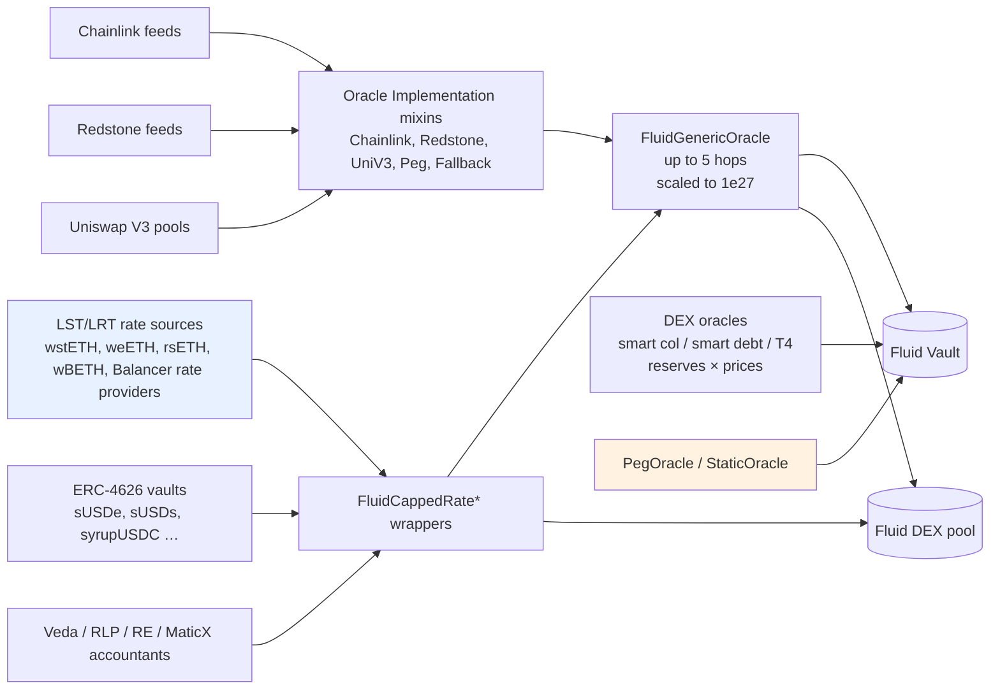

# Oracle — SPEC

## 0. Gas-optimisation tier

**Warm path (read-side).** Vaults and DEX read oracle prices on every `operate` / `liquidate` / swap. Keep the `_getOperateExchangeRate` / `_getLiquidateExchangeRate` paths lean — do not add branches unless they plug a reachable oracle-manipulation or sequencer-uptime hole. The `FluidOracleL2` sequencer gate + 45 min grace is an accepted cost for closing a reachable hole.

**Cold path (admin-only / one-time).** Constructor param validation, owner-only setters. Welcome extra `require`s on construction.

Security always wins — an oracle that silently returns a stale or manipulable rate is a reserve-draining bug, so any bound that closes such a hole is worth the gas.

## 1. Purpose

The `contracts/oracleV1_DEPRECATED/` tree is Fluid's **legacy (v1) price layer** (superseded in development by `contracts/oracleV2/`). Every Fluid Vault reads collateral/debt prices through one or more `IFluidOracle` contracts to price positions for `operate` (borrow / withdraw) and `liquidate` flows; every Fluid DEX reads a center price through `IFluidCenterPrice`. The oracles in this folder are **thin, composable wrappers** that take one or more external rate sources (Chainlink, Redstone, ERC-4626, LST / LRT provider contracts, Uniswap V3 TWAPs, Balancer rate providers, Pendle, Veda accountants, …) and produce a single scaled rate in the format Fluid consumes.

The library centres on four capability primitives:

- **`FluidOracle` / `FluidOracleL2`** — base for vault-facing oracles. Enforces 1e27 scaling, `infoName`, `targetDecimals`, and splits `Operate` vs `Liquidate` price reads. L2 variant additionally gates every read on a Chainlink sequencer-uptime feed + 45 min grace period.
- **`FluidCenterPrice` / `FluidCenterPriceL2`** — base for DEX center-price contracts. Always 27 target decimals. Uses the same sequencer gate on L2.
- **`FluidCappedRate` / `FluidCappedRateL2`** — state-holding oracle base that re-reads an external rate source on a heartbeat and enforces **up max-APR caps** and **down max-drawdown caps** before returning a price, with separate view methods for col and debt sides.
- **Source-reader & implementation mixins** (`ChainlinkOracleImpl`, `RedstoneOracleImpl`, `UniV3OracleImpl`, `FallbackOracleImpl`, `PegOracleImpl`, `*SourceReader`) — reusable building blocks composed into the concrete oracle contracts.

This `SPEC.md` is the **index**. It describes shared conventions, then enumerates every oracle contract and subfolder with a one-line purpose, the price it outputs, and the primary base it extends.

## 2. Architecture & Data Flow

Every oracle ultimately returns a single `uint256` rate scaled to 1e27 (`OracleUtils.RATE_OUTPUT_DECIMALS`), with `infoName` and `targetDecimals` metadata for humans. Vaults call `getExchangeRateOperate` / `getExchangeRateLiquidate`; DEX pools call `centerPrice`.

## 3. Shared Conventions

### Rate scaling

- All oracle rates are reported in **1e27** base precision. The `targetDecimals` value (15 ≤ x ≤ 39) is informational and captures the effective decimals of `col / debt` after accounting for token decimals.
  - Example: `ETH / USDC` → `targetDecimals = 15` (9 from 18→27 for ETH + 6 USDC).
  - Example: `USDC / ETH` → `targetDecimals = 39`.
- Every hop in composed oracles scales its raw reading to 1e27 via `multiplier / divisor` immutables set in the constructor, then combines with the previous hop's rate at `1e27` precision.
- Center prices are **fixed at 27 decimals** (`FluidCenterPrice._TARGET_DECIMALS = 27`).

### Operate vs Liquidate

`IFluidOracle` exposes two reads that a vault uses on different code paths:

- `getExchangeRateOperate()` — used during user-initiated `operate` (supply, borrow, withdraw, payback). Typically returns a conservative price that **protects the protocol against overpricing collateral / underpricing debt**.
- `getExchangeRateLiquidate()` — used during liquidations. Returns the rate that **protects against forced liquidations** (down-capped col / up-capped debt when `avoidForcedLiquidations*` flags are on).

`getExchangeRate()` remains for backwards compatibility and delegates to Operate/Liquidate as appropriate per contract.

### Price sanity checks

- Rate-zero guards on **every hop** and **every final rate** — a silent zero reverts with an oracle-specific `ExchangeRateZero` / `RateZero` error rather than being returned.
- **Chainlink / Redstone** readers use a `try/catch` wrapper so that a single misbehaving feed produces a `0` (caught by callers / fallbacks) rather than reverting the entire vault.
- **UniV3** oracles verify the current block price against three TWAP intervals (e.g. 240→60s, 60→15s, 15→1s). Any failing delta produces `0`, allowing the fallback pipeline to kick in.
- **Generic oracles forbid `UniV3Checked` as a plain hop source**; it has to go through the dedicated `FluidGenericUniV3CheckedOracle` (`_verifyOracleHopSource` reverts on UniV3-as-hop to prevent silent reuse).

### Fallback order (FallbackOracleImpl)

Chainlink / Redstone compositions share a three-mode fallback flag:

| `mainSource` | Main | Fallback | Typical use |
| :---: | --- | --- | --- |
| 1 | Chainlink | — | Feed pair only exists on Chainlink |
| 2 | Chainlink | Redstone | Default; Chainlink with Redstone backup |
| 3 | Redstone  | Chainlink | Redstone preferred, Chainlink backup |

`UniV3CheckCLRSOracle` layers UniV3 around the same CL/RS pair (`_RATE_SOURCE = 1/2/3` selects UniV3-only, UniV3 with CL/RS check, CL/RS with UniV3 check).

### Heartbeats & capping (FluidCappedRate)

`FluidCappedRate` wraps rate sources that can only move slowly (LSTs, ERC-4626 share prices, yield tokens). It stores a rate on-chain and only refreshes it when **either**:

1. `|new - current| ≥ minUpdateDiffPercent`, or
2. `block.timestamp - lastUpdateTime ≥ minHeartbeat` (force update path).

On update it enforces:

- **Up cap** — rate cannot grow faster than `maxAPRPercent` per year, prorated by time since last update. A temporary 100× spike therefore cannot be priced in. Allows up to 7 "yield jumps" for heartbeat-forced updates to catch up gradual drift.
- **Down cap** — `maxReachedAPRCappedRate` floor; for assets with `avoidForcedLiquidationsCol / Debt = true`, `Liquidate` reads are floored at `maxReachedRate × (1 − maxDownFromMaxReachedPercent)` to prevent forced-liquidation griefing on temporary depegs.
- **Debt up cap** — `maxDebtUpCapPercent` extra headroom on top of `maxReachedRate` for the debt side when avoiding forced liquidations there.

`getRatesAndCaps()` returns a full diagnostic bundle (current rate, caps, direction flags) for resolvers / UIs.

### Trust model

- The oracle layer itself holds **no user funds** — oracles are pure rate producers.
- Every oracle fundamentally inherits the trust assumptions of its underlying feeds: **Chainlink operators, Redstone operators, LST/LRT issuer contracts, Uniswap V3 pool liquidity, Balancer rate providers, Pendle market TWAPs, Veda accountants, Re/RLP price calculators**, etc. A compromise of any base feed bubbles up.
- **Vault governance (team multisig)** can re-point a vault to a different oracle at any time via `FluidVaultFactoryOwner` / the config-auth contracts. Users must therefore trust the multisig not to swap a live vault onto a malicious oracle.
- **`FluidCappedRate` admin** (governance + Liquidity guardians, gated via the Liquidity `eip1967.proxy.admin` slot) can update `maxAPRPercent`, `maxDown*`, `minHeartbeat`, `minUpdateDiffPercent`, toggle `avoidForcedLiquidations*`, and `forceResetMaxRate`. These knobs can widen or tighten the safety caps; they cannot bypass the underlying external rate source.
- **L2 deployments** additionally trust the Chainlink L2 sequencer-uptime feed: any outage forces reads to revert (`FluidOracleL2__SequencerOutage`) for up to 45 min after recovery. This protects against stale prices during sequencer downtime.

## 4. Base Contracts (root of `contracts/oracleV1_DEPRECATED/`)

| File | Contract | Role |
| --- | --- | --- |
| `fluidOracle.sol` | `FluidOracle` | Abstract base for every vault-facing oracle. `infoName`, `targetDecimals`, operate/liquidate/legacy reads. |
| `fluidOracleL2.sol` | `FluidOracleL2` | Same as above + sequencer-uptime gate (45 min grace) for L2 chains. |
| `fluidCenterPrice.sol` | `FluidCenterPrice` | Abstract base for DEX center price contracts; always 1e27 decimals. |
| `fluidCenterPriceL2.sol` | `FluidCenterPriceL2` | L2 variant with sequencer gate. |
| `fluidCappedRate.sol` | `FluidCappedRate` / `FluidCappedRateBase` | Stateful heartbeat+cap wrapper. Exposes `IFluidOracle`, `IFluidCappedRate`, `IFluidCenterPrice`. Admin: governance + Liquidity guardians. |
| `fluidCappedRateL2.sol` | `FluidCappedRateL2` | L2 variant with sequencer gate. |
| `error.sol` / `errorTypes.sol` | `Error`, `ErrorTypes` | `FluidOracleError(errorId)` + 6xxxx code table (see §11). |

## 5. Interfaces (`interfaces/`)

- `iFluidOracle.sol` — `IFluidOracle` with `getExchangeRate`, `getExchangeRateOperate`, `getExchangeRateLiquidate`, `infoName`, `targetDecimals`.
- `iFluidCappedRate.sol` — extends `IFluidOracle` with `getExchangeRateOperateDebt`, `getExchangeRateLiquidateDebt`, `centerPrice`.
- `iFluidCenterPrice.sol` — `centerPrice`, `infoName`, `targetDecimals`.
- `interfaces/external/` — external 3rd-party interfaces the oracles consume (Chainlink V3 aggregator, Redstone, Uniswap V3 pool, WstETH, WeETH, WBETHOracle, RsETH LRT oracle, MaticX child pool, Balancer rate provider, Veda accountant, Re share price, RLP price, Pendle market/lp oracle).

## 6. Libraries (`libraries/`)

| File | Purpose |
| --- | --- |
| `oracleUtils.sol` | `RATE_OUTPUT_DECIMALS = 27`, `HUNDRED_PERCENT_DELTA_SCALER = 10_000`, `isRateOutsideDelta(main, check, maxDeltaPct)`. |
| `FullMath.sol` | Uniswap's 512-bit `mulDiv` — used by UniV3 price math. |
| `TickMath.sol` | Uniswap's `getSqrtRatioAtTick` / tick↔price conversion for UniV3 TWAPs. |

## 7. Shared Implementation Mixins (`implementations/`)

Mixins that concrete oracles compose in. Each is `abstract` and stateless beyond immutables set at deployment.

| File | Contract | Gives its inheritor… |
| --- | --- | --- |
| `chainlinkOracleImpl.sol` | `ChainlinkOracleImpl` | Up to **3 Chainlink feed hops** multiplied together, per-hop invert flag, decimals-aware scaling to 1e27. |
| `redstoneOracleImpl.sol` | `RedstoneOracleImpl` | Single Redstone feed read, scaled to 1e27 with optional invert. `_REDSTONE_ORACLE_NOT_SET_ADDRESS` sentinel when disabled. |
| `uniV3OracleImpl.sol` | `UniV3OracleImpl` | UniV3 pool read with 5 `secondsAgos` TWAPs and 3 max-delta checks (e.g. 240→60, 60→15, 15→1). Rejects when any delta check fails. |
| `pegOracleImpl.sol` | `PegOracleImpl` | Decimals-aware 1≈1 peg pricing (`USDe/USDC`, `GHO/USDC` …), optional ERC-4626 wrap (e.g. sUSDe, sUSDs). `_getPegExchangeRate()`. |
| `fallbackOracleImpl.sol` | `FallbackOracleImpl` | Combines `ChainlinkOracleImpl` + `RedstoneOracleImpl` with the 1/2/3 fallback mode. |
| `structs.sol` | `ChainlinkStructs` | Shared `ChainlinkConstructorParams` / `ChainlinkFeedData` structs. |

### DEX sub-implementations (`implementations/dex/`)

Implementation pieces that oracles for **Fluid DEX vaults** compose (smart col / smart debt / T4 vault types). Each DEX oracle picks one from each of the three composable groups below.

- `dexOracleBase.sol` — `DexOracleBase`, `DexOracleAdjustResult`, `IFluidStorageReadable`. Reads DEX `constantsView` / `constantsView2` at deploy, caches storage slots and per-token numerator/denominator precision. `QUOTE_IN_TOKEN0` flag picks the quote side.
- `dexPricesAndExchangePrices.sol` — internal pricing helpers: DEX range, utilization-adjusted exchange prices, smart col/debt shares ↔ underlying conversion.
- `dexSmartColOracleImpl.sol`, `dexSmartDebtOracleImpl.sol` — convert col / debt *reserves* into *shares per unit quote* (and vice versa).

**reserve getters** — how collateral / debt reserves get sourced:

| Contract | Behaviour |
| --- | --- |
| `reserveGetters/reservesFromLiquidity.sol` — `DexReservesFromLiquidity` | Reads raw Liquidity supply/borrow user data for the DEX, uses stored DEX price. |
| `reserveGetters/reservesFromLiquidityPeg.sol` — `DexReservesFromLiquidityPeg` | Variant for peg assets with a `pegBufferPercent` safety haircut on the weaker side (biases share price **down** for col and **up** for debt). |
| `reserveGetters/reservesFromPEX.sol` — `DexReservesFromPEX` | Reads reserves *after* applying `getPricesAndExchangePrices` (full DEX pricing). Used when reserves must be valued at actual DEX-range-adjusted price. |

**conversion price getters** — how to convert token0↔token1 reserves into a common quote:

| Contract | Source |
| --- | --- |
| `conversionPriceGetters/conversionPriceCL.sol` — `DexConversionPriceCL` | Chainlink feed chain. |
| `conversionPriceGetters/conversionPriceFluidOracle.sol` — `DexConversionPriceFluidOracle` | Another `IFluidOracle` (e.g. a wstETH/ETH capped rate). |
| `conversionPriceGetters/conversionPriceDirectNoBorrow.sol` — `DexConversionPriceDirectNoBorrow` | Reads the DEX's `lastStoredPrice` directly. **Only safe for no-borrow / very tight borrow-limit vaults.** |

**col↔debt price getters** — the final "collateral per debt" price hop:

| Contract | Source |
| --- | --- |
| `colDebtPrices/colDebtPriceFluidOracle.sol` — `DexColDebtPriceFluidOracle` | Any `IFluidOracle`, with optional invert. |
| `colDebtPrices/dexColDebtPriceGetter.sol` | Abstract base the above specialises. |

## 8. Source Readers (`sourceReaders/`)

Ultra-thin `try/catch` shims so the Generic-oracle plumbing can ask **any** of the supported source kinds for a rate with a uniform signature, and get `0` on failure instead of reverting:

| File | Reads from |
| --- | --- |
| `chainlinkSourceReader.sol` | `IChainlinkAggregatorV3.latestRoundData()`. |
| `fluidSourceReader.sol` | Another `IFluidOracle` (operate or liquidate). |
| `fluidDebtSourceReader.sol` | `IFluidCappedRate.getExchangeRate*Debt()` (debt-side capped-rate). |
| `uniV3CheckedSourceReader.sol` | Wraps a full `UniV3CheckCLRSOracle` so it can act as a single "hop" inside a `FluidGenericUniV3CheckedOracle`. |

## 9. Concrete Oracles

### 9.1 Generic / legacy oracles (`oracles/`)

Mainnet, non-DEX vaults use these.

| Contract | Price it returns | Extends |
| --- | --- | --- |
| `genericOracle.sol` — `FluidGenericOracle` | **Preferred.** Product of up to 5 configurable hops: Chainlink, Redstone, existing `IFluidOracle` (incl. `FluidCappedRate` col side), `FluidCappedRate` debt side. Scaled to 1e27. | `FluidOracle`, `FluidGenericOracleBase` |
| `genericOracleBase.sol` — `FluidGenericOracleBase` | Hop machinery (source types, per-hop invert/multiplier/divisor, reads). | — |
| `genericUniV3CheckedOracle.sol` — `FluidGenericUniV3CheckedOracle` | Same as generic oracle but **exactly one hop must be `UniV3Checked`** — a `UniV3CheckCLRSOracle` embedded as a source. Enables using a UniV3 TWAP as one leg alongside Chainlink / capped-rate hops. | `FluidGenericOracleBase`, `UniV3CheckedSourceReader` |
| `fallbackCLRSOracle.sol` — `FallbackCLRSOracle` | Chainlink with Redstone fallback (and vice versa). **Deprecated — use `FluidGenericOracle` for new deployments.** | `FluidOracle`, `FallbackOracleImpl` |
| `uniV3CheckCLRSOracle.sol` — `UniV3CheckCLRSOracle` | UniV3 TWAP cross-checked against Chainlink/Redstone (or vice versa); configurable main-source & delta. **Deprecated — use `FluidGenericUniV3CheckedOracle`.** Still used as embeddable hop via `UniV3CheckedSourceReader`. | `FluidOracle`, `UniV3OracleImpl`, `FallbackOracleImpl` |
| `pegOracle.sol` — `PegOracle` | ~1≈1 price for stable pairs, decimals-adjusted; optional ERC-4626 wrap (e.g. `sUSDe / USDC`, `sUSDs / USDT`). | `FluidOracle`, `PegOracleImpl` |
| `staticOracle.sol` — `StaticNoBorrowOracle` | Constant price. **Only for mocking or for vaults with effectively no borrow (tight borrow limits).** Optional `liquidateZero` flag forces `Liquidate` to return 0 (reverts vault liquidation path). | `FluidOracle` |

### 9.2 L2 variants (`oraclesL2/`)

Each wraps a mainnet counterpart and gates every rate read behind `_ensureSequencerUpAndValid()`:

| Contract | = Mainnet analogue |
| --- | --- |
| `genericOracleL2.sol` — `FluidGenericOracleL2` | `FluidGenericOracle` + sequencer gate. |
| `fallbackCLRSOracleL2.sol` — `FallbackCLRSOracleL2` | `FallbackCLRSOracle`. |
| `uniV3CheckCLRSOracleL2.sol` — `UniV3CheckCLRSOracleL2` | `UniV3CheckCLRSOracle`. |
| `pegOracleL2.sol` — `PegOracleL2` | `PegOracle`. |

### 9.3 DEX oracles (`oracles/dex/` + `oraclesL2/dex/`)

All return a rate priced at 1e27 expressing **debt units per 1 col share** (T2), **debt shares per 1 col** (T3), or **debt shares per 1 col share** (T4). The three implementation axes above (reserves, conversion price, col/debt price) fully determine each variant.

| Contract | Vault type | Reserves | Conversion | Col/Debt |
| --- | :---: | --- | --- | --- |
| `dexSmartColPegOracle.sol` — `DexSmartColPegOracle` | T2 (smart-col pegged) | `ReservesFromLiquidityPeg` (buffer %) | `FluidOracle` (optional; e.g. wstETH/ETH) | `IFluidOracle` |
| `dexSmartColCLOracle.sol` — `DexSmartColCLOracle` | T2 (smart-col)        | `ReservesFromPEX` | Chainlink feeds | `IFluidOracle` |
| `dexSmartColNoBorrowOracle.sol` — `DexSmartColNoBorrowOracle` | T2 no-borrow   | `ReservesFromLiquidity` | DEX `lastStoredPrice` direct | `IFluidOracle` |
| `dexSmartDebtPegOracle.sol` — `DexSmartDebtPegOracle` | T3 (smart-debt pegged) | `ReservesFromLiquidityPeg` | `FluidOracle` (optional) | `IFluidOracle` |
| `dexSmartDebtCLOracle.sol` — `DexSmartDebtCLOracle` | T3 (smart-debt)       | `ReservesFromPEX` | Chainlink | `IFluidOracle` |
| `dexSmartT4PegOracle.sol` — `DexSmartT4PegOracle` | T4 (smart col + smart debt pegged) | `ReservesFromLiquidityPeg` | `FluidOracle` (optional) | — (shares ↔ shares) |
| `dexSmartT4CLOracle.sol` — `DexSmartT4CLOracle` | T4                   | `ReservesFromPEX` | Chainlink | — |

L2 counterparts live in `oraclesL2/dex/`:
`DexSmartColPegOracleL2`, `DexSmartDebtPegOracleL2`, `DexSmartT4PegOracleL2`, `DexSmartT4CLOracleL2` — mainnet logic + sequencer gate.

Each DEX oracle also exposes a `dex*SharesRates()` helper returning `(operate, liquidate)` share-price components for off-chain debugging.

### 9.4 Capped rate wrappers (`cappedRates/`)

All inherit `FluidCappedRate`. Constructor takes a `CappedRateConstructorParams` struct (rate source, rate multiplier to 1e27, cap params, heartbeat, avoid-liquidation flags, info name, liquidity). Each file only overrides `_getNewRateRaw()` to read the chain-specific source.

| File | External source | Emits rate |
| --- | --- | --- |
| `wstethCappedRate.sol` — `FluidWSTETHCappedRate` | `IWstETH.stEthPerToken` | wstETH → stETH/ETH (1e18 source, `_RATE_MULTIPLIER = 1e9`) |
| `weethCappedRate.sol` — `FluidWEETHCappedRate` | `IWeETH.getEETHByWeETH(1e27)` | weETH → eETH/ETH |
| `wbethCappedRate.sol` — `FluidWBETHCappedRate` | `IWBETHOracle.exchangeRate` | wBETH → ETH |
| `rsethCappedRate.sol` — `FluidRSETHCappedRate` | `IRsETHLRTOracle.rsETHPrice` | rsETH → ETH |
| `balancerCappedRate.sol` — `FluidBalancerCappedRate` | `IBalancerRateProvider.getRate` | Any Balancer rate provider (e.g. ezETH / ETH, osETH / ETH). |
| `maticXCappedRate.sol` — `FluidMaticXCappedRate` | `IMaticXChildPool.convertMaticXToMatic(1e27)` | MaticX → MATIC (Polygon). |
| `asbnbCappedRate.sol` — `FluidAsBnbChainlinkCappedRate` | `IAsBnbRateSource.convertToTokens` × Chainlink `slisBNB/BNB` | asBNB → BNB (BNB chain). |
| `erc4626CappedRate.sol` — `FluidERC4626CappedRate` | `IERC4626.convertToAssets(1e27)` | Any ERC-4626 (sUSDe, sUSDs). |
| `erc46262xCappedRate.sol` — `FluidERC46262xCappedRate` | Two chained ERC-4626 (`rate2 × rate1 / 1e27`) | e.g. csUSDL → wUSDL → USDL. |
| `erc4626AndChainlinkCappedRate.sol` — `FluidERC4626ChainlinkCappedRate` | ERC-4626 × Chainlink | e.g. asBNB → slisBNB → BNB. |
| `chainlinkCappedRate.sol` — `FluidChainlinkCappedRate` | `IChainlinkAggregatorV3.latestRoundData` | Any Chainlink feed. |
| `reusdCappedRate.sol` — `FluidREUSDCappedRate` | `IReSharePrice.getSharePrice` | REUSD (Re Protocol). |
| `rlpCappedRate.sol` — `FluidRLPCappedRate` | `IRLPPrice.lastPrice` | RLP / USD. |
| `vedaCappedRate.sol` — `FluidVedaCappedRate` | `IVedaAccountant.getRate` | Veda-backed share prices (EBTC, weETHs). |

L2 counterparts in `cappedRatesL2/` (currently `chainlinkCappedRateL2.sol`, `erc4626CappedRateL2.sol`) mirror their mainnet twins and additionally gate on the sequencer-uptime feed.

### 9.5 Center prices (`centerPrices/`)

DEX-pool `centerPrice()` feeders.

| File | Contract | Source |
| --- | --- | --- |
| `genericCenterPrice.sol` — `FluidGenericCenterPrice` | Any `FluidGenericOracle` hop chain (also exposes `IFluidOracle`). |
| `genericCenterPriceL2.sol` — `FluidGenericCenterPriceL2` | L2 variant. |
| `chainlinkCenterPriceL2.sol` — `ChainlinkCenterPriceL2` | Direct Chainlink with sequencer gate. |
| `cappedRateInvertCenterPrice.sol` — `FluidCappedRateInvertCenterPrice` | Inverts an existing `FluidCappedRate.centerPrice` — used when a token is token0 in one DEX and token1 in another (e.g. LBTC in LBTC/CBBTC vs WBTC/LBTC). |
| `staticCenterPrice.sol` — `StaticCenterPrice` | Constant price. **Must not be left on a live DEX** — temporary use only. |

`FluidCappedRate` also implements `IFluidCenterPrice` directly, so most production DEX pools simply wire a capped-rate contract in as their center price.

## 10. Deployment Notes

- **Per-chain, per-oracle**: each oracle is deployed individually by `scripts/prod-deploy-oracle.ts` (or through the vault-deploy path which auto-deploys the oracles a new vault needs). Artifacts land under `deployments/<network>/<OracleName>.json`.
- **Naming convention**: canonical `<BaseName>_<COL>_<DEBT>[ _<Quote> ]` (e.g. `GenericOracle_REUSD_USDC`, `DexSmartColPegOracle_REUSD-USDT_USDT`, `CappedRateERC4626_SUSDE_CenterPriceInverted`). **Do not fork names** (no `_V2`, `_CAPPED`) — overwrite in place.
- **Canonical address log**: `deployments/deployments.md` holds the authoritative address + constructor-args + `DeployerFactory nonce` for every deployed oracle. After every oracle deploy batch, produce the standard overview table per `oracle-deployment-overview` rule.
- **L2 constructor**: every `*L2` oracle takes a `sequencerUptimeFeed_` address; this is chain-specific (Arbitrum, Base, Polygon, BNB, Plasma). Zero-address is **not** a supported disable path.
- **`FluidCappedRate` bootstrap**: constructor immediately seeds `_slot0.rate` with a live fetch of `_getNewRateRaw() * _RATE_MULTIPLIER` and sets `_slot1.maxReachedAPRCappedRate` equal to that initial rate. First real update requires either `minUpdateDiffPercent` to be exceeded or `minHeartbeat` to elapse.
- **Rebalancer path**: `FluidCappedRate.rebalance()` is public, so anyone (e.g. a keeper bot) can pay gas to refresh the stored rate once an update condition is met.

## 11. Errors

All oracle errors are raised as `FluidOracleError(uint errorId)` from `error.sol`. Error codes are 6xxxx — see `contracts/oracleV1_DEPRECATED/errorTypes.sol` for the authoritative table. High-level families:

| Range | Group |
| --- | --- |
| `60000` | `FluidOracleL2__SequencerOutage` |
| `60001–60003` | `UniV3CheckCLRSOracle` |
| `60010` | `FluidOracle__InvalidInfoName` |
| `60102`, `60201–60204`, `60321`, `60361` | Asset-specific legacy oracles (sUSDe, Pendle, WeETHs, sUSDs) |
| `60331–60343` | `DexSmartColOracle` / `DexSmartDebtOracle` |
| `60351–60355` | `CappedRate` (params, unauthorised, min-update-diff, zero rate, storage overflow) |
| `60371` | `PegOracle` |
| `60381–60382` | `DexOracle` (base + exchange-rate-zero) |
| `60401–60403` | `GenericOracle` (params, unexpected config, rate-zero per hop) |
| `60421` | `CenterPrice` (invalid params) |
| `61001–69001` | Specific legacy oracles: Chainlink, UniV3, WstETH, Redstone, Fallback, FallbackCLRS, WstETHCLRS, CLFallbackUniV3, WstETHCLRS2UniV3 |
| `70001` | `WeETHOracle` legacy |

## 12. Invariants & Safety Notes

- **Every returned rate is ≥ 1 in 1e27 terms**; any oracle hop producing `0` reverts with an oracle-specific error. Callers (vaults, DEXes) therefore never see a silent `0` that could be treated as "no price".
- **`FluidGenericOracleBase._verifyOracleHopSource`** explicitly refuses `sourceType == UniV3Checked` as a plain hop. To include UniV3, use `FluidGenericUniV3CheckedOracle` (which enforces "exactly one" UniV3 source in the chain).
- **Capped-rate storage overflow is hard-capped**: `_slot0.rate` is `uint168` (≈ 3.74e50). `_updateRates` explicitly reverts `CappedRate__StorageOverflow` before any cast loss.
- **`avoidForcedLiquidationsCol/Debt`** should only be enabled for **trusted peg assets** (LSTs, major stables). When true, a genuine permanent depeg can lead to bad debt because `Liquidate` reads are floored; an operator must `updateAvoidForcedLiquidations* (false)` to unfreeze normal liquidations. This is an intentional trust-model knob, not a bug.
- **`StaticNoBorrowOracle` and `StaticCenterPrice`** must not be attached to production vaults / DEXes with real borrowing. Both are clearly labelled in-file.
- **`FluidCappedRate` heartbeat** is measured from `block.timestamp`; on an L2 that experiences a sequencer outage, the heartbeat still advances. The L2 sequencer gate is what prevents pricing during the outage — the capped-rate itself continues to store a stale value and will snap forward on the first read after the gate releases.
- **DEX oracles read Fluid Liquidity / DEX internal storage** via `readFromStorage` + cached slots set in the DEX oracle base. These storage layouts are consensus (see `liquiditySlotsLink.sol`, `dexSlotsLink.sol`); a breaking change to those layouts would require redeploying the DEX oracles alongside the DEX itself.
- **Governance cannot retroactively change a vault's historical price reads** — it can only swap the oracle pointer forward. Liquidations that already executed against a previous oracle are final.

See `docs/docs.md` for an end-to-end protocol overview and the per-vault-type specs (`contracts/protocols/vault/**/SPEC.md`) for exactly where each oracle is read during operate / liquidate.
