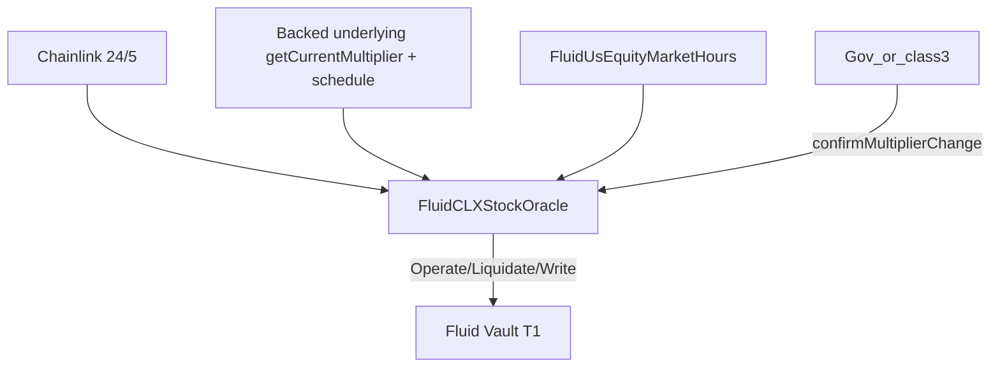

# CLX Stock Oracle — SPEC

Chainlink 24/5 × Backed wrapped-xStock multiplier, with session-aware staleness and extended-hours caps.

Sources: [`main.sol`](./main.sol), [`helpers.sol`](./helpers.sol), [`variables.sol`](./variables.sol), [`structs.sol`](./structs.sol), [`events.sol`](./events.sol), [`../interfaces/iFluidCLXStockOracle.sol`](../interfaces/iFluidCLXStockOracle.sol). Market hours: [`../usEquityMarketHours/SPEC.md`](../usEquityMarketHours/SPEC.md).

## 1. Purpose

```
price = Chainlink_24x5 × underlying.getCurrentMultiplier() × rateMultiplier / 1e18
```
→ Fluid **1e27**. Not upgradeable; shared schedule on upgradeable `FluidUsEquityMarketHours`.

Handles: CL prints outside RTH, wrapper dividends/corporate actions (incl. pre-activation freeze on scheduled
multiplier jumps), operate/liquidate (+ debt invert) asymmetry, optional write path that warms caches.

## 1b. Assumptions & design intent (auditors)

**Core goal.** Pricing must remain usable without a hard dependency on off-chain schedule infrastructure. `FluidUsEquityMarketHours` and the weekend schedule writer improve security when healthy; they are **not** a liveness requirement for the CLX oracle.

**Assumptions.**

1. **Chainlink 24/5 + Backed multiplier are the primary price sources.** Every pricing path reads live Chainlink and the underlying's live `getCurrentMultiplier()` (the wrapper's `convertToAssets` is a pure passthrough of it, asserted at deploy). Session metadata never invents a price.
2. **Market hours is complementary hardening.** When the schedule is present and fresh, CLX can (a) treat REGULAR as uncapped live pricing with tight operate staleness, and (b) outside REGULAR, clamp vs the last verified cash-session print.
3. **Schedule / writer failure is expected and fail-open.** Missing, stale, malformed, or unusable MH data (including a last-REGULAR window whose end is ≥ ~5 days before `block.timestamp`, or an RTH window with no Chainlink print within heartbeat lookback of the close) does **not** freeze the oracle. CLX falls back to live Chainlink (reject zero), **no** extended-hours clamp, and — for MH window failures (malformed/stale) — **`MAX_UPDATE_TIMESPAN_EXTENDED` (5d)** staleness for operate too. A trusted window with no anchor is a feed anomaly, not an MH failure: operate stays heartbeat-fresh there. Liq always 5d.
4. **Off-chain ops are monitoring, not consensus.** Alert when schedule updates stop; write-path emits `LogExtendedHoursFallback` when clamp is skipped. A future Chainlink session/hours feed would only strengthen the complementary layer.
5. **What remains hard-required.** Non-zero CL + multiplier; multiplier band / team confirm for discontinuous jumps (incl. the pre-activation scheduled freeze); staleness on CL `updatedAt`; price bounds enforced by the vault.

**Accepted trade-off.** When fallback engages, the extended-hours *magnitude* clamp is absent; only the 5d extended freshness bound remains. A pre-window anchor is precise to the feed's deviation threshold (~0.5%) — negligible vs the cap. MH reader calls are still direct (a reverting MH implementation would brick pricing); fail-open covers schedule **payload** freshness / emptiness, not a broken MH bytecode path.

## 2. Architecture



| File | Role |
| --- | --- |
| [`main.sol`](./main.sol) | Oracle + `confirmMultiplierChange`, `updateRegularHoursAnchor` |
| [`helpers.sol`](./helpers.sol) | Pricing, band, RTH walk, extended-hours caps, REGULAR-like fallback |
| [`variables.sol`](./variables.sol) | Immutables + packed state |

Errors: `CLXStockOracle__*` (`310311–310317`). Auth: `Access__Unauthorized` via `BasicAuth` / `LiquidityGovernanceAuth` (constructor-bound Liquidity). Auth classes: 1 = pause, 2 = pause+unpause, 3 = +confirm (e.g. governance sets team as class 3).

## 3. External Interactions

| Dependency | Use |
| --- | --- |
| Chainlink Aggregator V3 | `latestRoundData` / `getRoundData` |
| Backed underlying (`wrapper.asset()`) | **`getCurrentMultiplier()` on every price read**; `newMultiplier()` / `newMultiplierActivationTime()` for the scheduled freeze |
| Backed wrapper | Deploy-time only: `asset()` + `convertToAssets(1e18)` passthrough assert (rejects v1 wrappers) |
| `FluidUsEquityMarketHours` | Session + last RTH window; write uses `getCurrentSession()` |

Feeds (product): SPY, QQQ, NVDA, TSLA, GOOGL, SPCX (no CRCL). One oracle per asset.

## 4. Always Read the Live Multiplier

**Rejected:** cache multiplier, refresh via rebalancer (~gas save, operational lag on splits). Also rejected:
reading via the wrapper's `convertToAssets` (one extra proxy hop per read; it is a pure passthrough of the
underlying's `getCurrentMultiplier()` — equality asserted once in the constructor, which rejects v1 wrappers).

**Decision:** always `underlying.getCurrentMultiplier()` on operate / liquidate / anchor paths.

Splits can move the rate sharply; off-chain lag is unacceptable. Dividends stay in the on-chain band; discontinuous jumps need live read or team confirm. Gas (~5k warm / ~35–40k cold) accepted per [`../SPEC.md`](../SPEC.md) §0.

`acceptedMultiplier` is a **band reference** only (time-accrued `MAX_MULTIPLIER_CHANGE_PERCENT` over `MULTIPLIER_BAND_PERIOD` 30d, then capped). Out-of-band → revert; gov or auth class ≥ 3 `confirmMultiplierChange(expected)` syncs if live is within absolute `MAX_%` of expected (no blind accept).

## 5. Session-Aware Pricing

| Session | Staleness | Price |
| --- | --- | --- |
| `REGULAR` | Op `MIN_CHAINLINK_HEARTBEAT` (`24h20m`) / Liq `5d` | Live; Write stores RTH hint (round + `block.timestamp`) |
| `EXTENDED` | Op `MIN_CHAINLINK_HEARTBEAT` (`24h20m`) / Liq `5d` | Live ± cap vs RTH |
| `HOLIDAY` / `UNKNOWN` | Op & Liq `5d` | Live ± caps when RTH window trusted |

Non-`REGULAR`: clamp to ±`MAX_EXTENDED_HOURS_CAP_PERCENT` around latest RTH round in `[regularStart, regularEnd + 15m buffer]`, × live multiplier — **only if** the MH window is trusted and an in-window CL round exists. Cache hit if `_lastVerifiedRegularHoursEnd == regularEnd`; else walk from hint/`0`.

**Config note:** the constructor accepts any cap in `(0, SIX_DECIMALS]`. `SIX_DECIMALS` (100%) is a valid but special value: the floor becomes `0` and the up-cap `2x` the anchor, so the extended-hours clamp never binds and pricing is effectively live-only outside `REGULAR` (staleness, multiplier band and pause still apply). Only configure it to opt out of the clamp deliberately — it is not distinguishable from a mis-set cap on-chain.

**Anchor marker semantics:** `_lastVerifiedRegularHoursEnd` is `regularEnd` **only** once the session is complete (the "verified for close" marker that later reads cache-hit on). During `REGULAR` both the write path and `updateRegularHoursAnchor` store `block.timestamp` instead — a walk hint, not a close claim — because the close may still print. Any new writer of `_storeRegularHoursReference` must preserve this, or reads will clamp the whole extended period to an intraday price.

| Side | Operate | Liquidate |
| --- | --- | --- |
| Collateral | Cap up | Floor down |
| Debt | Floor down | Cap up |

### REGULAR-like fallback (no hard MH dependency)

Skip clamp and use live CL when any of:

1. Empty / malformed MH window (`regularStart == 0`, `regularEnd == 0`, or `end < start`)
2. Stale MH window (`block.timestamp - regularEnd >= REGULAR_HOURS_HINT_MAX_AGE` = 5d)
3. No Chainlink print in the anchor window (walk miss / lookback exhaustion / heartbeat gap through a quiet session). Anchor window: `[regularStart, regularEnd + 15m]`; once `block.timestamp > regularEnd + 15m` the lower bound widens to `windowEnd − MIN_CHAINLINK_HEARTBEAT` (quiet session ⇒ CL deviation certifies the last pre-window print as the session price). A pre-window anchor is rejected only if the feed *provably* missed a print deadline (`print + heartbeat`) during trading hours; a deadline in HOLIDAY/UNKNOWN proves nothing. See [EDGE_CASES.md](./EDGE_CASES.md).

On fallback: untrusted/malformed MH window → op also 5d (fail-open); trusted window with no anchor (feed anomaly) → op stays heartbeat-fresh; liq 5d. `persistRoundId = 0` (do not cache). Write emits `LogExtendedHoursFallback(sessionType)`. Raw already returns unclamped live on miss.

`updateRegularHoursAnchor` stores the **latest in-window RTH** print; once the window is fully past it also accepts the latest pre-window print within `MIN_CHAINLINK_HEARTBEAT` of the close (in-window prints win; during live `REGULAR` the widening never applies, so a pre-open print can't be stored as verified-for-close). Not-found / untrusted window: **no-op during `REGULAR`**; **reverts `RegularHoursReferenceNotFound` outside `REGULAR`** — now implies a genuine feed anomaly, not a quiet trading day.

**Warm path:** REGULAR write → round + `block.timestamp` (hint, not cache); non-REGULAR write with successful clamp / `updateRegularHoursAnchor` → round + `regularEnd` (cache). Hint freshness: sync within 5d (`REGULAR_HOURS_HINT_MAX_AGE`); external hints age by CL `updatedAt`.

**CL round walks:** forward/back stop on read revert **or** `updatedAt == 0`. Some Chainlink 24/5 feeds return successful `getRoundData` for post-tip ids with `answer = 0` / `updatedAt = 0`; treating those as tip/gap avoids burning the full 300-step lookback on phantoms.

## 6. Multiplier Band

| Param | Meaning |
| --- | --- |
| `maxMultiplierChangePercent` | 1e2 (1% = 100). Construct max **10%** (`1000`). **`0` = freeze** (any drift needs confirm; live == accepted still prices) |
| `MULTIPLIER_BAND_PERIOD` | `30 days` linear, then stops |
| `rateMultiplier` | Scales CL×wrapper into Fluid decimals. Construct: `> 0` and `≤ MAX_RATE_MULTIPLIER` (`1e27`) |
| `targetDecimals` | Must be **27**; the base reverts otherwise. Token-decimal adjustment belongs to the consuming vault oracle |

**Accrual.** Band uses absolute diff (not a floored percent):

`maxDiff = accepted × MAX% × min(elapsed, PERIOD) / (PERIOD × 1e4)`

(`DeviationHelpers` with both sides scaled by `PERIOD`.) Flooring `(MAX% × elapsed) / PERIOD` first would zero the band for `elapsed < PERIOD / MAX%` (~7.2h at production 1%) and revert any nonzero wrapper drift until the window ends; every in-band write sync / confirm resets the clock.

**Freeze (`MAX% == 0`).** Outside iff `live != accepted`. Exact match prices normally. Discontinuous jumps still unlock via gov/class-3 `confirmMultiplierChange(exactLive)` (absolute check vs expected with `MAX% == 0` ⇒ expected must equal live).

In-band write syncs accepted up/down (`LogUpdateAcceptedMultiplier`). Out-of-band needs gov/class-3 confirm.

### Scheduled multiplier freeze (pre-activation)

Backed schedules corporate actions on the underlying (`newMultiplier` / `newMultiplierActivationTime`,
overridable in place; activation `0`/past = immediate). Chainlink may apply the same action at a different
moment, so around activation CL and multiplier are not guaranteed in sync. Every guarded read (operate /
liquidate / write / debt — not raw, not anchor) therefore also reverts `ScheduledMultiplierPending` (`310318`)
when a pending schedule activates within `SCHEDULED_MULTIPLIER_FREEZE_BUFFER` (24h) **and** deviates from the
live multiplier by more than absolute `MAX_MULTIPLIER_CHANGE_PERCENT` (`MAX% == 0` ⇒ any deviation).

Deliberately **not** liftable by `confirmMultiplierChange`: the freeze clears when Backed overrides the
schedule to a benign value, or at activation the live getter flips and the regular band takes over until
confirm. Immediate updates are never observable in advance — only the live band covers those. The constructor
runs the same check (no deploy while a discontinuous change is pending; always probes
`newMultiplierActivationTime`).

### Price-gap guard (CL-leg breaker)

A CL-applied split has no leg-level on-chain signal, and CL data alone cannot separate a split from a
crash. Guarded reads revert `PriceGapBreak` (`310319`) when live drops more than `MAX_PRICE_GAP_DOWN_PERCENT`
(strict; production 42% = 4200; required, < 100%) or rises more than `MAX_PRICE_GAP_UP_PERCENT` (production
68% = 6800; required) vs the stored anchor round's answer. The live multiplier scales both sides, so a break
isolates the CL leg, and the check needs only the stored round plus its own `updatedAt` — independent of
market-hours data.

**Sizing the bounds.** They must sit with margin *inside* the smallest split to be caught, never on it: the
check is strict, and the net move is split factor combined with genuine drift, which can push a boundary-sized
split to the harmless side. 2:1 (−50%) is the smallest ratio large caps still use (PANW 2024, MNST/APH 2026),
and 1:2 is its reverse (+100%). The bounds mirror each other reciprocally (`up = 4 × down − 1`), so both
directions tolerate the same drift: 42% / 68% clears a 2:1 / 1:2 unless the same window also moves > 16%
the helpful way. False freezes stay implausible — the worst legitimate overnight gap on these names is
≈ −26% (META 2022) and none gains 68% in the ≤ 5d reference window. **Limitation:** a 3:2 split is only −33%, inside any safe bound, so it is not
caught — the ratio persists among mid-caps (ODFL 2020, RJF 2021, BN 2025) but not in the mega-cap/ETF roster;
those names rely on the scheduled freeze, the band, and off-chain alerts.

**Split timeline.** Backed schedules → scheduled freeze arms (activation ≤ 24h out). CL reprices → gap
guard freezes guarded reads (band still quiet). Multiplier activates → band holds the freeze until
`confirmMultiplierChange`. Team verifies both legs, confirms the multiplier, then rolls the anchor as gov /
class ≥ 3 via `updateRegularHoursAnchor` (post-split prints are in-window at/after the next RTH open) —
pricing resumes. Orderings can swap; whichever leg moves first, one guard holds until those two closing steps.

**Confirm precondition (ops runbook).** The gap guard is blind to the multiplier leg — the live multiplier
scales both sides of its check — so a confirm issued before Chainlink has repriced puts the full split
factor into prices with no on-chain backstop. Confirm only once price continuity holds against the stored
anchor round: `CL_live × multiplier_new ≈ CL_anchor × multiplier_old` (within normal drift). Until it
holds, leave the band freeze in place — it is the halt.

The reference is the existing anchor round — no extra storage. It rolls only through in-band paths: guarded
writes (which passed the check first) and `updateRegularHoursAnchor`, which allows an out-of-band roll only
for gov / class ≥ 3 — so the reference cannot be poisoned mid-gap. Rolls are additionally rate-limited
(`PRICE_GAP_REFERENCE_ROLL_DELAY` 20m): a different round may replace the stored one only once the stored
round is ≥ 20m old, and never in the first 20m of a REGULAR session — otherwise a split that CL prints as
several quick rounds could be walked past the guard by re-anchoring onto an intermediate print (one in-band
hop covers a 2:1). Same-round marker refreshes are exempt, gov / class ≥ 3 bypasses, and a blocked roll skips
silently (no store, no event, pricing unaffected — post-close caching can lag by up to 20m). Residual: a CL
repricing mid-session while the stored round is already ≥ 20m old (sparse writes) can still be walked —
accepted, corporate actions reprice at session boundaries. A transient anomaly self-heals (stateless
check); a genuine gap clears via an auth'd re-anchor once post-gap prints are in-window, i.e. at/after the
next RTH open (post split: confirm multiplier, then re-anchor). A reference older than
`PRICE_GAP_REFERENCE_MAX_AGE` (5d, spans long weekends) is skipped — fail-open, bounding any unattended
freeze; fresh deploys are unguarded until the first anchor store. MH failure only stops reference
maintenance → the guard disarms via age-out, never bricks pricing.

## 7. Roles

| Role | Powers |
| --- | --- |
| Liquidity governance | `updateAuth`, `pause`, `unpause`, `confirmMultiplierChange`, out-of-band anchor roll |
| Auth class 1 | `pause` |
| Auth class 2 | `pause`, `unpause` |
| Auth class 3 | `pause`, `unpause`, `confirmMultiplierChange`, out-of-band anchor roll |
| Anyone | Reads (operate/liq blocked when paused; raw ok), `updateRegularHoursAnchor` (in-band) |

## 8. API

| Method | Notes |
| --- | --- |
| Operate / Liquidate | Collateral; live CL × multiplier; band + scheduled freeze + price-gap guard |
| OperateDebt / LiquidateDebt | Debt; inverted clamp |
| *Write | Cursor + in-band sync + RTH store; may emit fallback |
| *Raw | Caps on when clamp applies; skip band/scheduled/gap/staleness (`0` if invalid); readable while paused |
| `updateRegularHoursAnchor` | Permissionless in-window RTH resolve; out-of-band rolls need gov / class ≥ 3 |
| `confirmMultiplierChange` | Gov or class ≥ 3; absolute % vs expected |
| `pause` / `unpause` | Class ≥ 1 / ≥ 2 (+ gov); operate/liq/write/debt gated when paused |
| `updateAuth` | Governance only via `BasicAuth` (`0`–`3`) |
| `getConfig()` | Immutables + runtime (incl. `paused` and the gap bounds) |
| `backedUnderlying()` | Resolved `wrapper.asset()` |

Vault T1 may `try` Write / `catch` → view.

## 9. Storage

Slot 0: `_acceptedMultiplier` (`uint104`) + `_paused` (`uint8`) + `_lastMultiplierUpdateTime` (`uint32`) + `_lastRegularHoursRoundId` (`uint80`) + `_lastVerifiedRegularHoursEnd` (`uint32`) = 256. Slot 1: `_auths` mapping (`BasicAuth`). Constants: buffer 15m, lookback 300, max band 10% (`0` freeze allowed), `MAX_RATE_MULTIPLIER` 1e27, hint/window age 5d, extended staleness 5d, scheduled freeze buffer 24h, price-gap reference max age 5d. `BACKED_UNDERLYING` immutable derived from `wrapper.asset()`.

## 10. Invariants

- Live underlying multiplier on every pricing path (§4); wrapper passthrough asserted at deploy.
- Multiplier band uses absolute accrued `maxDiff` (§6); out-of-band → no price until confirm.
- Pending scheduled multiplier outside absolute `MAX%` activating within 24h → no guarded price until Backed overrides or, past activation, band + confirm (§6).
- Live price outside the strict −down/+up gap bounds vs a fresh anchor reference → no guarded price and no permissionless anchor roll until live returns in-band, an auth'd re-anchor, or reference age-out (§6).
- Reference rolls to a different round are skipped while the stored round is < 20m old or within the first 20m of REGULAR (gov / class ≥ 3 exempt) (§6).
- `MAX% == 0`: freeze — unchanged live prices; any drift needs confirm.
- When `_paused != 0`, operate / liquidate / write / debt revert `CLXStockOracle__Paused` (`310317`); raw still returns; anchor warm + confirm still allowed.
- Staleness: op `MIN_CHAINLINK_HEARTBEAT` (24h20m) Regular/Extended; else (liq / Holiday/Unknown) `MAX_UPDATE_TIMESPAN_EXTENDED` 5d.
- Off-chain MH sync + anchor warm optional; missing/stale/silent RTH → live fail-open (§5 fallback), not hard revert.

## 11. Related

[`../usEquityMarketHours/SPEC.md`](../usEquityMarketHours/SPEC.md) · [`../SPEC.md`](../SPEC.md) · Backed **current** wrappers only (never v1 — enforced by the constructor passthrough assert).
