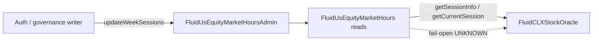

# US Equity Market Hours — SPEC

Shared week-ahead US equity session schedule used by Fluid Chainlink 24/5 stock oracles (`FluidCLXStockOracle`).

Sources: [`main.sol`](./main.sol), [`helpers.sol`](./helpers.sol), [`variables.sol`](./variables.sol), [`structs.sol`](./structs.sol), [`events.sol`](./events.sol), [`../interfaces/iFluidUsEquityMarketHours.sol`](../interfaces/iFluidUsEquityMarketHours.sol).

## 1. Purpose

`FluidUsEquityMarketHours` answers: **what trading session is it right now?** for US cash-equity hours (regular / extended / holiday-closed / unknown).

Chainlink 24/5 stock feeds keep printing outside NYSE cash hours. Fluid needs a shared, on-chain classification so stock oracles can:

- trust the live feed during **regular** hours (with staleness),
- apply **extended-hours caps** vs the last regular-hours window during extended / holiday,
- **fail open** if the schedule is missing or a time is undefined (`UNKNOWN`) — never hard-depend on the off-chain writer.

One contract is shared by all CLX stock oracles on a chain. The schedule writer (auth / rebalancer) is **complementary security**, not a required dependency for the oracle to function.

## 2. Architecture & Data Flow



| Piece | Role |
| --- | --- |
| `FluidUsEquityMarketHoursAdmin` | `BasicAuth` + `updateWeekSessions` |
| `FluidUsEquityMarketHours` | Session reads, `getCurrentSession` cursor |
| [`proxy.sol`](./proxy.sol) | `FluidUsEquityMarketHoursProxy` (ERC1967) |
| [`helpers.sol`](./helpers.sol) | 60-bit session pack / two-word layout |
| [`structs.sol`](./structs.sol) | `Session` (calldata / memory) |
| [`variables.sol`](./variables.sol) | Constants + `_sessionData0/1` + `_auths` |
| [`events.sol`](./events.sol) | `LogUpdateWeekSessions` (`LogUpdateAuth` from `BasicAuth`) |

Access control: [`BasicAuth`](../../../libraries/access/basicAuth.sol) / [`LiquidityGovernanceAuth`](../../../libraries/access/liquidityGovernanceAuth.sol) (constructor-bound `LIQUIDITY`). Schedule sanity errors: `UsEquityMarketHours__InvalidParams` (`310301`). Auth failures use `Access__Unauthorized`.

## 3. Session Model

### Returned `sessionType`

| Constant | Value | Meaning |
| --- | ---: | --- |
| `SESSION_TYPE_UNKNOWN` | 0 | Empty schedule, or time outside any stored entry |
| `SESSION_TYPE_REGULAR` | 1 | Inside a REGULAR entry’s session window |
| `SESSION_TYPE_EXTENDED` | 2 | Inside an entry’s `extendedDurationMinutes` tail |
| `SESSION_TYPE_HOLIDAY` | 3 | Inside a HOLIDAY entry’s main window |

### Calldata / memory `Session`

| Field | Type | Notes |
| --- | --- | --- |
| `sessionStart` | `uint32` | Absolute unix seconds |
| `durationMinutes` | `uint16` | Must be ≤ `MAX_DURATION_MINUTES` (8191) when stored; REGULAR additionally ≤ `MAX_REGULAR_DURATION_MINUTES` (1440 = 24h — CLX anchor lookback relies on it) |
| `extendedDurationMinutes` | `uint16` | Same cap |
| `sessionType` | `uint8` | **only** `REGULAR` or `HOLIDAY` on write |

Classification for one entry: main window → REGULAR/HOLIDAY; extended tail → EXTENDED; anything else → UNKNOWN.

**Extended is never its own row.** Weekend = HOLIDAY; extended covers Monday pre-market.

## 4. Roles & Access Control

| Role | Powers |
| --- | --- |
| Liquidity governance | `updateAuth`, `updateWeekSessions`, **UUPS `upgradeTo` / `upgradeToAndCall`** |
| Auth class `1` (schedule writer) | `updateWeekSessions` — future entries only (see §6) |
| Auth class `2` (team multisig) | `updateWeekSessions` including pinned entries |
| Anyone | reads + `getCurrentSession` |

### Upgradeability

`FluidUsEquityMarketHours` is deployed behind [`FluidUsEquityMarketHoursProxy`](./proxy.sol) (ERC1967) and uses **UUPS**. Constructor takes `liquidity_`. `_authorizeUpgrade` is `onlyGovernance` (EIP-1967 admin of that Liquidity via [`LiquidityGovernanceAuth`](../../../libraries/access/liquidityGovernanceAuth.sol)).

**`FluidCLXStockOracle` is not upgradeable** — each asset oracle is a plain immutable deployment.

## 5. Storage Layout (2 × `uint256` after `BasicUpgradeable` / Initializable)

Hot path prefers **slot 1 only** when the live cursor / scan stays in sessions 0–3; slot 2 holds sessions 4–7.

| Slot | Layout |
| --- | --- |
| 0 | `Initializable` via `BasicUpgradeable` (`_initialized` / `_initializing`) |
| 1 (`_sessionData0`) | `currentIndex:8` \| `session0..3` (60 bits each) — 248 bits used, 8 spare |
| 2 (`_sessionData1`) | `session4..7` (60 bits each) — 240 bits used, **16 spare at the high end** (reserved) |
| 3 (`_auths`) | Auth class mapping root (`0` = none, `1` = schedule writer, `2` = + pinned-session override) |

Per-session 60-bit pack:

```
sessionStart:32 | durationMinutes:13 | extendedDurationMinutes:13 | sessionType:2
```

| Field width | Max minutes | ≈ wall time |
| --- | ---: | --- |
| **13 bits** | 8191 | **5.69 days**/field; both fields ≈ **11.4 days**/entry |

**No length field.** Unused slots are zero (`sessionStart == 0`); readers loop to `MAX_SESSIONS` and stop on the first zero start. Empty schedule → both words `0`.

`MAX_SESSIONS = 8`. `_auths` backs `BasicAuth` class `1` for `updateWeekSessions` (separate from packed schedule).

### Why 13 bits (not 14/15)?

15-bit → 64-bit sessions → 8 rows need 3 words. 14-bit is an exact fit with index+length. **13-bit** still covers long HOLIDAY spans across the two duration fields, drops length (infer from zero starts), keeps index on word0, and leaves 16 high bits on word1 reserved.

## 6. `updateWeekSessions`

Empty schedule is only the unset/default state (readers → UNKNOWN). Updates must be non-empty. Expected shape: last REGULAR + live weekend HOLIDAY + next Mon–Fri (+ optional next weekend) ≤ 8. Written typically on **Saturday**. Sanity: caps, contiguous (`next.start == prev.entryEnd`), ≥ 7 days of minutes, some entry contains `now`, some REGULAR already started.

### Pinned sessions

Which past session counts as "the last cash close" is what CLX anchors its extended-hours clamp to, so a plain writer (class `1`) must not be able to rewrite history: every entry starting before `now + PINNED_SESSION_LOOKAHEAD` (5h) has to match a currently stored entry exactly (all four fields). The lookahead is the same rule applied forward — by contiguity the next entry starts where the live one ends, so it freezes once the live entry is within 5h of ending, and a swap cannot land just before it becomes the anchor.

Not a constraint on the normal cadence: a Saturday rewrite re-posts the elapsed Friday REGULAR and the live weekend HOLIDAY unchanged, and everything from Monday on is still free. It does mean a class `1` writer cannot edit the **live** entry — a mid-week closure is expressed by replacing the future entry that follows it, or by governance / class `2`. Skipped entirely on the first write (nothing stored yet). Violations revert `UsEquityMarketHours__PinnedSessionMutated` (`310302`).

## 7. Read / Write API

| Method | Behaviour |
| --- | --- |
| `getCurrentSessionType` / `getSessionType(ts)` | Type only |
| `getSessionInfo(ts)` | Type + latest REGULAR window |
| `getCurrentSession()` | Same + advances `currentIndex` in `_sessionData0` |
| `getSessions()` | Unpacks full week (`MAX_SESSIONS` slots; unused are zero) |
| `readFromStorage(slot)` | Raw `sload` (`StorageRead`); slot 1 = `_sessionData0` (cursor in low 8 bits), slot 2 = `_sessionData1` |

## 8. Invariants

- Lookup never reverts on missing/undefined → `UNKNOWN`.
- Entry write types only REGULAR / HOLIDAY.
- After non-empty update: some entry contains `now`; some REGULAR has `start ≤ now`.
- Packed durations always ≤ 8191.

## 9. Related

- Consumer: [`../clxStockOracle/SPEC.md`](../clxStockOracle/SPEC.md)
- Libraries: [`../../../libraries/SPEC.md`](../../../libraries/SPEC.md)
