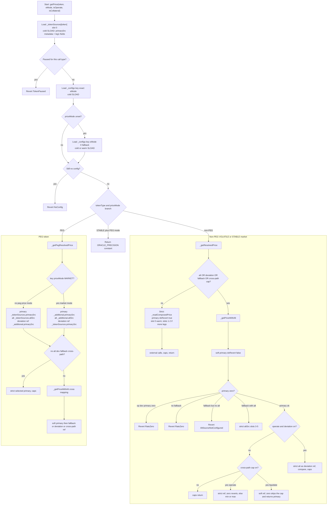

# FluidUsdOracle — price resolution flow

This document describes the runtime flow for **`getPrice()`** / **`getPriceView()`** / the price part of **`getPriceDetailed()`**. It complements [`SPEC.md`](./SPEC.md).

## How to view this file

| Where | Mermaid diagrams |
|--------|------------------|
| **GitHub** | Renders Mermaid in `.md` files in the repo browser, PR descriptions, and issues. |
| **Cursor / VS Code** | Open preview (Markdown preview) — Mermaid often renders via built-in or extension support. |
| **Always works** | Paste the fenced `mermaid` block into [Mermaid Live Editor](https://mermaid.live/). |

If a diagram does not render in your viewer, use the link above.

## Legend

- **`cold SLOAD`** — first read of that storage slot in this call (EVM: first touch can be more expensive).
- **`warm SLOAD`** — same slot read again later in the same call (typically cheaper).
- **`external call`** — Chainlink `latestRoundData()` or Fluid capped-rate getters; **not** an `SLOAD`.
- Passing a **`storage` reference** (e.g. to `_readComposedPrice`) is **not** an `SLOAD` by itself; reads happen when fields are accessed.
- **Slot indices** below are **0-based** (same as EVM storage offsets and `vm.load(base + n)`).

## High-level flow (Mermaid)

GitHub’s Mermaid parser is strict: **do not use backticks or `==` inside node labels** (they cause “Lexical error”). Use plain text; see `SPEC.md` for exact symbol names.

## Slot layout (reference)

Per-token main storage **`_tokenSources[token]`** (0-based slots; see `structs.sol` / `variables.sol`):

| Slot | Contents (conceptually) |
|------|-------------------------|
| 0 | `primarySrc` leg 1 + metadata (`pauseState`, `tokenType`, `decimals`, `flagsBitmap`) |
| 1 | `primarySrc` leg 2 |
| 2 | `primarySrc` leg 3 |
| 3 | `altSrc` leg 1 + types (metadata bytes zero) |
| 4 | `altSrc` leg 2 |
| 5 | `altSrc` leg 3 |

**`_additionalTokenSources[token]`** uses the same `TokenSourceConfig` shape (`primarySrc` slots 0–2, `altSrc` slots 3–5). Metadata bytes in `primarySrc` slot 0 are **unused** (zero).

Per-key config **`_configs[key]`** is a **single contract slot** (separate from the table above): `priceMode`, caps, `maxDeviationBPS`, `flagsBitmap` (fallback).

## Code entry points

- `_getPriceImpl` — pause, key load, STABLE+PEG fast path, then `_getPegResolvedPrice` or `_getResolvedPrice` (`main.sol`).
- `_getResolvedPrice` / `_getPegResolvedPrice` — choose strict path vs `_getPriceWithAlt`.
- `_getPriceWithAlt` — soft primary, fallback on zero, optional deviation, cross-path reference, caps
  (`main.sol`). The reference leg is read at most once and serves both the deviation check and the
  cross-path cap: `_additionalTokenSources.primarySrc` for PEG, `_tokenSources.altSrc` otherwise.
- `_readComposedPrice` / `_readSource` — storage reads for each `TokenSources` bucket + external oracle calls.

For exact error codes and admin constraints, see [`SPEC.md`](./SPEC.md).
