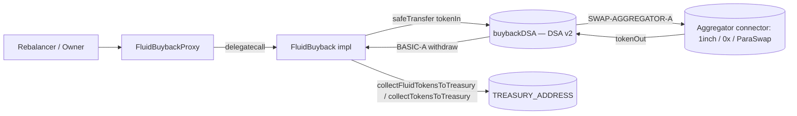

# Periphery / buyback — SPEC

## 1. Purpose

On-chain revenue sink that converts protocol fees and miscellaneous treasury tokens into **FLUID** (or, optionally, any other token) by routing swaps through an **Instadapp DSA v2** controlled by the contract, then lets the DSA withdraw the output back into the buyback contract for onward delivery to the treasury.

The module is deliberately thin:

- It does **not** burn FLUID — bought tokens are later moved to `TREASURY_ADDRESS` by a rebalancer call.
- It is **not** oracle-guarded — MEV / slippage protection is entirely via the caller-supplied `minBuyAmount_` and the permissioned rebalancer set.
- It is **not** rate-limited — there is no per-window cap on swap amounts.

Implemented as a UUPS-upgradeable singleton on mainnet:

| Contract | File | Role |
| --- | --- | --- |
| `FluidBuyback` | `main.sol` | Logic. UUPS implementation. |
| `FluidBuybackProxy` | `proxy.sol` | `ERC1967Proxy` wrapper (user-facing address). |
| `Variables` / `Constants` | `variables.sol` | Storage layout + hardcoded constants. |
| `Events` | `events.sol` | Event declarations. |
| `IDSA`, `IInstaIndex` | `interfaces.sol` | Minimal external interfaces. |

## 2. Architecture & Flow

Per `swap()`:

1. Rebalancer submits `(tokenIn, tokenOut, sellAmount, minBuyAmount, swapConnectors[], swapCalldatas[])`.
2. Impl snapshots its pre-balance of `tokenOut`.
3. Impl sends `sellAmount` of `tokenIn` (or native ETH) to its **own DSA**.
4. Impl calls `buybackDSA.cast([SWAP-AGGREGATOR-A, BASIC-A], [swap(...), withdraw(tokenOut, max, this, 0, 0)], address(this))`.
5. `buyAmount = balanceAfter - balanceBefore`. Reverts if `< minBuyAmount_`.
6. Emits `LogBuyback` if `tokenOut == FLUID`, else `LogTokenSwap`.

Funds delivery to the treasury is a **separate call** (`collectFluidTokensToTreasury` by any rebalancer; `collectTokensToTreasury` by owner).

## 3. External Interactions

| Target | Purpose | Privilege used |
| --- | --- | --- |
| `INSTA_INDEX_CONTRACT` = `0x2971AdFa57b20E5a416aE5a708A8655A9c74f723` | `build(this, 2, this)` in `initialize` — creates DSA v2 owned by impl. | None. One-shot at init. |
| `buybackDSA` (DSA v2 account) | `cast(targets, datas, origin)` per swap. | Owner of the DSA. |
| `SWAP-AGGREGATOR-A` connector | Off-chain-chosen aggregator (1inch / 0x / ParaSwap / …) selected per call via `swapConnectors_[]` + `swapCalldatas_[]`. | — |
| `BASIC-A` connector | `withdraw(token, max, recipient=this, 0, 0)` — pulls `tokenOut` from DSA back to impl. Handles native + ERC-20. | — |
| `FLUID_TOKEN_ADDRESS` = `0x6f40d4A6237C257fff2dB00FA0510DeEECd303eb` | ERC-20 destination of primary buyback path. | — |
| `TREASURY_ADDRESS` = `0x28849D2b63fA8D361e5fc15cB8aBB13019884d09` | Ultimate recipient of collected FLUID / other tokens. | — |

All token movements use `SafeTransfer.safeTransfer` / `safeTransferNative` (50 k gas stipend for native).

## 4. Roles & Access Control

| Role | Source | Capabilities |
| --- | --- | --- |
| Owner | `OwnableUpgradeable._owner` (slot 51) | `updateRebalancer`, `collectTokensToTreasury`, `_authorizeUpgrade` (UUPS). `renounceOwnership` is disabled. |
| Rebalancer | `rebalancers[addr] == true` | `swap`, `collectFluidTokensToTreasury`. Set by owner at init or later via `updateRebalancer`. |
| Anyone | — | Read-only views (`rebalancers`, `buybackDSA`). May also `receive()` native ETH into the contract. |

No guardians, no pause, no oracle — the only on-chain guard on swap pricing is the rebalancer-supplied `minBuyAmount_`.

## 5. Storage / State

Layout in `Variables` (`variables.sol`); upgradeable, so the gap pattern of `Initializable` + `OwnableUpgradeable` is respected.

| Slot | Name | Type | Meaning |
| --- | --- | --- | --- |
| 0 | `_initialized`, `_initializing` | `uint8`, `bool` | `Initializable`. |
| 1–50 | `__gap` | `uint256[50]` | `ContextUpgradeable`. |
| 51 | `_owner` | `address` | `OwnableUpgradeable`. |
| 52–100 | `__gap` | `uint256[49]` | `OwnableUpgradeable`. |
| 101 | `_status` | `uint8` | Reentrancy: `1` open, `2` closed. Set to `2` in impl constructor so only delegatecalls run; set to `1` at end of `initialize`. |
| 101 (cont.) | `rebalancers` | `mapping(address => bool)` | Rebalancer set. |
| 102 | `buybackDSA` | `IDSA` (address) | DSA v2 instance built at init. |

Constants (not storage): `INSTA_INDEX_CONTRACT`, `ETH_ADDRESS` (sentinel `0xEeee…EEeE`), `FLUID_TOKEN_ADDRESS`, `TREASURY_ADDRESS`.

## 6. Public Capabilities

### Swap / buyback

| Method | Auth | Notes |
| --- | --- | --- |
| `swap(tokenIn, tokenOut, sellAmount, minBuyAmount, swapConnectors[], swapCalldatas[])` | `onlyRebalancer`, `nonReentrant` | Sends `tokenIn` (ERC-20 or native sentinel) to DSA, runs `SWAP-AGGREGATOR-A` + `BASIC-A` via `cast`, checks balance delta ≥ `minBuyAmount_`. Emits `LogBuyback` when `tokenOut == FLUID`, else `LogTokenSwap`. |

### Treasury delivery

| Method | Auth | Notes |
| --- | --- | --- |
| `collectFluidTokensToTreasury(amount)` | `onlyRebalancer`, `nonReentrant` | Moves `amount` FLUID to `TREASURY_ADDRESS`. Hardcoded to FLUID only. |
| `collectTokensToTreasury(token, amount)` | `onlyOwner`, `nonReentrant` | Moves any token (or native ETH via sentinel) to `TREASURY_ADDRESS`. Rescue path + non-FLUID sweeps. |

### Receive

- `receive() external payable {}` — must exist so `BASIC-A`'s `withdraw` can return native ETH to the impl after an ETH-out swap.

## 7. Admin Capabilities

| Method | Auth | Behaviour |
| --- | --- | --- |
| `initialize(owner, rebalancers[])` | `initializer`, `validAddress(owner)` | One-shot. Transfers ownership, marks all `rebalancers_[i]` active (emitting `LogUpdateRebalancer`), calls `INSTA_INDEX_CONTRACT.build` to create `buybackDSA`, sets `_status = 1`. |
| `updateRebalancer(addr, isActive)` | `onlyOwner`, `nonReentrant` | Toggle. Emits `LogUpdateRebalancer`. |
| `collectTokensToTreasury(token, amount)` | `onlyOwner`, `nonReentrant` | See §6. |
| `_authorizeUpgrade(newImpl)` | `onlyOwner` | UUPS gate. No further checks; owner is solely trusted for upgrade. |
| `renounceOwnership()` | `onlyOwner` + revert | Permanently disabled; always reverts `RenounceOwnershipUnsupported`. |

## 8. Events

- `LogBuyback(tokenIn, tokenOut, sellAmount, buyAmount)` — swap where `tokenOut == FLUID`.
- `LogTokenSwap(tokenIn, tokenOut, sellAmount, buyAmount)` — any other swap routed through this contract.
- `LogUpdateRebalancer(rebalancer, isActive)` — rebalancer set membership change.
- `LogCollectFluidTokensToTreasury(amount)` — FLUID pushed to treasury.
- `LogCollectTokensToTreasury(token, amount)` — any token (or ETH) pushed to treasury.

No event is emitted for `initialize` (the rebalancer events fire per entry) or for upgrades (ERC1967 emits its own `Upgraded`).

## 9. Errors

| Name | When |
| --- | --- |
| `BuybackContract__AddressZero` | `validAddress` modifier (only applied to `owner_` in `initialize`). |
| `BuybackContract__NotOwner` | Inherited from `OwnableUpgradeable` semantics (the contract itself re-declares the selector). |
| `BuybackContract__NotRebalancer` | Caller not in `rebalancers` for `swap` / `collectFluidTokensToTreasury`. |
| `BuybackContract__AlreadyInitialized` | Declared for symmetry; `initializer` modifier on `initialize` performs the actual revert via `Initializable`. |
| `BuybackContract__ETHTransferFailed` | Declared; in practice native-transfer failures revert inside `SafeTransfer.safeTransferNative` as `FluidSafeTransferError(71002)`. |
| `BuybackContract__LessAmountReceived` | `swap`: balance delta `< minBuyAmount_`. |
| `BuybackContract__RenounceOwnershipUnsupported` | `renounceOwnership` always. |
| `BuybackContract__Reentrancy` | `nonReentrant` guard tripped. |

Reverts from underlying `SafeTransfer` bubble up as `FluidSafeTransferError(71001|71002)`. Swap failures inside DSA `cast` bubble up from the connector (1inch / 0x / ParaSwap / BASIC-A) unmodified.

## 10. Invariants & Safety

- **Slippage guard is scalar-only.** The sole on-chain price check is `buyAmount_ >= minBuyAmount_`. There is **no oracle**, so `minBuyAmount_` must be set by a trusted off-chain pricer; a compromised rebalancer can extract value up to the difference between true quote and its chosen bound.
- **MEV posture.** Swaps are broadcast via a known DSA address with deterministic calldata structure; rebalancers should submit through private relays or with tight bounds. The `nonReentrant` lock prevents callback-driven balance-skew attacks from the aggregator path.
- **Balance-delta accounting** (snapshot → cast → delta) is the canonical output measurement. Pre-existing idle balance of `tokenOut` in the impl does not inflate the measured `buyAmount_`. Any airdropped `tokenOut` received **during** the `cast` (before final balance read) would be counted — rebalancer responsibility.
- **DSA ownership bootstrap.** `buybackDSA` is built in `initialize` with the impl as both owner and origin. Until `initialize` runs the impl cannot swap; once run, only the impl can `cast` against the DSA. An upgrade that changes impl code still owns the same DSA (it lives at the proxy address for ownership, but the DSA was built with `owner_ = address(this)` where `this` is the proxy at init).
- **Reentrancy.** Impl constructor sets `_status = ENTERED = 2` so direct calls to the logic contract cannot pass `nonReentrant`; the proxy sets it to `NOT_ENTERED = 1` at the end of `initialize`. Every mutating public method (`swap`, `collect*`, `updateRebalancer`) carries `nonReentrant`. `_authorizeUpgrade` does not — UUPS upgrade path is intentionally outside the reentrancy gate.
- **Rescue path.** `collectTokensToTreasury` lets owner drain any stuck token (including native ETH and FLUID, though rebalancers already handle FLUID). There is no user-deposit semantics to violate.
- **Upgradeability.** UUPS with `_authorizeUpgrade` = `onlyOwner`. The impl disables initializers in its constructor, so a direct call to the impl cannot be initialized by a squatter (OpenZeppelin UUPS-init advisory).
- **No pause.** The module has no pause switch; emergencies are handled by revoking all rebalancers + pausing upgrades (owner holds key).
- **Native-ETH stipend.** All native transfers go through `SafeTransfer.safeTransferNative` (50 k gas). `TREASURY_ADDRESS` and `buybackDSA` must accept within that budget — both currently do.

## 11. Trust Model

- **Owner** is the root of trust. It can:
  - Upgrade the implementation (UUPS) — effectively unlimited privilege.
  - Rotate the rebalancer set.
  - Sweep any token to `TREASURY_ADDRESS` (hardcoded, so owner cannot redirect funds elsewhere **without** an upgrade).
  - Cannot renounce ownership (safety against accidental lock-out).
- **Rebalancer** is a hot operator tier:
  - Can execute swaps with arbitrary aggregator calldata; `minBuyAmount_` is their only enforced bound.
  - Can deliver already-bought FLUID to the treasury. Cannot redirect non-FLUID tokens.
  - Compromise is bounded by idle balances on the impl + whatever `sellAmount_` per call, scaled by the looseness of `minBuyAmount_`.
- **Hardcoded sinks.** `TREASURY_ADDRESS` and `FLUID_TOKEN_ADDRESS` are baked into bytecode; changing them requires a UUPS upgrade. This is intentional: it bounds owner + rebalancer abuse to the well-known treasury.
- **DSA as isolation boundary.** Using a per-contract DSA means aggregator bugs, leftover approvals, or malicious connector code operate against DSA's balance sheet, not directly against the buyback contract. The impl only exposes to the DSA what it sends in for the current call.
- **Rebalancer ≠ oracle.** Offline pricing, aggregator selection, and MEV protection are delegated entirely to rebalancer tooling. The audit scope for this contract explicitly does **not** cover connector correctness or aggregator routing.

## 12. Deployment / Audit Notes

Deployment (mainnet only, at time of writing):

- `FluidBuybackImplementation` — `0xC27293043EF9B6c911AEf47e4A563baE8a91654f`.
- `FluidBuybackProxy` — `0x9Afb8C1798B93a8E04a18553eE65bAFa41a012F1`, `ERC1967Proxy(impl, 0x)`. `initialize` is called separately post-deploy.

Steps:

1. Deploy `FluidBuyback` logic (constructor disables initializers; sets `_status = ENTERED`).
2. Deploy `FluidBuybackProxy(logic, "")`.
3. Call `proxy.initialize(owner, rebalancers[])`:
   - Transfers ownership.
   - Flips rebalancer bits, emits `LogUpdateRebalancer` per entry.
   - Builds the DSA v2 via `INSTA_INDEX_CONTRACT.build(proxy, 2, proxy)`.
   - Opens reentrancy lock.
4. Off-chain: fund the proxy with protocol fees (pull from relevant fee collectors), or let the rebalancer pull + push in a single batch.

Audit-relevant knobs:

- **No slippage oracle** — enforce `minBuyAmount_` discipline and rebalancer-operator quality in review.
- **Connector allow-listing** is *not* on-chain; `SWAP-AGGREGATOR-A` is hardcoded but the `swapConnectors_[]` inside its `swap(string[], bytes[])` call are arbitrary. If Instadapp's SWAP-AGGREGATOR-A is replaced with a malicious version at the connector-registry layer, the buyback is exposed. This is a trust-in-Instadapp assumption.
- **No reentrancy on `_authorizeUpgrade`** — deliberate; UUPS pattern.
- **No chain other than mainnet**; any L2 redeploy must re-verify `INSTA_INDEX_CONTRACT`, `FLUID_TOKEN_ADDRESS`, and `TREASURY_ADDRESS` per chain.
- **Owner upgrade key** — review multisig custody. Upgrade power > swap power > collect power.
