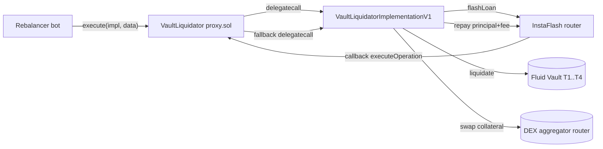

# Periphery / liquidation — SPEC

## 1. Purpose

Off-chain-triggered, **flash-loan-backed liquidation wrappers** around Fluid vaults. A rebalancer bot:

1. flash-borrows the vault's debt token from Instadapp FLA (routed to Aave / Balancer / Morpho / Maker),
2. calls `liquidate` on the target Fluid vault to seize collateral at a discount,
3. swaps the collateral back to the debt token via a DEX aggregator,
4. repays the flash loan (+ fee) and keeps the profit inside the wrapper.

All Fluid vault types (T1/T2/T3/T4) are supported, plus a "dust" path for self-funded liquidations without a flash loan. The wrappers are **not** part of the trust-minimised core — they are profit-capturing periphery operated by Instadapp.

The one exception is the permissioned-stack implementation, which is **T1-only** — see the `VaultLiquidatorImplementationV1Permissioned` row below.

Two generations exist:

| Contract | File | Scope |
| --- | --- | --- |
| `VaultT1Liquidator` | `main.sol` | Legacy, **T1-only**, single hardcoded flow. |
| `VaultLiquidator` | `proxy.sol` | Generic proxy — holds funds & auth, delegates execution to a whitelisted implementation. |
| `VaultLiquidatorImplementationV1` | `implementations/implementationsV1.sol` | Current implementation. Covers T1–T4, flash-loan liquidation + self-funded dust liquidation. |

Core vault semantics and the `liquidate` interface live in [`../../protocols/vault/SPEC.md`](../../protocols/vault/SPEC.md).

## 2. Architecture & Flow

Per-liquidation sequence (proxy + V1 impl):

1. Bot calls `VaultLiquidator.execute(impl, abi.encodeCall(liquidation, (params)))`. Proxy stores `_implementation = impl`, delegatecalls into `liquidation`.
2. `liquidation` validates (`expiration`, `topTick` sanity) and asks FLA for a flash loan in the vault's debt token.
3. FLA calls back `executeOperation` on the **proxy** address; proxy's `fallback` sees `_implementation != DEAD_ADDRESS` and delegatecalls the implementation's `executeOperation`.
4. Implementation approves vault, calls vault-type-specific `liquidate(...)`, receives collateral.
5. If `swapToken != flashloanToken`, it approves the aggregator and `Address.functionCallWithValue`s into `swapRouter` with pre-built `swapData` — turning collateral back into debt token.
6. Implementation repays `amounts[0] + premiums[0] + 10` to FLA (wraps ETH → WETH if needed).
7. Control returns to `execute`; proxy clears `_implementation = DEAD_ADDRESS`. Residual profit stays in the proxy.

Dust path (`liquidateDust`): same as above, minus steps 2, 5, 6 — proxy must already hold the debt token; no swap; no flash-loan accounting. Useful when leftover dust from a prior liquidation covers the repay.

Legacy `VaultT1Liquidator` collapses all of this into a single monolithic contract (no proxy / impl split).

## 3. External Interactions

- **Fluid Vault** (`IFluidVaultT1..T4`): `liquidate(...)` — each vault type has a different signature; impl branches on `vaultType ∈ {1,2,3,4}`. Reads `readFromStorage(0)` to sanity-check current top tick.
- **InstaFlash (`InstaFlashInterface.flashLoan`)**: routes to Aave / Balancer / Morpho / Maker by `route` id. The router then calls back `executeOperation` (Aave-v2-shaped signature). Premiums vary by route.
- **WETH9**: `deposit` / `withdraw` for ETH ⇄ WETH bridging when the flash loan is in WETH but vault expects native ETH (or vice-versa).
- **DEX aggregator router** (1inch / Paraswap / 0x / Odos / Kyber / CowSwap / etc.): arbitrary `swapData` + `swapApproval` passed in by the bot. Called via `Address.functionCallWithValue`. **The wrapper never constructs swap routes on-chain.**
- Native ETH is accepted (`receive()`); `ETH_ADDRESS = 0xEee...EEeE` is the sentinel for native throughout.

## 4. Roles & Access

Permissionless liquidation is **not** supported — these wrappers are operated by Instadapp and hold profit.

| Role | Granted via | Can |
| --- | --- | --- |
| `owner` (solmate `Owned`) | Constructor / `setOwner` | Toggle rebalancers, toggle implementations, `spell` arbitrary delegatecalls, `withdraw` tokens/ETH. |
| `rebalancer[addr] = true` | `toggleRebalancer` | Call `execute` (proxy) / `liquidation` (legacy). Cannot withdraw. |
| `implementation[addr] = true` | `toggleImplementation` | Be used as delegatecall target by the proxy. |

`execute` requires both `isRebalancer` (caller) and `isImplementation(impl)` (target). Every external method that mutates value is behind one of these modifiers.

The legacy `VaultT1Liquidator` has the same rebalancer + owner split but no implementation registry.

## 5. Storage / State

### `VaultLiquidator` (proxy)

| Slot | Purpose |
| --- | --- |
| `_implementation` (address, private) | Transient pointer for the in-flight delegatecall. Default `DEAD_ADDRESS`. |
| `rebalancer` (mapping) | Rebalancer whitelist. |
| `implementation` (mapping) | Implementation whitelist. |
| `owner` (inherited from `Owned`) | Admin. |

Token / ETH **balances** live on the proxy — the impl is stateless (`VaultLiquidatorImplementationV1` has only immutables: `FLA`, `WETH`, `ADDRESS_THIS`).

### `VaultT1Liquidator` (legacy)

Single `rebalancer` mapping + inherited `owner`. No implementation split. Immutables `FLA`, `WETH`.

## 6. Public Capabilities

### Liquidation (rebalancers, via delegatecall through proxy)

| Method | Path | Purpose |
| --- | --- | --- |
| `liquidation(LiquidationParams)` | Flash-loan → `liquidate` → swap → repay | Standard liquidation across T1–T4. |
| `liquidateDust(LiquidationDustParams)` | Self-funded `liquidate` only | Clear dust position using tokens already held by the proxy. No flash loan, no swap. |

`LiquidationParams` carries per-vault-type fields (`token0DebtAmt`, `token1DebtAmt`, `debtSharesMin`, `colPerUnitDebt`, `token0/1ColAmtPerUnitShares`) plus swap inputs (`swapToken`, `swapAmount`, `swapRouter`, `swapApproval`, `swapData`) and flash-loan inputs (`route`, `flashloanToken`, `flashloanAmount`). Bot builds this entirely off-chain.

Freshness guards (`_validateParams`):

- `expiration` — revert if set and past (`FluidVaultLiquidator__InvalidTimestamp`).
- `topTick` — revert if vault's current top tick exceeds the caller-asserted bound (`FluidVaultLiquidator__InvalidTopTick`). Prevents front-running the liquidation target tick.

### Flash-loan callback

`executeOperation(assets, amounts, premiums, initiator, data)` — called by FLA on the **proxy**, reaches the impl via the proxy's fallback. Rejects any caller that isn't FLA or any initiator other than `address(this)`.

### Simulation

No on-chain `simulate` helper. Rebalancer bots simulate off-chain (eth_call / tenderly) with the same `LiquidationParams`. The on-chain `_validateParams` gate exists to keep live execution consistent with the simulation.

### Legacy (`VaultT1Liquidator.liquidation`)

T1-only equivalent of the above, minus dust path, minus swap-bypass when `flashloanToken == swapToken`.

## 7. Admin Capabilities

All `onlyOwner`:

| Method | Scope |
| --- | --- |
| `toggleRebalancer(addr, bool)` | Add / remove bot keys. |
| `toggleImplementation(addr, bool)` | Register / retire implementations (proxy only). |
| `spell(targets[], calldatas[])` | Arbitrary `delegatecall` escape hatch — used for migrations, unstuck-approval fixes, emergency recovery. **Gives the owner total control.** |
| `withdraw(to, tokens[], amounts[])` | Pull profit / stuck balances out. Handles native ETH via `ETH_ADDRESS`. |
| `setOwner(addr)` (from `Owned`) | Transfer ownership. |

## 8. Events

| Event | Where |
| --- | --- |
| `Liquidated(vault, collateral, debt)` | Impl, after each successful `liquidate`. |
| `ToggleRebalancer(addr, status)` | Proxy / legacy, on toggle + constructor seeding. |
| `ToggleImplementation(addr, status)` | Proxy only. |
| `Withdraw(to, token, amount)` | Proxy / legacy, per token withdrawn. |

No explicit `ExecuteStart` / `FlashLoanReceived` events — observability is expected to come from the vault's own `LogLiquidate` event plus flash-loan-router events.

## 9. Errors

| Name | When |
| --- | --- |
| `FluidVaultT1Liquidator__InvalidOperation` | Non-rebalancer caller; wrong flash-loan sender; `initiator != address(this)`. |
| `FluidVaultT1Liquidator__InvalidImplementation` | Impl not whitelisted, or a reentrant `execute` (i.e. `_implementation != DEAD_ADDRESS`). |
| `FluidVaultT1Liquidator__InvalidFallback` | Fallback hit while no implementation is set (e.g. someone calls `executeOperation` outside an `execute` window). |
| `FluidVaultLiquidator__InvalidOperation` | Impl called directly (not via delegatecall); wrong flash-loan sender / initiator. |
| `FluidVaultLiquidator__InvalidTimestamp` | `params.expiration` elapsed. |
| `FluidVaultLiquidator__InvalidTopTick` | Current vault top tick exceeds `params.topTick`. |

## 10. Invariants & Safety Notes

- **Atomic profit-or-revert.** If the swap underdelivers vs `flashloanAmount + premium + 10`, the repay transfer reverts for insufficient balance, bubbling up and unwinding the whole call — negative-PnL liquidations cannot land.
- **`+ 10` wei dust buffer** on the repay (`amounts[0] + premiums[0] + 10`) absorbs rounding in WETH deposit paths and premium math.
- **Rebalancer-only.** Opening `execute` to the public would let anyone drain profit via an adversarial `swapData`. This is by design: the contracts hold balances, so the call surface is gated.
- **Implementation whitelist is the proxy's integrity root.** Owner-added impls inherit the proxy's full storage (via delegatecall); a malicious impl = full drain. Equivalent trust to owner.
- **Reentrancy guard on `execute`.** `isImplementation` requires `_implementation == DEAD_ADDRESS` before running, then sets it, then resets — re-entering `execute` during a flash-loan callback reverts.
- **Fallback is strict.** Only usable while an `execute` is in flight. Idle proxy with `_implementation == DEAD_ADDRESS` reverts any unknown selector.
- **No stuck tokens.** `withdraw` + `spell` handle any balance / approval the automated path might leave behind. `receive()` is open — arbitrary ETH sends are rescued via `withdraw`.
- **`swapRouter` is fully bot-controlled.** The contracts do not validate it. A rebalancer with a compromised bot could route swaps to drain balances — scoping is keyed to rebalancer-key hygiene, not on-chain policy.
- **Vault-type dispatch**: `vaultType ∈ {1,2,3,4}`. Any other value silently skips the liquidate call — `debtAmount_` / `collateralAmount_` stay zero and the repay will fail. Not a security issue (reverts), but bot must pick the right type.

## 11. Trust Model

- **Root of trust**: `owner` (the Instadapp deployer). Full control via `spell` / `withdraw` / `toggleImplementation`. Compromise = full drain of accumulated profit.
- **Rebalancer keys**: hot-wallet bot signers. Trusted to pick honest `swapData`. No ability to exfiltrate directly, but a bad route within an `execute` can leak value. Rotate often via `toggleRebalancer`.
- **No user funds at risk.** These wrappers interact with vaults as an arbitrary liquidator; a compromised wrapper can only lose Instadapp's profit balance. Vault users are protected by the vault's own liquidation auction math, not by this contract.
- **FLA dependency**: the contracts inherit FLA's route-security (Aave / Balancer / Morpho / Maker providers). `msg.sender != FLA` and `initiator != address(this)` are enforced in the callback.
- **Aggregator dependency**: bot-chosen router is called with attacker-controllable `swapData` from the bot's perspective; the vault wrapper performs no price sanity check beyond the implicit "repay must succeed".

## 12. Deployment / Audit Notes

- **Deployment order** (proxy generation):
  1. Deploy `VaultLiquidatorImplementationV1(fla, weth)`.
  2. Deploy `VaultLiquidator(owner, rebalancers[], [implV1])` — seeds impl whitelist.
  3. Bot calls `execute(implV1, ...)` thereafter.
- Legacy `VaultT1Liquidator(owner, fla, weth, rebalancers[])` is a standalone deploy — no proxy split.
- **Upgrading the liquidation logic**: deploy a new `VaultLiquidatorImplementationV*`, `toggleImplementation(new, true)`, optionally `toggleImplementation(old, false)`. Funds stay in the proxy across upgrades.
- **Replacing the proxy**: deploy fresh proxy, `withdraw` balances out of the old one, rotate bot config. The proxy has no internal upgrade hook.
- **Immutables to audit** on each impl deploy: `FLA` (InstaFlash router address per chain) and `WETH` (canonical WETH9 per chain).
- **Audit-grade concerns** are concentrated in: (a) the delegatecall proxy's `isImplementation` transient-slot mechanic, (b) the flash-loan callback auth (`msg.sender` + `initiator`), (c) `swapData` being arbitrary bytes — the invariant protecting users is the repay-or-revert shape, not any swap validation.
- **Not part of the Liquidity / Vault core audit perimeter.** These contracts are treated as external actors of the same class as any third-party liquidator bot; the core protocol must remain safe regardless of their behaviour.
