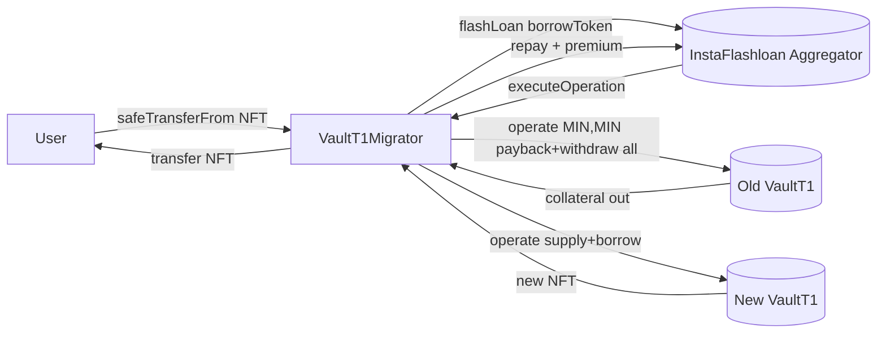

# Periphery / migration — SPEC

## 1. Purpose

Helper contract that atomically migrates a user's **Fluid Vault T1 position** (collateral + debt)
from an **old VaultT1 factory** deployment to a **new VaultT1 factory** deployment in one
transaction, without requiring the user to pre-fund the debt. The user simply transfers their
position NFT to the migrator; the migrator borrows the debt amount via an Instadapp flashloan,
closes the old position, opens an equivalent one on the new factory, repays the flashloan, and
sends the new NFT back to the user.

Single contract:

| Contract | File | Role |
| --- | --- | --- |
| `VaultT1Migrator` | `main.sol` | NFT receiver, flashloan borrower & callback, migration executor. |

## 2. Architecture & Data Flow

One migration = one user tx:

1. User calls `safeTransferFrom(user, migrator, nftId)` (optionally with `data = (route, borrowAmount)`).
2. `onERC721Received` resolves vault id, supply/borrow tokens, and destination vault, then requests a flashloan in the borrow token, sized at `borrowAmount * 150 / 100`.
3. Flashloan aggregator calls back into `executeOperation`, which:
   a. Approves / unwraps the borrow token, calls `operate(nftId, MIN, MIN, self)` on the **old** vault → closes the position, pulls out all collateral.
   b. Approves / forwards collateral, calls `operate(0, withdrawAmount, paybackAmount, self)` on the **new** vault → opens an equivalent position, mints a new NFT.
   c. Transfers the new NFT to the original owner.
   d. Wraps any ETH surplus into WETH and repays `amount + premium + 10` to the aggregator.
4. After the flashloan returns, the migrator re-checks its own new-factory NFT balance is `0` — any leftover NFT (⇒ mis-wired migration) reverts the entire user tx.

## 3. External Interactions

- **Source protocol**: `VAULT_T1_FACTORY_OLD` — the ERC-721 factory of the legacy VaultT1 deployment. Resolves NFT → vault id → vault address; `operate` with `MIN`-sentinel amounts closes the position.
- **Destination protocol**: `VAULT_T1_FACTORY_NEW` — same shape, different deployment. Same vault-id space is assumed (re-uses CREATE-nonce RLP derivation via `getVaultAddress`).
- **Flashloan provider**: `FLA` (`InstaFlashInterface`) — Instadapp flashloan aggregator. Pulled token = borrow token (WETH substituted for native ETH).
- **WETH**: unwraps/wraps only in the native-ETH branch so the old vault can be paid in ETH while the flashloan is denominated in WETH.
- **Token transfers**: supply token collateral flows `old vault → migrator → new vault`; borrow token flows `aggregator → old vault (payback)` and `migrator → aggregator (repay)`. All ERC20 interactions use `SafeERC20`.
- Storage slot 3 of the old factory is read directly (`readFromStorage`) as an `nftId → tokenConfig` mapping to recover the vault id embedded at bits `>> 192 & X32`.

## 4. Roles & Access Control

| Role | Granted by | Powers |
| --- | --- | --- |
| `owner` | `solmate/Owned` constructor arg | `setFlashloanConfig`, `spell` (arbitrary `delegatecall`), `withdraw`. |
| User | holds old-factory NFT | Initiates migration by transferring NFT to the contract. |
| `VAULT_T1_FACTORY_OLD` | — | Only allowed `msg.sender` for `onERC721Received`. |
| `FLA` | — | Only allowed `msg.sender` for `executeOperation`. `initiator` must be the migrator itself. |

No authed tier between owner and user — the contract is purely a flashloan-wrapped routing helper.

## 5. Storage / State

Immutables: `VAULT_T1_FACTORY_OLD`, `VAULT_T1_FACTORY_NEW`, `FLA`, `WETH`.

Constants: `X32 = 0xffffffff`, `ETH_ADDRESS = 0xEeee…EEeE`.

| Storage | Type | Meaning |
| --- | --- | --- |
| `owner` | `address` | Solmate `Owned`. |
| `flashloanConfig` | `address borrowToken => { amount, route }` | Per-token default flashloan size and aggregator route used when the user transfers the NFT with empty `data`. |

The contract holds **no persistent user funds**; collateral / borrow / NFTs only live on it for the duration of the flashloan callback. Any pre-existing ERC20 dust is recoverable via `withdraw`.

## 6. Public Capabilities

### Migration entry

| Capability | Caller | How |
| --- | --- | --- |
| Migrate a T1 position old→new | NFT owner | `IERC721(oldFactory).safeTransferFrom(owner, migrator, nftId)` — optional `data = abi.encode(uint256 route, uint256 borrowAmount)` to override defaults. |

Rules:

- `msg.sender` of `onERC721Received` must be the old factory.
- `operator == from` (so the direct owner is doing the transfer, not an approved third party).
- `route` must be non-zero (either from `data` or `flashloanConfig[borrowToken]`).
- Flashloan is sized at `borrowAmount * 1.5` to provide headroom for interest accrual between config-time and call-time.

### View helpers

| View | Returns |
| --- | --- |
| `vaultByNftId(nftId)` | `(vaultId, oldVaultAddress)` — reads old factory storage slot 3. |
| `vaultConfig(vault)` | `(supplyToken, borrowToken)` — from `constantsView()`. |
| `getVaultAddress(factory, vaultId)` | CREATE-derived vault address via RLP encoding of factory + nonce. |
| `calculateStorageSlotUintMapping(slot, key)` | `keccak256(abi.encode(key, slot))`. |

There is **no on-chain `preview`** of the actual migrated sizes; the `operate(MIN, MIN)` call returns the real withdraw / payback amounts, which are threaded directly into the destination `operate`.

## 7. Admin Capabilities

| Method | Auth | Behaviour |
| --- | --- | --- |
| `setFlashloanConfig(token, route, amount)` | `onlyOwner` | Sets default `(route, amount)` used when users transfer with empty `data`. Emits `SetFlashloanConfig`. |
| `spell(targets[], calldatas[])` | `onlyOwner` | **Arbitrary `delegatecall`** for each pair. Escape hatch; can mutate any storage, send ETH, call any selector on any target. |
| `withdraw(to, tokens[], amounts[])` | `onlyOwner` | Rescue path. Sends ETH (via `ETH_ADDRESS` sentinel) or ERC20 to `to`. Emits `Withdraw` per entry. |

## 8. Events

| Event | Emitted by | Purpose |
| --- | --- | --- |
| `Migrated(vaultId, owner, nft, collateral, debt)` | `executeOperation` | One per completed migration. `nft` is the **old** NFT id (new NFT id is already transferred out). |
| `Withdraw(to, token, amount)` | `withdraw` | Per-token-per-recipient rescue. |
| `SetFlashloanConfig(token, route, amount)` | `setFlashloanConfig` | Default flashloan config update. |

`spell` emits no event of its own — observability must come from the delegated target.

## 9. Errors

| Name | When |
| --- | --- |
| `FluidVaultT1Migrator__NotAllowed` | `onERC721Received` called by non-old-factory or with `operator != from`; `route == 0`; flashloan callback with wrong `msg.sender` or wrong `initiator`; migrator still holds a new-factory NFT after flashloan return. |
| `FluidVaultT1Migrator__InvalidOperation` | Declared; currently not raised by the deployed logic. |

All reverts are hard — no partial migration states are possible because everything sits inside the flashloan callback.

## 10. Invariants & Safety Notes

- **Atomicity.** The whole migration (close old + open new + NFT handoff + flashloan repay) happens inside a single flashloan callback. Any step reverting rolls back the entire user transaction — the user cannot end up with collateral held hostage or a dangling position on either side.
- **Sentinel close.** `operate(nftId, type(int256).min, type(int256).min, self)` is the VaultT1 "close-all" shorthand; the real (positive-magnitude) `withdrawAmount` / `paybackAmount` are returned by the call and forwarded into the new-vault `operate` so the new position mirrors the old one exactly.
- **NFT conservation.** Post-flashloan check `VAULT_T1_FACTORY_NEW.balanceOf(self) > 0 ⇒ revert` guarantees the new NFT was handed back to the owner; the migrator never custodies a live position across txs.
- **Dust handling.** Flashloan is oversized by 50% to survive borrow-side interest accrual between quote and execution. Any leftover ERC20 (aggregator overpaid, rounding) stays on the migrator and is recoverable via `withdraw`. ETH path wraps any positive `address(this).balance` surplus into WETH before repay.
- **ETH vs WETH.** Flashloan is always in the ERC20 form (WETH when borrow token is native ETH). The migrator unwraps via `WETH.withdraw` before the old-vault `operate`, and re-wraps leftover native ETH before repaying the aggregator.
- **Reentrancy surface.** Only two callback entry points exist (`onERC721Received`, `executeOperation`), each gated on a specific trusted caller. No user-supplied external calls between the two — the entire migration path is a straight line with auth checks at every boundary.
- **Storage-layout dependency.** `vaultByNftId` hard-codes slot 3 and bit layout `>> 192 & X32` of the old factory's `nftId → tokenConfig` mapping. Any upgrade that changes that layout breaks the migrator silently.
- **No price check.** The migrator trusts the new-factory vault with the same id to have the same supply/borrow token pair. A misconfigured new factory would either revert inside `operate` or open a wrong-shape position — mitigated operationally by the deployment checklist, not by an in-contract assertion.

## 11. Trust Model

- **User trust**: once the NFT is on the migrator, the user trusts that a migration runs to completion or reverts. No step leaves the user worse off than before transfer, assuming factory address correctness.
- **Owner trust**: the owner is **fully privileged**. `spell` is an uncapped `delegatecall` multicall that can, for example, change `owner`, drain the contract, or point the factory immutables' storage if ever repurposed via delegatecall. `withdraw` is a direct drain path. Users must treat the owner as trusted for the duration the migrator is advertised.
- **Aggregator trust**: the migrator trusts `FLA` to (a) actually loan the requested amount, (b) call back with matching `assets / amounts / premiums`, and (c) only accept `initiator == self`. A hostile aggregator could grief by demanding extra fees but cannot drain beyond what the contract holds transiently in the callback.
- **Factory trust**: both factories are trusted upstream Fluid deployments; the migrator executes `operate` with sentinel amounts and cannot defend against adversarial factory contracts.

## 12. Deployment & Audit Notes

### Deployment

1. Deploy `VaultT1Migrator(owner, fla, weth, oldFactory, newFactory)`.
2. From `owner`, call `setFlashloanConfig(token, route, amount)` for each borrow token to be supported, sized at roughly the worst-case position debt.
3. Publicise the migrator address to users for `safeTransferFrom`-based migration.

### Audit pointers

- **Single contract, single feature** — the attack surface is the two callbacks and the three owner methods.
- **Owner privilege.** `spell`'s `Address.functionDelegateCall` is the highest-risk surface; any review should confirm the owner is a multisig / timelock in practice.
- **Flashloan oversizing (50%).** Ensures solvency across interest accrual but means the migrator briefly holds excess borrow token; confirmed-safe because excess is either refunded to the aggregator in repay arithmetic or recoverable via `withdraw`.
- **Storage-slot hardcoding** (slot 3, bit 192) couples the migrator to a specific VaultFactory layout — document and re-check for every factory version pair.
- **`FluidVaultT1Migrator__InvalidOperation`** is declared but unused — either remove or wire into a real code path in a cleanup PR; not a security issue.
- **Scope**: only VaultT1→VaultT1 factory swaps. No cross-type migration (T1→T2/T3/T4) and no fToken / DEX migration logic lives here.
