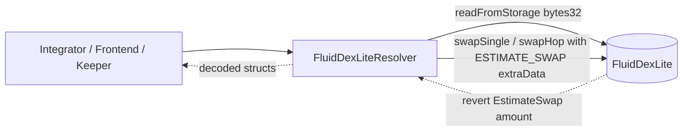

# Periphery / resolvers / dexLite — SPEC

## 1. Purpose

`FluidDexLiteResolver` is a **stateless, read-only aggregator** over the [DexLite protocol](../../../protocols/dexLite/SPEC.md). It turns the bit-packed storage that `FluidDexLite` exposes through `readFromStorage(bytes32)` into developer-friendly structs (`DexKey`, `DexVariables`, `CenterPriceShift`, `RangeShift`, `ThresholdShift`, `Prices`, `Reserves`, `DexEntireData`) and provides on-chain swap quoting by abusing the pool's `ESTIMATE_SWAP` sentinel revert.

Single contract: `contracts/periphery/resolvers/dexLite/main.sol` (`FluidDexLiteResolver`). It is **not** registered on DexLite, holds no balances, has no admin surface, and is safe to redeploy.

## 2. Architecture & Data Flow



Key files (all under `contracts/periphery/resolvers/dexLite/`):

| File | Role |
| --- | --- |
| `main.sol` | `FluidDexLiteResolver`: constructor + public view / quote methods. |
| `helpers.sol` | `Helpers`: slot math, bit-unpacking, center-price / range / threshold shift math, `_getPricesAndReserves`. Mirrors `contracts/protocols/dexLite/core/helpers.sol` without the write paths. |
| `interfaces.sol` | `IDexLite`: minimal swap + `readFromStorage` surface the resolver depends on. |
| `immutableVariables.sol` | `DEX_LITE`, `LIQUIDITY`, `DEPLOYER_CONTRACT` immutables. |
| `constantVariables.sol` | Mask / precision / sentinel constants (`ESTIMATE_SWAP`, `PRICE_PRECISION`, `FOUR_DECIMALS`, `X*` bit masks, `EXTRA_DATA_SLOT`, `LIQUIDITY_GOVERNANCE_SLOT`). |
| `structs.sol` | Response structs returned by the view methods. |

Inheritance: `FluidDexLiteResolver → Helpers → ImmutableVariables → ConstantVariables`. Slot resolution follows [`dexLiteSlotsLink.sol`](../../../libraries/dexLiteSlotsLink.sol); oracle addresses are resolved via `AddressCalcs.addressCalc(DEPLOYER_CONTRACT, nonce)`; BigNumber decoding matches [`SPEC-bigMath.md`](../../../libraries/SPEC-bigMath.md).

## 3. External Interactions

- `IDexLite.readFromStorage(bytes32)` — raw slot reads for every view path. Unauthenticated on DexLite, so the resolver never needs elevated privilege.
- `IDexLite.swapSingle / swapHop` with `extraData = abi.encode(ESTIMATE_SWAP)` — quoting paths. DexLite reverts with `EstimateSwap(uint256)`; the resolver decodes the amount from the revert blob.
- `ICenterPrice(AddressCalcs.addressCalc(DEPLOYER_CONTRACT, nonce)).centerPrice(token0, token1)` — invoked from `_calcCenterPrice` / `_getPricesAndReserves` when a pool has an oracle nonce set or an active center-price shift.
- **No Liquidity `operate` calls, no token transfers, no guardian / factory registrations.** `LIQUIDITY` is stored purely so integrators can read it back via `ConstantViews`. No on-chain consumer is expected — this is an off-chain / tooling surface.

## 4. Roles & Access Control

| Role | Capability |
| --- | --- |
| Anyone | Every public method is callable without auth. |
| Admin / governance | **None.** No owner, no auth map, no `updateX` methods, no upgradability. |
| Extra-data hook | **Never invoked.** Estimates pass `abi.encode(ESTIMATE_SWAP)` which short-circuits before `_callExtraDataSlot` transfer settlement. |

No pause switch, no emergency path. Misconfiguration at construction (`DEX_LITE` / `DEPLOYER_CONTRACT` / `LIQUIDITY`) is fixed by redeploy.

## 5. Storage Layout

The resolver holds **three immutables and nothing else** (`constantVariables.sol` values are all `constant`):

| Name | Type | Source | Meaning |
| --- | --- | --- | --- |
| `DEX_LITE` | `IDexLite` | constructor | Target `FluidDexLite` instance. |
| `LIQUIDITY` | `address` | constructor | Fluid Liquidity address (returned in `ConstantViews`). |
| `DEPLOYER_CONTRACT` | `address` | constructor | Deployer used by `AddressCalcs.addressCalc` to resolve center-price oracle nonces into addresses. |

Because the resolver has **no mutable storage slots**, there is no layout version to preserve across redeploys, and no reentrancy concern from its own state. All "state" is read fresh from `DEX_LITE` on every call.

## 6. View Groups Overview

All methods live on `FluidDexLiteResolver`; nothing mutates resolver or DexLite storage. Non-`view` methods are state-neutral but not marked `view` because they either call the pool's non-`view` shift math or decode a revert — call them via `eth_call`.

| Group | Methods | Mutability | Purpose |
| --- | --- | --- | --- |
| Pool discovery | `getAllDexes` | `view` | Enumerate initialized pools. |
| Pool state | `getDexState` | `view` | Decode packed per-pool storage. |
| Pricing & reserves | `getPricesAndReserves` | non-`view` | Live center price, range / threshold prices, real + imaginary reserves. |
| Aggregates | `getDexEntireData`, `getAllDexesEntireData` | non-`view` | One-shot bundles for UIs. |
| Quoting | `estimateSwapSingle`, `estimateSwapHop` | non-`view` | Exact-in / exact-out amount discovery without moving funds. |

## 7. Discovery & State Methods

### getAllDexes

```solidity
function getAllDexes() public view returns (DexKey[] memory)
```

Reads the `_dexesList` length from `DEX_LITE_DEXES_LIST_SLOT`, then walks three consecutive slots per entry (`token0`, `token1`, `salt`) via `_readDexKeyAtIndex`. Returns an array of `DexKey { token0, token1, salt }` that can be hashed with `keccak256(abi.encode(...))` to get a `dexId`.

### getDexState

```solidity
function getDexState(DexKey memory dexKey) public view returns (DexState memory)
```

Computes `dexId = keccak256(abi.encode(dexKey))`, reads the four packed words (`_dexVariables`, `_centerPriceShift`, `_rangeShift`, `_thresholdShift`) via `_readPoolState` / `_calculatePoolStateSlot`, and unpacks them:

| Struct | Unpacker | Fields |
| --- | --- | --- |
| `DexVariables` | `_unpackDexVariables` | `fee` (13b), `revenueCut` (7b), `rebalancingStatus` (2b), `isCenterPriceShiftActive`, `centerPrice` (40b BigNumber → uint), `centerPriceAddress` (nonce → address via `AddressCalcs`), `isRangePercentShiftActive`, `upperRangePercent` / `lowerRangePercent` (14b each), `isThresholdPercentShiftActive`, `upperShiftThresholdPercent` / `lowerShiftThresholdPercent` (7b each), `token0Decimals` / `token1Decimals` (5b each), `totalToken{0,1}AdjustedAmount` (60b each, 9-decimal). |
| `CenterPriceShift` | `_unpackCenterPriceShift` | `lastInteractionTimestamp`, `rebalancingShiftingTime`, `maxCenterPrice` / `minCenterPrice` (28b BigNumber → uint), `shiftPercentage`, `centerPriceShiftingTime`, `startTimestamp`. |
| `RangeShift` | `_unpackRangeShift` | `oldUpperRangePercent`, `oldLowerRangePercent`, `shiftingTime`, `startTimestamp`. |
| `ThresholdShift` | `_unpackThresholdShift` | `oldUpperThresholdPercent`, `oldLowerThresholdPercent`, `shiftingTime`, `startTimestamp`. |

Units match the packing described in [`contracts/protocols/dexLite/SPEC.md` §6](../../../protocols/dexLite/SPEC.md). `centerPriceAddress` is always resolved through `AddressCalcs` even when the pool has no oracle (nonce `0` → nonce-zero deploy address); integrators should distinguish "no oracle" via the `centerPrice == 0` semantics in §8.

## 8. Pricing & Reserves

### getPricesAndReserves

```solidity
function getPricesAndReserves(DexKey memory dexKey)
    public
    returns (Prices memory prices_, Reserves memory reserves_)
```

Computes the **live** view that swap math would observe:

| Field | Derivation |
| --- | --- |
| `prices_.centerPrice` | Branch on `isCenterPriceShiftActive`. Inactive + nonce `0` → stored 40-bit BigNumber. Inactive + nonce `>0` → `ICenterPrice(addressCalc(DEPLOYER_CONTRACT, nonce)).centerPrice(token0, token1)`. Active → `_calcCenterPrice` interpolates between the stored price and the oracle over the configured window. |
| `prices_.upperRangePrice` | `centerPrice * 1e4 / (1e4 - upperRangePercent)` (after `_calcRangeShifting` if `isRangePercentShiftActive`). |
| `prices_.lowerRangePrice` | `centerPrice * (1e4 - lowerRangePercent) / 1e4`. |
| Rebalance re-centering | If `rebalancingStatus` is `2` / `3`, center price is linearly rebalanced toward `upperRangePrice` / `lowerRangePrice` over `rebalancingShiftingTime`, clamped to `(minCenterPrice, maxCenterPrice)` from `_centerPriceShift`. Range prices are re-derived after the clamp. |
| `prices_.upperThresholdPrice` | `centerPrice + (upperRangePrice - centerPrice) * (100 - upperThresholdPercent) / 100` (with `_calcThresholdShifting` applied if active). |
| `prices_.lowerThresholdPrice` | `centerPrice - (centerPrice - lowerRangePrice) * (100 - lowerThresholdPercent) / 100`. |
| `reserves_.token{0,1}RealReserves` | Adjusted supplies from `_dexVariables` (9-decimal). |
| `reserves_.token{0,1}ImaginaryReserves` | `_calculateReservesOutsideRange(geometricMean, upper, token0, token1)` + real supply. If `geometricMeanPrice >= 1e27` the axes are inverted before the solve to keep the quadratic within range. |
| `prices_.poolPrice` | `token1ImaginaryReserves * 1e27 / token0ImaginaryReserves`. |

All numbers are 1e27-precision prices over 9-decimal-adjusted reserves; consumers needing token-precision reserves must re-scale by each token's decimals and `10 ** (tokenDecimals - 9)`.

### getDexEntireData / getAllDexesEntireData

| Method | Returns |
| --- | --- |
| `getDexEntireData(dexKey)` | `DexEntireData { dexId, dexKey, constantViews{LIQUIDITY, DEPLOYER_CONTRACT}, prices, reserves, dexState }` in one call. |
| `getAllDexesEntireData()` | `getDexEntireData` applied to every entry in `getAllDexes()`. |

Both are convenience wrappers for the state + pricing calls.

## 9. Quoting Methods

### estimateSwapSingle

```solidity
function estimateSwapSingle(
    DexKey calldata dexKey_,
    bool swap0To1_,
    int256 amountSpecified_
) public returns (uint256 amountUnspecified_)
```

Invokes `DEX_LITE.swapSingle` with:

- `amountLimit_` = `0` for exact-input (`amountSpecified_ > 0`) or `type(uint256).max` for exact-output (`amountSpecified_ <= 0`), so the pool's slippage check never trips.
- `to_` = `address(0)`, `isCallback_` = `false`, empty `callbackData_`.
- `extraData_` = `abi.encode(ESTIMATE_SWAP)` — the sentinel DexLite recognises.

DexLite computes the swap math, skips all token transfers, and reverts with `EstimateSwap(amountUnspecified_)`. The resolver `catch`es it, verifies the 4-byte selector matches `keccak256("EstimateSwap(uint256)")`, and `mload`s the payload at offset 36. Any other revert (`InsufficientReservesForSwap`, `SwapAmountOutOfRange`, `TokenReservesRatioTooHigh`, `InvalidSwapAmounts`, `DexNotInitialized`, ...) surfaces as `"Estimation Failed - Wrong Error"` or `"Estimation Failed - Invalid Reason"`.

### estimateSwapHop

```solidity
function estimateSwapHop(
    address[] calldata path_,
    DexKey[] calldata dexKeys_,
    int256 amountSpecified_
) public returns (uint256 amountUnspecified_)
```

Same pattern for multi-hop. Builds a per-hop `amountLimits_` array (all `type(uint256).max` for exact-output, all `0` for exact-input — DexLite treats `0` as "no lower bound" for exact-input slippage), then calls `swapHop` with `TransferParams(address(0), false, "", abi.encode(ESTIMATE_SWAP))`. Decode path is identical.

Integrators can therefore price a full path in a single `eth_call` without approvals or balances.

## 10. Errors

The resolver itself raises only three `revert` strings, all inside the quote decoders:

| Revert | When |
| --- | --- |
| `"Estimation Failed"` | `swapSingle` / `swapHop` returned normally — should never happen because DexLite always reverts on `ESTIMATE_SWAP`. |
| `"Estimation Failed - Wrong Error"` | DexLite reverted, but not with the `EstimateSwap(uint256)` selector (usually a real swap-side error like `InsufficientReservesForSwap`). |
| `"Estimation Failed - Invalid Reason"` | Revert payload shorter than 36 bytes (malformed / unexpected). |

All other reverts propagate verbatim from DexLite: `DexNotInitialized`, `SwapAmountOutOfRange`, `InsufficientReservesForSwap`, `TokenReservesRatioTooHigh`, `InvalidSwapAmounts`, `InvalidPath`, `InvalidDexKeysLength`, `InvalidAmountLimitsLength`, `Overflow`, `PowerError`, etc. View methods can additionally revert on OOG for unreasonably large `_dexesList` scans, but have no bespoke error surface.

## 11. Invariants & Safety Notes

- **Stateless and non-custodial.** No storage writes, no balances held, no approvals required. Redeploying never loses state.
- **Read-only privilege surface.** `readFromStorage` is unauthenticated on DexLite; estimates go through the `ESTIMATE_SWAP` sentinel path which reverts before any transfer / state write.
- **Layout coupling.** `_readDexKeyAtIndex`, `_calculatePoolStateSlot`, and the `_unpack*` helpers hard-code the bit offsets from [`dexLiteSlotsLink.sol`](../../../libraries/dexLiteSlotsLink.sol). If DexLite's storage layout changes, the resolver must be redeployed in lock-step — there is no runtime version check.
- **Shift math mirrors the pool.** `_calcRangeShifting`, `_calcThresholdShifting`, `_calcCenterPrice` are copies of the pool's helpers; they deliberately do **not** write back the "shift complete" flag (the pool does that on its next swap), so quotes between a shift's `endTimestamp` and the next swap still return the correct final values.
- **Oracle dependence.** Pools with a non-zero center-price nonce call `ICenterPrice.centerPrice(token0, token1)` from `getPricesAndReserves` / `getDexEntireData`. A malfunctioning oracle makes those methods revert — but `getDexState` still works because it returns only the resolved address, never invoking it.
- **No slippage safety.** `estimateSwap*` pass maximally-permissive `amountLimit_` / `amountLimits_`. They report the pool's **raw** arithmetic answer; front-ends must add their own slippage buffer before forwarding to a real swap.
- **`BigNumber` widening.** Center / min / max prices round per the pool's BigMath encoding (`(coeff >> EXP_SIZE) << (coeff & EXP_MASK)`); values can be slightly wider than user-supplied configuration — this is intended.
- **No allow-list / rate-limit.** Anyone can call every method. Heavy consumers should rely on their own RPC-layer caching. `getAllDexesEntireData` is `O(N)` over initialized pools — prefer per-pool calls or multicall batching for large lists.

## 12. Trust Model & Audit Notes

- **Trust root is DexLite itself.** The resolver inherits whatever trust assumptions apply to `FluidDexLite` (governance-controlled auths, trusted extra-data hook, trusted center-price oracles — see [`contracts/protocols/dexLite/SPEC.md` §12](../../../protocols/dexLite/SPEC.md)). It adds no guarantees and does not validate bounds on returned values.
- **Parallel math surface.** Any change in the pool's pricing / shift math must be mirrored here, or the resolver and pool will disagree by design. Auditors reviewing DexLite helpers should confirm the resolver was updated in the same PR.
- **Non-`view` markers are intentional.** `getPricesAndReserves`, `getDexEntireData`, `getAllDexesEntireData`, `estimateSwap*` are not marked `view` only because they transitively call non-`view` helpers / a non-`view` `swapSingle` / `swapHop`. They make no state changes and are safe via `eth_call`.
- **Revert-decoding is best-effort.** The estimate path depends on DexLite continuing to emit `EstimateSwap(uint256)` with exactly that signature from `core/errors.sol`. If the error is renamed or reshaped, callers will see `"Estimation Failed - Wrong Error"`.
- **No upgrade path.** No proxy, no admin. "Upgrade" means deploying a new resolver and pointing front-ends at it.

See also: [`contracts/protocols/dexLite/SPEC.md`](../../../protocols/dexLite/SPEC.md) (the pool it wraps), [`contracts/libraries/SPEC-bigMath.md`](../../../libraries/SPEC-bigMath.md) (BigNumber decoding), [`contracts/libraries/SPEC-dexCalcs.md`](../../../libraries/SPEC-dexCalcs.md) (sister math for the full DEX — DexLite reserves math is local to this folder, not shared).
