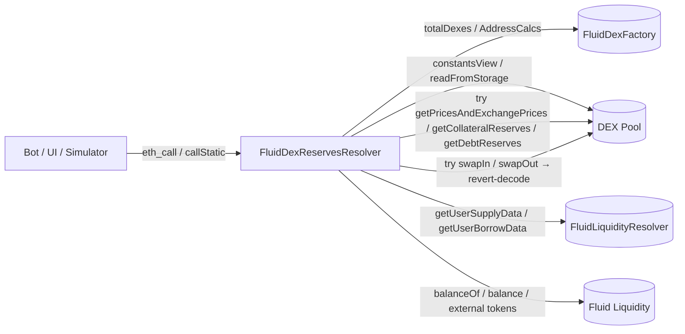

# Periphery / resolvers / dexReserves — SPEC

## 1. Purpose

Off-chain read helper that exposes Fluid DEX pool state — pool list, token pair, fee, collateral / debt *reserves* (real + imaginary), swap limits, and swap estimates — in a form convenient for arbitrage bots, liquidation bots, UIs and simulators. The resolver is stateless and view-only (some entry points are `returns`-only because they intentionally revert-and-decode internal DEX calls, so are meant to be invoked via `eth_call` / `callStatic`).

Implemented as a single contract composed from several abstract mix-ins:

| Contract | File | Role |
| --- | --- | --- |
| `FluidDexReservesResolver` | `main.sol` | Concrete resolver; aggregates pool listing, reserves, and estimates. |
| `DexFactoryViews` | `main.sol` | Pool address / count enumeration via `AddressCalcs`. |
| `DexPublicViews` | `main.sol` | Price + collateral/debt reserve readers (token-decimals and 1e12-adjusted). |
| `DexConstantsViews` | `main.sol` | `constantsView` / `constantsView2` / token pair readers. |
| `DexSwapLimits` | `main.sol` | Computes combined Liquidity-layer + DEX `DexLimits` per pool. |
| `DexActionEstimates` | `main.sol` | `estimateSwapIn` / `estimateSwapOut` via revert-and-decode. |
| `Variables` | `variables.sol` | Immutables: `FACTORY`, `LIQUIDITY`, `LIQUIDITY_RESOLVER`; constants `X10`, `X17`, `ORACLE_LIMIT = 5e16`, `NATIVE_TOKEN_ADDRESS`. |
| `Structs` | `structs.sol` | `Pool`, `PoolWithReserves`, `TokenLimit`, `DexLimits`. |

## 2. Architecture & Data Flow

Hot path for a bot snapshot: `getAllPoolsReserves()` → enumerate factory → for each pool: read `dexVariables2`, try `getPricesAndExchangePrices`, pull col/debt reserves, and compose per-token `DexLimits` from Liquidity resolver + DEX utilization bits.

## 3. External Interactions

- **Fluid DEX Factory** — `totalDexes()` and deterministic pool lookup via `AddressCalcs.addressCalc(factory, id)`.
- **DEX pool (`IFluidDexT1`)** — `constantsView()`, `constantsView2()`, `readFromStorage(DEX_VARIABLES2_SLOT)`, `getPricesAndExchangePrices()`, `getCollateralReserves(...)`, `getDebtReserves(...)`, `swapIn` / `swapOut` (invoked to `ADDRESS_DEAD` and unwound via the pool's custom error).
- **Fluid Liquidity** — direct `balanceOf` / native `balance` read for the hard liquidity-layer withdraw/borrow cap, plus `ResolverHelpers._getLiquidityExternalBalances` for protocol-held-elsewhere balances.
- **Liquidity Resolver** — `getUserSupplyData(dex, token)` / `getUserBorrowData(dex, token)` for per-token expand/borrow limits.
- Never writes state; holds no balances.

## 4. Roles & Access Control

None. Every external function is either `view` or `returns` (callable by anyone). `estimateSwapIn` / `estimateSwapOut` are `payable` so callers may pass native ETH when simulating a native swap, but since the inner DEX call is routed to `ADDRESS_DEAD` and unwound via revert, no value is ever retained. There is no owner, no governance, no pausability.

## 5. Storage Layout

Resolver is pure immutable — no mutable storage. Set at construction: `FACTORY`, `LIQUIDITY`, `LIQUIDITY_RESOLVER`. Constants: `X10 = 0x3ff`, `X17 = 0x1ffff`, `ORACLE_LIMIT = 5 * 1e16` (5%), `NATIVE_TOKEN_ADDRESS`. To repoint factory / liquidity, redeploy.

## 6. View Functions — Factory & Pool Enumeration

| Function | Mutability | Description |
| --- | --- | --- |
| `getPoolAddress(poolId)` | view | Deterministic address of a pool by id (CREATE2 via `AddressCalcs`). |
| `getTotalPools()` | view | `FACTORY.totalDexes()`. |
| `getAllPoolAddresses()` | view | Enumerates 1..totalDexes into an `address[]`. |
| `getPoolTokens(pool)` | view | `(token0, token1)` from `constantsView()`. |
| `getPoolConstantsView(pool)` | view | Full `IFluidDexT1.ConstantViews`. |
| `getPoolConstantsView2(pool)` | view | Full `IFluidDexT1.ConstantViews2` (decimals scaling). |
| `getPool(poolId)` | view | `Pool{ pool, token0, token1, fee }`. |
| `getAllPools()` | view | `Pool[]` for every deployed pool. |
| `getPoolFee(pool)` | view | Bits `[2..18]` of `dexVariables2` — fee with `1% = 10_000`. |

## 7. View Functions — Reserves & Prices

All reserve / price readers use `try` / `catch` around the inner DEX calls. Anything that can revert (pool not fully initialised, arithmetic edge case) returns a zero-filled struct rather than propagating. Because `getDexPricesAndExchangePrices` is implemented by **calling the pool's own revert-decode pattern**, the containing functions must be executed via `callStatic`.

| Function | Mutability | Description |
| --- | --- | --- |
| `getDexPricesAndExchangePrices(dex)` | `returns` (revert-decode) | Unwraps `FluidDexPricesAndExchangeRates` custom error into `PricesAndExchangePrice`. |
| `getDexCollateralReserves(dex)` | `returns` | Collateral reserves **in token decimals**. Short-circuits to zeros when `dexVariables2 & 1 == 0` (smart-col disabled). |
| `getDexCollateralReservesAdjusted(dex)` | `returns` | Same, but reserves remain in the DEX's native **1e12-adjusted** precision. |
| `getDexDebtReserves(dex)` | `returns` | Debt reserves in token decimals. Short-circuits to zeros when `dexVariables2 & 2 == 0` (smart-debt disabled). |
| `getDexDebtReservesAdjusted(dex)` | `returns` | Same in 1e12-adjusted precision. |
| `getPoolReserves(pool)` | `returns` | `PoolWithReserves` (token decimals). Includes `centerPrice`, collateral + debt reserves, fee, `DexLimits`. |
| `getPoolReservesAdjusted(pool)` | `returns` | Same, reserves 1e12-adjusted. |
| `getPoolsReserves(pools[])` / `getAllPoolsReserves()` | `returns` | Batched token-decimals form. |
| `getPoolsReservesAdjusted(pools[])` / `getAllPoolsReservesAdjusted()` | `returns` | Batched 1e12-adjusted form. |

Token-decimal normalisation multiplies each reserve field by `token{0,1}DenominatorPrecision / token{0,1}NumeratorPrecision` from `constantsView2`.

## 8. View Functions — Swap Limits & Estimates

`getDexLimits(dex)` returns a `DexLimits` combining (a) DEX utilization bits 228..247 of `dexVariables2`, (b) Liquidity-layer `maxUtilization` / `totalSupply` / `totalBorrow`, (c) per-user (`dex` as user) supply/borrow `expandPercent`/`expandDuration`/`maxBorrowLimit`, and (d) the hard cap of the Liquidity contract's **actual token balance** (including external protocol balances). For each token it produces `withdrawableTokenN` and `borrowableTokenN` as `TokenLimit{ available, expandsTo, expandDuration }`. `available` is current, `expandsTo` is the ceiling at full expansion, `expandDuration` is seconds until `expandsTo` is reached.

| Function | Mutability | Description |
| --- | --- | --- |
| `getDexLimits(dex)` | view | Combined DEX + Liquidity withdraw/borrow limits per token. |
| `estimateSwapIn(dex, swap0to1, amountIn, amountOutMin)` | `payable returns` | Simulates `swapIn` by routing to `ADDRESS_DEAD` and decoding `FluidDexSwapResult`. Returns `0` if the result would exceed available/ withdrawable/borrowable or trip the 5% `ORACLE_LIMIT` price-diff guard. |
| `estimateSwapOut(dex, swap0to1, amountOut, amountInMax)` | `payable returns` | Same pattern for exact-out. Returns `type(uint256).max` on limit/oracle-guard failure. |

## 9. Errors

Resolver never reverts with its own error type. Fallback behaviour:

- Inner reverts from pool/liquidity are swallowed by `try` / `catch` → zeroed struct is returned.
- `estimateSwapIn` / `estimateSwapOut` revert only with a plain `"No pools are enabled"` string if the target DEX has neither smart-col nor smart-debt active. Limit or oracle-guard violations surface as sentinel return values (`0` or `type(uint256).max`), not reverts.
- `getDexPricesAndExchangePrices` relies on the pool's `FluidDexPricesAndExchangeRates` selector; an unexpected revert shape returns a zero struct.

## 10. Deployment Checklist

1. Deploy the Fluid Liquidity resolver (see `contracts/periphery/resolvers/liquidity`) first.
2. `new FluidDexReservesResolver(dexFactory, liquidity, liquidityResolver)`.
3. Register the address in off-chain tooling (bots, indexer, UI). No on-chain registration or permissioning is required — the resolver reads only.
4. Front-ends and bots invoke the reserve / estimate functions through `eth_call` with `callStatic` semantics to tolerate the internal revert-and-decode pattern.

## 11. Invariants & Safety Notes

- **Pure read surface**: no state writes, no balance custody, no ETH retention (native value sent to estimate functions is never forwarded to a real pool — the inner `swapIn` / `swapOut` calls always land on `ADDRESS_DEAD` and the transaction tree is reverted).
- **Stale-snapshot tolerant**: if any underlying read reverts, the resolver returns zeros rather than bubbling; callers must treat all-zero structs as "state unavailable / pool not fully configured", not as "genuine empty pool".
- **1e12 vs token-decimals split** is intentional — bots that need uniform math across pools should use the `*Adjusted` variants; UIs that want to display user amounts should use the un-suffixed ones.
- **Limit semantics** in `getDexLimits` combine DEX utilization (which is enforced on both withdraw *and* borrow) with Liquidity-layer utilization (borrow-only) — the resolver intentionally takes the smaller of the two combined configs for the borrow side, and keeps DEX-only config for the withdraw side, matching on-chain enforcement order.
- **Price-impact guard** mirrors the DEX's 5% oracle check: `estimateSwap*` returns a sentinel when simulated price deviation exceeds `ORACLE_LIMIT`, so bots cannot mistake a would-revert swap for a profitable one.
- **Enumeration uses 1-indexed ids** via `AddressCalcs`; `getAllPoolAddresses` / `getAllPools*` iterate `1..totalDexes` in order. Deleted / redeployed pools are not possible in Fluid, so the output is dense.
- **`callStatic`-only endpoints** (all `returns`-typed non-view functions) must not be submitted as real transactions — they will succeed but waste gas and produce no effect.

## 12. Trust Model & Audit Notes

- **No trust needed in the resolver itself.** It is a passive view wrapper; integrators should pin a specific deployed address and validate its bytecode matches the reviewed source.
- **Trust is inherited from the DEX + Liquidity layer**. If the underlying pool's `getPricesAndExchangePrices`, `getCollateralReserves`, or `getDebtReserves` are wrong, this resolver will faithfully expose those wrong numbers.
- **Bot assumption pitfalls**: (a) the `available` field of `TokenLimit` is the current cap and shrinks as other users transact — not a guarantee; (b) `estimateSwap*` ignores sandwich / front-run risk and does not account for fee or oracle changes mid-block; (c) sentinel return values (`0`, `type(uint256).max`) are *not* error codes — callers must test for them explicitly.
- **Reentrancy / mutation**: none — all paths use `view` or revert-unwound calls, and the resolver holds no state that external contracts can observe.
- **Upgrade path**: replacement = redeploy. There is no storage migration concern. Old instances remain read-consistent until the underlying factory / liquidity is upgraded in a way that breaks the interface, at which point all prior resolver versions lose coverage at once.
