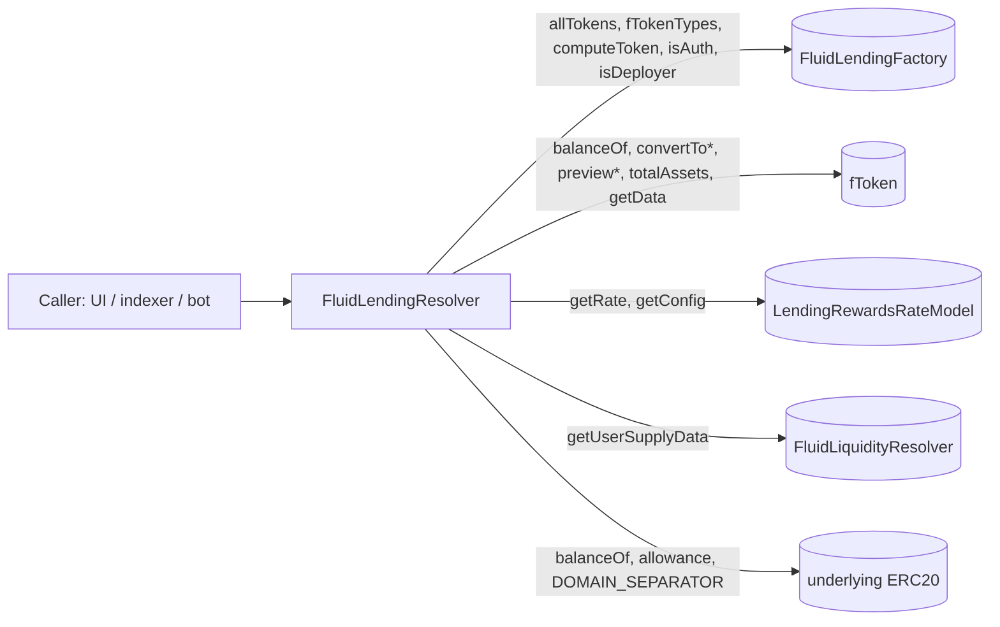

# Periphery / resolvers / lending — SPEC

## 1. Purpose

Read-only aggregator over the **Fluid Lending protocol** (fTokens). Provides a single, gas-free RPC surface (it has no state-changing entry points, so every call can be served via `eth_call`) for UIs, indexers, and bots to:

- enumerate all deployed fTokens and their supported types,
- fetch per-fToken metadata (name, symbol, decimals, underlying, native-underlying flag, EIP-2612 capability),
- compute live supply APR, rewards APR, exchange prices, and rebalance drift,
- read per-user positions (fToken share balance, underlying-asset equivalent, underlying wallet balance + allowance),
- introspect factory auth / deployer permissions and fToken internal wiring.

The resolver is **pure view**: it holds no state, no authority, and no balances. All data is re-derived on each call from the `LendingFactory`, the fToken itself, the attached rewards rate model, the sibling `LiquidityResolver`, and the underlying ERC20. It does not cache, snapshot, or persist anything.

## 2. Architecture & Data Flow

Per-call flow for `getFTokenDetails`:

1. Read `fToken.asset()` → underlying ERC20.
2. Probe `NATIVE_TOKEN_ADDRESS()` via `try/catch` to detect the `NativeUnderlying` fToken variant. On success, swap the token key to `_NATIVE_TOKEN_ADDRESS` when querying the Liquidity resolver so the right slot is hit.
3. Probe `DOMAIN_SEPARATOR()` on the underlying via `try/catch` to flag EIP-2612 support (best-effort, not authoritative).
4. Pull rewards rate via `_getFTokenRewardsData` (probes `isStaticRateModelActive()`, calls streaming `getRate` or static `getRateV2`).
5. Ask `LIQUIDITY_RESOLVER.getUserSupplyData(fToken, underlyingOrNative)` for raw Liquidity supply APR.
6. Map into explicit holder-rate fields via `_computeHolderRates`: `relativeModelRate`, `staticModelRate`, `liquidityRate`, and combined `totalRate`. Also set `rewardsActive` from `fToken.getData()` so UIs can distinguish a wired static model (`isStaticRate`) from a currently accruing program.
7. Compute `rebalanceDifference = int256(supplyAtLiquidity) − int256(totalAssets)` as a **signed** int256; negative means rewards still owed; **positive** may mean fees to withdraw when Liquidity inventory exceeds `totalAssets` (e.g. negative offset with floored holder APR vs higher Liquidity yield).
8. Pack everything into `FTokenDetails` and return — no caching, no side-effects.

## 3. External Interactions

- **Reads only.** No state-changing calls anywhere in the contract.
- `IFluidLendingFactory`: `allTokens()`, `fTokenTypes()`, `computeToken(asset,type)`, `isAuth(addr)`, `isDeployer(addr)`.
- `IFToken`: ERC4626 surface (`totalAssets`, `totalSupply`, `convertToShares`, `convertToAssets`, `balanceOf`, `preview*`) plus Fluid-specific `asset()`, `getData()`.
- `IFTokenNativeUnderlying`: probed only via `try/catch` to distinguish the WETH-backed native-ETH variant.
- `IFluidLendingRewardsRateModel`: `getRate(totalAssets)`, `getConfig()` — streaming models (static models implement these as zero stubs so legacy paths do not revert).
- `IFluidLendingStaticRateModel`: `getRateV2()`, `getStaticConfig()` — when `fToken.isStaticRateModelActive()` is true (probed via `try/catch` on older bytecode).
- `IFluidLiquidityResolver`: `getUserSupplyData(fToken, token)` for supply rate and raw deposit balance at Liquidity.
- `IERC20` / `IERC20Permit`: `balanceOf`, `allowance`, `DOMAIN_SEPARATOR` on the underlying.
- Sentinel: `_NATIVE_TOKEN_ADDRESS = 0xEee…EEeE` — used as the token key when the fToken is `NativeUnderlying`, so the Liquidity lookup hits the correct slot.

## 4. Roles & Access Control

None. Every external / public method is `view` and unauthenticated. Any caller — EOA, contract, off-chain RPC — can read anything the resolver exposes. There is no owner, no admin, no guardian, no upgrade path, no pause, and no `onlyX` modifier anywhere in the contract.

The resolver does, however, *report* on factory-level access control via `isLendingFactoryAuth(addr)` and `isLendingFactoryDeployer(addr)`; these are pure pass-throughs to `LENDING_FACTORY` and grant the resolver no powers of its own.

## 5. Storage Layout

The contract has **no mutable storage**. Only two immutables, set once in the constructor:

| Name | Type | Meaning |
| --- | --- | --- |
| `LENDING_FACTORY` | `IFluidLendingFactory` | Canonical Fluid fToken factory. Source of `allTokens`, `fTokenTypes`, auth/deployer membership, deterministic CREATE2 addresses. |
| `LIQUIDITY_RESOLVER` | `IFluidLiquidityResolver` | Sibling resolver over Fluid Liquidity; used to pull supply APR and raw supply balance for each fToken. |

Internal constant:

- `_NATIVE_TOKEN_ADDRESS = 0xEeeeeEeeeEeEeeEeEeEeeEEEeeeeEeeeeeeeEEeE` — the sentinel used at the Liquidity layer to identify native ETH. Swapped in when the fToken is detected as `NativeUnderlying`.

Constructor reverts with `FluidLendingResolver__AddressZero` if either immutable is zero. After construction no storage slots exist that governance (or anyone) can mutate.

## 6. Enumeration & Factory Views

| Method | Returns | Notes |
| --- | --- | --- |
| `getAllFTokens()` | `address[]` | All fTokens ever created by `LENDING_FACTORY`. |
| `getAllFTokenTypes()` | `string[]` | Registered type strings (e.g. `EIP2612Deposits`, `Permit2Deposits`, `NativeUnderlying`). |
| `computeFToken(asset, type)` | `address` | Deterministic CREATE2 address for a given (asset, type) pair. Does **not** check existence — may return an address of an unyet-deployed fToken. |
| `isLendingFactoryAuth(addr)` | `bool` | Factory auth membership (owner is auth by default). |
| `isLendingFactoryDeployer(addr)` | `bool` | Factory deployer membership (owner is deployer by default). |

## 7. fToken Detail Views

### Per-fToken

| Method | Purpose |
| --- | --- |
| `getFTokenDetails(fToken)` | Full `FTokenDetails` struct: address, `eip2612Deposits` flag, `isNativeUnderlying` flag, ERC20 metadata, underlying, `totalAssets`, `totalSupply`, sample `convertToShares` / `convertToAssets` (each for `10 ** decimals`), **`relativeModelRate`**, **`staticModelRate`**, **`isStaticRate`**, **`rewardsActive`**, **`liquidityRate`**, **`totalRate`** (combined holder APR), signed `rebalanceDifference`, the full `UserSupplyData` for the fToken as a Liquidity user, and **`accessType`** (`0` public / `1` permissioned; try/catch defaults to `0`). |
| `getDeploymentName()` | Factory `deploymentName()` when present (permissioned stack); empty string on production factories. |
| `getFTokenInternalData(fToken)` | Pass-through of `fToken.getData()`: liquidity contract, factory, rewards model, permit2, rebalancer, `rewardsActive_`, raw Liquidity balance, Liquidity-layer exchange price, fToken exchange price. |
| `getFTokenRewards(fToken)` | `(rewardsRateModel_, relativeModelRate_, staticModelRate_, isStaticRate_, liquidityRate_, totalRate_, rewardsActive_)` — same rate legs as `getFTokenDetails`. Streaming and static model rates are **mutually exclusive** while active. `rewardsActive_` is false after stop/natural end even if the model stays wired (`isStaticRate_` may remain true). |
| `getFTokenRewardsRateModelConfig(fToken)` | `(duration, startTime, endTime, startTvl, maxRateOrStaticRate, rewardAmount, configurator)`. Zero-filled if no rate model. Raw on-chain scale (`1e12` = 1%) for the rate field — **not** Liquidity `100` = 1%. **`maxRateOrStaticRate` is `int256`:** streaming = model ceiling (`>= 0`); static = signed Liquidity offset from `getStaticConfig().staticRate` (may be negative). Static `|offset|` ceiling: `getStaticConfig().maxRate`. Static also zeroes `startTvl` / `rewardAmount`. See [lending-f-token-breaking-changes.md](./lending-f-token-breaking-changes.md) §1.3–1.4. |
| `getPreviews(fToken, assets, shares)` | `(previewDeposit, previewMint, previewWithdraw, previewRedeem)` — passes through ERC4626 preview methods. |

### Batch

| Method | Returns | Notes |
| --- | --- | --- |
| `getFTokensEntireData()` | `FTokenDetails[]` | `getFTokenDetails` for every fToken in `allTokens()`. O(n) external calls per fToken; gas-heavy, intended for off-chain reads. |

## 8. User Position Views

| Method | Returns | Notes |
| --- | --- | --- |
| `getUserPosition(fToken, user)` | `UserPosition { fTokenShares, underlyingAssets, underlyingBalance, allowance }` | `underlyingAssets = fToken.convertToAssets(shares)` — a live snapshot, not a settled amount; will change block-to-block as the fToken exchange price accrues. `allowance` is specifically `underlying.allowance(user, fToken)` (ERC20 approval), not Permit2. |
| `getUserPositions(user)` | `FTokenDetailsUserPosition[]` | Joins `getFTokensEntireData()` with `getUserPosition(fToken, user)` for each fToken. Heavy — designed for off-chain use. |

`NativeUnderlying` quirk: for the native-ETH fToken variant, `underlyingBalance` / `allowance` read the **wrapped** ERC20 (WETH). Native-ETH balance is not part of this struct; the caller must layer it on via `user.balance`. Deposits of raw ETH go through the fToken's payable path and don't need an ERC20 allowance at all.

## 9. Errors

| Name | When |
| --- | --- |
| `FluidLendingResolver__AddressZero` | Constructor called with `lendingFactory_ == 0` or `liquidityResolver_ == 0`. |

No other custom errors. Downstream reverts propagate unchanged:

- A revert from any fToken method (`asset`, `totalAssets`, `convertTo*`, `preview*`, `getData`, …) surfaces as-is to the caller.
- A revert from the Liquidity resolver (e.g. unknown token, misconfigured fToken) surfaces as-is.
- The `try/catch` in `getFTokenDetails` deliberately catches **only** the `NATIVE_TOKEN_ADDRESS()`, `DOMAIN_SEPARATOR()`, and `ACCESS_TYPE()` probes; it does not suppress any other failure.
- `getFTokenRewards` returns zeroed rate legs when rewards are inactive or no model is set — this is a feature, not an error, and matches how the fToken itself treats the state.

## 10. Deployment Checklist

1. Ensure `FluidLendingFactory` is deployed and has at least one fToken type registered (resolver works with zero fTokens, but most callers expect a non-empty `getAllFTokens()`).
2. Deploy `FluidLiquidityResolver` (sibling) first — it must exist at a known address, as `getFTokenDetails` relies on it for `liquidityRate` and Liquidity balances.
3. Deploy `FluidLendingResolver(lendingFactory, liquidityResolver)`. Constructor reverts on any zero address; no post-deploy wiring — the contract is ready on construction.
4. Register the resolver address in deployment docs (`deployments/*.md`); UIs / indexers point to it directly.
5. No privileged setup, no guardian registration, no auth registration on Liquidity or Factory — the resolver never calls privileged methods.
6. Re-deploys are free: superseded instances can be left in place (they keep working as long as their factory + liquidity-resolver targets remain live) or simply abandoned. There is no migration / cutover procedure.

## 11. Invariants & Safety Notes

- **Pure view.** No method mutates state; no payable fallback; no delegatecall; no assembly that could bypass this.
- **No balances.** The contract never holds ETH or tokens. There is no rescue path and none is needed.
- **Best-effort capability probes.** `eip2612Deposits` returns `true` iff `DOMAIN_SEPARATOR()` on the underlying does not revert — this is a heuristic, **not** a proof the token implements the full EIP-2612 semantics. Consumers that care must verify separately.
- **Native-underlying detection** piggybacks on `NATIVE_TOKEN_ADDRESS()` existing — any future fToken variant that also exposes that selector but isn't truly native will be mis-flagged. The detection is intentionally a try/catch on a single selector, not a type registry.
- **Rebalance difference is signed.** `rebalanceDifference < 0` means the fToken has promised users more than is deposited at Liquidity — rewards still need funding via `rebalance()`. **`rebalanceDifference > 0`** may mean Liquidity inventory exceeds `totalAssets` and excess should be withdrawn via bidirectional `rebalance()` (common under static programs when the floored net holder APR trails raw Liquidity yield). Note fToken `LogRebalance(int256)` uses the **opposite** sign for the same gap (positive = rewards deposit executed; negative = fees withdrawn). UIs should surface the resolver sign as an operational-health flag, not a user-facing loss.
- **Explicit rate fields (no legacy reshaping).** All resolver APR fields — `relativeModelRate`, `staticModelRate`, `liquidityRate`, `totalRate` — use **Liquidity resolver scale (`100` = 1%)**, same as vault `supplyRateLiquidity` / `borrowRateLiquidity`. On-chain models still use `1e12` = 1%; the resolver divides by `1e10` before returning.
- **Streaming total is additive, not multiplicative.** fToken `_calculateNewTokenExchangePrice` accrues `totalReturnInPercent = rewardsReturn% + liquidityReturn%` and applies `newPrice = oldPrice × (1 + totalReturn/1e14)`. So streaming `totalRate = liquidityRate + relativeModelRate` (percentage points added). **Do not** use `liquidityRate × (1 + relativeModelRate/100)` or `liquidityRate + liquidityRate × relativeModelRate / 100` — that would mis-state holder APR. `relativeModelRate` is named for TVL-relative streaming (`yearlyReward / totalAssets`), not a multiplier on Liquidity yield. Vault magnifiers are different: `supplyRateVault = supplyRateLiquidity × magnifier / 10000`.
- **Rate field semantics:**

| Field | Streaming active | Static active | Static ended / no rewards |
|-------|------------------|---------------|---------------------------|
| `relativeModelRate` | `getRate(totalAssets) / 1e10` | `0` | `0` |
| `staticModelRate` | `0` | signed `getRateV2().rate / 1e10` (Liquidity±offset) | `0` |
| `liquidityRate` | Liquidity APR | Liquidity APR | Liquidity APR |
| `totalRate` | `liquidity + relative` | `max(0, liquidity + staticModelRate)` | `liquidityRate` |

- **Batch methods scale linearly.** `getFTokensEntireData` / `getUserPositions` do one external round-trip to every fToken + underlying + liquidity resolver. With N fTokens these are O(N) calls each and will exceed block gas limits on-chain; off-chain usage only.
- **Stale rewards rate.** `getFTokenRewards` computes rate at *current* `totalAssets`, but does not trigger any fToken accrual. It matches what a simulated `updateRates()` would return, not necessarily the last stored rate.
- **Supply rate freshness.** `liquidityRate` is Liquidity-layer `supplyRate` at query time (`100` = 1%). **`totalRate` is pre-combined in that same scale** — use it directly for display; for static-active programs it is `max(0, liquidityRate + staticModelRate)`, not `staticModelRate` alone.
- **No re-entrancy surface.** All methods are view; none call untrusted-writable paths. Cross-call consistency within a single block is trivially guaranteed.
- **Deterministic address resolution.** `computeFToken` returns the CREATE2 address whether or not the fToken has actually been deployed — callers must check `code.length > 0` or existence in `allTokens()` if that distinction matters.

## 12. Trust Model & Audit Notes

- **No trust is placed in the resolver.** It is a stateless read aggregator; compromising it is equivalent to reading the same data directly from the factory / fToken / liquidity resolver. There is no privileged state to steal, and no path that could mislead on-chain consumers into writes.
- **Off-chain-only consumer model.** All UI / indexer / bot flows treat resolver output as untrusted data that must pass their own sanity checks (e.g. re-derive `convertToAssets` from internal data if critical). On-chain contracts should **not** take resolver output as authoritative — they should call the underlying contracts directly.
- **Upgrade = redeploy.** Since the resolver holds no state and exposes no auth, governance has nothing to rotate. Improvements ship as new deployments with a new address; old resolvers continue to function until their immutable targets stop existing.
- **Audit focus points** for this contract are narrow: (a) the `try/catch` probes don't swallow unintended reverts, (b) `rebalanceDifference` casts don't overflow `int256`, (c) batch loops use `unchecked { i++ }` safely, (d) no sentinel / native-token path leaks into wrong balance lookups at the Liquidity layer.
- **Trust boundaries downstream.** Any misbehaviour in `LendingFactory`, an fToken, the `LiquidityResolver`, or an underlying ERC20 will surface in resolver output verbatim. The resolver does **not** normalize, reorder, or filter the data it aggregates.
- **Malicious underlying tokens** are a real concern for `getUserPosition` / `getFTokenDetails`: a bespoke `balanceOf` / `allowance` / `DOMAIN_SEPARATOR` could return arbitrary values, loop, or consume all gas. Because the resolver is view-only and off-chain-called, the worst case is a failed RPC call — no funds at risk.
- **Inter-fToken independence.** A revert from one fToken inside `getFTokensEntireData` / `getUserPositions` aborts the entire batch; there is no per-fToken try/catch. Callers that need partial data should iterate `getAllFTokens()` off-chain and call `getFTokenDetails` / `getUserPosition` per entry.
- **Rounding direction.** Sample `convertToShares(10**decimals)` / `convertToAssets(10**decimals)` use whatever rounding the fToken chose for its default ERC4626 implementation (typically floor). UIs doing precision math should call the fToken directly for the exact amount and direction they need.
