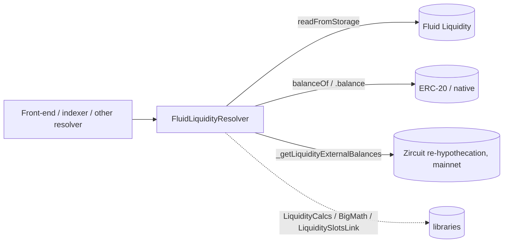

# Periphery / resolvers / liquidity — SPEC

## 1. Purpose

`FluidLiquidityResolver` is the **read-only aggregator** for the Fluid Liquidity layer. It turns Liquidity's heavily packed storage slots (exchange prices + config, rate data, total amounts, per-user supply / borrow, auths, guardians, user classes, revenue collector, status, listed tokens) into ergonomic, struct-returning views consumable by front-ends, indexers, liquidation bots, keepers, and other on-chain resolvers (`FluidVaultResolver`, `FluidDexResolver`, `FluidLendingResolver`, `FluidStETHResolver`, …).

The resolver **holds no state, no funds, no admin, and emits no events**. It is purely a view-only lens over [`Fluid Liquidity`](../../../liquidity/SPEC.md) via `readFromStorage(slot)` + `LiquiditySlotsLink` offsets + `LiquidityCalcs` + `BigMathMinified`. It is the foundation of the resolver graph — almost every other resolver composes it to reuse `OverallTokenData` / `UserSupplyData` / `UserBorrowData`.

See also: [liquidity/SPEC.md](../../../liquidity/SPEC.md), [libraries/SPEC.md](../../../libraries/SPEC.md), [resolvers/SPEC.md](../SPEC.md).

## 2. Architecture

Files (all under `contracts/periphery/resolvers/liquidity/`):

- `variables.sol` — `contract Variables`. One immutable (`LIQUIDITY`) plus bit-mask / precision constants (`X8..X64`, `EXCHANGE_PRICES_PRECISION = 1e12`, `FOUR_DECIMALS = 1e4`, `SIX_DECIMALS = 1e6`, `DEFAULT_EXPONENT_SIZE / _MASK`, `DECAY_CHECKPOINT_DURATION_SCALEDX10`, `SECONDS_PER_YEAR`).
- `structs.sol` — output structs: `RateData` (V1 kink / V2 two-kink model), `OverallTokenData`, `UserSupplyData`, `UserBorrowData`. `RateData` embeds the admin-module param structs `RateDataV1Params` / `RateDataV2Params`.
- `main.sol` — the concrete `FluidLiquidityResolver` contract; inherits `Variables`, `Structs`, and `ResolverHelpers` (for the Zircuit re-hypothecation adjustment — see [resolvers/SPEC.md §4](../SPEC.md#4-common--shared-base-inline)).
- `iLiquidityResolver.sol` — external ABI for integrators that only want to import the interface.

All decoding uses `LiquiditySlotsLink` offsets + `BigMathMinified.fromBigNumber` + `LiquidityCalcs.{calcExchangePrices,calcRevenue,calcWithdrawalLimitBeforeOperate,calcBorrowLimitBeforeOperate}`.

## 3. External reads (what it consumes)

- `IFluidLiquidity.readFromStorage(slot)` — raw storage probes:
  - scalar slots: `LIQUIDITY_STATUS_SLOT` (status), `LIQUIDITY_LISTED_TOKENS_ARRAY_SLOT` (length + keccak base for elements), slot `0` (revenue collector stored as low-160 bits of governance-proxy admin slot).
  - mapping slots (`LiquiditySlotsLink.calculateMappingStorageSlot`): `LIQUIDITY_AUTHS_MAPPING_SLOT`, `LIQUIDITY_GUARDIANS_MAPPING_SLOT`, `LIQUIDITY_USER_CLASS_MAPPING_SLOT`, `LIQUIDITY_EXCHANGE_PRICES_MAPPING_SLOT`, `LIQUIDITY_RATE_DATA_MAPPING_SLOT`, `LIQUIDITY_TOTAL_AMOUNTS_MAPPING_SLOT`, `LIQUIDITY_CONFIGS2_MAPPING_SLOT`.
  - double-mapping slots (`calculateDoubleMappingStorageSlot`): `LIQUIDITY_USER_SUPPLY_DOUBLE_MAPPING_SLOT`, `LIQUIDITY_USER_BORROW_DOUBLE_MAPPING_SLOT`.
- `IERC20(token).balanceOf(LIQUIDITY)` / `address(LIQUIDITY).balance` — for the `_NATIVE_TOKEN_ADDRESS = 0xEeeE…eEeE` pseudo-token. Used by `getRevenue` and the `withdrawable` / `borrowable` legs of the user views.
- `ResolverHelpers._getLiquidityExternalBalances(token, liquidity)` — adds re-hypothecated balances (currently Zircuit WEETH / WEETHS on mainnet) so views don't under-count when Liquidity has parked tokens in an external venue.

No external calls beyond those; the resolver never invokes a mutating path.

## 4. Roles / Access control

**None.** Every external method is callable by any address. There is no owner, guardian, auth, pause, or allow-list. Misconfigured tokens / unknown users simply return zero structs — they never revert. The only revert in normal operation is `FluidLiquidityResolver__AddressZero` (constructor) and `"not-valid-rate-version"` inside `getTokenRateData` when a non-zero `rateConfig_ & 0xF` is neither `1` nor `2` (impossible in practice — Liquidity only writes versions 1 or 2).

## 5. Storage

**No storage.** A single immutable is set at construction:

| Name | Type | Meaning |
| --- | --- | --- |
| `LIQUIDITY` | `IFluidLiquidity` | Target Liquidity contract. All reads flow through `LIQUIDITY.readFromStorage(...)` or token-balance probes against `address(LIQUIDITY)`. |

The `variables.sol` file also declares a `GOVERNANCE_SLOT` constant (`keccak256("eip1967.proxy.admin") - 1`) — kept for documentation parity with the underlying InfiniteProxy layout but not used by any method.

## 6. Public view capabilities

All functions are `view` (no `callStatic` paths here — Liquidity exposes everything via direct storage reads). Returned numbers are in token-decimal ("normal") units: `withInterest` amounts are normalised by multiplying the raw BigMath value by `supplyExchangePrice / borrowExchangePrice / 1e12`; interest-free amounts pass through unchanged.

### 6.1 Raw packed slots

Every mapping slot is exposed so integrators can do their own bit extraction when the typed views are not enough.

| Name | Inputs | Slot |
| --- | --- | --- |
| `getExchangePricesAndConfig` | `address token` | `LIQUIDITY_EXCHANGE_PRICES_MAPPING_SLOT` (prices, borrow rate, fee, last utilisation + timestamp, update-threshold, `usesConfigs2` bit). |
| `getRateConfig` | `address token` | `LIQUIDITY_RATE_DATA_MAPPING_SLOT` (version + V1/V2 curve params). |
| `getTotalAmounts` | `address token` | `LIQUIDITY_TOTAL_AMOUNTS_MAPPING_SLOT` (supply/borrow raw-interest + interest-free, all BigMath). |
| `getConfigs2` | `address token` | `LIQUIDITY_CONFIGS2_MAPPING_SLOT` (currently: low 14 bits = `maxUtilization`). |
| `getUserSupply` | `address user, address token` | double-mapping; supply amount, withdraw limit config, decay, base withdrawal limit. |
| `getUserBorrow` | `address user, address token` | double-mapping; borrow amount, borrow limit config, base / max borrow limits. |

### 6.2 Protocol-level views

| Name | Returns | Description |
| --- | --- | --- |
| `getStatus` | `uint256` | `1 = normal`, `2 = paused` (full-layer pause, set by governance). |
| `getRevenueCollector` | `address` | Stored in slot `0` of Liquidity (low 160 bits). Destination for `collectRevenue`. |
| `isAuth` | `uint256` | 1 if `auth` is allowed, else 0. |
| `isGuardian` | `uint256` | 1 if `guardian` can pause class-0 users, else 0. |
| `getUserClass` | `uint256` | `0` = pausable by guardians, `1` = governance-only (established protocols). |
| `listedTokens` | `address[]` | Reads `LIQUIDITY_LISTED_TOKENS_ARRAY_SLOT` length, then walks `keccak(slot) + i` for each element. |

### 6.3 Token views (rates, prices, utilisation, total amounts, revenue)

| Name | Inputs | Returns | Notes |
| --- | --- | --- | --- |
| `getTokenRateData` | `address token` | `RateData` | Decodes `rateConfig`: low 4 bits = version. V1 → `{rateAtUtilizationZero, kink, rateAtUtilizationKink, rateAtUtilizationMax}` (16 bits each). V2 → same plus `kink2 / rateAtUtilizationKink2`. Version `0` returns zeros (token unconfigured); other non-{1,2} reverts. |
| `getTokensRateData` | `address[] tokens` | `RateData[]` | Batch. |
| `getOverallTokenData` | `address token` | `OverallTokenData` | Flagship per-token struct: rate curve + `supplyExchangePrice` / `borrowExchangePrice` from `LiquidityCalcs.calcExchangePrices`, current `borrowRate` (bits 0-15 of exchangePricesAndConfig), revenue `fee` (14b), `lastStoredUtilization` (14b), `storageUpdateThreshold` (14b), `lastUpdateTimestamp` (33b), `maxUtilization` (`FOUR_DECIMALS` or `configs2 & X14` when `usesConfigs2` bit is set), decompressed `supply/borrowRawInterest` and `supply/borrowInterestFree` (BigMath 64b each), derived `totalSupply`/`totalBorrow` in normal units, real-time `supplyRate` (computed from stored prices so it matches borrow-rate precision), and current `revenue`. Returns all zeros for unconfigured tokens. |
| `getOverallTokensData` | `address[] tokens` | `OverallTokenData[]` | Batch. |
| `getAllOverallTokensData` | — | `OverallTokenData[]` | Shortcut: `getOverallTokensData(listedTokens())`. |
| `getRevenue` | `address token` | `uint256` | `LiquidityCalcs.calcRevenue(totalAmounts, exchangePricesAndConfig, liquidityTokenBalance)` where `liquidityTokenBalance = balanceOf(LIQUIDITY) + externalBalances`. Returns `0` when token is unconfigured (`exchangePricesAndConfig == 0`) — never reverts. |

### 6.4 User views (per user × per token)

| Name | Inputs | Returns | Notes |
| --- | --- | --- | --- |
| `getUserSupplyData` | `address user, address token` | `(UserSupplyData, OverallTokenData)` | Decodes user supply slot: `modeWithInterest` (bit 0), BigMath `supply` (64b), `withdrawalLimit` via `LiquidityCalcs.calcWithdrawalLimitBeforeOperate(userSupply, supply)`, `lastUpdateTimestamp` (33b), `expandPercent` (14b, 1e2 units), `expandDuration` (24b, seconds), `baseWithdrawalLimit` (18b BigMath), derived `withdrawableUntilLimit = max(supply - limit, 0)` and `withdrawable = min(withdrawableUntilLimit, liquidityBalance + externalBalances)`, plus the legacy-decay fields (`decayAmount` BigMath-26b, linearly interpolated for the elapsed portion of `decayDuration_`; `decayEndTimestamp = lastUpdate + decayDuration_`, where `decayDuration_ = (decayDurationCheckpoints * DECAY_CHECKPOINT_DURATION_SCALEDX10) / 10`). For `modeWithInterest`, `supply` / `withdrawalLimit` / `baseWithdrawalLimit` are pre-multiplied by `supplyExchangePrice / 1e12`. Returns empty struct if user is unconfigured. |
| `getUserMultipleSupplyData` | `address user, address[] tokens` | `(UserSupplyData[], OverallTokenData[])` | Batch same user × many tokens. |
| `getUserBorrowData` | `address user, address token` | `(UserBorrowData, OverallTokenData)` | Symmetric: `modeWithInterest`, BigMath `borrow` (64b), `borrowLimit` via `LiquidityCalcs.calcBorrowLimitBeforeOperate`, `lastUpdateTimestamp` (33b), `expandPercent` (14b), `expandDuration` (24b), BigMath `baseBorrowLimit` / `maxBorrowLimit` (18b each). Derived: `borrowLimitUtilization = maxUtilization * totalSupply / 1e4`, `borrowableUntilLimit = min(borrowLimit - borrow, borrowLimitUtilization - totalBorrow)` (both clamped ≥ 0), `borrowable = min(borrowableUntilLimit, liquidityBalance + externalBalances)`. For `modeWithInterest`, borrow fields are pre-multiplied by `borrowExchangePrice / 1e12`. Capping by `borrowLimitUtilization` prevents UIs from quoting a borrow that would push past max-utilisation (uncollected revenue counts toward balance → without this cap, `borrowable` could over-state). |
| `getUserMultipleBorrowData` | `address user, address[] tokens` | `(UserBorrowData[], OverallTokenData[])` | Batch. |
| `getUserMultipleBorrowSupplyData` | `address user, address[] supplyTokens, address[] borrowTokens` | `(UserSupplyData[], OverallTokenData[], UserBorrowData[], OverallTokenData[])` | Combined batch — supply and borrow tokens can differ; returns both overall-token arrays independently. |

### 6.5 Topic summary

| Topic | Primary methods |
| --- | --- |
| **Token rates & curves** | `getTokenRateData`, `getTokensRateData`, `getRateConfig` |
| **Exchange prices / utilisation / fees** | `getOverallTokenData`, `getOverallTokensData`, `getAllOverallTokensData`, `getExchangePricesAndConfig`, `getConfigs2`, `getTotalAmounts` |
| **Per-user supply / borrow** | `getUserSupplyData`, `getUserBorrowData`, `getUserMultiple…`, `getUserSupply`, `getUserBorrow` |
| **Withdraw / borrow limits** | fields inside `UserSupplyData` / `UserBorrowData` (`withdrawalLimit`, `withdrawableUntilLimit`, `withdrawable`, `baseWithdrawalLimit`, `borrowLimit`, `borrowableUntilLimit`, `borrowable`, `baseBorrowLimit`, `maxBorrowLimit`, `borrowLimitUtilization`) |
| **Revenue** | `getRevenue`, `getRevenueCollector`, `OverallTokenData.revenue` / `.fee` |
| **Protocol metadata** | `getStatus`, `isAuth`, `isGuardian`, `getUserClass`, `listedTokens` |

## 7. Admin / Governance

**N/A.** The resolver has no admin surface — no setters, no owner, no guardians, no upgrade path. To change behaviour (e.g. new struct fields, support for a `RateData` v3, a new re-hypothecation venue), governance redeploys the resolver with a new constructor arg and consumers re-pin the address.

## 8. Events

**None.** Pure reader.

## 9. Errors

| Error | Where | When |
| --- | --- | --- |
| `FluidLiquidityResolver__AddressZero` | constructor | `liquidity_ == address(0)` |
| `"not-valid-rate-version"` | `getTokenRateData` | decoded `version` is neither `0`, `1`, nor `2` — unreachable under Liquidity's current admin module, defensive only |

All other failure modes return zero-valued structs / default values instead of reverting. Specifically: unconfigured token (`exchangePricesAndConfig == 0`) → `getRevenue` and `getOverallTokenData` return zeros; unconfigured `(user, token)` → `getUserSupplyData` / `getUserBorrowData` return empty user struct but still populate `overallTokenData`.

## 10. Invariants

- **Stateless / no mutation.** The resolver owns no mutable storage; every public method is `view` and every returned number is deterministic given the Liquidity storage at the queried block.
- **No token balances.** The resolver never receives tokens or native ETH; no `rescueTokens` path exists and none is needed.
- **Immutable target.** `LIQUIDITY` is set in the constructor and never changes. Re-pointing at a new Liquidity requires a fresh deployment.
- **Decoder layout ≡ Liquidity layout.** Every bit offset / width used here matches the constants in `LiquiditySlotsLink` that Liquidity itself writes with (see [liquidity/SPEC.md](../../../liquidity/SPEC.md)). A change to any of those widths requires a new resolver.
- **Decimals uniformity.** All returned amounts are in token decimals; bp / percentage fields use `FOUR_DECIMALS = 1e4` (100 % = 10000, 1 % = 100); precisions on exchange prices use `EXCHANGE_PRICES_PRECISION = 1e12`. No mixed units within a struct.
- **Re-hypothecation consistency.** `withdrawable` / `borrowable` / `revenue` all use the *same* `balanceOf(LIQUIDITY) + externalBalances` formula, so moving a token into / out of the re-hypothecation venue never causes internal inconsistencies across the three fields.

## 11. Trust model

- **Consumers must pin the resolver address they depend on.** On a Liquidity storage-layout change the deployed resolver silently decodes fields wrong rather than reverting — governance deploys a fresh resolver each time and `DEPLOYMENTS.md` tracks current vs deprecated addresses.
- **Resolver trusts its `LIQUIDITY` pointer.** A resolver mis-constructed against a non-Liquidity address returns garbage; there is no runtime sanity check.
- **No authority on the protocol.** The resolver cannot pause, configure, or otherwise influence Liquidity state. Compromise of the resolver address (e.g. a phishing replacement) only poisons reads for consumers that follow the malicious pointer — Liquidity itself is unaffected.
- **Re-hypothecation surface.** `_getLiquidityExternalBalances` probes a hard-coded Zircuit address on mainnet (`block.chainid == 1`). On other chains it short-circuits to zero. If Zircuit mis-reports, `withdrawable` / `borrowable` / `revenue` mis-report by exactly that delta. Adding a new re-hypothecation venue requires a new `ResolverHelpers` and a new resolver deploy.

## 12. Deployment / audit notes

- **Constructor:** `FluidLiquidityResolver(IFluidLiquidity liquidity_)`. Reverts `FluidLiquidityResolver__AddressZero` on `liquidity_ == address(0)`.
- **Bootstrap order:** `FluidLiquidityResolver` is the first resolver a fresh chain needs — `FluidVaultResolver`, `FluidDexResolver`, `FluidLendingResolver`, `FluidStETHResolver` all compose it (see [resolvers/SPEC.md §2.4](../SPEC.md#24-cross-resolver-composition)). Deploy it immediately after Liquidity itself; deploy downstream resolvers afterwards with its address baked in as an immutable.
- **Replacing:** safe — deploy a new resolver with updated struct layout, announce the new address, update downstream resolvers (re-deploy with the new pointer), and consumers migrate. Old resolvers remain callable and correct for as long as Liquidity's layout has not diverged.
- **Audit scope:** the resolver contains no economic logic. Reviewers should focus on (i) slot / bit-offset correctness against `LiquiditySlotsLink` and Liquidity's writers, (ii) `BigMathMinified.fromBigNumber` parameter consistency with Liquidity's defaults (`DEFAULT_EXPONENT_SIZE = 8`, `DEFAULT_EXPONENT_MASK = 0xFF`), (iii) `LiquidityCalcs.calc{ExchangePrices,Revenue,WithdrawalLimitBeforeOperate,BorrowLimitBeforeOperate}` invocation order and inputs, (iv) the `withInterest` normalisation (multiply-then-divide by `EXCHANGE_PRICES_PRECISION`) for rounding behaviour on tiny positions, (v) the `borrowableUntilLimit` min between borrow-limit and utilisation-limit legs, and (vi) `ResolverHelpers._getLiquidityExternalBalances` on mainnet vs other chains.
- **No upgradeability:** not behind an `InfiniteProxy`; plain deployment.

See also:

- [liquidity/SPEC.md](../../../liquidity/SPEC.md) — the protocol being read.
- [libraries/SPEC.md](../../../libraries/SPEC.md) — `LiquiditySlotsLink`, `LiquidityCalcs`, `BigMathMinified`.
- [resolvers/SPEC.md](../SPEC.md) — resolver-layer conventions and cross-resolver composition.
