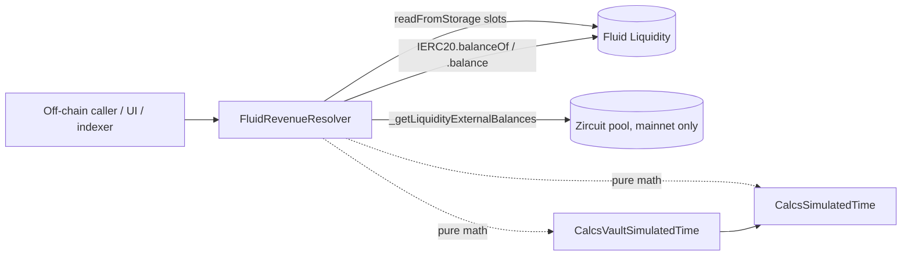

# Resolvers / revenue — SPEC

## 1. Purpose

Read-only view over the **revenue (protocol-fee) slice of Fluid Liquidity**: how much uncollected revenue is currently claimable per token, where it would be sent if collected, and the simulated-time machinery that backs off-chain historical / projected revenue dashboards.

Two jobs:

1. **Live revenue readout.** Per-token and bulk `getRevenue[s]` using the same `LiquidityCalcs.calcRevenue` formula the Liquidity admin module uses when paying out revenue, plus the revenue-collector address.
2. **Simulated-time math surface.** Pure helpers (`calcRevenueSimulatedTime`, `calcLiquidityExchangePricesSimulatedTime`, `calcVaultExchangePricesSimulatedTime`, `calcLiquidityTotalAmountsSimulatedTime`, `calcLiquidityUserAmountsSimulatedTime`) that re-run the production exchange-price / revenue math against a caller-supplied `simulatedTimestamp_`, so indexers can reconstruct the state at any historical block or project it forward without having to fork Liquidity.

Single deployed contract: `FluidRevenueResolver` (`main.sol`). Two libraries back it: `CalcsSimulatedTime` (Liquidity-layer) and `CalcsVaultSimulatedTime` (vault-layer). Both are verbatim copies of the production libs with `block.timestamp` replaced by a parameter.

## 2. Architecture & Data Flow

`FluidRevenueResolver` inherits `ResolverHelpers` (see [resolvers/SPEC.md §4](../SPEC.md)) so the Liquidity balance it feeds into `calcRevenue` includes any WEETH / WEETHS re-hypothecated into Zircuit. Without that offset, `calcRevenue` would over-report revenue for those tokens.

## 3. External Interactions

- Reads Liquidity via `LIQUIDITY.readFromStorage(slot)`:
  - `bytes32(0)` — revenue collector address (slot 0 of Liquidity).
  - `_exchangePricesAndConfig` mapping slot per token (via `LiquiditySlotsLink.calculateMappingStorageSlot`).
  - `_totalAmounts` mapping slot per token.
  - `_listedTokens` dynamic array (length at `LIQUIDITY_LISTED_TOKENS_ARRAY_SLOT`, elements at `keccak256(slot) + i`).
- `IERC20(token).balanceOf(LIQUIDITY)` or `address(LIQUIDITY).balance` for native, plus `ResolverHelpers._getLiquidityExternalBalances` for mainnet re-hypothecation offset.
- Pure math helpers are self-contained and make no external calls.

Nothing writes, nothing is held: no funds, no admin, no pausability.

## 4. Roles & Access Control

None. Every method is `public view` or `public pure` and callable by anyone. No `onlyOwner`, no auth mapping, no pausability. A malicious caller cannot harm anything; they can only waste their own gas (and even that only if they call on-chain — the intended consumer is `eth_call`).

## 5. Storage Layout

Single immutable, zero mutable storage:

| Slot | Type | Meaning |
| --- | --- | --- |
| immutable | `IFluidLiquidity LIQUIDITY` | Target Liquidity contract; set in constructor, never changes. |

Also inherits the `WEETH` / `WEETHS` / `ZIRCUIT` `constant`s from `ResolverHelpers`. Constructor reverts via the inherited zero-address check only indirectly — `FluidRevenueResolver` itself does no zero-check on `liquidity_`, trusting deployment tooling. A wrong pointer produces garbage reads, not reverts (consistent with the [resolvers/SPEC.md §6](../SPEC.md) staleness model).

## 6. Live-State View Methods

All `public view`, no auth.

| Method | Returns | Behaviour |
| --- | --- | --- |
| `getRevenueCollector()` | `address` | Reads Liquidity slot 0 and low-160-bits-casts it. The address that a future `Liquidity.collectRevenue` call would send funds to. |
| `getRevenue(token)` | `uint256 revenueAmount_` | Live uncollected revenue for a single token. Reads `exchangePricesAndConfig` and `totalAmounts` for the token, reads Liquidity's token balance (native / ERC20 branch), adds Zircuit re-hypothecation offset, then defers to `LiquidityCalcs.calcRevenue`. Returns `0` early if the token is not configured (`exchangePricesAndConfig_ == 0`). |
| `getRevenues()` | `TokenRevenue[]` | Iterates `_listedTokens`, calling `getRevenue` per entry. Returns a right-sized array of `(token, revenueAmount)` pairs. Gas scales linearly with listed-tokens count. |

`TokenRevenue` is the only struct defined on the resolver: `{ address token; uint256 revenueAmount; }`.

## 7. Pure / Raw-Input Math Methods

These accept packed `uint256`s directly (as read by a consumer from Liquidity / vault storage) and apply the same math the protocols use. They exist so indexers can batch: read *all* raw slots in one multicall, then run the math locally via a single extra `eth_call` per data point — and crucially, run that math against an arbitrary `simulatedTimestamp_` to project forward or reconstruct history.

| Method | Kind | Returns | What it computes |
| --- | --- | --- | --- |
| `calcRevenue(totalAmounts, exchangePricesAndConfig, liquidityTokenBalance)` | `view` (delegates to `LiquidityCalcs`) | `uint256` | Current-timestamp revenue from caller-supplied inputs. Returns `0` if `exchangePricesAndConfig == 0`. |
| `calcRevenueSimulatedTime(totalAmounts, exchangePricesAndConfig, liquidityTokenBalance, simulatedTimestamp)` | `pure` | `uint256` | Same formula, but `CalcsSimulatedTime.calcRevenue` uses the supplied timestamp. |
| `calcLiquidityExchangePricesSimulatedTime(exchangePricesAndConfig, simulatedTimestamp)` | `pure` | `(supplyExchangePrice, borrowExchangePrice)` | Rolls supply / borrow exchange prices forward to `simulatedTimestamp`. Returns `(0, 0)` if token unconfigured. |
| `calcVaultExchangePricesSimulatedTime(vaultVariables2, vaultRates, liqSupplyCfg, liqBorrowCfg, simulatedTimestamp)` | `pure` | `(liqSupplyExPrice, liqBorrowExPrice, vaultSupplyExPrice, vaultBorrowExPrice)` | Mirrors `Vault.updateExchangePrices`. Returns zeros if either liquidity-leg config is unconfigured. |
| `calcLiquidityTotalAmountsSimulatedTime(totalAmounts, exchangePricesAndConfig, simulatedTimestamp)` | `pure` | `(totalSupply, totalBorrow, supplyExchangePrice, borrowExchangePrice)` | Decompresses `totalAmounts` (interest-free + raw with new exchange prices applied) at the simulated timestamp. |
| `calcLiquidityUserAmountsSimulatedTime(userSupplyData, userBorrowData, liqSupplyCfg, liqBorrowCfg, simulatedTimestamp)` | `pure` | `(supply, borrow, supplyExchangePrice, borrowExchangePrice)` | Decompresses a user's packed supply / borrow BigMath-encoded amounts at the simulated timestamp. Honours the per-side `mode-with-interest` bit (bit 0): if set, raw amount is multiplied by the new exchange price; else returned as-is. `userSupplyData == 0` or `userBorrowData == 0` short-circuits to zero for that side (user not configured). |

Notes:

- `CalcsSimulatedTime` reverts `FluidCalcsSimulatedTimeInvalidTimestamp` if `simulatedTimestamp_ < lastStoredTimestamp`. Callers cannot simulate into the past of the last Liquidity update — only forward from it.
- `CalcsSimulatedTime` also reverts `FluidCalcsSimulatedTimeError(LiquidityCalcs__ExchangePriceZero)` if either exchange price in the packed slot is zero (would imply an unconfigured token slipped the `== 0` guard).
- `CalcsVaultSimulatedTime` reverts `FluidCalcsVaultSimulatedTimeError` if new liquidity exchange prices are lower than the vault's last-stored ones (invariant: liquidity prices monotonically increase).

## 8. Events

None. Pure-read resolver.

## 9. Errors

Only propagated from the libraries; the resolver itself raises none:

| Source | Selector | When |
| --- | --- | --- |
| `CalcsSimulatedTime` | `FluidCalcsSimulatedTimeError(uint256)` | `LiquidityCalcs__ExchangePriceZero` mid-math. |
| `CalcsSimulatedTime` | `FluidCalcsSimulatedTimeInvalidTimestamp()` | `simulatedTimestamp_ < lastStoredTimestamp`. |
| `CalcsVaultSimulatedTime` | `FluidCalcsVaultSimulatedTimeError()` | New liq exchange price < old stored liq exchange price. |

Unconfigured-token paths return zero structs rather than revert, matching the resolver-layer convention (see [resolvers/SPEC.md §2.6](../SPEC.md)).

## 10. Deployment Checklist

1. `FluidLiquidityResolver` / `FluidLiquidity` must already be deployed (it is the target pointer and the source of re-hypothecation addresses on mainnet).
2. Deploy `FluidRevenueResolver(liquidity)` — the only constructor argument is the Liquidity address.
3. No post-deploy wiring. No auth, no governance step. Register the address in `deployments.md`.
4. Re-deploy if any of: Liquidity storage layout changes (exchange-prices-and-config / total-amounts / listed-tokens slot offsets), vault storage layout for `vaultVariables2` / rates changes, or a new re-hypothecation venue is onboarded (requires `ResolverHelpers` update).

## 11. Invariants & Safety Notes

- **Read-only.** Cannot move funds, change config, or affect state. Worst-case bug is wrong numbers returned.
- **Staleness-on-upgrade.** All reads are slot-offset based. A Liquidity storage-layout change silently breaks output without a revert. Pin a version per Liquidity deploy and re-deploy the resolver on upgrade.
- **`liquidityTokenBalance_` must include re-hypothecation** for correct revenue accounting. The live paths (`getRevenue`, `getRevenues`) do this automatically via `_getLiquidityExternalBalances`. The raw-input paths (`calcRevenue`, `calcRevenueSimulatedTime`) put the burden on the caller to pass a balance that already includes any external stake; otherwise revenue is over-reported.
- **Simulated time is forward-only from last stored update.** Because `CalcsSimulatedTime` reverts if `simulatedTimestamp_ < lastStoredTimestamp`, to reconstruct a revenue number *before* the most recent Liquidity update an indexer must fetch the packed slots at a historical block (`eth_call` with a block tag) and then simulate forward from that block's stored timestamp.
- **Non-zero exchange price guard.** Both `getRevenue` and all raw-input methods short-circuit to zero (or zero tuples) when `exchangePricesAndConfig_ == 0`, so an unlisted token in a `getRevenues` loop produces `revenueAmount = 0` instead of reverting the whole batch.
- **Revenue formula.** `revenue = max(0, balanceOf(token) + totalBorrow - totalSupply)`, or `balanceOf(token)` if `totalSupply == 0`. This matches Liquidity's `calcRevenue` bit-for-bit; the resolver is just re-running it against current (or simulated) state.
- **No ETH / ERC-20 held.** No `rescueTokens`; none needed.

## 12. Trust Model & Audit Notes

- **No trust needed.** Pure read paths with immutable target pointer. Bugs surface as wrong off-chain numbers, not as loss of funds.
- **No governance surface.** Zero setters. Replacement (re-deploy) is the only "upgrade".
- **Math parity with protocol.** The two bundled libraries are intentional verbatim copies of `LiquidityCalcs` and the vault-helper `updateExchangePrices` — the single diff is `block.timestamp` → parameter. Auditors should diff them against the current production libraries on every revenue-resolver redeploy; any divergence beyond that single substitution is a bug.
- **Zircuit coupling on mainnet.** On `chainid == 1`, `getRevenue` for WEETH / WEETHS reads from the hard-coded Zircuit pool address. If Zircuit migrates, the resolver (and `ResolverHelpers`) must be redeployed — there is no setter.
- **Gas.** `getRevenues` is `O(listedTokens)` SLOAD-heavy (≈4 slots per token + 1 `balanceOf`); always `eth_call`, never on-chain.
