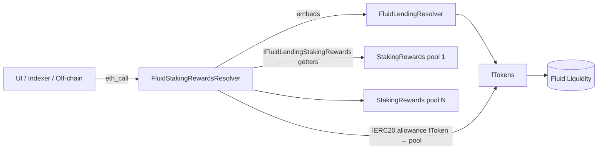

# Resolvers / stakingRewards — SPEC

## 1. Purpose

Read-only aggregator over the **fToken staking-rewards pools** (`FluidLendingStakingRewards` — a Synthetix / Uniswap `StakingRewards` fork used to distribute an ERC-20 reward to users who stake their fToken shares). Targets the pull-based per-share accrual model: `rewardPerToken` accumulates `rewardRate * Δt / totalSupply` while the campaign is live, and each staker's `earned(user)` is `balance * (rewardPerToken − userRewardPerTokenPaid) + rewards[user]`.

The resolver itself holds no such state — it wraps `IFluidLendingStakingRewards` getters into convenient structs, cross-joins them with `FluidLendingResolver` output, and exposes both per-pool and per-user views suitable for UI dashboards and off-chain reward trackers.

Target staking contract: [`contracts/protocols/lending/stakingRewards/main.sol`](../../../protocols/lending/stakingRewards/main.sol) — `FluidLendingStakingRewards` — one instance deployed per `(rewardsToken, fToken)` pair.

## 2. Architecture & Data Flow

Each call: caller passes one or more staking-pool addresses (and optionally a user address + an `underlyingToken → rewardContract` mapping). The resolver reads live getters on each pool, pairs them with `FTokenDetails` returned by `FluidLendingResolver`, and returns rich structs. No writes, no storage mutation.

## 3. External Interactions

- **`FluidLendingResolver`** (`LENDING_RESOLVER`, immutable) — called in `getUserPositions` to fetch the user's full fToken position set (`getUserPositions(user)` → `FTokenDetailsUserPosition[]`). The resolver then joins each fToken to a staking pool via the caller-supplied `underlyingTokenToRewardsMap`.
- **`IFluidLendingStakingRewards`** (each pool) — reads: `rewardPerToken`, `getRewardForDuration`, `totalSupply`, `periodFinish`, `rewardRate`, `rewardsDuration`, `rewardsToken`, `stakingToken`, `earned(user)`, `balanceOf(user)`.
- **`IERC20`** (fToken) — `allowance(user, rewardPool)` to surface whether the user has approved the staking pool to pull their fTokens for `stake`.
- **No direct Liquidity calls.** Underlying-asset accounting flows through `FTokenDetails.convertToAssets` (supplied by the lending resolver), which already bakes in the Liquidity exchange price.

No writes. The resolver is not registered as auth / guardian anywhere.

## 4. Roles & Access Control

None. Every method is externally callable by anyone. No owner, no admin, no pausable, no auth mapping. The only failure mode is constructor-time: a zero `lendingResolver_` reverts with `FluidStakingRewardsResolver__AddressZero`.

Unknown / zero `reward_` addresses are **not** errors — helpers short-circuit and return a zero-valued struct (`rewardPerToken = 0`, `totalSupply = 0`, `fToken = 0x0`, …). This keeps batch calls from poisoning a multicall when a caller passes a partially-unknown mapping.

## 5. Storage Layout

Single immutable, no mutable storage:

| Field | Type | Meaning |
| --- | --- | --- |
| `LENDING_RESOLVER` | `IFluidLendingResolver` (immutable) | Set in constructor. Used only in `getUserPositions`. |

No mappings, no counters, no ownership. Deployment is effectively static once constructed.

## 6. View Functions — Staking pool data

All `public view`. Unknown pools return zero-valued structs (no revert).

| Method | Returns | Semantics |
| --- | --- | --- |
| `getFTokenStakingRewardsEntireData(reward)` | `FTokenStakingRewardsDetails` | Full pool snapshot for one `FluidLendingStakingRewards` address. Passes through the pool's live getters — **`rewardPerToken` is the live accumulator** (i.e. projected to `block.timestamp` via `lastTimeRewardApplicable`), not the stale `rewardPerTokenStored`. `totalSupply` is total fToken staked in the pool. `periodFinish == 0` or `periodFinish < block.timestamp` ⇒ campaign idle / ended. `getRewardForDuration = rewardRate * rewardsDuration` ≈ total rewards for the current period. |
| `getFTokensStakingRewardsEntireData(rewards[])` | `FTokenStakingRewardsDetails[]` | Batch form. Empty / zero entries allowed; each zero address yields a zero struct at the same index. |

Returned `FTokenStakingRewardsDetails` fields:

| Field | Meaning |
| --- | --- |
| `rewardPerToken` | Cumulative reward per fToken-share since pool start (scaled by `1e18`), live-projected. |
| `getRewardForDuration` | `rewardRate * rewardsDuration` — roughly the total rewards for the currently-notified period. |
| `totalSupply` | Total fTokens staked in the pool. |
| `periodFinish` | UNIX seconds when the current rewards period ends. |
| `rewardRate` | Rewards per second for the current period. |
| `rewardsDuration` | Length of the current / next period in seconds. |
| `rewardsToken` | ERC-20 distributed as reward (e.g. `INST`). |
| `fToken` | Staking token (an fToken address). |

## 7. View Functions — Per-user data

| Method | Returns | Semantics |
| --- | --- | --- |
| `getUserRewardsData(user, reward, fTokenDetails)` | `UserRewardDetails` | Per-user snapshot for a single pool. `earned` uses the pool's live `earned(user)` (pending + already-accrued). `fTokenShares = balanceOf(user)` (staked fTokens). `underlyingAssets = fTokenShares * convertToAssets / 10^decimals` — converts staked shares to the underlying asset using the lending-resolver-supplied `FTokenDetails`. `ftokenAllowance = IERC20(fToken).allowance(user, reward)` — tells the UI whether the user still needs to approve before staking. |
| `getUserAllRewardsData(user, rewards[], fTokensDetails[])` | `UserRewardDetails[]` | Batch form; `rewards[i]` must align with `fTokensDetails[i]`. No bounds check beyond loop length — caller must keep the two arrays in lockstep. |
| `getUserPositions(user, rewardsMap[])` | `UserFTokenRewardsEntireData[]` | End-to-end join. Calls `LENDING_RESOLVER.getUserPositions(user)` to enumerate the user's fToken positions, then for each result looks up the matching staking pool by `underlyingToken` in `rewardsMap`. If no mapping entry matches, the staking + user-reward structs return zeros. |

Returned `UserRewardDetails` fields:

| Field | Meaning |
| --- | --- |
| `earned` | Live pending reward in `rewardsToken` units. |
| `fTokenShares` | User's staked fToken balance (shares). |
| `underlyingAssets` | Shares converted into underlying via `FTokenDetails.convertToAssets`. |
| `ftokenAllowance` | Remaining fToken allowance from `user` → `reward` pool. |

`UserFTokenRewardsEntireData` composes `FTokenDetails` + `UserPosition` (from the lending resolver) + `FTokenStakingRewardsDetails` + `UserRewardDetails` — one entry per fToken the user holds.

Helper struct `underlyingTokenToRewardsMap { address underlyingToken; address rewardContract }` is the join table the caller supplies; it is defined on the contract (not in `structs.sol`).

## 8. Events

None. Resolvers never emit.

## 9. Errors

| Error | When |
| --- | --- |
| `FluidStakingRewardsResolver__AddressZero` | Constructor called with `lendingResolver_ == address(0)`. |

No other revert paths. Unknown / zero `reward_` in the helpers short-circuits to a zero struct instead of reverting. Length-mismatched array pairs in `getUserAllRewardsData` will OOB-revert in the EVM (caller error).

## 10. Deployment Checklist

1. Deploy `FluidLendingResolver` (see [`../lending/SPEC.md`](../lending/SPEC.md)).
2. Deploy `FluidStakingRewardsResolver(lendingResolver)`.
3. Publish the resolver address in the deployment registry.
4. Off-chain consumers maintain their own `underlyingToken → FluidLendingStakingRewards` mapping (there is no on-chain registry — pools are deployed ad-hoc by governance and referenced externally).

No guardian / auth registration needed — resolvers have no privileged surface anywhere.

## 11. Invariants & Safety Notes

- **Pull-based accrual mirror.** Returned `rewardPerToken` and `earned(user)` are the pool's own live-projected values. They match what a `getReward()` tx would credit at the same block; consumers don't need to re-derive with `lastTimeRewardApplicable`.
- **Zero-address tolerance.** Passing `reward_ == 0` or an `underlyingToken` that isn't in `rewardsMap` returns a zero struct rather than reverting. This is the contract's only graceful-degradation path and is relied on by UIs that show a single table across all fTokens, some of which have no staking campaign.
- **`convertToAssets` precision.** `underlyingAssets = fTokenShares * convertToAssets / 10^decimals` follows the lending resolver's convention (`convertToAssets` is denominated in underlying per 1 full share). A stale `fTokenDetails_` (passed by the caller from a different block) would produce a drifted underlying number; always fetch `fTokenDetails` at the same block as the resolver call.
- **Array-pair correlation.** `getUserAllRewardsData(user, rewards[], fTokensDetails[])` requires the two arrays to be index-aligned; the resolver does no re-pairing.
- **No re-hypothecation awareness.** This resolver doesn't inherit `ResolverHelpers` — none of its accounting dereferences Liquidity balance directly (it flows through `convertToAssets`, which the lending layer already reconciles). No offset is needed.
- **No storage, no upgrade surface.** The only mutable state is whatever the target pools hold. The resolver itself is fully static after construction.
- **Non-existent pool edge.** Calling against an address that is not actually a `FluidLendingStakingRewards` contract returns garbage (whatever each getter happens to return) but doesn't revert — consumers must supply valid pool addresses. This matches the "pin deployment addresses" guidance in the top-level resolver spec.

## 12. Trust Model & Audit Notes

- **No trust needed at runtime.** Pure reader. A malicious deployment at this address can only return wrong numbers; it cannot move funds, change config, or affect any on-chain state. The attack surface is confined to a consumer trusting the wrong resolver address.
- **Replacement is the only upgrade path.** No owner, no setter — if `IFluidLendingStakingRewards`'s shape changes or `FluidLendingResolver`'s struct shape changes, governance redeploys this resolver and migrates integrators by publishing the new address.
- **Composition caveat.** Because this resolver embeds `FluidLendingResolver`, any staleness in that resolver (e.g. after a lending-factory upgrade with new storage) propagates here. Keep both pinned to compatible versions.
- **Off-chain registry dependency.** The `underlyingToken → reward` mapping is caller-supplied, not read from chain. A UI rendering stale or wrong pool addresses to its users is a UX bug, not a resolver safety issue — the resolver will faithfully return whatever the supplied address happens to hold.
- **No funds held, no `rescueTokens`.** As with every resolver in `contracts/periphery/resolvers/`, this contract cannot receive or forward tokens; no recovery path exists or is needed.
