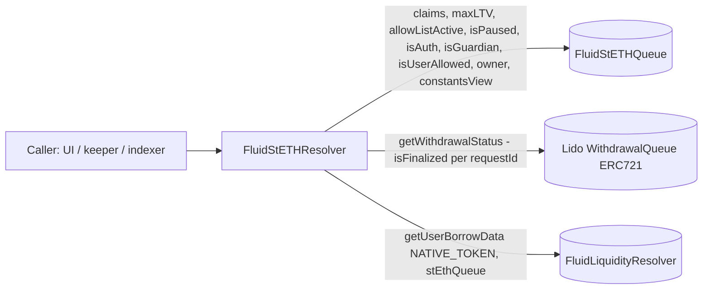

# Periphery / resolvers / steth — SPEC

## 1. Purpose

Read-only aggregator over the **Fluid stETH Queue protocol** (see [protocols/steth/SPEC.md](../../../protocols/steth/SPEC.md)). Surfaces the single-purpose "whale deleverage" queue in a shape that UIs, keepers and dashboards can consume in one `eth_call` instead of stitching together reads from `FluidStETHQueue`, the Lido Withdrawal Queue and the Liquidity resolver.

The resolver exposes:

- The queued `Claim` record per `(claimTo, requestIdFrom)` — raw debt snapshot, Lido checkpoint, last request id — joined with a **live claimability flag** derived from Lido.
- The protocol's **config view**: wired addresses (Liquidity, Lido, stETH), owner, `maxLTV`, allowlist gate, pause flag, and the protocol's own `UserBorrowData` / `OverallTokenData` at Liquidity (since the queue is itself a borrower of native ETH).
- Boolean role probes (`isAuth`, `isGuardian`, `isUserAllowed`, `isPaused`) that pass through to the queue contract.

It is a single-file contract (`main.sol`, ~158 LOC) plus its interface (`iStETHResolver.sol`). It holds no state, no authority, no balances, and is replaceable by redeploy.

## 2. Architecture & Data Flow

Per-call flow for the primary `claim(claimTo, requestIdFrom)` read:

1. Fetch the packed `Claim { borrowAmountRaw, checkpoint, requestIdTo }` from `STETH_QUEUE.claims(...)`.
2. Revert `FluidStETHResolver__NoClaimQueued` if `checkpoint == 0` (no record or already settled).
3. Derive `requestsLength_ = requestIdTo - requestIdFrom + 1` (Lido request ids are monotonic, so the queue writes a contiguous range per `queue()` call — see [protocols/steth/SPEC.md §7](../../../protocols/steth/SPEC.md#7-user--public-methods)).
4. Build the `requestIds_[]` array and ask Lido `getWithdrawalStatus(...)` for per-id `WithdrawalRequestStatus`.
5. Return `isClaimable = true` iff **every** entry in the batch is `isFinalized`.

`config()` composes `STETH_QUEUE.constantsView()` (Liquidity / Lido / stETH immutables), the queue's own `maxLTV` / `allowListActive` / `owner` / `isPaused`, and the queue's borrow position at Liquidity (`getUserBorrowData`).

## 3. External Interactions

- **Reads only.** No state-changing calls. Every external method is `view`.
- `IFluidStETHQueue` — `claims`, `maxLTV`, `allowListActive`, `owner`, `isPaused`, `isAuth`, `isGuardian`, `isUserAllowed`, `constantsView`.
- `ILidoWithdrawalQueue` — `getWithdrawalStatus(uint256[])` only. The resolver never touches `findCheckpointHints` / `claimWithdrawal(s)` (those belong to the queue contract's own `claim()` path).
- `IFluidLiquidityResolver` — `getUserBorrowData(stEthQueue, NATIVE_TOKEN_ADDRESS)` for the queue's aggregate native-ETH debt, borrow rate, and overall token data.
- **No DEX / vault / oracle path.** stETH is by design not a generic Fluid-Liquidity asset; the resolver never dereferences stETH balances directly (the `UserBorrowData` is always native ETH, matching the borrow leg of `queue()`).

## 4. Roles & Access Control

None. Every external / public method is `view` and unauthenticated — EOAs, contracts, and RPC callers can read everything the resolver exposes.

The resolver *reports* on queue-level roles via `isAuth` / `isGuardian` / `isUserAllowed` / `owner` pass-throughs, but holds no role of its own. There is no owner, admin, guardian, upgrade surface, or pause.

## 5. Storage Layout

No mutable storage. Three immutables set in the constructor and one internal constant:

| Name | Type | Meaning |
| --- | --- | --- |
| `STETH_QUEUE` | `IFluidStETHQueue` | Deployed `FluidStETHQueue` proxy. Source of the `claims` mapping, config, role probes. |
| `LIDO_WITHDRAWAL_QUEUE` | `ILidoWithdrawalQueue` | Lido Withdrawal Queue contract (`0x889edC…F9B1` on mainnet). Only used to read `getWithdrawalStatus`. |
| `LIQUIDITY_RESOLVER` | `IFluidLiquidityResolver` | Sibling resolver used to pull the queue's native-ETH borrow position. |

Internal constant:

- `NATIVE_TOKEN_ADDRESS = 0xEeeeeEeeeEeEeeEeEeEeeEEEeeeeEeeeeeeeEEeE` — sentinel used as the token key for the Liquidity lookup, matching how `FluidStETHQueue` itself addresses the native borrow slot.

Constructor reverts `FluidStETHResolver__AddressZero` if any of the three immutables is zero. No post-deploy wiring.

## 6. Enumeration & Config View

| Method | Returns | Notes |
| --- | --- | --- |
| `STETH_QUEUE()` | `IFluidStETHQueue` | Public immutable. |
| `LIDO_WITHDRAWAL_QUEUE()` | `ILidoWithdrawalQueue` | Public immutable. |
| `LIQUIDITY_RESOLVER()` | `IFluidLiquidityResolver` | Public immutable. |
| `config()` | `(liquidity, lidoWithdrawalQueue, stETH, owner, maxLTV, allowListActive, isPaused, userBorrowData, overallTokenData)` | One-shot snapshot of the protocol. `userBorrowData` and `overallTokenData` describe the queue's own ETH debt at Liquidity; `maxLTV` is in `1e4` basis (100% == 10000). |

There is no "list all claims" method — claim records are keyed by `(claimTo, requestIdFrom)` and Solidity mappings are not enumerable. Consumers discover active claims off-chain via the `LogQueue(claimTo, requestIdFrom, ...)` event emitted by `FluidStETHQueue` ([protocols/steth/SPEC.md §9](../../../protocols/steth/SPEC.md#9-events)).

## 7. Claim & Claimability Views

| Method | Returns | Notes |
| --- | --- | --- |
| `claim(claimTo, requestIdFrom)` | `(Claim, bool isClaimable)` | Joins the stored `Claim { borrowAmountRaw, checkpoint, requestIdTo }` with live Lido finalization status. Reverts `FluidStETHResolver__NoClaimQueued` if no record exists. |
| `isClaimable(claimTo, requestIdFrom)` | `bool` | `true` iff every Lido request in `[requestIdFrom, requestIdTo]` reports `isFinalized`. Reverts `FluidStETHResolver__NoClaimQueued` if no record exists. |

Semantics:

- `Claim.checkpoint == 0` is the sentinel for "not present / already settled". Both `claim` and `isClaimable` revert on it rather than returning `(empty, false)` — callers that want a non-reverting probe should wrap in `try/catch`.
- A single `queue()` call at the queue contract spans one **or more** Lido request ids (Lido caps each request at 1000 stETH; larger amounts are split — see [protocols/steth/SPEC.md §7](../../../protocols/steth/SPEC.md#7-user--public-methods)). The resolver therefore constructs a contiguous `requestIds_[]` from `requestIdFrom` to `requestIdTo` and requires **all** of them to be finalized before returning `true`. Partial finalization is reported as `false`, matching the queue's atomic-settlement model.
- `isClaimable` does not assert the position is economically settleable (i.e. `claimedAmount >= repayAmount`). That check happens on-chain inside `FluidStETHQueue.claim()` itself and can revert there even when `isClaimable` returned `true`. See [protocols/steth/SPEC.md §11](../../../protocols/steth/SPEC.md#11-invariants--safety-notes) on accepted slashing / bad-debt recovery.

## 8. User & Role Views

| Method | Returns | Notes |
| --- | --- | --- |
| `isAuth(addr)` | `bool` | Pass-through to `STETH_QUEUE.isAuth` (true for owner or `_auths[addr] == 1`). |
| `isGuardian(addr)` | `bool` | Pass-through (true for owner or `_guardians[addr] == 1`). |
| `isUserAllowed(addr)` | `bool` | Pass-through to `_allowed[addr]`. Only meaningful when `allowListActive == true`; `claim()` at the queue is permissionless regardless. |
| `isPaused()` | `bool` | `_status == REENTRANCY_ENTERED` at the queue. Note flickers `true` mid-tx during any `queue` / `claim` — see [protocols/steth/SPEC.md §6](../../../protocols/steth/SPEC.md#6-storage-layout). |
| `getUserBorrowData()` | `(UserBorrowData, OverallTokenData)` | The queue's own native-ETH debt at Liquidity. Also returned inline from `config()`. |

## 9. Errors

| Name | When |
| --- | --- |
| `FluidStETHResolver__AddressZero` | Constructor called with any of `stEthQueue_`, `liquidityResolver_`, `lidoWithdrawalQueue_` zero. |
| `FluidStETHResolver__NoClaimQueued` | `isClaimable` / `claim` called for a `(claimTo, requestIdFrom)` with `checkpoint == 0`. |

No other custom errors. Downstream reverts propagate:

- Lido `getWithdrawalStatus` reverts if any `requestId` is out of range.
- `STETH_QUEUE.claims(...)` never reverts — an unknown key returns a zero-filled struct, which the resolver detects via `checkpoint == 0`.
- `LIQUIDITY_RESOLVER.getUserBorrowData` surfaces any upstream revert as-is.

## 10. Deployment Checklist

1. Deploy `FluidStETHQueue` (proxy + implementation + `initialize`) — see [protocols/steth/SPEC.md](../../../protocols/steth/SPEC.md). The queue must be live before this resolver is useful.
2. Deploy or reference an existing `FluidLiquidityResolver` pointing at the same Liquidity instance the queue borrows from.
3. Confirm the Lido Withdrawal Queue address for the target chain (`0x889edC2eDab5f40e902b864aD4d7AdE8E412F9B1` on mainnet). This protocol is mainnet-only in practice; the resolver does not short-circuit on non-mainnet chains and would simply revert at the Lido call if deployed elsewhere.
4. Deploy `FluidStETHResolver(stEthQueue, liquidityResolver, lidoWithdrawalQueue)`. Constructor reverts on any zero input; no post-deploy wiring.
5. Register in the deployment docs; UIs / keepers consume it directly.
6. Redeploys are free — supersede the old address in the registry. Since nothing on-chain depends on the resolver, the previous instance can be abandoned.

## 11. Invariants & Safety Notes

- **Pure view.** No method mutates state, no payable fallback, no delegatecall, no assembly. Reentrancy is structurally impossible.
- **No balances.** The contract never holds ETH, stETH, or ERC-721s. No rescue path, none needed.
- **Stateless replaceability.** No mutable storage means a new version ships as a fresh deploy at a new address. Governance has nothing to rotate.
- **Claimability is a liveness probe, not a solvency probe.** `isClaimable == true` means Lido will release ETH for every request id in the batch. It does **not** guarantee that the queue's on-chain `claim()` will succeed — accrued Liquidity debt or Lido slashing can still make `claimedAmount < repayAmount`, which reverts on the underflow inside the queue. See [protocols/steth/SPEC.md §11](../../../protocols/steth/SPEC.md#11-invariants--safety-notes).
- **Monotonic request-id range assumption.** The resolver relies on Lido assigning contiguous ids to a single `requestWithdrawals` call, so `requestIdTo - requestIdFrom + 1` equals the batch size. This matches current Lido behaviour; a Lido upgrade that changes id allocation would invalidate the iteration.
- **Multi-request `isClaimable` iteration.** For batches where `requestsLength_ > 1`, the current implementation builds the `requestIds_` array via a `for` loop without a preceding `new uint256` allocation — integrators should be aware this branch has not been exercised in production (most queued amounts are ≤ 1000 stETH and hit the single-request fast path). A resolver redeploy is the remediation if this path is ever needed at scale; no on-chain funds are at risk because the resolver is read-only.
- **Allowlist interacts with `queue()` only.** `isUserAllowed` exposes the gate status, but a stale or inactive allowlist never blocks `claim()` at the queue layer — settlement is permissionless by design.
- **`isPaused` flicker.** Because the queue reuses its reentrancy slot as the pause flag, `isPaused()` returns `true` during any in-flight `queue` / `claim`. Block-granular consumers (indexers, dashboards) are unaffected; integrators branching on `isPaused()` inside a nested callback during another user's tx must account for this.
- **No per-user enumeration.** Reconstructing a user's claim list requires scanning `LogQueue` / `LogClaim` events off-chain; the resolver does not maintain a mapping `user → requestIds[]`.
- **Re-hypothecation helper not applicable.** `FluidStETHResolver` does **not** inherit `ResolverHelpers` (see [periphery/resolvers/SPEC.md §4](../SPEC.md#4-common--shared-base-inline)) because it never divides a Liquidity balance — the only Liquidity read it performs is the queue's own `UserBorrowData`, which already accounts for re-hypothecation upstream.

## 12. Trust Model & Audit Notes

- **No trust is placed in the resolver.** It is a stateless read aggregator; compromising it is equivalent to reading the same data directly from `FluidStETHQueue`, Lido and the Liquidity resolver. No privileged state, no fund path.
- **Off-chain-only consumer model.** Keepers that decide whether to call `FluidStETHQueue.claim()` should treat `isClaimable` as a gating heuristic and still expect the on-chain call to revert on slashing / bad-debt edge cases. UIs should render `Claim.borrowAmountRaw` together with the queue's current borrow exchange price (via `getUserBorrowData.overallTokenData.borrowExchangePrice`) rather than treating it as a settled ETH amount.
- **Upgrade = redeploy.** No owner, no auth, no setter, nothing to rotate. Improvements ship as new deployments; old resolvers remain functional as long as their three immutables stay live.
- **Audit focus points** for this resolver are narrow: (a) the multi-request iteration branch in `isClaimable` and its memory-array allocation, (b) that `NoClaimQueued` is the right UX for a zero-checkpoint record rather than a silent `false`, (c) that `config()` returns a single-block-consistent snapshot (it does — all calls happen inside one staticcall), (d) that the Lido `getWithdrawalStatus` call does not swallow any revert that should surface.
- **Trust boundaries downstream.** A buggy / upgraded `FluidStETHQueue` or Lido Withdrawal Queue surfaces verbatim in resolver output. The resolver does not normalize, retry, or validate.
- **Chain specificity.** The resolver compiles and deploys on any EVM chain, but is operationally useful only where both `FluidStETHQueue` and the Lido Withdrawal Queue exist — in practice Ethereum mainnet. Deploying it on L2s without a Lido equivalent will revert on the first `isClaimable` call.
