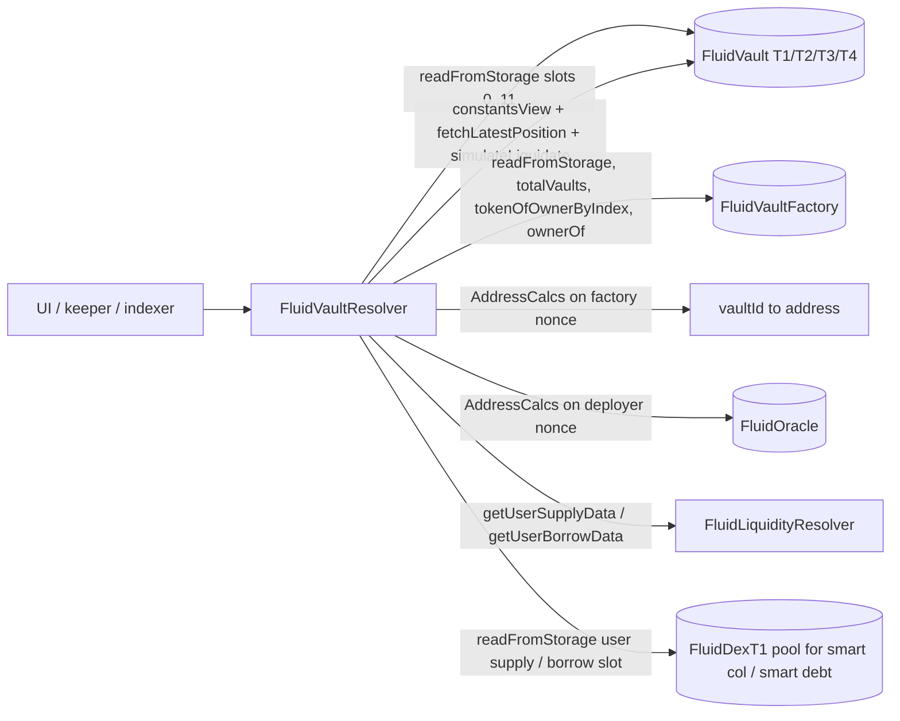

# Resolvers / vault — SPEC

## 1. Purpose

Read-only aggregator over the Fluid **Vault protocol** (T1 / T2 / T3 / T4) and its `FluidVaultFactory`. Produces the canonical dashboard view for UIs, indexers, keepers, and analytics: vault enumeration, per-vault constants / configs / rates / state, per-NFT position data with liquidation-aware `fetchLatestPosition`, and revert-based liquidation quoting.

One contract, `FluidVaultResolver`, deployed per chain. Embeds a pointer to the `FluidLiquidityResolver` so every vault's Liquidity-side leg is enriched with the same `UserSupplyData` / `UserBorrowData` / `OverallTokenData` the Liquidity resolver returns. For vaults with DEX-backed smart-collateral or smart-debt legs, callers must cross-reference `FluidDexResolver` to resolve share → token amounts (this resolver returns share-space numbers on those legs, flagged via `isSmartCol` / `isSmartDebt`).

See [../SPEC.md](../SPEC.md) for cross-resolver conventions and [../../protocols/vault/SPEC.md](../../../protocols/vault/SPEC.md) for the underlying protocol.

## 2. Architecture & Data Flow

Per-vault assembly in `getVaultEntireData`: resolve `constantsView` → derive `isSmartCol` / `isSmartDebt` from `supplyToken.token1` / `borrowToken.token1` → fetch `UserSupplyData` / `UserBorrowData` from `FluidLiquidityResolver` (only for non-smart legs) → unpack `vaultVariables2` into `Configs` → query oracle for operate / liquidate rates → call `IFluidVault.updateExchangePrices` to get projected exchange prices → unpack totals and tick data → assemble `VaultState` from `vaultVariables` + current branch.

## 3. External Interactions

- **`FluidVaultFactory`** — `totalVaults()`, `getVaultAddress(id)`, `tokenOfOwnerByIndex`, `ownerOf`, `balanceOf`, `totalSupply` for NFT enumeration; `readFromStorage(calculateStorageSlotUintMapping(3, nftId))` for the packed per-NFT token config (high 32 bits = `vaultId`).
- **Each vault** — `readFromStorage(slot)` for slots `0` (`vaultVariables`), `1` (`vaultVariables2`), `2` (`absorbedLiquidity`), `3` (`positionData[nftId]`), `4` (`tickHasDebt`), `5` (`tickData`), `6` (`tickIdData` double-mapping), `7` (`branchData`), `8` (`rates`), `9` (`rebalancer`), `10` (`absorbedDustDebt`), `11` (`dexFromAddress`). Also `TYPE()` to distinguish T1 vs T2/T3/T4, `VAULT_ID()`, `constantsView()` (typed for T1 vs common), `updateExchangePrices(vaultVariables2)` (non-state-mutating in view paths), `fetchLatestPosition` for liquidated positions, and `simulateLiquidate` / T1 `liquidate(...dEaD, absorb)` for liquidation quoting via revert.
- **Oracle** (`IFluidOracle`) — `getExchangeRateOperate` / `getExchangeRateLiquidate`, with fallback to legacy `getExchangeRate`. For T2/T3/T4 the oracle address is resolved via `AddressCalcs.addressCalc(deployer, nonce)` where nonce is packed in `vaultVariables2` bits 92-121. T1 stores the oracle address directly in bits 96+.
- **`FluidLiquidityResolver`** — `getUserSupplyData(vault, token0)` / `getUserBorrowData(vault, token0)` for non-smart legs; contributes `UserSupplyData` / `UserBorrowData` (limits, expansion, `supplyRate` / `borrowRate`) and `OverallTokenData` (Liquidity-side rates).
- **DEX pool** (smart legs only) — direct `readFromStorage(userSupplySlot / userBorrowSlot)` via `IFluidStorageReadable`; share-space data is decoded with `DexSlotsLink` + `DexCalcs`, not Liquidity layouts.
- **Token / chain state** — `IERC20.balanceOf(liquidity)` plus `address(liquidity).balance` for `NATIVE_TOKEN_ADDRESS`; offset by `_getLiquidityExternalBalances` (inherited from [`ResolverHelpers`](../SPEC.md#4-common--shared-base-inline)) to capture re-hypothecated WEETH / WEETHS on Zircuit.

## 4. Roles & Access Control

None. Every method is externally callable by anyone. No owner, no admin, no pause, no mapping. The only addresses captured are immutables set in the constructor.

Constructor validates neither pointer explicitly — supply the wrong `factory_` or `liquidityResolver_` and the resolver will simply return wrong numbers, not revert. No `*__AddressZero` check exists today (deviates from the common resolver pattern; both inputs are expected to come from deployer scripts that have already validated them).

## 5. Storage Layout

Two immutables and constants only (`Variables`):

| Slot | Field | Type | Set at |
| --- | --- | --- | --- |
| immutable | `FACTORY` | `IFluidVaultFactory` | constructor |
| immutable | `LIQUIDITY_RESOLVER` | `IFluidLiquidityResolver` | constructor |
| constants | `X8` … `X128`, `NATIVE_TOKEN_ADDRESS`, `EXCHANGE_PRICES_PRECISION = 1e12` | `uint` / `address` | compile-time |

No storage variables of its own. All interpretation happens in memory per call.

## 6. Admin / Governance Methods

None. There is no setter, no upgrade path, no pause. To bump the resolver (e.g. after a vault-protocol storage-layout change) governance redeploys and updates the deployment registry; existing consumers keep reading the old resolver until they migrate.

## 7. User / Public View Methods

### 7.1 Raw storage getters

| Method | Reads | Notes |
| --- | --- | --- |
| `getVaultVariablesRaw(vault)` | slot 0 | reentrancy bit, top tick, current/total branch, `totalSupply` / `totalBorrow` (BigNumber), `totalPositions` |
| `getVaultVariables2Raw(vault)` | slot 1 | magnifiers, CF, LT, LML, withdrawal gap, liquidation penalty, borrow fee, oracle nonce (T2/3/4) or address (T1), last-update timestamp |
| `getAbsorbedLiquidityRaw(vault)` | slot 2 | packed `(absorbedBorrow, absorbedSupply)` in low/high 128 bits |
| `getPositionDataRaw(vault, nftId)` | slot 3 mapping | per-NFT packed data |
| `getTickDataRaw(vault, tick)` | slot 5 mapping | tick liquidation state |
| `getTickHasDebtRaw(vault, key)` | slot 4 mapping | `tickHasDebt` bitmap word (`key = tick/256` for positive ticks, `key = tick/256 - 1` for negative) |
| `getTickIdDataRaw(vault, tick, id)` | slot 6 double-mapping | `id = realId/3 + 1` |
| `getBranchDataRaw(vault, branch)` | slot 7 mapping | branch status / debt factor / partials / base branch |
| `getRateRaw(vault)` | slot 8 | four packed 64-bit exchange prices (Liquidity supply/borrow + vault supply/borrow) |
| `getRebalancer(vault)` | slot 9 | cast to `address` |
| `getAbsorbedDustDebt(vault)` | slot 10 | dust-debt accumulator |
| `getDexFromAddress(vault)` | slot 11 | only populated for DEX-backed types |
| `getTokenConfig(nftId)` | factory slot 3 mapping | high 32 bits = owning `vaultId` |

### 7.2 Config / identity

| Method | Returns | Notes |
| --- | --- | --- |
| `getVaultAddress(vaultId)` | `address` | deterministic via `AddressCalcs.addressCalc(factory, vaultId)` |
| `getVaultId(vault)` | `uint` | `IFluidVault.VAULT_ID()` |
| `getVaultType(vault)` | `uint` | 0 = not a Fluid vault, `VAULT_T1_TYPE` when `TYPE()` selector missing but factory address matches, otherwise the type id reported by the vault |
| `getContractForDeployerIndex(vault, index)` | `address` | CREATE-nonce address for T2/3/4 deployer; returns `0` for T1 or `index == 0` |
| `getTotalVaults()` | `uint` | `factory.totalVaults()` |
| `getAllVaultsAddresses()` | `address[]` | one-based id iteration over all factory vaults |

### 7.3 State / positions / rates (typed)

| Method | Returns | Notes |
| --- | --- | --- |
| `getVaultState(vault)` | `VaultState` | top tick, total positions, current branch + its `CurrentBranchState` (status, minima tick, debt factor, partials, debt liquidity, base branch) |
| `getVaultEntireData(vault)` | `VaultEntireData` | all-in-one: constants, configs, exchange prices + rates, totals, limits, state, Liquidity user supply / borrow data for both legs, plus **`accessType`** (`0` public / `1` permissioned; try/catch defaults to `0`) |
| `getDeploymentName()` | `string` | factory `deploymentName()` when present (permissioned stack); empty string on production factories |
| `getVaultsEntireData(vaults[])` / `getVaultsEntireData()` | `VaultEntireData[]` | batched variant; no-arg version iterates `getAllVaultsAddresses` |
| `vaultByNftId(nftId)` | `address` | via factory token config high-32 vaultId |
| `positionByNftId(nftId)` | `(UserPosition, VaultEntireData)` | full position: detects liquidated state via `tickData` bit 0 + `tickId` comparison and re-fetches via `IFluidVault.fetchLatestPosition`; decompresses BigNumber raw amounts and multiplies by the vault exchange prices |
| `positionsNftIdOfUser(user)` | `uint[]` | walks `tokenOfOwnerByIndex` |
| `positionsByUser(user)` | `(UserPosition[], VaultEntireData[])` | combines the above |
| `totalPositions()` | `uint` | `factory.totalSupply()` |

### 7.4 Liquidation + absorb simulation

| Method | Returns | Notes |
| --- | --- | --- |
| `getVaultLiquidation(vault, tokenInAmt)` | `LiquidationStruct` | `tokenInAmt = 0` ⇒ `type(uint128).max`. T1 calls `liquidate(amt, 0, ADDRESS_DEAD, absorb)`; T2/3/4 call `simulateLiquidate(0, absorb)`. Reverts are caught; `FluidLiquidateResult(out, in)` selector is decoded into `inAmt` / `outAmt` / `inAmtWithAbsorb` / `outAmtWithAbsorb`. `absorbAvailable` is derived from the two pairs differing. Non-`view` because the underlying simulation path is not type-checked as view — **callers must use `eth_call` / `callStatic`**. |
| `getMultipleVaultsLiquidation(vaults[], amts[])` | `LiquidationStruct[]` | batched; parallel arrays |
| `getAllVaultsLiquidation()` | `LiquidationStruct[]` | uses `getAllVaultsAddresses()` and `tokenInAmt = 0` |
| `getVaultAbsorb(vault)` | `AbsorbStruct` | **DEPRECATED, only works for T1 v1.0.0**: calls `absorb()` and compares `absorbedLiquidity` before / after |
| `getVaultsAbsorb(vaults[])` / `getVaultsAbsorb()` | `AbsorbStruct[]` | batched legacy variants |

### 7.5 Struct field semantics (selected)

- `Configs.supplyRateMagnifier` / `borrowRateMagnifier` — packed 16 bits each. **For smart-col T2/T4 supply leg** and **smart-debt T3/T4 borrow leg**, the 15 high bits encode an unsigned rate magnitude and bit 0 encodes sign (1 = positive, 0 = negative). For normal legs, the 16-bit field is a magnifier applied to the Liquidity rate (`1e4` = 100%).
- `Configs.collateralFactor` / `liquidationThreshold` / `liquidationMaxLimit` / `withdrawalGap` — stored in units of 10 (`1e3` encoded, multiplied by 10 on read to restore `1e4` = 100% precision, i.e. `10 == 0.1%`).
- `ExchangePricesAndRates.liquiditySupplyExchangePrice` / `liquidityBorrowExchangePrice` — set to `EXCHANGE_PRICES_PRECISION` (`1e12`) in smart-col / smart-debt legs respectively (there is no Liquidity exchange price for a DEX-backed side).
- `ExchangePricesAndRates.supplyRateVault` / `borrowRateVault` — signed; for normal legs = `liquidityRate * magnifier / 10000`; for smart legs = absolute % (can be negative ⇒ pay-to-supply or get-paid-to-borrow).
- `ExchangePricesAndRates.rewardsOrFeeRate{Supply,Borrow}` — `1e2` precision (100 = 1%). For normal legs = `magnifier - 10000` (positive ⇒ rewards on supply / fee on borrow). For smart legs = same absolute value as `*RateVault`.
- `LimitsAndAvailability` — `withdrawableUntilLimit` always has the `999999/1000000` safety haircut and the `withdrawalGap` haircut applied. `withdrawable` additionally caps at the Liquidity token balance (incl. re-hypothecated external balance via `ResolverHelpers`) for non-smart legs; for smart legs consumers must cross-check DEX reserves from `FluidDexResolver`. `minimumBorrowing = 10001 * vaultBorrowExchangePrice / 1e12`.
- `UserPosition` fields are decompressed (BigNumber → normal) and multiplied by the vault exchange prices. `beforeSupply` / `beforeBorrow` / `beforeDustBorrow` record the pre-`fetchLatestPosition` values so keepers can display liquidation deltas. `isLiquidated = true` when the position's tick has been walked (`tickData` bit 0 set, or the per-position `tickId < currentTickId`).
- `LiquidationStruct` — amounts are in **token amounts for normal legs** and in **shares for smart-col output / smart-debt input**. Callers must use `FluidDexResolver.DexState.tokenPerColShare` / `tokenPerDebtShare` to translate.

## 8. Events

None. View-only resolver, no state changes, no emissions.

## 9. Errors

No custom errors. Inputs are never validated; out-of-range or non-Fluid addresses return zero / empty structs. The only revert path is `_decodeLiquidationResult` reading a non-`FluidLiquidateResult` selector (silently returns `(0, 0)`). Protocol-level reverts that do surface come from unsafe callers handing in a malformed `vault_` that fails `readFromStorage` — those bubble up as raw EVM reverts.

## 10. Deployment Checklist

1. Deploy [`FluidLiquidityResolver`](../liquidity/SPEC.md) first.
2. Deploy `FluidVaultResolver(factory, liquidityResolver)` — constructor takes the `FluidVaultFactory` address and the previously-deployed `FluidLiquidityResolver`.
3. Record the address in `deployments.md` under `periphery.resolvers.vault`.
4. Bootstrap order: Liquidity → VaultResolver → satellites (`vaultPositions/`, `vaultLiquidation/`, `vaultTicksBranches/`) that consume it.
5. On every vault-protocol storage-layout upgrade, redeploy and re-register. Old resolver keeps working for pinned consumers until slot offsets diverge.

## 11. Invariants & Safety Notes

- **Stateless and stateless-safe.** No mutable storage means no accidental state drift, no admin-rotation risk, and the resolver can be safely called by anyone from any context.
- **BigNumber decompression is consistent.** Every raw totals / position amount is decompressed with `(x >> 8) << (x & 0xff)` (the `BigMathMinified` scheme with `8` coefficient bits, `0xff` exponent mask) before the caller sees it. Consumers should never re-decompress.
- **`updateExchangePrices` is called every `getVaultEntireData`** to project vault + Liquidity exchange prices to the current block. The call is `view` in this path since no storage writes occur through the resolver's non-mutating invocation context, but integrators must still call via `eth_call` / `callStatic` on the liquidation paths (§7.4).
- **`isSmartCol` / `isSmartDebt` are derived from `supplyToken.token1 != address(0)` / `borrowToken.token1 != address(0)`**, not from the vault-type enum. This is the authoritative flag for downstream decoding: when either is true, the corresponding raw amount field is in **DEX shares**, `liquidity*ExchangePrice` is pinned to `1e12`, and the Liquidity `UserSupplyData` / `UserBorrowData` sub-struct is **partially synthesized** from DEX-slot data (not fetched from the Liquidity resolver).
- **Re-hypothecation is only applied for non-smart legs.** Smart-side `withdrawable` / `borrowable` bypass the Zircuit external-balance offset; consumers must pair the resolver output with DEX-side reserve availability.
- **Oracle fallback.** `getExchangeRateOperate` / `getExchangeRateLiquidate` are tried first; on `catch` the legacy `getExchangeRate` path is used for both fields. This preserves backwards compatibility with older oracle deployments but means a broken new-API oracle silently degrades to single-price mode.
- **NFT id → vaultId resolution assumes the factory's token-config layout**: high 32 bits of slot `3` at key `nftId` is the owning `vaultId`. If the factory changes that layout, `vaultByNftId` / `positionByNftId` silently return `address(0)` / empty data — which is benign (no revert) but invalidates downstream reasoning.
- **Liquidation simulation amounts are share-denominated on smart legs.** Do not compare `inAmt` across smart vs normal vaults without translating via DEX resolvers.
- **`getVaultAbsorb` family is deprecated.** It calls `absorb()` live; on post-v1.0.0 T1s and on T2/3/4 it silently returns `absorbAvailable = false`. Keepers should use the new absorb flow via `FluidVaultLiquidationResolver` / direct vault calls.
- **No zero-address check in the constructor.** Unlike most resolvers, `Variables` does not revert on `address(0)` pointers. Deployment scripts must verify.
- **Tick encoding.** `tickHelper` decodes the 20-bit packed tick (`bit 0 = is-set-flag`, `bit 1 = sign`, `bits 2-20 = absolute`). A zero raw input maps to `type(int256).min` as a sentinel for "no tick".

## 12. Trust Model & Audit Notes

- **Pure reader, no trust surface.** The resolver cannot move funds, pause anything, or alter vault state. The only attack is "consumer trusts a wrong deployment address"; mitigated by the central `deployments.md` registry.
- **`getVaultLiquidation` is non-`view`-labelled intentionally** because `IFluidVault.simulateLiquidate` and T1's `liquidate(..., dEaD, ...)` revert-for-data pattern cannot be expressed as `view` to the solc type checker. The path never writes under resolver usage; any integrator submitting a live tx to this method is buggy, not malicious.
- **Smart-leg cross-dependency.** For accurate smart-col / smart-debt accounting the caller must combine this resolver with `FluidDexResolver`. Consumers that look only at `VaultEntireData` fields for a smart leg will see share-space numbers and a synthesized `liquidityUser*Data` — this is documented in the struct comments but is a common integrator pitfall.
- **Factory-owner compromise** (see [../../protocols/vault/SPEC.md §12](../../../protocols/vault/SPEC.md#12-trust-model--accepted-trade-offs)) can change the set of vaults the resolver enumerates and the deployment-logic nonces used for oracle resolution. The resolver faithfully reflects whatever the factory reports; it adds no trust assumptions of its own.
- **Oracle trust** is inherited from the vault: a compromised or misconfigured oracle returns garbage `oraclePriceOperate` / `oraclePriceLiquidate`. The resolver does not cross-check.
- **Replaceability.** Because nothing on-chain points at this resolver by address, governance can redeploy at will. The deprecated `getVaultAbsorb` family is retained only for v1.0.0 T1 consumers that still exist; do not rely on it for new integrations.
- **Supply-chain.** Depends only on Fluid's own libraries (`TickMath`, `BigMathMinified`, `LiquidityCalcs`, `DexCalcs`, `AddressCalcs`, `LiquiditySlotsLink`, `DexSlotsLink`, `FluidProtocolTypes`) plus the shared [`ResolverHelpers`](../SPEC.md#4-common--shared-base-inline). No external deps at runtime.
