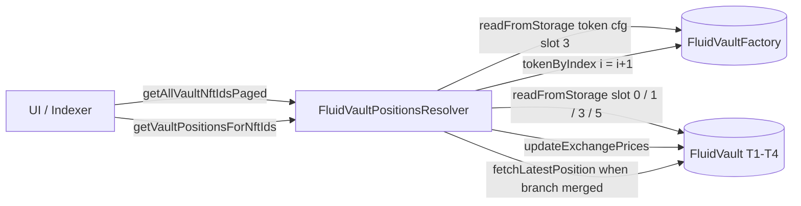

# Resolvers / vaultPositions — SPEC

## 1. Purpose

`FluidVaultPositionsResolver` is the **paged NFT-enumeration resolver** for Fluid Vault positions. It lists the position NFTs that belong to a given vault (T1 / T2 / T3 / T4, indistinguishably) and decodes the raw `positionData` slot into a trivial `{nftId, owner, supply, borrow}` struct — both numbers already reprojected through the vault's current `supplyExchangePrice` / `borrowExchangePrice`.

It exists alongside the canonical [`vault/`](../vault/SPEC.md) resolver to solve one problem the canonical resolver does not: **enumerating every NFT in a vault on a chain with tight gas limits**. The factory is ERC-721-Enumerable, so a naive "loop over `tokenByIndex` for every position" is `O(totalSupply)` globally — on mainnet with tens of thousands of NFTs across all vaults this can OOG in a single `eth_call`. This resolver chunks the walk into fixed 3000-NFT pages and exposes a separate "decode these specific NFT ids" entry point so callers can split the work however they need.

It is intentionally narrower than [`vault/`](../vault/SPEC.md): no oracle price, no health ratio, no tick / branch state, no per-leg raw data — only the essentials a UI / indexer needs to show "position X has Y collateral and Z debt, owned by W." Consumers who want full position shape call `FluidVaultResolver.positionByNftId` per id; this resolver is the **enumeration layer** that tells them which ids to look up.

See [../SPEC.md](../SPEC.md) for the top-level resolver philosophy (view-only, stateless, replaceable, no funds, no privileged callers).

## 2. Architecture & Data Flow



Typical calling pattern:

1. Call `getAllVaultNftIdsPaged(vault, 0)` → receive page 0 ids + `hasNextPage`.
2. Advance `page` until `hasNextPage == false`.
3. Feed the concatenated ids into `getVaultPositionsForNftIds(ids, vault)` (split into chunks as gas permits).

For small vaults (or chains with generous block gas), `getAllVaultPositions(vault)` does steps 1-3 in a single call.

## 3. External Interactions

- **`IFluidVaultFactory` (`FACTORY`, immutable)** — `totalSupply()` for the global NFT count, `readFromStorage(keccak256(nftId, 3))` for the packed token-config slot (owner + vaultId), and the fact that NFT ids are monotonic starting at 1 (exploited via `_tokenByIndex(i) = i + 1` instead of a factory call). See [../../../protocols/vault/factory/SPEC.md](../../../protocols/vault/factory/SPEC.md).
- **`IFluidVault` (any type)** — `readFromStorage(0)` for `vaultVariables` (total positions bitfield), `readFromStorage(1)` for `vaultVariables2` (fed into `updateExchangePrices`), `readFromStorage(mapping slot 3, nftId)` for `positionData`, `readFromStorage(mapping slot 5, tick)` for `tickData`, plus `updateExchangePrices(vaultVariables2)` and `fetchLatestPosition(tick, tickId, borrow, tickData)` for branch-merge recovery.
- **Vault address re-derivation** — `_getVaultAddress(vaultId)` recomputes the vault address from the factory's CREATE nonce using the standard RLP-prefix trick (mirroring `FluidVaultFactory.getVaultAddress`). This lets the resolver map `nftId → vault` without calling the factory for each id.
- **`TickMath`** — `getRatioAtTick` to convert the position's packed tick into a collateral-to-debt ratio during `_getVaultPosition`.
- **No writes. No callbacks.** Pure view composition.

See also: [libraries/SPEC-tickMath](../../../libraries/SPEC-tickMath.md), [protocols/vault/SPEC](../../../protocols/vault/SPEC.md).

## 4. Roles & Access Control

- **No roles.** Every method is `public view` and externally callable by anyone.
- **No admin, no owner, no pausable.** Nothing to rotate.
- **No privileged callers.** The resolver reverts only on trivially bad input (zero address, id/vault mismatch).

## 5. Storage Layout

Only immutables and packed-field masks — no mutable storage.

| Symbol | Type | Meaning |
| --- | --- | --- |
| `FACTORY` | `IFluidVaultFactory` (immutable) | Fluid Vault factory / ERC-721 enumerable. Source of NFT ids and token config. |
| `PAGE_SIZE` | `uint internal constant = 3000` | NFT-ids-per-page in `getAllVaultNftIdsPaged`. |
| `X8` | `uint = 0xff` | Mask for 8-bit BigNumber exponent. |
| `X19` | `uint = 0x7ffff` | Mask for 19-bit tick magnitude. |
| `X24` | `uint = 0xffffff` | Mask for tickId (24-bit). |
| `X32` | `uint = 0xffffffff` | Mask for vaultId field in factory token config. |
| `X64` | `uint = 0xffffffffffffffff` | Mask for 64-bit BigNumber fields (supply / dust borrow). |

Constructor reverts with `FluidVaultPositionsResolver__AddressZero` if `vaultFactory_ == 0`. No other validation — pointing at a non-factory address silently returns garbage (same policy as other resolvers, see [../SPEC.md §5](../SPEC.md)).

## 6. Public / View Methods

### Enumeration

| Method | Returns | Notes |
| --- | --- | --- |
| `getAllVaultNftIdsPaged(address vault, uint256 page)` | `(uint256[] nftIds, bool hasNextPage)` | Scans NFT ids `[page*3000, (page+1)*3000)` against the vault filter. Returns only ids that belong to `vault`. `hasNextPage` is `false` once the window ends at / past `FACTORY.totalSupply()`. Trim the temp array down to the matched count before returning. |
| `getAllVaultNftIds(address vault)` | `uint256[] nftIds` | Scans every NFT from 1 to `totalSupply()` in one call. Preallocates the result to `totalVaultPositions` read from `vaultVariables[210:241]`, so no trim step. Will OOG on large factories — use the paged variant when in doubt. |

### Position decode

| Method | Returns | Notes |
| --- | --- | --- |
| `getVaultPositionsForNftIds(uint256[] nftIds, address vault)` | `UserPosition[] positions` | Batched decode with **fixed vault**. Calls `updateExchangePrices` once up-front (cheaper than per-id). Reverts with `__InvalidParams` on `vault == 0` or if any `nftId` does not belong to `vault`. Caller is expected to have produced `nftIds` from the enumeration methods above. |
| `getPositionsForNftIds(uint256[] nftIds)` | `UserPosition[] positions` | Batched decode with **heterogeneous vaults**. Looks up `(vault, owner)` per id. Per-id exchange-price refresh (more expensive). Ids whose factory token-config resolves to `vault == 0` (should never happen, but defensive) yield a zero-filled `UserPosition` instead of reverting, so one bad id can't poison the whole batch. |
| `getAllVaultPositions(address vault)` | `UserPosition[] positions` | Convenience: enumerate + decode in one call. Preallocates to `totalVaultPositions`; behaves like `getAllVaultNftIds` followed by `getVaultPositionsForNftIds`. OOG-prone on large vaults. |

### Internal helpers (exposed for subclassing)

| Helper | Purpose |
| --- | --- |
| `_getVaultVariablesRaw(vault)` | `readFromStorage(0)` → `vaultVariables`. Bits `[210:242]` hold `totalPositions`. |
| `_getVaultVariables2Raw(vault)` | `readFromStorage(1)` → `vaultVariables2`, input to `updateExchangePrices`. |
| `_getPositionDataRaw(vault, nftId)` | `readFromStorage(keccak256(nftId, 3))` → packed `positionData`. |
| `_getTickDataRaw(vault, tick)` | `readFromStorage(keccak256(tick, 5))` → tick/branch merge metadata. Note: the key is `tick`, not `tick / 256`; the internal comment describing `tick / 256` is stale (the `public pure` `_calculateStorageSlotIntMapping` hashes the tick directly). |
| `_tokenByIndex(i)` | Returns `i + 1`. Factory NFT ids are 1-indexed and contiguous, so this avoids the external `tokenByIndex` call. |
| `_getVaultAddress(vaultId)` | CREATE-nonce RLP re-derivation of the vault address. Matches `FluidVaultFactory.getVaultAddress`. Returns `address(0)` for `vaultId == 0`. |
| `_vaultByNftId(nftId)` | `(tokenConfig >> 192) & X32` → `vaultId` → address. |
| `_vaultAndOwnerByNftId(nftId)` | Same, plus `address(uint160(tokenConfig))` for the owner. |

## 7. Position Decoding Semantics

`_getVaultPosition` mirrors `FluidVaultResolver.positionByNftId` so integrators can swap between resolvers without reconciling numbers.

Steps per NFT:

1. **Supply raw** — bits `[45:109]` of `positionData`, stored as an 8-bit-mantissa BigNumber (`raw = (mantissa >> 8) << (mantissa & 0xff)`).
2. **Supply-only sentinel** — bit `0` of `positionData`. If set, the position has no debt; skip debt decode.
3. **Tick** — bit `1` is the sign, bits `[2:21]` the 19-bit magnitude. Reconstructed as `int24`.
4. **Borrow raw** — `TickMath.getRatioAtTick(tick) * supplyRaw >> 96`. This is the debt implied by the tick; the vault keeps per-NFT debt implicit in the tick bucketing.
5. **Branch-merge recovery** — look up `tickData[tick]`; if liquidated (bit 0 set) **or** its current `tickId > positionData.tickId`, call `IFluidVault.fetchLatestPosition(tick, tickId, borrow, tickData)` to walk the branch chain and recover the adjusted `(tick, borrow, supply)`.
6. **Dust subtract** — bits `[109:173]` of `positionData` hold `dustDebt` (8-bit-exponent BigNumber). Subtract from `borrow`; saturate at `0` to avoid underflow.
7. **Project through exchange prices** — `supply = supplyRaw * vaultSupplyExchangePrice / 1e12`, `borrow = borrowRaw * vaultBorrowExchangePrice / 1e12`.

The returned `UserPosition.supply` / `.borrow` are therefore **in token units**, already including accrued interest at the block of the call. They do **not** include oracle pricing; callers who need a USD-denominated figure multiply by an external price or use [`vault/`](../vault/SPEC.md).

## 8. Returned Structs

```solidity
struct UserPosition {
    uint    nftId;   // factory NFT id
    address owner;   // current ERC-721 owner (from factory token config)
    uint    supply;  // collateral in raw token units, including accrued supply interest
    uint    borrow;  // debt in raw token units, including accrued borrow interest and dust subtraction
}
```

What the struct intentionally **omits**:

- **Tick, tickId, branch data** — callers who need those read `FluidVaultResolver.positionByNftId`.
- **Liquidation threshold / ratio / health** — derived in [`vault/`](../vault/SPEC.md) via oracle; this resolver does not touch oracles.
- **Vault id or vault address** — the caller already passes `vault` (in the vault-scoped getters) or can re-derive it from the ERC-721 factory.
- **Smart-collateral / smart-debt token splits** — on T2/T3/T4 the `supply` / `borrow` here are **share amounts**, not individual token legs; splitting into legs requires `vault/` or the DEX resolver.

## 9. Errors

| Selector | Name | When |
| --- | --- | --- |
| `FluidVaultPositionsResolver__AddressZero()` | Constructor | `vaultFactory_ == address(0)`. |
| `FluidVaultPositionsResolver__InvalidParams()` | Runtime | `getVaultPositionsForNftIds` / `getAllVaultPositions` called with `vault == 0`, or a passed `nftId` does not belong to `vault`. |

No other revert paths. Per the [resolver-family convention](../SPEC.md#26-errors), missing positions / empty batches return zero-filled structs or empty arrays rather than reverting — except for the explicit id/vault mismatch above, which is a caller-programmer error.

## 10. Deployment Checklist

1. Deploy `FluidVaultPositionsResolver(vaultFactory)` with the chain's `FluidVaultFactory` address. Constructor reverts on zero.
2. No further wiring — the resolver does not need to be registered anywhere, is not called by any other contract, and does not depend on the [`vault/`](../vault/SPEC.md) resolver (despite importing `IFluidVaultResolver` in `variables.sol`, nothing uses it at runtime).
3. Redeploy whenever: (a) `FluidVaultFactory` is replaced, (b) the vault `positionData` / `tickData` slot layout changes, or (c) the factory's token-config packed layout changes (owner in low 160 bits, vaultId at bits `[192:224]`).
4. Update `deployments.md` with the new address; old deployments keep working for pinned consumers until the layout diverges.

## 11. Invariants & Safety Notes

- **NFT ids are contiguous from 1.** The resolver assumes this and skips the ERC-721 `tokenByIndex` indirection. If the factory ever introduces non-contiguous ids (e.g. burns or re-mints), every enumeration method misreports and must be patched.
- **`hasNextPage` is computed from the end-of-window check**, not from "found at least one more match on a later page." Empty pages in the middle of the index space still return an empty `nftIds` with `hasNextPage == true`.
- **The preallocated-length path in `getAllVaultNftIds` / `getAllVaultPositions`** trusts `vaultVariables.totalPositions` (bits 210-241). If that field and the factory's actual count ever desync, the arrays may trail trailing zeros (preallocated but unfilled). Consumers should stop iterating at the first zero `nftId`.
- **Vault address re-derivation is CREATE-nonce-based.** If the factory ever switches deployment mode (CREATE2, proxy upgrade pattern, off-factory deploy), `_getVaultAddress` returns the wrong address and every method silently returns garbage. Re-audit on any factory deploy-logic change.
- **Exchange-price caching** in `getVaultPositionsForNftIds` / `getAllVaultPositions` is safe because `updateExchangePrices` is deterministic at a given `(vault, block.timestamp)` — calling it once at the top of the loop yields the same numbers as calling it per id. `getPositionsForNftIds` calls it per id because ids span multiple vaults.
- **Branch-merge recovery is mandatory.** Positions whose tick has been liquidated and merged into a branch have stale raw `positionData`; skipping the `fetchLatestPosition` call would over-report their collateral and under-report their debt. All three position-decode paths call it when required.
- **Reverts on id/vault mismatch in `getVaultPositionsForNftIds`** are a fast-fail for callers: mixing ids from multiple vaults silently would produce misleading `supply` / `borrow` numbers (the wrong exchange price would be applied). Use `getPositionsForNftIds` for mixed-vault batches.
- **Stale `tick / 256` comment on `_getTickDataRaw`.** The doc says the key is divided by 256 for negative ticks; the code hashes the signed tick directly via `_calculateStorageSlotIntMapping`, matching how vaults write the slot. The comment is misleading but the behaviour is correct.

## 12. Trust Model & Audit Notes

- **Pure view contract.** No funds, no privileged callers, no state. A malicious resolver redeployment at the same address is moot because there is no upgrade path — you either point integrators at the new address or you don't.
- **Replaceable.** Because no Fluid contract calls this resolver, governance can redeploy whenever the factory or vault storage layout changes without coordinating an on-chain upgrade.
- **Same trust boundary as [`vault/`](../vault/SPEC.md)** — both decode the same `positionData` and both rely on the vault's `updateExchangePrices` / `fetchLatestPosition` being honest. Bugs in either resolver affect observability, not solvency.
- **Gas expectation.** `getAllVaultNftIdsPaged` is the only method the authors guarantee on chains with ~30M-gas blocks (mainnet today). `getAllVaultNftIds` / `getAllVaultPositions` are single-vault convenience paths that the authors explicitly warn about in NatSpec ("Use `getAllVaultNftIdsPaged` if this runs out of gas").
- **Paging granularity (3000) is a compile-time constant.** Smaller pages require a redeploy. 3000 was picked empirically to stay under ~30M gas on mainnet while minimising round-trips; chains with tighter limits may need a tailored redeploy with a smaller `PAGE_SIZE`.
- **No oracle dependency** — unlike [`vault/`](../vault/SPEC.md), this resolver never reads a price oracle, so it cannot be griefed via oracle manipulation. Consumers adding oracle-derived fields (USD value, health ratio) must accept the oracle trust surface at their own layer.
