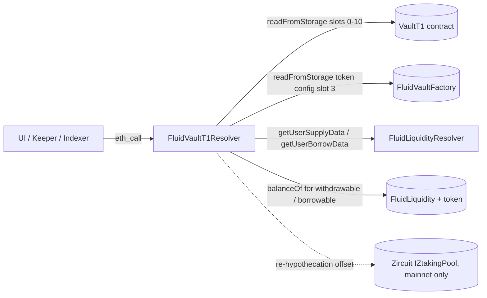

# Periphery / resolvers / vaultT1 — SPEC

## 1. Purpose

Read-only aggregator for the **legacy T1 vault shape**: ERC20 collateral + ERC20 debt, exactly one supply token and one borrow token, no smart-collateral / smart-debt DEX legs. It composes raw `storageRead` probes on a T1 vault with the `FluidLiquidityResolver` to return the same kind of rich structs (`VaultEntireData`, `UserPosition`, `LiquidationStruct`, `AbsorbStruct`) that the general `vault/` resolver returns for T1/T2/T3/T4.

**Superseded.** New integrations MUST use [`vault/`](../vault/SPEC.md) — it covers T1 and every newer vault shape. `FluidVaultT1Resolver` is preserved only for pinned legacy consumers and explicitly self-annotates that fact in a top-of-file comment: *"ATTENTION: Use VaultResolver instead! This is just a temporary legacy-compatible resolver."* It is kept deployable so old UIs / indexers referring to its address by `deployments.md` keep working across upgrades of unrelated vault types.

## 2. Architecture & Data Flow

Reads are pure slot probes on the vault (variables, variables2, absorbedLiquidity, positions map, ticks, branches, rate, rebalancer, absorbed dust) plus typed views (`constantsView()`, `updateExchangePrices`, `fetchLatestPosition`). Cross-layer numbers come from the embedded `FluidLiquidityResolver`. Re-hypothecation is handled by `ResolverHelpers._getLiquidityExternalBalances` inherited from `common/`.

## 3. External Interactions

- **`IFluidVaultFactory FACTORY`** — `totalVaults()`, `getVaultAddress(id)`, ERC-721 enumeration (`balanceOf`, `tokenOfOwnerByIndex`, `ownerOf`, `totalSupply`), and `readFromStorage` on the factory's NFT token-config mapping (slot 3) to resolve `nftId → vault`.
- **`IFluidVaultT1 vault`** — per-vault slot reads (slots 0–10), `constantsView()`, `updateExchangePrices(vars2)`, `fetchLatestPosition(...)` for liquidated positions, and the revert-for-data paths `liquidate(...)` / `absorb()`.
- **`IFluidLiquidity LIQUIDITY`** — direct `readFromStorage` of the vault's `liquidityUserSupplySlot` / `liquidityUserBorrowSlot` (from `constantsView`) to pull raw packed supply/borrow amounts.
- **`IFluidLiquidityResolver LIQUIDITY_RESOLVER`** — typed `getUserSupplyData` / `getUserBorrowData` for per-leg rates and borrow-limit telemetry.
- **`IFluidOracle configs.oracle`** — `getExchangeRateOperate` / `getExchangeRateLiquidate`, with a try/catch fallback to the deprecated `getExchangeRate()` for v1-era oracles.
- **`IZtakingPool` (Zircuit, mainnet only)** — via inherited `ResolverHelpers` to offset `Liquidity.balanceOf(token)` for WEETH / WEETHS re-hypothecation.

## 4. Roles & Access Control

None. No owner, no admin, no auth mapping, no pause, no upgrade hook. Every method is externally callable by anyone; most are `view`, the liquidation / absorb helpers are non-`view` only because they route through revert-for-data paths on the vault (see §8 / §11). The constructor takes immutables only and — unusually for Fluid resolvers — does *not* validate them as non-zero (see §10). This matches the general resolver trust model in [resolvers/SPEC.md §5](../SPEC.md): no privileged callers, no funds held, and replacement (redeploy) as the only upgrade path.

## 5. Storage Layout

No mutable storage. Immutables set once in the constructor:

| Slot | Type | Source |
| --- | --- | --- |
| `FACTORY` | `IFluidVaultFactory` | ctor arg `factory_` |
| `LIQUIDITY` | `IFluidLiquidity` | ctor arg `liquidity_` |
| `LIQUIDITY_RESOLVER` | `IFluidLiquidityResolver` | ctor arg `liquidityResolver_` |

Plus bit-mask constants (`X8`…`X128`), `NATIVE_TOKEN_ADDRESS`, and `EXCHANGE_PRICES_PRECISION = 1e12` declared in `variables.sol`. No per-caller or per-vault cached state.

## 6. Key capabilities (view functions — vault discovery & raw slots)

| Method | Returns | What it does |
| --- | --- | --- |
| `getTotalVaults()` | `uint` | Pass-through to `FACTORY.totalVaults()` (counts *all* vaults, incl. non-T1). |
| `getVaultAddress(vaultId)` | `address` | CREATE2-style derivation via `AddressCalcs.addressCalc`. |
| `getVaultId(vault)` | `uint` | Reads `IFluidVaultT1(vault).VAULT_ID()`. |
| `getVaultType(vault)` | `uint` | `0` if not a Fluid vault; otherwise `IFluidProtocol(vault).TYPE()`, with fallback to `VAULT_T1_TYPE` when the older ABI doesn't expose `TYPE()`. |
| `getAllVaultsAddresses()` | `address[]` | Derives every vault id and **filters** via `FluidProtocolTypes.filterBy(..., VAULT_T1_TYPE)` so only T1 vaults appear. |
| `getTokenConfig(nftId)` | `uint` | Reads factory slot `3` mapping entry — encodes the vault id for the NFT. |
| `vaultByNftId(nftId)` | `address` | Resolves NFT → vault via `tokenConfig >> 192`. |
| `getVaultVariablesRaw / getVaultVariables2Raw / getAbsorbedLiquidityRaw / getPositionDataRaw / getTickDataRaw / getTickHasDebtRaw / getTickIdDataRaw / getBranchDataRaw / getRateRaw / getRebalancer / getAbsorbedDustDebt` | `uint` / `address` | Escape-hatch raw-slot getters on the vault (slots 0, 1, 2, 3[nftId], 5[tick], 4[key], 6[tick][id], 7[branch], 8, 9, 10). |

## 7. Key capabilities (view functions — decoded state)

| Method | Returns | What it aggregates |
| --- | --- | --- |
| `getVaultState(vault)` | `VaultState` | Decodes slot-0: `topTick` (via `tickHelper`), `currentBranch`, `totalBranch`, `totalSupply` / `totalBorrow` (bigmath-decompressed), `totalPositions`, plus the current branch's status / minimaTick / debtFactor / partials / debtLiquidity / baseBranchId / baseBranchMinima. |
| `getVaultEntireData(vault)` | `VaultEntireData` | Top-level one-shot: `constantsView()` + `configs` (rate magnifiers, CF, LT, LML, withdrawal gap, liquidation penalty, borrow fee, oracle + both oracle prices, rebalancer) + `exchangePricesAndRates` (stored + fresh via `updateExchangePrices`, plus rate projections and `rewardsRate = max(supplyRateMagnifier − 10000, 0)`) + `totalSupplyAndBorrow` (vault + liquidity + absorbed, scaled by exchange prices) + `limitsAndAvailability` + `vaultState` + `liquidityUserSupplyData` / `liquidityUserBorrowData` from `FluidLiquidityResolver`. Returns an empty struct unless `getVaultType(vault) == VAULT_T1_TYPE`. |
| `getVaultsEntireData(vaults[])` | `VaultEntireData[]` | Batched form over the given addresses. |
| `getVaultsEntireData()` | `VaultEntireData[]` | Batched form over `getAllVaultsAddresses()` (T1 only). |
| `positionByNftId(nftId)` | `(UserPosition, VaultEntireData)` | Decodes position-data slot (`isSupplyPosition`, `supply`, `dustBorrow`, `tick`, `tickId`), reconstructs `borrow = ratioAtTick(tick) * supply >> 96`, detects liquidation by comparing tick-data liquidation bit & tickId, and calls `fetchLatestPosition` to refresh `tick / borrow / supply` if liquidated. Both raw and exchange-price-scaled amounts (`beforeSupply`, `supply`, etc.) are returned. Vault data attached for free. |
| `positionsNftIdOfUser(user)` | `uint[]` | ERC-721 enumeration. |
| `positionsByUser(user)` | `(UserPosition[], VaultEntireData[])` | Batched `positionByNftId` over every NFT owned by `user`. |
| `totalPositions()` | `uint` | `FACTORY.totalSupply()` — count across **all** vault types. |

### 7.1 `LimitsAndAvailability` derivation

- **Withdraw side**: `calcWithdrawalLimitBeforeOperate` on the raw liquidity user-supply slot → scale by `liquiditySupplyExchangePrice` → subtract a `withdrawalGap` (`userSupply * withdrawalGapConfig / 1e4`, only applied when the limit is active, i.e. above the base limit) → apply the `999999/1000000` rounding haircut → finally cap by on-chain balance (`Liquidity.balance` for native or `token.balanceOf(liquidity)` **plus** `_getLiquidityExternalBalances` for mainnet re-hypothecation).
- **Borrow side**: surfaces `borrowLimit`, `borrowLimitUtilization`, and `borrowableUntilLimit` (same `999999/1000000` haircut) from the embedded liquidity-resolver; then caps `borrowable` by the actual liquidity token balance (again offset for Zircuit).
- **`minimumBorrowing`**: fixed at `10001 * vaultBorrowExchangePrice / 1e12` — matches the minimum debt the T1 core module will accept on `operate`.

All three numbers are intentionally conservative: the resolver applies the same haircuts the protocol itself applies *before* state-changing calls, so a keeper that reads `borrowable` and immediately calls `operate` for that exact amount cannot be frontrun into a "just over the limit" revert.

## 8. Key capabilities (liquidation & absorb — non-`view`)

These methods are declared non-`view` because they route through revert-for-data paths on the vault. They never change state — but solc still type-checks the call, so integrators **must** use `eth_call` / `callStatic`.

| Method | Returns | Behaviour |
| --- | --- | --- |
| `getVaultLiquidation(vault, tokenInAmt)` | `LiquidationStruct` | Calls `IFluidVaultT1.liquidate(tokenInAmt, 0, 0x…dEaD, false)` and then the same with `absorb=true`. Each call is expected to revert with `FluidLiquidateResult(amtOut, amtIn)`; `_decodeLiquidationResult` extracts the two words from the revert payload. `tokenInAmt = 0` is mapped to `X128` for "max". Returns zeros if the vault isn't `VAULT_T1_TYPE`. |
| `getMultipleVaultsLiquidation(vaults[], amounts[])` | `LiquidationStruct[]` | Batched — arrays must be same length. |
| `getAllVaultsLiquidation()` | `LiquidationStruct[]` | Batched over all T1 vaults with `amount=0` (max). |
| `getVaultAbsorb(vault)` | `AbsorbStruct` | **DEPRECATED, v1.0.0 vaults only.** Snapshots `absorbedLiquidityRaw` before and after calling `absorb()`; reports `absorbAvailable = true` iff the raw value changed. |
| `getVaultsAbsorb(vaults[])` / `getVaultsAbsorb()` | `AbsorbStruct[]` | Batched forms (the latter over `getAllVaultsAddresses`). |

## 9. Events

**None.** Resolvers never emit — they are pure readers.

## 10. Errors

No custom errors. Unlike the newer resolvers, the constructor **does not validate zero addresses** (a resolver pointed at `address(0)` will simply fail at first read). Bad inputs propagate as plain revert messages from the target protocol (e.g. invalid NFT id → OpenZeppelin ERC-721 revert from `ownerOf` / `tokenOfOwnerByIndex`, zero vault address from `vaultByNftId` → later dereference will return empty structs rather than revert). `tickHelper` is the only in-resolver revert: `"invalid-number"` if `tickRaw >= 2²⁰`. The revert-for-data paths in §8 catch both `Error(string)` and low-level `bytes` and decode only if the selector matches `IFluidVaultT1.FluidLiquidateResult`; any other revert shape silently yields zero amounts.

## 11. Invariants & Safety Notes

- **Legacy-only scope.** `getAllVaultsAddresses` / `getVaultsEntireData()` filter to `VAULT_T1_TYPE`. A non-T1 vault passed into `getVaultEntireData` returns `{ vault, everything else zero }` — no revert. This is intentional for batch safety, matching the resolver convention in [resolvers/SPEC.md §2.6](../SPEC.md).
- **T1 shape assumed.** All slot offsets (supply at `vars >> 82`, borrow at `vars >> 146`, tick fields, bigmath `(x >> 8) << (x & 0xff)`) are hard-coded for the T1 layout. T2/T3/T4 expose different packings; using this resolver on them returns garbage rather than reverting. Callers MUST check `getVaultType(vault)` before trusting output.
- **Single supply, single borrow token.** No smart-col / smart-debt legs. `constantVariables.supplyToken` and `borrowToken` are regular ERC20 (or `NATIVE_TOKEN_ADDRESS`) and are used directly in the balance-cap logic. On T1 vaults, `liquiditySupplyExchangePrice` and `liquidityBorrowExchangePrice` are genuine Liquidity exchange prices; there is no "set to 1e12 because smart-col" fast path as in the general vault resolver.
- **Non-`view` methods must be called via `eth_call`.** `getVaultLiquidation`, `getMultipleVaultsLiquidation`, `getAllVaultsLiquidation`, and the `getVaultAbsorb*` family all dispatch to methods that normally revert or mutate; sending a live tx wastes gas and produces the same read-only answer.
- **Re-hypothecation offset.** Withdrawable / borrowable are adjusted via `_getLiquidityExternalBalances` (WEETH / WEETHS on mainnet through Zircuit). Off-mainnet the offset is `0` automatically.
- **Oracle fallback.** Legacy T1 oracles without `getExchangeRateOperate` are handled via try/catch to `getExchangeRate()`, with `oraclePriceOperate == oraclePriceLiquidate` in that case. A zero oracle address short-circuits and leaves both prices as `0` rather than reverting.
- **Stateless.** Redeployment is the only upgrade path. No setters, no migration hooks, no per-caller state.
- **Filter consistency.** `getAllVaultsAddresses` returns a dense, filtered list (non-T1 slots are omitted, not zero-padded) — callers iterating the result cannot assume indices line up with factory vault ids.

## 12. Trust Model & Audit Notes

- **Read-only, no funds, no privileges.** A buggy or malicious deployment can only feed wrong numbers to its caller; it cannot move funds, change config, or pause anything. See [resolvers/SPEC.md §7](../SPEC.md) for the shared resolver trust model.
- **Prefer `vault/` for new integrations.** `FluidVaultT1Resolver` is intentionally frozen in its legacy behaviour: the slot offsets, `filterBy(VAULT_T1_TYPE)`, and the deprecated absorb API will not be extended to cover smart-col / smart-debt vaults. Any attempt to "upgrade" this resolver to newer shapes is out of scope — use `FluidVaultResolver` instead.
- **Storage-layout pinning.** The hard-coded slot offsets assume the T1 vault ABI as of its original deployment. A hypothetical upgrade to T1 storage would silently break this resolver (fields would read zero or garbage, not revert). Governance treats T1 layout as effectively frozen; if that ever changes, a new resolver must be deployed and `deployments.md` updated.
- **No input validation in the constructor.** A deliberate omission carried over from the earliest resolver deploys — newer resolvers (`vault/`, `dex/`, `dexLite/`) revert with `*__AddressZero`. Consumers must trust `deployments.md` to supply a valid triple `(factory, liquidity, liquidityResolver)`.
- **Audit dispositions.** Historic finding — non-`view` liquidation simulation — is intended: the revert-for-data pattern is the only way to reuse the live liquidation math without duplicating it in the resolver. Callers are expected to use `eth_call`. Audit reports confirm this is the canonical shape and is not a bug. The absorb API is explicitly flagged `DEPRECATED, only works for vaults v1.0.0`; current T1 vaults no longer need it because absorb is performed implicitly during liquidation.
- **Replacement path.** If a legacy consumer needs to continue reading T1 state after this resolver becomes unmaintainable, the migration is to swap their RPC calls to `FluidVaultResolver` (which still returns a compatible `VaultEntireData` shape for T1) — no on-chain cutover is required because nothing in Fluid references this resolver from another contract.
