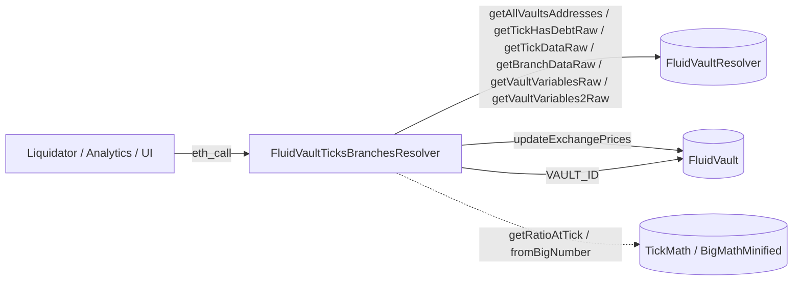

# Periphery / resolvers / vaultTicksBranches — SPEC

## 1. Purpose

Read-only view of the Fluid Vault **tick / branch liquidation engine** — the concentrated-liquidation data structure shared by all vault types (T1/T2/T3/T4). The resolver walks the vault's `tickHasDebt` bitmap to enumerate every currently-populated tick together with its raw + normalized collateral / debt, and walks the `branchData` linked list to expose branch heads, merges and absorptions with their debt factors and base-branch pointers.

It is consumed by:

- **Liquidation keepers** that need to target ticks / branches above the current liquidation threshold.
- **Analytics / dashboards** rendering the vault's debt curve (collateralization distribution across ticks).
- **Risk tools** inspecting branch topology after partial liquidations, merges and absorb events.

Single concrete contract, no abstract mix-ins:

| Contract | File | Role |
| --- | --- | --- |
| `FluidVaultTicksBranchesResolver` | `main.sol` | Aggregator. Walks the tick bitmap, reads tick / branch slots via the Vault Resolver, normalizes with live exchange prices. |
| `Variables` | `variables.sol` | Immutable `VAULT_RESOLVER`; bit masks `X8 / X19 / X20 / X30 / X50 / X64`. |
| `Structs` | `structs.sol` | `TickDebt`, `VaultsTickDebt`, `BranchDebt`, `BranchesDebt`. |

Applies to every vault deployed by `FluidVaultFactory`; there is no T1-only / DEX-only variant because the tick / branch engine is identical across vault types (see [vaultTypesCommon/SPEC.md](../../../protocols/vault/vaultTypesCommon/SPEC.md)).

## 2. Architecture & Data Flow

Hot path for a keeper snapshot: `getAllVaultsTicksDebt(totalTicks)` → enumerate vaults → per vault read `vaultVariables` (top tick) → walk `tickHasDebt` bitmap downward from the top tick for `totalTicks` steps → decompress `tickData` BigNumber debt → multiply by live `vaultBorrowExchangePrice`.

## 3. External Interactions

- **FluidVaultResolver** — the only upstream dependency. Consumed through its typed raw-slot getters: `getVaultVariablesRaw`, `getVaultVariables2Raw`, `getTickHasDebtRaw(vault, mapId)`, `getTickDataRaw(vault, tick)`, `getBranchDataRaw(vault, branchId)`, `getAllVaultsAddresses()`.
- **FluidVault** (`IFluidVault`) — `updateExchangePrices(vaultVariables2)` to fetch the current supply & borrow exchange prices used for `debtNormal` / `collateralNormal`. Declared non-`view` on the vault but does not mutate when invoked via `eth_call`.
- **FluidVaultT1** (`IFluidVaultT1`) — only for `VAULT_ID()` on batch helpers. All other vault types expose the same selector, so the T1 ABI suffices.
- **TickMath** — `getRatioAtTick(int)` to recover the `ratioX96 = debt / collateral` at a tick, and to back-solve `collateralRaw = debtRaw * (1 << 96) / ratio`.
- **BigMathMinified** — `mostSignificantBit` (bitmap iteration) and `fromBigNumber` (branch debt decompression from the 64-bit coefficient+exponent form).
- **No writes. No balances. No native ETH.**

## 4. Roles & Access Control

None. Every external function is `view` and callable by anyone. No owner, no pauser, no governance hook.

## 5. Storage Layout

Immutable only:

| Name | Type | Source |
| --- | --- | --- |
| `VAULT_RESOLVER` | `IFluidVaultResolver` | Constructor arg; reverts `FluidVaultTicksBranchesResolver__AddressZero` if zero. |

Bit-mask constants (internal): `X8` (8 bits), `X19` (19 bits, tick absolute value), `X20` (20 bits, signed-tick raw), `X30` (30 bits, branch id / partial), `X50` (50 bits, debt factor), `X64` (64 bits, BigNumber slot).

Replacement path: redeploy. The resolver has no migration state.

## 6. View Functions — Tick Data

Every tick function returns the **raw** BigNumber-decoded amounts *and* their exchange-price-normalized twin, so consumers don't have to re-fetch prices for rendering.

| Function | Returns | Description |
| --- | --- | --- |
| `getTicksDebt(vault, fromTick, totalTicks)` | `(TickDebt[] ticksDebt, int toTick)` | Walks `tickHasDebt` from `min(fromTick, topTick)` **downward** by `totalTicks - 1` ticks (inclusive), emitting a `TickDebt` for every populated tick. Two passes: `_countTicksWithDebt` for sizing, `_populateTicksDebt` for filling. Returns `(empty, 0)` when `topTick == type(int).min` (no positions). `toTick` is the inclusive lower bound reached. |
| `getMultipleVaultsTicksDebt(vaults[], fromTicks[], totalTicks[])` | `VaultsTickDebt[]` | Per-vault batch of `getTicksDebt` with independent `fromTicks` / `totalTicks`. Packs `vaultAddress` + `vaultId` alongside the tick array. |
| `getVaultsTicksDebt(vaults[], totalTicks[])` | `VaultsTickDebt[]` | Same as above, but `fromTick_` is forced to `type(int).max` so each walk starts from the vault's live top tick. |
| `getAllVaultsTicksDebt(totalTicks)` | `VaultsTickDebt[]` | `getAllVaultsAddresses()` ⊗ `getVaultsTicksDebt`. Uses a single `totalTicks` cap for every vault. |

`TickDebt` fields:

| Field | Meaning |
| --- | --- |
| `debtRaw` | Debt at this tick in raw (liquidity-share) units. Decompressed from `tickData[25..88]` via the `(coeff << exp)` BigNumber shape. |
| `collateralRaw` | Back-solved from `debtRaw * (1 << 96) / ratioX96` — no separate slot, collateral is implied by the tick's price. |
| `debtNormal` | `debtRaw * vaultBorrowExchangePrice / 1e12`. |
| `collateralNormal` | `collateralRaw * vaultSupplyExchangePrice / 1e12`. |
| `ratio` | `TickMath.getRatioAtTick(tick)` — Q64.96 debt/collateral at the tick. |
| `tick` | Signed tick index. |

Bitmap walk mechanics:

- Each `tickHasDebt` mapId covers 256 ticks (`mapId * 256 + bit - 1`). The walker starts at `startMapId = fromTick < 0 ? ((fromTick + 1) / 256) - 1 : fromTick / 256`, masks off bits above `fromTick` by double-shifting, and iterates `mostSignificantBit` → clear → advance.
- When the current map is exhausted it decrements `mapId`; if `mapId == -129` the walk terminates (the vault tick range never extends below that map id).
- The count pass is pure bitmap arithmetic (no `tickData` SLOAD per tick), so `_populateTicksDebt` gets an exact array size up-front.

## 7. View Functions — Branch Data

The liquidation engine represents partially-liquidated tick ranges as **branches** in a linked list keyed by `branchId`, where the active branch is `(vaultVariables >> 52) & X30`. Each branch has a `status`:

- `0` — **active** (not yet liquidated; only the current branch can be in this state).
- `1` — **liquidated** (partial liquidation in progress; holds live debt + partials position).
- `2` — **merged** into its base branch.
- `3` — **absorbed** (bad debt socialized by governance).

| Function | Returns | Description |
| --- | --- | --- |
| `getBranchesDebt(vault, fromBranchId, toBranchId)` | `BranchDebt[]` | Iterates `fromBranchId → toBranchId` **descending**. Clamps `fromBranchId` to `totalBranch_ = (vaultVariables >> 52) & X30`; clamps `toBranchId` up from `0` to `1`. Requires `fromBranchId >= toBranchId` (reverts with a string). |
| `getMultipleVaultsBranchesDebt(vaults[], fromBranchIds[], toBranchIds[])` | `BranchesDebt[]` | Batch form. |
| `getVaultsBranchesDebt(vaults[])` | `BranchesDebt[]` | Full walk per vault: `fromBranchId = type(uint).max` (clamped to `totalBranch_`), `toBranchId = 0 → 1`. |
| `getAllVaultsBranchesDebt()` | `BranchesDebt[]` | All factory-deployed vaults, full walk. |

Per-branch routing inside `_getBranchDebt`:

| Status | Helper | Populated fields |
| --- | --- | --- |
| `0` active | `_getActiveBranchDebt` | `tick = topTick` (the tick from which liquidation would start); `ratio = getRatioAtTick(topTick)`; `debtRaw / collateralRaw / *Normal / partials = 0` because no liquidation has been crossed yet. |
| `1` liquidated | `_getLiquidatedBranchDebt` | `debtRaw = fromBigNumber(branchData[52..115])`; `minimaTick` = branch's current minima; `collateralRaw + ratio` derived from `_getCollateralRaw` (walks the fractional `partials / X30` inside the 15-bp tick step using `ratio * 10000 / 10015`); normals computed via `updateExchangePrices`. |
| `2 / 3` merged / absorbed | `_getClosedOrMergedBranchDebt` | Live debt zeroed; `tick = baseBranchTick` (the tick where the branch was retired). |

`BranchDebt` fields:

| Field | Meaning |
| --- | --- |
| `debtRaw` / `collateralRaw` | Live raw liquidity debt and back-solved collateral. Non-zero only for status `1`. |
| `debtNormal` / `collateralNormal` | Exchange-price-normalized twins. Non-zero only for status `1`. |
| `branchId` | Identifier (0 for the sentinel; active ids are 1-indexed). |
| `status` | See enum above. |
| `tick` | Context tick — `topTick` for active, `minimaTick` for liquidated, `baseBranchTick` for merged / absorbed. |
| `partials` | Sub-tick fractional position in `[0, X30)`; only meaningful for status `1`. |
| `ratio` | `getRatioAtTick(tick)` where defined, else `0` (active branch with no top tick). |
| `debtFactor` | 50-bit compounding factor bits `[116..165]` — multiplied into descendant-branch debt accounting when branches merge. |
| `baseBranchId` | Parent branch id (bits `[166..195]`). |
| `baseBranchTick` | Tick at which this branch was spawned from its parent (bits `[196..215]`). `type(int).min` ⇒ master branch. |

## 8. View Functions — Global / Batch

| Function | Returns | Description |
| --- | --- | --- |
| `getAllVaultsTicksDebt(totalTicks)` | `VaultsTickDebt[]` | §6 — whole-protocol tick sweep. Top-level "scan all vaults" entry point for keepers. |
| `getAllVaultsBranchesDebt()` | `BranchesDebt[]` | §7 — whole-protocol branch sweep. |

There is no separate global-state reader; "global" data for this resolver *is* the per-vault top tick and active-branch id, which are already threaded through the per-vault calls.

## 9. Errors

| Error | When |
| --- | --- |
| `FluidVaultTicksBranchesResolver__AddressZero` | Constructor called with `vaultResolver_ == address(0)`. |
| `"fromBranchId_ must be greater than or equal to toBranchId_"` (string) | `getBranchesDebt` called with inverted bounds after clamping. |
| `"invalid-number"` (string) | `_tickHelper` reads a raw tick field `>= X20` (i.e. > 20 bits); indicates corrupt vault storage and should not occur on a well-formed vault. |

All other protocol-side reverts (e.g. a stub vault implementation that does not expose the expected selectors) propagate unchanged — the resolver does not wrap them.

## 10. Deployment Checklist

1. Deploy `FluidVaultResolver` first (this resolver has no other dependency).
2. `new FluidVaultTicksBranchesResolver(vaultResolver)`.
3. Register the address off-chain (keepers, analytics dashboards, `deployments.md`). No on-chain registration needed.
4. Redeploy whenever the tick / branch slot layout changes on the vault protocol — the bit-offsets in `_getBranchDebt` and the `tickData[25..88]` slice in `_populateTicksDebt` are hard-coded and will silently return wrong numbers if the underlying layout moves.

## 11. Invariants & Safety Notes

- **Read-only.** No state writes, no balance custody. `updateExchangePrices` is declared non-`view` on the vault but is invariant-preserving when invoked through `eth_call`; callers must use `eth_call` / `callStatic` for all tick / branch methods that indirectly touch it (`getTicksDebt`, `_getLiquidatedBranchDebt`, and every batch wrapper around them).
- **Descending walk only.** Both the tick bitmap and the branch linked list are walked from the vault's top downward; there is no "from the bottom" entry point. This matches the liquidation engine, which always liquidates starting from the top tick.
- **Empty-vault semantics.** `topTick == type(int).min` ⇒ `getTicksDebt` returns `(empty, 0)` without reverting. `totalBranch_ == 0` clamps to `1`, so `getBranchesDebt` still returns a single zero-ish entry; consumers should treat `status == 0 && debtRaw == 0` as "no activity".
- **Exchange-price freshness.** `debtNormal` / `collateralNormal` use the **current-block** supply / borrow exchange prices returned by `updateExchangePrices`, not the packed-snapshot values in `vaultVariables2`. Two calls in the same block return identical normalization factors.
- **Collateral is implied, not stored.** Per-tick `collateralRaw` is algebraic: `debtRaw * 2^96 / ratioX96`. Any precision loss in `TickMath.getRatioAtTick` propagates proportionally. The same holds for branch `collateralRaw` on the liquidated branch, where the `partials / X30` fractional tick walk adds a second rounding step (≤ 1 wei per 15-bp tick).
- **BigNumber decompression.** `tickData` packs debt as an 8-bit exponent + 56-bit coefficient at bits `[25..88]` (`(coeff << exp)` reconstruction inlined). Branch debt uses the standard 64-bit BigNumber at bits `[52..115]` decoded via `BigMathMinified.fromBigNumber`. Both conventions are audited and shared with the vault core.
- **Map-id bound.** The bitmap walk terminates at `mapId == -129` — matching the vault's minimum tick `-32767` (since `-32767 / 256 ≈ -128`). A vault that ever populated a tick beyond this range would silently truncate; the protocol constrains ticks inside `[MIN_TICK, MAX_TICK]` so this cannot happen with well-formed storage.
- **Batch functions fan out linearly.** Array-input variants do not deduplicate vaults — callers wanting a unique sweep must dedupe client-side before calling.
- **No reentrancy surface.** All calls are read-only; the only external non-`view` call (`updateExchangePrices`) is still side-effect-free under `eth_call`.

## 12. Trust Model & Audit Notes

- **No trust required in the resolver.** It is a passive decoder; a compromised or buggy instance can return wrong numbers but cannot move funds, change vault state, or influence liquidations beyond misleading a keeper that trusted the output.
- **Trust inherited from `FluidVaultResolver`.** Every storage read flows through it. If the upstream resolver points at a stale / spoofed vault factory, this resolver will faithfully expose whatever tick / branch slots live at those addresses.
- **Keeper integration pitfalls**: (a) `debtNormal` / `collateralNormal` are accurate for the **current block only** — any auction or liquidation that fires before the keeper's tx settles will shift both; (b) `BranchDebt.debtFactor` is meaningful in the context of the branch's descendant chain, not on its own — tooling comparing two branches must also follow `baseBranchId` backward; (c) `partials` is a sub-tick offset, not a percent — divide by `X30` to get the fraction.
- **Layout dependency.** The hard-coded bit ranges (`>> 2 & X20`, `>> 52 & X30`, `>> 116 & X50`, `>> 166 & X30`, `>> 196 & X20`, `>> 25 & X64` and the `>> 22 & X30` partials slice) mirror the vault storage packing in `vaultTypesCommon/common/variables.sol`. Any change to that packing is a breaking upgrade for this resolver.
- **Upgrade path**: redeploy and update consumers. No on-chain state migrates.
