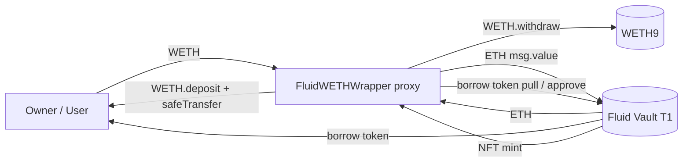

# Periphery / wethWrapper — SPEC

## 1. Purpose

Per-user upgradeable proxy that fronts a **single Fluid Vault T1** (WETH collateral / ERC20 debt — e.g. WETH/USDC) behind an **Aave-style external interface** (`supply` / `withdraw` / `borrow` / `repay`). Internally it converts WETH ↔ native ETH as required, because Fluid Vault T1 takes/returns ETH for a native-ETH collateral market, while the external interface lets integrators keep their flow in WETH.

One wrapper instance owns one NFT position on one vault, has one owner (the user). Ownership is enforced through `OwnableUpgradeable`, and every operational method is `onlyOwner`.

## 2. Architecture & Flow

- **Supply**: user sends WETH → wrapper unwraps → forwards ETH as `msg.value` to `VAULT.operate`. First call mints an NFT to the wrapper; subsequent calls reuse the stored `nftId`.
- **Withdraw**: `VAULT.operate` with negative collateral → ETH returned to wrapper (via Liquidity) → wrapper `WETH.deposit`s → sends WETH to `to`.
- **Borrow**: `VAULT.operate` with positive borrow; the borrow token is sent **directly from the vault to the user** (`onBehalfOf`), bypassing the wrapper.
- **Repay**: wrapper pulls borrow token from user, approves the vault, calls `VAULT.operate` with negative borrow.

## 3. External Interactions

| Target | Via | Why |
| --- | --- | --- |
| `IWETH9 WETH` | `deposit()` / `withdraw()` | ETH ↔ WETH conversion each op. |
| `IFluidVaultT1 VAULT` | `operate()` | Single entry point for collateral/debt changes. |
| `LIQUIDITY` | `receive()` source only | ETH arrives here when withdrawing. |
| `VAULT_FACTORY` | `onERC721Received` sender only | Accept the position NFT at first mint. |
| Borrow token (e.g. USDC) | `safeTransferFrom` / `safeApprove` | Pull & approve for repay. |
| Vault storage | `readFromStorage` | View helpers (`getPosition`) decode packed position / tick. |

## 4. Roles & Access Control

| Role | Capability |
| --- | --- |
| `owner` (UUPS `Ownable`) | Every operational method (`supply` / `withdraw` / `borrow` / `repay`), `spell` (arbitrary delegatecall), `_authorizeUpgrade`, `transferOwnership`. |
| `msg.sender == onBehalfOf` | Extra check on `supply` / `borrow` / `repay`: the Aave-style `onBehalfOf` parameter must equal the caller. `borrow` uses the distinct error `Weth_BorrowNotSupported`; `supply`/`repay` revert with `Weth_NotOwner`. |
| `VAULT_FACTORY` | Only address allowed to call `onERC721Received`. |
| `LIQUIDITY` + `WETH` | Only senders whose plain ETH transfers are accepted by `receive()`. |

There is **no multisig / governance**. Each deployment is owned by its individual user (or their governance). The `spell` escape hatch means the owner has unrestricted power over the proxy.

## 5. Storage Layout

Upgradeable contract — storage order is consensus.

| Slot (logical) | Name | Notes |
| --- | --- | --- |
| inherited | `Initializable` `_initialized` / `_initializing` | OZ upgradeable boilerplate. |
| inherited | `OwnableUpgradeable._owner` | Set by `initialize()` to `msg.sender`. |
| local | `uint8 _status` | Reentrancy flag (`1` = NOT_ENTERED, `2` = ENTERED). |
| local | `uint64 nftId` | The vault position NFT id. `0` until first `supply` mints one. |

Immutables (per implementation): `WETH`, `VAULT`, `BORROW_TOKEN`, `VAULT_FACTORY`, `LIQUIDITY`, `VAULT_ID`. All derived from `vaultAddress_` in the constructor; `weth_` supplied explicitly.

Bit-decoding constants: `X8 / X19 / X24 / X64` for packed position / tick data reads.

## 6. Public Capabilities

### Collateral (WETH side)

| Method | Flow |
| --- | --- |
| `supply(asset, amount, onBehalfOf, referralCode)` | `asset == WETH` and `onBehalfOf == msg.sender`, `amount > 0`. Pulls WETH, `WETH.withdraw(amount)`, calls `VAULT.operate{value: amount}(nftId, +amount, 0, this)`. On first call stores the minted `nftId`. Emits `LogDeposit`. |
| `withdraw(asset, amount, to)` | `asset == WETH`, `amount > 0` (`type(uint256).max` ⇒ `type(int256).min` pass-through for max withdraw). `VAULT.operate` with negative collateral to `this`, then `WETH.deposit` the ETH and `safeTransfer` to `to`. Emits `LogWithdraw`. |

### Debt (borrow token side)

| Method | Flow |
| --- | --- |
| `borrow(asset, amount, interestRateMode, referralCode, onBehalfOf)` | `asset == BORROW_TOKEN`, `onBehalfOf == msg.sender`, `amount > 0`. `VAULT.operate` with positive borrow, recipient = `onBehalfOf` (vault pays user directly). Emits `LogBorrow`. |
| `repay(asset, amount, interestRateMode, onBehalfOf)` | `asset == BORROW_TOKEN`, `onBehalfOf == msg.sender`, `amount > 0`. `amount == type(uint256).max` → resolves actual debt via `_getPositionBorrow()` (exchange-price + dust + rounding-up + 1 wei cushion) and passes `type(int256).min` to `operate`. Pulls borrow token, approves vault, calls `operate`. Emits `LogPayback`. |

### Views

| Method | Purpose |
| --- | --- |
| `getPosition()` | Returns `(supply, borrow)` for the wrapper's NFT, decoded from packed `positionData` + tick data, normalized by latest supply/borrow exchange prices. Supply variant does not add the +1 wei max-repay cushion; borrow variant does. |
| `onERC721Received` | ERC-721 receiver hook, restricted to `VAULT_FACTORY`, reverts if `nftId != 0`. |

### Receive

`receive()` accepts ETH only from `LIQUIDITY` or `WETH`. Reverts `Weth_NotLiquidity` otherwise.

## 7. Admin Capabilities

| Method | Restriction | Behaviour |
| --- | --- | --- |
| `initialize()` | one-shot `initializer` | Sets reentrancy status and owner = caller. |
| `transferOwnership(newOwner)` | `onlyOwner`, `newOwner != 0` | Standard OZ-style transfer. |
| `_authorizeUpgrade(newImplementation)` | `onlyOwner` | UUPS gate — only the owner can upgrade its own proxy. |
| `spell(target, data)` | `onlyOwner` | Arbitrary `delegatecall`. Intentionally omnipotent escape hatch; propagates reverts. |

No pausing, no rescue, no admin config of vault / WETH / borrow-token (all immutable).

## 8. Events

From `events.sol`, emitted inside the four operational methods; no admin events beyond OZ's `OwnershipTransferred`.

- `LogDeposit(user, nftId, amount)`
- `LogWithdraw(user, nftId, amount)` — `user` is the `to` argument, not `msg.sender`
- `LogBorrow(user, nftId, amount)` — `user` is `onBehalfOf`
- `LogPayback(user, nftId, amount)` — `amount` is the resolved value used (exchange-price inflated for max payback)

## 9. Errors

All raised as `FluidWethWrapperError(errorId_)` from `error.sol`.

| Code | Name | When |
| --- | --- | --- |
| 110001 | `WETH__ZeroAmount` | `amount == 0` on any op. |
| 110002 | `Weth_ReEntracy` | `nonReentrant` tripped. |
| 110003 | `Weth_ZeroAddress` | Constructor got zero vault or zero WETH. |
| 110004 | `Weth_NotVaultFactory` | `onERC721Received` called by other than `VAULT_FACTORY`. |
| 110005 | `Weth_AssetNotSupported` | `asset` argument not the expected token (WETH for collateral ops, `BORROW_TOKEN` for debt ops). |
| 110006 | `Weth_AlreadyMinted` | Second NFT pushed onto the wrapper. |
| 110007 | `Weth_NotOwner` | `onBehalfOf != msg.sender` on `supply` / `repay`. |
| 110008 | `Weth_NotLiquidity` | Native ETH received from an address that is neither `LIQUIDITY` nor `WETH`. |
| 110009 | `Weth_BorrowNotSupported` | `onBehalfOf != msg.sender` on `borrow`. |

## 10. Invariants & Safety Notes

- **No stuck balances (happy path).** Each op strictly forwards value: WETH in → ETH to vault; ETH from vault → WETH out to `to`; borrow token in → vault; borrow token from vault → user directly. The wrapper holds dust only transiently during a single call.
- **ETH ingress is restricted.** `receive()` rejects non-`LIQUIDITY` / non-`WETH` senders, preventing stray ETH from getting trapped or confused with op flows.
- **Single-position invariant.** `nftId` is assigned exactly once — first `supply` captures the newly-minted id; `onERC721Received` refuses any further NFT push.
- **Reentrancy.** All four operational methods are `nonReentrant`; `receive()` and view methods are not — they are not state-mutating entry points.
- **Aave-style strictness.** `onBehalfOf == msg.sender` is enforced on `supply` / `borrow` / `repay`. The Aave parameter is kept for interface compatibility but delegated-deposits are explicitly disallowed, so there is no mis-attribution risk.
- **`spell` is an unguarded `delegatecall`.** It executes in this proxy's storage context. The owner can arbitrarily rewrite storage (including `_owner`, `nftId`, `_status`), migrate, or drain. This is by design — it is the same escape hatch used elsewhere in Fluid for instance-owned proxies. Review as such.
- **Max-repay cushion.** `repay(max)` uses `_getPositionBorrow()` which rounds debt up by `1e12 - 1` and adds `1 wei`, then passes `type(int256).min` to `operate`. The `1 wei` covers block-time interest accrual between view and state-change. Leftover debt is settled by the vault's `type(int).min` path; leftover pulled funds are consumed by the vault, not retained here.
- **Max-withdraw passthrough.** `withdraw(max)` forwards `type(int256).min` to the vault; the vault returns the actual amount, which the wrapper wraps and forwards.
- **Upgradeability is per-user.** Each proxy upgrades independently; there is no shared beacon. Owner loss = proxy loss.

## 11. Trust Model

- **Root of trust**: the proxy owner (the end user or their governance). Owner can call `spell`, `upgrade`, rotate ownership. There is no higher authority.
- **Vault / WETH / borrow token are pinned at construction** and cannot change even through upgrades without `spell`-level reset — changing them would invalidate the NFT.
- **Vault factory + Liquidity are trusted** as senders (NFT pusher, ETH payer). Any other ERC-721 push or ETH send is rejected.
- **Integrators** treating this like an Aave pool must remember: each proxy is single-vault, single-owner, single-position. Multi-user dApp frontends must deploy one proxy per user.

## 12. Deployment / Audit Notes

- Deploy `FluidWETHWrapper` implementation once per chain (constructor takes `vaultAddress_`, `weth_` — so one implementation per `(vault, WETH)` pair).
- Per user, deploy `FluidWethWrapperProxy(implementation, initData)` with `initData = abi.encodeCall(initialize, ())`. The `initialize()` call makes `msg.sender` of the proxy-creation call the `owner`.
- `_disableInitializers()` is in the implementation's constructor; the implementation cannot be initialized directly (UUPS best practice).
- **Solidity**: `0.8.21`. No transient storage / `tstore`; the storage-bit reentrancy guard is used instead.
- **Audit focus**:
  - `spell` authority (expected by design).
  - Max-repay / max-withdraw passthrough integer conversions (`type(int256).min`).
  - `getPosition` packed-bit decoding matches vault T1 storage format and tick-math rounding.
  - `receive()` whitelist correctness — any new source of ETH to the wrapper should be evaluated.
  - UUPS upgrade path (owner-only) combined with `spell` effectively gives the owner total control; this is the intended trust boundary.
