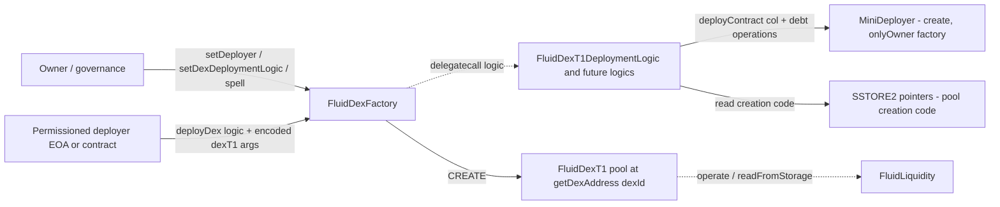

# DEX — SPEC (top-level)

## 0. Gas-optimisation tier

**Hot path for swap / operate / deposit / withdraw / borrow / payback**: `poolT1/coreModule/**` and `smartLending/**` user-facing entry points. Liquidators and integrators compete on tx cost; every SLOAD in the hot path costs real USD across the protocol. Keep packed-storage reads in memory, avoid redundant math, don't add checks unless they plug a reachable safety hole.

**Cold path**: `poolT1/adminModule/**`, factory deploy / governance / pause / auth surfaces, `FluidDexFactory` itself. All protected by trusted auths (see [`../config/SPEC.md`](../../config/SPEC.md)). Defensive `require`s / events are welcome — a rebalancer or multisig batch runs once per governance window, not per block.

Security always wins over gas on both tiers: if a check closes a reachable hole in the trust model, add it even on the hot path.


> This spec covers the **cross-cutting DEX layer**: the factory, deployment helpers, shared errors / interfaces, and the deterministic addressing / deployment flow used by all Fluid DEX pool types. The actual pool runtime lives in dedicated specs:
>
> - [contracts/protocols/dex/poolT1/SPEC.md](./poolT1/SPEC.md) — FluidDexT1, the full concentrated-liquidity pool with smart collateral + smart debt.
> - [contracts/protocols/dex/smartLending/SPEC.md](./smartLending/SPEC.md) — FluidSmartLending, the ERC-20 wrapper around a DEX T1 smart-collateral position, plus its factory.
>
> For the minimal single-contract swap primitive see [contracts/protocols/dexLite/SPEC.md](../dexLite/SPEC.md).

## 1. Purpose

Fluid DEX is the **full AMM protocol stack** that sits on top of [Fluid Liquidity](../../liquidity/SPEC.md). Unlike DexLite — which holds balances on its own contract and exposes a single-pool swap surface — a Fluid DEX pool is a **separately deployed contract per pool** that routes **swap / deposit / withdraw / borrow / payback** flows through Liquidity via `operate`. This enables **smart collateral** (pool liquidity is Liquidity supply) and **smart debt** (pool liquidity is Liquidity borrow), and lets DEX integrate natively with [Vault](../vault/SPEC.md) T2 / T3 / T4 types for leverage.

`FluidDexFactory` (this spec) is the deployment / permissioning hub for DEX pools. It does not itself execute swaps — it **allocates deterministic `dexId`s**, whitelists **deployment logic contracts** (one per DEX implementation type, e.g. T1), and deploys pool contracts at **predictable CREATE addresses**. Deployed pools start **without Liquidity config**; wiring the new pool into Liquidity (token configs, user supply / borrow configs, rates) is a separate governance step — see [contracts/liquidity/SPEC.md](../../liquidity/SPEC.md) and [contracts/config/SPEC.md](../../config/SPEC.md).

## 2. Architecture



Files (all under `contracts/protocols/dex/`):

- `error.sol` — `FluidDexError(uint256)`, `FluidDexFactoryError(uint256)`, `FluidSmartLendingError(uint256)`, `FluidSmartLendingFactoryError(uint256)`, plus pool simulation errors (`FluidDexSwapResult`, `FluidDexLiquidityOutput`, `FluidDexPerfectLiquidityOutput`, `FluidDexSingleTokenOutput`, `FluidDexPricesAndExchangeRates`).
- `errorTypes.sol` — numeric code groups: `51xxx` DexT1 runtime, `52xxx` DexT1 admin, `53xxx` DEX factory, `54xxx` SmartLending, `55xxx` SmartLending factory.
- `interfaces/iDexFactory.sol` — `IFluidDexFactory` (read-only: `isGlobalAuth`, `isDexAuth`, `totalDexes`, `getDexAddress`, `readFromStorage`).
- `interfaces/iDexT1.sol` — `IFluidDexT1` external surface (swap, liquidity ops, `constantsView`, simulation errors).
- `factory/main.sol` — `FluidDexFactory`: deployer / auth maps, deployment-logic whitelist, `deployDex`, `spell`, `isDex`, `getDexAddress`.
- `factory/deploymentHelpers/miniDeployer.sol` — `MiniDeployer`: `onlyOwner` `deployContract(bytes)` via plain `create`, used by deployment-logic contracts to deploy inner helpers.
- `factory/deploymentHelpers/SSTORE2Deployer.sol` — permissionless `deployCode` / `deployCodeSplit` that publishes bytecode through SSTORE2 (with the 24 KB split path); callers build deployment-logic contracts around the resulting pointers.
- `factory/deploymentLogics/poolT1Logic.sol` — `FluidDexT1DeploymentLogic`: `dexT1(...)` which runs only under factory `delegatecall`, deploys col / debt operation impls via `MiniDeployer`, and returns the concatenated pool creation bytecode.
- `poolT1/` — the deployed pool runtime (see its SPEC).
- `smartLending/` — the ERC-20 smart-lending wrapper and its own factory (see its SPEC).

Deployment flow (T1 pool) in one line: `deployer → FluidDexFactory.deployDex(poolT1Logic, encoded dexT1(token0, token1, oracleMapping)) → delegatecall into poolT1Logic → MiniDeployer deploys col + debt operations → SSTORE2 creation code + packed constants returned → factory CREATEs the pool at getDexAddress(dexId_) → isDex check → LogDexDeployed`.

## 3. External Interactions

- **Factory calls**
  - `delegatecall(dexDeploymentLogic_, dexDeploymentData_)` in `deployDex`.
  - Plain `create` via `_deploy(bytecode)` to place the pool at the predicted address.
  - `staticcall(pool.DEX_ID())` inside `isDex` to validate the deployed code has the correct id.
- **Deployment-logic calls** (under factory delegatecall)
  - `IFluidDexFactory(address(this)).totalDexes()` / `getDexAddress(...)` to bind the new pool id into its own immutables.
  - `MiniDeployer.deployContract(bytes)` to deploy the per-pool col / debt operation contracts.
  - `SSTORE2.read(pointer)` to reassemble the packed pool creation code.
  - `LiquiditySlotsLink.calculate*StorageSlot(...)` to precompute Liquidity slot pointers that the pool will use in its immutables.
- **Callers into the factory**
  - `deployDex` — any permissioned `isDeployer` address (owner also qualifies).
  - `setDeployer` / `setGlobalAuth` / `setDexAuth` / `setDexDeploymentLogic` / `spell` — owner only.
  - `totalDexes` / `getDexAddress` / `isDex` / `isGlobalAuth` / `isDexAuth` / `isDexDeploymentLogic` / `readFromStorage` — anyone.
- **Downstream consumers of auths**
  - Each deployed pool (e.g. `FluidDexT1`) resolves admin access by calling `DEX_FACTORY.isGlobalAuth(caller)` / `isDexAuth(pool, caller)` on its own fallback path. The factory is therefore the **auth registry** for the whole DEX protocol.
  - Integrators use `isDex` to gate recognition of "real" Fluid DEX pools.

## 4. Capabilities & Responsibilities

The DEX factory does:

- Allocate monotonic `dexId`s and deterministically compute pool addresses via `AddressCalcs.addressCalc(factory, dexId)` (the standard Ethereum CREATE address formula over deployer + nonce).
- Maintain the **deployment-logic whitelist**. Each logic contract is a delegatecall-driven constructor-builder for one DEX implementation type (T1 today; additional types can be added without redeploying the factory).
- Maintain the **deployer allowlist** (callers permitted to trigger `deployDex`) separately from the auth model for running pools.
- Maintain **global auths** and **per-dex auths**. The factory itself does not gate `deployDex` on these (only on deployer status), but pools consume them for their own admin surface.
- Provide `spell(target, data)` for the owner to delegatecall arbitrary logic in the factory's context (migrations, upgrades to auth storage, one-shot corrective actions).
- Expose `isDex(addr)` — a combined "code is present" + "`DEX_ID()` resolves to the same address via `getDexAddress`" check — so integrators can reject spoofed addresses.
- Emit `LogDexDeployed` for indexers to discover new pools.

Responsibilities it does **not** take on:

- The factory never writes into Liquidity. New pools must be configured into Liquidity separately (token config, per-user supply / borrow config, rate data).
- The factory does not hold balances or track revenue.
- The factory does not enforce any economic invariants on a pool after deployment — the pool's own admin module is responsible.

## 5. Roles & Access Control

- **Owner** (`Owned.owner`) — super-admin set at deploy. Implicitly passes all of `isDeployer`, `isGlobalAuth`, `isDexAuth`. Sole caller for:
  - `setDeployer(address, bool)`
  - `setGlobalAuth(address, bool)`
  - `setDexAuth(address dex, address auth, bool)`
  - `setDexDeploymentLogic(address, bool)`
  - `spell(address target, bytes data)`
- **Deployers** (`_deployers`) — may call `deployDex`. The owner also qualifies via `isDeployer`. This role is meant for automation wallets that ship new pools without constantly going through governance.
- **Global auths** (`_globalAuths`) — recognized by deployed pools as admin-authorized across the entire DEX deployment. Managed by `setGlobalAuth`.
- **Dex auths** (`_dexAuths[dex][addr]`) — recognized by a specific pool only. Managed by `setDexAuth`.
- **Deployment logic contracts** (`_dexDeploymentLogics`) — whitelisted targets that the factory `delegatecall`s during `deployDex`. They run in the **factory's** storage context, so misbehaving logic can corrupt the factory. Whitelist is owner-only.
- **MiniDeployer owner** — always the factory, set at construction (`new MiniDeployer(DEX_FACTORY)` inside the deployment logic). Only the factory (indirectly via delegatecalled logic) can drive it.

Guardians are not a factory-level concept in the DEX; pool pauses live in the per-pool admin module.

## 6. Storage Layout

`FluidDexFactory` is the composition of `Owned` + `DexFactoryVariables` + `DexFactoryEvents` + `StorageRead`. The persistent slots (documented in `factory/main.sol`):

| Slot | Name                      | Purpose                                                                 |
| ---- | ------------------------- | ----------------------------------------------------------------------- |
| 0    | `Owned.owner`             | Owner address (governance).                                             |
| 1    | `_deployers`              | `mapping(address => uint256)` — allowlisted deployer EOAs / contracts.  |
| 2    | `_globalAuths`            | `mapping(address => uint256)` — protocol-wide admin authority.          |
| 3    | `_dexAuths`               | `mapping(address dex => mapping(address auth => uint256))` — per-pool.  |
| 4    | `_totalDexes`             | Monotonic counter used as both `dexId` and CREATE nonce.                |
| 5    | `_dexDeploymentLogics`    | `mapping(address => uint256)` — whitelisted delegatecall targets.       |

There is **no** stored `dexes[]` array or `dexCreationCodes` mapping on the factory itself. The canonical registry is (`dexId` ↔ address) via `getDexAddress(dexId)`, validated at runtime by `isDex`. Pool creation bytecode lives in SSTORE2 pointers held by each deployment-logic contract (`FluidDexT1DeploymentLogic`), not on the factory.

## 7. User / Public Methods

All methods are on `FluidDexFactory` unless noted. Permissionless reads are marked accordingly.

### deployDex

```solidity
function deployDex(
    address dexDeploymentLogic_,
    bytes calldata dexDeploymentData_
) external returns (address dex_)
```

Deploy a new DEX pool.

- Access: `isDeployer(msg.sender)` — else reverts `FluidDexError(DexFactory__Unauthorized)`.
- `dexDeploymentLogic_` must be on the `_dexDeploymentLogics` whitelist; else `FluidDexError(DexFactory__InvalidOperation)`.
- Increments `_totalDexes` first; the new `dexId = _totalDexes`. Uses this id as both the pool identifier and the factory's CREATE nonce.
- `delegatecall`s into `dexDeploymentLogic_` with `dexDeploymentData_`. The logic contract must return `abi.encode(bytes creationBytecode)`. For T1, callers encode `dexT1(token0, token1, oracleMapping)` as `dexDeploymentData_`.
- The factory then `create`s a contract with that bytecode. The resulting address must equal `getDexAddress(dexId)` and the code must satisfy `isDex(resulting)` (both bytecode-present and `DEX_ID()` equal to `dexId`); else `FluidDexError(DexFactory__InvalidDexAddress)`.
- Emits `LogDexDeployed(dex_, dexId_)`.
- **Edge cases**
  - Any arbitrary `dexId` can be derived off-chain by querying `totalDexes() + 1` before the call; the deterministic address is known before deployment.
  - A deployment-logic contract that runs any `create` on its own **under the delegatecall context** will consume the factory's CREATE nonce and desynchronize `dexId` from the actual pool address; this is why T1 logic uses a separate `MiniDeployer` (owned by the factory, with its own nonce stream) for inner helpers.
- **Caveat** regarding `spell` and the CREATE nonce: the owner's `spell` delegatecalls arbitrary code; running anything that does a raw `create` outside of `deployDex` likewise desyncs the nonce and breaks future address predictions. This is an accepted governance risk documented in the audit disposition (`V-05`-class concern, applicable here as well).

### setDeployer

```solidity
function setDeployer(address deployer_, bool allowed_) external
```

Owner-only. `deployer_` must be non-zero (`FluidDexFactoryError(DexFactory__InvalidParams)`). Toggles `_deployers[deployer_]`. Emits `LogSetDeployer`.

### setGlobalAuth

```solidity
function setGlobalAuth(address globalAuth_, bool allowed_) external
```

Owner-only. Zero-address guarded. Toggles `_globalAuths`. Emits `LogSetGlobalAuth`. The owner itself always passes `isGlobalAuth` even without an explicit entry.

### setDexAuth

```solidity
function setDexAuth(address dex_, address dexAuth_, bool allowed_) external
```

Owner-only. `dexAuth_` zero-guarded; `dex_` is **not** validated as an existing DEX (owner can pre-seed auth for a future-deployment address). Toggles `_dexAuths[dex_][dexAuth_]`. Emits `LogSetDexAuth`.

### setDexDeploymentLogic

```solidity
function setDexDeploymentLogic(address deploymentLogic_, bool allowed_) public
```

Owner-only. `deploymentLogic_` zero-guarded. Toggles `_dexDeploymentLogics`. Emits `LogSetDexDeploymentLogic`. Because whitelisted targets run under `delegatecall` inside the factory, this is the most sensitive setter on the factory.

### spell

```solidity
function spell(address target_, bytes memory data_) external returns (bytes memory)
```

Owner-only. `delegatecall`s `target_` with `data_`. Return data is bubbled up on success; reverts are bubbled up on failure. No event in the contract itself. Used for migrations, storage corrective actions, and one-off upgrades. See §11 for caveats about the CREATE nonce.

### getDexAddress

```solidity
function getDexAddress(uint256 dexId_) public view returns (address)
```

Permissionless. Returns `AddressCalcs.addressCalc(address(this), dexId_)`. For `dexId_ == 0` the library returns `address(0)` — there is no DEX at id 0 (the counter starts at 1).

### isDex

```solidity
function isDex(address dex_) public view returns (bool)
```

Permissionless. Returns true iff:

1. `dex_.code.length > 0` (contract is deployed),
2. `dex_.DEX_ID()` (`selector 0xf4b9a3fb`, staticcalled) returns a `uint256 dexId_`, and
3. `getDexAddress(dexId_) == dex_`.

A contract that simply exposes `DEX_ID()` is not enough — the address must match the factory's deterministic derivation.

### totalDexes

```solidity
function totalDexes() external view returns (uint256)
```

Permissionless. Returns `_totalDexes` — also the id of the most recently deployed pool (0 if none).

### isDeployer / isGlobalAuth / isDexAuth / isDexDeploymentLogic

```solidity
function isDeployer(address deployer_) public view returns (bool)
function isGlobalAuth(address globalAuth_) public view returns (bool)
function isDexAuth(address dex_, address dexAuth_) public view returns (bool)
function isDexDeploymentLogic(address deploymentLogic_) public view returns (bool)
```

Permissionless. The first three treat `owner` as always allowed; `isDexDeploymentLogic` is a pure map read with no owner bypass.

### readFromStorage

```solidity
function readFromStorage(bytes32 slot_) public view returns (uint256)
```

Inherited from `StorageRead`. Raw `sload(slot_)`. Used by resolvers and tooling to reconstruct factory state without per-field getters.

## 8. Admin / Governance Methods

All admin methods on the factory are owner-only and listed in §7: `setDeployer`, `setGlobalAuth`, `setDexAuth`, `setDexDeploymentLogic`, `spell`. The factory owner is the DEX-side governance root of trust; it is typically a governance multisig, distinct from (but possibly the same address as) Liquidity governance.

There is no pause, upgrade, or guardian path on the factory itself. Pool pausing is per-pool via the pool's admin module and the `dexAuths` / `globalAuths` resolved through this factory.

## 9. Events

- `LogSetDeployer(address indexed deployer, bool indexed allowed)`
- `LogSetGlobalAuth(address indexed globalAuth, bool indexed allowed)`
- `LogSetDexAuth(address indexed dexAuth, bool indexed allowed, address indexed dex)`
- `LogSetDexDeploymentLogic(address indexed dexDeploymentLogic, bool indexed allowed)`
- `LogDexDeployed(address indexed dex, uint256 indexed dexId)`

Auxiliary:

- `FluidDexT1DeploymentLogic` emits `DexT1Deployed(dex, dexId, supplyToken, borrowToken)` when T1 deploys complete.
- `MiniDeployer` emits `LogContractDeployed(address)` for its internal helpers.
- `SStore2Deployer` emits `LogCodeDeployed` / `LogCodeDeployedSplit`.

## 10. Errors

Factory-surface errors (typed `FluidDexError` or `FluidDexFactoryError` with codes in `ErrorTypes`):

- `DexFactory__InvalidOperation` — generic refusal (e.g. non-whitelisted deployment logic).
- `DexFactory__Unauthorized` — caller is not a deployer.
- `DexFactory__SameTokenNotAllowed` — T1 logic rejects `token0 == token1`.
- `DexFactory__TokenConfigNotProper` — T1 logic rejects token ordering / config.
- `DexFactory__InvalidParams` — zero-address / zero-param guard.
- `DexFactory__OnlyDelegateCallAllowed` — deployment-logic entry points refuse direct calls (must be delegatecalled from the factory).
- `DexFactory__InvalidDexAddress` — the CREATE'd code did not match the predicted address or failed `isDex`.

`MiniDeployer` reverts `MiniDeployer__InvalidOperation()` on unauthorized / empty bytecode calls.

Error code ranges (from `errorTypes.sol`, documented for downstream tooling):

- `51xxx` — DexT1 runtime errors (see [poolT1 SPEC](./poolT1/SPEC.md)).
- `52xxx` — DexT1 admin module errors.
- `53xxx` — DEX factory (`53001..53007`): `InvalidOperation`, `Unauthorized`, `SameTokenNotAllowed`, `TokenConfigNotProper`, `InvalidParams`, `OnlyDelegateCallAllowed`, `InvalidDexAddress`.
- `54xxx` — SmartLending (see [smartLending SPEC](./smartLending/SPEC.md)).
- `55xxx` — SmartLending factory.

## 11. Invariants & Safety Notes

- **Address determinism.** `getDexAddress(dexId)` is the standard `CREATE(factory, nonce = dexId)` address. Invariants break if any code path causes the factory to issue a `create` outside of `deployDex`. The factory itself only does `create` inside `_deploy` (reached only from `deployDex`). The delegatecalled deployment-logic targets must not perform their own `create` under the factory's delegatecall context — T1 respects this by using `MiniDeployer` (a separate contract with its own nonce stream).
- **`spell` CREATE-nonce caveat.** The owner-only `spell` delegatecalls arbitrary code; any code that does a `create` inside that delegatecall will consume a factory nonce and therefore misalign all future `dexId` → address derivations. Governance is trusted not to run bytecode with that side effect (same class as the `V-05` disposition recorded for vault factory).
- **One-shot dexId.** `_totalDexes` monotonically increments before deployment. If the `CREATE` reverts, the nonce does not roll back — but the next `deployDex` call will still predict correctly off the new `_totalDexes`. The previous id is abandoned (no contract ever lives there). This is acceptable because ids are not meant to be dense.
- **`isDex` is bidirectional.** Consumers must use `isDex(addr)` (not `getDexAddress(id)` alone) to recognize real pools, because a pool that was partially initialized or that uses a different `DEX_ID()` would spoof a predicted address.
- **Auth surface is owner-heavy.** Because the owner is implicit in `isDeployer`, `isGlobalAuth`, and `isDexAuth`, one compromised owner key fully owns the DEX deployment. Operational security of the owner address is the primary defense.
- **Deployment logics run in factory storage.** Whitelisting a malicious deployment-logic contract is equivalent to compromising the factory. Only well-audited logic contracts should be whitelisted.
- **No Liquidity config at deploy.** A freshly deployed pool has **no** Liquidity token config and no user supply / borrow config. Swapping / depositing into it will revert until governance (via the config auths — see [contracts/config/SPEC.md](../../config/SPEC.md)) wires token configs and user configs into Liquidity. This is a feature: it lets deployment and economic configuration be separate governance actions.
- **Cross-protocol sharing.** Deployed DEX pools are referenced by Vault T2/T3/T4 types (for smart collateral / smart debt leverage) and by the optional SmartLending wrapper. The factory therefore provides the canonical pool-address registry for the rest of the protocol suite.

## 12. Trust Model & Accepted Trade-offs

The following dispositions mirror documented audit resolutions for the DEX factory / cross-cutting surface. They describe intended behavior; they are **not** open vulnerabilities.

- **Owner can arbitrarily delegatecall via `spell`.** This is accepted; it is the standard Fluid pattern and used for recovery paths across the protocol suite.
- **Deployment logics as trusted modules.** Running in the factory's storage context means a misbehaving logic contract can destroy factory state. This is offset by the owner-only whitelist and by the T1 logic's stateless design (immutables + SSTORE2 pointers).
- **New pools start un-configured in Liquidity.** Deployment is intentionally decoupled from Liquidity wiring — `FluidDexFactory` only produces the contract; governance then configures it.
- **Auth delegation to the factory.** Each pool reads `isGlobalAuth` / `isDexAuth` live from the factory on every admin call, so auth changes at the factory immediately propagate to every pool. This is the intended single-source-of-truth design.
- **Pause coordination.** There is no global DEX pause on the factory; each pool pauses itself. This is accepted — see [contracts/liquidity/SPEC.md](../../liquidity/SPEC.md) §12 for the parallel argument (operators coordinate pauses across Liquidity / DEX / Vault).
- **Shared `collectRevenue` philosophy.** Swap fees earned on DEX live inside the pool's Liquidity supply balance and are swept via Liquidity's revenue collector mechanism (see [contracts/reserve/SPEC.md](../../reserve/SPEC.md)); there is no per-source revenue ledger on the factory. This is accepted as a governance trade-off.
- **Calldata-specified `dex` in config handlers.** Config-side auths that take a `dex` parameter (e.g. `DexFeeHandler`, see [contracts/config/SPEC.md](../../config/SPEC.md)) can be called with any address and rely on governance to pass real DEXes; adding a mandatory `isDex` check is considered optional hardening.

See also:

- [contracts/liquidity/SPEC.md](../../liquidity/SPEC.md) — where DEX pools register and route user flows.
- [contracts/protocols/dex/poolT1/SPEC.md](./poolT1/SPEC.md) — the actual pool runtime.
- [contracts/protocols/dex/smartLending/SPEC.md](./smartLending/SPEC.md) — tokenized wrapper.
- [contracts/protocols/dexLite/SPEC.md](../dexLite/SPEC.md) — the lightweight alternative.
- [contracts/config/SPEC.md](../../config/SPEC.md) — governance auths that configure DEX pools and Liquidity side effects.
- [contracts/infiniteProxy/SPEC.md](../../infiniteProxy/SPEC.md) — general Fluid proxy pattern.
