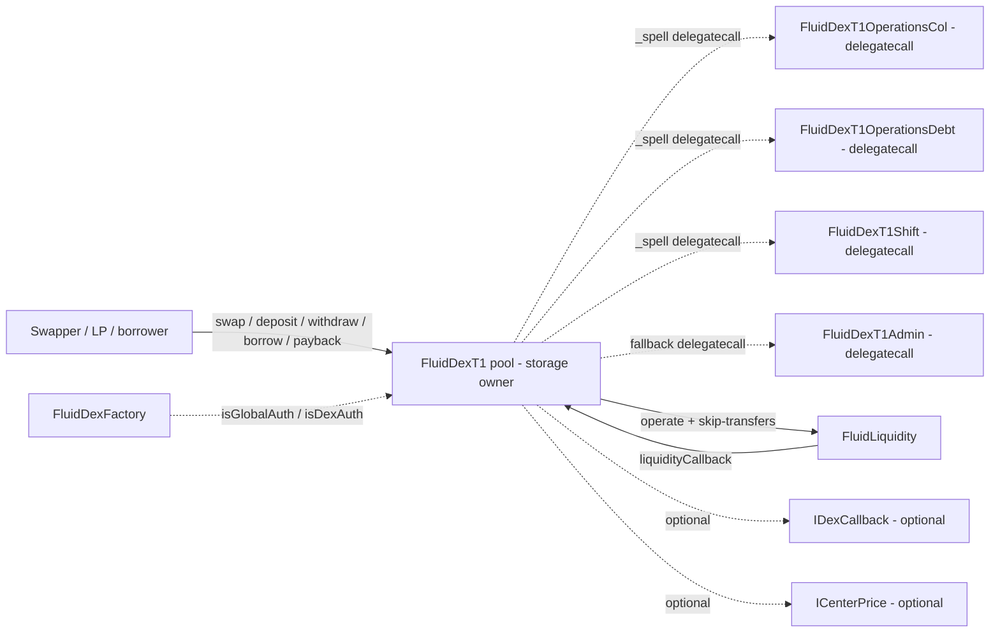

# DEX PoolT1 — SPEC

## 0. Gas-optimisation tier

**Hot path:** `coreModule/**` (swap, operate, `*Perfect` deposits/withdraws, arbitrage). Fluid DEX pools are hit on every user DEX interaction and are part of every Vault T2/T3/T4 leveraged operate — gas per tx is a product metric. Keep bit-packed storage reads cached, do not add branches unless they close a reachable hole.

**Cold path:** `adminModule/**` (pause/unpause, user-config updates, oracle + fee setters). All behind trusted auths; defensive `require`s / events are welcome here — e.g. the `updateUser*Configs` preserves-pause fix lands in this cold-path module and is allowed to emit an informational event even though the config update is not on a hot path.

Security always wins over gas on both tiers.

## 1. Purpose

`FluidDexT1` is the **full Fluid DEX pool**: a concentrated-liquidity AMM whose curve is defined around a **center price** and a configurable **upper / lower range**, where pool "liquidity" is not held on the pool contract but instead wired through [Fluid Liquidity](../../../liquidity/SPEC.md) as **smart collateral** (Liquidity supply) and/or **smart debt** (Liquidity borrow). That lets DEX pool operations double as Liquidity operations — a single `operate` call simultaneously moves user tokens and rebalances the pool's supply / borrow position. Each pool is a separate contract, deployed deterministically by the [DEX factory](../SPEC.md).

PoolT1 is the canonical **T1** DEX implementation. Differences from [DexLite](../../dexLite/SPEC.md) at a glance:

- PoolT1 routes through Liquidity (smart-col / smart-debt); DexLite holds balances on itself.
- PoolT1 is one contract per pool; DexLite is many pools in one contract.
- PoolT1 exposes a **rich** liquidity surface (proportional `*Perfect` deposits / withdraws / borrows / paybacks, plus non-proportional `deposit` / `withdraw` with internal swap to target amounts); DexLite only exposes swap.
- PoolT1 has **internal arbitrage** across the smart-col and smart-debt legs (no external entry point); DexLite has no such concept.
- PoolT1 has an on-chain **oracle** (store-and-update price history snapshots bounded by a 5% per-update limit); DexLite does not.

See [docs/docs.md](../../../../docs/docs.md) for the general Fluid overview.

## 2. Architecture



Files (all under `contracts/protocols/dex/poolT1/`):

- `common/variables.sol` — packed storage: `dexVariables`, `dexVariables2`, total supply / borrow shares, per-user supply / borrow words, shift state, placeholder oracle slot.
- `common/constantVariables.sol` — `PRICE_PRECISION = 1e27`, token decimals precision, two/four/five/six/nine-decimals ladder, `ORACLE_LIMIT`, `MINIMUM_LIQUIDITY_SWAP = 1e4`, `MINIMUM_LIQUIDITY_USER_OPERATIONS = 1e6`, inherits `StorageRead` so every pool exposes `readFromStorage`.
- `coreModule/immutableVariables.sol` — `DEX_ID`, `TOKEN_0`, `TOKEN_1`, `LIQUIDITY`, `DEX_FACTORY`, `COL_OPERATIONS_IMPLEMENTATION`, `DEBT_OPERATIONS_IMPLEMENTATION`, `SHIFT_IMPLEMENTATION`, `ADMIN_IMPLEMENTATION`, pre-computed Liquidity slots for token0 / token1 supply, borrow, and exchange prices.
- `coreModule/structs.sol` — in-memory structs for reserves / swap / oracle state.
- `coreModule/interfaces.sol` — `IDexCallback`, `ICenterPrice` callback interfaces consumed during swaps and pricing.
- `coreModule/events.sol` — user-facing `Swap`, `LogDeposit`, `LogWithdraw`, `LogBorrow`, `LogPayback`, `LogArbitrage`, and their perfect / one-token variants.
- `coreModule/helpers/coreHelpers.sol` — `_spell` (the delegatecall primitive), reentrancy / init `_check`, reserve math, `_updateOracle`, pricing helpers.
- `coreModule/helpers/secondaryHelpers.sol` — math for non-proportional ops (swap-and-deposit etc.), `_arbitrage` internal rebalance, user data updates, `_depositOrPaybackInLiquidity`.
- `coreModule/core/main.sol` — `FluidDexT1`: swap entry points, `liquidityCallback`, view methods, collateral / debt delegation into `_spell`, `fallback` → admin.
- `coreModule/core/colOperations.sol` — `FluidDexT1OperationsCol`: implementation for collateral-side user flows; runs only under `delegatecall`.
- `coreModule/core/debtOperations.sol` — `FluidDexT1OperationsDebt`: implementation for debt-side user flows; runs only under `delegatecall`.
- `coreModule/core/shift.sol` — `FluidDexT1Shift`: admin range / threshold / center-price shift math; delegatecalled as needed.
- `adminModule/main.sol` — `FluidDexT1Admin`: delegatecall-only admin surface (init, fees, ranges, pauses, per-user configs, rescue, etc.).
- `adminModule/structs.sol` / `adminModule/events.sol` — admin-side structs and events.

Inheritance (pool): `FluidDexT1 -> CoreHelpers -> SecondaryHelpers -> ImmutableVariables -> ConstantVariables -> StorageRead`.

Dispatch model: the pool is **not** a generic EIP-1967 proxy. The core contract owns the storage and dispatches to col / debt / shift / admin implementations via its own `_spell(target, msg.data)` helper, which performs a `delegatecall` and bubbles return data. User-facing wrappers on `FluidDexT1` simply `return abi.decode(_spell(TARGET, msg.data), …)` so the implementation's public functions run against the pool's storage with the user's calldata. The `fallback` gates on factory auths and delegates to the admin implementation.

## 3. External Interactions

- **Liquidity (`LIQUIDITY.operate`)** — the heart of every op.
  - Swaps issue two `operate` calls: deposit / payback on the input side, then withdraw / borrow on the output side.
  - Collateral / debt ops issue one `operate` per side change.
  - Internal `_arbitrage` issues `operate` with the `SKIP_TRANSFERS` sentinel so the pool can reshuffle supply vs borrow without any actual transfer.
  - For deposits / paybacks from ERC-20 tokens, the pool encodes `abi.encode(amount, isCallback, msg.sender)` as Liquidity callback data, so Liquidity's `liquidityCallback` will then invoke `IDexCallback(from).dexCallback(...)` if `isCallback` was set — enabling integrator contracts to settle tokens in one atomic step.
- **Liquidity → pool callback** — `liquidityCallback(token, amount, data)` on the pool is accepted **only** when `msg.sender == LIQUIDITY`, the reentrancy bit is set (indicating an in-flight pool call), and `data.length == 96`. It decodes as `(amount, isCallback, from)` and either transfers tokens from `from` or invokes `IDexCallback(from).dexCallback(token, amount, data)`.
- **`ICenterPrice` (optional)** — when a pool is configured with an external center-price address (stored as a 19-bit nonce in `dexVariables2`), pricing resolves through `AddressCalcs.addressCalc(DEPLOYER_CONTRACT, nonce)` then calls `.centerPrice(token0, token1)`. Contracts must return a non-zero 1e27-scaled price.
- **Oracle** — **no external oracle contract**. Price history snapshots are stored inside `dexVariables` and updated on each swap via `_updateOracle`, bounded by a per-update 5% move limit. The pool's own `oraclePrice()` view simply reverts `DexT1__OracleNotActive` — external reads should use the [periphery DEX resolver](../../../periphery/resolvers/dex/SPEC.md) to reconstruct TWAP-style views from the raw state.
- **Factory (`DEX_FACTORY`)** — read-only. The pool queries `isGlobalAuth(caller)` / `isDexAuth(this, caller)` in its `fallback` before delegating to the admin module. See [contracts/protocols/dex/SPEC.md](../SPEC.md).
- **Vault integration (T2/T3/T4)** — see [contracts/protocols/vault/SPEC.md](../../vault/SPEC.md): those vault types hold positions on the **user** side of this pool's smart collateral / smart debt and drive the same `deposit` / `withdraw` / `borrow` / `payback` flows as ordinary users.

## 4. Capabilities & Responsibilities

PoolT1 does:

- Run a **concentrated-liquidity** AMM parameterised by center price, upper range percent, and lower range percent — with optional linear shifts over seconds for center price, range percents, and upper / lower shift thresholds.
- Treat each side's liquidity as **either** real balance (plain AMM, `dexVariables2` bits 0 / 1 both zero — not the usual configuration), **smart collateral** (`dexVariables2` bit 0), or **smart debt** (`dexVariables2` bit 1), or **both simultaneously** (a smart-col + smart-debt pool).
- Expose **swap** with two ordering variants: input-known (`swapIn` / `swapInWithCallback`) and output-known (`swapOut` / `swapOutWithCallback`). Each enforces an amount limit and, if both smart col and smart debt are on, internally splits flow between the two legs via `_swapRoutingIn` / `_swapRoutingOut`.
- Expose **proportional** LP-style operations: `depositPerfect`, `withdrawPerfect`, `borrowPerfect`, `paybackPerfect`. These preserve the ratio of reserves and do not trigger internal arbitrage.
- Expose **non-proportional** operations: `deposit` / `withdraw` / `borrow` / `payback`. These use internal swap math to let users pick an arbitrary split between token0 and token1 and then invoke the internal arbitrage to realign.
- Expose **one-token** exits / entries: `withdrawPerfectInOneToken`, `paybackPerfectInOneToken` (only the proportional-to-one-token variants; there is no `depositPerfectInOneToken` or `borrowPerfectInOneToken` on this pool).
- Run an **internal `_arbitrage`** after non-proportional ops that touch both sides, which `operate`s on Liquidity with `SKIP_TRANSFERS` to align smart-col and smart-debt.
- Maintain **per-user supply / borrow limits** (expansion / base-debt-ceiling / shrinkage) tracked in the same bit-packed `userSupplyData` / `userBorrowData` words Liquidity uses for the pool's own slot. Admins can set per-user caps.
- Enforce global and per-token **utilization** caps that block ops pushing utilization above the configured ceiling.
- Provide **simulation via revert**: view-style reads on `FluidDexT1` (e.g. `getPricesAndExchangePrices`) and select user ops with a dead-address sentinel intentionally revert with a typed error carrying the computed amount. Integrators are expected to decode the revert data.

PoolT1 does **not**:

- Expose an external `arbitrage()` user function — rebalancing is always a side-effect of user ops.
- Mint any LP token — LP shares are tracked in per-user supply / borrow words and (for ERC-20 wrapping) via the optional [SmartLending](../smartLending/SPEC.md) wrapper deployed by its own factory.
- Custody balances long-term. Tokens live on Fluid Liquidity; the pool never holds a non-trivial idle balance. Any stuck balance can be swept by admin via `rescueFunds`.

## 5. Roles & Access Control

- **Swapper / LP / borrower (anyone)** — calls swap + liquidity user-facing entry points directly on the pool. Gated by the swap-pause bit (`dexVariables2` bit 255) and per-user pause / allowlist state.
- **Rebalancer** — not a standalone role on PoolT1 itself; rebalancing is the internal `_arbitrage`. Upstream components (e.g. [SmartLending rebalancer](../smartLending/SPEC.md)) have their own rebalancer roles.
- **Fluid Liquidity** — only accepted caller of `liquidityCallback`; accepted during in-flight pool ops only.
- **Global auths** — any address for which `DEX_FACTORY.isGlobalAuth(addr) == true`. Can call the admin surface via `fallback`.
- **DEX auths** — any address for which `DEX_FACTORY.isDexAuth(address(this), addr) == true`. Same privileges as global auths for this pool only.
- **Factory owner** — implicit super-auth via `isGlobalAuth` / `isDexAuth` (owner passes all three checks in the factory). Additional override path via the factory's `spell`.

There is no separate guardian role on PoolT1 — pause capabilities are reachable via the normal auth → admin module path. See `pauseSwapAndArbitrage` / `unpauseSwapAndArbitrage` and per-user `pauseUser` / `unpauseUser` in §8.

## 6. Storage Layout

All packed slot indices are defined in `contracts/libraries/dexSlotsLink.sol`; the summary below follows that library plus the comments in `common/variables.sol`.

- **Slot 0 — `dexVariables`**: reentrancy bit, **two stored prices** and the **stored center price** (BigNumber-packed, 32 coeff + 8 exp), the **last interaction timestamp**, and the oracle price history snapshots driven by `_updateOracle`.
- **Slot 1 — `dexVariables2`** (control word):
  - Bit 0: smart collateral enabled.
  - Bit 1: smart debt enabled.
  - Bits 2–18: fee (17 bits; scaled against `FIVE_DECIMALS` = 1e5 so max is 10%).
  - Bits 19–25: revenue cut (7 bits, percentage of fee).
  - Range percents and threshold percents + their shift-active bits.
  - Bits 112–131: external center-price contract nonce.
  - Bits 172–227: min / max center-price BigNumbers (20-bit coeffs + 8-bit exp each).
  - Bits 228–247: utilization caps per token.
  - Bit 248: center-price shift active.
  - Bit 255: **pause swap + arbitrage**.
- **Slot 2 — `_totalSupplyShares`**: low 128 bits total shares, upper 128 bits max shares.
- **Slot 3 — `_totalBorrowShares`**: same pattern.
- **Slot 4 — `_userSupplyData[user]`**: packed per-user supply config + live position (mirrors Liquidity's layout — see [Liquidity SPEC §6](../../../liquidity/SPEC.md#6-storage-layout)). First bit is the allow flag.
- **Slot 5 — `_userBorrowData[user]`**: same pattern for borrow side.
- **Slot 6** — placeholder kept for layout compatibility with earlier oracle design (`__placeholder_previously_oracle`).
- **Slots 7+ — `_rangeShift`, `_thresholdShift`, `_centerPriceShift`**: each packs the old value, the total shift duration, and the start timestamp. The first op after the shift window completes clears the shift-active bit in `dexVariables2`.

All public reads through `readFromStorage(slot)` use the raw `sload`.

## 7. User / Public Methods

Common behaviors:

- Every top-level entry calls `_check` which refuses re-entry (reentrancy bit in `dexVariables`) and refuses uninitialized pools (`dexVariables2 & 3 == 0`).
- Every top-level entry is blocked by the swap-pause bit (`dexVariables2 >> 255`) when applicable.
- `to_ == address(0)` defaults to `msg.sender` across swap and liquidity flows.
- **Simulation pattern**: passing `to_ = ADDRESS_DEAD` (or calling the read helpers below) causes the method to revert with a typed error carrying the computed amount — integrators catch and decode the revert.
- `msg.value` accounting: when a token is native (sentinel `0xEeee…eEE`), the caller must send the exact input-side amount as `msg.value`. `swapOut` paths take `amountInMax` as `msg.value` when native and refund excess automatically.

### Swap surface (`FluidDexT1.main.sol`)

#### swapIn / swapInWithCallback

```solidity
function swapIn(bool swap0to1_, uint256 amountIn_, uint256 amountOutMin_, address to_) external payable returns (uint256 amountOut_)
function swapInWithCallback(bool swap0to1_, uint256 amountIn_, uint256 amountOutMin_, address to_) external payable returns (uint256 amountOut_)
```

Exact-input swap. `swapInWithCallback` additionally invokes `IDexCallback(msg.sender).dexCallback(...)` during Liquidity's callback to pull the input tokens from the caller.

- `amountIn_` must be within verified bounds (`TWO_DECIMALS`–`X128`; 9-decimal adjusted form must be `≥ 1e6`).
- Swap input is capped at **≤ 50%** of the relevant imaginary reserve (`DexT1__InsufficientReserve`-class).
- Reverts `DexT1__AmountOutBelowMin` if `amountOut_ < amountOutMin_`.
- Emits `Swap`.

#### swapOut / swapOutWithCallback

```solidity
function swapOut(bool swap0to1_, uint256 amountOut_, uint256 amountInMax_, address to_) external payable returns (uint256 amountIn_)
function swapOutWithCallback(bool swap0to1_, uint256 amountOut_, uint256 amountInMax_, address to_) external payable returns (uint256 amountIn_)
```

Exact-output swap. Computes required input, requires `amountIn_ <= amountInMax_`, refunds excess native `msg.value`.

- Native-input path: `msg.value` must equal `amountInMax_` (not `amountIn_`) — Liquidity path refunds the delta.
- Revert conditions mirror `swapIn` plus `DexT1__AmountInAboveMax`.

All four swap methods perform the two-sided `operate` pattern to Liquidity (supply input, withdraw output) and close with `_updateOracle` and utilization verification.

### Collateral side (`colOperations.sol` via delegatecall from `FluidDexT1`)

All require smart-col enabled (`dexVariables2 & 1 == 1`). Direct calls to the implementation address revert `DexT1__OnlyDelegateCall`.

#### deposit

```solidity
function deposit(uint256 token0Amt_, uint256 token1Amt_, uint256 sharesMin_, bool estimate_) external payable returns (uint256 shares_)
```

Non-proportional deposit. Accepts any ratio, routes tokens through an internal swap to realign, then commits. Ends with internal `_arbitrage` for pools where both legs are on. `estimate_ == true` reverts with `FluidDexLiquidityOutput(shares_)` instead of committing.

- `token0Amt_ == 0` and `token1Amt_ == 0` → reverts.
- Reverts if `shares_ < sharesMin_`.

#### withdraw

```solidity
function withdraw(uint256 token0Amt_, uint256 token1Amt_, uint256 sharesMax_, address to_) external returns (uint256 shares_)
```

Non-proportional withdraw. `to_` is the recipient (treats `address(0)` as `msg.sender`, `ADDRESS_DEAD` as simulation sentinel). Triggers internal `_arbitrage`.

#### depositPerfect / withdrawPerfect

```solidity
function depositPerfect(uint256 shares_, uint256 maxToken0Deposit_, uint256 maxToken1Deposit_, bool estimate_) external payable returns (uint256 token0Amt_, uint256 token1Amt_)
function withdrawPerfect(uint256 shares_, uint256 minToken0Withdraw_, uint256 minToken1Withdraw_, address to_) external returns (uint256 token0Amt_, uint256 token1Amt_)
```

Proportional: both tokens move in / out in current ratio. **No internal arbitrage**; reentrancy bit is restored via an explicit snapshot write. `withdrawPerfect` with `shares_ = type(uint).max` withdraws the caller's full share balance. The perfect variants revert with `FluidDexPerfectLiquidityOutput` when `estimate_` is on (deposit) or `to_ == ADDRESS_DEAD` (withdraw).

#### withdrawPerfectInOneToken

```solidity
function withdrawPerfectInOneToken(uint256 shares_, bool inToken0_, uint256 minOut_, address to_) external returns (uint256 amountOut_)
```

Proportional burn but paid in a single token (the inverse side is swapped internally). Triggers internal `_arbitrage` because it touches both reserves.

### Debt side (`debtOperations.sol` via delegatecall)

All require smart-debt enabled (`dexVariables2 >> 1 & 1`). Same delegatecall restriction. Symmetric to the collateral side but with borrow / payback semantics:

- `borrow(token0Amt_, token1Amt_, sharesMax_, to_)` — non-proportional borrow; triggers internal `_arbitrage`.
- `payback(token0Amt_, token1Amt_, sharesMin_, estimate_)` — non-proportional payback; `estimate_` reverts with `FluidDexLiquidityOutput`; triggers internal `_arbitrage`.
- `borrowPerfect(shares_, minToken0Borrow_, minToken1Borrow_, to_)` — proportional borrow; `to_ == ADDRESS_DEAD` is simulation sentinel; **no internal arbitrage**.
- `paybackPerfect(shares_, maxToken0Payback_, maxToken1Payback_, estimate_)` — proportional payback; `estimate_` reverts with the typed error; **no internal arbitrage**.
- `paybackPerfectInOneToken(shares_, inToken0_, maxIn_)` — proportional payback in one token with internal swap to the other; triggers internal `_arbitrage`.

Every debt op enforces per-user borrow limit expansion / shrinkage semantics (same rules as Liquidity's user borrow data).

### Combined flows

There is **no** atomic `depositAndBorrow` or `paybackAndWithdraw` on PoolT1. Composition is expected at the caller layer, typically via one of the vault types that wrap a PoolT1 position.

### Views and introspection

- `constantsView()` / `constantsView2()` — return pool immutables (tokens, Liquidity address, slot pointers, implementation addresses).
- `getCollateralReserves(centerPrice, upperRange, lowerRange, supplyToken0, supplyToken1)` / `getDebtReserves(...)` — pure helpers that convert real supply / borrow amounts into real + imaginary reserve structures.
- `getPricesAndExchangePrices()` — simulation reverts `FluidDexPricesAndExchangeRates(pex)` with all current prices and Liquidity exchange prices. Intentional revert; callers decode revert data.
- `oraclePrice()` — reverts `DexT1__OracleNotActive`. On-chain oracle reads go through the resolver.
- `readFromStorage(slot)` — raw `sload`; no auth.

### liquidityCallback

```solidity
function liquidityCallback(address token_, uint256 amount_, bytes calldata data_) external
```

Called by Liquidity during a pool-initiated `operate` to pull input tokens from the user. `msg.sender` must be `LIQUIDITY`, the reentrancy bit must be on, `data_.length == 96`. If the decoded `isCallback` is true, the pool invokes `IDexCallback(from).dexCallback(token, amount, data)`; otherwise, it `safeTransferFrom(from, LIQUIDITY, amount)`.

### fallback

Delegatecall dispatcher for the admin module. Accepts `msg.data` with a function selector on `FluidDexT1Admin`. Sets the reentrancy bit, validates `isGlobalAuth(msg.sender) || isDexAuth(this, msg.sender)` via the factory, then `_spell(ADMIN_IMPLEMENTATION, msg.data)`.

### receive

Accepts native for native-token swap / deposit paths.

## 8. Admin / Governance Methods

All admin methods live on `FluidDexT1Admin` (`adminModule/main.sol`). They are guarded by `_onlyDelegateCall()` and reached via the pool's `fallback`, which means the caller must be a **global auth** or **dex auth**. Each method emits a corresponding `LogUpdate...` event in `adminModule/events.sol`.

- `initialize(InitializeVariables)` — sets initial `dexVariables` / `dexVariables2`, turns on smart col / debt flags if seeded, wires fees, ranges, thresholds, token decimals, center price. One-shot (reverts if already initialized).
- `turnOnSmartCol(seedConfig)` / `turnOnSmartDebt(seedConfig)` — flip the respective bits on post-init; seed initial supply / borrow.
- `updateFeeAndRevenueCut(fee, revenueCut)` — fee in `FIVE_DECIMALS` units (1e5), max 10%; revenue cut in `TWO_DECIMALS` (0–100%).
- `updateRangePercents(upper, lower, shiftTime)` — optional linear shift over `shiftTime` seconds; reverts if a range shift is still active.
- `updateThresholdPercent(upperShift, lowerShift, shiftTime)` — upper / lower thresholds with optional shift.
- `updateCenterPriceAddress(addressNonce, percent, time)` — attaches / clears external center-price oracle; `time == 0` reverts with `DexT1Admin__ConfigOverflow` (admin config invariant).
- `updateCenterPriceLimits(maxCenterPrice, minCenterPrice)` — writes BigNumber min / max into `dexVariables2`.
- `updateUtilizationLimit(token0Limit, token1Limit)` — per-token utilization ceilings.
- `updateUserSupplyConfigs(UserSupplyConfig[])` / `updateUserBorrowConfigs(UserBorrowConfig[])` — per-user config arrays (expansion percent, expansion duration, base limit, max limit). Mirrors Liquidity's admin interface for the pool's own user position, plus per-external-user positions for pools where users stake directly.
  - **D-01 invariant (preserve-allowed-bit):** both setters write `userSupplyData_ & 1` / `userBorrowData_ & 1` into the `allowed` bit instead of hard-coding `1`. Running these setters on a paused user therefore does **not** silently un-pause them, and a brand-new user starts with `allowed = 0`. Activation is a deliberate follow-up `unpauseUser(user, true, …)` / `unpauseUser(user, …, true)` call. When the `allowed` bit is `0` post-update, the setter emits `LogUpdateUserConfigOnPausedOrUnactivatedUser(user, isSupply)` so monitoring can alert on configs rewritten without an activation follow-up.
- `updateUserWithdrawalLimit(user, newLimit)` — one-shot per-user withdrawal limit adjustment.
- `pauseUser(user) / unpauseUser(user)` — flip per-user allow bits. After D-01, `unpauseUser` is the **only** way the `allowed` bit ever becomes `1`.
- `pauseSwapAndArbitrage() / unpauseSwapAndArbitrage()` — flip `dexVariables2` bit 255; blocks all user flows.
- `rescueFunds(token)` — sweep any stuck balance on the pool to Liquidity.
- `updateMaxSupplyShares(uint256)` / `updateMaxBorrowShares(uint256)` — caps in the upper 128 bits of the total-shares slots.
- `updateHookAddress(address)` — currently **reverts**. Placeholder for future hooks.
- `toggleOracleActivation()` — currently **reverts**. Oracle path is always-on; no toggle.

Shift-time specifics (via `shift.sol`, also delegatecalled by core helpers): once a shift is started, the packed `_rangeShift` / `_thresholdShift` / `_centerPriceShift` words record the old value plus the window; the first op after completion clears the shift-active bit in `dexVariables2`.

## 9. Events

User / swap (`coreModule/events.sol`):

- `Swap(swap0to1, amountIn, amountOut, to)`
- `LogDeposit`, `LogWithdraw`, `LogDepositPerfect`, `LogWithdrawPerfect`, `LogWithdrawPerfectInOneToken`
- `LogBorrow`, `LogPayback`, `LogBorrowPerfect`, `LogPaybackPerfect`, `LogPaybackPerfectInOneToken`
- `LogArbitrage(...)` — emitted from `_arbitrage` with net movements.

Admin (`adminModule/events.sol`): `LogInitialize`, `LogTurnOnSmartCol`, `LogTurnOnSmartDebt`, `LogUpdateFeeAndRevenueCut`, `LogUpdateRangePercents`, `LogUpdateThresholdPercent`, `LogUpdateCenterPriceAddress`, `LogUpdateCenterPriceLimits`, `LogUpdateUtilizationLimit`, `LogUpdateUserSupplyConfigs`, `LogUpdateUserBorrowConfigs`, `LogUpdateUserConfigOnPausedOrUnactivatedUser` (D-01 defensive signal), `LogUpdateUserWithdrawalLimit`, `LogPauseUser`, `LogUnpauseUser`, `LogPauseSwapAndArbitrage`, `LogUnpauseSwapAndArbitrage`, `LogRescueFunds`, `LogUpdateMaxSupplyShares`, `LogUpdateMaxBorrowShares`.

## 10. Errors

All numeric codes in `contracts/protocols/dex/errorTypes.sol` under the `DexT1__*` (51xxx) and `DexT1Admin__*` (52xxx) groups, raised via `FluidDexError(uint256)` (defined in `contracts/protocols/dex/error.sol`).

Notable codes (non-exhaustive, by theme):

- Reentrancy / initialization: `DexT1__NotInitialized`, `DexT1__AlreadyEntered`, `DexT1__OnlyDelegateCall`.
- Authorization: `DexT1__Unauthorized` (fallback), `DexT1__NotRebalancer`.
- Swap limits: `DexT1__AmountOutBelowMin`, `DexT1__AmountInAboveMax`, `DexT1__InsufficientReserve`, `DexT1__SwapAmountTooLow`, `DexT1__SwapAmountTooHigh`, `DexT1__InvalidSwap`.
- User limits: `DexT1__WithdrawLimitReached`, `DexT1__BorrowLimitReached`, `DexT1__UserNotAllowed`.
- Utilization: `DexT1__UtilizationAboveLimit`.
- Oracle: `DexT1__OracleNotActive`, `DexT1__OracleUpdateFailed`.
- Admin config: `DexT1Admin__InvalidParams`, `DexT1Admin__ConfigOverflow`, `DexT1Admin__OnlyDelegateCallAllowed`, `DexT1Admin__ShiftAlreadyActive`, `DexT1Admin__UnsupportedAction` (e.g. hooks / oracle toggle).

Typed **simulation** reverts used as a return channel (defined in `contracts/protocols/dex/error.sol`): `FluidDexSwapResult(uint256 amount)`, `FluidDexLiquidityOutput(uint256 shares)`, `FluidDexPerfectLiquidityOutput(uint256 token0Amt, uint256 token1Amt)`, `FluidDexSingleTokenOutput(uint256 amount)`, `FluidDexPricesAndExchangeRates(PricesAndExchangePrice pex)`.

## 11. Invariants & Safety Notes

- **Reentrancy bit in `dexVariables` (bit 0).** Must be set during any in-flight op and cleared at the end. Perfect ops restore it via an explicit snapshot write because they do not re-run the full update path; swap / non-proportional paths clear it through the `_updateOracle` write.
- **Oracle per-update limit: 5%.** The stored price used by `_updateOracle` cannot move more than `ORACLE_LIMIT` relative to the previous stored price in a single update. Violations revert `DexT1__OracleUpdateFailed`.
- **Same-block center-price drift limit: ±12.5%.** When `temp_ == 0` in `_updateOracle` (same-block re-entry of the price write path), the new center price must stay within ±12.5% of the previous stored center price. Large intra-block moves therefore split across multiple txs or revert.
- **Minimum liquidity.** `MINIMUM_LIQUIDITY_SWAP = 1e4` (in adjusted 9-decimal form) gates small swap-input checks; `MINIMUM_LIQUIDITY_USER_OPERATIONS = 1e6` gates liquidity ops. Below the thresholds, ops revert `DexT1__*AmountTooLow`.
- **Swap cap per op: ≤ 50% of imaginary reserve.** Enforced via `_verifySwapAndNonPerfectActions`. Larger movements require multiple swaps or are infeasible.
- **Per-user supply / borrow limits.** Same withdrawal-limit / borrow-ceiling state machine Liquidity uses for the pool slot (see [Liquidity SPEC §11](../../../liquidity/SPEC.md#11-invariants--safety-notes)). Packed bytes live in this pool's own storage; the decay / expansion math is in `DexCalcs` (see [SPEC-dexCalcs](../../../libraries/SPEC-dexCalcs.md)).
- **Token decimal normalization.** Internal adjusted supplies use `TOKENS_DECIMALS_PRECISION = 12` (1e12). Token0 / token1 decimal fields (stored in `dexVariables2`) convert between user-side amounts and internal amounts. Rounding is at internal precision.
- **Delegatecall-only implementations.** `FluidDexT1Admin`, `FluidDexT1Shift`, `FluidDexT1OperationsCol`, `FluidDexT1OperationsDebt` all enforce `_onlyDelegateCall` at entry. Direct calls to these contracts are harmless — they revert — but developers must remember that the pool is the sole holder of storage.
- **Initial / fallback dispatch safety.** The `_check` function refuses any user op while `dexVariables2 & 3 == 0` (neither smart-col nor smart-debt on, i.e. uninitialized). The admin module's `initialize` is the only path to flip those bits.
- **Same-block arbitrage coalescing.** `_arbitrage` runs inside non-proportional col / debt ops, which means two back-to-back non-proportional ops in the same block each incur the arbitrage cost. Perfect ops intentionally skip arbitrage for LP UX.
- **`oraclePrice()` always reverts.** External callers must use the [periphery resolver](../../../periphery/resolvers/dex/SPEC.md) to read oracle state; the pool does not expose TWAP helpers directly.

## 12. Trust Model & Accepted Trade-offs

The following dispositions mirror documented audit resolutions for PoolT1. They describe intended behavior; they are not open vulnerabilities.

- **Oracle is step-bounded, not globally bounded.** The pool only constrains per-update price moves (5%) and per-block drift (±12.5%) — not absolute price ranges at the oracle level. `updateCenterPriceLimits` sets a storage-resident envelope, but an idle pool reactivated after a long quiet period may have the stored center price drift significantly before the first new op; this is accepted as an economic / arbitrage problem, not a safety defect.
- **`withdrawPerfect(type(uint256).max)` with zero balance panics.** Intended to fail; the panic-vs-named-revert is a UX polish rather than a safety issue.
- **Smart-lending rebalancer dust.** Dust that accrues to the [SmartLending](../smartLending/SPEC.md) rebalancer is expected and accepted; the rebalancer role is trusted.
- **`time_ == 0` rejected by `updateCenterPriceAddress`.** Calling with a zero time is an admin misconfiguration, not a runtime bug; the admin module reverts `DexT1Admin__ConfigOverflow`.
- **Callback-vs-pause ordering.** If Liquidity (or an upstream protocol) pauses mid-callback, the full swap transaction reverts. This is by design and matches the general [Liquidity disposition](../../../liquidity/SPEC.md#12-trust-model--accepted-trade-offs).
- **Auth authority comes from the factory.** The pool reads `isGlobalAuth` / `isDexAuth` live from the [DEX factory](../SPEC.md). Factory owner compromise therefore compromises every pool; this is the intended single root of trust.
- **No atomic multi-op composites.** Compound flows (e.g. borrow-and-withdraw) are left to outer wrappers; the pool provides only the two-sided primitives.
- **Internal arbitrage is an implementation detail.** Users cannot call it directly; its economic impact is priced into the op that triggered it.
- **Hook and oracle-activation toggles are disabled by design today.** Calling `updateHookAddress` or `toggleOracleActivation` reverts; these are reserved for future implementations and should not be surfaced as functional features.

See also:

- [contracts/protocols/dex/SPEC.md](../SPEC.md) — factory, deployment, error code categories.
- [contracts/protocols/dex/smartLending/SPEC.md](../smartLending/SPEC.md) — optional ERC-20 wrapper that layers on top of this pool's smart-collateral position.
- [contracts/liquidity/SPEC.md](../../../liquidity/SPEC.md) — the layer the pool ultimately reads / writes.
- [contracts/libraries/SPEC-dexCalcs.md](../../../libraries/SPEC-dexCalcs.md) — pool math helpers (limits, imaginary reserves).
- [contracts/libraries/SPEC-bigMath.md](../../../libraries/SPEC-bigMath.md) — BigNumber encoding used for center-price / min-max packing.
- [contracts/periphery/resolvers/dex/SPEC.md](../../../periphery/resolvers/dex/SPEC.md) — recommended read surface (reconstructs oracle + reserves from `readFromStorage`).
