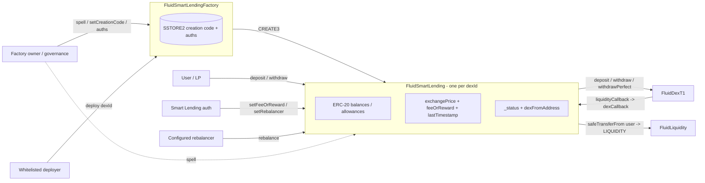

# Smart Lending — SPEC

## 1. Purpose

`FluidSmartLending` is an **ERC-20 tokenized wrapper** around a single [`FluidDexT1`](../poolT1/SPEC.md) pool's **smart-collateral** position. A user deposits either proportionally (`depositPerfect`) or non-proportionally (`deposit`) into the DEX; the wrapper mints `fSL{dexId}` shares that track the user's entitlement at an internal **`exchangePrice`** (1e18 scale) with optional **linear `feeOrReward` accrual** over time. Redemption (`withdraw` / `withdrawPerfect` / `withdrawPerfectInOneToken`) burns `fSL` shares and returns the underlying DEX tokens.

Smart Lending is **not** an fToken (see [contracts/protocols/lending/fToken/SPEC.md](../../lending/fToken/SPEC.md)) — it does not live on [Fluid Liquidity](../../../liquidity/SPEC.md) directly. Economically, `fSL` represents **DEX smart-collateral shares × exchangePrice**, with the `exchangePrice` moving up (reward to holders) or down (fee from holders) depending on the `feeOrReward` configuration. The accrual rate is set by auths, not by a shared rewards rate model.

Each `fSL` instance is deployed deterministically by [`FluidSmartLendingFactory`](#architecture) — one per `dexId`, at an address derived from `keccak256(abi.encode(dexId))` via CREATE3. Factory owners can arbitrarily re-own the share price via governance `spell`, so share holders are implicitly trusting both DEX and Smart Lending governance.

## 2. Architecture



Files (under `contracts/protocols/dex/smartLending/`):

- `main.sol` — [`FluidSmartLending`](./main.sol): `ERC20` (from OpenZeppelin) plus `exchangePrice` / `feeOrReward` / `rebalancer` state, the DEX op wrappers, `dexCallback`, `rebalance`, reentrancy guard, and `spell`.
- `factory/main.sol` — [`FluidSmartLendingFactory`](./factory/main.sol): per-`dexId` CREATE3 deployment, SSTORE2-backed pool creation code storage, deployer allowlist, per-instance auth map, owner-only management (`spell`, `setSmartLendingCreationCode`, etc.).

Related external references:

- [contracts/protocols/dex/poolT1/SPEC.md](../poolT1/SPEC.md) — the underlying pool; Smart Lending is one of its LPs.
- [contracts/protocols/dex/SPEC.md](../SPEC.md) — DEX factory and error code ranges (Smart Lending uses `54xxx`; Smart Lending factory uses `55xxx`).

## 3. External Interactions

- **FluidDexT1 (`DEX`)**
  - `DEX.depositPerfect(shares_ + 1, maxToken0Deposit, maxToken1Deposit, estimate=false)`
  - `DEX.deposit(token0Amt_, token1Amt_, sharesMin_, estimate=false)`
  - `DEX.withdrawPerfect(shares_, minToken0Withdraw, minToken1Withdraw, to_)`
  - `DEX.withdraw(token0Amt_, token1Amt_, sharesMax_, to_)`
  - `DEX.withdrawPerfectInOneToken(shares_, inToken0_, minOut_, to_)`
  - `DEX.constantsView()` in the constructor (to pull token0, token1, native-pair flag).
  - `DEX.readFromStorage(...)` to compute `rebalanceDiff`.
- **Fluid Liquidity** — never called directly. `dexCallback` (driven by `FluidDexT1.liquidityCallback`) `safeTransferFrom`s tokens from `dexFromAddress` to `LIQUIDITY`. Accounting tokens therefore end up in Liquidity as part of the DEX pool's supply.
- **`IDexCallback.dexCallback`** — Smart Lending implements this. Only accepted when `msg.sender == DEX`.
- **FluidSmartLendingFactory** — always reachable via `SMART_LENDING_FACTORY`. `isSmartLendingAuth(this, caller)` gates `setFeeOrReward` / `setRebalancer`; `owner()` gates `spell`.
- **FluidDexFactory (`DEX_FACTORY`)** — read-only; used in the constructor to resolve `DEX = DEX_FACTORY.getDexAddress(dexId)`.
- **Native ETH** — accepted via `receive()` **only** when `msg.sender == DEX` (for native-pair withdrawals / refunds). Non-native pairs must not send `msg.value` on user ops; `depositPerfect` / `deposit` reject a non-zero `msg.value` when the pair is not native.

## 4. Capabilities & Responsibilities

Smart Lending does:

- Mint an `fSL{dexId}` ERC-20 representing a claim on a DEX smart-collateral position.
- Track `exchangePrice` over time, adjusted by `feeOrReward` (signed, in 1e6 units), so a constant `feeOrReward` produces a linear price drift.
- Wrap both **proportional** (`depositPerfect` / `withdrawPerfect` / `withdrawPerfectInOneToken`) and **non-proportional** (`deposit` / `withdraw`) DEX operations into one-call user flows, with ERC-20 accounting on the wrapper side.
- Implement the DEX callback pattern: when the DEX pulls tokens during a deposit, Smart Lending's `dexCallback` forwards them directly from the user to Liquidity. This lets users pay the underlying tokens without intermediate approvals to the wrapper for ERC-20 token transfers (approvals go to Smart Lending so that `setDexFrom` can route the callback).
- Implement `rebalance`: a designated rebalancer trues up the wrapper's internal NAV (`totalSupply × exchangePrice / 1e18`) with the DEX-recorded position by either withdrawing the positive drift to the rebalancer (fee accrual case) or depositing fresh tokens from the rebalancer (reward funding case).
- Propagate factory-owner control via a `spell` delegatecall escape hatch.

Smart Lending does **not**:

- Implement ERC-4626. It is plain ERC-20 with bespoke `deposit` / `withdraw` signatures that mirror the DEX's.
- Implement EIP-2612 `permit` or any meta-transaction flow.
- Interact with [`LendingRewardsRateModel`](../../lending/SPEC.md#architecture) or the fToken rewards flow. Reward / fee accrual is strictly the local `feeOrReward` field.

## 5. Roles & Access Control

- **User** — calls `deposit`, `depositPerfect`, `withdraw`, `withdrawPerfect`, `withdrawPerfectInOneToken`, and standard ERC-20 transfers. Gated per-user via the underlying DEX's pause / allowlist (Smart Lending itself does not pause users).
- **Rebalancer** — single address stored on the wrapper. Only caller of `rebalance`. Set by auths via `setRebalancer`. Receives tokens on a fee-mode `rebalance`, supplies tokens on a reward-mode `rebalance`.
- **Smart Lending auth** — any `addr` with `SMART_LENDING_FACTORY.isSmartLendingAuth(this, addr) == true`. Calls `setFeeOrReward`, `setRebalancer`. The factory owner always passes this check.
- **Factory owner** — `SMART_LENDING_FACTORY.owner()`. Calls `spell` on the wrapper. Can also call `spell` and every admin method on the factory itself.
- **Whitelisted deployer** — `addr` with `_deployers[addr] == 1` on the factory, or the factory owner. Calls `FluidSmartLendingFactory.deploy(dexId)` to create a new `fSL` instance.
- **DEX** — only accepted caller of `dexCallback` and `receive` on the wrapper.

## 6. Storage Layout

`FluidSmartLending` extends OpenZeppelin's `ERC20`, so slots 0–4 are `_balances`, `_allowances`, `_totalSupply`, `_name`, `_symbol`. Subsequent slots come from the wrapper's own `Variables`:

- **Slot 5 (packed):**
  - `uint40 lastTimestamp` — when `exchangePrice` was last updated.
  - `int32 feeOrReward` — signed accrual rate in 1e6 units (bounded to ±1e6 at write time).
  - `uint184 exchangePrice` — current exchange price at 1e18 precision.
- **Slot 6:** `address rebalancer`.
- **Slot 7 (packed):** `address dexFromAddress` + `uint8 _status` (reentrancy guard). `dexFromAddress` is set to `msg.sender` by the `setDexFrom` modifier during deposits (including the rebalance deposit branch) so the DEX callback knows from which EOA to pull tokens, and is restored to the dead-address sentinel on exit.

The `FluidSmartLendingFactory` uses:

- Slot 0: `Owned.owner`.
- `_smartLendingAuths[addr][auth]` mapping.
- `_deployers[addr]` mapping.
- `createdTokens[]` — append-only list of deployed wrappers.
- `_smartLendingCreationCodePointer` — SSTORE2 address holding the deployment bytecode.

> Layout note: `FluidSmartLending` currently declares `ERC20` both directly and transitively via `Variables is ERC20`. C3 linearization collapses the duplication today, but future layout changes should prefer a single inheritance path to avoid regressions.

## 7. User / Public Methods

All mutating methods (except the ERC-20 surface and views) run through the `nonReentrant` guard + `_updateExchangePrice`. `shares_` parameters are **DEX shares**; the wrapper converts between DEX shares and `fSL` amounts via the current `exchangePrice` with an asymmetric ±1 correction to stay conservative on mint / burn.

### depositPerfect

```solidity
function depositPerfect(
    uint256 shares_,
    uint256 maxToken0Deposit_,
    uint256 maxToken1Deposit_,
    bool estimate_,
    address to_
) external payable returns (uint256 token0Amt_, uint256 token1Amt_, uint256 amount_)
```

Proportional deposit.

- `msg.value == 0` required unless the pair is native (`IS_NATIVE_PAIR`). When native, the incoming `msg.value` is forwarded to the DEX and any excess is refunded.
- Calls `DEX.depositPerfect(shares_ + 1, maxToken0Deposit_, maxToken1Deposit_, estimate=false)` — the `+1` ensures the wrapper is not under-deposited relative to the `fSL` minted.
- Mints `amount_ = (shares_ * 1e18) / exchangePrice` to `to_` (or `msg.sender` if `to_ == address(0)`).
- Emits standard ERC-20 `Transfer(0x0, to_, amount_)`.

### deposit

```solidity
function deposit(
    uint256 token0Amt_,
    uint256 token1Amt_,
    uint256 minSharesAmt_,
    address to_
) external payable returns (uint256 shares_, uint256 amount_)
```

Non-proportional deposit. Native handling identical to `depositPerfect`. Calls `DEX.deposit(token0Amt_, token1Amt_, minSharesAmt_, estimate=false)` to obtain `shares_`, then mints `amount_ = (shares_ * 1e18) / exchangePrice - 1`. The `- 1` is conservative against rounding in favor of existing holders. Very small `shares_` relative to `exchangePrice` can round `amount_` to 0 — callers should enforce a sensible `minSharesAmt_`.

### withdrawPerfect

```solidity
function withdrawPerfect(
    uint256 shares_,
    uint256 minToken0Withdraw_,
    uint256 minToken1Withdraw_,
    address to_
) external returns (uint256 token0Amt_, uint256 token1Amt_, uint256 amount_)
```

Proportional withdraw. `shares_ == type(uint256).max` → withdraw the caller's **entire `fSL` balance** (computed as `balanceOf(msg.sender) * exchangePrice / 1e18 - 1`). Branches on the minimums:

- Both `minToken0Withdraw_` and `minToken1Withdraw_` positive → `DEX.withdrawPerfect(shares_, …)`.
- Exactly one is zero → `DEX.withdrawPerfectInOneToken(shares_, inToken0, nonZeroMin, to_)`.
- Both zero → reverts `SmartLending__InvalidAmounts`.

Burns the computed `fSL` amount from `msg.sender`.

### withdraw

```solidity
function withdraw(
    uint256 token0Amt_,
    uint256 token1Amt_,
    uint256 maxSharesAmt_,
    address to_
) external returns (uint256 shares_, uint256 amount_)
```

Non-proportional withdraw. Calls `DEX.withdraw(token0Amt_, token1Amt_, maxSharesAmt_, to_)`. Burns `amount_ = (shares_ * 1e18) / exchangePrice + 1` from `msg.sender` (rounding against the user in favor of the pool).

### ERC-20 surface

Inherited from OZ: `transfer`, `transferFrom`, `approve`, `allowance`, `balanceOf`, `totalSupply`, `name`, `symbol`, `decimals`. The token name is `"Fluid Smart Lending " + decimal(dexId)`; symbol is `"fSL" + decimal(dexId)`; decimals is 18.

### getUpdateExchangePrice

```solidity
function getUpdateExchangePrice() public view returns (uint256 exchangePrice_, bool rewardsOrFeeActive_)
```

View accessor. Computes the price that would be written by `_updateExchangePrice`. Linear accrual only runs when `feeOrReward != 0`.

### updateExchangePrice

```solidity
function updateExchangePrice() public returns (uint256 exchangePrice_)
```

Public idempotent write — callable by anyone. Persists the accrued `exchangePrice` and updates `lastTimestamp` only when accrual is active.

### rebalance

```solidity
function rebalance(uint256 shares_, uint256 tokenAmt0_, uint256 tokenAmt1_) external payable returns (uint256)
```

Restricted to `msg.sender == rebalancer` (else `SmartLending__InvalidRebalancer`).

- Computes `rebalanceDiff()` = `dexSideSharesForWrapper - totalSupply * exchangePrice / 1e18`.
- **Fee case (diff > 0)**: withdraws the excess DEX shares **to the rebalancer**, using `DEX.withdrawPerfect`. This collects fees accrued to `fSL` holders and pays them to the rebalancer.
- **Reward case (diff < 0)**: deposits `-diff` shares from the **rebalancer** back into DEX, using the `setDexFrom` path so `dexCallback` pulls tokens from the rebalancer. Native pairs forward `msg.value`.
- Emits `LogRebalance`.

### rebalanceDiff

```solidity
function rebalanceDiff() public view returns (int256)
```

Difference between the DEX-recorded smart-collateral supply credited to this wrapper and the NAV implied by `totalSupply() * exchangePrice / 1e18`. Rounds include a ±1 buffer to keep dust in a direction that does not let holders outdraw the pool.

### dexCallback

```solidity
function dexCallback(address token_, uint256 amount_) external
```

- Only `msg.sender == DEX`.
- `safeTransferFrom(dexFromAddress, LIQUIDITY, amount_)` for ERC-20 tokens.
- `dexFromAddress` is set during the enclosing user op by `setDexFrom` and reset to the sentinel on exit — it is never a stored value while idle.

### receive

Accepts ETH only when `msg.sender == DEX` (e.g. refund from a native-pair deposit, or during a native-pair withdraw that the DEX forwards).

### Immutables / accessors

`DEX_FACTORY`, `SMART_LENDING_FACTORY`, `DEX`, `LIQUIDITY`, `TOKEN0`, `TOKEN1`, `IS_NATIVE_PAIR`, `lastTimestamp`, `feeOrReward`, `exchangePrice`, `rebalancer`.

## 8. Admin / Governance Methods

### setFeeOrReward

```solidity
function setFeeOrReward(int256 feeOrReward_) external
```

`onlyAuth`. Clamps to ±1e6, updates `feeOrReward`, refreshes `lastTimestamp`. Positive = reward (price goes up over time), negative = fee (price goes down), 0 = constant price. Emits `LogFeeOrRewardSet`.

### setRebalancer

```solidity
function setRebalancer(address rebalancer_) external
```

`onlyAuth`. Overwrites the rebalancer address. Emits `LogRebalancerSet`.

### spell (wrapper)

```solidity
function spell(address target_, bytes memory data_) external returns (bytes memory response_)
```

`onlyOwner` (factory owner). Delegatecalls `target_` with `data_`. Bubbles return / revert data.

### Factory admin (`FluidSmartLendingFactory`)

- `updateDeployer(address deployer_, bool allowed_)` — owner-only. Toggles `_deployers`.
- `updateSmartLendingAuth(address smartLending_, address auth_, bool allowed_)` — owner-only. Toggles `_smartLendingAuths[smartLending_][auth_]`.
- `setSmartLendingCreationCode(bytes calldata creationCode_)` — owner-only. Writes the SSTORE2 pointer. Subsequent `deploy` calls use this bytecode.
- `spell(address target_, bytes memory data_)` — owner-only. Delegatecalls arbitrary logic in factory context.
- `deploy(uint256 dexId_)` — `onlyDeployers`. CREATE3-deploys a new `fSL` at `getSmartLendingAddress(dexId_)` using the stored creation code with encoded constructor args `(dexId_, LIQUIDITY, DEX_FACTORY, address(this))`. Reverts if that address already has code.

### Factory views

- `allTokens() returns (address[] memory)`
- `createdTokens(uint256 index) returns (address)`
- `totalSmartLendings() returns (uint256)`
- `getSmartLendingAddress(uint256 dexId_) returns (address)` — CREATE3 deterministic address.
- `isSmartLending(address candidate_) returns (bool)` — staticcalls `DEX()` then `DEX.DEX_ID()` and compares against the deterministic address.
- `isSmartLendingAuth(address smartLending_, address auth_) returns (bool)` — owner also passes.
- `isDeployer(address deployer_) returns (bool)` — owner also passes.
- `smartLendingCreationCode() returns (bytes memory)` — raw SSTORE2 read.

## 9. Events

Wrapper (`main.sol`):

- `LogRebalance(int256 diff_, uint256 token0Amount_, uint256 token1Amount_)`
- `LogRebalancerSet(address rebalancer_)`
- `LogFeeOrRewardSet(int256 feeOrReward_)`

Factory:

- `LogSmartLendingDeployed(address smartLending_, uint256 dexId_)`
- `LogAuthUpdated(address smartLending_, address auth_, bool allowed_)`
- `LogDeployerUpdated(address deployer_, bool allowed_)`
- `LogSetCreationCode(address oldPointer_, address newPointer_)`

## 10. Errors

Wrapper (`contracts/protocols/dex/error.sol` → `FluidSmartLendingError(uint256)`; codes in `errorTypes.sol`, `54xxx` range):

- `SmartLending__InvalidAmounts` — both min-withdraw amounts are zero.
- `SmartLending__InvalidMsgValue` — `msg.value != 0` on a non-native pair op.
- `SmartLending__InvalidRebalancer` — caller is not the configured rebalancer.
- `SmartLending__Unauthorized` — caller is neither factory auth (for `onlyAuth`) nor factory owner (for `onlyOwner`).
- `SmartLending__InvalidParams` — sanity guards (zero addresses, zero amounts where required).
- `SmartLending__Reentrancy` — re-entry detected.
- `SmartLending__NotDex` — `dexCallback` / `receive` caller is not DEX.

Factory (`FluidSmartLendingFactoryError(uint256)`, `55xxx` range):

- `SmartLendingFactory__Unauthorized` — caller is not a deployer / auth / owner.
- `SmartLendingFactory__AlreadyDeployed` — `deploy(dexId)` called when a wrapper already exists at that address.
- `SmartLendingFactory__InvalidParams` — zero addresses / empty creation code.
- `SmartLendingFactory__InvalidCreationCode` — stored creation code pointer is unset when `deploy` is called.

## 11. Invariants & Safety Notes

- **One `fSL` per (`factory`, `dexId`).** `deploy(dexId_)` reverts if code exists at `getSmartLendingAddress(dexId_)`. Addresses are CREATE3-deterministic against the factory + `keccak256(abi.encode(dexId_))` salt.
- **Time-linear `exchangePrice` accrual.** When `feeOrReward != 0`, `exchangePrice` updates linearly by `exchangePrice * feeOrReward * elapsedSeconds / (1e6 * SECONDS_PER_YEAR)` (approx). Changes are applied lazily on every write path plus on explicit `updateExchangePrice` calls.
- **Asymmetric ±1 rounding at mint / burn.** `deposit` mints `(shares * 1e18)/exchangePrice - 1`; `withdraw` burns `(shares * 1e18)/exchangePrice + 1`. `rebalanceDiff` rounds in the direction that leaves dust **in the pool**, not in user hands. This is intentional and results in tiny, monotonic dust accrual to the pool that the rebalancer sweeps.
- **`rebalance` is how NAV stays aligned.** Neither `deposit` nor `withdraw` alone keeps the DEX-recorded position equal to `totalSupply * exchangePrice / 1e18`; the rebalancer periodically issues `rebalance` to reconcile. Dust between rebalances is expected.
- **`dexFromAddress` is transient.** It is set to `msg.sender` at the start of each deposit-class user op and reset to the dead sentinel at the end. It is never persisted while the wrapper is idle; any observer seeing a non-sentinel value is inside an in-flight tx.
- **Reentrancy guard applies to every user op and `rebalance`.** The DEX's own `liquidityCallback` + `dexCallback` flow re-enters the wrapper during deposits; the guard allows the expected re-entry (via `dexCallback` which only performs a safe-transfer) but blocks user-visible reentry into `deposit` / `withdraw` / `rebalance`.
- **Native pair handling.** For native pairs, `msg.value` is forwarded to the DEX on `depositPerfect` / `deposit`. For the reward branch of `rebalance`, the rebalancer's `msg.value` is forwarded. The DEX refunds excess through `receive`.
- **Negative `feeOrReward` does not compound a full loss.** The clamp ±1e6 keeps accrual bounded, but constant negative values over long periods still drive `exchangePrice` toward 0. The expected operational mode is `feeOrReward == 0` or positive; negative values exist for special campaigns.
- **Factory owner is implicit super-auth.** The `isSmartLendingAuth` check treats the factory owner as always authorized, so the owner can set `feeOrReward` / `rebalancer` directly and can also `spell` every wrapper it deployed.
- **No `initialize` call.** Wrapper state is set entirely in the constructor, so `CREATE3` deployments are immediately ready.

## 12. Trust Model & Accepted Trade-offs

The following dispositions mirror documented audit resolutions for Smart Lending. They describe intended behavior; they are **not** open vulnerabilities.

- **Rebalancer is trusted.** Dust that flows to the rebalancer on a fee-mode `rebalance` is expected and accepted — there is no on-chain cap on how much dust accrues between rebalances. The role is typically held by a governance-operated keeper.
- **`withdrawPerfect(type(uint256).max)` on a zero balance panics.** The DEX call underneath computes `0 - 1` in the share conversion path and arithmetic-underflows. Intended to fail — named revert is a UX polish, not a safety defect.
- **`deposit` can mint to `to_ == burnAddress`.** This is standard ERC-20 semantics and the caller's choice; not a defect.
- **Negative `feeOrReward` is intentional but rare.** Extended negative accrual will drive `exchangePrice` down; combined with integer rounding, very small positions can round to zero shares.
- **Silent zero mint on very small `deposit`.** If `shares_` is small enough that `(shares_ * 1e18) / exchangePrice - 1` rounds to zero, the call succeeds but mints nothing. This is an integrator concern addressed by supplying a sensible `minSharesAmt_` on the DEX side and pre-simulating the amount (the off-chain recommendation is to never call `deposit` without a meaningful minimum).
- **Factory owner can `spell` every wrapper.** Governance compromise fully compromises Smart Lending — same trust surface as all other Fluid modules. See [contracts/protocols/dex/SPEC.md](../SPEC.md#12-trust-model--accepted-trade-offs).
- **`fSL` is not fToken; do not treat it as a bank-style deposit.** It is a pure DEX position wrapper; its price moves with DEX state + `feeOrReward`. There is no Liquidity-side interest accrual.
- **Redundant ERC-20 inheritance is a known layout fragility.** Inheriting `ERC20` both directly and via `Variables is ERC20` linearizes safely today but should be collapsed in future refactors.

See also:

- [contracts/protocols/dex/poolT1/SPEC.md](../poolT1/SPEC.md) — underlying DEX pool.
- [contracts/protocols/dex/SPEC.md](../SPEC.md) — factory, error code categories.
- [contracts/liquidity/SPEC.md](../../../liquidity/SPEC.md) — where token balances ultimately live.
- [contracts/periphery/resolvers/smartLending/SPEC.md](../../../periphery/resolvers/smartLending/SPEC.md) — recommended read surface for indexers.
