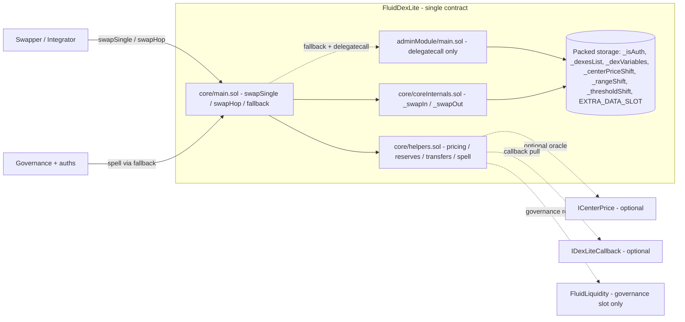

# DexLite — SPEC

## 1. Purpose

`FluidDexLite` is a **single-contract, multi-pool swap primitive** that holds ERC-20 / native balances on itself and prices swaps off a stored **center price** plus configurable **range** and **threshold** bands. It is a deliberately minimal, gas-oriented alternative to the full [Fluid DEX protocol](../dex/SPEC.md): pools are keyed by `DexKey { token0, token1, salt }`, state is fully packed into a handful of `uint256` slots per pool, and the entire admin surface is a delegatecall-only module reached through a governance-gated `fallback`.

Unlike the core DEX, DexLite does **not** route liquidity through [Fluid Liquidity](../../liquidity/SPEC.md) — token balances sit directly on the DexLite contract. The only Liquidity read is the **governance address** (`LIQUIDITY_GOVERNANCE_SLOT`), which gates admin access. This keeps the contract independent enough to deploy in experimental configurations while still aligning with Fluid governance.

## 2. Architecture



Key files (all under `contracts/protocols/dexLite/`):

- `core/main.sol` — [`FluidDexLite`](./core/main.sol): constructor (seeds `_isAuth`), user entry points `swapSingle` / `swapHop`, `readFromStorage`, `fallback` (governance / auth delegatecall dispatch), `receive`.
- `core/coreInternals.sol` — `CoreInternals`: internal `_swapIn` / `_swapOut` with BigMath-clamped center-price persistence and `LogSwap` emission.
- `core/helpers.sol` — `Helpers`: `_reentrancyLock`, `_getGovernanceAddr`, `_callExtraDataSlot`, `_getPricesAndReserves`, `_calcCenterPrice`, `_getRebalancingStatus`, `_transferTokens`, `_spell`.
- `core/errors.sol` — swap-side custom errors (slippage, path, reserves, ratio, `InvalidMsgValue`, `EstimateSwap`, etc.).
- `adminModule/main.sol` — `FluidDexLiteAdminModule`: every pool configuration entry point (initialize, fees, ranges, thresholds, center-price, deposit / withdraw, collectRevenue, updateExtraDataAddress, updateAuth). Runs **exclusively** via `delegatecall` from `FluidDexLite`.
- `adminModule/helpers.sol` — `AdminModuleHelpers`: `_onlyDelegateCall` guard, token in/out, duplicated pricing helpers for admin deposit / withdraw slippage checks without external views.
- `adminModule/structs.sol` — `InitializeParams`, `InitializeVariables`.
- `adminModule/events.sol` / `adminModule/errors.sol` — admin-surface events and errors.
- `adminModule/immutableVariables.sol` — `THIS_ADDRESS` sentinel used by `_onlyDelegateCall`.
- `other/variables.sol` — storage layout (`_isAuth`, `_dexesList`, `_dexVariables`, `_centerPriceShift`, `_rangeShift`, `_thresholdShift`).
- `other/constantVariables.sol` — precisions, masks, `EXTRA_DATA_SLOT`, `LIQUIDITY_GOVERNANCE_SLOT`, `ESTIMATE_SWAP` sentinel.
- `other/immutableVariables.sol` — `LIQUIDITY` (for governance read), `DEPLOYER_CONTRACT` (for center-price address derivation via `AddressCalcs`).
- `other/structs.sol` — `DexKey`, `TransferParams`.
- `other/events.sol` — `LogSwap` (and layout doc).
- `other/interfaces.sol` — `IERC20WithDecimals`, `IDexLiteCallback`, `ICenterPrice`.
- `other/commonImport.sol` — `CommonImport` aggregation for storage base.

Inheritance chain for the user contract: `FluidDexLite -> CoreInternals -> Helpers -> CommonImport -> Variables -> ImmutableVariables -> ConstantVariables`.

The admin module shares the same storage base (`CommonImport`) so that when `FluidDexLite.fallback` delegatecalls into it, every admin write targets the same packed slots that the swap path reads.

Slot indices (documented in `contracts/libraries/dexLiteSlotsLink.sol`): `_isAuth` = 0, `_dexesList` = 1, `_dexVariables` = 2, `_centerPriceShift` = 3, `_rangeShift` = 4, `_thresholdShift` = 5.

## 3. External Interactions

- **Callers**
  - **Swappers** (any EOA / contract): `swapSingle`, `swapHop` — permissionless.
  - **Governance / auths**: `fallback` for delegatecall into the admin module (or any other module sharing the storage layout). No direct admin selectors — all admin goes through `fallback`.
- **Liquidity**
  - `IFluidLiquidity.readFromStorage(LIQUIDITY_GOVERNANCE_SLOT)` — read only, returns the governance address used to gate `fallback`. There are **no** `operate` calls from DexLite.
- **Center-price oracle** (optional, per pool)
  - `ICenterPrice(AddressCalcs.addressCalc(DEPLOYER_CONTRACT, nonce)).centerPrice(token0, token1)` — invoked when a pool's stored `centerPriceContractAddress` nonce is non-zero, or during a center-price shift.
- **Extra-data hook**
  - Address written at `EXTRA_DATA_SLOT` is `delegatecall`ed from `_callExtraDataSlot` when a swap provides non-empty `extraData` that is not `ESTIMATE_SWAP`.
- **Token transfers**
  - ERC-20: `SafeTransfer.safeTransfer` / `safeTransferFrom`, `IERC20.balanceOf`.
  - Native: `SafeTransfer.safeTransferNative`, `receive()`.
- **Swap-in callback**
  - If `isCallback_` is set on a swap, DexLite transfers tokens out first then calls `IDexLiteCallback(msg.sender).dexCallback(token, amountExpected, data)`. The callback recipient is always `msg.sender`, not the `to_` recipient.
- **No resolver**
  - Off-chain integrators read DexLite via [contracts/periphery/resolvers/dexLite/SPEC.md](../../periphery/resolvers/dexLite/SPEC.md). The pool does expose `readFromStorage(bytes32)` for raw slot reads without auth.

## 4. Capabilities & Responsibilities

DexLite does:

- Host an unbounded number of independent pools in one contract, each identified by `keccak256(abi.encode(DexKey))` (`DexKey = (token0, token1, salt)`; `token0 < token1` strictly enforced at `initialize`).
- Price swaps with a **constant-product-style curve over imaginary reserves** computed from center price + upper/lower range bands + 9-decimal adjusted real supplies. Supports optional timed **range shifts** and **threshold shifts** that linearly interpolate admin updates over seconds.
- Settle swap transfers **on its own balance**, either via simple ERC-20 / native `transferFrom` / `transfer`, or via a caller-supplied `dexCallback`, or via a delegatecall into the `EXTRA_DATA_SLOT` hook.
- Route the **exact-output** path by specifying `amountSpecified < 0`, and the **exact-input** path by `amountSpecified > 0`. Both paths enforce user-supplied slippage (`amountLimit_`).
- Chain pools via `swapHop(path_, dexKeys_, amountSpecified_, amountLimits_, transferParams_)` with path / key validation.
- Maintain per-pool rebalancing state (off / idle / shifting up / shifting down) and auto-update status off spot-vs-threshold comparisons inside each swap.
- Expose an **on-chain quoting** mechanism: pass `bytes32(ESTIMATE_SWAP)` as `extraData` to force a revert with the computed amount (`revert EstimateSwap(amountUnspecified)`), so callers can price swaps without moving funds.
- Accept delegatecalled admin operations (see §8) and delegatecalled arbitrary hooks through `EXTRA_DATA_SLOT` when integrators send non-empty `extraData` on a swap.

DexLite does **not**:

- Route any liquidity through Fluid Liquidity's `operate` (`LIQUIDITY` is used solely to read the governance slot).
- Mint / burn any LP or share tokens — deposits and withdrawals are a trusted governance primitive against pool balances, not a user-facing LP surface.
- Provide claim / dust / arbitrage user entry points. The only user swap entry points are `swapSingle` and `swapHop`.
- Run any pausing, guardian, or rebalancer subsystem. Emergency controls live in the admin module surface reachable through `fallback`.
- Verify fee-on-transfer or rebasing token behavior outside the callback path.

See [docs/docs.md](../../../docs/docs.md) for the general Fluid overview.

## 5. Roles & Access Control

- **Governance** — `address(uint160(LIQUIDITY.readFromStorage(LIQUIDITY_GOVERNANCE_SLOT)))`. Can call `fallback` to delegatecall any target. Trusted identically to Fluid Liquidity governance.
- **Auths** — `_isAuth[addr] == 1`. Can call `fallback` with the same privileges as governance. Seeded at deploy with the constructor `auth_` parameter; rotated via the admin-module `updateAuth` (reachable through `fallback`).
- **Swappers** — any address. Can call `swapSingle`, `swapHop`, `readFromStorage`, send ETH via `receive`.
- **Extra-data hook** — contract at `sload(EXTRA_DATA_SLOT)`. Reached via `delegatecall` from `_callExtraDataSlot` during swap settlement when a caller supplies non-empty `extraData` not equal to `ESTIMATE_SWAP`. Governance-controlled via `updateExtraDataAddress`.
- **Callback target** — `msg.sender` when `isCallback_` flag is set on a swap. Must implement `IDexLiteCallback.dexCallback` and deliver the required input amount back to DexLite within that call.
- **Center-price provider** — contract at `AddressCalcs.addressCalc(DEPLOYER_CONTRACT, nonce)` when a pool's `centerPriceContractAddress` nonce is non-zero. Invoked as a `staticcall`-style `view` — must return a sane scaled price.

There is no separate `rebalancer`, `guardian`, or `owner` role in DexLite — all elevated actions go through `_isAuth` / governance via the `fallback` / admin-module path.

## 6. Storage Layout

All pool state lives in a handful of mappings keyed by `dexId = keccak256(abi.encode(DexKey))`. The packed layouts are documented in the matching libraries under `contracts/libraries/dexLiteSlotsLink.sol`.

### `_dexVariables[dexId]` (one `uint256` per pool)

| Bits      | Field                                                                |
| --------- | -------------------------------------------------------------------- |
| 0–12      | Fee (13 bits, divided by `SIX_DECIMALS` = 1e6 during swap math)      |
| 13–19     | Revenue cut (7 bits, stored at `TWO_DECIMALS` precision)             |
| 20–21     | Rebalancing status (0 off, 1 on-idle, 2 shifting-up, 3 shifting-down)|
| 22        | Center-price shift active flag                                       |
| 23–62     | Stored center price (40-bit BigNumber: 32-bit coefficient + 8-bit exponent) |
| 63–81     | Center-price contract nonce (19 bits, 0 = oracle disabled)          |
| 82        | Range percent shift active flag                                      |
| 83–96     | Upper range percent (14 bits)                                        |
| 97–110    | Lower range percent (14 bits)                                        |
| 111       | Threshold shift active flag                                          |
| 112–118   | Upper shift threshold (7 bits)                                       |
| 119–125   | Lower shift threshold (7 bits)                                       |
| 126–130   | `token0` decimals (5 bits)                                           |
| 131–135   | `token1` decimals (5 bits)                                           |
| 136–195   | `token0` adjusted total supply (60 bits, 9-decimal internal)        |
| 196–255   | `token1` adjusted total supply (60 bits, 9-decimal internal)        |

### `_centerPriceShift[dexId]`

| Bits     | Field                                                                |
| -------- | -------------------------------------------------------------------- |
| 0–32     | Last interaction timestamp                                           |
| 33–56    | Rebalancing shift time (24 bits, seconds)                            |
| 57–84    | Max center price (28-bit BigNumber)                                  |
| 85–112   | Min center price (28-bit BigNumber)                                  |
| 113–132  | Center-price shift percent (20 bits)                                 |
| 133–152  | Time to apply shift percent (20 bits)                                |
| 153–185  | Timestamp when shift started                                         |

### `_rangeShift[dexId]`

128 used bits holding the **old** upper / lower range percents (14 + 14), the shift duration (20 bits), and the shift start timestamp (33 bits). When the shift completes, the first swap that reads it clears the shift-active bit in `_dexVariables`.

### `_thresholdShift[dexId]`

Same pattern as `_rangeShift` but for upper / lower shift thresholds (7 + 7 bits) and their shift timing (20 + 33 bits).

### Other storage

- `_isAuth[address] -> uint256` — 1 if the address can call `fallback`, else 0.
- `_dexesList` — append-only list of initialized pool ids (as documented in `dexLiteSlotsLink`).
- `EXTRA_DATA_SLOT` — fixed keccak-derived slot holding a single `address` for the delegatecalled extra-data hook.
- `LIQUIDITY_GOVERNANCE_SLOT` — matches the EIP-1967 admin slot on Fluid Liquidity; read via `LIQUIDITY.readFromStorage(...)` to find governance.

### Reentrancy

`_reentrancyLock` is a transient boolean (`helpers.sol`) applied to every public entry point (`swapSingle`, `swapHop`, `fallback`). Only one top-level call into DexLite can be in flight at a time.

## 7. User / Public Methods

All swap methods accept native via `msg.value` and enforce that `msg.value` matches the native token input side (or is zero for pure ERC-20 hops). `to_ == address(0)` is treated as "send to `msg.sender`" by `_transferTokens`.

### swapSingle

```
function swapSingle(
    DexKey calldata dexKey_,
    bool swap0To1_,
    int256 amountSpecified_,
    uint256 amountLimit_,
    address to_,
    bool isCallback_,
    bytes calldata callbackData_,
    bytes calldata extraData_
) external payable returns (uint256 amountUnspecified_)
```

Single-pool swap.

- `amountSpecified_ > 0` → **exact input**. Internally runs `_swapIn`; returns `amountOut`. Slippage check: `amountUnspecified_ >= amountLimit_` (reverts `SlippageLimitExceeded` otherwise).
- `amountSpecified_ <= 0` → **exact output** with requested output `uint256(-amountSpecified_)`. Internally runs `_swapOut`; returns `amountIn`. Slippage check: `amountUnspecified_ <= amountLimit_`.
- `amountSpecified_ == 0` degenerates into an exact-output path requesting 0 and reverts at the `FOUR_DECIMALS` floor with `InvalidSwapAmounts` — treat 0 as invalid.
- Adjusted amounts must fall in `[FOUR_DECIMALS, X60]` and each swap must consume no more than half of the relevant imaginary reserve (otherwise `SwapAmountOutOfRange` / `InsufficientReservesForSwap`).
- Post-swap, the adjusted reserves are clamped against `centerPrice_` and `MINIMUM_LIQUIDITY_SWAP = 1e4` (`TokenReservesRatioTooHigh`) to prevent extreme skew.
- **Transfer modes** (select by `extraData_`):
  - `extraData_.length == 0` → simple mode. DexLite sends output to `to_` (or `msg.sender` if zero), then if `isCallback_` pulls input via `IDexLiteCallback.dexCallback` on `msg.sender`, else pulls via `safeTransferFrom`. Native outputs use `safeTransferNative`; native inputs rely on `msg.value`.
  - `bytes32(extraData_) == ESTIMATE_SWAP` → quote path. The computed `amountUnspecified_` is returned via `revert EstimateSwap(amountUnspecified_)` with no transfers. Useful for on-chain quotes.
  - Otherwise → `_callExtraDataSlot` delegatecalls the address at `EXTRA_DATA_SLOT` with `(opCode, params, swapData, extraData_)`. The hook is responsible for moving tokens; DexLite only updates `_dexVariables`.
- `to_ == address(0)` is treated as `to_ = msg.sender` in `_transferTokens`. For the callback path the callback always goes to `msg.sender` regardless of `to_`.
- Reentrancy-guarded via `_reentrancyLock`.
- Edge cases: `msg.value > 0` on a swap where neither side is native reverts `InvalidMsgValue`. Using `isCallback_` without implementing `dexCallback` results in an ERC-20 / native `InsufficientAmountInCallback` revert.

### swapHop

```
function swapHop(
    address[] calldata path_,
    DexKey[] calldata dexKeys_,
    int256 amountSpecified_,
    uint256[] calldata amountLimits_,
    TransferParams calldata transferParams_
) external payable returns (uint256 amountUnspecified_)
```

Multi-hop swap across a chain of pools.

- Validates `dexKeys_.length > 0`, `path_.length == dexKeys_.length + 1`, `amountLimits_.length == dexKeys_.length`.
- Each `dexKeys_[i]` must match `path_[i]` and `path_[i+1]` (order independent — `swap0To1` is inferred from the pair and the path direction).
- Sign of `amountSpecified_` selects exact-in vs exact-out semantics as in `swapSingle`; each hop is checked against `amountLimits_[i]`.
- Intermediate hops run **without callback** — only the final `_transferTokens` call honors `transferParams_.isCallback`, `transferParams_.callbackData`, and `transferParams_.extraData`.
- Same `ESTIMATE_SWAP` sentinel path on `transferParams_.extraData` — reverts with the final `amountUnspecified_`.
- Reverts include `InvalidPath`, `InvalidDexKeysLength`, `InvalidAmountLimitsLength`, plus all of the `swapSingle` errors per hop.
- Reentrancy-guarded.

### readFromStorage

```
function readFromStorage(bytes32 slot_) external view returns (uint256 result_)
```

Raw `sload(slot_)`. No auth. Used by resolvers and tooling to reconstruct packed state without a dedicated view surface.

### receive

```
receive() external payable
```

Accepts ETH so that native-token outputs (and refunds) can be routed through the contract. Balance is spendable by admin `collectRevenue`.

### fallback

```
fallback(bytes calldata data_) external payable returns (bytes memory)
```

Governance / auth delegatecall dispatch.

- Caller must satisfy `_isAuth[msg.sender] == 1` OR `msg.sender == _getGovernanceAddr()`.
- `data_` is ABI-decoded as `(address target_, bytes spellData_)`.
- `target_` is `delegatecall`ed with `spellData_`. Return data is bubbled up.
- Reentrancy-guarded. This is how the admin-module entry points in §8 are invoked.
- Any other module that shares DexLite's storage layout can also be installed via this path — caveats apply (see §11, §12).

## 8. Admin / Governance Methods

All of the following live on `FluidDexLiteAdminModule` and are guarded by `_onlyDelegateCall()` (`address(this) != THIS_ADDRESS`). They are only callable through `FluidDexLite.fallback`, which means **governance or an auth** must authorize the call. Each method receives no further role check beyond the delegatecall guard — the calling layer is authoritative.

### updateAuth

```
function updateAuth(address auth_, bool isAuth_) external
```

Flip `_isAuth[auth_]` between 0 and 1. Event: `LogUpdateAuth`.

### initialize

```
function initialize(InitializeParams memory i_) external payable
```

Register a new pool. Enforces:

- `token0 < token1`, both non-zero.
- `keccak256(abi.encode(DexKey))` not already initialized.
- Fee / revenue-cut / percent / threshold inputs scaled down from `FOUR_DECIMALS` / `TWO_DECIMALS` user precision into their bit-packed internal forms, with range checks.
- Initial `centerPrice_` inside `(minCenterPrice_, maxCenterPrice_)` (stored as 28-bit BigNumbers; max uses `ROUND_UP`, min uses `ROUND_DOWN` so bounds widen rather than shrink).
- Pulls `token0Amount_` / `token1Amount_` into DexLite balance.
- Writes `_dexVariables`, `_centerPriceShift`, appends to `_dexesList`.

Reverts: `InvalidParams`, `TokenOrder`, `InvalidRevenueCut`, `InsufficientMsgValue`. Event: `LogInitialize`.

### updateFeeAndRevenueCut

```
function updateFeeAndRevenueCut(DexKey calldata dexKey_, uint256 fee_, uint256 revenueCut_) public
```

Update fee (13-bit field, scaled by `SIX_DECIMALS` = 1e6 during swap math) and revenue cut (7-bit field at `TWO_DECIMALS`, `0` = 0%, `100` = 100%). Reverts on out-of-range inputs. Event: `LogUpdateFeeAndRevenueCut`.

### updateRebalancingStatus

```
function updateRebalancingStatus(DexKey calldata dexKey_, bool rebalancingStatus_) public
```

Toggle the 2-bit rebalancing flag between 0 (off) and 1 (on-idle). Active shift statuses (2/3) are not directly selectable — they are produced by swap-time `_getRebalancingStatus` evaluation against the thresholds. Event: `LogUpdateRebalancingStatus`.

### updateRangePercents

```
function updateRangePercents(DexKey calldata dexKey_, uint256 upperPercent_, uint256 lowerPercent_, uint256 shiftTime_) public
```

Replace upper / lower range percents with optional linear shift over `shiftTime_` seconds.

- `shiftTime_ == 0` → applies immediately, clears `_rangeShift`.
- `shiftTime_ > 0` → stores the **old** range percents in `_rangeShift` alongside the shift window. Each subsequent swap linearly interpolates toward the new values.
- Reverts if a range shift is **still active** — admins must wait for the previous shift to complete (or overwrite after its timeline expires).

Event: `LogUpdateRangePercents`.

### updateShiftTime

```
function updateShiftTime(DexKey calldata dexKey_, uint256 shiftTime_) public
```

Update the 24-bit rebalancing shift time in `_centerPriceShift`. Event: `LogUpdateShiftTime`.

### updateCenterPriceLimits

```
function updateCenterPriceLimits(DexKey calldata dexKey_, uint256 maxCenterPrice_, uint256 minCenterPrice_) public
```

Rewrite min / max center price envelope. Max stored with `ROUND_UP`, min with `ROUND_DOWN` to widen rather than shrink (tiny BigMath slack). The current stored center price must lie strictly inside `(min, max)` at time of call, otherwise reverts `InvalidParams`.

Event: `LogUpdateCenterPriceLimits`.

### updateThresholdPercent

```
function updateThresholdPercent(DexKey calldata dexKey_, uint256 upperThresholdPercent_, uint256 lowerThresholdPercent_, uint256 shiftTime_) public
```

Same pattern as `updateRangePercents` but for the 7-bit upper / lower thresholds. Reverts on active threshold shift. Event: `LogUpdateThresholdPercent`.

### updateCenterPriceAddress

```
function updateCenterPriceAddress(
    DexKey calldata dexKey_,
    uint256 centerPriceAddress_,
    uint256 percent_,
    uint256 time_
) public
```

Attach / detach an external center-price oracle.

- `centerPriceAddress_ == 0` → detach oracle; the stored BigNumber center price becomes authoritative.
- `centerPriceAddress_ > 0` → stored as a 19-bit nonce; DexLite resolves the implementation via `AddressCalcs.addressCalc(DEPLOYER_CONTRACT, nonce)`.
- `percent_` / `time_` configure a center-price shift window (`CENTER_PRICE_SHIFT_ACTIVE` bit flipped on). During the window, `_calcCenterPrice` linearly biases toward the oracle result.

Event: `LogUpdateCenterPriceAddress`.

### deposit

```
function deposit(
    DexKey calldata dexKey_,
    uint256 token0Amount_,
    uint256 token1Amount_,
    uint256 priceMax_,
    uint256 priceMin_
) public
```

Privileged direct deposit into a pool's adjusted supplies:

- Pulls `token0Amount_` / `token1Amount_` from caller. For native token inputs the caller must supply `msg.value` matching the amount.
- Increments `token0AdjustedSupply` / `token1AdjustedSupply` in the 9-decimal internal representation.
- Re-computes implied price with the admin-side pricing helpers and requires `priceMin_ <= price <= priceMax_`, else reverts `SlippageLimitExceeded`.

There is no global `msg.value` accounting guard, so supplying `msg.value` on a two-ERC-20 deposit will credit the ETH to the contract with no corresponding bookkeeping — governance must take care to pass matched `msg.value` only for native-side deposits.

Event: `LogDeposit`.

### withdraw

```
function withdraw(
    DexKey calldata dexKey_,
    uint256 token0Amount_,
    uint256 token1Amount_,
    address to_,
    uint256 priceMax_,
    uint256 priceMin_
) public
```

Inverse of `deposit`. Transfers tokens to `to_` first (out-before-state pattern, protected by reentrancy lock inherited via the delegatecalled storage) then decrements adjusted supplies and runs the same price-band check. Reverts on insufficient balance, imbalanced withdrawal that pushes the pool price outside `[priceMin_, priceMax_]`, or zero `to_`. Event: `LogWithdraw`.

Because supplies are stored at 9-decimal precision but native-token transfers use full precision, dust-scale admin deposits / withdrawals may round to zero adjustment — this is accepted as a governance-only behavior.

### updateExtraDataAddress

```
function updateExtraDataAddress(address extraDataAddress_) public
```

Writes a single address to `EXTRA_DATA_SLOT`. The target is subsequently `delegatecall`ed from swap settlement whenever a caller supplies non-empty `extraData` that is not `ESTIMATE_SWAP`. Setting `address(0)` disables the hook (any non-trivial `extraData` will then revert on an empty delegatecall target). Event: `LogUpdateExtraDataAddress`.

### collectRevenue

```
function collectRevenue(address[] calldata tokens_, uint256[] calldata amounts_, address to_) public
```

Transfers the listed `amounts_` of `tokens_` from DexLite's balance to `to_` without touching pool `_dexVariables`. Expected to be used for accumulated revenue-cut balances that live outside the packed `adjustedSupply` accounting.

- `tokens_.length` must equal `amounts_.length`.
- Amounts are trusted absolute numbers — there is no on-chain scalar that tracks collectible revenue; governance is expected to compute the right figures off-chain from the `LogSwap` stream and pool state.
- Native transfers use `SafeTransfer.safeTransferNative`.

Event: `LogCollectRevenue`.

## 9. Events

Swap-side (emitted from `CoreInternals` / `Helpers`):

- `LogSwap(dexId, swapData, dexVariables)` — `swapData` packs `swap0To1`, `amountIn`, `amountOut`, `to`, `fee`. `dexVariables` is the post-swap snapshot of the packed word (see `other/events.sol` for the layout comment).

Admin-side (emitted from `FluidDexLiteAdminModule`):

- `LogUpdateAuth(auth_, isAuth_)`
- `LogInitialize(dexKey_, dexId, initParams, dexVariables)`
- `LogUpdateFeeAndRevenueCut(dexKey_, fee_, revenueCut_)`
- `LogUpdateRebalancingStatus(dexKey_, status_)`
- `LogUpdateRangePercents(dexKey_, upperPercent_, lowerPercent_, shiftTime_)`
- `LogUpdateShiftTime(dexKey_, shiftTime_)`
- `LogUpdateCenterPriceLimits(dexKey_, maxCenterPrice_, minCenterPrice_)`
- `LogUpdateThresholdPercent(dexKey_, upperThresholdPercent_, lowerThresholdPercent_, shiftTime_)`
- `LogUpdateCenterPriceAddress(dexKey_, centerPriceAddress_, percent_, time_)`
- `LogDeposit(dexKey_, token0Amount_, token1Amount_, price_)`
- `LogWithdraw(dexKey_, token0Amount_, token1Amount_, to_, price_)`
- `LogCollectRevenue(tokens_, amounts_, to_)`
- `LogUpdateExtraDataAddress(extraDataAddress_)`

## 10. Errors

Core (`core/errors.sol`): `EstimateSwap(uint256 amountUnspecified)` (sentinel, not a failure), `SlippageLimitExceeded`, `InvalidPath`, `UnauthorizedCaller`, `DexNotInitialized`, `Overflow`, `PowerError`, `InvalidSwapAmounts`, `SwapAmountOutOfRange`, `InsufficientReservesForSwap`, `TokenReservesRatioTooHigh`, `InvalidMsgValue`, `InsufficientAmountInCallback`, `InvalidDexKeysLength`, `InvalidAmountLimitsLength`.

Admin (`adminModule/errors.sol`): `InvalidParams`, `OnlyDelegateCallAllowed`, `AddressNotAContract`, `TokenOrder`, `AlreadyInitialized`, `InvalidRevenueCut`, `InsufficientMsgValue`, `SlippageLimitExceeded`, `InvalidAuth`.

## 11. Invariants & Safety Notes

- **Pool identity** — `token0 < token1` strictly; `(token0, token1, salt)` uniquely determines `dexId`. Initializing the same `DexKey` twice reverts.
- **BigMath rounding** — center price and limit persistence uses `BigMathMinified` with `ROUND_DOWN` for most writes and `ROUND_UP` when persisting the `max` bound on `initialize`. Min / max bounds therefore widen by at most one BigNumber tick relative to the user's raw input.
- **Adjusted supply precision** — pool accounting is 9-decimal (`TOKENS_DECIMALS_PRECISION`). Swap inputs are rounded into that precision; for very small / very large decimal tokens this introduces monotonic rounding. The swap math enforces `[FOUR_DECIMALS, X60]` on the adjusted amount (`SwapAmountOutOfRange`).
- **Reserves clamp** — `MINIMUM_LIQUIDITY_SWAP = 1e4` and the post-swap `TokenReservesRatioTooHigh` check prevent a single swap from pushing the pool into a degenerate ratio where subsequent swaps would diverge.
- **Reentrancy** — `_reentrancyLock` covers `swapSingle`, `swapHop`, and `fallback`. All transfers follow an "out before in" ordering; correctness depends on the lock plus the swap-completion checks, not on pull-then-push alone.
- **Fee-on-transfer / rebasing tokens** — DexLite does **not** compare pre/post balances on the non-callback path; governance listing decides which tokens are safe.
- **Exact-output accounting** — adjusted supplies move by the 9-decimal rounding of the exact-output delta, but the actual ERC-20 / native transfer uses the user-requested precision. For large-decimal tokens this can produce dust that is not perfectly reflected in adjusted supplies.
- **Range / threshold shifts** — `_rangeShift` and `_thresholdShift` are only cleared when the first swap after the shift window reads them. Admins starting a new shift require the previous one to have completed (`_rangeShift`) or completed-and-been-read (`_thresholdShift` via its swap-time flag).
- **Oracle trust** — `_getPricesAndReserves` does not apply a universal `centerPrice > 0` guard before the reserve geometry; governance is responsible for deploying only `ICenterPrice` implementations that cannot return zero or absurdly large values. `updateCenterPriceLimits` bounds the **stored** center price (via BigNumber widening), not each oracle fetch.
- **EXTRA_DATA_SLOT hook** — invoked via `delegatecall` in DexLite's storage context. A misconfigured hook can modify any storage slot and drain balances; the address must be treated as a governance-trusted module.
- **Single `EXTRA_DATA_SLOT`** — one hook is shared across all pools in a DexLite deployment. Running multiple unrelated pools out of a single DexLite deployment with a non-trivial hook is not a target configuration; deployments are expected to run one logical product per contract.
- **`fallback` spell surface** — governance / auths can delegatecall *any* contract through `fallback`. The storage layout is the sole protection boundary; targets that use the same first slot (`_isAuth`) as a different semantic are unsafe.
- **Estimate sentinel** — passing `bytes32(ESTIMATE_SWAP)` as `extraData` intentionally reverts with the computed amount. Integrators must decode this revert data (or treat arbitrary `extraData` as equivalent); supplying a too-short `extraData` that is misread as a hook call is an integrator responsibility.
- **Governance via Liquidity** — `fallback` authentication piggybacks on the Liquidity governance slot. Any governance change in Liquidity propagates immediately to DexLite with no extra propagation / grace window.

## 12. Trust Model & Accepted Trade-offs

The following dispositions mirror documented audit resolutions for DexLite. They describe intended behavior; they are **not** open vulnerabilities.

- **Minimal on-chain oracle safety-net.** DexLite does not universally clamp external `ICenterPrice` results; the per-pool min / max bounds live in `_centerPriceShift` as BigNumber envelopes, not as a live read filter. Governance is trusted to configure oracle-backed pools only with known-safe oracle contracts and sensible bounds.
- **Governance-driven revenue collection.** `collectRevenue` trusts governance to pick correct amounts — there is no on-chain counter of accumulated fees. Pools are expected to be used in a mode where revenue tracking is handled off-chain from `LogSwap` / `_dexVariables`.
- **Permissioned deposit / withdraw.** Admin deposits and withdrawals are intentionally privileged. They share the same precision semantics as swaps (9-decimal adjusted), so dust-scale admin operations may round; this is accepted as a governance-only behavior.
- **Extra-data hook as a trusted module.** `updateExtraDataAddress` configures a contract whose code executes in DexLite's storage. The hook is treated as first-class governance code.
- **Delegatecall-driven admin surface.** All admin entry points are reachable only through `FluidDexLite.fallback`, which runs `delegatecall`. The storage layout between `FluidDexLite` and `FluidDexLiteAdminModule` is kept intentionally identical via the shared `CommonImport -> Variables -> ImmutableVariables -> ConstantVariables` chain. Any future module added to this dispatch path must preserve that layout.
- **Liquidity governance coupling.** DexLite does not maintain its own owner. Governance is the same address as Fluid Liquidity governance, by design, so the whole protocol suite shares one root of trust.
- **Experimental scope.** DexLite's listing, rebalancing, and hook surface are deliberately minimal. It is intended as a focused swap primitive where integrators or governance wrappers add the safeguards typically built into a full AMM (quoting, MEV protection, per-token allow-lists, etc.).

See also:

- [contracts/liquidity/SPEC.md](../../liquidity/SPEC.md) — governance source.
- [contracts/protocols/dex/SPEC.md](../dex/SPEC.md) — the full DEX protocol (separate lineage, full LP / factory / pool machinery).
- [contracts/periphery/resolvers/dexLite/SPEC.md](../../periphery/resolvers/dexLite/SPEC.md) — recommended read surface for integrators.
- [contracts/libraries/SPEC-dexCalcs.md](../../libraries/SPEC-dexCalcs.md) — shared DEX math helpers (where applicable).
- [contracts/libraries/SPEC-bigMath.md](../../libraries/SPEC-bigMath.md) — BigNumber encoding used for center-price packing.
