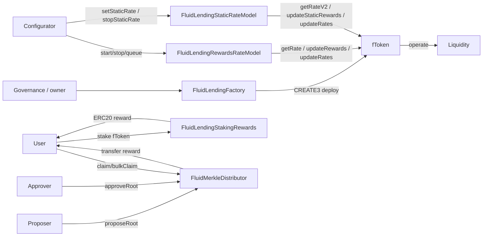

# Lending Protocol — SPEC (top-level)

This file covers the **supporting contracts** of the Fluid Lending protocol that sit outside of `fToken`: the factory that deploys fTokens, the **streaming** and **static** rewards rate models that feed them, the ERC-20 staking-rewards pool for staking fToken shares, and the pure-token merkle distributor used for off-chain accounted incentives.

The actual `fToken` (ERC-4626 share token built on top of Fluid Liquidity) has its own spec at [fToken/SPEC.md](./fToken/SPEC.md).

## 1. Purpose

Fluid Lending is the **supply-only** user-facing protocol: depositors lend a single asset to Fluid Liquidity and get back an ERC-4626 share token (`fToken`) that accrues Liquidity supply yield + optional auxiliary rewards (streaming TVL-dependent bonuses or **static** Liquidity±offset holder APRs). This top-level folder holds the moving parts that create, configure and reward those fTokens — all of which talk to Liquidity and / or the fToken but are themselves not user-deposit surfaces (except the staking pool and the merkle distributor, which are separate incentive vehicles).

## 2. Architecture

Files:

- [lendingFactory/main.sol](./lendingFactory/main.sol) — `FluidLendingFactory` — deterministic fToken deployer (CREATE3 + SSTORE2-stored creation code).
- [lendingRewardsRateModel/main.sol](./lendingRewardsRateModel/main.sol) — `FluidLendingRewardsRateModel` — duration / rewardAmount → TVL-dependent rate feed consumed by fTokens.
- [lendingStaticRateModel/main.sol](./lendingStaticRateModel/main.sol) — `FluidLendingStaticRateModel` — holder supply APR = Liquidity supply APR + signed offset (TVL-independent offset; floored at 0); Liquidity yield gap settled via bidirectional fToken `rebalance()`.
- [stakingRewards/main.sol](./stakingRewards/main.sol) — `FluidLendingStakingRewards` — Synthetix / Uniswap `StakingRewards` fork. Stake `fToken`, earn a reward ERC-20.
- [merkleDistributor/main.sol](./merkleDistributor/main.sol) — `FluidMerkleDistributor` — propose + approve merkle roots that encode cumulative reward entitlements per (positionType, positionId, recipient, cycle).
- [interfaces/iLendingFactory.sol](./interfaces/iLendingFactory.sol), [interfaces/iFToken.sol](./interfaces/iFToken.sol), [interfaces/iLendingRewardsRateModel.sol](./interfaces/iLendingRewardsRateModel.sol), [interfaces/iLendingStaticRateModel.sol](./interfaces/iLendingStaticRateModel.sol), [interfaces/iStakingRewards.sol](./interfaces/iStakingRewards.sol).
- [error.sol](./error.sol), [errorTypes.sol](./errorTypes.sol) — `FluidLendingError(uint256)` with categorized codes.

## 3. External Interactions

- [contracts/liquidity/SPEC.md](../../liquidity/SPEC.md):
  - Factory reads `LIQUIDITY.readFromStorage(exchangePricesSlot)` before deploying an fToken for a new asset, refusing to deploy if Liquidity has not yet listed / configured the exchange-price packed word (`LendingFactory__LiquidityNotConfigured`). This is not the full Liquidity admin handshake; the asset must still be configured by Liquidity governance (rate data + user supply config for the factory / fToken) before deposits work.
  - fTokens (see fToken spec) call `LIQUIDITY.operate` directly for supply / withdraw.
- fToken ↔ LendingRewardsRateModel:
  - `fToken.updateRewards(rewardsRateModel)` wires a streaming model.
  - `fToken.updateRates()` forces the fToken to re-sample `getRate(totalAssets)` and rebuild its local rewards accrual.
  - The model calls both back during `startRewards` (to rewire the model, which protects against a locked `rewardsActive_ == false` state in the fToken if prior rewards already ended) and `stopRewards` (just `updateRates()` to settle accruals up to now).
- fToken ↔ LendingStaticRateModel:
  - `fToken.updateStaticRewards(staticRateModel)` wires a static model (disables streaming rewards path on the fToken).
  - `fToken.updateRates()` re-samples signed `getRateV2()` and compounds **Liquidity yield ± offset** into the share exchange price (same additive shape as streaming).
  - `setStaticRate` calls `updateStaticRewards(this)` on wired fTokens before writing the new offset (settles accrual under the old rate).
  - `stopStaticRate` calls `updateRates()` only (does not re-wire the model on the fToken).
  - Inventory gap vs Liquidity is still settled via bidirectional `fToken.rebalance()` (see [fToken/SPEC.md](./fToken/SPEC.md)).
- StakingRewards: standalone ERC-20 pool. Pulls `stakingToken` (the fToken) on `stake` / `stakeWithPermit`, pays `rewardsToken` on `getReward`.
- MerkleDistributor: owns an ERC-20 (`TOKEN`), optionally pulls `amount_` from the calling `rewardsDistributor` on `distributeRewards`, and transfers on `claim` / `claimOnBehalfOf`. No Liquidity interaction.

## 4. Capabilities & Responsibilities

LendingFactory:

- Deploys new fTokens for a given `(asset, fTokenType)` pair using CREATE3 (address is deterministic from the pair alone — `isNativeUnderlying_` does **not** enter the salt; see §12).
- Manages the catalog of fToken creation codes (`fTokenTypes[]` + `_fTokenCreationCodePointers` SSTORE2 pointers). Creation code is compiled with constructor args `(LIQUIDITY, address(this) = factory, asset)`.
- Tracks deployments in `_allTokens` (array getter `allTokens()`).
- Refuses to create if Liquidity is not configured, if `fTokenType` has no registered code, or if the CREATE3-derived address already contains code.
- Manages `auths` (manage creation codes) and `deployers` (call `createToken`). Owner is both by default.
- Is **not** upgradeable.

LendingRewardsRateModel:

- Pure rate feed: given `totalAssets_` (from the fToken) returns `(rate, ended, startTime)` via legacy `getRate` (rate forced 0 once ended — consumed by already deployed fTokens) and `(rate, ended, startTime, endTime)` via `getRateV2` (rate stays the actual phase rate even when ended — consumed by new fTokens to settle accrual exactly up to `endTime`).
- Rate = `(yearlyReward × 1e14) / totalAssets_` once `totalAssets_ >= START_TVL`, capped at `MAX_RATE = 50 × 1e12` (50%). Below `START_TVL` the rate is 0 regardless.
- **`totalAssets_` is the last-settled TVL** (`oldTokenExchangePrice × totalSupply`), so the `START_TVL` threshold is evaluated at the *start* of each accrual window, not its end. A crossing driven purely by unsettled Liquidity yield therefore takes effect from the following update; that one window accrues no streaming rewards and is not retroactively compensated. `START_TVL` is a dust floor (it exists so dust-scale TVL cannot skew the rate), and is configured well below expected steady-state TVL, so in practice deposits — not idle yield — carry TVL across it. Accepted behavior.
- Supports one current period + one queued next period (`_duration`, `_startTime`, `_yearlyReward`, `_nextDuration`, `_nextRewardAmount`).
- Governance actions: `startRewards`, `stopRewards`, `queueNextRewards`, `cancelQueuedRewards`; permissionless `transitionToNextRewards`.
- Can drive **up to three fTokens** from a single model (`FTOKEN`, `FTOKEN2`, `FTOKEN3`).

LendingStaticRateModel:

- Signed **offset** feed: `getRateV2()` returns `(rate, ended, startTime, endTime)` where `rate` is `int256` APR offset (`1e12 = 1%`), TVL-independent. The **fToken** applies Liquidity supply yield ± this offset when compounding the share exchange price.
- `|offset|` is capped at `MAX_RATE = 50 × 1e12` (50%) at construction and on `setStaticRate`.
- `duration` is `uint32` seconds; constructor and `setStaticRate` reject `duration == 0` or `duration > type(uint32).max`.
- After `startTime + duration`, `getRateV2` returns `ended = true` while `rate` stays the configured offset — same ended semantics as streaming `getRateV2`.
- Governance actions: `setStaticRate(offset, duration)`, `stopStaticRate` (shortens duration to end at `block.timestamp - 1` after settling via `updateRates()`).
- Can drive **up to three fTokens** from a single model (`FTOKEN`, `FTOKEN2`, `FTOKEN3`).
- Model must be **LendingFactory auth** for the **first** `updateStaticRewards` wire (or when switching to a different model address). Once wired, `setStaticRate` → `updateStaticRewards(this)` is authorized as the currently wired `_rewardsRateModel` (no permanent factory auth required). Wired-model callers may only set themselves or `address(0)`.

StakingRewards:

- Synthetix-style pro-rata ERC-20 rewards on a single staked ERC-20. Takes fToken shares, pays a separate reward ERC-20 over `_rewardsDuration`.
- Supports `stakeWithPermit`, `stake`, `withdraw`, `getReward`, `exit`.
- Supports queuing the next reward amount + duration with `queueNextRewardAmount` (auto-transition inside `updateReward`), and top-up-or-start via `notifyRewardAmount` / `notifyRewardAmountWithDuration`.
- Owner can `spell(target, data)` to delegatecall arbitrary logic — see §12 trust model.

MerkleDistributor:

- Two-step root publishing: **proposer** writes `_pendingMerkleCycle`; **approver** promotes it to `_currentMerkleCycle`.
- Users claim cumulative rewards per `(recipient, positionId)` gated by merkle proof; past-cycle entitlements remain claimable through the cumulative-root design (two-cycle window on which **index** can be submitted, not a loss of historical dollars — see §12).
- Optional linear vesting between `vestingStartTime` and `vestingStartTime + vestingTime`.
- Optional pull-from-distributor on `distributeRewards`.
- Owner can pause, update config, toggle distributors, and `spell` arbitrary calls.

Does not (across the whole folder):

- Take custody of user funds other than the specific staking / claim token in each contract. The factory, rate model and fToken constructor do not move any tokens.
- Talk to Liquidity for any asset except to verify listing (factory) or to drive rate / share accrual from the fToken (see fToken spec).

## 5. Roles & Access Control

LendingFactory:

- `owner` (solmate `Owned`): can `setAuth`, `setDeployer`; is auth and deployer by default.
- `auths` (`_auths[addr] == 1`): can `setFTokenCreationCode` (add / update / remove creation code pointers for an `fTokenType`).
- `deployers` (`_deployers[addr] == 1`): can call `createToken`.

LendingRewardsRateModel:

- `CONFIGURATOR` (immutable, set in constructor): only actor allowed to call `startRewards`, `stopRewards`, `queueNextRewards`, `cancelQueuedRewards`.
- `transitionToNextRewards` is permissionless (state-cleanup convenience; view path already auto-accounts for queued rewards).
- Everyone: read-only `getConfig`, `getRate`.

LendingStaticRateModel:

- `CONFIGURATOR` (immutable, set in constructor): only actor allowed to call `setStaticRate`, `stopStaticRate`.
- Everyone: read-only `getStaticConfig`, `getRateV2`, plus legacy zero stubs `getRate` / `getConfig`.

StakingRewards:

- `owner`: `queueNextRewardAmount`, `notifyRewardAmount`, `notifyRewardAmountWithDuration`, `spell`.
- Users: `stake`, `stakeWithPermit`, `withdraw`, `getReward`, `exit`, `updateRewards`.

MerkleDistributor:

- `owner`: `updateProposer`, `updateApprover`, `pause` / `unpause`, `updateDistributionConfig`, `toggleRewardsDistributor`, `setStartBlockOfNextCycle`, `claimOnBehalfOf`, `spell`.
- `approvers` (or owner): `approveRoot`.
- `proposers` (or owner): `proposeRoot`.
- `rewardsDistributor[addr] == true` (or owner): `distributeRewards`.
- Users: `claim`, `bulkClaim`.

## 6. Storage Layout (key slots)

**LendingFactory** — no upgradeability so layout is a straight `Owned` + globals:

- Slot 0 — `address owner` (solmate `Owned`), 12 free bytes.
- Slot 1 — `_auths` mapping.
- Slot 2 — `_deployers` mapping.
- Slot 3 — `_allTokens` array.
- Slot 4 — `_fTokenTypes` array.
- Slot 5 — `_fTokenCreationCodePointers` mapping (`keccak256(abi.encode(fTokenType))` → SSTORE2 pointer).

Immutables: `LIQUIDITY`, constant `_NATIVE_TOKEN_ADDRESS`.

**LendingRewardsRateModel**:

- Slot 0 (packed) — `uint40 _duration`, `uint40 _startTime`, `uint176 _yearlyReward`.
- Slot 1 (packed) — `uint40 _nextDuration`, `uint176 _nextRewardAmount`, 40 bytes free.

Immutables: `CONFIGURATOR`, `FTOKEN`, `FTOKEN2`, `FTOKEN3`, `START_TVL`. Constants: `RATE_PRECISION = 1e12`, `SECONDS_PER_YEAR = 365 days`, `MAX_RATE = 50 × 1e12` (50%).

**LendingStaticRateModel**:

- Slot 0 (packed) — `int184 _staticRate`, `uint32 _duration`, `uint40 _startTime`.

Immutables: `CONFIGURATOR`, `FTOKEN`, `FTOKEN2`, `FTOKEN3`. Constants: `RATE_PRECISION = 1e12`, `MAX_RATE = 50 × 1e12` (50%).

**StakingRewards**:

- Slot 0 (packed) — `uint40 _periodFinish`, `uint40 lastUpdateTime`, `uint40 _rewardsDuration`, `uint136 _rewardRate`.
- Slot 1 (packed) — `uint128 rewardPerTokenStored`, `uint128 _totalSupply`.
- Slot 2 (packed) — `uint40 nextRewardsDuration`, `uint216 nextRewards`.
- Then `userRewardPerTokenPaid`, `rewards`, `_balances` mappings.

OZ `Owned` / `ReentrancyGuard` preamble precedes these.

**MerkleDistributor**:

- Slot 0 — `owner` + `Pausable._paused`.
- Slot 1 — `string name`.
- Slot 2 — `_proposers`.
- Slot 3 — `_approvers`.
- Slots 4–6 — `_currentMerkleCycle` struct (`MerkleCycle`).
- Slots 7–9 — `_pendingMerkleCycle`.
- Slot 10 — `previousMerkleRoot` (used for the previous-cycle claim window).
- Slot 11 — `claimed[recipient][positionId]` cumulative claim tracker.
- Slot 12 — `rewards[]` per-cycle table.
- Slot 13 — `distributions[]` per-distribution table.
- Slot 14 — `rewardsDistributor` allowlist.
- Slot 15 (packed) — `uint40 cyclesPerDistribution`, `uint40 blocksPerDistribution`, `uint40 startBlockOfNextCycle`, `bool pullFromDistributor`, `uint40 vestingTime`, `uint40 vestingStartTime`.

## 7. User / Public Methods

### LendingFactory (views)

- `computeToken(asset, fTokenType) → address` — CREATE3 deterministic address precomputation.
- `allTokens() → address[]`.
- `fTokenTypes() → string[]`.
- `fTokenCreationCode(fTokenType) → bytes` — returns empty bytes if unregistered.
- `isAuth(addr) → bool`, `isDeployer(addr) → bool`.

### LendingRewardsRateModel

- `getConfig() → (duration, startTime, endTime, startTvl, maxRate, rewardAmount, configurator)` — full read.
- `getRate(totalAssets) → (rate, ended, startTime)` — **legacy**, consumed by already deployed fTokens:
  - Before `startTime`: `(0, false, startTime)`.
  - Between `startTime` and `endTime` (inclusive): `(rate, false, startTime)` where `rate = yearlyReward × 1e14 / totalAssets` unless `totalAssets < START_TVL` (→ 0) or `rate > MAX_RATE` (→ capped at 50%).
  - After `endTime`: if `_nextRewardAmount == 0`, returns `(0, true, startTime)`; otherwise, automatically switches to the queued next phase (same formula, new `nextStartTime = endTime`, new `nextEndTime`). If the next phase has also ended returns `(0, true, nextStartTime)`.
- `getRateV2(totalAssets) → (int256 rate, ended, startTime, endTime)` — consumed by new fTokens. Same phase selection and rate formula as `getRate`, plus the reported phase's `endTime`. `rate` is signed for a shared ABI with the static offset model; this model never returns < 0 (clamped). When `ended` is true, `rate` stays the **actual phase rate** (not forced 0), so new fTokens settle rewards accrual exactly over `[lastUpdateTimestamp, endTime]` instead of losing the tail.
- `transitionToNextRewards()` — anyone, state-cleanup only (see §8); reverts if current rewards have not ended or no next rewards queued. An **off-chain bot** is expected to call `fToken.updateRates()` (and then `transitionToNextRewards` once the period has ended) within ~10 minutes before / around the current period `endTime`, so any accrual gap around the boundary stays negligible (see §11 / §12).

### LendingStaticRateModel

- `getStaticConfig() → (staticRate, duration, startTime, configurator, maxRate)` — `staticRate` is the signed offset (`int256`, `1e12` = 1%); `maxRate` is the hard ceiling on `|offset|` (`MAX_RATE` = 50%).
- `getRate(totalAssets) → (0, false, 0)` and `getConfig() →` all-zero 7-tuple — **legacy streaming stubs** (selectors only).
- `getRateV2(totalAssets) → (int256 rate, ended, startTime, endTime)` — same signed ABI as streaming `getRateV2`; returns the configured offset only; fToken combines with Liquidity yield:
  - Before / after end: same `ended` semantics as streaming; `rate` stays the configured offset so fTokens settle exactly up to `endTime`.
  - `_startTime` is always `block.timestamp` at construction / `setStaticRate`.

### StakingRewards

- Views: `totalSupply`, `balanceOf`, `earned`, `rewardPerToken`, `lastTimeRewardApplicable`, `rewardRate` / `rewardsDuration` / `periodFinish` (return **current** or, if the current period finished and next is queued, the **next** phase values), `nextRewardRate` / `nextPeriodFinish`, `getRewardForDuration`.
- `stake(amount)` — pulls `stakingToken`, updates rewards for the caller. `amount > 0` required.
- `stakeWithPermit(amount, deadline, v, r, s)` — EIP-2612 permit + stake.
- `withdraw(amount)` — `amount > 0`.
- `getReward()` — transfers pending rewards to caller; no-op if zero.
- `exit()` — `withdraw(_balances[sender]); getReward();` (not `nonReentrant` itself, but both callees are).
- `updateRewards()` — public `updateReward(address(0))`, used to cure the reward-accounting state and trigger the automatic transition to queued rewards when `block.timestamp > _periodFinish && nextRewardsDuration > 0`.
- All state changing calls are `nonReentrant` (OZ ReentrancyGuard).

### MerkleDistributor

- `claim(recipient, cumulativeAmount, positionType, positionId, cycle, merkleProof, metadata)` — requires `msg.sender == recipient` and `cycle ∈ {currentCycle, currentCycle - 1}`; transfers `cumulativeAmount − claimed[recipient][positionId]` (or less, if vesting is active) in `TOKEN`. Reverts `InvalidCycle` / `InvalidProof` / `NothingToClaim` / `MsgSenderNotRecipient`.
- `bulkClaim(Claim[])` — loops `claim`.
- `claimOnBehalfOf(onBehalfOf, recipient, cumulativeAmount, positionType, positionId, cycle, proof, metadata)` — **owner only**, backup claim path. Records claimed amount against `onBehalfOf`, transfers tokens to `recipient`. Used when an integrating protocol has no user-facing claim path.
- `encodeClaim(recipient, cumulativeAmount, positionType, positionId, cycle, metadata) → (encoded, hash)` — pure helper to build the leaf.
- Views: `hasPendingRoot`, `currentMerkleCycle`, `pendingMerkleCycle`, `totalCycleRewards`, `totalDistributions`, `getCycleRewards`, `getCycleReward(cycle)`, `getDistributionForEpoch(epoch)`, `getDistributions`.
- Vesting edge cases (`claim`): if `vestingTime > 0` and `block.timestamp < vestingStartTime + vestingTime`, the claimable is `(cumulativeAmount × vestingPeriod / vestingTime) − claimed[...]`. Once vesting has fully elapsed, full `cumulativeAmount − claimed[...]` becomes claimable. Before `vestingStartTime`, `vestingPeriod == 0` → claimable is clamped to `0 − claimed[...]`, which reverts `NothingToClaim` as long as claimed is ≥ 0 and `cumulativeAmount × 0 == 0`.
- `distributeRewards(amount)` — `rewardsDistributor` only: splits `amount` into `cyclesPerDistribution` equally-sized cycles (with any rounding dust added to the last cycle), pushes a `Distribution` record, optionally pulls `amount` from `msg.sender` when `pullFromDistributor`. See §8 for block-math details.

## 8. Admin / Governance Methods

### LendingFactory — owner

- `setAuth(auth, allowed)` — toggle creation-code editor; rejects `address(0)`.
- `setDeployer(deployer, allowed)` — toggle deployer role; rejects `address(0)`.

### LendingFactory — auths

- `setFTokenCreationCode(fTokenType, creationCode)` — empty `creationCode` removes the entry (from both the pointer mapping and `_fTokenTypes[]` via swap-and-pop); non-empty `creationCode` writes a new SSTORE2 pointer (overwriting any existing pointer for that type) and appends `fTokenType` to the array if not already present. Emits `LogSetFTokenCreationCode`.

### LendingFactory — deployers

- `createToken(asset, fTokenType, isNativeUnderlying) → token`:
  - Reverts `InvalidParams` if `fTokenType` has no creation code.
  - Reverts `TokenExists` if the CREATE3 address already has code (solmate's `CREATE3` does not self-check).
  - Reverts `LiquidityNotConfigured` if the relevant Liquidity exchange-price slot is zero. When `isNativeUnderlying == true` the check reads the **native** slot; otherwise the **asset** slot (so the caller can pre-list the native underlying at Liquidity and point a WETH-shaped fToken at it — this is the intended pattern for WETH-native fTokens).
  - Deploys with CREATE3; appends to `_allTokens`; emits `LogTokenCreated`.
  - `isNativeUnderlying` is **not** part of the CREATE3 salt — the `fTokenType` string is expected to discriminate native-vs-ERC20 variants. Using the same `fTokenType` with different `isNativeUnderlying` values at the same `asset` reverts `TokenExists` on the second call.

### LendingRewardsRateModel — configurator

- `startRewards(rewardAmount, duration, startTime)` — reverts `NotEnded` if current rewards have not fully ended and `MustTransitionToNext` if a queued phase still exists. `startTime == 0` → `block.timestamp`; `startTime < block.timestamp` → `InvalidParams`; `duration == 0 || rewardAmount == 0` → `InvalidParams`. Calls `fToken.updateRates()` on all wired fTokens **before** overwriting schedule storage (settles the expired tail), then writes the new period and calls `fToken.updateRewards(this)` to reactivate rewards if `_rewardsActive` was cleared after the previous schedule ended.
- `stopRewards()` — reverts `AlreadyStopped` if never started or already ended, `NextRewardsQueued` if a next period is queued (must cancel it first). Calls `fToken.updateRates()` on all wired fTokens, then shortens `_duration` so the current period ends at `block.timestamp - 1`.
- `queueNextRewards(rewardAmount, duration)` — reverts `InvalidParams` / `NextRewardsQueued` / `NoRewardsStarted`. Special case: if current rewards have already ended, delegates to `startRewards(rewardAmount, duration, block.timestamp)` instead of queuing.
- `cancelQueuedRewards()` — reverts `NoQueuedRewards` if nothing queued, `MustTransitionToNext` if current period already ended (in that case must first call `transitionToNextRewards()` and then `stopRewards()`).
- `transitionToNextRewards()` — permissionless, idempotent-ish. Reverts `NotEnded` if current period is still live, `NoQueuedRewards` if nothing queued. Promotes the queued period to current, sets new `_startTime = old endTime` (so rewards between `lastUpdateTimestamp` in the fToken and the new `_startTime` would otherwise be lost). **Operational mitigation:** an off-chain bot calls `updateRates()` on wired fTokens within ~10 minutes before the current period ends, then `transitionToNextRewards` shortly after `endTime`, so the unsettled window (and any lost boundary rewards) stays tiny and is accepted.

### LendingStaticRateModel — configurator

- `setStaticRate(offset, duration)` — reverts `MaxRate` if `|offset| > MAX_RATE`; `InvalidParams` if `duration == 0` or `duration > type(uint32).max`. Calls `fToken.updateStaticRewards(this)` on all wired fTokens **before** writing the new offset (settles accrual under the old effective rate). Writes `_staticRate`, `_startTime = block.timestamp`, `_duration`. Emits `LogSetStaticRate`.
- `stopStaticRate()` — reverts `AlreadyStopped` if never started or already ended. Calls `fToken.updateRates()` on all wired fTokens, then shortens `_duration` so the program ends at `block.timestamp - 1`. Emits `LogStopStaticRate`.

### StakingRewards — owner

- `queueNextRewardAmount(nextReward, nextDuration)` — current period must still be live (`block.timestamp < _periodFinish`), no already-queued next, `balanceOf(rewardsToken, this) >= remainingCurrentReward + nextReward`.
- `notifyRewardAmount(reward)` — current period must be ended or not started. Recomputes `_rewardRate` (optionally folding leftover). Writes new `lastUpdateTime` / `_periodFinish`. Reverts if the implied rate × duration would exceed the contract's `rewardsToken` balance.
- `notifyRewardAmountWithDuration(reward, newDuration)` — same as above but also updates `_rewardsDuration`.
- `spell(target, data) → bytes` — **delegatecall** arbitrary target with arbitrary calldata as owner. This gives the owner full control over storage and funds; treat as a trusted governance hammer.

### MerkleDistributor

- Owner:
  - `updateProposer(addr, bool)`, `updateApprover(addr, bool)` — both reject `address(0)`, both emit logs.
  - `pause()` / `unpause()` — Pausable; `claim` / `bulkClaim` / `claimOnBehalfOf` / `proposeRoot` are all `whenNotPaused`.
  - `updateDistributionConfig(pullFromDistributor, blocksPerDistribution, cyclesPerDistribution)` — rejects any zero for the numeric args.
  - `toggleRewardsDistributor(addr)` — flips the allowlist; rejects `address(0)`.
  - `setStartBlockOfNextCycle(block)` — must be `>= block.number` and `!= 0`.
  - `spell(targets[], calldatas[])` — sequential `delegatecall` to each target.
- Proposer (or owner): `proposeRoot(root, contentHash, cycle, startBlock, endBlock)` — requires `cycle == currentCycle + 1` and `startBlock <= endBlock`. Overwrites any prior pending cycle. Emits `LogRootProposed`.
- Approver (or owner): `approveRoot(root, contentHash, cycle, startBlock, endBlock)` — all args must exactly match `_pendingMerkleCycle`. Moves pending → current, saves `_currentMerkleCycle.merkleRoot` into `previousMerkleRoot`. Emits `LogRootUpdated`.
- Rewards distributor (or owner): `distributeRewards(amount)` — `amount != 0`. Computes `amountPerCycle = amount / cyclesPerDistribution` and `blocksPerCycle = blocksPerDistribution / cyclesPerDistribution`. `startBlock` resolves as (1) last cycle's `endBlock + 1`, (2) `startBlockOfNextCycle` if it is later, (3) `block.number` if there are no cycles yet. Pushes a `Distribution` and appends `cyclesPerDistribution` `Reward` rows, assigning any rounding dust to the last cycle. If `pullFromDistributor`, pulls `amount` from `msg.sender`.

## 9. Events

- LendingFactory — `LogTokenCreated`, `LogSetAuth`, `LogSetDeployer`, `LogSetFTokenCreationCode`.
- LendingRewardsRateModel — `LogStartRewards`, `LogStopRewards`, `LogQueueNextRewards`, `LogCancelQueuedRewards`, `LogTransitionedToNextRewards`.
- FluidLendingStaticRateModel — `LogSetStaticRate`, `LogStopStaticRate`.
- StakingRewards — `RewardAdded`, `Staked`, `Withdrawn`, `RewardPaid`, `NextRewardQueued`.
- MerkleDistributor — `LogUpdateProposer`, `LogUpdateApprover`, `LogRootProposed`, `LogRootUpdated`, `LogClaimed`, `LogRewardCycle`, `LogDistribution`, `LogDistributionConfigUpdated`, `LogRewardsDistributorToggled`, `LogStartBlockOfNextCycleUpdated`.

OZ `OwnershipTransferred`, `Paused`, `Unpaused` come from inherited code.

## 10. Errors

Coded via [error.sol](./error.sol) (`FluidLendingError(uint256)`). Codes in [errorTypes.sol](./errorTypes.sol):

- fToken: 20001–20011 (see [fToken/SPEC.md](./fToken/SPEC.md)).
- fToken native underlying: 21001, 21002.
- LendingFactory: `InvalidParams = 22001`, `ZeroAddress = 22002`, `TokenExists = 22003`, `LiquidityNotConfigured = 22004`, `Unauthorized = 22005`.
- LendingRewardsRateModel: `InvalidParams = 23001`, `MaxRate = 23002` (reserved — in practice the rate is clamped to `MAX_RATE` inside `getRate` rather than reverting), `Unauthorized = 23003`, `AlreadyStarted = 23004` (reserved), `AlreadyStopped = 23005`, `NextRewardsQueued = 23006`, `NotEnded = 23007`, `NoQueuedRewards = 23008`, `MustTransitionToNext = 23009`, `NoRewardsStarted = 23010`.
- LendingStaticRateModel: `Unauthorized = 24001`, `InvalidParams = 24002`, `MaxRate = 24003`, `AlreadyStopped = 24004`.

MerkleDistributor raises `InvalidParams`, `Unauthorized`, `InvalidCycle`, `InvalidProof`, `NothingToClaim`, `MsgSenderNotRecipient` as named Solidity custom errors (see `merkleDistributor/errors.sol`). StakingRewards uses string `require` messages.

## 11. Invariants & Safety Notes

- **Factory does not configure Liquidity.** Listing the asset at Liquidity (exchange prices + user supply config for the fToken address) is a separate governance action. `createToken` only guards against deploying an fToken before the asset even has a Liquidity exchange-price word — it does not check that the fToken itself is set as an allowed supplier at Liquidity, and deposits will revert at Liquidity level if the user supply config is missing.
- **CREATE3 salt excludes `isNativeUnderlying`.** The contract expects distinct `fTokenType` strings (e.g. `"normal"` vs `"native-underlying"`) to separate deployment variants; reusing the same `fTokenType` with different `isNativeUnderlying` at the same asset will collide on the CREATE3 address.
- **Rate model is a view surface with queue semantics.** `getRate` / `getRateV2` transparently handle the transition to queued rewards so fTokens see a consistent stream even if `transitionToNextRewards` has not been called. `transitionToNextRewards` is there purely to settle storage and avoid paying the extra branches forever. However, fToken rewards accrual is bounded by `_startTime`, so the span `[lastUpdateTimestamp, new _startTime]` (= the old `endTime`) gets **no rewards** when that window is left unsettled — **accepted**: an off-chain bot is expected to poke `updateRates()` within ~10 minutes before period end (and `transitionToNextRewards` around the boundary), so any gap is negligible and is not solved on-chain.
- **`startRewards` settles before overwrite.** After a schedule has naturally ended (no queue), `startRewards` calls `updateRates()` on wired fTokens **before** writing the new `_startTime` / `_duration` / `_yearlyReward`, so any unsettled old-period tail is paid under the old rate. It then writes the new schedule and calls `updateRewards(this)` to clear a locked `_rewardsActive == false` from the previous ended period. If a queued next phase still exists, `startRewards` reverts `MustTransitionToNext` (must `transitionToNextRewards` or cancel first) so current storage cannot be overwritten while leaving a stale queue. Exact rewards accrual through `endTime` requires fTokens that consume `getRateV2` (rate stays non-zero when `ended`); legacy fTokens that only call `getRate` still settle Liquidity yield on that poke but see `rate = 0` once ended.
- **Rate cap is 50%.** `MAX_RATE = 50 × RATE_PRECISION` is a hard upper bound enforced inside `getRate`.
- **Rewards rate model is **wired to up to 3 fTokens**.** `stopRewards` / `startRewards` call through to all three (skipping zero addresses). This is by design — a single configurator can drive same-schedule rewards on several fTokens (e.g. ETH + WETH).
- **Static rate model is TVL-independent.** The model returns a signed APR **offset** (`int256`, `1e12` = 1%) via `getRateV2`; `|offset|` is capped at `MAX_RATE` (50%). Positive offset adds on top of Liquidity supply yield; negative subtracts. The fToken **always** compounds Liquidity exchange-price yield and adds `offset × time / year` in the same additive shape as streaming; if the net window return would be negative, it is floored at 0 so the share exchange price never decreases from a negative offset. The floor applies **per accrual window and is not carried forward**: the part of a negative offset that exceeds the Liquidity yield of the window in which it is settled is discarded, so realized offset capture depends on checkpoint timing whenever Liquidity APR dips below `|offset|`. Any interaction checkpoints (`updateRates()` is permissionless), and rates are updated at least weekly, so the exposed window is short by construction. Accepted behavior. Inventory vs Liquidity is settled bidirectionally via `rebalance()`. After program end, `getRateV2` reports `ended = true` while still returning the configured offset and `endTime`; the fToken settles the offset tail exactly up to `endTime`, then Liquidity yield continues to compound normally (no mid-window Liquidity pro-rate at static end). Legacy `getRate` / `getConfig` return zeros. The static model exposes the same `getRateV2` interface as the streaming model (input ignored) so fTokens consume both model types through one call. The next fToken `updateRates()` clears `_rewardsActive` while `isStaticRateModelActive` may remain true until unwired.
- **Static rate duration is `uint32`.** Programs longer than ~136 years cannot be configured; use governance to re-`setStaticRate` if an extension is needed.
- **Static `setStaticRate` settles before rewrite.** Skipping `updateStaticRewards` on rate change would retroactively apply the new APR — the model always calls through to fTokens first.
- **StakingRewards `updateReward` auto-transitions queued next rewards.** Any `stake / withdraw / getReward / updateRewards` call after `_periodFinish` promotes the queued rewards atomically so there is no manual admin step needed once `queueNextRewardAmount` is set.
- **StakingRewards balance check on top-ups.** Both `queueNextRewardAmount` and `notifyRewardAmount(WithDuration)` require that the rewards token balance can cover the implied payout — funds must be transferred in **before** the admin call. Rebasing / fee-on-transfer reward tokens are not safely supported.
- **MerkleDistributor cumulative roots.** Each new root is the **cumulative total** per recipient; on-chain only the current cycle and the previous cycle can be submitted, but entitlement from older cycles is not lost because it is re-expressed in the newer cumulative root. `claimed[recipient][positionId]` is the floor. Off-chain tooling must preserve this invariant.
- **MerkleDistributor vesting is applied per claim window.** Before `vestingStartTime`, any call yields `NothingToClaim` (the linear ramp is zero). Between `vestingStartTime` and `vestingStartTime + vestingTime`, claimable is proportional to elapsed time; after, it is the full cumulative. Switching `vestingTime` from `0` to non-zero mid-cycle would retroactively gate earlier claims and is not supported by a setter — set at construction and leave alone.
- **Chain support in MerkleDistributor constructor.** `blocksPerDistribution` is derived from a hard-coded block-time table: chainid 1 (12 s), 42161 (0.25 s), 8453 / 137 (2 s), 9745 (1 s). Any other chainid reverts `"Unsupported chain"`. Deploying to a new chain requires a code change.
- **`spell(delegatecall)` in both StakingRewards and MerkleDistributor.** These are governance hammers that execute arbitrary code in the contract's storage context and can move any token balance or upgrade storage. Trust implication: owner compromise → total drain. Owner must be a high-assurance multisig.
- **Rate model storage packing assumes ETH-scale rewards.** `uint176 _yearlyReward` caps a single phase's yearly reward amount at ~9.6e52, i.e. not practically reachable; `uint40` timestamps survive until 2106.
- **Staking rewards storage packing.** `uint128 _totalSupply` limits total staked fToken shares to ~3.4e38, well above any realistic fToken supply; `uint216 nextRewards` is likewise effectively unbounded.

## 12. Trust Model & Accepted Trade-offs

- **Permit residual allowances (fToken).** `withdrawWithSignature` / `redeemWithSignature` set an allowance and spend only the shares actually burned; any over-signed amount stays as a standing allowance. This is normal ERC-20 permit semantics. Operators / UIs should sign only the intended amount (a small buffer over `previewWithdraw` / `previewRedeem`), **not** the full balance. Not a protocol defect.
- **Pro-rata streaming rewards are the intended economics.** A user who deposits near `startRewards` / `transitionToNextRewards` earns their pro-rata share of emissions for the time their shares exist — the design does not and should not try to "time-gate" new depositors. "Sandwich" framings of the rewards schedule are not classified as bugs.
- **Queued rewards / static end-boundary drift is operationally mitigated, not on-chain perfected.** Exact multi-phase accrual across an unsettled `endTime` boundary is intentionally not implemented. An off-chain bot pokes `updateRates()` within ~10 minutes before period end so residual drift is negligible and accepted.
- **CREATE3 salt by `(asset, fTokenType)`.** The `isNativeUnderlying` flag is **not** part of the salt because distinct variants are registered under distinct `fTokenType` strings. Documented so integrators don't attempt to derive addresses including the flag.
- **MerkleDistributor window vs entitlement.** The on-chain two-cycle submission window does not limit historical entitlement because roots are cumulative. Off-chain generators must preserve this invariant; on-chain fencing is intentional.
- **`rescueFunds(WETH)` on a native-underlying fToken.** Accidentally sent WETH can be rescued to Liquidity but will land as **WETH** while the fToken's listed asset is the native token sentinel — it will sit at Liquidity untracked for the fToken until governance reconciles. Document for operators; not a user-fund-loss class.
- **Configurator on rate model is a single EOA-or-multisig.** It can start, stop, queue, and cancel streaming rewards unilaterally. It can also drive up to three fTokens from the same model. Trust implication: configurator should be governance-tier.
- **Configurator on static rate model** has the same trust profile: can change signed offset/duration or stop the program early on all wired fTokens.
- **LendingFactory deployers are trusted to deploy at the right `fTokenType`.** There is no on-chain check that the creation code registered for a given `fTokenType` corresponds to the native-vs-ERC20 variant the deployer claims. Auths must keep the creation code registry honest.
- **MerkleDistributor `claimOnBehalfOf` redirects transfer to `recipient`.** This is a backup path for protocols without their own claim UI — it does **not** grant the owner a unilateral transfer right over existing claimants' balances (the merkle proof is still required and `claimed` is still debited against `onBehalfOf`). It is an allowed redirection of payout destination, bounded by a valid proof.
- **StakingRewards pre-funding requirement.** Admin is responsible for having the rewards ERC-20 already in the contract before calling `queueNextRewardAmount` / `notifyRewardAmount*`. Failure mode is a single revert; no loss.
- **MerkleDistributor block-time table.** Deploying on an unsupported chain reverts in the constructor. Chains with variable block times (e.g. L2s with dynamic PoB) may produce drift between the intended wall-clock distribution and the actual cycle length; not a defect for the accepted deployment list.
- **`spell(delegatecall)` hammers accepted.** Present on StakingRewards (single target) and MerkleDistributor (multi-target). Governance convenience for emergency recoveries; not gated beyond `onlyOwner`. Multisig assumption applies.
