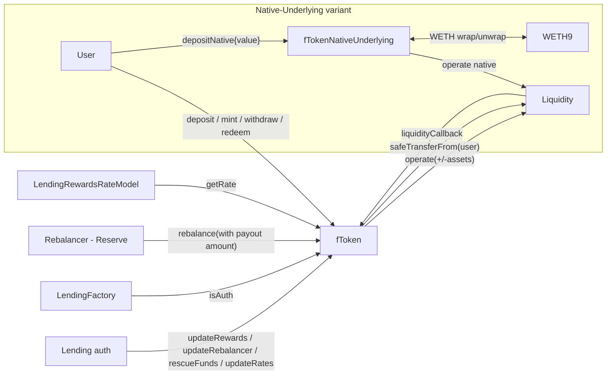

# fToken — SPEC

This is the user-facing share token of the Fluid Lending protocol. Supporting contracts (factory, rate model, staking rewards, merkle distributor) live one level up and are covered by [../SPEC.md](../SPEC.md).

## 1. Purpose

`fToken` is an ERC-20 + ERC-4626 share token whose underlying is a single ERC-20 asset listed at Fluid Liquidity. Depositing mints shares at the current `tokenExchangePrice`; withdrawing burns them at the same price. The price compounds upward with (a) Liquidity supply interest and (b) an **optional** rewards program — either **streaming** (TVL-dependent rate from `LendingRewardsRateModel`, topped up via `rebalance`) or **static** (TVL-independent signed APR offset from `FluidLendingStaticRateModel`, compounded additively with Liquidity yield; bidirectional `rebalance` settles inventory gaps). The user never directly deals with Liquidity — the fToken deposits / withdraws on their behalf via `LIQUIDITY.operate(asset, +signed, ...)` with `liquidityCallback` used to pull the ERC-20 from the caller.

`fTokenNativeUnderlying` is the drop-in variant that takes WETH as underlying asset but deposits / withdraws at Liquidity in **native** ETH. It additionally exposes `depositNative` / `mintNative` / `withdrawNative` / `redeemNative` (and native + signature variants) for users who want to skip the WETH wrap / unwrap.

## 2. Architecture

Files:

- [main.sol](./main.sol) — `fToken` (composed from `fTokenCore`, `fTokenViews`, `fTokenAdmin`, `fTokenActions`, `fTokenEIP2612Withdrawals`, `fTokenEIP2612Deposits`, `fTokenPermit2Deposits`). Non-upgradeable. ERC-4626-compliant.
- [variables.sol](./variables.sol) — `Constants` + `Variables`. Immutables: `PERMIT2 = 0x...22D4...A3` (canonical Uniswap Permit2), `EXCHANGE_PRICES_PRECISION = 1e12`, `SECONDS_PER_YEAR = 365 days`, `MAX_REWARDS_RATE = 50 × 1e12` (50%), `LIQUIDITY`, `LENDING_FACTORY`, `ASSET`, `DECIMALS`, pre-computed `LIQUIDITY_EXCHANGE_PRICES_SLOT`, `LIQUIDITY_TOTAL_AMOUNTS_SLOT`, `LIQUIDITY_USER_SUPPLY_SLOT`.
- [events.sol](./events.sol) — `LogUpdateRewards`, `LogUpdateStaticRewards`, `LogRebalance`, `LogUpdateRates`, `LogRescueFunds`, `LogUpdateRebalancer`.
- [nativeUnderlying/fTokenNativeUnderlying.sol](./nativeUnderlying/fTokenNativeUnderlying.sol) — `fTokenNativeUnderlying` overrides `_depositToLiquidity` / `_withdrawFromLiquidity` to use the native-token sentinel, overrides `_executeDeposit` / `_executeWithdraw` to wrap / unwrap WETH, and adds the `*Native` method set + native `rebalance` and overridden `rescueFunds`. `liquidityCallback` is disabled (always reverts).

Error codes — see [../errorTypes.sol](../errorTypes.sol) (`fToken__* = 20001..20011`, `fTokenNativeUnderlying__* = 21001, 21002`).

## 3. External Interactions

- **Liquidity** — see [../../../liquidity/SPEC.md](../../../liquidity/SPEC.md):
  - Every `deposit` / `mint` does `LIQUIDITY.operate(ASSET, +assets, 0, 0, 0, abi.encode(msg.sender))`. The pull side goes through `liquidityCallback(ASSET, amount, data)` — Liquidity calls the fToken back, which `SafeTransferFrom(ASSET, from_, LIQUIDITY, amount)` (ERC-20) or `PERMIT2.transferFrom(from_, LIQUIDITY, uint160(amount), ASSET)` (Permit2 path, if `data_.length > 32` and the flag is true).
  - Every `withdraw` / `redeem` does `LIQUIDITY.operate(ASSET, -assets, 0, receiver_, 0, "")`. Liquidity pushes the asset directly to `receiver_`; no callback.
  - Exchange-price reads use `LIQUIDITY.readFromStorage(LIQUIDITY_EXCHANGE_PRICES_SLOT)` → `LiquidityCalcs.calcExchangePrices(...)`. Withdrawable balance is computed from the packed user-supply word (decoded `BigMath` + `LiquidityCalcs.calcWithdrawalLimitBeforeOperate`) clamped to Liquidity's actual asset balance.
- **LendingRewardsRateModel** — see [../SPEC.md](../SPEC.md). When `_rewardsActive`, signed `getRateV2((oldTokenExchangePrice × totalSupply) / 1e12)` is called on every exchange-price recomputation (same path for streaming and static models). `|rate|` outside `MAX_REWARDS_RATE` (50%) is forced to 0. When `rewardsEnded_` flips true, the rewards tail is settled **exactly up to the model's `endTime`** (accrual window is clamped to `[max(lastUpdateTimestamp, startTime), endTime]`), then `_rewardsActive` is flipped to `false` as a gas shortcut.
- **LendingFactory** — admin calls (`updateRewards`, `updateRebalancer`, `rescueFunds`) are gated on `LENDING_FACTORY.isAuth(msg.sender)`. `rebalance()` gates on `msg.sender == _rebalancer` (a separate wiring, usually the Reserve).
- **Underlying asset** — `SafeTransferFrom` pulls on deposit; for native-underlying, `IWETH9(ASSET).withdraw(assets_)` converts the pulled WETH to ETH before shipping to Liquidity, and `IWETH9(ASSET).deposit{value: assets_}()` wraps back before returning to the withdrawer.
- **Permit2** — `fTokenPermit2Deposits` calls `PERMIT2.permit(msg.sender, permit_, signature_)` then `PERMIT2.transferFrom(from, LIQUIDITY, uint160(amount), ASSET)` inside `liquidityCallback`. The permit MUST be signed by `msg.sender` (owner == msg.sender is enforced in the permit call); do not modify this without moving to `permitWitnessTransferFrom`.
- **Native variant only** — `Address.sendValue` for refunds on `rebalance` overpayment and for `rescueFunds(NATIVE_TOKEN_ADDRESS)`.

## 4. Capabilities & Responsibilities

Does:

- Provide ERC-20 `fXYZ` shares (name = `"Fluid " + ASSET.name()`, symbol = `"f" + ASSET.symbol()`, `decimals == ASSET.decimals()`). Full ERC-20 and ERC-2612 permit support.
- Provide ERC-4626 deposit / mint / withdraw / redeem semantics, plus `*WithSignature` / `*WithSignatureEIP2612` / `*Permit2` variants, plus slippage-protected overloads that take a `minAmountOut_` or `maxAmount_` parameter.
- Maintain a local `_tokenExchangePrice` (shares → assets) that compounds Liquidity supply yield + optional rewards, updated lazily on each operate path or forcibly via `updateRates()` / `rebalance()`.
- Keep zero custody of the underlying asset on the happy path — deposited assets are immediately forwarded to Liquidity, withdrawn assets are routed directly by Liquidity to the user. The only time the fToken itself holds `ASSET` is (a) accidentally transferred funds — cleaned up by `rescueFunds` — or (b) the native-underlying wrap / unwrap window inside a single tx.
- Support one `rebalancer` who settles `totalAssets()` vs Liquidity balance via bidirectional `rebalance()`: deposit when rewards are owed (tops up from Reserve), withdraw excess Liquidity yield to the rebalancer when fees are owed (static programs).
- Reject cross-boundary reentrancy (`REENTRANCY_ENTERED` state) and `liquidityCallback` from anyone except Liquidity itself, with the expected `token_` and during an active `operate`.

Does not:

- Support fee-on-transfer, rebasing, or unusual-decimals ERC-20s. Rounding assumes constant-share ERC-20 semantics.
- Provide borrow-side functionality. fTokens are supply-only; borrowing against the underlying happens through Vault / DEX protocols that talk to Liquidity directly.
- Offer on-chain rewards accrual per user. Rewards are **pro-rata by share-holding over time**, expressed as a single rising `tokenExchangePrice`. Claim events do not exist.
- Allow configuring Liquidity's rate data / supply config — that lives at Liquidity.

## 5. Roles & Access Control

- **User**: any address — `deposit`, `mint`, `withdraw`, `redeem`, `depositWithSignature*`, `mintWithSignature*`, `withdrawWithSignature`, `redeemWithSignature`, and all `*Native` variants on `fTokenNativeUnderlying`. `updateRates()` is also public (anyone can force a rate refresh).
- **LendingFactory auth** (checked via `LENDING_FACTORY.isAuth(msg.sender)`):
  - `updateRewards(IFluidLendingRewardsRateModel)` — wire / rewire / unwire (pass `address(0)`) the streaming rewards rate model. Also callable by the **currently wired** `_rewardsRateModel` (see below).
  - `updateStaticRewards(IFluidLendingStaticRateModel)` — wire / rewire / unwire the static rate model. Also callable by the currently wired rate model.
  - `updateRebalancer(address)` — set the single-address `rebalancer` slot. Rejects `address(0)`.
  - `rescueFunds(address token)` — sweep `token.balanceOf(this)` (or native balance for the native sentinel on the native-underlying fToken) to Liquidity.
- **Currently wired rate model** (`msg.sender == address(_rewardsRateModel)`): may call `updateRewards` / `updateStaticRewards` so `startRewards` / `setStaticRate` can settle and re-activate without keeping the model as a permanent LendingFactory auth. Restricted to setting **itself** or `address(0)` (cannot install a different model). First-ever attach (or switching to a **different** model address) still requires factory auth.
- **Rebalancer** (`msg.sender == _rebalancer`): `rebalance()` — settles Liquidity balance to `totalAssets()` (deposit rewards gap or withdraw fees gap).
- **Liquidity** (`msg.sender == LIQUIDITY`): `liquidityCallback` (base `fToken` only — always reverts on `fTokenNativeUnderlying`).
- **Owner-of-shares / approved spender**: `withdraw` / `redeem` / permit-based variants debit `allowance[owner][msg.sender]` (via `_spendAllowance` on the shares actually burned) when `msg.sender != owner_`.

There is no on-chain "owner" of the fToken itself — governance flows through the factory auth check.

## 6. Storage Layout

Inherited from OpenZeppelin `ERC20` + `ERC20Permit`:

- Slot 0 — `_balances`.
- Slot 1 — `_allowances`.
- Slot 2 — `_totalSupply`.
- Slots 3, 4 — `_name`, `_symbol` (set in constructor from `ASSET.name()` / `ASSET.symbol()` with `"Fluid "` / `"f"` prefixes).
- Slot 5 — `ERC20Permit._nonces`.
- Slot 6 — legacy `_PERMIT_TYPEHASH_DEPRECATED_SLOT`.

Then fToken state:

- **Slot 7** — `IFluidLendingRewardsRateModel _rewardsRateModel` (address) + 12 free bytes (`__placeholder_gap`).
- **Slot 8 (packed)** — `uint64 _liquidityExchangePrice` (in 1e12), `uint64 _tokenExchangePrice` (in 1e12; constructor sets to `EXCHANGE_PRICES_PRECISION = 1e12`), `uint40 _lastUpdateTimestamp`, `uint8 _status` (reentrancy: `NOT_ENTERED = 1`, `ENTERED = 2`), `bool _rewardsActive`, 9 free bytes.
- **Slot 9** — `address _rebalancer`.

Immutables (from `Constants`): `LIQUIDITY`, `LENDING_FACTORY`, `ASSET`, `DECIMALS`, pre-computed Liquidity slot links (`LIQUIDITY_EXCHANGE_PRICES_SLOT`, `LIQUIDITY_TOTAL_AMOUNTS_SLOT`, `LIQUIDITY_USER_SUPPLY_SLOT`).

Native-underlying variant adds no new storage — only method overrides and `NATIVE_TOKEN_ADDRESS` constant.

## 7. User / Public Methods

All state-changing entry points are `nonReentrant` (OZ-style in-slot flag in `_status`).

### ERC-4626 core (fToken — ERC-20 asset)

- `deposit(assets, receiver) → shares`:
  - `assets == type(uint256).max` → `assets := ASSET.balanceOf(msg.sender)` at the top of the call.
  - Pulls via `liquidityCallback`; receiver must be non-zero.
  - Shares = `(assets × 1e12) / tokenExchangePrice` (floor). If floor → 0, reverts `fToken__DepositInsignificant` — in practice this triggers when `assets` is below `minDeposit()`.
  - Emits ERC-4626 `Deposit`.
- `deposit(assets, receiver, minAmountOut) → shares` — same, plus `minAmountOut` floor check (`fToken__MinAmountOut`).
- `mint(shares, receiver) → assets`:
  - `shares == type(uint256).max` → assets deposit is `ASSET.balanceOf(msg.sender)`; `shares` is ignored and the resulting share count is whatever `(assets × 1e12) / tokenExchangePrice` yields.
  - Otherwise `assets = previewMint(shares)` (round-up). Mint will emit the resulting actual shares, which may be 1 off the requested `shares` because of rounding — prefer `deposit` for deterministic outputs.
  - Emits `Deposit`.
- `mint(shares, receiver, maxAssets) → assets` — same, plus `maxAssets` ceiling check (`fToken__MaxAmount`).
- `withdraw(assets, receiver, owner) → shares`:
  - `assets == type(uint256).max` → `assets := previewRedeem(balanceOf(owner))`.
  - Shares = `(assets × 1e12) / tokenExchangePrice` rounded **up** (`mulDivUp`). `receiver` must be non-zero.
  - If `msg.sender != owner`, debits `allowance[owner][msg.sender]` by `shares`.
  - Emits ERC-4626 `Withdraw`.
  - Note: does not check `maxWithdraw(owner)`; withdrawal may revert inside Liquidity if over the user's share balance or the Liquidity withdraw limit. Use `maxWithdraw` first to avoid this.
- `withdraw(assets, receiver, owner, maxSharesBurn) → shares` — same, plus `maxSharesBurn` ceiling (`fToken__MaxAmount`).
- `redeem(shares, receiver, owner) → assets`:
  - `shares == type(uint256).max` → `shares := balanceOf(owner)`.
  - Assets = `previewRedeem(shares)` (round-down).
  - Debits `allowance[owner][msg.sender]` on the **actual** burned shares (which from `_executeWithdraw` is `assets × 1e12 / tokenExchangePrice` rounded up — this can be 1 share higher than `shares` because of the mulDivUp vs mulDivDown pairing; typically identical for reasonable amounts). Owners who sign permits should allow a small buffer above `shares`.
  - Emits ERC-4626 `Withdraw`.
- `redeem(shares, receiver, owner, minAmountOut) → assets` — same, plus `minAmountOut` floor.

### Signature / permit variants

- `depositWithSignature(assets, receiver, minAmountOut, permit, signature)` — **Permit2** path. Calls `PERMIT2.permit(msg.sender, permit, signature)`; then `_executeDeposit(assets, receiver, abi.encode(true, msg.sender))` — the length-64 callback data signals "pull via Permit2" inside `liquidityCallback`. Owner **must** be `msg.sender`; do not relay for third parties without redesigning (the attacker could steal by pointing `receiver_` elsewhere).
- `mintWithSignature(shares, receiver, maxAssets, permit, signature)` — same pattern, plus `maxAssets` ceiling.
- `depositWithSignatureEIP2612(assets, receiver, minAmountOut, deadline, signature)` — **ERC-2612 on the underlying asset**. Reverts if asset does not implement EIP-2612. Runs `IERC20Permit(ASSET).permit(msg.sender, this, assets, deadline, v, r, s)` and calls `deposit(assets, receiver)` via the standard `liquidityCallback` flow.
- `mintWithSignatureEIP2612(shares, receiver, maxAssets, deadline, signature)` — symmetric.
- `withdrawWithSignature(sharesToPermit, assets, receiver, owner, maxSharesBurn, deadline, signature) → shares` — **ERC-2612 on the fToken**. Reverts `fToken__PermitFromOwnerCall` if `msg.sender == owner`. Uses `permit(owner, msg.sender, sharesToPermit, deadline, …)` to open an allowance on the fToken itself; executes the withdraw; `_spendAllowance` debits **only** the shares actually burned. Any residual `sharesToPermit − sharesBurned` is left as a **standing allowance** — over-signing by the owner is a user hygiene issue, not a protocol defect. Signers should cover `previewWithdraw(assets) + small buffer`, not the full balance.
- `redeemWithSignature(shares, receiver, owner, minAmountOut, deadline, signature) → assets` — same pattern; `_allowViaPermitEIP2612(owner, shares, …)` uses `shares` as the permitted amount. Residual allowance after actual spend: same treatment.

### Native-underlying additions (`fTokenNativeUnderlying`)

All flows move ERC-20 WETH in and out of the fToken as an internal transient step and only interact with Liquidity in native. Users can optionally skip the WETH wrap by using the `*Native` variants:

- `depositNative(receiver) → shares` (payable) — deposits `msg.value` in ETH directly.
- `depositNative(receiver, minAmountOut)` — same, plus slippage.
- `mintNative(shares, receiver)` (payable) — `assets := previewMint(shares)`; `msg.value` must be `>= assets` or reverts `fTokenNativeUnderlying__TransferInsufficient`. **Any over-payment is not refunded** (it is sent to Liquidity along with the rest of `msg.value` — see `_executeDepositNative` which calls `_executeDeposit(msg.value, receiver, "")`). Prefer `depositNative` if you want exact-value semantics.
- `mintNative(shares, receiver, maxAssets)` — same, plus ceiling. Still no refund on overpay; the ceiling is on the implied `assets`, not the surplus.
- `withdrawNative(assets, receiver, owner) → shares` / `withdrawNative(... maxSharesBurn)` — pull from Liquidity in native directly to `receiver` (no WETH step).
- `redeemNative(shares, receiver, owner) → assets` / `redeemNative(... minAmountOut)`.
- `withdrawWithSignatureNative(sharesToPermit, assets, receiver, owner, maxSharesBurn, deadline, signature)` / `redeemWithSignatureNative(shares, receiver, owner, minAmountOut, deadline, signature)` — native equivalents of the standard fToken permit withdrawals.
- `receive() external payable {}` — accepts native refunds / returns from WETH. `liquidityCallback` is overridden to **always revert** (`fTokenNativeUnderlying__UnexpectedLiquidityCallback`) because native flows use `msg.value` directly and do not need the callback.

### Views

- `asset() → address` — underlying ERC-20 address (WETH for the native variant).
- `totalAssets() → uint256` — `(tokenExchangePrice × totalSupply) / 1e12` using the freshly-computed exchange price.
- `convertToShares(assets)`, `convertToAssets(shares)` — ERC-4626 round-down conversions at current price.
- `previewDeposit(assets)` — `convertToShares`.
- `previewMint(shares)` — `shares × tokenExchangePrice / 1e12` **rounded up** (requested input side).
- `previewWithdraw(assets)` — `assets × 1e12 / tokenExchangePrice` **rounded up** (shares burned).
- `previewRedeem(shares)` — `convertToAssets`.
- `maxDeposit(addr) → uint256` — derived from Liquidity's `totalAmounts` packed word (supply interest after BigMath round-down + exchange-price normalization) capped at `type(int128).max - supply`. Returns `0` if supply is already near the safety boundary (`> 170141183460469229370504062281061498879`).
- `maxMint(addr)` — `convertToShares(maxDeposit(addr))`.
- `maxWithdraw(owner)` — `min(getLiquidityWithdrawable, convertToAssets(balanceOf(owner)))`. Accounts for Liquidity's `calcWithdrawalLimitBeforeOperate` and Liquidity's own asset balance.
- `maxRedeem(owner)` — similar but expressed in shares.
- `minDeposit()` — the larger of `1 << totalSupplyExponent` (BigMath bottom-bit sensitivity at Liquidity) and `previewMint(1)` (one-share floor). Depositing below `minDeposit()` reverts `fToken__DepositInsignificant`.
- `getData()` — tuple of `LIQUIDITY`, `LENDING_FACTORY`, `_rewardsRateModel`, `PERMIT2`, `_rebalancer`, `_rewardsActive && !rewardsEnded_`, `liquidityBalance`, `liquidityExchangePrice`, `tokenExchangePrice`.
- `decimals()` — returns the constructor-captured `DECIMALS`.

## 8. Admin / Governance Methods

All checked via `LENDING_FACTORY.isAuth(msg.sender)` unless noted otherwise.

- `updateRewards(rewardsRateModel)` — first calls `updateRates()` to settle yield under the old model, then wires a **streaming** `LendingRewardsRateModel` and sets `_rewardsActive` from model non-zero. Passing `address(0)` disables streaming rewards. Emits `LogUpdateRewards`. Callable by LendingFactory auth or the currently wired rate model.
- `updateStaticRewards(staticRateModel)` — first calls `updateRates()`, wires a **`FluidLendingStaticRateModel`**, sets `_staticRateModelActive = true`, and disables streaming rewards path. Passing `address(0)` unwires static model. Emits `LogUpdateStaticRewards`. Callable by LendingFactory auth or the currently wired rate model.
- `isStaticRateModelActive()` — `view`; `true` while a static model address is wired (may remain true after program end until unwired).
- `updateRebalancer(newRebalancer)` — rejects `address(0)`. Emits `LogUpdateRebalancer`. The rebalancer may call `rebalance()` and is typically the [Reserve](../../../reserve/SPEC.md) (funds rewards deposits; receives fee withdrawals under static).
- `updateRates() → (tokenExchangePrice, liquidityExchangePrice)` — callable by **anyone**; forces an in-storage refresh of both prices and `_lastUpdateTimestamp`. Emits `LogUpdateRates` (the `forceUpdateStorage_ == true` branch). Used by the rate model around `startRewards` / `stopRewards` / `transitionToNextRewards` to crystallize pending accruals.
- `rebalance() payable → assets`:
  - Rebalancer-only. On ERC-20 fToken, reverts `fToken__NotNativeUnderlying` if `msg.value > 0`.
  - **Bidirectional** (static-rate settlement):
    - `totalAssets > liquidityBalance` → deposit `assets = totalAssets − liquidityBalance` from rebalancer into Liquidity (rewards direction).
    - `liquidityBalance > totalAssets` → withdraw `assets = liquidityBalance − totalAssets` from Liquidity to rebalancer (fees direction).
    - Equal → no-op (`assets = 0`).
  - For ERC-20 variant (rewards direction): `_depositToLiquidity(assets, abi.encode(_rebalancer))` — rebalancer-funded pull.
  - For ERC-20 variant (fees direction): `_withdrawFromLiquidity(assets, _rebalancer)`.
  - For native variant (rewards): `assets = min(assetsNeeded, msg.value)`; overpayment refunds via `safeTransferNative`. Deposit sends `{value: assets}` into Liquidity's native path.
  - For native variant (fees): refunds any `msg.value > 0` to caller, then withdraws excess Liquidity native to rebalancer.
  - `_updateRates(..., true)` forces storage write after either direction.
  - No fToken shares are minted — rewards direction raises `tokenExchangePrice`; fees direction aligns Liquidity balance down to `totalAssets`. Emits `LogRebalance(int256 assets)`: **positive** = rewards / deposit into Liquidity (same sign as the legacy absolute deposit amount), **negative** = fees / withdraw to rebalancer, **zero** = no-op. Magnitude is the amount moved. `rebalance()` still returns the absolute `uint256` amount for Reserve / callers.
- `rescueFunds(token)`:
  - ERC-20 variant: `SafeTransfer.safeTransfer(token, LIQUIDITY, IERC20(token).balanceOf(this))`. Used to clean up misrouted tokens. Note: for the **native-underlying** fToken, `token == WETH` (the `ASSET`) is still a valid call — it transfers any WETH that somehow landed on the fToken as WETH to Liquidity, where Liquidity records it for the **WETH** listing (not the native listing this fToken is attached to). WETH would then sit at Liquidity untracked for this fToken's user-supply accounting until governance reconciles. Operational note, not a loss-of-user-funds class (see §12).
  - Native-underlying variant: additionally recognizes `token == NATIVE_TOKEN_ADDRESS` → `Address.sendValue(LIQUIDITY, address(this).balance)`. That ETH has to be routed through a separate native-token operate by governance to land in the correct Liquidity accounting.
  - Emits `LogRescueFunds`.

`liquidityCallback(token, amount, data)` is *not* an admin method but is a privileged callback:

- Base fToken: requires `msg.sender == LIQUIDITY`, `token == ASSET`, and `_status == REENTRANCY_ENTERED`. Decodes `data` as either `abi.encode(address from)` (length-32, standard pull) or `abi.encode(bool isPermit2, address from)` (length-64, Permit2 pull). Anything else reverts `fToken__InvalidParams` / `fToken__Unauthorized`.
- Native variant: always reverts `fTokenNativeUnderlying__UnexpectedLiquidityCallback`. Do not invoke.

## 9. Events

From `events.sol`:

- `LogUpdateRewards(rewardsRateModel)`
- `LogUpdateStaticRewards(staticRateModel)`
- `LogRebalance(assets)` — signed amount moved by `rebalance` (positive = rewards/deposit, negative = fees/withdraw; deposit stays positive like the legacy absolute event)
- `LogUpdateRates(tokenExchangePrice, liquidityExchangePrice)`
- `LogRescueFunds(token)`
- `LogUpdateRebalancer(rebalancer)`

ERC-20 `Transfer` / `Approval`, ERC-4626 `Deposit` / `Withdraw`, and ERC-2612 activity (via `ERC20Permit`) also fire.

## 10. Errors

All raised via `FluidLendingError(uint256 code)`. Codes from [../errorTypes.sol](../errorTypes.sol):

- `fToken__DepositInsignificant = 20001` — deposit amount below `minDeposit()` / rounds to 0 shares at Liquidity BigMath.
- `fToken__MinAmountOut = 20002` — slippage floor hit on deposit / mint / redeem / native equivalents.
- `fToken__MaxAmount = 20003` — slippage ceiling hit on mint / withdraw / native equivalents.
- `fToken__InvalidParams = 20004` — zero address, malformed `liquidityCallback` data (non-Permit2 non-address-only).
- `fToken__Unauthorized = 20005` — factory-auth check failed, or `liquidityCallback` called by non-Liquidity / with wrong token / outside reentrancy.
- `fToken__PermitFromOwnerCall = 20006` — `*WithSignature` called by `msg.sender == owner`.
- `fToken__Reentrancy = 20007` — `_status != NOT_ENTERED` on a `nonReentrant` entry.
- `fToken__ExchangePriceOverflow = 20008` — `_tokenExchangePrice > type(uint64).max` on a storage write.
- `fToken__NotRebalancer = 20009` — `rebalance()` called by non-rebalancer.
- `fToken__NotNativeUnderlying = 20010` — ERC-20 variant received `msg.value > 0` on `rebalance`.
- `fToken__LiquidityExchangePriceUnexpected = 20011` — the new liquidity exchange price is strictly less than the stored one. Defensive invariant; Liquidity exchange prices must be monotonically non-decreasing.
- `fTokenNativeUnderlying__TransferInsufficient = 21001` — `msg.value < previewMint(shares)` on `mintNative`.
- `fTokenNativeUnderlying__UnexpectedLiquidityCallback = 21002` — `liquidityCallback` called on the native variant.

## 11. Invariants & Safety Notes

- **`tokenExchangePrice` is monotonically non-decreasing.** The rewards-rate branch can only add a non-negative `totalReturnInPercent_`, and the liquidity-price branch is guarded by `fToken__LiquidityExchangePriceUnexpected`. If Liquidity's supply exchange price ever decreases, the fToken halts rather than silently corrupting the price — this is the key safety fence between the fToken and Liquidity.
- **Exchange price is stored in 1e12** (`EXCHANGE_PRICES_PRECISION`). `uint64` representation caps at ~18.4e18 — the `fToken__ExchangePriceOverflow` check prevents silent truncation. For context, 1e12 is the starting value; compounding pushes it up over years.
- **Rewards rate is capped at ±50% (`MAX_REWARDS_RATE = 50 × 1e12`).** A misconfigured model that returns outside `[-MAX_REWARDS_RATE, MAX_REWARDS_RATE]` is forced to 0 inside `_calculateNewTokenExchangePrice` rather than reverting. Treat this as a **safety valve**, not an intended operating mode.
- **Static rate programs.** When `isStaticRateModelActive()` and `_rewardsActive`, the static model returns a **signed APR offset** (`int256`, `1e12` = 1%). The fToken compounds **Liquidity exchange-price yield ± offset** into the share price (additive, same shape as streaming). If the net window return would be negative (offset larger than Liquidity yield), it is **floored at 0** — share EP never decreases from a negative offset. After program end, the offset is settled exactly up to `endTime` and Liquidity continues to compound. If signed `getRateV2` reverts, only Liquidity yield applies. `rebalance()` still settles inventory vs share-price.
- **Rewards accrue pro-rata by shares over time.** New depositors near a `startRewards` / `transitionToNextRewards` boundary earn their time-weighted share. This is intended economics, not a defect. The rewards accrual window is clamped to `[max(lastUpdateTimestamp, startTime), min(block.timestamp, endTime when ended)]`, so the tail up to a program's `endTime` is paid exactly once. Across a queued-phase promotion, rewards in `[lastUpdateTimestamp, new startTime]` can be skipped if left unsettled — **accepted**; an off-chain bot pokes `updateRates()` within ~10 minutes before period end so any gap is negligible (see [../SPEC.md](../SPEC.md) §11 / §12).
- **`_rewardsActive` shortcut and the re-wiring contract.** When the rate model signals `rewardsEnded_ == true` on an `_updateRates` call, the fToken writes `_rewardsActive = false` to skip the rewards branch forever. If governance later restarts rewards on the **same** model instance, `startRewards` first calls `updateRates()` (settles any remaining old-period tail while the expired schedule is still in model storage), then overwrites the schedule, then calls `fToken.updateRewards(this)`, which resets `_rewardsActive = true`. Without that handshake the fToken would stay dark.
- **Liquidity callback is the only custody window for the underlying.** On the happy path, fToken holds zero asset balance. Any misrouted balance (airdrop, stray transfer, cross-chain dust) ends up cleared by `rescueFunds` — funds are sent to Liquidity, not to a governance multisig. This is the intended minimal-admin-surface design.
- **Native variant's `rescueFunds(WETH)`** sends WETH into Liquidity where it will register against the **WETH** listing. Because this fToken is pointed at the **native** listing, the funds sit there untracked for the fToken's user-supply accounting until governance reconciles. Not a user-fund-loss path, but operationally important.
- **`maxDeposit` anti-overflow.** The `170141183460469229370504062281061498879` cap mirrors `type(int128).max` after BigMath coefficient/exponent rounding-down. `maxDeposit` returns 0 if the supply interest at Liquidity is at or past this boundary — a hard ceiling to protect Liquidity's `int128` total-amount packing.
- **`minDeposit()` reflects BigMath granularity.** The minimum is the larger of (a) `1 << totalSupplyExponent` at Liquidity, so a deposit actually moves the BigMath-packed number, and (b) `previewMint(1)`, so the user actually receives at least 1 share. Below this, `fToken__DepositInsignificant` fires.
- **`type(uint256).max` inputs are full-balance shortcuts.** `deposit(max, receiver)` → `ASSET.balanceOf(msg.sender)`. `mint(max, receiver)` → deposits `ASSET.balanceOf(msg.sender)` but `shares` input value is **ignored**, meaning the caller's slippage intent is lost unless they use the overload with `maxAssets_`. `withdraw(max, …)` → whole fToken balance of `owner`; `redeem(max, …)` → whole `balanceOf(owner)` shares. `withdrawNative(max, …)` uses `balanceOf(msg.sender)`, which may differ from `owner` — **prefer passing a concrete amount** when withdrawing on behalf of someone else.
- **Permit2 deposit signer = `msg.sender`.** The permit call is hard-coded to `msg.sender` as owner. Do not modify to allow relayers without switching to `permitWitnessTransferFrom`; otherwise an attacker could redirect the pull by setting `receiver_` to themselves and replay the signature.
- **`*WithSignature` withdrawals leave residual allowance** in the general case. This is normal ERC-20 permit behavior — sign what you spend.
- **Reentrancy guard on `liquidityCallback`.** The callback only runs when `_status == REENTRANCY_ENTERED`, so the only caller that can validly invoke it is Liquidity **inside** an fToken-initiated operate. This pins the entry path.
- **`rebalance` is bidirectional.** Rewards direction tops up Liquidity when `totalAssets > liquidityBalance`; fees direction withdraws when `liquidityBalance > totalAssets`. Required for **static rate** programs where Liquidity inventory may drift from `totalAssets` as the net holder APR (Liquidity ± offset, floored at 0 on-chain) diverges from raw Liquidity-layer yield between rebalances.
- **`rebalance` does not mint shares.** Rewards direction inflates `tokenExchangePrice`; fees direction reduces Liquidity balance without burning shares. Rebalancer pre-approval / pre-funding is assumed on deposit paths.
- **Transfer optimizations at Liquidity.** Because every deposit / mint / withdraw / redeem passes through `LIQUIDITY.operate`, Liquidity's withdraw-while-supplying netting and limit checks apply. See [../../../liquidity/SPEC.md §7](../../../liquidity/SPEC.md#7-user--public-methods).

## 12. Trust Model & Accepted Trade-offs

- **Permit residual allowance is normal ERC-20 semantics.** `withdrawWithSignature` / `redeemWithSignature` set an allowance and spend only the shares actually burned. Over-signing leaves standing allowance — user / UI hygiene, not a protocol defect.
- **Pro-rata streaming rewards.** Users who deposit near a reward-schedule boundary earn proportionally to time. "Sandwiching" framings of `startRewards` / `transitionToNextRewards` are not classified as bugs.
- **CREATE3 address discrimination via `fTokenType`, not `isNativeUnderlying`.** A single `(asset, fTokenType)` pair deterministically maps to one address. The native-underlying variant is expected to be registered under a distinct `fTokenType` string at the factory.
- **`rescueFunds(WETH)` on a native-underlying fToken** sends WETH to Liquidity against the WETH listing. Document for operators; not user-fund-loss.
- **Rebalancer is a single trusted address.** It can deposit into Liquidity to fund rewards gaps and, on the fees path, withdraw Liquidity excess to itself. Treat the rebalancer (typically Reserve) as governance-grade; a compromised rebalancer can pull excess Liquidity supply when `liquidityBalance > totalAssets` (static fee settlement).
- **`_rewardsRateModel` is not address-zero-guarded in `updateRewards`.** Passing `address(0)` is the intended way to **disable** rewards cleanly. Passing a malicious model can arbitrarily inflate `tokenExchangePrice` on the next `updateRates` call (subject to the 50% per-year cap and the `uint64` overflow guard). Operator implication: fToken auth at the factory must be governance-grade.
- **Factory auth gates admin calls.** fToken has no owner of its own. Adding / removing fToken auths is a factory owner operation — see [../SPEC.md §5](../SPEC.md#5-roles--access-control).
- **No on-chain rewards-per-user accounting.** Rewards are encoded as share-price inflation only. Merkle-distributor-style ad-hoc rewards for lending users are handled by the separate [FluidMerkleDistributor](../SPEC.md#4-capabilities--responsibilities) downstream.
- **`mintNative` overpayment is not refunded.** Any `msg.value` above the implied `previewMint(shares)` becomes part of the deposit (increasing minted shares proportionally, ignoring the originally requested `shares`). Callers wanting exact shares should use `mintNative(shares, receiver, maxAssets)` and target the amount tightly, or prefer `depositNative(receiver)`.
- **Native-variant callback is a safety no-op.** The native fToken never uses `liquidityCallback` because `msg.value` is forwarded directly. The `revert` in that path is a defense-in-depth check that the native flow never accidentally triggers an ERC-20 pull.
