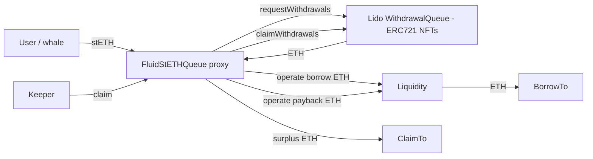

# stETH Queue Protocol — SPEC

## 1. Purpose

`FluidStETHQueue` is a single-purpose helper that lets whitelisted users (whales) **deleverage a stETH / ETH borrow position without swapping**: they deposit stETH as collateral to this contract, which (1) queues withdrawals at the Lido Withdrawal Queue for their stETH and (2) borrows ETH from the Fluid Liquidity layer against that queued position. When the Lido request is finalized, anyone can call `claim()` to withdraw the ETH from Lido, repay the Liquidity borrow with interest, and forward the surplus to the user's `claimTo`.

This is not a generic lending primitive. It is the only protocol in Fluid that interacts with Lido, and the only borrow-only user at Liquidity that never supplies anything.

## 2. Architecture

Contracts (co-located in `contracts/protocols/steth/`):

- [main.sol](./main.sol) — `FluidStETHQueue` logic contract: `StETHQueueCore` + `ReentrancyGuard` + `StETHQueueAdmin` + UUPS upgrade. Holds `queue`, `claim`, admin setters, and `liquidityCallback` (which always reverts — no ERC-20 borrow asset here).
- [proxy.sol](./proxy.sol) — `FluidStETHQueueProxy`, a stock OpenZeppelin `ERC1967Proxy`. UUPS upgrade authority is `_authorizeUpgrade` gated on `onlyOwner` in the logic.
- [variables.sol](./variables.sol) — storage layout: immutables (`LIQUIDITY`, `LIDO_WITHDRAWAL_QUEUE`, `STETH`, `LIQUIDITY_EXCHANGE_PRICES_SLOT`), OpenZeppelin `Initializable` + `OwnableUpgradeable` preamble (slots 0–100), then `claims`, `_status`, `maxLTV`, `allowListActive`, `_auths`, `_guardians`, `_allowed`.
- [structs.sol](./structs.sol) — `Claim { uint128 borrowAmountRaw, uint48 checkpoint, uint40 requestIdTo }`.
- [events.sol](./events.sol), [error.sol](./error.sol), [errorTypes.sol](./errorTypes.sol) — `StETHQueueError(code)` + `LogQueue` / `LogClaim` / admin events.
- [interfaces/iStETHQueue.sol](./interfaces/iStETHQueue.sol), [interfaces/external/iLidoWithdrawalQueue.sol](./interfaces/external/iLidoWithdrawalQueue.sol) — external interfaces.

## 3. External Interactions

- **Lido Withdrawal Queue** (mainnet `0x889edC…F9B1`):
  - `requestWithdrawals(amounts[], owner)` at `queue()` time — pulls stETH from this contract's balance and mints ERC-721 withdrawal NFTs to this contract.
  - `claimWithdrawal` / `claimWithdrawals` + `findCheckpointHints` at `claim()` time — burns NFTs and sends ETH to this contract.
  - Lido enforces `MIN_STETH_WITHDRAWAL_AMOUNT` (100 wei) and `MAX_STETH_WITHDRAWAL_AMOUNT` (1000 stETH) per request. `queue()` splits larger amounts across multiple requests and fixes up the last element upward if it is below the minimum.
  - Accepts `onERC721Received` only from the Lido queue; transfers from any other ERC-721 contract revert `StETH__InvalidERC721Transfer`.
- **Fluid Liquidity** (see [contracts/liquidity/SPEC.md](../../liquidity/SPEC.md)):
  - `queue()` calls `operate(NATIVE, 0, +borrow, 0, borrowTo, "")` to borrow ETH (borrow-only leg).
  - `claim()` calls `operate{value: repay}(NATIVE, 0, -repay, 0, 0, "")` to pay back with interest.
  - `initialize()` calls `operate(NATIVE, 0, +DUST_BORROW_AMOUNT=1e12, 0, this, "")` once to seed a dust borrow that absorbs BigMath rounding — by design it never gets repaid.
  - `liquidityCallback` is never used (native-token flows use `msg.value` directly). The contract still implements it to satisfy `IProtocol` and intentionally reverts `StETH__UnexpectedLiquidityCallback` if ever called.
  - Borrow exchange price is read via `LIQUIDITY.readFromStorage(LIQUIDITY_EXCHANGE_PRICES_SLOT)` piped through `LiquidityCalcs.calcExchangePrices` — the spec-correct "compute from packed word + elapsed time" pattern required by [contracts/liquidity/SPEC.md §11](../../liquidity/SPEC.md#11-invariants--safety-notes).
- **No DEX / oracle / vault interaction.** stETH is intentionally **not** listed at Fluid Liquidity as a generic borrow / supply token; it is confined to this queue flow.

## 4. Capabilities & Responsibilities

Does:

- Accept stETH as collateral, queue it at Lido, and borrow a correlated amount of ETH from Liquidity, enforcing a configurable `maxLTV` at entry.
- Track each open claim by `(claimTo, requestIdFrom) → Claim` so that multiple concurrent queued requests per user are supported.
- Settle positions permissionlessly: anyone can call `claim()` once Lido has finalized the request.
- Forward the ETH delivered by Lido: repay the accrued Liquidity debt (rounded **up by 1 wei** for safety) and send the rest to `claimTo`.
- Provide guardian-pause / owner-unpause, owner-gated auth management, and an optional `allowListActive` gate on `queue()` only.
- Support UUPS upgrade (owner authorized) as the recovery mechanism for edge cases.

Does not:

- Provide any slashing / bad-debt settlement hook. If Lido pays out less than the accrued Liquidity debt (severe slashing or negative rebase combined with high LTV + long delay), `claim()` reverts on `claimedAmount_ - repayAmount_` and the position is stuck until governance upgrades the implementation.
- Implement liquidations. There is no third-party closeout of an open position; a claim is only processable once the Lido NFT is final.
- Allow changing `claimTo` after `queue()`. Recovery is via UUPS upgrade only.
- Exit positions via swap or via the normal Fluid Vault / DEX surfaces.
- Re-enter Liquidity from `liquidityCallback` — this asset line is native-only.

## 5. Roles & Access Control

OpenZeppelin `OwnableUpgradeable` provides the `owner`.

- **Owner** (`owner()`):
  - Can `setAuth(addr, bool)`, `setGuardian(addr, bool)`, `setAllowListActive(bool)`, `unpause()`, authorize UUPS upgrades (`_authorizeUpgrade`).
  - Is Auth and Guardian by default (`isAuth(owner) == true`, `isGuardian(owner) == true`).
  - `renounceOwnership()` is explicitly disabled — always reverts `StETH__RenounceOwnershipUnsupported`.
- **Auths** (`_auths[addr] == 1`):
  - Can `setUserAllowed(addr, bool)` (manage the allowlist) and `setMaxLTV(uint16)`.
- **Guardians** (`_guardians[addr] == 1`):
  - Can `pause()` (flips `_status = REENTRANCY_ENTERED`, blocking `queue` and `claim`).
- **Allowed users** (`_allowed[addr] == 1`):
  - Relevant only when `allowListActive == true`: callers of `queue()` must be in this set.
  - `claim()` is unaffected by the allowlist even with `allowListActive == true` — settlement is always permissionless.
- **Permissionless**:
  - `claim(claimTo, requestIdFrom)` can be called by any address. The beneficiary is determined by the stored `claimTo` key, not by `msg.sender`, so there is no theft path. This is the intended keeper-friendly settlement model.

## 6. Storage Layout

Inherited preamble (OZ upgradeable): slot 0 `_initialized` / `_initializing`, slots 1–50 `ContextUpgradeable` gap, slot 51 `_owner`, slots 52–100 OwnableUpgradeable gap.

- **Slot 101** — `mapping(address claimTo => mapping(uint256 requestIdFrom => Claim)) claims`. Each `Claim` packs into 32 bytes: `uint128 borrowAmountRaw` (raw debt at Liquidity; keeps exchange-price headroom), `uint48 checkpoint` (Lido `getLastCheckpointIndex()` at queue time, used as a start hint for `findCheckpointHints` later), `uint40 requestIdTo` (last Lido request id; `requestIdFrom` is the mapping key).
- **Slot 102 (packed)** — `uint8 _status` (1 = not entered, 2 = entered / paused, 0 = pre-init), `uint16 maxLTV` (1e2 basis; `< 10000`), `bool allowListActive`. 28 bytes free.
- **Slot 103** — `_auths`.
- **Slot 104** — `_guardians`.
- **Slot 105** — `_allowed`.

Immutables (`variables.sol:Constants`): `IFluidLiquidity LIQUIDITY`, `ILidoWithdrawalQueue LIDO_WITHDRAWAL_QUEUE`, `IERC20 STETH`, `bytes32 LIQUIDITY_EXCHANGE_PRICES_SLOT` (pre-computed via `LiquiditySlotsLink.calculateMappingStorageSlot` for the native token).

Constants: `HUNDRED_PERCENT = 1e4`, `EXCHANGE_PRICES_PRECISION = 1e12`, `NATIVE_TOKEN_ADDRESS`, `DUST_BORROW_AMOUNT = 1e12`.

Note on `_status`: it is a shared slot used both by the reentrancy guard and by the pause flag. `isPaused()` returns `_status == REENTRANCY_ENTERED`, so external `view` callers observing the contract **during** an in-flight `queue` / `claim` tx will momentarily see `true`. For monitoring consumed at block granularity (indexers, dashboards, EOA-facing UIs) this is a non-issue; integrators that branch on `isPaused()` inside a `receive()` callback during another user's claim must be aware of this.

## 7. User / Public Methods

### `queue(ethBorrowAmount, stETHAmount, borrowTo, claimTo) → requestIdFrom`

- **Caller:** any address, or only allowlisted addresses when `allowListActive` is true.
- **Inputs:**
  - `ethBorrowAmount` — amount of ETH to borrow from Liquidity and forward to `borrowTo`. Must be `> 0` (else `InputAmountZero`).
  - `stETHAmount` — amount of stETH to pull from `msg.sender` and queue at Lido. Must be `> 0` and must satisfy `ethBorrowAmount × HUNDRED_PERCENT / stETHAmount <= maxLTV` (integer division; effective LTV can be up to one unit on the `1e4` scale above the configured cap — less than 0.01 percentage points — see §11).
  - `borrowTo` — recipient of the borrowed ETH. Must be non-zero.
  - `claimTo` — beneficiary of the eventual surplus at settlement and the storage key for the claim record. Must be non-zero. Cannot be changed later; if it turns out to be unable to receive ETH (reverting `receive()` / out-of-gas on `Address.sendValue`), settlement will revert until the contract is upgraded.
- **Edge-case semantics:**
  - Protocol paused (`_status == REENTRANCY_ENTERED` because of `pause()`) → reverts `Reentrancy` (uses the same flag).
  - `stETHAmount > MAX_STETH_WITHDRAWAL_AMOUNT` (1000 stETH) → amount is split into `ceil(stETHAmount / 1000)` requests; if the final remainder would be below `MIN_STETH_WITHDRAWAL_AMOUNT` (100 wei), the second-to-last element donates `MIN_STETH_WITHDRAWAL_AMOUNT` to the last so Lido accepts it.
  - `stETHAmount <= MIN_STETH_WITHDRAWAL_AMOUNT` → Lido itself will revert on `requestWithdrawals`.
  - stETH rebasing can credit 1–2 wei less than `stETHAmount` on `safeTransferFrom`; if the caller passes their exact `balanceOf` and the rounding lands on the bad side, Lido's `requestWithdrawals` reverts on insufficient balance, reverting the entire `queue()` atomically. No stETH is stuck in this contract and no ETH is borrowed. Off-by-a-few-wei inputs are the fix on the caller side.
  - `ethBorrowAmount × 1e12 / borrowExchangePrice == 0` (borrow so tiny it rounds to zero raw units at Liquidity) → reverts `BorrowAmountRawRoundingZero`.
  - Liquidity's own `operate` checks still apply (global pause / user pause / borrow limit / max utilization). Any of those revert the whole `queue()`.
- **Side effects:**
  - `SafeERC20.safeTransferFrom(STETH, msg.sender, this, stETHAmount)`.
  - `LIDO_WITHDRAWAL_QUEUE.requestWithdrawals(amounts_, this)` — mints withdrawal NFTs to this contract.
  - `LIQUIDITY.operate(NATIVE, 0, +ethBorrowAmount, 0, borrowTo, "")` — ETH paid to `borrowTo`.
  - Writes `claims[claimTo][requestIdFrom] = Claim(borrowAmountRaw, checkpoint, requestIdTo)` (overwriting any earlier claim at the same `(claimTo, requestIdFrom)` — impossible in practice because `requestIdFrom` is monotonic in Lido).
  - Emits `LogQueue(claimTo, requestIdFrom, ethBorrowAmount, stETHAmount, borrowTo)`.
- **Returns:** `requestIdFrom` — the first Lido request id of the (possibly multi-element) withdrawal batch. This value is required to identify the claim record later and is emitted in the event.
- **Reentrancy:** `nonReentrant`.

### `claim(claimTo, requestIdFrom) → (claimedAmount, repayAmount)`

- **Caller:** anyone. The beneficiary is the `claimTo` stored on the claim record; `msg.sender` identity does not affect where funds go. This is deliberate — keepers are allowed to settle other users' positions once Lido has finalized.
- **Inputs:**
  - `claimTo` — the beneficiary key used in `queue()`.
  - `requestIdFrom` — the first Lido request id returned by `queue()` (also emitted in `LogQueue`).
- **Edge-case semantics:**
  - `claims[claimTo][requestIdFrom].checkpoint == 0` (no matching claim or already settled) → reverts `NoClaimQueued`.
  - Lido request not yet finalized → Lido reverts inside `claimWithdrawal(s)`.
  - Slashing / negative rebase / long-tail interest that makes `repayAmount > claimedAmount` → the `claimedAmount_ - repayAmount_` underflow in `Address.sendValue` reverts the whole call. The claim stays open; recovery path is UUPS upgrade by owner to a custom-settled version (this is the explicit accepted recovery model).
  - `claimTo` contract reverts on `receive()` → the `Address.sendValue` reverts and the claim stays open (same UUPS recovery path). EOAs are always fine.
  - Native repay is rounded **up by 1 wei** (`(borrowAmountRaw × borrowExchangePrice) / 1e12 + 1`) to stay safely ahead of Liquidity's own round-up on the borrow side. Over many claims, this 1-wei bias is absorbed via the `DUST_BORROW_AMOUNT` seed (§2).
- **Side effects:**
  - `LIDO_WITHDRAWAL_QUEUE.claimWithdrawal(...)` or `claimWithdrawals(requestIds_, findCheckpointHints(requestIds_, stored checkpoint, latest checkpoint))`. Burns NFTs, ETH lands on this contract.
  - `LIQUIDITY.operate{value: repayAmount}(NATIVE, 0, -repayAmount, 0, 0, "")` — native payback to Liquidity.
  - `Address.sendValue(claimTo, claimedAmount - repayAmount)`.
  - `delete claims[claimTo][requestIdFrom]`.
  - Emits `LogClaim(claimTo, requestIdFrom, claimedAmount, repayAmount)`.
- **Returns:** total ETH claimed from Lido and total ETH repaid to Liquidity.
- **Reentrancy:** `nonReentrant`.

### `onERC721Received(operator, from, tokenId, data) → bytes4`

- Returns `this.onERC721Received.selector` iff `msg.sender == LIDO_WITHDRAWAL_QUEUE`; any other ERC-721 transfer reverts `InvalidERC721Transfer`. This is the contract's only way to legitimately hold an NFT.

### `receive() external payable`

- Accepts plain ETH. Used by Lido (`claimWithdrawal(s)` pays out raw ETH) and by any direct transfer. The contract's ETH balance is sourced exclusively from Lido payouts during `claim()` and is forwarded onward within the same call.

### `liquidityCallback(token, amount, data) external pure`

- Always reverts `UnexpectedLiquidityCallback`. This protocol never borrows an ERC-20 asset and so never has a legitimate reason to receive a pull-funds callback.

### Views

- `isAuth(addr) → bool` — owner or `_auths[addr] == 1`.
- `isGuardian(addr) → bool` — owner or `_guardians[addr] == 1`.
- `isUserAllowed(addr) → bool` — `_allowed[addr] == 1`.
- `isPaused() → bool` — `_status == REENTRANCY_ENTERED` (see §6 note about mid-tx flicker).
- `maxLTV()`, `allowListActive()`, `claims(claimTo, requestIdFrom)` — generated by `public` storage.
- `constantsView() → (LIQUIDITY, LIDO_WITHDRAWAL_QUEUE, STETH)`.

## 8. Admin / Governance Methods

### Owner-only

- `initialize(owner)` — one-shot (`initializer` from OZ). Transfers ownership, `SafeERC20.safeApprove(STETH, LIDO_WITHDRAWAL_QUEUE, type(uint256).max)`, sets `_status = REENTRANCY_NOT_ENTERED`, sets `allowListActive = true` (deployed in a protected state by default), and seeds `DUST_BORROW_AMOUNT = 1e12` wei of native debt against Liquidity so subsequent claims never hit rounding-induced reverts.
- `setAuth(auth, allowed)` — add / remove an auth. Rejects `address(0)`. Emits `LogSetAuth`.
- `setGuardian(guardian, allowed)` — add / remove a guardian. Rejects `address(0)`. Emits `LogSetGuardian`.
- `setAllowListActive(status)` — toggle the `queue()` gate. Emits `LogSetAllowListActive`.
- `unpause()` — clears the pause flag (`_status = REENTRANCY_NOT_ENTERED`). Emits `LogUnpaused`. Asymmetric with `pause()` by design — pause is fast (guardian), unpause is deliberate (owner).
- `_authorizeUpgrade(newImpl)` — UUPS hook, bodyless but gated on `onlyOwner`. All recovery paths (slashing-induced bad debt, `claimTo` unable to receive ETH, stuck Lido requests) are expected to be implemented via upgrade rather than extra admin-rescue methods.
- `renounceOwnership()` — always reverts.

### Auth-only

- `setUserAllowed(user, allowed)` — toggle `_allowed[user]`. Only matters while `allowListActive == true`. Rejects `address(0)`. Emits `LogSetAllowed`.
- `setMaxLTV(maxLTV)` — update the entry-LTV cap. `0` → reverts `MaxLTVZero`; `>= 10000` (100%) → reverts `MaxLTVAboveCap`; the effective range is `(0, 9999]`. Operator guidance: higher `maxLTV` (e.g. 99%) raises sensitivity to Lido slashing and accrued Liquidity interest; governance policy — not an on-chain invariant — should set it conservatively relative to expected claim-delay and rate.

### Guardian-only

- `pause()` — sets `_status = REENTRANCY_ENTERED`, blocking all `queue` / `claim` calls (they hit the reentrancy check). Emits `LogPaused`.

## 9. Events

See [events.sol](./events.sol):

- `LogQueue(claimTo, requestIdFrom, borrowETHAmount, queueStETHAmount, borrowTo)`
- `LogClaim(claimTo, requestIdFrom, claimedAmount, repayAmount)`
- `LogSetMaxLTV(maxLTV)`, `LogSetAuth(auth, allowed)`, `LogSetGuardian(guardian, allowed)`, `LogSetAllowed(user, allowed)`, `LogSetAllowListActive(active)`, `LogPaused()`, `LogUnpaused()`.

OpenZeppelin `OwnershipTransferred` and the UUPS `Upgraded` events also fire from inherited code.

## 10. Errors

Defined in [errorTypes.sol](./errorTypes.sol), wrapped by `StETHQueueError(uint256)` (40001–40012):

- `MaxLTVZero (40001)`, `MaxLTV (40002)` — LTV cap configuration / entry-check failures.
- `InvalidERC721Transfer (40003)` — ERC-721 received from non-Lido source.
- `InputAmountZero (40004)` — `ethBorrowAmount` or `stETHAmount` is zero.
- `UnexpectedLiquidityCallback (40005)` — `liquidityCallback` was invoked.
- `NoClaimQueued (40006)` — `claims[claimTo][requestIdFrom]` not set.
- `Unauthorized (40007)` — caller failed auth / guardian / allowlist check.
- `BorrowAmountRawRoundingZero (40008)` — borrow too small to survive `×1e12 / borrowExchangePrice`.
- `AddressZero (40009)` — zero address input to a `validAddress` guard.
- `Reentrancy (40010)` — `_status != REENTRANCY_NOT_ENTERED` (also hit during pause).
- `MaxLTVAboveCap (40011)` — `maxLTV >= 10000`.
- `RenounceOwnershipUnsupported (40012)` — `renounceOwnership` called.

## 11. Invariants & Safety Notes

- **Permissioned entry, permissionless exit.** `queue()` respects `allowListActive`; `claim()` is always open so any keeper can settle a finalized request. `claimTo` determines the beneficiary; `msg.sender` identity at settlement is irrelevant.
- **`maxLTV` is a single-point entry check, not a live invariant.** Accrued Liquidity interest + potential Lido slashing / negative rebase can push effective LTV above the configured `maxLTV` by the time a request is finalized. The check uses integer floor division, so the true entry LTV can sit one `1e4`-unit (< 0.01 percentage points) above `maxLTV / HUNDRED_PERCENT` — not a compounding effect, just one step of slack.
- **No on-chain bad-debt resolution.** If Lido's ETH payout is insufficient to cover the Liquidity repay (slashing, negative rebase, very high LTV + long delay + rate), `claim()` reverts on the underflow in `Address.sendValue(claimTo, claimedAmount - repayAmount)`. The position remains open; the designed recovery is a UUPS upgrade that introduces a bespoke settle path. The owner is expected to handle this operationally.
- **`claimTo` is immutable for the life of the claim.** If it becomes unable to receive ETH (e.g. a contract whose owner changed), recovery is again via UUPS upgrade. No per-user escape hatch exists, as a deliberate minimal-admin-surface choice.
- **`DUST_BORROW_AMOUNT = 1e12` is by design never repaid.** Seeded at `initialize()` to absorb BigMath / `mulDivUp`-vs-floor rounding divergence between this contract (floors `borrowAmountRaw` at `queue()`) and Liquidity (rounds borrow up via `mulDivUp`). Interest accrues on this dust forever; it is negligible economically.
- **Exchange-price reads use `LiquidityCalcs.calcExchangePrices` on the packed storage word** (via `readFromStorage(LIQUIDITY_EXCHANGE_PRICES_SLOT)`). This is the correct integration pattern required by [contracts/liquidity/SPEC.md §11](../../liquidity/SPEC.md#11-invariants--safety-notes); naïve `SLOAD` would lag within a day.
- **`_status` is shared between pause flag and reentrancy guard.** `queue` and `claim` both use `nonReentrant`, so there is no practical interaction between pause and reentrancy. `isPaused()` flickers `true` during any in-flight call; indexers should sample at block granularity.
- **Borrow-raw / cast widths.** `uint128 borrowAmountRaw`, `uint48 checkpoint`, `uint40 requestIdTo` are sized for Ethereum / Lido-scale throughput and not expected to be exhausted; there is no `SafeCast` wrapper. Liquidity's own `operate` validation is the authoritative gate on absolute borrow magnitude.
- **Borrow-raw is rounded down at queue and up at claim.** Residual 1-wei divergences vs Liquidity accumulate into the dust bucket. Not a live defect at realistic usage.
- **Lido 1000 stETH split + 100 wei floor handled explicitly.** `queue()` respects Lido's min / max per request and promotes the tail element when it would fall below the minimum.
- **UUPS upgrade is the universal rescue mechanism.** Slashing settlement, stuck `claimTo`, foreign stray tokens / NFTs, and any other unforeseen recovery case all go through owner-authorized upgrade. No dedicated `rescueFunds` / `rescueERC721` / `writeOffBadDebt` surfaces exist by design.

## 12. Trust Model & Accepted Trade-offs

- **Lido is trusted for liveness and correctness.** A compromised or indefinitely stuck Lido Withdrawal Queue blocks all `claim()` calls and freezes open positions until resolution. This is an accepted external dependency.
- **Liquidity is trusted to gate borrow magnitude.** `operate` validation (withdraw / borrow limits, class pause, max utilization, overflow caps) is the authoritative limit on how much ETH this protocol can borrow; stETH queue does not replicate those checks.
- **Owner is trusted for recovery.** Slashing settlement, `claimTo` recovery, and stray-asset rescue all route through UUPS upgrade. A compromised owner can redirect these flows; this is the standard trust envelope for UUPS protocols.
- **Auths are trusted to configure risk.** `setMaxLTV` and `setUserAllowed` are delegated to auths and can be invoked without owner consent once granted. Owner should only grant auth to reviewed multisigs / handlers.
- **Guardians are trusted to pause, not to act.** Pause is fast (guardian), unpause is deliberate (owner). The asymmetry is intentional — the same pattern used elsewhere in Fluid.
- **Permissionless `claim()` is intentional.** Keeper-style forced closure of finalized positions is the desired behavior. `claimTo_` is already the beneficiary key; the settler cannot redirect funds. Users who want to time their settlement should monitor and call it themselves; anyone else can still settle once the Lido NFT is final.
- **stETH is intentionally not listed as a generic Liquidity asset.** It is only handled via this queue. Accidentally adding stETH to Liquidity's generic listing / rehypothecation helper set would be an operational mistake; the design intent is that rebasing stETH stays off the generic path.
- **Narrow storage widths are accepted.** `uint128 / uint48 / uint40` for claim fields are not `SafeCast`-wrapped; widths are sized for Ethereum-scale Lido throughput and realistic time horizons.
- **`allowListActive` on entry only.** Settling existing positions is always permissionless even under a tightened entry allowlist — existing obligations can always be closed.
- **Minimal admin surface, upgrade-first recovery.** No `rescueFunds`, no `updateClaimTo`, no on-chain slashing writeoff. The team accepts that edge cases requiring reconciliation go through governance upgrade.
