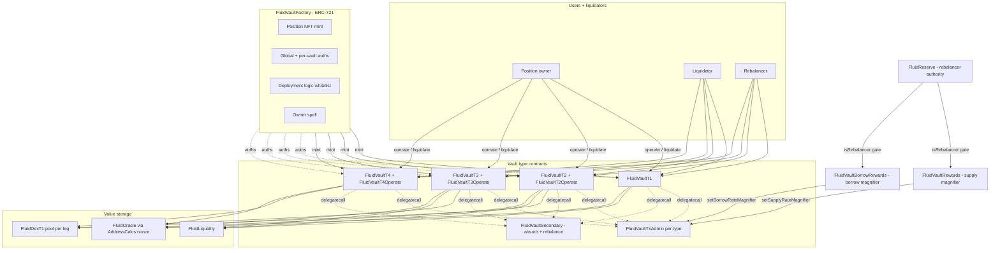

# Vault — SPEC (top-level)

> This spec covers the **cross-cutting Vault protocol surface**: shared errors, interfaces, the two rate-magnifier helper contracts (`FluidVaultRewards` for supply-side, `FluidVaultBorrowRewards` for borrow-side), and an overview of the vault type matrix. The per-type runtime and shared base are documented separately:
>
> - [contracts/protocols/vault/vaultTypesCommon/SPEC.md](./vaultTypesCommon/SPEC.md) — base storage, tick / branch engine, operate / liquidate / absorb / rebalance machinery shared by T2/T3/T4 (and conceptually mirrored by T1).
> - [contracts/protocols/vault/vaultT1/SPEC.md](./vaultT1/SPEC.md) — ERC-20 collateral + ERC-20 debt.
> - [contracts/protocols/vault/vaultT2/SPEC.md](./vaultT2/SPEC.md) — DEX smart collateral + ERC-20 debt.
> - [contracts/protocols/vault/vaultT3/SPEC.md](./vaultT3/SPEC.md) — ERC-20 collateral + DEX smart debt.
> - [contracts/protocols/vault/vaultT4/SPEC.md](./vaultT4/SPEC.md) — DEX smart collateral + DEX smart debt.
> - [contracts/protocols/vault/factory/SPEC.md](./factory/SPEC.md) — factory, position NFT, owner wrapper.

## 1. Purpose

The Fluid Vault protocol is a **collateralized borrow system** built on top of [Fluid Liquidity](../../liquidity/SPEC.md). A **position** is an ERC-721 NFT minted by the vault factory; while the position is open, the user has collateral deposited (into Liquidity and/or a [DEX](../dex/SPEC.md) pool on the "smart" side) and debt borrowed (from Liquidity and/or a DEX). The vault runs the risk engine: it enforces collateral factor, liquidation threshold, liquidation max limit, withdrawal gap, borrow fee, and runs a concentrated **tick / branch liquidation engine** (Uniswap-v3-style ticks, with branches that record liquidated ranges so surviving positions pay proportional debt factors).

Four vault types exist, all sharing the same tick / branch engine and per-NFT packed `positionData`:

| Type | Collateral | Debt  | Notes |
| ---- | ---------- | ----- | ----- |
| T1   | ERC-20     | ERC-20 | Simplest. Monolithic contract. Money-market-style. |
| T2   | DEX smart  | ERC-20 | Two-token smart collateral (via [DEX](../dex/SPEC.md)). Single-token ERC-20 debt. |
| T3   | ERC-20     | DEX smart | Single-token ERC-20 collateral. Two-token smart debt. |
| T4   | DEX smart  | DEX smart | Both legs DEX. Four token flows. |

Economically, the Vault protocol sits between users (who open positions) and Liquidity + DEX (which hold the actual tokens). It does not issue an ERC-20 share token — users receive an **NFT per position**, and the [SmartLending wrapper](../dex/smartLending/SPEC.md) (separate layer) is the closest thing to a tokenized share on vault-adjacent positions.

See [docs/docs.md](../../../docs/docs.md) for the general Fluid overview.

## 2. Architecture

Key top-level files under `contracts/protocols/vault/`:

- `error.sol` — `FluidVaultError(uint256)` and simulation revert `FluidLiquidateResult(...)`.
- `errorTypes.sol` — numeric error code groups: `30xxx` vault factory, `31xxx` vault core, `32xxx` factory ERC-721, `33xxx` vault admin, `34xxx` vault rewards, `35xxx` vault DEX types, `36xxx` vault borrow rewards, `37xxx` vault factory owner wrapper.
- `interfaces/iVault.sol` — base `IFluidVault` (constants view, `rebalance(int,int,int,int)`, `simulateLiquidate`, `readFromStorage`).
- `interfaces/iVaultT1.sol` — T1 surface (`operate`, `liquidate`, `absorb`, parameterless `rebalance`).
- `interfaces/iVaultT2.sol` / `iVaultT3.sol` / `iVaultT4.sol` — extend `IFluidVault` with per-type `operate` / `operatePerfect` / `liquidate` / `liquidatePerfect` signatures.
- `interfaces/iVaultFactory.sol` — `IERC721Enumerable` + `mint`, auths, `getVaultAddress`, `totalVaults`, `readFromStorage`.
- `interfaces/iLiquidityDexCommon.sol` — combined `IFluidLiquidityLogic + IFluidDexT1` interface used where vaults need a unified call surface against both Liquidity and DEX.
- `rewards/` — `FluidVaultRewards` supply-side rate magnifier controller.
- `borrowRewards/` — `FluidVaultBorrowRewards` borrow-side rate magnifier controller.
- `README.md` — historical deployment / wiring notes.
- `vaultTypesCommon/`, `vaultT1/`, `vaultT2/`, `vaultT3/`, `vaultT4/`, `factory/` — per-layer implementations (see their own SPECs).
- `vaultT1_not_for_prod/` — legacy T1 port of the shared base, present for regression tests only; not deployed.

All vault type contracts inherit [`StorageRead`](../../libraries/SPEC.md) so `readFromStorage(slot)` is available on every vault.

## 3. External Interactions

- **Fluid Liquidity (`LIQUIDITY`)** — every vault resolves token balances through Liquidity at some point: T1 uses it on both sides, T2 on the debt side, T3 on the collateral side, T4 only for ETH-validation / callback infrastructure. See [contracts/liquidity/SPEC.md](../../liquidity/SPEC.md).
- **DEX (`SUPPLY` / `BORROW`)** — `ILiquidityDexCommon`-typed addresses on each vault point to either Liquidity (for normal sides) or a [FluidDexT1 pool](../dex/poolT1/SPEC.md) (for smart sides). Smart-side ops call `deposit / withdraw / depositPerfect / withdrawPerfect / withdrawPerfectInOneToken / borrow / payback / borrowPerfect / paybackPerfect` directly on the DEX pool.
- **Oracle (`IFluidOracle`)** — resolved via `AddressCalcs.addressCalc(DEPLOYER_CONTRACT, oracleNonce)` (T2/T3/T4, vaultTypesCommon) or stored directly as an address (T1). Used in `getExchangeRateOperate` (for collateral-factor checks on risky ops) and `getExchangeRateLiquidate` (for liquidation ratio math).
- **Factory (`VAULT_FACTORY`)** — read-only auth check (`isGlobalAuth`, `isVaultAuth`) during every vault `fallback` call; write call to `VAULT_FACTORY.mint(vaultId, user)` when a new position is opened.
- **Rewards + BorrowRewards** — each is an independently deployed helper that reads vault / Liquidity state and writes only `vault.updateSupplyRateMagnifier(new)` / `vault.updateBorrowRateMagnifier(new)`. Access to `rebalance()` on each is gated by [FluidReserve](../../reserve/SPEC.md) via `isRebalancer(msg.sender)`.
- **Callers**
  - **Users** — `operate` / `operatePerfect`.
  - **Liquidators** — `liquidate` / `liquidatePerfect`.
  - **Rebalancer (role)** — `rebalance(...)`.
  - **Factory-authorized admins** — fallback into the admin module.
  - **Reserve-authorized rebalancers** — `FluidVaultRewards.rebalance()` / `FluidVaultBorrowRewards.rebalance()` to roll rate magnifiers.

## 4. Capabilities & Responsibilities

Vault does:

- **Position management via NFT.** Opening a position mints an NFT; closing it leaves the NFT (with zero collateral / zero debt) on the user. Each NFT belongs to a specific vault + vault id; `FluidVaultFactory` is enumerable per owner.
- **Per-type `operate` surface.** Users move collateral and debt in a single call (and for smart types, a single call covers two-token pairs + shares simultaneously). Both proportional and non-proportional paths are available on T2/T3/T4 via `operatePerfect`.
- **Concentrated-tick liquidation engine.** Positions are bucketed by collateralization into ticks (TickMath); the liquidation engine walks the top tick downward, merging tick data into branches when a tick is partially liquidated, so surviving positions pay a share of the liquidation slippage as debt factors — not socialized to the whole vault.
- **Absorb** bad debt when the tick goes above the liquidation max-limit ratio — governance-timed, no user on-chain incentive.
- **Rebalance** reconciles the vault's internal view of Liquidity / DEX balances to the actual on-chain state, paying / receiving small token amounts to the rebalancer to cover interest drift.
- **Supply + borrow rate magnifiers.** `vaultVariables2` packs a supply-side magnifier and a borrow-side magnifier; vaults apply these atop Liquidity's own rate to produce the effective vault rate. The two helper contracts (`FluidVaultRewards`, `FluidVaultBorrowRewards`) are the canonical updaters.
- **Permissionless payback / deposit.** A non-owner may deposit collateral or pay back debt to any NFT (safe-direction ops); only the owner can withdraw or borrow.
- **Simulation via revert.** `simulateLiquidate` (common base) and `liquidate(..., to_=ADDRESS_DEAD, ...)` (T1 inline) intentionally revert with `FluidLiquidateResult(amount)` so integrators can quote without paying.

Vault does **not**:

- Manage user-facing rewards claims. Rewards are expressed as **rate magnifiers** that compound into `exchangePrice`; recipients effectively receive extra supply (or pay less borrow) automatically. There is no external rewards token distribution for vault-side rewards.
- Tokenize positions (other than the NFT). For smart collateral in particular, the separate [SmartLending](../dex/smartLending/SPEC.md) layer offers an ERC-20 wrapper but only for DEX smart-col positions, not vault positions.
- Provide atomic composites like "borrow and transfer to EOA"; the `to_` parameter on `operate` / `liquidate` handles the recipient of outputs.

## 5. Roles & Access Control

- **Position owner (NFT holder)** — calls `operate` / `operatePerfect` on risky-direction moves (withdraw collateral, borrow more debt). Also the sole recipient of `fetchLatestPosition` reads for that `nftId`. Any address with the NFT qualifies; ERC-721 approvals do **not** grant `operate` rights (this is intentional; see §12).
- **Anyone** — can call `liquidate` / `liquidatePerfect` and the safe-direction ops (`deposit` / `payback`) on any NFT.
- **Liquidators** — a specialization of "anyone"; profitability is their incentive.
- **Rebalancer** (set via `updateRebalancer`) — only caller of the vault's `rebalance(...)` method.
- **Factory global auths / per-vault auths** — can call admin methods on each vault through the vault's `fallback` → `ADMIN_IMPLEMENTATION` delegatecall path. See [contracts/protocols/vault/factory/SPEC.md](./factory/SPEC.md).
- **Factory owner** — typically [`FluidVaultFactoryOwner`](./factory/SPEC.md#6-vaultfactoryowner--role-and-methods) (the wrapper). Implicit super-auth for every vault via the factory's auth checks. Can `spell` the factory.
- **Reserve rebalancer** — any `addr` with `RESERVE_CONTRACT.isRebalancer(addr) == true` can call `rebalance()` on the rewards / borrowRewards contracts to roll the rate magnifier period.
- **Initiator** — single constructor-assigned address per rewards contract. Only caller of `start()` / `startAt()`.
- **Rewards governance** — separate address per rewards contract. Only caller of `queueNextRewards()`.

## 6. Storage Layout

Per-vault storage is detailed in [vaultTypesCommon/SPEC §6](./vaultTypesCommon/SPEC.md#6-storage-layout) and [vaultT1/SPEC §6](./vaultT1/SPEC.md#6-storage-layout). At the top level, important cross-module words:

- `vaultVariables` — reentrancy bit, current top tick, active branch, total branch id, total supply / borrow raw (BigNumber), total positions (NFT count).
- `vaultVariables2` — supply-rate magnifier (bits 0–15 on T2/T4: signed rate; on T1/T3: magnifier), borrow-rate magnifier (bits 16–31 same idea), collateral factor, liquidation threshold, liquidation max limit, withdraw gap, liquidation penalty, borrow fee, oracle nonce (T2/T3/T4), last-update timestamp (T2/T3/T4).
- `rates` — four 64-bit words (`1e12` precision): Liquidity supply, Liquidity borrow, vault supply, vault borrow.
- `positionData[nftId]` — position type (supply vs borrow), tick sign/abs/id, collateral raw, dust debt raw.
- `tickHasDebt`, `tickData`, `tickId`, `branchData` — the tick / branch graph.
- `absorbedLiquidity`, `absorbedDustDebt`, `rebalancer`, `dexFromAddress` — auxiliary state.

See [SPEC-dexCalcs](../../libraries/SPEC-dexCalcs.md), [SPEC-liquidityCalcs](../../libraries/SPEC-liquidityCalcs.md), and [SPEC-tickMath](../../libraries/SPEC-tickMath.md) for the math these words feed into.

## 7. User / Public Methods

At this top level, the public surface is the **per-type `operate` / `liquidate`** plus the rewards helpers. Per-type details are in the type-specific SPECs; a cross-type summary:

| Method / surface | T1 | T2 | T3 | T4 |
| --- | --- | --- | --- | --- |
| `operate(nftId, newCol, newDebt, to)` | ✔ | | | |
| `operate(nftId, newColT0, newColT1, colSharesMinMax, newDebt, to)` | | ✔ | | |
| `operate(nftId, newCol, newDebtT0, newDebtT1, debtSharesMinMax, to)` | | | ✔ | |
| `operate(nftId, newColT0, newColT1, colSharesMinMax, newDebtT0, newDebtT1, debtSharesMinMax, to)` | | | | ✔ |
| `operatePerfect(...)` (share-targeted) | — | ✔ | ✔ | ✔ |
| `liquidate(...)` | ✔ | ✔ | ✔ | ✔ |
| `liquidatePerfect(...)` | — | ✔ | ✔ | ✔ |
| `absorb()` | ✔ | — | — | — |
| `rebalance()` (no args) | ✔ | — | — | — |
| `rebalance(int colT0, int colT1, int debtT0, int debtT1)` | — | ✔ | ✔ | ✔ |
| `simulateLiquidate(...)` | — | ✔ | ✔ | ✔ |
| `liquidityCallback(token, amount, data)` | ✔ | ✔ | ✔ | ✔ |
| `dexCallback(token, amount)` | — | ✔ | ✔ | ✔ |
| `readFromStorage(slot)` | ✔ | ✔ | ✔ | ✔ |

Edge-case sentinels repeated across types:

- `nftId_ == 0` → mint new NFT.
- `newCol_ == type(int).min` → withdraw max available (T1).
- `newDebt_ == type(int).min` → pay back max (T1).
- `colSharesMinMax_ == type(int256).min` / `max` → bound exact shares on T2/T4.
- `debtSharesMinMax_` / `perfectDebtShares_` → same pattern on T3/T4.
- `to_ == address(0)` → recipient is `msg.sender`.
- `to_ == ADDRESS_DEAD (0x…dEaD)` → simulation; reverts with `FluidLiquidateResult(amount)` carrying computed values instead of settling.

## 8. Admin / Governance Methods

Per-type admin modules share the common [vaultTypesCommon admin module](./vaultTypesCommon/SPEC.md#8-admin--governance-methods):

- `updateCollateralFactor`, `updateLiquidationThreshold`, `updateLiquidationMaxLimit`, `updateWithdrawGap`, `updateLiquidationPenalty`, `updateBorrowFee`.
- `updateCoreSettings` — bulk update of several of the above + rates.
- `updateOracle(nonce)` (T2/T3/T4) or `updateOracle(address)` (T1).
- `updateRebalancer(addr)`.
- `rescueFunds(token)` — sweep stuck non-accounting balance.
- `absorbDustDebt(nftIds[])` — convert dust-left liquidated positions to supply-only NFTs.

Additionally per-type rate magnifier setters:

- T1: `updateSupplyRateMagnifier`, `updateBorrowRateMagnifier`.
- T2: `updateSupplyRate` (signed int encoded), `updateBorrowRateMagnifier`.
- T3: `updateSupplyRateMagnifier`, `updateBorrowRate` (signed int encoded).
- T4: `updateSupplyRate`, `updateBorrowRate` (both signed).

And the factory-owner-wrapper commanders: `setVaultIdAllowlisted`, `setTransferDustPosAuth`, `transferPosition`, `transferDustPosition`, `spellApprove` (via factory `spell`). See [factory SPEC](./factory/SPEC.md).

### FluidVaultRewards / FluidVaultBorrowRewards — admin-ish surface

These two contracts are **not** vault admin themselves; they call the vault's `updateSupplyRateMagnifier` / `updateBorrowRateMagnifier` once they have been added as a vault auth by governance. Their own admin surface:

- `start()` / `startAt(uint40 startAt_)` — `onlyInitiator`. Activates the first period at `block.timestamp` (or at a future timestamp, bounded to `+2 weeks`).
- `queueNextRewards(uint256 nextRewardsAmount_, uint256 nextDuration_)` — `onlyGovernance`. Queues a follow-on period; picked up automatically by the next `rebalance()` after the current period ends.
- `rebalance()` — `onlyRebalancer` (Reserve-authenticated). Reads live Liquidity / vault state, computes the new magnifier as `rewardsAmountPerYear / TVL` relative to the Liquidity supply / borrow rate, transitions periods if the current one has ended, and calls the vault's magnifier setter. Reverts if the computed magnifier equals the current one (unless the period has ended, in which case the setter is still invoked to capture the final state).
- Views: `currentMagnifier()` / `currentBorrowMagnifier()` read vault slot 1 directly; `vaultTVL()` / `vaultBorrowTVL()` reads slot 0 bits + Liquidity exchange price; `getSupplyRate()` / `getBorrowRate()` derive Liquidity rates from its storage words; `calculateMagnifier()` / `calculateBorrowMagnifier()` return the next magnifier without applying it.
- Events: `LogUpdateMagnifier(old, new)`, `LogRewardsStarted(startTime)`, `LogNextRewardsQueued(amount, duration)`.

`FluidVaultBorrowRewards` is structurally identical to `FluidVaultRewards`; the difference is which side's rate it reads (borrow vs supply) and which setter it calls (`updateBorrowRateMagnifier` vs `updateSupplyRateMagnifier`). Note: its NatSpec has a legacy "rewards given to lenders" comment that refers to the earlier supply-side variant — the code itself handles the borrow side.

## 9. Events

Cross-type core events (`vaultTypesCommon/coreModule/events.sol`):

- `LogOperate(user, nftId, colAmt, debtAmt, to)`
- `LogUpdateExchangePrice(supplyExPrice, borrowExPrice)`
- `LogLiquidate(liquidator, debtAmt, colAmt, to)`
- `LogAbsorb(colAbsorbed, debtAbsorbed)`
- `LogRebalance(supplyDelta, borrowDelta)`

Admin events (`vaultTypesCommon/adminModule/events.sol`): one per admin setter plus `LogRescueFunds`, `LogAbsorbDustDebt`.

Rewards contracts (`rewards/events.sol`, `borrowRewards/events.sol`): `LogUpdateMagnifier`, `LogRewardsStarted`, `LogNextRewardsQueued`.

Factory + owner wrapper events live in [factory/SPEC.md](./factory/SPEC.md#8-events-and-errors).

## 10. Errors

All numeric codes in `errorTypes.sol`. Code ranges:

- `30001–30007` — Vault factory (invalid op, unauthorized, same token, params, vault address, delegate-call only).
- `31001–31038` — Vault core (reentrancy, amounts, msg.value, owner checks, ticks, CF, slippage, rebalancer, NFT ownership, token init, auth, withdrawal / debt limits, Liquidity callback, delegate-call, transfers, exchange price, oracle, DEX callback, rebalance bounds).
- `32001–32005` — ERC-721 (params, unauthorized, operation, recipient, index).
- `33001–33009` — Vault admin (limits, delegate-call, dust NFT / debt collection).
- `34001–34010` — Vault rewards (unauthorized, zero address, params, magnifier unchanged, initiator, governance, start / end state).
- `35001–35002` — Vault DEX-type specifics (invalid operate amount, shares-paid-above-available on liquidation).
- `36001–36010` — Vault borrow rewards (parallel to 34xxx).
- `37001–37008` — Vault factory owner wrapper (unauthorized, factory-context required, allowlist, debt threshold, position safety, zero address, invalid vault / position).

Simulation: `FluidLiquidateResult(uint256 debtAmount, uint256 collateralAmount)` — intentional revert, not a failure.

## 11. Invariants & Safety Notes

- **Operate access is owner-only for risky legs.** Withdrawing collateral or increasing debt on a position requires `ownerOf(nftId) == msg.sender`. ERC-721 approvals are not checked (intentional).
- **Oracle ratio cap at 1e45.** Positions with oracle outputs outside sane bounds clamp to 1e45 to keep math stable.
- **NFT id space is shared across vault types.** Factory NFTs are monotonic global ids; to identify a position you need `(vault address, nftId)` or `(vaultId, nftId)`. Tooling that tracks positions by bare NFT id must join with the factory's per-token `vaultId` packed field.
- **Position shares normalized to 1e18 precision** on smart vault types; dust detection uses that same normalization.
- **Bad-debt cleanup is governance-timed.** `absorb` + `absorbDustDebt` require keeper / governance attention; there is no live user-facing incentive to absorb bad debt.
- **Simulation revert is the quoting mechanism.** `simulateLiquidate` reverts with `FluidLiquidateResult`; integrators must catch and decode.
- **BigMath** libraries used by vault production paths are the safe `BigMathMinified` / `BigMathVault`. `BigMathUnsafe` is excluded.
- **Vault production deployments run on Liquidity class 0.** Class 1 is reserved for specific integrations.
- **DEX spot is canonical at liquidation settlement.** For T3/T4 the share → token conversion uses live DEX reserves; oracle is used only in the ratio-space math.
- **Shared NFT ids across vault types** — positions from different vaults map to different ids; but integrators must always pair `(vault, id)` when recording positions, not rely on ids alone.

## 12. Trust Model & Accepted Trade-offs

- **Factory owner is the root of trust.** It can `spell` the factory (arbitrary delegatecall in factory storage), toggle auth sets, and add / remove deployment logic contracts. Compromise fully compromises the vault protocol. This is accepted and is the standard Fluid pattern.
- **Deployment logic contracts are trusted modules.** They run under the factory's delegatecall, so a malicious logic contract can destroy factory storage; only owner-whitelisted logics are allowed. See the CREATE-nonce caveat in [factory/SPEC.md](./factory/SPEC.md).
- **Oracle implementations are trusted.** Vaults do not cross-check multiple oracle sources; governance is responsible for configuring correct oracle nonces / addresses with sensible clamps.
- **Rebalancer is trusted** — single address, typically a governance keeper. Rebalance drift tokens flow to / from that address; no cap enforced on-chain.
- **Rewards contracts are not the source of truth.** They compute magnifiers from live state; if their `rewardsAmount` / `duration` are mis-set they may push magnifiers in undesirable directions. `start` / `queueNextRewards` are split between initiator (start-only) and governance (queue) precisely to separate concerns (see [`config/vaultFeeRewardsAuth/SPEC.md`](../../config/vaultFeeRewardsAuth/SPEC.md) for the parallel multi-auth pattern). Residual magnifiers after the final period remain at the last value until a new setter call runs.
- **`FluidVaultFactoryOwner` is a scoped governance wrapper.** It channels admin through a multi-role set (governance, team multisig, dust auths) with pre-configured NFT-movement allowlists and fixed debt thresholds. The thresholds are raw, not decimal-normalized — acceptable for the current deployment scope.
- **Permissionless payback / deposit is intentional.** A third party can reduce an NFT's debt or add collateral without owning the NFT; this enables outside protection in liquidation UX. It cannot produce a "griefing" state because both moves make the position safer.
- **Simulation via revert is the quoting pattern.** Off-chain / integration code must expect revert data as the success signal for `simulateLiquidate` and T1's dead-address `liquidate`.
- **T3 / T4 rely on honest DEX listing.** The liquidation settlement path uses live DEX state; misbehaving DEX listings can impact liquidation economics. Governance mitigates by whitelisting pools via the vault deployment logics and the [DEX factory auth set](../dex/SPEC.md).

See also:

- [contracts/liquidity/SPEC.md](../../liquidity/SPEC.md) — where vault collateral / debt ultimately live.
- [contracts/protocols/dex/poolT1/SPEC.md](../dex/poolT1/SPEC.md) — smart-side counterparty for T2/T3/T4.
- [contracts/protocols/dex/smartLending/SPEC.md](../dex/smartLending/SPEC.md) — tokenized share wrapper for DEX smart-col positions (not vault positions).
- [contracts/libraries/SPEC-tickMath.md](../../libraries/SPEC-tickMath.md) — tick math library used by the liquidation engine.
- [contracts/libraries/SPEC-liquidityCalcs.md](../../libraries/SPEC-liquidityCalcs.md) — per-token interest accrual for Liquidity-side reads.
- [contracts/libraries/SPEC-dexCalcs.md](../../libraries/SPEC-dexCalcs.md) — per-user limit math used on vault's own Liquidity slot.
- [contracts/reserve/SPEC.md](../../reserve/SPEC.md) — rebalancer authority for rewards contracts.
- [contracts/config/SPEC.md](../../config/SPEC.md) — governance auths that wire new vaults into Liquidity and manage per-vault knobs.
