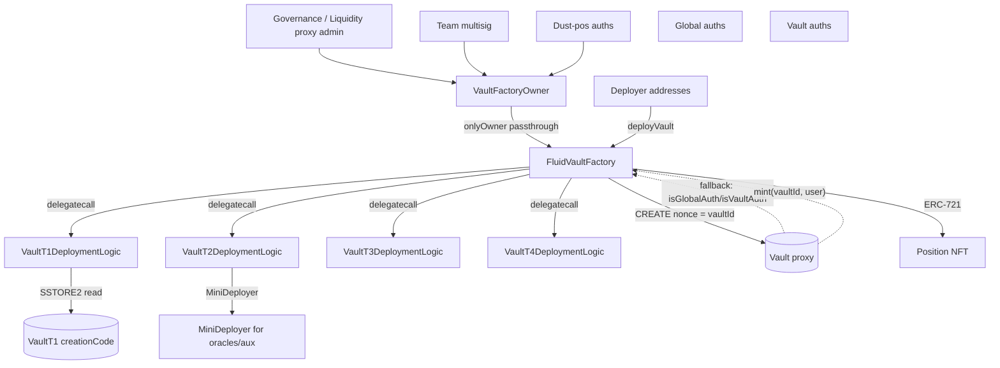

# Vault Factory — SPEC

## 1. Purpose

`FluidVaultFactory` is the **deployment, ownership, and position-NFT hub** for the Fluid Vault protocol. It deploys vault proxies at deterministic addresses (plain `CREATE` with incrementing nonce = `vaultId`), mints the ERC-721 tokens that represent user positions, and stores the tiered authorization mapping (`deployer / globalAuth / vaultAuth / vaultDeploymentLogic`) that every vault's admin module consults through `fallback`. The factory is *not* upgradeable: new vault types are onboarded by whitelisting new deployment-logic contracts (delegatecalled into during `deployVault`).

Additionally, this folder contains `VaultFactoryOwner` — a ~450-line governance wrapper that is meant to sit as the factory's owner, passing through admin calls unchanged but adding two scoped transfer paths (`transferPosition`, `transferDustPosition`) that move user position NFTs to a team multisig under tightly-bounded conditions.

See the [protocol overview](../SPEC.md), and the per-type specs ([vaultT1](../vaultT1/SPEC.md), [T2](../vaultT2/SPEC.md), [T3](../vaultT3/SPEC.md), [T4](../vaultT4/SPEC.md)).

## 2. Architecture

Files under `contracts/protocols/vault/factory/`:

- `main.sol` — `FluidVaultFactory`, composed of:
  - `VaultFactoryVariables` — storage (owner, ERC-721 fields, deployer / globalAuth / vaultAuth / deploymentLogic mappings, `_totalVaults`).
  - `VaultFactoryEvents` — all factory events.
  - `VaultFactoryCore` — constructor + `validAddress` modifier.
  - `VaultFactoryAuth` — `setDeployer`, `setGlobalAuth`, `setVaultAuth`, `setVaultDeploymentLogic`, `spell`, and the `is*` view predicates.
  - `VaultFactoryDeployment` — `deployVault`, `_deploy`, `getVaultAddress` (manual RLP encoding for CREATE address determinism), `isVault`, `totalVaults`.
  - `VaultFactoryERC721` — `mint(vaultId, user)` (only the vault at `getVaultAddress(vaultId)` may call it), `tokenURI` (returns empty string).
- `ERC721/ERC721.sol` — custom, packed ERC-721 + Enumerable base (modified Solmate). Token config is packed into one `uint256` slot per token (`owner` in bits 0–159, index in 160–191, vaultId in 192–223).
- `ownerWrapper.sol` — `VaultFactoryOwner` (separate contract meant to be installed as factory owner). Tiered access: `governance` (= Liquidity proxy EIP-1967 admin slot), `team multisig` (hard-coded address), `dustPosAuths` (mapping). Implements `transferPosition` (allowlisted vault ids, team-or-gov only) and `transferDustPosition` (dust-pos auths + team + gov, subject to debt and ratio thresholds), plus `spellApprove` (self-delegatecalled via factory `spell` to pre-approve NFTs before transfer).
- `deploymentHelpers/miniDeployer.sol` — small `Owned` helper contract that deploys arbitrary bytecode via `CREATE`. Used as a per-deployer nonce source (so the vault / logic / oracle address can be recomputed off-chain via `AddressCalcs.addressCalc(miniDeployer, nonce)`).
- `deploymentLogics/vaultT1Logic.sol`, `vaultT2Logic.sol`, `vaultT3Logic.sol`, `vaultT4Logic.sol` — per-type deployment logic (delegatecalled by factory during `deployVault`). Each encodes the type-specific `ConstantViews` and returns the vault creation bytecode; split SSTORE2 pointers are used to hold the large creation code for T1 (two halves to fit under the 24 576 byte contract size limit). `vaultT1Logic_not_for_prod.sol` is a test / research variant.

## 3. External Interactions

- **Vault proxies** — the factory is the only caller of the vault's `ADMIN_IMPLEMENTATION` fallback gate (via `isGlobalAuth` / `isVaultAuth` reads). It is also the only authorized `mint` source — each vault's `_operate` calls `VAULT_FACTORY.mint(VAULT_ID, msg.sender)` for fresh positions, and the factory's `mint` asserts `msg.sender == getVaultAddress(vaultId_)`.
- **Deployment logic contracts** — invoked via `delegatecall(vaultDeploymentLogic_.deploymentData)`. They read `LIQUIDITY`, `ADMIN_IMPLEMENTATION`, and `SECONDARY_IMPLEMENTATION` from their own immutables, assemble `ConstantViews` (including pre-computed Liquidity slot pointers for gas), and return the full creation bytecode for the factory's own `CREATE`.
- **Liquidity** (read-only, via `VaultFactoryOwner`) — the governance address is resolved from Liquidity's EIP-1967 admin slot (`0xb53127...5d6103`), so rotating Liquidity governance rotates factory governance.
- **Oracle** (read-only, via `VaultFactoryOwner._isPositionAboveRatioThreshold`) — optional probe during `transferDustPosition` to check whether a position's LTV is above 50%.
- **Users / integrators** — interact via standard ERC-721 (`transferFrom`, `approve`, `setApprovalForAll`, `balanceOf`, `ownerOf`, `totalSupply`) and the deployment helpers (`deployVault`, `isVault`, `getVaultAddress`, `totalVaults`).

## 4. Capabilities & Responsibilities

- **Deterministic vault deployment.** `deployVault(deploymentLogic_, data_)`:
  - Requires `isDeployer(msg.sender)` (or the owner).
  - Requires `isVaultDeploymentLogic(deploymentLogic_)`.
  - Increments `_totalVaults` → new `vaultId_`.
  - Computes `getVaultAddress(vaultId_)` via manual RLP encoding of `(factory, vaultId)` — that becomes the `CREATE` address the factory will use with the current nonce.
  - `delegatecall` into `deploymentLogic_(data_)`, decodes the returned `bytes` as creation bytecode, `CREATE`s it, and asserts the deployed address matches `getVaultAddress(vaultId_)` and `isVault(deployed) == true`.
  - Emits `VaultDeployed(vault, vaultId)`.

- **Tiered auth mapping.** Four orthogonal auth sets govern the whole Vault protocol:
  - `_deployers` — allow-listed to call `deployVault`.
  - `_globalAuths` — allow-listed to call admin methods on **every** vault.
  - `_vaultAuths[vault][addr]` — allow-listed to call admin methods on one specific vault.
  - `_vaultDeploymentLogics` — allow-listed contracts that `deployVault` may delegatecall.
  - Owner is implicit member of all three auth sets.

- **`spell`** — owner-only `delegatecall(target, data)` for arbitrary factory-context execution. Used e.g. by `VaultFactoryOwner.spellApprove` (sets `getApproved[id] = this` directly via `sstore`).

- **ERC-721 position NFTs.** One NFT per live vault position; `vaultId` is packed into the token config so off-chain tools can resolve `(tokenId) → (vault, owner)` from a single storage read. `tokenURI` returns empty string — no metadata standard.

- **`VaultFactoryOwner` pass-through + scoped transfer**:
  - Passthrough: `setDeployer`, `setGlobalAuth`, `setVaultAuth`, `setVaultDeploymentLogic`, `spell`, `transferFactoryOwnership` (all `onlyGovernance`).
  - `transferPosition(tokenId)` — team-or-governance; requires `vaultIdAllowlisted[vaultId]`. Moves NFT to `TEAM_MULTISIG`.
  - `transferDustPosition(tokenId)` — team, governance, or any `transferDustPosAuths[caller]`. Requires `rawDebt ≤ 1e5` (dust), `rawDebt > 0` (excluding supply-only), and for non-team / non-gov callers also `position ratio ≥ 50%` (risky). Uses `spellApprove` via factory `spell` to obtain ERC-721 approval atomically, then `transferFrom` to `TEAM_MULTISIG`.
  - `spellApprove` — reachable only when `address(this) == address(FACTORY)` (i.e. only as the inner delegatecall of the outer `factory.spell(this, ...)` flow).

## 5. Roles & Access Control

- **Factory owner** — set in constructor (via Solmate `Owned`). Full admin surface on `FluidVaultFactory`. In production, owner = `VaultFactoryOwner`.
- **Deployers (`_deployers[addr] || owner == addr`)** — may call `deployVault`.
- **Global auths (`_globalAuths[addr] || owner == addr`)** — may call every vault's admin methods.
- **Vault auths (`_vaultAuths[vault][addr] || owner == addr`)** — may call the specific vault's admin methods.
- **Vault deployment logics (`_vaultDeploymentLogics[addr]`)** — delegatecalled from factory during `deployVault`; effectively trusted with factory-context execution, so onboarding a malicious logic equals compromise.
- **Inside `VaultFactoryOwner`**:
  - `governance` — the `LIQUIDITY` EIP-1967 admin. Full passthrough + ownership transfer + all transfer paths.
  - `TEAM_MULTISIG` (hard-coded, `0x4F6F977aCDD1177DCD81aB83074855EcB9C2D49e`) — may call `transferPosition`, `transferDustPosition` (skipping ratio check), `setTransferDustPosAuth`.
  - `transferDustPosAuths` — may call `transferDustPosition` only, subject to `rawDebt ≤ 1e5` **and** ratio `≥ 50%`.

## 6. Storage Layout

`FluidVaultFactory`:
- Slot 0 — `owner` (Solmate Owned).
- Slot 1 — `name` (ERC-721).
- Slot 2 — `symbol`.
- Slot 3 — `_tokenConfig[id]`: `uint160 owner | uint32 index | uint32 vaultId | uint32 reserved`.
- Slot 4 — `_ownerConfig[owner][slot]`: slot 0 holds `uint32 balance + 7×uint32 tokenIds`; slot ≥ 1 holds 8×uint32 tokenIds (packed enumerable list).
- Slot 5 — `totalSupply` (ERC-721 enumerable).
- Slot 6 — `getApproved[id]`.
- Slot 7 — `isApprovedForAll[owner][operator]`.
- Slot 8 — `_deployers[addr]`.
- Slot 9 — `_globalAuths[addr]`.
- Slot 10 — `_vaultAuths[vault][addr]`.
- Slot 11 — `_totalVaults` (also the `CREATE` nonce for vault deployment).
- Slot 12 — `_vaultDeploymentLogics[addr]`.

`VaultFactoryOwner`:
- Immutables: `FACTORY`, `LIQUIDITY`, constants (`_LIQUIDITY_ADMIN_SLOT`, `TEAM_MULTISIG`, `DEBT_THRESHOLD = 1e5`, `RATIO_THRESHOLD = 500` = 50% in 3-decimal precision, `VAULT_T1_TYPE = 10000`).
- Slot (mapping): `vaultIdAllowlisted[vaultId]`.
- Slot (mapping): `transferDustPosAuths[addr]`.

`MiniDeployer`:
- Slot 0 — `owner` (Solmate Owned). No other storage.

## 7. User / Public Methods

### `FluidVaultFactory`

- `deployVault(address vaultDeploymentLogic_, bytes calldata vaultDeploymentData_)` — deployer-or-owner; logic must be whitelisted. Reverts `VaultFactory__Unauthorized` / `VaultFactory__InvalidVaultAddress` / `VaultFactory__InvalidOperation` on bytecode issues. Returns the deployed vault address.
- `getVaultAddress(uint256 vaultId_) view` — returns the `CREATE` address for a given nonce using manual RLP encoding. Returns `address(0)` when `vaultId_ == 0`.
- `isVault(address vault_) view` — `true` if the candidate has `VAULT_ID()` selector and the returned id maps back to `vault_`.
- `totalVaults() view` — `_totalVaults`.
- `mint(uint256 vaultId_, address user_)` — external but restricted: `msg.sender == getVaultAddress(vaultId_)` (i.e. only the vault itself). Mints a new ERC-721 with packed `(owner, index, vaultId)`.
- `tokenURI(uint256)` — returns empty string.
- `isDeployer`, `isGlobalAuth`, `isVaultAuth`, `isVaultDeploymentLogic` — views.
- Standard ERC-721: `ownerOf`, `balanceOf`, `approve`, `setApprovalForAll`, `transferFrom`, `safeTransferFrom`, `getApproved`, `isApprovedForAll`, `totalSupply`, and enumeration helpers (via the packed `_ownerConfig`).

### `VaultFactoryOwner` (passthrough)

- `setDeployer(address, bool)` — `onlyGovernance`.
- `setGlobalAuth(address, bool)` — `onlyGovernance`.
- `setVaultAuth(address vault, address auth, bool)` — `onlyGovernance`.
- `setVaultDeploymentLogic(address, bool)` — `onlyGovernance`.
- `spell(address, bytes)` — `onlyGovernance`. Forwards to factory `spell`.
- `transferFactoryOwnership(address newOwner_)` — `onlyGovernance`, non-zero. Forwards to factory `transferOwnership`.

### `VaultFactoryOwner` (scoped transfer)

- `setVaultIdAllowlisted(uint256 vaultId_, bool)` — `onlyGovernance`. Asserts `isVault(getVaultAddress(vaultId))`.
- `setTransferDustPosAuth(address auth_, bool)` — `onlyTeamOrGovernance`.
- `transferPosition(uint256 tokenId_)` — `onlyTeamOrGovernance`. Moves NFT to `TEAM_MULTISIG`. Reverts `VaultFactoryOwner__VaultNotAllowlisted` if the position's vault isn't allowlisted.
- `transferDustPosition(uint256 tokenId_)` — `onlyDustPosAuthOrTeamOrGovernance`. Reverts `VaultFactoryOwner__DebtAboveThreshold` when `rawDebt > 1e5`; `VaultFactoryOwner__PositionTooSafe` when `rawDebt == 0` or caller is dust-auth and ratio below threshold.
- `spellApprove(uint256 id_, address spender_)` — reverts `VaultFactoryOwner__NotFactoryContext` unless `address(this) == FACTORY`. Writes `getApproved[id] = spender` directly via `sstore`.

### `MiniDeployer`

- `deployContract(bytes calldata)` — `onlyOwner`. Deploys via `CREATE`. Emits `LogContractDeployed`. Reverts `MiniDeployer__InvalidOperation` on empty bytecode / zero-address result.

## 8. Admin / Governance Methods

All in `VaultFactoryAuth` (each is `onlyOwner`):

- `setDeployer(address, bool)` — mutate `_deployers`.
- `setGlobalAuth(address, bool)` — mutate `_globalAuths`.
- `setVaultAuth(address vault, address auth, bool)` — mutate `_vaultAuths[vault][auth]`.
- `setVaultDeploymentLogic(address, bool)` — allow / disallow a deployment logic contract for `deployVault`.
- `spell(address target_, bytes data_)` — raw `delegatecall` in factory context. Reverts bubbled up.

Plus Solmate `Owned.transferOwnership(address)` — standard two-step-less transfer.

Emits: `LogSetDeployer`, `LogSetGlobalAuth`, `LogSetVaultAuth`, `LogSetVaultDeploymentLogic`.

## 9. Events

- `FluidVaultFactory`: `VaultDeployed(address indexed vault, uint256 indexed vaultId)`, `NewPositionMinted(address indexed vault, address indexed user, uint256 indexed tokenId)`, `LogSetDeployer`, `LogSetGlobalAuth`, `LogSetVaultAuth`, `LogSetVaultDeploymentLogic`.
- ERC-721: `Transfer`, `Approval`, `ApprovalForAll`.
- `VaultFactoryOwner`: `LogSetVaultIdAllowlisted`, `LogSetTransferDustPosAuth`, `LogTransferPosition`, `LogTransferDustPosition`, `LogTransferFactoryOwnership`.
- `MiniDeployer`: `LogContractDeployed`.

## 10. Errors

Raised as `FluidVaultError(uint256)`:

- `34001 VaultFactory__InvalidOperation` — empty / zero-returning CREATE, invalid bytecode.
- `34002 VaultFactory__Unauthorized` — `deployVault` caller not a deployer, or deployment logic not whitelisted.
- `34003 VaultFactory__SameTokenNotAllowed` — deployment logic caught supply == borrow token.
- `34004 VaultFactory__InvalidParams`.
- `34005 VaultFactory__InvalidVault` — `mint` called by a non-vault address, or allowlist check could not resolve a valid vault.
- `34006 VaultFactory__InvalidVaultAddress` — computed CREATE address mismatched the actual deployment or didn't pass `isVault`.
- `34007 VaultFactory__OnlyDelegateCallAllowed` — deployment logic entry point called directly instead of via `deployVault`.
- ERC-721 errors (`ERC721__InvalidParams`, `ERC721__Unauthorized`) from the token layer.
- `VaultFactoryOwner__Unauthorized`, `VaultFactoryOwner__ZeroAddress`, `VaultFactoryOwner__VaultNotAllowlisted`, `VaultFactoryOwner__DebtAboveThreshold`, `VaultFactoryOwner__PositionTooSafe`, `VaultFactoryOwner__InvalidPosition`, `VaultFactoryOwner__InvalidVault`, `VaultFactoryOwner__NotFactoryContext`.
- `MiniDeployer.MiniDeployer__InvalidOperation`.

## 11. Invariants & Safety Notes

- **`deployVault` is atomic.** Factory asserts `vault_ == _deploy(abi.decode(data_, (bytes))) && isVault(vault_)` in one conditional — if the deployment logic returns the wrong bytecode, or the vault doesn't expose `VAULT_ID()` returning the expected nonce, the whole tx reverts and `_totalVaults` stays incremented only on success.
- **CREATE address determinism depends on `_totalVaults`.** No back-fill: the sequence is strictly monotonic. Skipping an id is impossible unless the factory is upgraded (it isn't).
- **`getVaultAddress` covers RLP paths for `vaultId ≤ 0xffffffff`.** Branches for `≤ 0x7f`, `≤ 0xff`, `≤ 0xffff`, `≤ 0xffffff`, else `uint32`.
- **`mint` is vault-only.** The factory verifies `msg.sender == getVaultAddress(vaultId_)`; an arbitrary caller cannot mint NFTs.
- **`tokenURI` returns empty.** Integrators should not rely on factory metadata for UI labeling.
- **NFT id space is global across all vault types.** Two positions from different vaults share the same id space; interpret as `(vault, id)` or rely on `_tokenConfig[id].vaultId`.
- **`spell` is arbitrary delegatecall.** Owner (governance) can migrate storage, write new mappings, or self-destruct (not possible post-Cancun, but still has write-everywhere scope). Treat as the ultimate break-glass.
- **`VaultFactoryOwner` is not upgradeable**, but factory ownership can be rotated via `transferFactoryOwnership` — governance can swap the wrapper out.
- **`spellApprove` runs only in factory context.** An attacker cannot call `spellApprove` on the wrapper itself to bypass ownership; the `address(this) != FACTORY` guard reverts.
- **Dust-position gating.** The 1e5-raw-debt threshold is a strict `>` check; supply-only positions (`positionData & 1 == 1`) always revert `PositionTooSafe`. Ratio check applies only to dust-pos auths; team / gov can bypass.

## 12. Trust Model & Accepted Trade-offs

- **Owner is the root of trust.** Adding a malicious deployment logic or calling `spell` can compromise every future vault. Production deploys put `VaultFactoryOwner` (and through it, Liquidity governance + team multisig) in that role.
- **Deployment-logic upgradeability.** New vault types are added by whitelisting new logics; existing vaults are never redeployed. This means *previously* deployed vaults keep their exact logic forever — a safety benefit, but it does mean bugs in a deployed vault cannot be patched in place; mitigation paths are (a) `spell` on the vault's admin module, (b) migration via periphery.
- **NFTs share id space across vaults.** Integrators that index positions solely by NFT id will conflate positions from different vaults. Use `_tokenConfig` `vaultId` field.
- **`transferPosition` / `transferDustPosition` are team-multisig-only destinations.** The team multisig is hard-coded in `VaultFactoryOwner` and cannot be changed without redeploying / rotating the wrapper. The rationale is explicit: these paths exist to rescue stranded positions or retire dust, not to move positions between end users.
- **Ratio check uses the vault's oracle.** If the oracle is broken / reverts / out of `[1e9, 1e54]` bounds, the ratio check silently treats the position as risky (returns `true`), so dust-pos auths can transfer even un-pricable positions. Accepted: the intent is to clear stuck dust, so failure-open is preferred over a stuck NFT.
- **`MiniDeployer` nonce leakage.** Nonce-based address derivation means off-chain tools can predict future addresses; this is intentional (used by `AddressCalcs.addressCalc`).

See also:
- [contracts/protocols/vault/SPEC.md](../SPEC.md) — Vault protocol overview.
- [contracts/protocols/vault/vaultTypesCommon/SPEC.md](../vaultTypesCommon/SPEC.md) — shared vault engine that reads these auth mappings.
- [contracts/libraries/SPEC-tickMath.md](../../../libraries/SPEC-tickMath.md), [contracts/libraries/SPEC-bigMath.md](../../../libraries/SPEC-bigMath.md) — math used by `VaultFactoryOwner._getPositionTickAndDebtRaw` and `_isPositionAboveRatioThreshold`.
