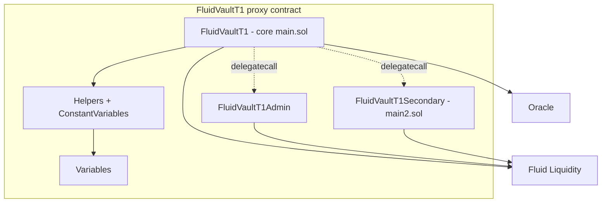

# Vault T1 — SPEC

## 1. Purpose

`FluidVaultT1` is the simplest Fluid vault type: **one ERC-20 (or native) collateral, one ERC-20 (or native) debt**, both held in / borrowed from the Fluid Liquidity layer. It predates the shared [`vaultTypesCommon`](../vaultTypesCommon/SPEC.md) base — the contract is self-contained (its own `common/`, `adminModule/`, `coreModule/`) and implements the tick / branch liquidation engine directly, rather than delegating `operate` to a separate operate module. Semantics match T2–T4 wherever they overlap; this spec calls out the T1-specific differences.

## 2. Architecture



Files under `contracts/protocols/vault/vaultT1/`:

- `common/variables.sol` — `Variables`: packed `vaultVariables`, `vaultVariables2`, `rates`, `positionData`, `tickHasDebt`, `tickData`, `tickId`, `branchData`, `absorbedLiquidity`, `absorbedDustDebt`, `rebalancer`. Same layout as `vaultTypesCommon/common/variables.sol` **with one important difference**: T1 stores the oracle as a full 160-bit address in the upper bits of `vaultVariables2`, not as an oracle nonce resolved via `DEPLOYER_CONTRACT`.
- `coreModule/constantVariables.sol` — `ConstantVariables`: `SUPPLY_TOKEN`, `BORROW_TOKEN` (plain `address`), `SUPPLY_DECIMALS`, `BORROW_DECIMALS`, `ADMIN_IMPLEMENTATION`, `SECONDARY_IMPLEMENTATION`, `LIQUIDITY`, `VAULT_FACTORY`, `VAULT_ID`, pre-computed Liquidity slot pointers, `NATIVE_TOKEN`, `EXCHANGE_PRICES_PRECISION = 1e12`, and the `X8..X128` masks. No DEX / smart-token / TYPE constants.
- `coreModule/structs.sol` — in-memory `OperateMemoryVars`, `CurrentLiquidity`, `MemoryVars`, `BranchData`, `TickData`, `LiquidationVars`.
- `coreModule/events.sol` — `LogOperate`, `LogLiquidate`, `LogUpdateExchangePrice`.
- `coreModule/helpers.sol` — tick / branch math, `_updateExchangePrice`, oracle read, CF check, `fetchLatestPosition`, `getLiquidityExchangePrice`.
- `coreModule/main.sol` — `FluidVaultT1`: `operate`, `liquidate`, `rebalance`, `liquidityCallback`, `fallback`, `_spell`.
- `coreModule/main2.sol` — `FluidVaultT1Secondary`: `absorb`, `rebalance` (delegatecalled), `updateExchangePricesOnStorage`.
- `adminModule/main.sol` — `FluidVaultT1Admin`: all setters + `rescueFunds`, `absorbDustDebt`.
- `adminModule/events.sol` — `LogUpdate...`, `LogRescueFunds`, `LogAbsorbDustDebt`, `LogUpdateCoreSettings`.

Dispatch:
- **Core is monolithic**: `operate` and `liquidate` are implemented directly on `FluidVaultT1` (no `_spell(OPERATE_IMPLEMENTATION, ...)` as in T2/T3/T4).
- `rebalance()` (zero-arg) forwards via `_spell(SECONDARY_IMPLEMENTATION, msg.data)`.
- `fallback` dispatches to `ADMIN_IMPLEMENTATION` when `VaultFactory.isGlobalAuth(caller) || VaultFactory.isVaultAuth(this, caller)`.

## 3. External Interactions

- **Fluid Liquidity (`LIQUIDITY`)** — all deposits / withdraws / borrows / paybacks route through `LIQUIDITY.operate(token, supplyAmt, borrowAmt, to, 0, callbackData)`. `readFromStorage` is used with the pre-computed slot pointers for supply / borrow exchange prices and user-supply / user-borrow words.
- **Oracle (`IFluidOracle` / optional `IFluidOracleWrite`)** — address read from the upper 160 bits of `vaultVariables2`. On operate CF checks and inside liquidation, T1 first `try`s `IFluidOracleWrite.getExchangeRateOperateWrite()` / `getExchangeRateLiquidateWrite()`. Fallback to the view `IFluidOracle.getExchangeRateOperate()` / `getExchangeRateLiquidate()` happens only when revert data is empty (typically missing selector). If the write call reverts with non-empty data (custom error / `Error(string)` / `Panic`), that revert is rethrown so real oracle failures are not swallowed. Existing view-only oracles are unchanged. Price bounds `[1e9, 1e54]` and ratio cap at `1e45` apply exactly as in the common engine.
- **Factory (`VAULT_FACTORY`)** — `mint(VAULT_ID, user)` when `nftId == 0` in `operate`, `ownerOf(nftId)` for risky-direction ownership checks, `isGlobalAuth` / `isVaultAuth` for admin dispatch.
- **Callers**
  - Users → `operate`.
  - Liquidators → `liquidate` (`to_ = 0x...dEaD` to simulate).
  - Rebalancer → `rebalance()`.
  - Liquidity → `liquidityCallback(token, amount, data)` during an outward `operate` that pulls tokens.
  - Factory-authorized admins → fallback → admin module.

## 4. Capabilities & Responsibilities

- **Borrow / supply positions** represented as ERC-721 NFTs minted by the factory.
- **Unified `operate`** for create / deposit / withdraw / borrow / payback. Single call can simultaneously move collateral and debt.
- **Tick / branch liquidation engine** identical in mechanics to `vaultTypesCommon`: walks from top tick down to the tick implied by `colPerUnitDebt`, handling partial liquidations, branch merges, and the 0.01% branch-debt haircut on merges.
- **Absorb** for positions above the liquidation max limit (via `FluidVaultT1Secondary.absorb`).
- **Rebalance** — zero-arg parameterless, unlike T2/T3/T4 which take four `int256` min/max bounds. Reconciles vault-recorded totals against Liquidity.
- **Exchange-price accrual** per block via `_updateExchangePrice` using `vaultVariables2` magnifiers and Liquidity price deltas. Bounded by admin-configured rate magnifiers.
- **Dust-debt cleanup** via admin `absorbDustDebt(nftIds[])`, adding dust back to total-borrow so the next `rebalance()` can true it up.

## 5. Roles & Access Control

- **NFT owner** — required caller for any operate leg that withdraws collateral or increases debt. Approvals do not grant operate rights.
- **Non-owner** — may deposit collateral or pay back debt on any NFT (non-risky direction).
- **Liquidator** — any caller may invoke `liquidate`. `to_ = 0x...dEaD` triggers `FluidLiquidateResult` revert for off-chain quoting.
- **Rebalancer** — the single address stored in `rebalancer`. Only caller of `rebalance()`.
- **Liquidity** — only accepted caller of `liquidityCallback`.
- **Factory auths** — reach admin module through fallback. `_verifyCaller` in each admin method rejects direct calls (delegatecall only).

## 6. Storage Layout

Same packed layout as described in [vaultTypesCommon SPEC §6](../vaultTypesCommon/SPEC.md#6-storage-layout), with these T1-specific notes:

### `vaultVariables2` differences

| Bits | Field |
| --- | --- |
| 0–15 | Supply-rate magnifier |
| 16–31 | Borrow-rate magnifier |
| 32–41 | Collateral factor |
| 42–51 | Liquidation threshold |
| 52–61 | Liquidation max limit |
| 62–71 | Withdraw gap |
| 72–81 | Liquidation penalty |
| 82–91 | Borrow fee |
| 92–95 | Reserved (0) |
| 96–255 | **Oracle address (full 160-bit)** |

T2–T4 replace the upper bits with `(oracleNonce | lastUpdateTimestamp)`; T1 stores the oracle address directly.

## 7. User / Public Methods

### operate

```solidity
function operate(
    uint256 nftId_,
    int256  newCol_,
    int256  newDebt_,
    address to_
) external payable returns (uint256 nftId, int256 newCol, int256 newDebt)
```

- **Access:** any caller for deposit + payback; must be NFT owner (via `VAULT_FACTORY.ownerOf`) for withdraw (`newCol_ < 0`) or borrow (`newDebt_ > 0`).
- **`nftId_`:**
  - `0` — mint a new NFT via `VAULT_FACTORY.mint(VAULT_ID, msg.sender)` and initialize a fresh position. `vaultVariables.totalPositions` increments.
  - Non-zero — must belong to this vault (`positionData[nftId_] != 0` → else `Vault__NftNotOfThisVault`).
- **`newCol_` / `newDebt_`:**
  - `0` — leave that leg untouched. Both zero → `Vault__InvalidOperateAmount`.
  - Positive → supply collateral / borrow.
  - Negative → withdraw collateral / payback debt.
  - Absolute value must be `≥ 10000` raw units, else `Vault__InvalidOperateAmount` (dust guard).
  - `type(int).min` — perfect-max sentinel: withdraw entire collateral or payback entire debt (final resolved amount is returned).
- **`to_`:** destination for withdrawn collateral or borrowed debt. `address(0)` defaults to `msg.sender`. For deposit / payback this field is unused.
- **ETH (`msg.value`):**
  - If supply token is native and `newCol_ > 0`: `msg.value == uint(newCol_)` else `Vault__InvalidMsgValueOperate`.
  - If borrow token is native and `newDebt_ < 0` (payback): `msg.value` is consumed, any leftover is refunded.
  - Otherwise `msg.value` must be 0.
  - Vault cannot have both sides native (enforced by deployer configuration).
- **Reentrancy:** bit 0 of `vaultVariables` guards; `Vault__AlreadyEntered` on re-entry.
- **CF check:** after the op, if the position has any debt, `debt * 1e9 / col < CF * oraclePrice` must hold; else `Vault__PositionAboveCF`.
- **Withdrawal gap:** caps max withdrawable collateral via a percentage of current Liquidity user-supply balance; returned `newCol_` may be smaller than requested under `type(int).min`.
- **Callback:** on deposit / payback, Liquidity calls `liquidityCallback(token, amt, abi.encode(msg.sender))`, which `safeTransferFrom`s tokens from `msg.sender` to Liquidity.
- **Returns:** `(nftId, newCol_, newDebt_)` — resolved amounts after the op.
- **Events:** `LogOperate(msg.sender, nftId_, newCol_, newDebt_, to_)`, `LogUpdateExchangePrice`.

### liquidate

```solidity
function liquidate(
    uint256 debtAmt_,
    uint256 colPerUnitDebt_, // 1e18 precision
    address to_,
    bool    absorb_
) external payable returns (uint256 actualDebtAmt, uint256 actualColAmt)
```

- **Access:** permissionless.
- **`debtAmt_`:** max debt to repay. Must be `> 0`.
- **`colPerUnitDebt_`:** slippage bound: requires `actualColAmt * 1e18 / actualDebtAmt ≥ colPerUnitDebt_`, else `Vault__ExcessSlippageLiquidation`.
- **`to_`:**
  - Normal address → receives collateral.
  - `0x...dEaD` → reverts with `FluidLiquidateResult(actualColAmt, actualDebtAmt)`; used by off-chain callers to probe maximum liquidatable amount.
- **`absorb_`:** when `true`, runs `FluidVaultT1Secondary.absorb(...)` first to clear the absorbed buffer, then proceeds with normal tick walking.
- **ETH:** if borrow token is native, `msg.value` funds the payback; excess refunded.
- **Reentrancy:** bit 0 of `vaultVariables`.
- **Flow:** walks from top tick downward; at each tick computes `ratio`, `debtLiquidatable`, `colLiquidatable` (with `(1 - liquidationPenalty)` factor). Stops when `debtRemaining == 0` or ratio drops below liquidation threshold. Updates branch debt / debt factor; merges with base branch when needed; applies 0.01% haircut on branch-debt reads (`fetchLatestPosition`). Finally calls `LIQUIDITY.operate(BORROW_TOKEN, 0, -actualDebtAmt, ...)` to book the payback and `LIQUIDITY.operate(SUPPLY_TOKEN, -actualColAmt, 0, to_, ...)` to release collateral.
- **Events:** `LogLiquidate(msg.sender, actualColAmt, actualDebtAmt, to_)`.

### rebalance

```solidity
function rebalance() external payable returns (int supplyAmt_, int borrowAmt_)
```

- **Access:** `msg.sender == rebalancer`.
- Delegatecalls `FluidVaultT1Secondary.rebalance` which compares vault-recorded supply / borrow (net of `absorbedDustDebt`) against live Liquidity balances and pushes / pulls the delta to / from the rebalancer.
- Vault-level operations trigger exchange-price updates before the reconciliation.

### liquidityCallback

```solidity
function liquidityCallback(address token_, uint256 amount_, bytes calldata data_) external
```

- `msg.sender == address(LIQUIDITY)` (else `Vault__InvalidLiquidityCallbackAddress`).
- `vaultVariables & 1 == 1` (else `Vault__NotEntered`).
- Decodes `data_` as `(address from_)` and `safeTransferFrom(token_, from_, LIQUIDITY, amount_)`.

### fallback

Delegatecalls `ADMIN_IMPLEMENTATION`. Requires `VAULT_FACTORY.isGlobalAuth(msg.sender) || VAULT_FACTORY.isVaultAuth(this, msg.sender)`, else `Vault__NotAnAuth`.

### constantsView

```solidity
function constantsView() external view returns (ConstantViews memory)
```

Returns the `ConstantViews` struct used by deployment logic.

## 8. Admin / Governance Methods

All on `FluidVaultT1Admin`, called via fallback → delegatecall. Every setter is gated by `_verifyCaller` (delegatecall-only) and `_updateExchangePrice` (accrue before write).

- `updateSupplyRateMagnifier(uint)` — input in 1e2 (1% = 100). Max `X16` (`≤ 65535`).
- `updateBorrowRateMagnifier(uint)` — same bounds.
- `updateCollateralFactor(uint)` — input in 1e2; stored as `/10`. Must be `< liquidationThreshold` (stored) else `VaultAdmin__ValueAboveLimit`.
- `updateLiquidationThreshold(uint)` — input in 1e2; stored as `/10`. Must satisfy `CF < threshold < maxLimit`.
- `updateLiquidationMaxLimit(uint)` — input in 1e2; stored as `/10`. `maxLimit + liquidationPenalty ≤ 9970` (99.7%).
- `updateWithdrawGap(uint)` — input in 1e2; stored as `/10`. `≤ 1000` (10%).
- `updateLiquidationPenalty(uint)` — input in 1e2; `≤ X10`. Re-checked with `maxLimit`.
- `updateBorrowFee(uint)` — input in 1e2; `≤ X10`.
- `updateCoreSettings(...)` — bundle update of the eight parameters above in one call, enforcing all invariants atomically.
- `updateOracle(address)` — non-zero address; writes full 160-bit oracle into `vaultVariables2[96:256]`.
- `updateRebalancer(address)` — non-zero.
- `rescueFunds(address token)` — sweeps stuck token balance (or native) to `LIQUIDITY`.
- `absorbDustDebt(uint[] nftIds_)` — reentrancy-guarded. For each NFT:
  - `nftId != 0` else `VaultAdmin__NftIdShouldBeNonZero`.
  - Position must belong to this vault (`posData != 0`).
  - `posDustDebt > 0` else `VaultAdmin__DustDebtIsZero`.
  - Tick must be liquidated (`tickData & 1 == 1` or tick id stale) else `VaultAdmin__NftNotLiquidated`.
  - Resolved debt via `fetchLatestPosition` must be `0` else `VaultAdmin__FinalDebtShouldBeZero`.
  - Marks `positionData[nftId] = 1` (supply-only) and accumulates `absorbedDustDebt_`.
  - Finally adds `absorbedDustDebt_` back to total-borrow (so the next `rebalance()` cleans up), resets `absorbedDustDebt`. Emits `LogAbsorbDustDebt`.

Each setter emits a matching `LogUpdate*`.

## 9. Events

Core: `LogOperate`, `LogLiquidate`, `LogUpdateExchangePrice`.

Admin: `LogUpdateSupplyRateMagnifier`, `LogUpdateBorrowRateMagnifier`, `LogUpdateCollateralFactor`, `LogUpdateLiquidationThreshold`, `LogUpdateLiquidationMaxLimit`, `LogUpdateWithdrawGap`, `LogUpdateLiquidationPenalty`, `LogUpdateBorrowFee`, `LogUpdateCoreSettings`, `LogUpdateOracle`, `LogUpdateRebalancer`, `LogRescueFunds`, `LogAbsorbDustDebt`.

Secondary: `LogAbsorb` (from absorb path).

## 10. Errors

All raised as `FluidVaultError(uint256)` from `contracts/protocols/vault/error.sol`:

- `31001 Vault__AlreadyEntered`
- `31002 Vault__InvalidOperateAmount`
- `31003 Vault__InvalidMsgValueOperate`
- `31004 Vault__NotAnOwner`
- `31005 Vault__NftNotOfThisVault`
- `31007 Vault__TopTickDoesNotExist` / `31007 Vault__InvalidLiquidation`
- `31008 Vault__ExcessSlippageLiquidation`
- `31009 Vault__InvalidRebalancer`
- `31010 Vault__NftIdShouldBeNonZero`
- `31011 Vault__NftNotLiquidated`
- `31012 Vault__InvalidLiquidityCallbackAddress`
- `31013 Vault__NotEntered` / `Vault__InvalidDelegateCall`
- `31014 Vault__NotAnAuth`
- `31015 Vault__TransferFromFailed` / `31016 Vault__TokenNotInitialized`
- `31018 Vault__InvalidExchangePrice`
- `31019 Vault__InvalidOracle` / `Vault__PositionAboveCF`
- `33001–33009 VaultAdmin__…` (admin validations).

`FluidLiquidateResult(uint256 colAmount, uint256 debtAmount)` — simulation revert from `liquidate(..., to_=dEaD, ...)`.

## 11. Invariants & Safety Notes

- **Reentrancy:** bit 0 of `vaultVariables`. `liquidityCallback` explicitly requires this bit.
- **No cross-vault NFT.** Position data for foreign NFTs reads `0`, which reverts.
- **Exchange-price monotonicity.** Liquidity supply / borrow prices are required to be non-decreasing across updates.
- **Vault cannot hold both sides as native token.** Enforced at deployment.
- **`type(int).min` as max sentinel.** Applies to collateral withdraw and debt payback legs of `operate`. For deposit / borrow, negative inputs already mean withdraw / payback semantically.
- **Dust floors.** Any non-zero leg must have `|value| ≥ 10000` raw units.
- **Branch-debt minimum floor.** After merging / reducing, branch debt is clamped to `≥ 100` to avoid divide-by-zero in debt-factor math.
- **CF < LiquidationThreshold < MaxLimit.** Mutually enforced in setters. `MaxLimit + LiquidationPenalty ≤ 9970`.
- **Monolithic core.** Unlike T2/T3/T4, T1 does not use a separate `FluidVaultOperate`-style module; all operate logic is inline. Integrators should not attempt to delegatecall `operate` selectors — they revert at the admin-path auth check.

## 12. Trust Model & Accepted Trade-offs

- **Oracle trust is direct.** Oracle is a full address stored in `vaultVariables2`; an attacker-controlled or mis-configured oracle can mis-price CF / liquidation instantly. Governance must vet oracle contracts before deployment and before `updateOracle`.
- **Permissionless liquidation.** Any caller may trigger `liquidate`. Slippage bound `colPerUnitDebt_` is the only economic control.
- **Rebalancer is trusted.** It reconciles vault-vs-Liquidity drift; any deviation becomes its balance sheet. There is no intra-tx cap on reconciliation size.
- **Dust debt is revenue.** `absorbDustDebt` converts dust from absorbed positions into extra total-borrow that the next `rebalance()` pulls to the rebalancer. This is intentional.
- **Single rebalance semantics.** Unlike T2/T3/T4, T1's `rebalance()` is parameterless: there is no per-leg min / max bound. Rebalancer trust is therefore slightly higher here than on the smart-side vaults; tokens move end-to-end within one call.
- **NFT id global space.** Positions share the ERC-721 id space with other vault types (V-15). Interpret `(vault, id)` pairs.
- **BigMath variants.** Uses `BigMathMinified` + `BigMathVault`; `BigMathUnsafe` is not on the T1 runtime path.

See also:
- [contracts/protocols/vault/SPEC.md](../SPEC.md) — protocol overview (T1–T4 comparison).
- [contracts/protocols/vault/vaultTypesCommon/SPEC.md](../vaultTypesCommon/SPEC.md) — shared engine used by T2/T3/T4 (mirrors T1 mechanics).
- [contracts/libraries/SPEC-tickMath.md](../../../libraries/SPEC-tickMath.md), [contracts/libraries/SPEC-bigMath.md](../../../libraries/SPEC-bigMath.md), [contracts/libraries/SPEC-liquidityCalcs.md](../../../libraries/SPEC-liquidityCalcs.md).
