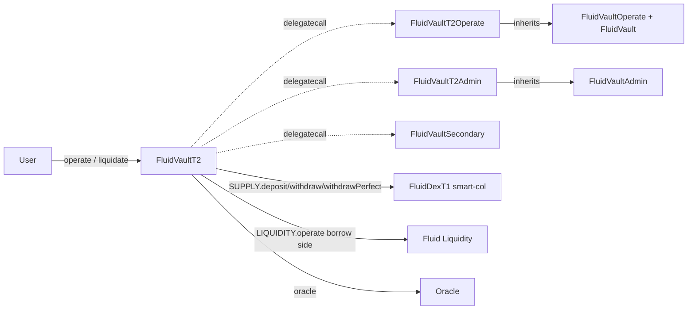

# Vault T2 — SPEC

## 1. Purpose

`FluidVaultT2` is the Fluid vault type with **smart (DEX) collateral and a single ERC-20 / native debt token**. The collateral side deposits / withdraws through a `FluidDexT1` pool (identified by the immutable `SUPPLY` address), while the debt side is booked directly at Fluid Liquidity. T2 reuses the shared tick / branch liquidation engine and admin module from [`vaultTypesCommon`](../vaultTypesCommon/SPEC.md); this spec documents only the T2-specific surface (smart-col token flows, the additional `operate` / `liquidate` parameters, the signed supply-rate admin model).

See the [protocol overview](../SPEC.md), the [common engine SPEC](../vaultTypesCommon/SPEC.md), and [DEX poolT1 SPEC](../../dex/poolT1/SPEC.md).

## 2. Architecture



Files (all imports from `vaultTypesCommon`):
- `coreModule/main.sol` — `FluidVaultT2` thin wrapper. Routes `operate` / `operatePerfect` to `OPERATE_IMPLEMENTATION` via `_spell`. Implements `liquidate` / `liquidatePerfect` directly (shared `_liquidate` + `_colLiquidatePerfectAfter` for DEX withdraw).
- `coreModule/mainOperate.sol` — `FluidVaultT2Operate` (delegatecall target): `_colOperateBefore` (smart-col deposit/withdraw before the shared `_operate`), `_colOperatePerfectBefore` / `_colOperatePerfectAfter` (share-targeted path), and the actual `operate` / `operatePerfect` entry points guarded by `_delegateCallCheck`.
- `adminModule/main.sol` — `FluidVaultT2Admin` extends `FluidVaultAdmin`: `updateSupplyRate(int)`, `updateBorrowRateMagnifier(uint)`, combined `updateCoreSettings`.
- `adminModule/events.sol` — `VaultT2Events`.

T2 has no new storage; all state lives in the shared `Variables` layout documented in [vaultTypesCommon SPEC §6](../vaultTypesCommon/SPEC.md#6-storage-layout). The `TYPE` constant is `VAULT_T2_SMART_COL`; `SUPPLY_TOKEN0 / SUPPLY_TOKEN1` are the real DEX underlying tokens and `SUPPLY` is the DEX pool address (typed as `ILiquidityDexCommon`). `BORROW_TOKEN` is a plain ERC-20 / native token; `BORROW` is the Liquidity address (not a DEX).

## 3. External Interactions

- **SUPPLY (FluidDexT1 pool)** — `deposit(token0Amt, token1Amt, minShares, false)` / `withdraw(token0Amt, token1Amt, maxShares, to)` for non-proportional moves; `depositPerfect` / `withdrawPerfect` / `withdrawPerfectInOneToken` for share-targeted (perfect) moves. Returns / consumes collateral shares in DEX share space.
- **Fluid Liquidity** — `LIQUIDITY.operate` for the borrow leg (debt), `readFromStorage` for Liquidity exchange prices / user-borrow.
- **Oracle** — resolved via `AddressCalcs.addressCalc(DEPLOYER_CONTRACT, oracleNonce)`.
- **Factory** — `mint`, `ownerOf`, `isGlobalAuth` / `isVaultAuth`.
- **`dexCallback`** — DEX calls back during its own `operate`; only the `SUPPLY` address is accepted. `liquidityCallback` for the debt side.

## 4. Capabilities & Responsibilities

- Let users mint / burn DEX collateral shares in a single call, combined with debt borrow / payback; position debt is denominated in the borrow token, collateral is denominated in **shares**.
- Support two entry modes:
  - `operate(newColToken0, newColToken1, colSharesMinMax, newDebt, ...)` — user specifies arbitrary token amounts; DEX returns / consumes shares; vault records the share delta.
  - `operatePerfect(perfectColShares, colToken0MinMax, colToken1MinMax, newDebt, ...)` — user specifies exact share delta; DEX computes token amounts within min / max bounds.
- Liquidation expresses `colPerUnitDebt` in shares-per-debt and then burns exact collateral shares through the DEX `withdrawPerfect` family.
- `absorb` and tick / branch mechanics are inherited unchanged from the common engine.
- Admin: **signed supply rate** (positive = incentive / rate magnifier sign bit in bits 0–15; negative = rate charged) and an unsigned `borrowRateMagnifier` in bits 16–31. Everything else (CF, liq threshold, max limit, withdraw gap, penalty, borrow fee, oracle nonce, last-update timestamp) mirrors the common layout.

## 5. Roles & Access Control

- **NFT owner** — required for risky-direction moves (withdraw collateral or borrow debt).
- **Any caller** — may deposit collateral or pay back debt.
- **Liquidator** — permissionless; `liquidate(..., to_=0x...dEaD, ...)` triggers `FluidLiquidateResult` revert.
- **Rebalancer** — `rebalance(int,int,int,int)` from the shared `FluidVault`.
- **Factory auths** — reach admin via fallback → `ADMIN_IMPLEMENTATION`.
- **DEX (`SUPPLY`) & Liquidity** — only accepted callers of `dexCallback` / `liquidityCallback`.

## 6. Storage Layout

No new storage. See [vaultTypesCommon SPEC §6](../vaultTypesCommon/SPEC.md#6-storage-layout). T2-specific bit semantics in `vaultVariables2`:

| Bits | Field |
| --- | --- |
| 0–15 | **Signed supply rate** (bit 0 = sign: 1=positive, 0=negative; bits 1–15 = abs value, input range `-X15..X15`, 1e2 precision) |
| 16–31 | Borrow-rate magnifier (unsigned, ≤ `X16`) |

All other bits are as in the shared layout.

## 7. User / Public Methods

### operate

```solidity
function operate(
    uint    nftId_,
    int     newColToken0_,
    int     newColToken1_,
    int     colSharesMinMax_,
    int     newDebt_,
    address to_
) external payable returns (uint nftId, int supplyAmt, int borrowAmt)
```

- **Dispatch:** `_spell(OPERATE_IMPLEMENTATION, msg.data)`, guarded by the shared `_dexFromAddress` modifier.
- **`nftId_`:** `0` to mint a new NFT; non-zero NFT must belong to this vault.
- **`colSharesMinMax_`:**
  - `> 0` — deposit: mints shares; requires both `newColToken0_ ≥ 0` and `newColToken1_ ≥ 0` with at least one `> 0`. Otherwise `VaultDex__InvalidOperateAmount`.
  - `< 0` — withdraw: burns shares; requires both `newColToken0_ ≤ 0` and `newColToken1_ ≤ 0` with at least one `< 0`.
  - `0` — no collateral leg; `newColToken0_` and `newColToken1_` must also be `0`.
- **`newDebt_`:** same semantics as common `operate` (see [vaultTypesCommon SPEC §7](../vaultTypesCommon/SPEC.md#7-user--public-methods)). `type(int).min` = perfect-max payback.
- **`to_`:** `address(0)` defaults to `msg.sender`.
- **ETH:** exact `msg.value` match for any native-token deposit leg; excess refunded for native payback. `_validateEth` enforces post-op balance invariant.
- **Owner check:** only NFT owner may withdraw collateral (`colSharesMinMax_ < 0`) or borrow more debt (`newDebt_ > 0`).
- **Reentrancy:** bit 0 of `vaultVariables`; `Vault__AlreadyEntered` on reentry.
- **Returns:** `(nftId, colShares, newDebt)` — `colShares` is the signed share delta; `newDebt` is the resolved debt amount (useful when caller passed `type(int).min`).
- **Events:** `LogOperate` (from shared engine) with `colAmt = colShares` (share-space, not token amounts).

### operatePerfect

```solidity
function operatePerfect(
    uint    nftId_,
    int     perfectColShares_,
    int     colToken0MinMax_,
    int     colToken1MinMax_,
    int     newDebt_,
    address to_
) external payable returns (uint nftId, int256[] memory r)
```

Return array:
- `r[0]` — final `perfectColShares_` (may change only on max withdraw via `type(int).min`).
- `r[1]`, `r[2]` — token0 / token1 amounts actually deposited or withdrawn (signs follow `perfectColShares_`).
- `r[3]` — resolved `newDebt_` (changes only if caller passed `type(int).min`).

Semantics:
- **Deposit (`perfectColShares_ > 0`):** requires both `colToken0MinMax_ > 0` and `colToken1MinMax_ > 0` (max bounds for token in). DEX `depositPerfect` pays the real token amounts up to these caps. Violations revert `VaultDex__InvalidOperateAmount`.
- **Withdraw (`perfectColShares_ < 0`):** at least one of `colToken{0,1}MinMax_` must be `< 0` (min token out); any `> 0` value reverts. Combinations select `withdrawPerfect` (both sides) or `withdrawPerfectInOneToken`.

### liquidate

```solidity
function liquidate(
    uint256 debtAmt_,
    uint256 colPerUnitDebt_,            // shares per debt token, 1e18
    uint256 token0ColAmtPerUnitShares_, // 1e18
    uint256 token1ColAmtPerUnitShares_, // 1e18
    address to_,
    bool    absorb_
) public payable returns (uint actualDebt, uint actualColShares, uint token0Col, uint token1Col)
```

- **`debtAmt_ == 0`:** absorb-only path (no DEX collateral withdraw). `token0Col_ / token1Col_` remain 0.
- **`debtAmt_ > 0`:** walks the tick / branch liquidation engine (inherited) to compute `actualDebt` and `actualColShares`. Then calls the internal `_colLiquidatePerfectAfter(actualColShares, token0ColAmtPerUnitShares_, token1ColAmtPerUnitShares_, to_)` which routes to DEX `withdrawPerfect` / `withdrawPerfectInOneToken` depending on which per-unit-share values are non-zero.
- `to_` = `0x...dEaD` → `FluidLiquidateResult` revert for simulation.
- Reentrancy via bit 0; `_validateEth` runs on exit.

### liquidatePerfect

Same signature; forwards to `liquidate` but intended for integrators that supply pre-computed per-unit-share values without iterating.

### Shared entry points (inherited)

- `rebalance(int,int,int,int)` — from `FluidVault`, callable by `rebalancer`.
- `simulateLiquidate(uint, int)` — staticcall simulation that reverts with amounts.
- `liquidityCallback(address, uint, bytes)` — only `LIQUIDITY`.
- `dexCallback(address, uint)` — only `SUPPLY`.
- `fallback` → admin module.

## 8. Admin / Governance Methods

From `FluidVaultT2Admin`:

- `updateSupplyRate(int supplyRate_)` — writes bits 0–15 of `vaultVariables2`. Sign bit at bit 0; absolute value `≤ X15`. Positive = supply-side incentive (protocol subsidizes yield); negative = rate charged on supply (protocol captures yield on smart col).
- `updateBorrowRateMagnifier(uint borrowRateMagnifier_)` — writes bits 16–31; `≤ X16`; 1e2 precision.
- `updateCoreSettings(int supplyRate, uint borrowRateMagnifier, uint CF, uint liqThreshold, uint liqMaxLimit, uint withdrawGap, uint liqPenalty, uint borrowFee)` — one-shot write of all risk knobs with the same invariants as the common admin (`CF < threshold < maxLimit`, `maxLimit + penalty ≤ 9970`, `withdrawGap ≤ 1000`, `liqPenalty/borrowFee ≤ X10`).

All other admin setters (`updateCollateralFactor`, `updateLiquidationThreshold`, `updateLiquidationMaxLimit`, `updateWithdrawGap`, `updateLiquidationPenalty`, `updateBorrowFee`, `updateOracle`, `updateRebalancer`, `rescueFunds`, `absorbDustDebt`) are inherited from [`FluidVaultAdmin`](../vaultTypesCommon/SPEC.md#8-admin--governance-methods). Each runs `_verifyCaller` + `_updateExchangePrice` before the write.

## 9. Events

T2-specific (in `VaultT2Events`): `LogUpdateSupplyRate(int)`, `LogUpdateBorrowRateMagnifier(uint)`, `LogUpdateCoreSettings(int, uint, uint, uint, uint, uint, uint, uint)`.

Shared events (`LogOperate`, `LogLiquidate`, `LogAbsorb`, `LogRebalance`, `LogUpdateExchangePrice`, plus the other admin log events) are inherited.

## 10. Errors

In addition to the shared vault errors (`31001..31019` and `33001..33009`):

- `35001 VaultDex__InvalidOperateAmount` — any invalid combination of `newColToken{0,1}` vs `colSharesMinMax_` (see §7) or invalid perfect-mode min/max signs.
- `35002 VaultDex__ExcessSlippageLiquidation` — slippage bound on collateral-per-debt not met.

## 11. Invariants & Safety Notes

- **`colAmt` in `LogOperate` is share-space.** Integrators must not multiply by token prices directly; convert via DEX share price.
- **Collateral can only move through the DEX.** The vault never holds raw underlying tokens on the collateral side in steady state; `rescueFunds` (inherited) is the escape hatch for accidental donations.
- **Perfect-mode min/max semantics are strict.** Positive bounds = deposit direction; negative bounds = withdraw direction; zero = skip that token. Mixing signs in a single perfect call reverts.
- **Liquidation withdraws exact shares.** `actualColShares` computed from the tick walker is consumed via DEX `withdrawPerfect` with caller-supplied per-unit-share bounds; if the DEX cannot deliver those token amounts, the whole liquidation reverts.
- **Absorb-only liquidation is supported.** `debtAmt_ == 0` only absorbs accumulated absorbed-liquidity without triggering the DEX withdraw path.
- **Signed supply rate encoding.** Bit 0 stores the sign (1 = positive / incentive; 0 = negative / charged). Code that reads `vaultVariables2[0:16]` must always decode this bit explicitly.
- **`_validateEth`** asserts `address(this).balance == initialEth_` at the end of every externally-reachable flow, catching stuck ETH from under- or over-paid native legs.

## 12. Trust Model & Accepted Trade-offs

- **Live DEX pricing for liquidation shares.** The liquidation path prices the smart-col token amounts against live DEX state, not the oracle. A manipulated DEX can therefore affect realized liquidator payouts; the oracle is used only for ratio / CF enforcement. Listed-vault discipline is part of the trust model.
- **Operate-withdraw gap parity.** The withdrawal-gap check semantics on smart-collateral differ slightly from the normal-collateral path; current behavior is the deployed configuration and considered intentional.
- **Oracle bounds & cap.** Exchange-rate ratio is clamped at `1e45` post-multiplication; oracle prices must satisfy `[1e9, 1e54]`.
- **DEX deviation on smart-col liquidation.** There is an inherent deviation between the vault-recorded collateral share value and the DEX-priced withdrawal during liquidation; liquidators internalize slippage against `token0ColAmtPerUnitShares_` / `token1ColAmtPerUnitShares_`.
- **`operateOnBehalfOf` is not supported.** Smart-col vaults require `msg.sender` to be the owner (or a non-risky leg) — there is no delegated operator surface.
- **Rebalancer is trusted** to push / pull drift between vault-recorded state and live Liquidity / DEX balances. Each of the four `int` parameters supplies a per-leg min / max bound; any leg may be zeroed-out to skip.

See also:
- [contracts/protocols/vault/vaultTypesCommon/SPEC.md](../vaultTypesCommon/SPEC.md) — the engine.
- [contracts/protocols/dex/poolT1/SPEC.md](../../dex/poolT1/SPEC.md) — the DEX contract used for `SUPPLY`.
- [contracts/protocols/vault/SPEC.md](../SPEC.md) — protocol overview.
