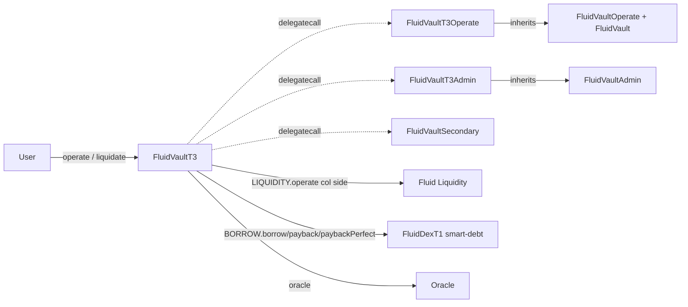

# Vault T3 — SPEC

## 1. Purpose

`FluidVaultT3` is the Fluid vault type with **normal ERC-20 / native collateral and smart (DEX) debt**. Collateral is deposited / withdrawn directly through Fluid Liquidity; debt is issued / repaid through a `FluidDexT1` pool (the immutable `BORROW` address). T3 is the structural mirror of T2: the same common engine and admin module are reused from [`vaultTypesCommon`](../vaultTypesCommon/SPEC.md); this spec covers only the T3-specific surface (smart-debt token flows, operate / liquidate signatures, the signed borrow-rate admin model).

See the [protocol overview](../SPEC.md), the [common engine SPEC](../vaultTypesCommon/SPEC.md), and the [DEX poolT1 SPEC](../../dex/poolT1/SPEC.md).

## 2. Architecture



Files:
- `coreModule/main.sol` — `FluidVaultT3` thin wrapper. Routes `operate` / `operatePerfect` to `OPERATE_IMPLEMENTATION`. Implements `liquidate` / `liquidatePerfect` directly, with `_debtLiquidateBefore` / `_debtLiquidatePerfectPayback` handling DEX payback before invoking the shared `_liquidate`.
- `coreModule/mainOperate.sol` — `FluidVaultT3Operate` (delegatecall target): smart-debt `_debtOperateBefore` / `_debtOperatePerfectBefore` / `_debtOperatePerfectAfter` helpers + `operate` / `operatePerfect` entry points.
- `adminModule/main.sol` — `FluidVaultT3Admin` extends `FluidVaultAdmin`: `updateSupplyRateMagnifier(uint)`, `updateBorrowRate(int)`, combined `updateCoreSettings`.
- `adminModule/events.sol` — `VaultT3Events`.

No new storage; uses the shared `Variables` layout ([vaultTypesCommon SPEC §6](../vaultTypesCommon/SPEC.md#6-storage-layout)). `TYPE = VAULT_T3_SMART_DEBT`. `SUPPLY_TOKEN` is a plain ERC-20 / native token, `SUPPLY` is Liquidity; `BORROW_TOKEN0 / BORROW_TOKEN1` are DEX underlying tokens and `BORROW` is the DEX pool (typed as `ILiquidityDexCommon`).

## 3. External Interactions

- **Fluid Liquidity (`LIQUIDITY`)** — `operate` for the collateral leg (supply / withdraw), `readFromStorage` for exchange prices / user-supply.
- **BORROW (FluidDexT1 pool)** — `borrow(token0, token1, maxShares, to, false)` / `payback(token0Amt, token1Amt, minShares, false)` for non-proportional debt; `paybackPerfect` / `paybackPerfectInOneToken` for share-targeted payback; `borrowPerfect` for share-targeted borrow.
- **Oracle** — via `AddressCalcs.addressCalc(DEPLOYER_CONTRACT, oracleNonce)`.
- **Factory** — `mint`, `ownerOf`, `isGlobalAuth` / `isVaultAuth`.
- **`dexCallback`** — DEX calls back during its own `borrow` / `payback`; only `BORROW` accepted.
- **`liquidityCallback`** — only `LIQUIDITY` accepted.

## 4. Capabilities & Responsibilities

- Let users deposit / withdraw collateral (real token) and mint / burn debt shares (via DEX) in a single call. Debt is denominated in **shares**; collateral is denominated in raw token units.
- Two entry modes:
  - `operate(newCol, newDebtToken0, newDebtToken1, debtSharesMinMax, ...)` — user specifies token amounts; DEX returns / consumes shares; vault records the share delta.
  - `operatePerfect(newCol, perfectDebtShares, debtToken0MinMax, debtToken1MinMax, ...)` — user specifies exact share delta; DEX computes tokens within min / max bounds.
- Liquidation: liquidator supplies debt in tokens (`token0DebtAmt_`, `token1DebtAmt_`), DEX `payback` computes share count, vault burns that many debt shares and releases collateral.
- Admin: **unsigned supply-rate magnifier** (bits 0–15) and **signed borrow rate** (bits 16–31). Signed borrow rate allows protocol to charge positive rate (bit at 16 = 1 and abs value in 17–31) or subsidize negative rate (borrow-side incentive).

## 5. Roles & Access Control

Identical to T2 (see [vaultT2 SPEC §5](../vaultT2/SPEC.md#5-roles--access-control)), with the DEX role on the debt side instead of the collateral side. `rebalance(int,int,int,int)` is inherited from the common engine; the `BORROW` (DEX) address replaces `SUPPLY` as the expected `dexCallback` caller.

## 6. Storage Layout

No new storage. T3-specific bit semantics in `vaultVariables2`:

| Bits | Field |
| --- | --- |
| 0–15 | Supply-rate magnifier (unsigned, ≤ `X16`) |
| 16–31 | **Signed borrow rate** (bit 16 = sign: 1=positive/charged, 0=negative/incentive; bits 17–31 = abs value, 1e2 precision, range `-X15..X15`) |

Everything else matches the shared layout.

## 7. User / Public Methods

### operate

```solidity
function operate(
    uint    nftId_,
    int     newCol_,
    int     newDebtToken0_,
    int     newDebtToken1_,
    int     debtSharesMinMax_,
    address to_
) external payable returns (uint nftId, int supplyAmt, int borrowAmt)
```

- **Dispatch:** `_spell(OPERATE_IMPLEMENTATION, msg.data)`, guarded by `_dexFromAddress`.
- **`newCol_`:** plain collateral delta on Liquidity. `type(int).min` = max withdraw (resolved amount in return).
- **`debtSharesMinMax_`:**
  - `> 0` — borrow: mints debt shares; requires both `newDebtToken0_ ≥ 0`, `newDebtToken1_ ≥ 0`, at least one `> 0`.
  - `< 0` — payback: burns shares; requires both `≤ 0`, at least one `< 0`.
  - `0` — no debt leg; both token deltas must also be 0.
- **`to_`:** `address(0)` defaults to `msg.sender`.
- **ETH:** exact match for native collateral deposit (`newCol_ > 0` with `SUPPLY_TOKEN == NATIVE_TOKEN`); native debt payback handled through DEX `payback{value:...}` internally.
- **Owner check:** required if `newCol_ < 0` or `debtSharesMinMax_ > 0`.
- **Returns:** `(nftId, newCol, debtSharesDelta)`.
- **Events:** `LogOperate` with `debtAmt = debtShares` (share-space).

### operatePerfect

```solidity
function operatePerfect(
    uint    nftId_,
    int     newCol_,
    int     perfectDebtShares_,
    int     debtToken0MinMax_,
    int     debtToken1MinMax_,
    address to_
) external payable returns (uint nftId, int256[] memory r)
```

Return array:
- `r[0]` — resolved `newCol_` (changes only on `type(int).min` max withdraw).
- `r[1]` — final `perfectDebtShares_` (changes only on max payback).
- `r[2]`, `r[3]` — token0 / token1 amounts borrowed (positive) or paid back (negative).

Sign rules for `debtToken{0,1}MinMax_`:
- **Borrow (`perfectDebtShares_ > 0`):** both min/max must be `> 0` (max tokens to receive).
- **Payback (`perfectDebtShares_ < 0`):** at least one must be `< 0` (max tokens to spend, expressed as negative).
- Any sign mismatch reverts `VaultDex__InvalidOperateAmount`.

### liquidate

```solidity
function liquidate(
    uint256 token0DebtAmt_,
    uint256 token1DebtAmt_,
    uint256 debtSharesMin_,
    uint256 colPerUnitDebt_,   // 1e18, collateral token per debt share
    address to_,
    bool    absorb_
) external payable returns (uint actualDebtShares, uint actualCol)
```

- **Flow:** `_debtLiquidateBefore(token0DebtAmt, token1DebtAmt, debtSharesMin)` calls DEX `payback` first → returns actual shares paid. Shared `_liquidate(sharesPaid, colPerUnitDebt, to_, absorb_, ...)` walks ticks and releases raw collateral via Liquidity.
- **Guardrail:** `actualDebtShares_ < sharesPaid_` reverts `VaultDex__DebtSharesPaidMoreThanAvailableLiquidation` — catches the edge case where liquidator paid back more debt tokens than the vault actually liquidated.
- `to_ == 0x...dEaD` → `FluidLiquidateResult` revert for simulation.
- Reentrancy + `_validateEth`.

### liquidatePerfect

```solidity
function liquidatePerfect(
    uint256 debtShares_,
    uint256 token0DebtAmtPerUnitShares_, // 1e18; 0 means payback all in token1
    uint256 token1DebtAmtPerUnitShares_, // 1e18; 0 means payback all in token0
    uint256 colPerUnitDebt_,
    address to_,
    bool    absorb_
) external payable returns (uint actualDebtShares, uint token0Debt, uint token1Debt, uint actualCol)
```

- **`debtShares_ == 0`:** absorb-only.
- **`debtShares_ > 0`:** runs the shared `_liquidate(debtShares_, ...)` (which now treats `debtShares_` as the share cap), then `_debtLiquidatePerfectPayback(actualDebtShares_, token0PerUnit, token1PerUnit)` routes to DEX `paybackPerfect` / `paybackPerfectInOneToken` depending on which per-unit-share is zero.

### Shared inherited

`rebalance(int,int,int,int)`, `simulateLiquidate`, `liquidityCallback`, `dexCallback`, `fallback`, `constantsView`.

## 8. Admin / Governance Methods

From `FluidVaultT3Admin`:

- `updateSupplyRateMagnifier(uint supplyRateMagnifier_)` — unsigned, `≤ X16`. Writes bits 0–15.
- `updateBorrowRate(int borrowRate_)` — signed; `|borrowRate_| ≤ X15`. Positive = protocol charges borrowers (standard); negative = borrow-side incentive. Encoded as `sign_bit | (abs << 1)` into bits 16–31.
- `updateCoreSettings(uint supplyRateMagnifier, int borrowRate, uint CF, uint liqThreshold, uint liqMaxLimit, uint withdrawGap, uint liqPenalty, uint borrowFee)` — bundles the invariants of the common setters.

Shared admin (`updateCollateralFactor`, `updateLiquidationThreshold`, …, `updateOracle`, `updateRebalancer`, `rescueFunds`, `absorbDustDebt`) inherited from `FluidVaultAdmin`.

## 9. Events

T3-specific (`VaultT3Events`): `LogUpdateSupplyRateMagnifier(uint)`, `LogUpdateBorrowRate(int)`, `LogUpdateCoreSettings(uint, int, uint, uint, uint, uint, uint, uint)`.

Shared events (`LogOperate`, `LogLiquidate`, `LogAbsorb`, `LogRebalance`, etc.) inherited.

## 10. Errors

Common vault errors (`31001..31019`, `33001..33009`) plus:

- `35001 VaultDex__InvalidOperateAmount` — sign / combination violations on smart-debt legs.
- `35002 VaultDex__ExcessSlippageLiquidation` — collateral-per-debt slippage bound not met.
- `35003 VaultDex__DebtSharesPaidMoreThanAvailableLiquidation` — liquidator paid more debt than liquidation availability; the remainder would be stranded, so the tx reverts.

## 11. Invariants & Safety Notes

- **`debtAmt` in `LogOperate` is share-space.** Off-chain aggregation must translate to token units using the DEX debt share price at the block of the event.
- **Debt payback during liquidation may revert on insufficient availability.** If DEX `payback` returns more shares than the tick walker can liquidate, `VaultDex__DebtSharesPaidMoreThanAvailableLiquidation` reverts; liquidators should quote against `simulateLiquidate` + `_debtLiquidateBefore` off-chain.
- **Perfect-mode sign rules.** Debt token min/max share the positive-for-borrow, negative-for-payback convention. One-token payback modes trigger explicitly via a zero in the other token's per-unit-share value.
- **Signed borrow rate encoding.** Bit 16 is the sign; integrators decoding `vaultVariables2[16:32]` must handle both halves.
- **`_validateEth`** asserts no stuck ETH post-op.

## 12. Trust Model & Accepted Trade-offs

- **DEX availability is required.** Payback / borrow paths depend on live DEX state. A DEX paused via its own admin module (`setPause`) or out of availability (insufficient liquidity) blocks T3 `operate` / `liquidate` on the debt side. This is by design; the vault is coupled to its DEX.
- **Oracle governs CF & liquidation trigger; DEX governs realized debt token splits.** Liquidator slippage on tokens is bounded only by `colPerUnitDebt_` + the `debtSharesMin_` (for non-perfect mode). DEX price manipulation therefore affects token mix, not the total collateral released.
- **Signed borrow rate can flip sign.** Governance can, in principle, invert the fee direction; this is an accepted admin power.
- **No `operateOnBehalfOf`.** Audit `V-04` — smart-debt vaults require the NFT owner for risky-direction legs.
- **Rebalancer trust.** Same as T2/T4 — rebalancer can move real tokens between vault and Liquidity / DEX within caller-supplied min/max per leg.

See also:
- [contracts/protocols/vault/vaultTypesCommon/SPEC.md](../vaultTypesCommon/SPEC.md) — engine.
- [contracts/protocols/dex/poolT1/SPEC.md](../../dex/poolT1/SPEC.md) — the DEX contract used for `BORROW`.
- [contracts/protocols/vault/SPEC.md](../SPEC.md) — protocol overview.
