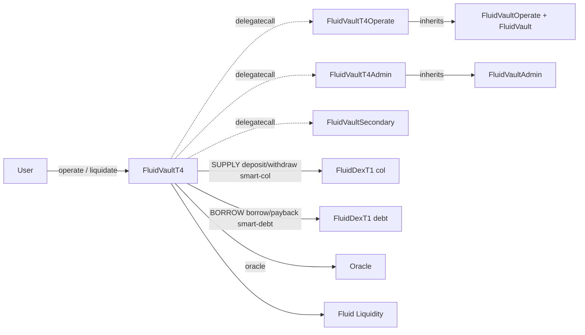

# Vault T4 — SPEC

## 1. Purpose

`FluidVaultT4` is the most complex Fluid vault type: **both collateral and debt are smart (DEX) positions**. It uses two distinct `FluidDexT1` pools (the immutable `SUPPLY` and `BORROW` addresses), each with its own `token0 / token1` pair. Collateral share accounting and debt share accounting are independent. The shared tick / branch engine from [`vaultTypesCommon`](../vaultTypesCommon/SPEC.md) is reused, and this spec covers only the T4-specific surface (four-token flows, dual per-unit-share parameters, dual signed rates).

See the [protocol overview](../SPEC.md), the [common engine SPEC](../vaultTypesCommon/SPEC.md), and the [DEX poolT1 SPEC](../../dex/poolT1/SPEC.md).

## 2. Architecture



Files:
- `coreModule/main.sol` — `FluidVaultT4` thin wrapper. Routes `operate` / `operatePerfect` to `OPERATE_IMPLEMENTATION`. Implements `liquidate` / `liquidatePerfect` directly, combining `_debtLiquidateBefore` (DEX payback), shared `_liquidate`, and `_colLiquidatePerfectAfter` (DEX withdraw).
- `coreModule/mainOperate.sol` — `FluidVaultT4Operate`: both smart-col and smart-debt helpers (`_colOperateBefore`, `_colOperatePerfectBefore/After`, `_debtOperateBefore`, `_debtOperatePerfectBefore/After`) plus `operate` / `operatePerfect` entry points with seven / seven parameters respectively.
- `adminModule/main.sol` — `FluidVaultT4Admin` extends `FluidVaultAdmin`: **signed** `updateSupplyRate(int)`, **signed** `updateBorrowRate(int)`, combined `updateCoreSettings`.
- `adminModule/events.sol` — `VaultT4Events`.
- `interfaces/iVaultT4.sol` — `IFluidVaultT4` for external consumers.

No new storage; shared `Variables` layout. `TYPE = VAULT_T4_SMART_COL_SMART_DEBT`. `SUPPLY_TOKEN0 / SUPPLY_TOKEN1`, `BORROW_TOKEN0 / BORROW_TOKEN1` are four distinct underlying tokens (or a subset with natives). `SUPPLY` and `BORROW` are the two DEX pools; they may be the same DEX (in principle) or two different DEXes.

## 3. External Interactions

- **SUPPLY DEX** — `deposit` / `withdraw` / `depositPerfect` / `withdrawPerfect` / `withdrawPerfectInOneToken` for collateral.
- **BORROW DEX** — `borrow` / `payback` / `borrowPerfect` / `paybackPerfect` / `paybackPerfectInOneToken` for debt.
- **Fluid Liquidity** — `readFromStorage` only; T4 does not call `LIQUIDITY.operate` directly for user flows (both sides route through DEXes). The DEXes themselves interact with Liquidity.
- **Oracle** — `getExchangeRateOperate` / `getExchangeRateLiquidate`; must satisfy `[1e9, 1e54]` bounds and `1e45` ratio cap. For T4 the oracle composes collateral-share-price and debt-share-price, so the deployed oracle must encode both legs correctly.
- **Factory** — `mint`, `ownerOf`, auth lookups.
- **`dexCallback`** accepted from either `SUPPLY` or `BORROW`.

## 4. Capabilities & Responsibilities

- Manage positions where **both legs are share-denominated**: collateral shares from `SUPPLY` DEX, debt shares from `BORROW` DEX.
- Two entry modes:
  - `operate(nftId, newColToken0, newColToken1, colSharesMinMax, newDebtToken0, newDebtToken1, debtSharesMinMax, to)` — token amounts + share caps for both legs.
  - `operatePerfect(nftId, perfectColShares, colToken0MinMax, colToken1MinMax, perfectDebtShares, debtToken0MinMax, debtToken1MinMax, to)` — exact share deltas both sides.
- Liquidation requires per-unit-share bounds for both collateral tokens **and** both debt tokens.
- Admin: both rates are signed (range `-X15..X15`); either side can be incentive or charged independently.

## 5. Roles & Access Control

Same role surface as T2/T3, with two DEXes on the callback side. Both `SUPPLY` and `BORROW` are accepted `dexCallback` callers. All other access rules (NFT owner for risky legs, permissionless liquidation, rebalancer, factory auths) are unchanged.

## 6. Storage Layout

No new storage. T4-specific bit semantics in `vaultVariables2`:

| Bits | Field |
| --- | --- |
| 0–15 | **Signed supply rate** (bit 0 = sign, bits 1–15 = abs value, `|v| ≤ X15`, 1e2 precision) |
| 16–31 | **Signed borrow rate** (bit 16 = sign, bits 17–31 = abs value) |

## 7. User / Public Methods

### operate

```solidity
function operate(
    uint    nftId_,
    int     newColToken0_,
    int     newColToken1_,
    int     colSharesMinMax_,
    int     newDebtToken0_,
    int     newDebtToken1_,
    int     debtSharesMinMax_,
    address to_
) external payable returns (uint nftId, int supplyShares, int borrowShares)
```

- **Dispatch:** `_spell(OPERATE_IMPLEMENTATION, msg.data)` guarded by `_dexFromAddress`.
- **Collateral leg:** same sign rules as T2 `operate` — `colSharesMinMax_` positive = deposit (token amounts ≥ 0, at least one > 0); negative = withdraw (token amounts ≤ 0, at least one < 0); 0 = skip.
- **Debt leg:** same sign rules as T3 `operate`.
- **`to_`:** `address(0)` defaults to `msg.sender`.
- **ETH:** exact match for the side that contains native token on a deposit leg (collateral) or a borrow leg (debt goes to `to_`); excess refunded on payback.
- **Owner check:** required if `colSharesMinMax_ < 0` (withdraw) or `debtSharesMinMax_ > 0` (borrow).
- **Reentrancy** via bit 0; `_validateEth` on exit.
- **Returns:** `(nftId, colShareDelta, debtShareDelta)` — both share-space.
- **Events:** `LogOperate` with both `colAmt` and `debtAmt` in share space.

### operatePerfect

```solidity
function operatePerfect(
    uint    nftId_,
    int     perfectColShares_,
    int     colToken0MinMax_,
    int     colToken1MinMax_,
    int     perfectDebtShares_,
    int     debtToken0MinMax_,
    int     debtToken1MinMax_,
    address to_
) external payable returns (uint nftId, int256[] memory r)
```

Return array (length 6):
- `r[0]` — final `perfectColShares_` (changes only on max-withdraw sentinel).
- `r[1]`, `r[2]` — token0 / token1 collateral amounts (signed by leg direction).
- `r[3]` — final `perfectDebtShares_` (changes only on max-payback sentinel).
- `r[4]`, `r[5]` — token0 / token1 debt amounts.

Sign rules inherit from T2 (collateral) and T3 (debt) — positive bounds for deposit / borrow, negative for withdraw / payback, zero to skip a token.

### liquidate

```solidity
function liquidate(
    uint256 token0DebtAmt_,
    uint256 token1DebtAmt_,
    uint256 debtSharesMin_,
    uint256 colPerUnitDebt_,            // shares-per-share, 1e18
    uint256 token0ColAmtPerUnitShares_, // 1e18
    uint256 token1ColAmtPerUnitShares_, // 1e18
    address to_,
    bool    absorb_
) external payable returns (uint actualDebtShares, uint actualColShares, uint token0Col, uint token1Col)
```

Flow:
1. `_debtLiquidateBefore(token0DebtAmt, token1DebtAmt, debtSharesMin)` → DEX `BORROW.payback` returns `sharesPaid_`.
2. Shared `_liquidate(sharesPaid_, colPerUnitDebt_, to_, absorb_, vaultVariables_)` walks ticks → returns `actualDebtShares`, `actualColShares`.
3. Guard: `actualDebtShares_ < sharesPaid_` reverts `VaultDex__DebtSharesPaidMoreThanAvailableLiquidation`.
4. `_colLiquidatePerfectAfter(actualColShares_, token0ColAmtPerUnitShares_, token1ColAmtPerUnitShares_, to_)` routes DEX `SUPPLY.withdrawPerfect` / `withdrawPerfectInOneToken` based on which per-unit-share is zero.

`to_ = 0x...dEaD` → `FluidLiquidateResult` revert for simulation. Reentrancy + `_validateEth`.

### liquidatePerfect

```solidity
function liquidatePerfect(
    uint256 debtShares_,
    uint256 token0DebtAmtPerUnitShares_,
    uint256 token1DebtAmtPerUnitShares_,
    uint256 colPerUnitDebt_,
    uint256 token0ColAmtPerUnitShares_,
    uint256 token1ColAmtPerUnitShares_,
    address to_,
    bool    absorb_
) external payable returns (uint actualDebtShares, uint token0Debt, uint token1Debt, uint actualColShares, uint token0Col, uint token1Col)
```

- **`debtShares_ == 0`:** absorb-only; no DEX calls beyond what absorb needs.
- **`debtShares_ > 0`:** runs `_liquidate(debtShares_, ...)`, then `_debtLiquidatePerfectPayback` (DEX payback), then `_colLiquidatePerfectAfter` (DEX withdraw).

### Shared inherited

`rebalance(int,int,int,int)` (all four legs active here — two for smart-col token drift, two for smart-debt), `simulateLiquidate`, `liquidityCallback`, `dexCallback`, `fallback`, `constantsView`.

## 8. Admin / Governance Methods

From `FluidVaultT4Admin`:
- `updateSupplyRate(int supplyRate_)` — `|supplyRate_| ≤ X15`, 1e2 precision. Writes bits 0–15.
- `updateBorrowRate(int borrowRate_)` — `|borrowRate_| ≤ X15`. Writes bits 16–31.
- `updateCoreSettings(int supplyRate, int borrowRate, uint CF, uint liqThreshold, uint liqMaxLimit, uint withdrawGap, uint liqPenalty, uint borrowFee)` — combined write with standard invariants (`CF < threshold < maxLimit`, `maxLimit + penalty ≤ 9970`, `withdrawGap ≤ 1000`, `liqPenalty/borrowFee ≤ X10`).

All other setters inherited from `FluidVaultAdmin`.

## 9. Events

T4-specific (`VaultT4Events`): `LogUpdateSupplyRate(int)`, `LogUpdateBorrowRate(int)`, `LogUpdateCoreSettings(int, int, uint, uint, uint, uint, uint, uint)`.

Shared events inherited.

## 10. Errors

Shared vault errors plus:
- `35001 VaultDex__InvalidOperateAmount` — sign / combination violations on either smart-col or smart-debt legs.
- `35002 VaultDex__ExcessSlippageLiquidation`.
- `35003 VaultDex__DebtSharesPaidMoreThanAvailableLiquidation`.

## 11. Invariants & Safety Notes

- **Both rates signed.** Bit 0 and bit 16 are sign bits; decode both halves separately.
- **Both `colAmt` and `debtAmt` in `LogOperate` are share-space.** Off-chain consumers must translate both using respective DEX share prices.
- **Oracle must compose both sides.** The T4 oracle price maps collateral-share-price to debt-share-price; governance is responsible for deploying an oracle that accurately reflects both DEX share prices. A mis-composed oracle can cause correct-looking positions to be instantly liquidatable or unliquidatable.
- **Two DEXes in the critical path.** Any DEX-level pause or insufficient availability on either side blocks the corresponding leg of `operate` / `liquidate`.
- **Liquidator must price both tokens for both legs.** `colPerUnitDebt_` bounds collateral shares per debt share; `token0/1ColAmtPerUnitShares_` and `token0/1DebtAmtPerUnitShares_` bound the realized tokens in / out of each DEX. Failure to hit any bound reverts.
- **Rebalancer `int` parameters are four independent knobs.** On T4 all four legs (colToken0, colToken1, debtToken0, debtToken1) are used; zero = skip.
- **`_validateEth`** guards against stuck ETH on either side.

## 12. Trust Model & Accepted Trade-offs

- **Dual DEX + oracle dependency.** T4 is the vault type with the largest attack surface on external pricing. The protocol accepts that liquidation payout is priced off live DEX state, not the oracle, and that the oracle governs the CF / liquidation trigger only.
- **`operateOnBehalfOf` intentionally absent.** Risky legs require NFT owner.
- **Vault factory-mint NFT id shared with other types.** Integrators interpret `(vault, id)` pairs.
- **Absorb / rebalance / dust-debt accounting** follow the shared engine; T4 inherits all dispositions on these.
- **Signed supply / borrow rate encoding** in the vault2 slot has been reviewed; the bit layout above reflects deployed behavior.

See also:
- [contracts/protocols/vault/vaultTypesCommon/SPEC.md](../vaultTypesCommon/SPEC.md) — engine.
- [contracts/protocols/dex/poolT1/SPEC.md](../../dex/poolT1/SPEC.md) — the DEX contracts used for `SUPPLY` and `BORROW`.
- [contracts/protocols/vault/SPEC.md](../SPEC.md) — protocol overview (T4 comparison).
