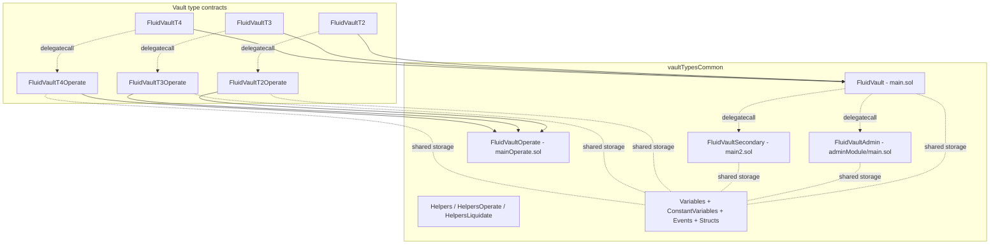

# Vault Types Common — SPEC

## 1. Purpose

`vaultTypesCommon` is the **shared implementation base** for Fluid vault types T2 / T3 / T4 (and conceptually mirrored by the standalone T1). It owns:

- The **packed storage layout** used by every vault (tick / branch liquidation engine, per-NFT `positionData`, rate magnifiers, exchange-price `rates` word).
- The **core `_operate` / `_liquidate` / `absorb` / `rebalance` implementations**, all centered on the tick / branch data structure.
- The **admin module** that writes risk parameters, oracle nonce, rebalancer, rate magnifiers, and rescue paths.
- The **delegatecall dispatch plumbing** (`_spell`, `_verifyCaller`, `_onlyDelegateCall`) that lets a vault proxy reuse the shared logic while keeping type-specific code (T2 / T3 / T4) thin.

The vault type contracts (see [vaultT2 SPEC](../vaultT2/SPEC.md), [vaultT3 SPEC](../vaultT3/SPEC.md), [vaultT4 SPEC](../vaultT4/SPEC.md)) inherit from here and add the DEX-side token-flow plumbing (T2: smart collateral; T3: smart debt; T4: both). The top-level [vault SPEC](../SPEC.md) gives the protocol overview. [vaultT1 SPEC](../vaultT1/SPEC.md) is structurally parallel — T1 predates this shared base and keeps its own storage file; semantics are documented to match.

## 2. Architecture



Files under `contracts/protocols/vault/vaultTypesCommon/`:

- `common/variables.sol` — `Variables`: packed storage words (`vaultVariables`, `vaultVariables2`, `rates`, `positionData`, `tickHasDebt`, `tickData`, `tickId`, `branchData`, `absorbedLiquidity`, `absorbedDustDebt`, `rebalancer`, `dexFromAddress`).
- `common/tokenTransfers.sol` — safe-transfer helpers (ETH-aware) used by helpers and secondary.
- `coreModule/constantVariables.sol` — immutables: `LIQUIDITY`, `VAULT_FACTORY`, `DEPLOYER_CONTRACT`, `TYPE` (one of `VAULT_T1 | VAULT_T2_SMART_COL | VAULT_T3_SMART_DEBT | VAULT_T4_SMART_COL_SMART_DEBT`), `SUPPLY`, `BORROW`, `SUPPLY_TOKEN0`, `SUPPLY_TOKEN1`, `BORROW_TOKEN0`, `BORROW_TOKEN1` (as `ILiquidityDexCommon`-typed addresses when smart), `OPERATE_IMPLEMENTATION`, `ADMIN_IMPLEMENTATION`, `SECONDARY_IMPLEMENTATION`, pre-computed Liquidity slot pointers, `NATIVE_TOKEN`, `DEAD_ADDRESS`, `EXCHANGE_PRICES_PRECISION = 1e12`, masks `X8..X128` (`X96` in place of "X48").
- `coreModule/structs.sol` — in-memory `Operate_`, `Liquidate_`, `Tick_`, `Branch_` etc.
- `coreModule/events.sol` — `LogOperate`, `LogUpdateExchangePrice`, `LogLiquidate`, `LogAbsorb`, `LogRebalance`.
- `coreModule/helpers.sol` — `Helpers`: `_dexFromAddress` modifier, `_updateExchangePrice`, oracle read, CF check, tick helpers, `fetchLatestPosition`.
- `coreModule/helpersOperate.sol` — `HelpersOperate`: tick <-> branch math, top-tick transitions, `_setNewTopTick`, raw <-> share normalization.
- `coreModule/helpersLiquidate.sol` — `HelpersLiquidate`: small reusable liquidate helpers.
- `coreModule/main.sol` — `FluidVault`: inherits `Helpers + HelpersLiquidate`. Contains `_liquidate` (~700 LOC liquidation walker), `rebalance(int,int,int,int)` wrapper, `liquidityCallback`, `dexCallback`, `simulateLiquidate`, `fallback`, `_spell`.
- `coreModule/main2.sol` — `FluidVaultSecondary`: `absorb` (public), `rebalance` (delegatecalled), `updateExchangePrices` helpers used by rewards reads.
- `coreModule/mainOperate.sol` — `FluidVaultOperate`: the single shared `_operate` that computes new tick, CF, withdrawal gap, Liquidity / DEX calls, and emits `LogOperate`.
- `adminModule/main.sol` — `FluidVaultAdmin`: `_verifyCaller` (delegatecall only) + setters.
- `adminModule/events.sol` — one `LogUpdate...` event per setter, plus `LogRescueFunds`, `LogAbsorbDustDebt`.

Dispatch model mirrors DEX poolT1: the proxy vault owns all storage; `_spell(OPERATE_IMPLEMENTATION, msg.data)` dispatches the `operate` / `operatePerfect` path into the type-specific operate implementation; `fallback` dispatches admin calls to `ADMIN_IMPLEMENTATION`; `rebalance(int,int,int,int)` and absorb paths dispatch into `SECONDARY_IMPLEMENTATION`.

## 3. External Interactions

- **Fluid Liquidity** — `LIQUIDITY.operate(...)` for the non-smart side of the vault, plus `readFromStorage` for exchange prices / user-supply / user-borrow. `liquidityCallback(token, amount, data)` is accepted when `msg.sender == LIQUIDITY` and the vault is inside an in-flight op.
- **DEX (`SUPPLY` / `BORROW`)** — for smart sides the `ILiquidityDexCommon` addresses are actual DEX pools. `dexCallback(token, amount)` is accepted when `msg.sender ∈ {SUPPLY, BORROW}`; funds flow from `dexFromAddress` into Liquidity during the callback.
- **Oracle (`IFluidOracle`)** — resolved via `AddressCalcs.addressCalc(DEPLOYER_CONTRACT, oracleNonce)`. Called with `getExchangeRateOperate()` during CF-affecting ops, `getExchangeRateLiquidate()` inside the liquidation loop. Prices are clamped to `[1e9, 1e54]` bounds; final ratio is capped at `1e45`.
- **Factory (`VAULT_FACTORY`)** — `mint(vaultId, user)` when `nftId_ == 0`; `ownerOf(nftId)` for owner checks; `isGlobalAuth(caller) || isVaultAuth(vault, caller)` inside `fallback`.
- **Callers**
  - Users via the type-specific `operate` / `operatePerfect`.
  - Liquidators via the type-specific `liquidate` / `liquidatePerfect`.
  - Rebalancer via `rebalance(int,int,int,int)` (T2/T3/T4) — T1 has a parameterless `rebalance()` on its core.
  - Factory-authorized admins via `fallback`.

## 4. Capabilities & Responsibilities

- **Own the storage contract.** Every vault instance's state — reentrancy bit, top tick, supply / borrow totals, per-NFT collateral / debt, tick / branch graph — lives in this layout.
- **Operate engine.** `_operate` normalizes signed collateral / debt deltas, enforces owner / dust / sign / msg.value constraints, updates `positionData`, reassigns ticks, walks branches where needed, does the outward Liquidity / DEX calls in the correct order, and runs CF + withdrawal-gap checks against the oracle.
- **Liquidation engine.** `_liquidate` walks from the current top tick down to the tick implied by `liquidationTick`, computing debt paid, collateral taken out, and updating branches when partial liquidations straddle a tick. Handles `absorb_ == true` (using the absorbed buffer first).
- **Absorb.** Clears positions above the `liquidationMaxLimit` ratio, records absorbed amounts, and closes branches that cross the absorb tick.
- **Rebalance.** Reconciles vault-recorded supply / borrow (possibly denominated in shares for smart sides) against the actual Liquidity / DEX reserves; net drift is moved to / from the rebalancer address.
- **Exchange-price accrual.** `_updateExchangePrice` advances vault supply / borrow exchange prices per-block, driven by `vaultVariables2` magnifiers and Liquidity exchange price deltas.
- **Admin settings.** Publishes a typed setter for every risk parameter. Each setter re-accrues exchange prices before the write so magnifier transitions are observed only from that moment forward.
- **Dust cleanup.** `absorbDustDebt` converts liquidated positions whose debt rounds to dust into supply-only NFTs, preventing the tick / branch graph from accumulating untouchable debt.

## 5. Roles & Access Control

- **Users** — call type-specific `operate` / `operatePerfect` on the vault. Only the NFT owner can perform risky-direction moves (withdraw collateral, borrow more debt).
- **Liquidators** — call type-specific `liquidate` / `liquidatePerfect` on any underwater NFT. `liquidate(..., to_=DEAD_ADDRESS, ...)` is the simulation revert path.
- **Rebalancer** — single address stored in `rebalancer`. Only caller of `rebalance(int,int,int,int)`.
- **`SUPPLY` / `BORROW` (DEX pools)** — only accepted callers of `dexCallback`. Fluid Liquidity is the only accepted caller of `liquidityCallback`.
- **Factory auths** — reach admin module via the vault's `fallback`. `_verifyCaller` in each admin method re-asserts the delegatecall origin (`address(this) != THIS_ADDRESS_SENTINEL`).
- **Factory owner** (resolved through `VAULT_FACTORY.isGlobalAuth`) — implicit super-auth.

## 6. Storage Layout

### `vaultVariables` (slot 0)

| Bits | Field |
| --- | --- |
| 0 | Reentrancy bit (1 while inside a vault op) |
| 1 | Active-branch-liquidated flag |
| 2–21 | Top tick (sign bit + 19-bit absolute tick index) |
| 22–51 | Current branch id |
| 52–81 | Total branch id (monotonic) |
| 82–145 | Total supply raw (BigNumber encoding) |
| 146–209 | Total borrow raw (BigNumber encoding) |
| 210–241 | Total positions (monotonic NFT count for this vault) |

### `vaultVariables2` (slot 1)

| Bits | Field |
| --- | --- |
| 0–15 | Supply-rate magnifier (T1 / T3) or signed supply rate (T2 / T4) |
| 16–31 | Borrow-rate magnifier (T1 / T2) or signed borrow rate (T3 / T4) |
| 32–41 | Collateral factor |
| 42–51 | Liquidation threshold |
| 52–61 | Liquidation max limit |
| 62–71 | Withdraw gap |
| 72–81 | Liquidation penalty |
| 82–91 | Borrow fee |
| 92–121 | Oracle nonce (`AddressCalcs.addressCalc(DEPLOYER_CONTRACT, nonce)`) |
| 122–154 | Last-update timestamp (used to advance exchange prices) |

### `rates` (slot 2)

Four 64-bit words (each at `1e12` precision): Liquidity supply exchange price, Liquidity borrow exchange price, vault supply exchange price, vault borrow exchange price.

### `positionData[nftId]`

Per-NFT packed: position type (supply vs borrow), tick sign + absolute value + local id, collateral raw (BigNumber), dust debt raw (BigNumber).

### Tick / branch mapping

- `tickHasDebt[parentId]` — bitset per 256 ticks indicating which ticks currently hold debt.
- `tickData[tick]` — liquidation flag, tick id counter, and either raw debt (active) or liquidation metadata (100% flag, branch id, debt factor) when liquidated.
- `tickId[tick][slot]` — up to three 85-bit historical liquidation records per slot, used when tick ids roll.
- `branchData[branchId]` — branch state (0 = not liquidated, 1 = liquidated, 2 = merged, 3 = closed), minima tick, two partials (interpolation between `tick` ratio and `tick-1`), branch debt, debt factor or connection factor, link to base branch and base minima tick.

### Auxiliary slots

- `absorbedLiquidity[nftId]` — pending absorb payout buffer per NFT.
- `absorbedDustDebt` — vault-level counter for dust debt written off.
- `rebalancer` — address allowed to call `rebalance(int,int,int,int)`.
- `dexFromAddress` — transient address used during DEX callbacks; `DEAD_ADDRESS` when idle.

## 7. User / Public Methods

Note: the public, type-specific `operate` / `operatePerfect` live on each vault type contract (T2/T3/T4) and forward to the shared `_operate` via `_spell(OPERATE_IMPLEMENTATION, msg.data)`. The methods below are the ones callable directly on the core shared contract.

### rebalance

```solidity
function rebalance(
    int256 colToken0MinMax_,
    int256 colToken1MinMax_,
    int256 debtToken0MinMax_,
    int256 debtToken1MinMax_
) external payable returns (int256 supplyAmt_, int256 borrowAmt_)
```

- Access: `msg.sender == rebalancer` (set via `updateRebalancer`).
- Sets reentrancy bit, resolves `dexFromAddress`, accrues exchange prices.
- Compares vault-recorded vs live Liquidity / DEX reserves. If vault has less supply than it should, it pulls from the rebalancer (via DEX `depositPerfect` on smart col, or Liquidity `operate` otherwise). If vault has less borrow than it should, it pushes debt repayment; etc.
- Each leg's min / max bound comes from the four `int256` parameters. A value of `0` means "no rebalance on this leg"; positive / negative signs indicate direction; `try/catch` around individual DEX calls converts reverts to zero-movement (so a single-leg failure does not block the whole tx).
- Emits `LogRebalance`. Validates ETH equality (`_validateEth`).

### simulateLiquidate

```solidity
function simulateLiquidate(
    uint256 debtAmt_,
    int256 colPerUnitDebt_
) external
```

Sets the reentrancy bit, calls `_liquidate(debtAmt_, colPerUnitDebt_, DEAD_ADDRESS, false)`, then `revert()`. Intended to be used as a staticcall from off-chain / resolvers; no state is persisted. Type-specific variants on T2/T3/T4 pass additional share / slippage parameters.

### liquidityCallback

```solidity
function liquidityCallback(address token_, uint256 amount_, bytes calldata data_) external
```

Accepted only when `msg.sender == LIQUIDITY`, reentrancy bit is set, and the decoded `data` matches the protocol pattern. Settles token pulls during a vault-initiated Liquidity `operate`.

### dexCallback

```solidity
function dexCallback(address token_, uint256 amount_) external
```

Accepted only when `msg.sender ∈ {SUPPLY, BORROW}` and `dexFromAddress != DEAD_ADDRESS`. Pulls `amount_` of `token_` from `dexFromAddress` to Liquidity.

### fallback

Delegatecall dispatcher for admin methods. Requires `VAULT_FACTORY.isGlobalAuth(msg.sender) || VAULT_FACTORY.isVaultAuth(address(this), msg.sender)`, then `_spell(ADMIN_IMPLEMENTATION, msg.data)`.

### readFromStorage

Inherited. Raw `sload(slot)`; no auth.

### absorb (on `FluidVaultSecondary`)

```solidity
function absorb(uint256 vaultVariables_, int256 maxTick_) public returns (uint256)
```

- Access: `_verifyCaller` — only reachable via `delegatecall` from the core `_liquidate` path.
- Walks ticks above `maxTick_`, marking them 100% liquidated, closing branches, accumulating `absorbedLiquidity` entries, and returning the new `vaultVariables_`.
- Emits `LogAbsorb`.

## 8. Admin / Governance Methods

All methods on `FluidVaultAdmin` (`adminModule/main.sol`). Each runs `_verifyCaller` (delegatecall only) and re-accrues exchange prices before the write (except `absorbDustDebt`, which only guards reentrancy).

- `updateCollateralFactor(uint256)` — bits 32–41. Must be `<` the liquidation threshold.
- `updateLiquidationThreshold(uint256)` — bits 42–51. Must satisfy `CF < threshold < maxLimit`.
- `updateLiquidationMaxLimit(uint256)` — bits 52–61. Combined with the liquidation penalty, capped at 99.7%.
- `updateWithdrawGap(uint256)` — bits 62–71. `<=` 100%.
- `updateLiquidationPenalty(uint256)` — bits 72–81.
- `updateBorrowFee(uint256)` — bits 82–91.
- `updateOracle(uint256 newOracleNonce_)` — writes bits 92–121. Before the write, probes the oracle with both `getExchangeRateOperate()` and `getExchangeRateLiquidate()` to sanity-check.
- `updateRebalancer(address)` — stores `rebalancer`. Must be non-zero.
- `rescueFunds(address token_)` — sweeps any stuck balance on the vault to Liquidity (so normal accounting picks it up downstream).
- `absorbDustDebt(uint256[] nftIds_)` — reentrancy-guarded. For each liquidated position where remaining debt rounds to dust, converts it to a supply-only NFT and bumps `absorbedDustDebt` so `rebalance` can true up the total-borrow accounting.

Each setter emits a corresponding `LogUpdate...` event.

## 9. Events

Core (`coreModule/events.sol`):

- `LogOperate(user, nftId, colAmt, debtAmt, to)` — emitted inside `_operate`. For smart types, `colAmt` / `debtAmt` are **share deltas** (int, shares / 1e18-normalized), not token amounts.
- `LogUpdateExchangePrice(supplyExPrice, borrowExPrice)`
- `LogLiquidate(liquidator, debtAmt, colAmt, to)`
- `LogAbsorb(colAbsorbed, debtAbsorbed)`
- `LogRebalance(supplyDelta, borrowDelta)`

Admin (`adminModule/events.sol`): `LogUpdateCollateralFactor`, `LogUpdateLiquidationThreshold`, `LogUpdateLiquidationMaxLimit`, `LogUpdateWithdrawGap`, `LogUpdateLiquidationPenalty`, `LogUpdateBorrowFee`, `LogUpdateOracle`, `LogUpdateRebalancer`, `LogRescueFunds`, `LogAbsorbDustDebt`.

## 10. Errors

Raised as `FluidVaultError(uint256)` (from the top-level `contracts/protocols/vault/error.sol`). Relevant code groups for this module:

- `31001–31038` — vault core (reentrancy, amounts, msg.value, owner, tick, CF, slippage, rebalancer, NFT, Liquidity callback, delegate-call, transfers, exchange price, oracle, DEX callback, rebalance min/max).
- `33001–33009` — vault admin (limits, delegate-call, dust NFT / debt).
- `35001–35002` — DEX-type runtime (operate amount invalid on smart sides, liquidation share slippage).

Simulation revert `FluidLiquidateResult(uint256 debtAmount, uint256 collateralAmount)` is used as the return channel for `simulateLiquidate`.

## 11. Invariants & Safety Notes

- **Reentrancy on bit 0 of `vaultVariables`.** Every external mutating path sets it on entry and clears it on exit. `liquidityCallback` / `dexCallback` explicitly require the bit be set, so stray callbacks revert.
- **Liquidity exchange prices are monotonic non-decreasing.** `_updateExchangePrice` asserts each new Liquidity supply / borrow price is `>=` the stored one; violation reverts `Vault__InvalidExchangePrice`.
- **Oracle ratio cap at 1e45.** In `getExchangeRateOperate` / `getExchangeRateLiquidate`, the ratio is clamped.
- **Tick math correctness depends on `TickMath`.** See [SPEC-tickMath](../../../libraries/SPEC-tickMath.md). Invariants include `type(int).min` / `type(int).max` tick paths being unreachable.
- **Branch debt haircut 0.01%.** `fetchLatestPosition` applies `branchDebt * 9999 / 10000` on merge walks, preventing branch debt from reaching zero and causing division errors.
- **CF > current ratio on risky ops.** Any increase of debt or decrease of collateral must result in a ratio satisfying `< collateralFactor * oraclePrice`. Else reverts `Vault__PositionAboveCF`.
- **Withdrawal gap** subtracts a user-configured percentage from max withdraw on every op; smart-col variant evaluates on the post-DEX supply side.
- **Tick data layout is asymmetric for negative ticks.** `parentId = i / 256` for positive and `((i + 1) / 256) - 1` for negative; callers must respect the formula when reading `tickHasDebt` directly.
- **`rates` slot is authoritative.** Exchange prices written here are the source of truth for user-facing conversions; the vault supply / borrow exchange prices evolve via `vaultVariables2` magnifiers. Downstream resolvers must always read through `_updateExchangePrice` (or its simulation helpers) rather than multiplying Liquidity prices naively.
- **`dexFromAddress` must be reset.** Any path that sets it to a user address must reset to `DEAD_ADDRESS` on exit; callbacks check this to avoid cross-tx reuse.

## 12. Trust Model & Accepted Trade-offs

- **Operate ignores ERC-721 approvals.** Only the NFT owner may perform risky legs; approvals govern transfers but not vault operations. Intentional.
- **Same monotonic NFT id space across vault types.** Positions must be interpreted as `(vault, id)` pairs. Integrators relying on bare NFT ids break across vaults.
- **Liquidation of T2/T3/T4 uses live DEX for share conversion.** Oracle is used only for ratio / CF math. Listing discipline on the underlying DEX is therefore part of the trust model.
- **BigMath libraries are the safe minified / vault variants.** `BigMathUnsafe` is not used in production vault code.
- **`simulateLiquidate` uses dead-address + revert for quoting.** Integrators must catch and decode; this is by design.
- **Bad-debt absorption is governance-driven.** No live user-facing incentive for `absorbDustDebt` / absorb; keepers / governance monitor and fire.
- **Rebalancer is a trusted role.** It can move real tokens between the vault and Liquidity / DEX within min / max bounds; there is no economic cap on single-call drift.
- **Class-0 Liquidity.** Production vaults configure themselves as Liquidity class 0 (standard); class 1 is reserved.
- **Oracle trust.** A mis-set oracle nonce can mis-price CF / liquidation; `updateOracle` probes both oracle call paths before committing, but on-chain probes do not catch oracle malice.

See also:

- [contracts/protocols/vault/SPEC.md](../SPEC.md) — protocol overview.
- [contracts/protocols/vault/vaultT1/SPEC.md](../vaultT1/SPEC.md), [vaultT2 SPEC](../vaultT2/SPEC.md), [vaultT3 SPEC](../vaultT3/SPEC.md), [vaultT4 SPEC](../vaultT4/SPEC.md) — per-type runtimes.
- [contracts/libraries/SPEC-tickMath.md](../../../libraries/SPEC-tickMath.md) — tick math.
- [contracts/libraries/SPEC-bigMath.md](../../../libraries/SPEC-bigMath.md) — BigNumber encoding used in `positionData`, `tickData`, `branchData`.
- [contracts/libraries/SPEC-liquidityCalcs.md](../../../libraries/SPEC-liquidityCalcs.md) — Liquidity exchange-price reads.
