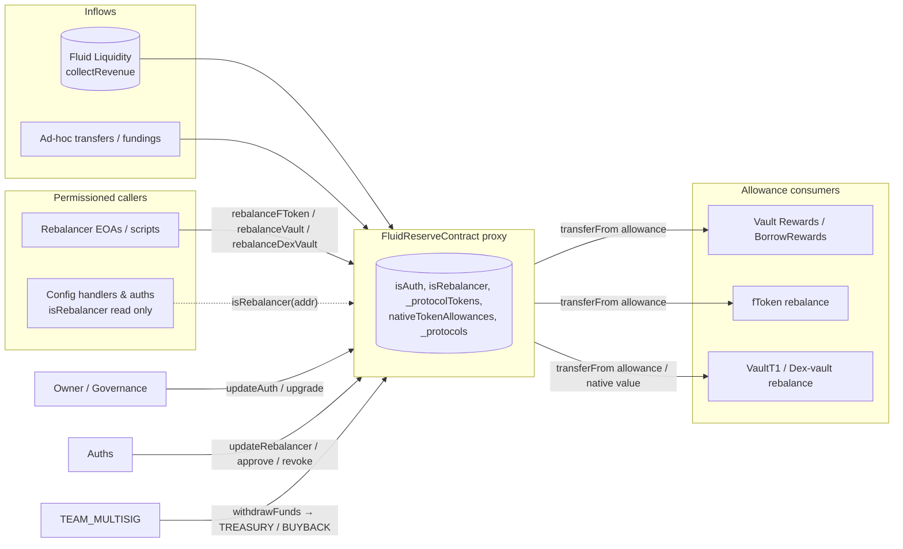

# Reserve — SPEC

## 1. Purpose

`FluidReserveContract` is the Fluid protocol's **treasury / approved-spender hub**:

- **Treasury sink.** Receives tokens from anywhere revenue is swept to — primarily Liquidity's `collectRevenue` path (via the governance-configured `_revenueCollector`; see [liquidity/SPEC.md](../liquidity/SPEC.md)), plus any ad-hoc funding / donations. Holds native ETH and ERC-20 balances indefinitely until moved out by governance.
- **Approved-spender for protocols.** Grants scoped ERC-20 allowances (or a native-token allowance slot) to specific protocol addresses that need to draw from the treasury — e.g. vault `rebalance` paying back / depositing on behalf of Liquidity, rewards vaults borrowing to pay out incentives, fTokens pulling supply to top up.
- **Rebalancer cockpit.** Single on-chain whitelist (`isRebalancer`) consulted by every permissionless-ish operational hook in the stack: vault `Rewards` / `BorrowRewards` (`rebalance()`), every config handler under [`contracts/config/`](../config/SPEC.md) (`rebalance()` / `rebalanceWithdrawalLimit` / `collectRevenue` / `listToken` / …), and the reserve's own `rebalanceFToken` / `rebalanceVault` / `rebalanceDexVault` drain-and-refill helpers.
- **Governance-only exit.** Funds can only leave the contract through `withdrawFunds`, which is multisig-gated and (when the caller is the multisig rather than the owner) restricted to two hard-coded destinations: `TREASURY_ADDRESS` or `BUYBACK_CONTRACT_ADDRESS`.

Deployed as a UUPS ERC-1967 proxy (`FluidReserveContractProxy` → `FluidReserveContract` logic). Upgrade authority is the owner (governance).

## 2. Architecture & Data Flow

Data flow summary:

1. **Accrual.** Revenue accrues inside Liquidity (fee share on `supplyExchangePrice` / `borrowExchangePrice` via `LiquidityCalcs`). When `_revenueCollector` is set to the reserve, `IFluidLiquidity.collectRevenue(tokens[])` transfers the accrued delta to `FluidReserveContract` (trigger wrapper: [`config/collectRevenueAuth`](../config/SPEC.md#5-collectrevenueauth)).
2. **Approval.** An auth calls `approve([protocol], [token], [amount])` to grant the protocol a scoped ERC-20 allowance (or set a per-protocol native-token allowance slot used by internal `rebalance*` helpers).
3. **Drawdown.** The protocol draws via the standard ERC-20 `transferFrom` path — either indirectly (reserve's own `rebalanceFToken` / `rebalanceVault` / `rebalanceDexVault` forwarding `msg.value` and accounting native allowance) or directly (`IERC20(token).transferFrom(reserve, ...)` from within its own logic).
4. **Drain.** Governance removes value via `withdrawFunds(tokens[], amounts[], receiver, reason)` with multisig-hardened receiver constraints.

## 3. External Interactions

| Counterparty | Direction | Path | Purpose |
| --- | --- | --- | --- |
| Fluid Liquidity | Reserve ← Liquidity | Set as `_revenueCollector` on Liquidity; `IFluidLiquidity.collectRevenue(tokens)` called via [`collectRevenueAuth`](../config/SPEC.md#5-collectrevenueauth) | Revenue sweep. |
| `IFTokenAdmin(protocol_).rebalance()` | Reserve → fToken | `rebalanceFToken` | Push native/tokens into fToken to reconcile supply. |
| `IFluidVaultT1(protocol_).rebalance()` | Reserve → VaultT1 | `rebalanceVault` | Pay back / deposit on VaultT1 side. |
| `IFluidVault(protocol_).rebalance(c0,c1,d0,d1)` | Reserve → dex-vault | `rebalanceDexVault` | Two-sided dex-vault rebalance. |
| Any ERC-20 (`approve`) / native (`nativeTokenAllowances`) consumer | Reserve → protocol | `SafeERC20.safeApprove` or internal slot | Allowance-gated draws (rewards, config handlers, …). |
| Config handlers + auths | Reserve ← read-only | `isRebalancer(addr) view` | Single source of truth for rebalancer identity across the whole stack (see [`../config/SPEC.md`](../config/SPEC.md#31-config-handler-pattern-ifluidconfighandler)). |
| `TREASURY_ADDRESS` / `BUYBACK_CONTRACT_ADDRESS` | Reserve → EOA/contract | `withdrawFunds` | Only non-governance egress destinations. |

`receive() external payable` is open (needed so `*.rebalance()` callees can refund native, and so donations / funding succeed).

## 4. Roles & Access Control

| Role | Source of truth | Can do |
| --- | --- | --- |
| **Owner** | `OwnableUpgradeable._owner` (set in `initialize`) | UUPS upgrade (`_authorizeUpgrade`), `updateAuth`, and implicitly everything `onlyAuth` / `onlyMultisig` (the modifiers both accept `owner()`). |
| **Auth** | `mapping(address => bool) isAuth` | `updateRebalancer`, `approve`, `revoke`. |
| **Rebalancer** | `mapping(address => bool) isRebalancer` | `rebalanceFToken` / `rebalanceVault` / `rebalanceDexVault` (and their batch forms via `rebalanceFTokens` / `rebalanceVaults` / `rebalanceDexVaults`). Also read by every external config handler / auth across the stack as `isRebalancer(msg.sender)`. |
| **Team multisig** | `constant TEAM_MULTISIG = 0x4F6F977aCDD1177DCD81aB83074855EcB9C2D49e` | `withdrawFunds` to `TREASURY_ADDRESS` or `BUYBACK_CONTRACT_ADDRESS` only. |

### Modifiers

| Modifier | Who passes | Used by |
| --- | --- | --- |
| `onlyOwner` (from `OwnableUpgradeable`) | `owner()` | `updateAuth`, `_authorizeUpgrade`, `renounceOwnership` (but always reverts). |
| `onlyAuth` | `isAuth[msg.sender]` **or** `owner()` | `updateRebalancer`, `approve`, `revoke`. |
| `onlyMultisig` | `TEAM_MULTISIG` **or** `owner()` | `withdrawFunds`. |
| `onlyRebalancer` | `isRebalancer[msg.sender]` (no owner bypass) | `rebalanceFToken`, `rebalanceVault`, `rebalanceDexVault`. |
| `validAddress(x)` | `x != address(0)` | `updateAuth`, `updateRebalancer`, `initialize(owner_)`. |

**Note.** `onlyRebalancer` — unlike the other gates — has **no owner / multisig bypass**. Governance wanting to trigger a rebalance must first register itself as a rebalancer (or use a non-reserve path).

The permissioning chain is intentionally tiered: `owner → auth → rebalancer`. Owner grants auth. Auth grants rebalancer + scoped allowances. Rebalancer spends.

### Auth handler helper

`contracts/reserve/auth/main.sol` (`FluidReserveContractAuthHandler`) — thin standalone contract that lets `TEAM_MULTISIG` proxy through `updateRebalancer` calls. Hardcodes `RESERVE = 0x264786EF916af64a1DB19F513F24a3681734ce92` (mainnet reserve proxy) and `TEAM_MULTISIG = 0x4F6F...D49e`. To work it must first be registered on the reserve as an `isAuth` (so its `RESERVE.updateRebalancer(...)` call passes the reserve's `onlyAuth` gate).

## 5. Storage Layout

`FluidReserveContract` inherits: `Initializable` (slot 0) → `OwnableUpgradeable` (`ContextUpgradeable __gap[50]` slots 1-50; `_owner` at 51; `__gap[49]` slots 52-100) → `Variables` (slot 101+) → `ReserveContractAuth` → `UUPSUpgradeable`.

| Slot (approx.) | Member | Type | Meaning |
| --- | --- | --- | --- |
| 101 | `isAuth` | `mapping(address => bool)` (public) | Addresses allowed to grant/revoke approvals and rotate rebalancers. |
| 102 | `isRebalancer` | `mapping(address => bool)` (public) | Addresses allowed to call reserve `rebalance*` methods **and** all external rebalancer-gated methods across the codebase. |
| 103 | `_protocolTokens` | `mapping(address => EnumerableSet.AddressSet)` | Per-protocol set of currently-approved token addresses (tracks both ERC-20 approvals and the native-token sentinel). |
| 104 | `nativeTokenAllowances` | `mapping(address => uint256)` (public) | Per-protocol native-ETH allowance (no ERC-20 `approve` primitive for native — tracked internally and debited by `rebalance*`). |
| 105 | `_protocols` | `EnumerableSet.AddressSet` | All protocols that have (or had) at least one approved token — populated by `approve`, pruned by `revoke` when the per-protocol token set empties. |

Immutables (constructor-set, stored in code):

| Immutable | Source |
| --- | --- |
| `TREASURY_ADDRESS` | constructor `treasuryAddress_` |
| `BUYBACK_CONTRACT_ADDRESS` | constructor `buybackContractAddress_` |

Constants:

| Constant | Value |
| --- | --- |
| `NATIVE_TOKEN_ADDRESS` | `0xEeeeeEeeeEeEeeEeEeEeeEEEeeeeEeeeeeeeEEeE` |
| `TEAM_MULTISIG` | `0x4F6F977aCDD1177DCD81aB83074855EcB9C2D49e` |

`initialize(_auths, _rebalancers, owner_)` — seeds `isAuth[...]` / `isRebalancer[...]`, transfers ownership, emits `LogUpdateAuth` / `LogUpdateRebalancer` per entry. Guarded by OZ `initializer`; `_disableInitializers()` is called in the logic-contract constructor.

## 6. Public Methods

### Rebalancer-gated (operational)

| Method | Signature | Behaviour / edge cases |
| --- | --- | --- |
| `rebalanceFToken` | `(address protocol, uint256 value) payable onlyRebalancer` | If `value > 0`: debits `nativeTokenAllowances[protocol]` by `value` (reverts `InsufficientAllowance` if short). Calls `IFTokenAdmin(protocol).rebalance{value: value}()` → returns `amount`. Emits `LogRebalanceFToken`. |
| `rebalanceVault` | `(address protocol, uint256 value) payable onlyRebalancer` | Same native-allowance debit. Calls `IFluidVaultT1.rebalance{value}()` → `(colAmount, debtAmount)`. When `value > 0`, *asserts* that the vault's supply- or borrow-side is the native token **and** the signs of `colAmount`/`debtAmount` are consistent with sending native in (supply-side native must not be withdrawing; borrow-side native must not be borrowing). Any mismatch reverts `WrongValueSent`. Emits `LogRebalanceVault`. |
| `rebalanceDexVault` | `(address protocol, uint256 value, int c0, int c1, int d0, int d1) payable onlyRebalancer` | Two-sided dex-vault rebalance via `IFluidVault.rebalance{value}(c0, c1, d0, d1)`. Debits `nativeTokenAllowances[protocol]` only by the **actually consumed** native (`initialBalance - address(this).balance - msg.value`), and only when either `colAmount > 0` (deposit happened) or `debtAmount < 0` (payback happened). Allows the vault to refund unused native back to the reserve without touching the allowance. Emits `LogRebalanceVault`. |
| `rebalanceFTokens` / `rebalanceVaults` / `rebalanceDexVaults` | batch forms | Length-check all arrays; forward per index. Auth is re-checked on each inner call — the batch entrypoint itself is un-gated by design (`// don't need onlyRebalancer modifier as it is already checked in`). |

### Views

| Method | Return |
| --- | --- |
| `getProtocolTokens(address protocol) view → address[]` | Current approved token set for `protocol` (includes `NATIVE_TOKEN_ADDRESS` sentinel if a native allowance exists). |
| `getProtocolAllowances(address protocol) view → TokenAllowance[]` | Per token: real ERC-20 `allowance(reserve, protocol)`, or stored `nativeTokenAllowances[protocol]` for native. |
| `getAllProtocolAllowances() view → ProtocolTokenAllowance[]` | Same for every protocol in `_protocols`. O(N·M). |
| `isAuth(addr) view` / `isRebalancer(addr) view` / `nativeTokenAllowances(addr) view` | Public mapping getters. |
| `TREASURY_ADDRESS()` / `BUYBACK_CONTRACT_ADDRESS()` | Immutable getters. |

### Fallback

`receive() external payable {}` — accepts native-token refunds from protocol `rebalance` returns and any direct funding. No emission.

## 7. Admin Methods

| Method | Gate | Side effects |
| --- | --- | --- |
| `initialize(address[] _auths, address[] _rebalancers, address owner_)` | `initializer`, `validAddress(owner_)` | Seeds `isAuth` / `isRebalancer`, transfers ownership. `_disableInitializers()` on the logic contract blocks direct logic-layer init. |
| `updateAuth(address auth, bool isAuth)` | `onlyOwner`, `validAddress(auth)` | Flips `isAuth[auth]`. Emits `LogUpdateAuth`. |
| `updateRebalancer(address rebalancer, bool isRebalancer)` | `onlyAuth`, `validAddress(rebalancer)` | Flips `isRebalancer[rebalancer]`. Emits `LogUpdateRebalancer`. |
| `approve(address[] protocols, address[] tokens, uint256[] amounts)` | `onlyAuth` | Parallel-array. **Non-native**: `safeApprove(token, protocol, 0)` then `safeApprove(token, protocol, amount)` — the "zero first then re-approve" dance avoids the USDT-style non-zero-to-non-zero revert path. **Native**: writes `nativeTokenAllowances[protocol] = amount` (does not consult any prior value in the existing allowance getter). Adds `token` to `_protocolTokens[protocol]` and adds `protocol` to `_protocols` (idempotent via `EnumerableSet`). Emits `LogAllow(protocol, token, newAllowance, existingAllowance)` — where `existingAllowance` is the real prior `IERC20.allowance` (or prior native slot). Reverts `InvalidInputLenghts` on length mismatch. |
| `revoke(address[] protocols, address[] tokens)` | `onlyAuth` | **Non-native**: `safeApprove(token, protocol, 0)`. **Native**: `nativeTokenAllowances[protocol] = 0`. Removes `token` from `_protocolTokens[protocol]`; if that set becomes empty, also removes `protocol` from `_protocols`. Emits `LogRevoke`. |
| `withdrawFunds(address[] tokens, uint256[] amounts, address receiver, string reason)` | `onlyMultisig` | Multisig-only egress. **Receiver rule**: if `receiver == address(0)` → revert; if `msg.sender == TEAM_MULTISIG`, receiver must equal `TREASURY_ADDRESS` **or** `BUYBACK_CONTRACT_ADDRESS`. The owner bypasses that list (owner can send to any non-zero receiver). Iterates tokens: native → `SafeTransfer.safeTransferNative(receiver, amount)` (50k-gas-capped native send); ERC-20 → `SafeTransfer.safeTransfer(token, receiver, amount)`. Emits `LogWithdrawFunds` **per token** (reason included verbatim, intended for off-chain audit trail). |
| `renounceOwnership()` | `onlyOwner`, `view` (always reverts) | Hard-disabled — reverts `RenounceOwnershipUnsupported` to prevent orphaning the contract. |
| `upgradeTo(address)` / `upgradeToAndCall(address, bytes)` | via `_authorizeUpgrade` → `onlyOwner` | UUPS upgrade entry points inherited from `UUPSUpgradeable`. |

There is no `rescueTokens`: `withdrawFunds` already doubles as the rescue path (multisig can extract any stuck ERC-20 / native to Treasury or Buyback; owner can extract anywhere).

## 8. Events

All declared in `contracts/reserve/events.sol`:

| Event | Emitted by | Fields |
| --- | --- | --- |
| `LogUpdateAuth` | `updateAuth`, `initialize` | `(address indexed auth, bool isAuth)` |
| `LogUpdateRebalancer` | `updateRebalancer`, `initialize` | `(address indexed rebalancer, bool isRebalancer)` |
| `LogAllow` | `approve` | `(address indexed protocol, address indexed token, uint256 newAllowance, uint256 existingAllowance)` |
| `LogRevoke` | `revoke` | `(address indexed protocol, address indexed token)` |
| `LogRebalanceFToken` | `rebalanceFToken` | `(address indexed protocol, uint256 amount)` |
| `LogRebalanceVault` | `rebalanceVault`, `rebalanceDexVault` | `(address indexed protocol, int256 colAmount, int256 debtAmount)` |
| `LogWithdrawFunds` | `withdrawFunds` | `(address indexed token, uint256 indexed amount, address receiver, string reason)` |
| `LogTransferFunds` | *(declared; unused in current main.sol)* | `(address indexed token)` — legacy from pre-`withdrawFunds` design. |

## 9. Errors

`error FluidReserveContractError(uint256 errorId_)` in `error.sol`. Codes in `errorTypes.sol`:

| Code | Name | When |
| --- | --- | --- |
| 90001 | `ReserveContract__Unauthorized` | Caller failed `onlyAuth` / `onlyMultisig` / `onlyRebalancer`; also raised from `withdrawFunds` when multisig targets a non-allowed receiver or `receiver == address(0)`. |
| 90002 | `ReserveContract__AddressZero` | `validAddress` reject in `updateAuth` / `updateRebalancer` / `initialize(owner_)`. |
| 90003 | `ReserveContract__InvalidInputLenghts` | Parallel-array length mismatch in `approve` / `revoke` / `withdrawFunds` / `rebalance*s`. |
| 90004 | `ReserveContract__RenounceOwnershipUnsupported` | `renounceOwnership` was called. |
| 90005 | `ReserveContract__WrongValueSent` | `rebalanceVault` sanity check on native side (value sent but neither side is native, or the signs of returned amounts don't match a native-in operation). |
| 90006 | `ReserveContract__InsufficientAllowance` | `rebalanceFToken` / `rebalanceVault` / `rebalanceDexVault` with `value > nativeTokenAllowances[protocol]`. |

Note the spelling: `InvalidInputLenghts` (sic) — kept for on-chain ABI stability.

## 10. Invariants & Safety Notes

- **No non-governance egress.** Funds can only leave via `withdrawFunds` (multisig/owner) or via scoped ERC-20 `transferFrom` from allowance holders. There is no `transfer` helper, no unguarded `call`, no arbitrary-selector `execute`. The rebalance hooks call only three fixed selectors on the target (`IFTokenAdmin.rebalance`, `IFluidVaultT1.rebalance`, `IFluidVault.rebalance`).
- **Allowance is the only attack surface for rebalancers.** A rebalancer can only: (a) trigger `rebalance` on an `fToken` / vault the auth previously approved, (b) cause up-to-`nativeTokenAllowances[protocol]` native ETH to flow into that call. Cannot freely transfer treasury funds; cannot grant new allowances (that's auth-gated).
- **Native allowance is spent tightly.** `rebalanceFToken` / `rebalanceVault` **always** debit `value` up-front (even if the underlying rebalance ends up not needing it, which would only happen in exceptional flows). `rebalanceDexVault` only debits the actually-consumed delta — `initialBalance - address(this).balance`, further decremented by `msg.value`, so refunded native replenishes the pool without incorrectly crediting the allowance.
- **USDT-style approval safety.** `approve` always resets to zero before re-approving a non-native token, so stateful ERC-20s that disallow non-zero-to-non-zero transitions are supported.
- **`receive` is intentionally open.** Necessary so protocol `rebalance` calls can refund unspent ETH. Funds flowing in never emit events — observability relies on the next `rebalance*` / `withdrawFunds` cycle.
- **Upgradeability.** UUPS; `_authorizeUpgrade` is `onlyOwner`. Storage gap: `Initializable` + OZ gap gives 100 slots before the Reserve's own layout starts at slot 101 — any inherited-contract storage additions must respect this gap.
- **`renounceOwnership` disabled.** Prevents `owner = 0` bricking — upgrade, `updateAuth`, and `withdrawFunds` (owner branch) all require a live owner.
- **Batch rebalancers are intentionally un-gated at the entry.** `rebalanceFTokens` / `rebalanceVaults` / `rebalanceDexVaults` forward to their per-item counterparts; the underlying call re-checks `onlyRebalancer`. This means a non-rebalancer calling the batch entry hits the gate on iteration 0, wasting the surrounding tx but not mutating state.
- **Auth handler depends on reserve registration.** `FluidReserveContractAuthHandler` is useless until it is itself registered as `isAuth[handler] = true` on the proxy — the handler's `RESERVE.updateRebalancer(...)` otherwise reverts with `Unauthorized` (90001).

## 11. Trust Model

- **Root of trust**: contract `owner()` (governance). Can upgrade the logic, add/remove auths, and (via the `onlyMultisig` owner bypass) withdraw funds to any non-zero address.
- **Second tier**: the hard-coded `TEAM_MULTISIG = 0x4F6F...D49e`. Can `withdrawFunds` but **only** to `TREASURY_ADDRESS` or `BUYBACK_CONTRACT_ADDRESS`. Cannot add auths, cannot upgrade, cannot grant allowances.
- **Third tier — Auths**: the day-to-day "treasury ops" role. Can grant / revoke protocol allowances and rotate rebalancers. Cannot withdraw or upgrade. Compromise scope: an attacker can drain the reserve only to the extent of an approved `protocol`'s willingness to let `transferFrom` flow, which in practice is bounded by each protocol's own code surface.
- **Fourth tier — Rebalancers**: narrowest. Can only call the three `rebalance*` methods on an already-approved `protocol` with already-allocated native. No read-write powers beyond `nativeTokenAllowances` debits. This is the role used by external `rebalance()` scripts and by every config-handler gate in [`contracts/config/`](../config/SPEC.md#31-config-handler-pattern-ifluidconfighandler).
- **Delegated trust**: because every `rebalance` / `collectRevenue` / rate-limit path in the codebase reads `RESERVE_CONTRACT.isRebalancer(msg.sender)`, changing that mapping has **global** effect. A single compromised auth can elevate an attacker to a rebalancer everywhere — in vault rewards rotation, in fee-handler pushes, in withdraw-limit nudges, in listing new tokens via [`liquidityTokenAuth`](../config/liquidityTokenAuth/SPEC.md), in [`collectRevenueAuth`](../config/SPEC.md#5-collectrevenueauth). This is the single most load-bearing mapping in the reserve.
- **Replacement**: not drop-in. The reserve address is burned into the immutables / constants of every `RESERVE_CONTRACT`-using contract across the codebase (auths, handlers, rewards). Switching to a new reserve requires redeploying those consumers too; the proxy is preserved specifically to avoid that — upgrades happen in-place.

## 12. Deployment & Audit Notes

### Deployment checklist

1. Deploy `FluidReserveContract` logic with `(treasuryAddress_, buybackContractAddress_)`. `_disableInitializers()` runs in the constructor.
2. Deploy `FluidReserveContractProxy(logic, initCalldata)` where `initCalldata` encodes `initialize([auths], [rebalancers], owner)`.
3. On Liquidity: `updateRevenueCollector(reserveProxy)` so `collectRevenue` sweeps here.
4. Register `collectRevenueAuth` as an auth on Liquidity (see [`../config/SPEC.md#5-collectrevenueauth`](../config/SPEC.md#5-collectrevenueauth)) so someone can actually trigger the sweep.
5. Wire `RESERVE_CONTRACT` constructor arg on every downstream consumer (vault rewards, vault borrowRewards, every `config/*Handler` / `config/*Auth`, liquidation periphery where applicable). These references are immutable — wrong address means a redeploy.
6. `approve(protocols, tokens, amounts)` per (protocol, token) pair the treasury should fund — typically rewards vaults, fTokens, and the vaults themselves.
7. Register the `FluidReserveContractAuthHandler` as an auth (optional — only needed if you want the team multisig to be able to hot-rotate rebalancers without going through a full governance tx).

### Mainnet addresses (for reference)

- Reserve proxy (referenced by auth handler): `0x264786EF916af64a1DB19F513F24a3681734ce92`.
- Team multisig: `0x4F6F977aCDD1177DCD81aB83074855EcB9C2D49e`.

### Audit notes

- **No reentrancy guards** on `rebalance*` despite the `external-call-then-debit-native` pattern, because (a) native debit happens *before* the external call, (b) ERC-20 allowance pulls happen inside the protocol call under its own reentrancy regime, and (c) `EnumerableSet` additions in `approve` are O(log n) but idempotent. A reentrant callback from the vault/fToken back into the reserve can only hit `rebalance*` (reverts unless the callback has `isRebalancer` set) or `receive` (no-op) — both safe.
- **`InvalidInputLenghts` typo** is intentional to preserve ABI / error selector stability post-audit.
- **Interface drift.** `interfaces/iReserveContract.sol` still declares `initialize(..., IFluidLiquidity, address)` (older 4-arg signature) and `transferFunds(address)`; the current implementation uses `initialize(_auths, _rebalancers, owner_)` and `withdrawFunds(...)`. External callers that integrate against this interface should regenerate against the current ABI. The unused `LogTransferFunds` event is a similar legacy remnant.
- **Owner branch of `onlyMultisig`** lets the owner withdraw to any non-zero address, which is intentional (governance override). Post-audit dispositions confirmed this is the desired escape hatch — the team-multisig-to-treasury-or-buyback restriction is the hot-wallet scope, not the governance scope.
- **`rebalanceVault` native assertions** are defensive: they guarantee that if `value > 0` the vault's token topology actually uses native on the side being funded. This prevents silently dropping ETH into vaults whose `supplyToken` / `borrowToken` are non-native (in which case the rebalance wouldn't consume it and it would sit idle — but, crucially, the allowance would already have been debited).
- **`collectRevenue` is not initiated by the reserve itself** — it's a pull from outside via `collectRevenueAuth`. The reserve is a passive sink for that pattern, which matches the "never initiate external calls the auth model doesn't authorize" principle.
