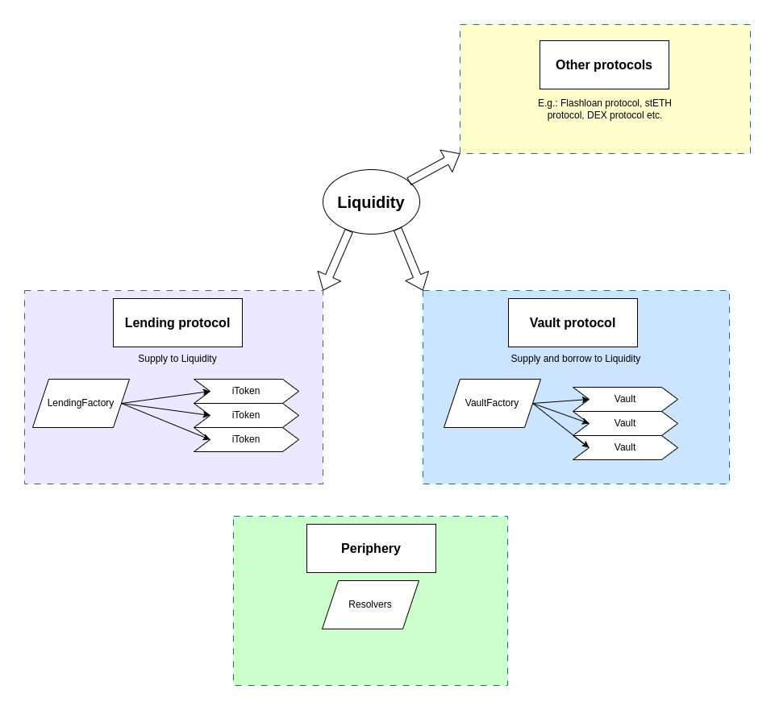

# Fluid technical docs

Instadapp Fluid is a combination of DeFi protocols with a Liquidity layer at the core. New protocols will be added to the architecture over time with liquidity automatically being available to those newer protocols.

### Architecture overview

"Liquidity" is at the center of Fluid. It's the core contract that holds all funds and only interacts with protocols built on top of it, not end users.
The first protocols built on top of it are the Lending protocol (fToken) and Vault protocol. The Lending protocol implements an easy way to supply to Liquidity via ERC4626 compliant fTokens. The Vault protocol implements a way to supply and borrow funds, a typical borrow / lending functionality based on collateral value fetched through an Oracle.

fTokens are created by the `LendingFactory`, Vaults are created by the `VaultFactory`.

View methods are located outside of the core contracts, as periphery resolver contracts.

The liquidity uses the Instadapp Infinite proxy: https://github.com/Instadapp/infinite-proxy.

### General info

- "raw" amounts refer to amounts that must be multiplied with exchange price to get to actual token amounts (e.g. with interest mode amounts)
- "normal" amounts are already at normal token amounts (e.g. interest free mode amounts)

- a "User" for the Liquidity contract is generally a protocol built on top of it (e.g. an fToken, or Vault).

- Fluid puts high value on gas optimization, which has effects to the overall codebase, such as things mentioned further below.

- `0xEeeeeEeeeEeEeeEeEeEeeEEEeeeeEeeeeeeeEEeE` as token address input refers to the native token (ETH or MATIC etc.)

- utilization can be > 100% either because of rounding imprecision issues or because borrow rate > supply rate (due to revenue cut), meaning borrowings is increasing at a greater pace then supply.

- for all protocols, particularly ones with few users like e.g. StETH protocol, it is recommended to seed the balance with a dust amount to avoid reverts because of minor imprecision errors. Note that this is part of the deployment process, see `deployment.md`.

#### Errors

Errors are implemented throughout the whole codebase in the way as described in `errors.md`. The specific error cause can be found by searching for the error code in the codebase.

#### Gas optimizations

- "temp\_" variable often used in code is on purpose to reduce memory gas cost. Reusing the same memory slot over and over again instead of allocating new memory slots. We are aware of the readability impacts this has, balancing out with code comments.

- storage vars are packed to reduce gas cost. In the case of e.g. Liquidity & Vault, this is done down to the detail of individual bits:
- writing stacked uint values to storage is done by first resetting the bits that need to be updated with a `& mask` and then adding all values with `| value`, where each value is shifted to the correct position where it should be inserted with e.g. `<< startBitPos`.
- reading stacked values from storage is done by shifting and mask, e.g. `>> startBitPos` and then `& mask`

#### BigMath

- BigMath Numbers are used to reduce storage requirements for numeric values with the trade-off of very little, predictable and acceptable precision loss. Those values are read and written from / to storage with the specific "BigMath" library which works by reducing a big number to coefficient and exponent.
- No storage overflow checks are needed for BigNumbers that are written to storage, as the returned size of a BigMath `toBigNumber` result will always fit the expected bit size.
- BigMath usage leads to some precision loss, a barely noticeable fee for user because the protocol ensures to be on the right side of the precision loss to stay liquid and avoid reverts due to minimal rounding differences. This can be seen as an extension of rounding up / rounding down. E.g. Liquidity acts in the following way:
  - supply amounts -> round down
  - user borrow amounts -> round up
  - total borrow amounts -> round up
  - limits -> round down
  - Special case: withdrawal limit is also rounded down which should be rounded up as it tracks the amount that must stay supplied, not the amount that is withdrawable. but rounding up creates precision issues that can lead to reverts. Rounding down here instead is not really a problem, such a tiny increase in the withdrawal limit does not affect protocol security.
- E.g. Big Math Precision is 7.2057594e16 (for a coefficient size of 56 bits). Numbers bigger than this will be affected by precision loss.
- This rounding can have effects such as: Sum of all user borrow amounts could be > total borrowed amount because of above explained rounding behavior. If payback > total borrow, then total borrow is set to 0. Same for total supply / user supply amounts: if withdraw > total supply, then total supply is set to 0.
- This rounding is also the reason why we seed any new protocol with some initial deposit / borrow for the tokens it uses, so no reverts happen because of otherwise irrelevant imprecision issues.

#### Adding configs flow

- There are checks in place that would revert on very high token amounts, e.g. Liquidity `operate()` does not accept values higher than max int 128. Very high token amounts could lead to unexpected overflows so no such taken should be listed. Amounts of up until ~1e70 are safe, currently no such (legit) token exists that would require operations with such high amounts.

- process to list a token at Liquidity is: 1. Set rate config for token 2. Set token config (set max utilization to 1e4 for gas-optimized default max utilization of 100%!) 3. allow any user (protocol). If done in any other order, an error is thrown.
- For ensuring vault protocol works smoothly, we must avoid listing tokens where the following would be true:

  - high collateral token decimals
  - low debt token decimals
  - high debt value
  - exchange price diff expectations of the pair over time (e.g. supplyExchangePrice grows faster than borrowExchangePrice)
  - Example could be $1M BTC then oracle price w.r.t DAI will be 1e43 (1e18 _ 1e6 _ 1e27 / 1e8). Bigger than 1e45 will cause issues.

- process to create a new Lending fToken is: 1. set up config for underlying asset at Liqudity 2. deploy fToken via LendingFactory `createToken()` 3. configure user supply config at Liquidity.

- for the NativeUnderlying fToken the expected asset address for `weth_` is the WETH token address (or WMATIC for polygon etc.), not 0xEeeeeEeeeEeEeeEeEeEeeEEEeeeeEeeeeeeeEEeE.

- adding new fTokens / vault deployments happens via the dedicated deployment scripts.

### Liquidity: Limits

- borrowing limit expands in steps, starting from `baseDebtCeiling` by `expandPercentage` over `expandDuration` up to `maxDebtCeiling`
- withdrawal limit: above user supply of `baseWithdrawalLimit`, withdrawals are controlled: a user can withdraw `expandPercentage` of the user supply after `expandDuration` (the withdrawable amount increases during `expandDuration`).
- terms "debt ceiling" and "borrow limit" are used synonymous

#### Withdrawal limit

Deposits help reach the fully expanded withdrawal limit, if the deposit is big enough it can make this happen instantly.
Withdrawals trigger further expansion of the withdrawal limit, starting from the lastWithdrawal limit to the fully expanded amount.

E.g. with configs:

- Expand percent = 20%
- Expand duration = 200 sec
- Base withdrawal limit is 5.

Some scenarios:

- Multiple withdrawals scenario: Starting with user's deposit is 15 and withdrawal limit before operation is 12 (fully expanded).
- New withdrawal of 2 -> down to 13. withdrawal limit will expand from previous limit (12) down to full expansion of 13 \* 0.8 -> 10.4.
- Instant withdrawal right after this operation of an amount > 1 would revert.
- Assuming 100 sec passed (half expand duration). Withdrawal limit would be 12 - (13 \* 0.1) -> 10.7.
- Assuming 150 sec passed. Withdrawal limit would be 12 - (13 \* 0.15) -> 10.05, which is below maximum expansion of 10.4 so the actual limit is 10.4.
- Further withdrawals will trigger a new expansion process.

- Other scenarios: If user's supply is below 5 then limit will be 0 (meaning user can withdraw fully).
- New deposit of 5.5: If user supply is 5.5 then withdrawal limit is 5.5 \* 0.8 = 4.4 (instantly expanded 20% because of new deposit).
- New withdrawal of 0.6 down to 4.9: If someone withdraws below base limit then the new limit set at the end of the operation will instantly be 0 and user's can withdraw down to 0. So if the current user supply minus the withdrawable amount is below the base withdrawal limit, this has the effect that essentially the full user supply amount is withdrawable. It just happens in two steps: first a withdrawal to below base limit -> triggers new limit becoming 0 -> full rest amount is withdrawable. This is not super elegant but it allows for a easy implementation that serves the desired purpose good enough.

- New scenario: user's deposit is 6 and withdrawal limit before operation is 5.5, if someone supplies 0.5 (total supply = 6.5) -> the limit will remain as 5.5 and expand from there to the full 20% expansion -> 5.2.
- If user's deposit is 6 and withdrawal limit is 5.5 and someone supplies 1 (total supply = 7) -> now the new limit will become 5.6 (20% of total deposits) instantly.

A special case is the first time that the user supply amount comes above the base withdrawal limit: the withdrawal limit immediately becomes the fully expanded withdrawal limit. So this acts like a big deposit that would immediately "fill" the full expanded withdrawal limit. This is a known and acceptable behavior for the withdrawal limit as it does not negatively affect the desired goal of the limit whilst keeping the implementation logic simple.

#### Borrow limit

Paybacks help reach the fully expanded borrow limit, if the payback is big enough it can make this happen instantly.
Borrows trigger further expansion of the borrow limit, starting from the last borrow limit to the fully expanded amount.
Borrow limit has a hard max limit, above which expansion is never possible.

E.g. with configs:

- Expand percent = 20%
- Expand duration = 200 sec
- Base borrow limit is 5.
- Max borrow limit is 7.

Some scenarios:

- User can always borrow up until base borrow limit of 5.
- New borrow of 4.5 (to total borrow of 4.5): would trigger expansion to above base limit (at fully expanded after 200 seconds 4.5 \* 1.2 = 5.4).
- Assuming full expand duration passed, new borrow of 0.5 to total borrow of 5 -> triggers expansion from 5.4 to 6 (full expansion: 5 \* 1.2 = 6).
- After half duration passed, borrow limit would be lastBorrowLimit + halfExpandedLimit = 5.4 + 0.5 -> 5.9.
- Assuming full expand duration passed, new borrow of 1 to total borrow of 6 -> triggers expansion from 5.9 to 7.2 (full expansion: 6 \* 1.2 = 7.2). Note that this would be above max limit.
- Even after full expansion, the limit will be hard capped at max limit of 7. User borrow of 1.01 to 7.01 would revert.
- Assuming full expand duration passed, new borrow of 1 to max limit 7 total borrow. No higher borrow amount is ever possible (unless max limit config is changed).
- Payback of 1.5 down to 5.5 total borrow. Shrinking to fully expanded borrow limit of 5.5 \* 1.2 = 6.6 is immediately active.
- Assuming no time passed -> borrow of 1.11 would revert.
- Assuming no time passed -> Borrow of 0.1 to total borrow of 5.6 triggers expansion from 6.6 to 6.72 (full expansion: 5.6 \* 1.2 = 6.72).
- After half duration, borrow limit would be 6.6 + 0.56 -> 7.16 which is above fully expanded so limit will be 6.72.
- Payback of 5.6 down to 0. Shrinking of new borrow limit to base limit of 5 happens instantly.

### Vault protocol

See Whitepaper: https://fluid.guides.instadapp.io/vault-protocol-whitepaper
